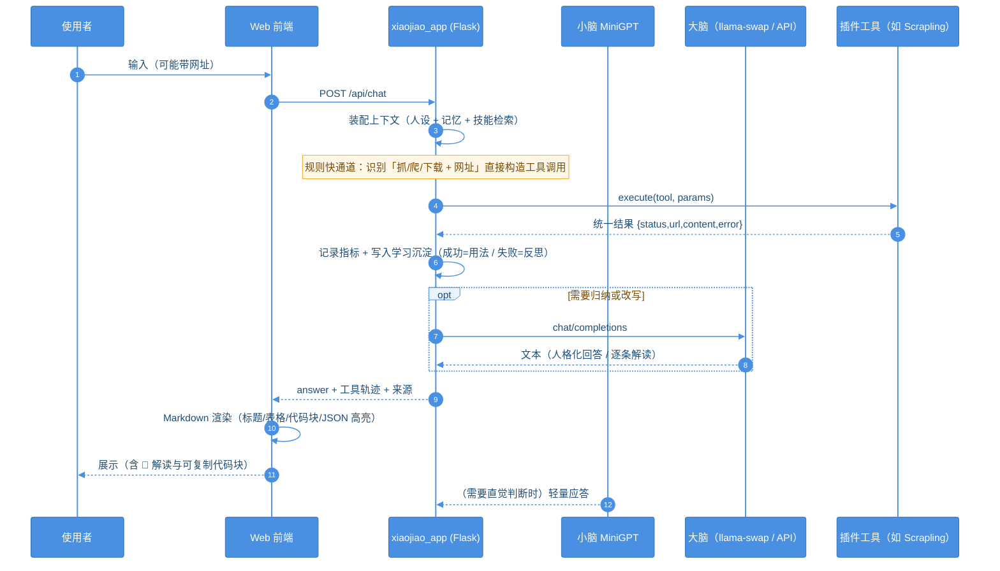
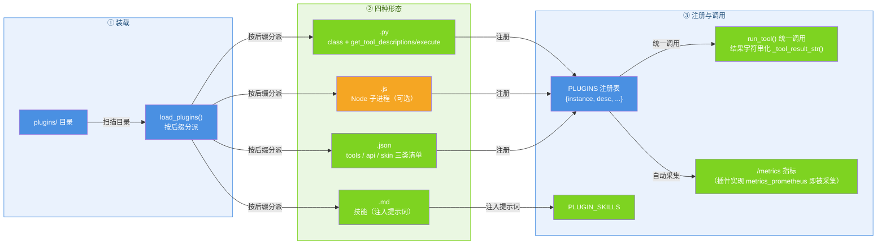
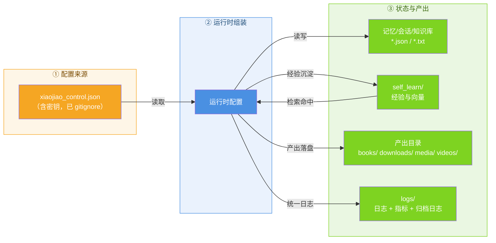
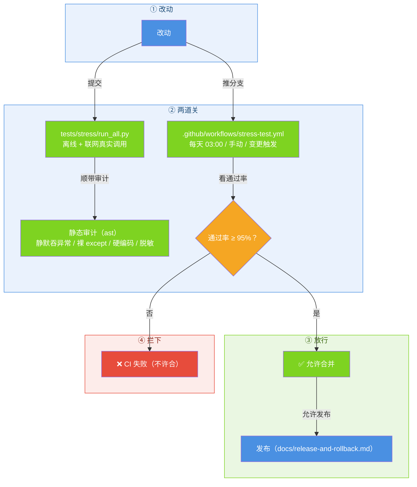

# 小焦 · 架构说明（ARCHITECTURE）

> 这份文档回答三个问题：**它由哪些部分组成**、**一次请求怎么流过**、**想扩展时该改哪里**。
> 与代码保持同步：文中出现的文件名/函数名都可在仓库里直接搜到。

---

## 1. 设计目标（决定了架构长什么样）

| 目标 | 架构上的体现 |
| --- | --- |
| **本地优先、断网可用** | 大脑/小脑都能本地跑；云端 API 只是可选项（`brain.api`） |
| **换模型不改代码** | 大脑走 OpenAI 兼容协议；小脑三件套路径三级解析（env → 配置 → 全盘探测） |
| **能力可插拔** | 统一的插件契约（`get_tool_descriptions()` + `execute()`），py / js / json / md 四种形态 |
| **越用越会** | 每次工具调用的经验写入 `self_learn/`，下次同类需求先检索复用 |
| **出事能查、出错能读** | 统一 `logging`（`logs/`）+ 所有对外错误中文可读 + `/metrics` 指标 |
| **安全默认严格** | SSRF 拦截、robots 合规、同域限速、日志脱敏、目录穿越防护 |

---

## 2. 系统总览

**图 1 · 系统总览**

```mermaid
%%{init: {"themeVariables": {"fontSize": "14px"}, "flowchart": {"htmlLabels": true, "wrappingWidth": 340, "nodeSpacing": 46, "rankSpacing": 64, "useMaxWidth": true}}}%%
flowchart TB
    subgraph GUSER["🧑 使用者"]
        direction TB
        WEB["网页对话 (127.0.0.1:5000)"]
        API["OpenAI 兼容 /v1<br/>（给 DSH 等外部工具当模型）"]
    end

    subgraph CORE["🧡 核心进程"]
        direction TB
        APP["xiaojiao_app.py<br/>Flask · 会话/记忆/工具调度"]
        HARNESS["xiaojiao_harness.py<br/>小脑 MiniGPT（自研，项目核心）"]
        LOG["xiaojiao_log.py<br/>统一日志 + 脱敏"]
    end

    subgraph BRAIN["🧠 大脑层（可插拔）"]
        direction TB
        SWAP["llama-swap :9292<br/>多大脑秒级切换"]
        LLAMA["llama-server :8080<br/>本地 GGUF"]
        CLOUD["云端 API<br/>OpenAI 兼容（可选）"]
    end

    subgraph CAP["🧩 能力层"]
        direction TB
        TOOLS["插件工具<br/>plugins/*.py|js|json"]
        VIDEO["video_service<br/>ComfyUI :8188 + Wan2.1"]
        POD["podcast_service<br/>写稿 + 配音 + 封面"]
        MUSIC["music_service<br/>ACE-Step"]
        CAT["N.E.K.O. 猫娘<br/>:48911/48912（可选）"]
    end

    subgraph DATA["🗃️ 数据与状态（跟随项目目录，天然可移植）"]
        direction TB
        CFG["xiaojiao_control.json"]
        MEM["记忆 / 会话 / 知识库"]
        LEARN["self_learn/ 学习沉淀"]
        OUT["产出：books/ downloads/ media/ videos/"]
        METRICS["logs/ 日志 + 指标"]
    end

    WEB -->|"对话"| APP
    API -->|"/v1 兼容"| APP
    APP -->|"调用小脑"| HARNESS
    APP -->|"调度"| SWAP
    SWAP -->|"搬运权重"| LLAMA
    APP -.->|"可选外接"| CLOUD
    APP -->|"装载工具"| TOOLS
    APP -->|"按需拉起"| VIDEO
    APP -->|"按需拉起"| POD
    APP -->|"按需拉起"| MUSIC
    APP -.->|"可选"| CAT
    APP -->|"按需检索"| MEM
    APP -->|"经验沉淀"| LEARN
    TOOLS -->|"产出落盘"| OUT
    APP -->|"读配置"| CFG
    APP -->|"统一日志"| LOG
    APP -->|"指标采集"| METRICS
    style GUSER fill:#EAF2FD,stroke:#4A90E2,color:#1F4E79
    style CORE fill:#EAF2FD,stroke:#4A90E2,color:#1F4E79
    style BRAIN fill:#EAF7E2,stroke:#7ED321,color:#3E6B12
    style CAP fill:#EAF7E2,stroke:#7ED321,color:#3E6B12
    style DATA fill:#FEF6E7,stroke:#F5A623,color:#7A4B00
    style WEB fill:#4A90E2,color:#fff
    style API fill:#4A90E2,color:#fff
    style APP fill:#4A90E2,color:#fff
    style HARNESS fill:#7ED321,color:#fff
    style LOG fill:#7ED321,color:#fff
    style SWAP fill:#7ED321,color:#fff
    style LLAMA fill:#7ED321,color:#fff
    style CLOUD fill:#F5A623,color:#fff
    style TOOLS fill:#7ED321,color:#fff
    style VIDEO fill:#7ED321,color:#fff
    style POD fill:#7ED321,color:#fff
    style MUSIC fill:#7ED321,color:#fff
    style CAT fill:#F5A623,color:#fff
    style CFG fill:#F5A623,color:#fff
    style MEM fill:#7ED321,color:#fff
    style LEARN fill:#7ED321,color:#fff
    style OUT fill:#7ED321,color:#fff
    style METRICS fill:#7ED321,color:#fff
```



> 代码位置：`xiaojiao_app.py`、`xiaojiao_harness.py`、`brain_manager.py`

---

## 3. 进程与端口

| 进程 / 服务 | 端口 | 必需？ | 说明 |
| --- | --- | --- | --- |
| 小焦 Web（`xiaojiao_app.py`） | **5000** | ✅ | 主入口：对话界面 + `/v1` + `/metrics` |
| 小脑（`xiaojiao_harness.py`） | 进程内 | ✅ | 自研 MiniGPT，项目核心（`embed=512/heads=8/layers=8`） |
| llama-swap | 9292 | ⭕ 可选 | 多大脑秒级切换；缺了就只能单大脑 |
| llama-server | 8080 | ⭕ 可选 | 本地 GGUF 推理；也可全用云端 API |
| ComfyUI | 8188 | ⭕ 可选 | 视频大脑（Wan2.1），按需拉起 |
| N.E.K.O. 猫娘 | 48911 / 48912 | ⭕ 可选 | 桌面伙伴；**启动时先询问**，不启动不影响小焦 |
| Scrapling 抓取 | 进程内（或 MCP） | ⭕ 可选 | `inproc` 默认；`mode=mcp` 时可接远程 |

---

## 4. 模块职责

| 文件 / 目录 | 职责 | 关键符号 |
| --- | --- | --- |
| `start_xiaojiao.py` | 一键拉起：小脑 → Web → llama-swap →（询问后）猫娘 | `ask_start_neko()`、`start_llama_swap()` |
| `xiaojiao_app.py` | Web 壳 + 对话编排 + 工具调度 + 抓取直通 + 前端模板 | `agent_run()`、`run_tool()`、`_detect_scrape_intent()`、`_fence_body()` |
| `xiaojiao_harness.py` | 小脑加载与推理；模型路径三级解析 | `_resolve_brain_paths()`、`MiniGPT` |
| `brain_manager.py` | 大脑注册表/切换/监控面板数据 | `BRAINS`、`api_env` 支撑 |
| `xiaojiao_log.py` | 统一日志（轮转）+ 全链路脱敏 | `get_logger()`、`scrub()` |
| `plugins/` | 插件（工具能力）：`.py` / `.js` / `.json` / `.md`（技能） | `ScraplingBridge` 等 |
| `video_service/` | 文生视频：ComfyUI 客户端、模型按需切换、任务轮询 | `video_api.py`、`model_switch.py` |
| `podcast_service/` | 播客：LLM 写稿 + TTS 配音 + SD1.5 封面 | `podcast_gen.py` |
| `music_service/` | 音乐生成（ACE-Step 独立服务，:8001） | `ace_music.py` |
| `self_learn/` | 学习沉淀与检索 | `learn.py`、`tool_skills.txt`、`knowledge_vec.json` |
| `install_all.py` / `一键安装.bat` | 依赖/组件检测与安装（**必需 / 可选**分级，路径全自动探测） | `discover_*()`、`discover_brain_all()` |
| `tests/stress/` | 压力测试（真实调用，CI 门槛 95%） | `run_all.py` |
| `tools/` | 工程工具 | `publish_via_api.py`、`fix_silent_except.py` |
| `logs/`、`books/`、`downloads/`、`media/`、`videos/` | 运行时产出（均不入库） | — |

---

## 5. 一次对话的完整生命周期

**图 2 · 一次对话的完整生命周期**



> 代码位置：`xiaojiao_app.py`、`xiaojiao_tools.py`

**要点**：小脑负责"快而轻"的直觉（秒回、情绪、轻判断），大脑负责"重而准"的推理（规划、写作、代码）；工具执行走**统一契约**，结果统一归一化，错误统一中文。

---

## 6. 插件机制（扩展能力的主路径）

**图 3 · 插件机制**



> 代码位置：`plugins/`、`xiaojiao_app.py`

**插件契约**（最小实现）：

```python
class MyPlugin:
    def get_tool_descriptions(self):
        return [{"name": "hello", "description": "打个招呼",
                 "parameters": {"type": "object", "properties": {}, "required": []}}]
    def execute(self, tool_name, params):
        return '{"ok": true}'      # 必须返回字符串（上层会统一归一化）

def get_plugin():
    return MyPlugin()
```

> 注：加载器会把插件模块注册进 `sys.modules`（Python 3.13 下 `@dataclass` 依赖此行为）——
> 这是踩过的坑，见 CHANGELOG「插件加载器」。

---

## 7. 大脑 / 小脑协作

| 角色 | 谁 | 何时用 | 失败怎么办 |
| --- | --- | --- | --- |
| 大脑 | llama-swap 调度的 GGUF，或云端 OpenAI 兼容 API | 规划、写作、长回答、解读 | 降级到规则回答，并明确告知"模型不可用" |
| 小脑 | 自研 MiniGPT（必需） | 快回复、轻判断、人格底色 | 缺失即视为环境不完整（安装器会拦下） |
| 工具 | 插件（Scrapling / 自研插件） | 抓取、下载、生成、查询 | 返回中文可读错误 + 熔断保护，不裸抛异常 |

---

## 8. 数据与状态

**图 4 · 数据与状态**



> 代码位置：`xiaojiao_control.json`、`core/memory_vec.py`

- **配置优先级**：控制文件 → 环境变量 → 默认值（各子系统一致）
- **可移植性**：所有状态都在项目目录内，复制整个文件夹即可搬迁
- **不入库**：个人运行态（会话/记忆/学习/产出/日志）已在 `.gitignore` 中

---

## 9. 质量与安全（怎么保证"稳"）

**图 5 · 质量与安全**



> 代码位置：`tests/stress/run_all.py`、`tools/audit_static.py`

| 面向 | 手段 |
| --- | --- |
| SSRF | 内网/本机/保留地址 100% 拦截（含**重定向型**），DNS 解析后二次校验 |
| 合规 | robots.txt 按 RFC 9309 判定（拿不到规则不阻塞）|
| 限速 | 同域最小间隔；批量**跨域并发、同域串行** |
| 文件 | 下载限大小、目录穿越不逃逸、非 2xx 不落盘 |
| 日志 | 统一 logging + 全链路脱敏（`sk-…`/`ghp_…`/JWT → `***`）|
| 错误 | 一律中文可读，绝不把 Python 堆栈丢给使用者 |
| 观测 | `/metrics`（Prometheus）+ `/api/scrapling/metrics`（JSON）|
| 自愈 | 熔断（连续失败 3 次暂停 30s 自动恢复）、会话 TTL/空闲/LRU 回收 |

---

## 10. 扩展点（想加东西改哪里）

| 想做的事 | 改哪里 | 注意 |
| --- | --- | --- |
| 加一个工具/能力 | 新建 `plugins/xxx.py` 实现契约 | 返回字符串；错误给中文；需要指标就实现 `metrics_prometheus()` |
| 加一颗大脑 | `xiaojiao_control.json → brain.api/models`（或放 GGUF 到自动探测目录） | 走 OpenAI 兼容协议即可 |
| 换小脑 | 改 `brain.xiaojiao` 三件套路径 | 任意自训 `*.pth`+`vocab*.pkl`+`model_config.json` |
| 加一个后端服务 | 新建 `xxx_service/` + 在 `xiaojiao_app.py` 用 Blueprint 挂载 | 端口不要与 5000/9292/8188 冲突 |
| 调抓取行为 | `xiaojiao_control.json → scrapling`（含 `batch` / 会话回收） | 非法值会返回中文错误，不静默忽略 |
| 调日志级别 | `XIAOJIAO_LOG_LEVEL=DEBUG` | 日志在 `logs/xiaojiao.log` |

---

## 11. 已知限制

1. **单机单进程**：`xiaojiao_app.py` 用 Flask 开发服务器，适合个人本地使用；多用户/公网部署需换 WSGI 服务器 + 鉴权。
2. **会话表脏数据需重启清理**：非法 `session_type` 会产生脏会话（已加前置校验，历史脏数据需重启进程）。
3. **浏览器内核**：默认靠自备 Chrome；无 Chrome 时需 `python -m scrapling install`（CI 里已自动安装）。
4. **资源统计**：指标只覆盖抓取插件；CPU/内存未做全进程侧写（受限环境读不到 RSS）。
5. **稳定性压测**：`tests/stress/stability_30m.py`（30 分钟无头压测：内存/会话回收/熔断退避，纯插件不烧 Token）。
6. **个人自用插件不入库**：`plugins/db_helper.py` 等在你本地存在但被 gitignore，不属于本架构。

---

## 12. 相关文档

| 文档 | 内容 |
| --- | --- |
| [README.md](README.md) | 安装、用法、功能全览、抓取章节 |
| [docs/scrapling.md](docs/scrapling.md) | 抓取插件 18 工具、原理、配置、指标、排错 |
| [docs/install.md](docs/install.md) | 安装与迁移 |
| [docs/release-and-rollback.md](docs/release-and-rollback.md) | 发版流程与回滚预案 |
| [tests/stress/README.md](tests/stress/README.md) | 压力测试用法与覆盖范围 |
| [CHANGELOG.md](CHANGELOG.md) | 版本变更记录 |
| [CONTRIBUTING.md](CONTRIBUTING.md) | 贡献指南 |
