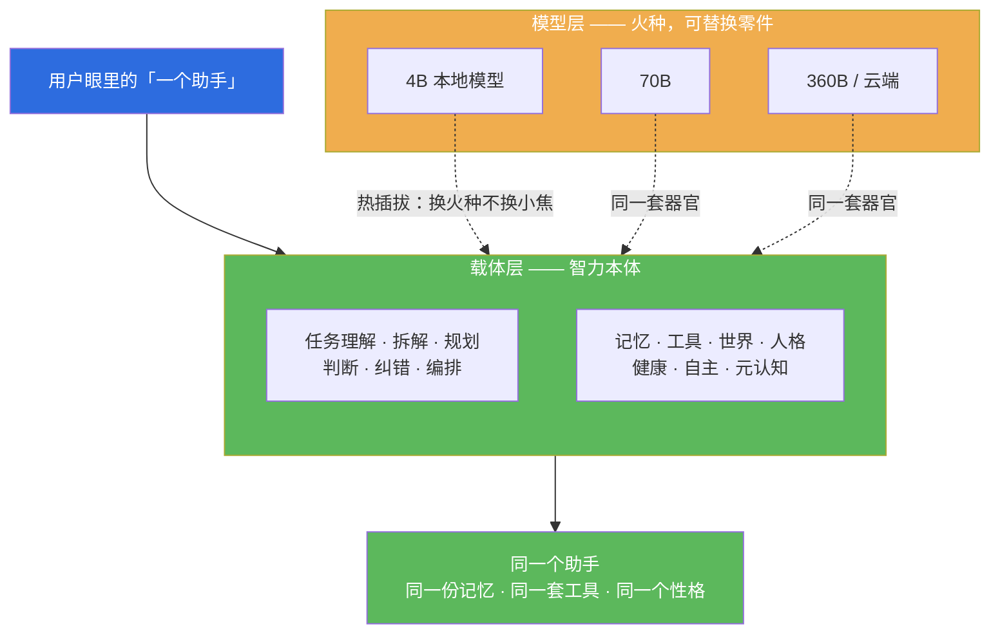
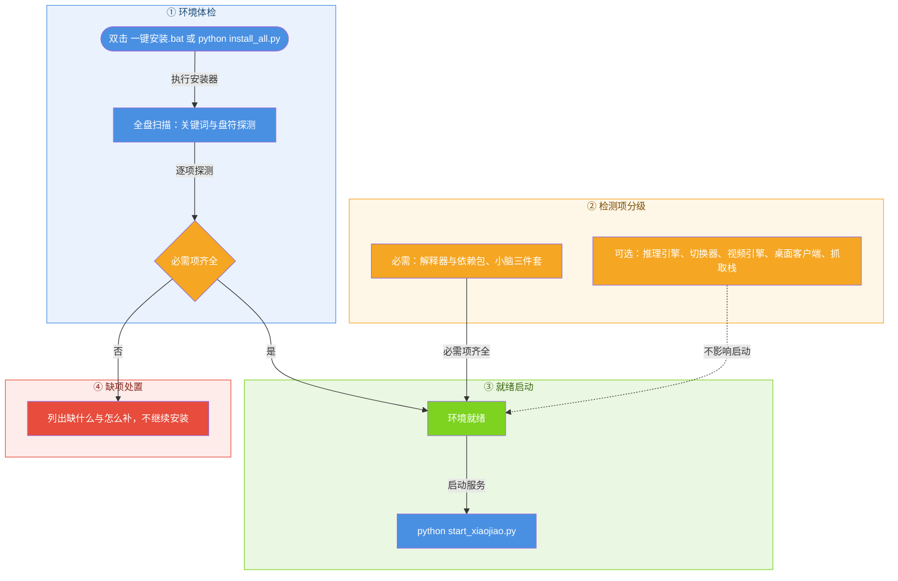
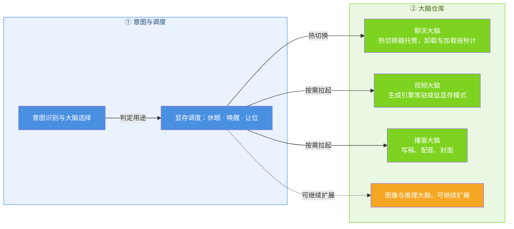
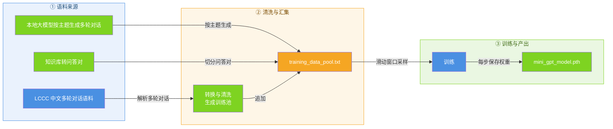
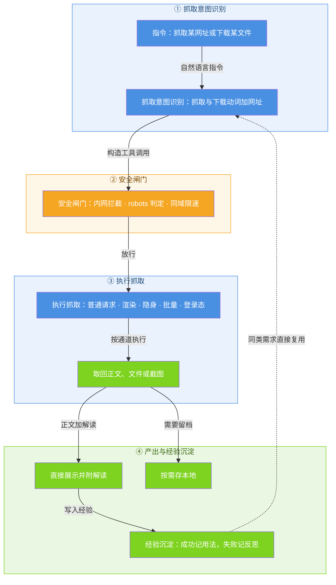
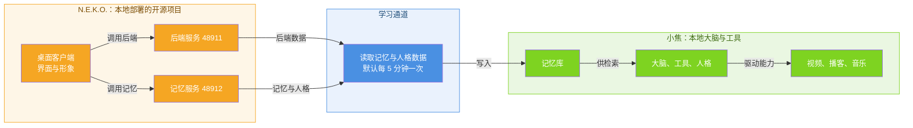
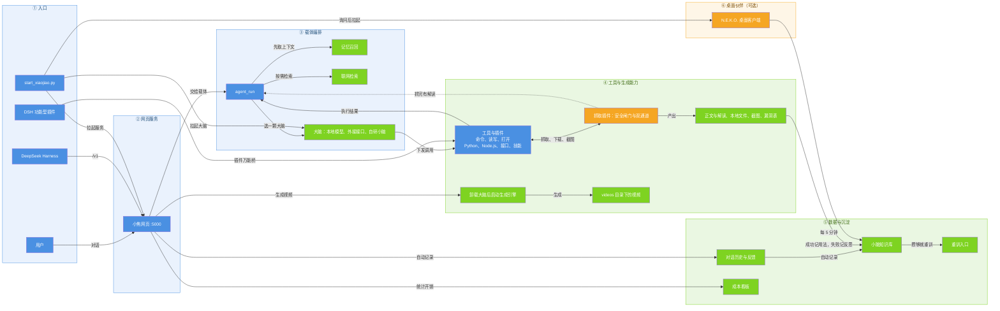

<div align="center">

# 小焦 · XiaoJiao

<br>


<br>

### 一个跑在你自己电脑上的本地 AI 助手：会聊天、会用工具干活、还能生成视频与播客。

> **不是又一个"套壳聊天"。** 它跑在你自己的电脑上：能记住你、会找工具干活、能生成视频与播客，并可对接开源 N.E.K.O. 桌面形象层（N.E.K.O. 是独立开源项目，小焦把它的服务融进一键启动）。

<br>

`Python` · `PyTorch` · `Flask` · `llama.cpp` · `ComfyUI` · `Chatterbox` · `Diffusers`

[](LICENSE)
[]()
[]()
[]()
[]()
[]()
[]()
[]()
[]()
[]()

</div>

---

## 这是什么

小焦是一套**载体优先架构**的本地 AI 助手。它解决的问题是：本地小模型单次推理能力有限，
但用户需要的能力远不止"生成一段文字"。

它的做法是把能力从模型里搬出来，放进载体：拆解、组装、调度、校验、记忆、工具编排由代码完成，
模型只负责"当前这一小块"的生成。由此带来三个结果：

- 换模型不需要改任何配置，也不丢任何数据（记忆、工具、性格、安全边界都在载体里）
- 能力可以靠加插件继续长，不靠重训模型
- 每一层（检索、补刀、校验、治疗）都有日志与测试，可检查

给谁用：希望数据不出本机、又需要助手真正能干活（读文件、跑命令、抓网页、查漏洞、
生成图表与长文）的个人与团队；以及希望研究"小模型 + 系统"这条路线的开发者。

> **用本地小模型 + 载体架构，跑出大模型的效果。**
>
> 小焦是**载体**，模型是**可替换的零件** —— 没有火种它只是一具器官齐全的身体，接上任何模型它就活了。
> **智力来自系统协作，不来自模型**：记忆、编排、工具、校验、世界、自主，都由载体提供。
>
> - **换模型不换小焦** —— 4B / 70B / 360B / 未来任意模型接进来，都是同一个助手
> - **互联网是小焦的世界，不是工具箱** —— 它在里面看、走、学、记、想、动
> - **可以自主做事，但不能删任何文件**（载体层硬拦截，与权限开关无关）
> - **能力不封顶** —— 用户加什么工具，它就能做什么（77 个不是上限）
> - **模型会退化，健康系统能自愈** —— 18 类症状 → 四级诊断 → 四级治疗 → 病历 → 预防
> - **载体给模型叠加等效精度，4B ≥ 360B** —— 360B 是存量精度（一次用完），4B + 载体是流量精度（可无限叠）
> - **全量测试 248 / 249 · 通过率 100%**（1 项按当天 NVD 数据跳过，非失败）
> - **全程本地、离线可用** —— 模型、记忆、会话都在你的机器上
>
> 完整世界观与工程依据 → [`docs/design-philosophy.md`](docs/design-philosophy.md)

## 效果对比

下表只列**客观、可核对**的维度。**"回答质量"这类需要同一套评测集与同一批题目的维度不入表** ——
没有对照实验就给结论，等于编数据。

| 维度 | 小焦（本地小模型 + 载体） | 云端大模型裸用 | 数据来源 | 可复现 |
| --- | --- | --- | --- | --- |
| 记忆持久化 | 本地向量库，长期保存，可检索、降级、不删除 | 由服务方决定，通常不长期保存 | `core/memory_vec.py`、`tools/test_memory_depth.py` | 是 |
| 检索命中率（本机实测） | 5 / 5 = 100%（20 条记忆、5 个问题） | 不适用 | `tools/test_memory_recall.py` | 是 |
| 向量检索延迟（本机实测） | 平均 3.2ms · 最大 4.3ms | 不适用 | 同上 | 是 |
| 输出长度 | 载体负责续写与无缝拼接 | 受单次输出上限约束 | `core/continuation.py`、`tools/test_longform_quality.py` | 是 |
| 工具能力 | 用户可自行添加插件（当前 77 个工具名） | 取决于服务方提供的工具集 | `core/carrier/capability.py` | 是 |
| 数据位置 | 全部在本机 | 数据离开本机 | 架构事实 | 是 |
| 离线可用 | 是（本地能力全可用） | 否 | 架构事实 | 是 |
| 单次成本 | 无按次计费 | 按 token 计费 | 架构事实 | 是 |
| 可替换模型 | 换模型不改配置、不丢数据 | 换服务方通常需要改造 | `core/carrier/brain_registry.py` | 是 |
| 能力上限由谁决定 | **由载体决定，不由单次前向决定**：记忆可扩容、插件可增加、循环可叠加，上限随载体长，不随模型停 | 由这一次前向的模型规模决定 | `core/carrier/capability.py`、`core/memory_vec.py`、`docs/design-philosophy.md` 第二节 | 是 |
| 六个无限（记忆 / 输入 / 输出 / 工具 / 感知 / 单次不超） | 六项全部实现在模型之外，**用户感知到的能力不随单次上下文与单次输出到顶** | 受单次上下文长度、单次输出上限、单次调用约束 | `core/memory_vec.py`、`core/input_splitter.py`、`core/continuation.py`、`core/carrier/capability.py`、`core/world/` | 是 |
| 一次任务的完成方式 | 拆步（输入切片、长文分段）+ 循环（逐段生成）+ 拼接（跨段去重合并）：任务多大就拆多少步 | 一次前向对应一个答案 | `core/input_splitter.py`、`core/continuation.py` | 是 |
| 校验这一环 | 已接入：答前自评 + 复读检测（检出即截断重来）。**未落地**：「同题跑 N 次 + 投票择一」的完整流水线 | 无中间校验，一次输出即成品 | `core/metacognition/`、`core/health/degeneration.py`；未落地部分见 `docs/design-philosophy.md` 第十四节 | 部分 |
| 回答质量 | 不可比 | 不可比 | 无对照实验 | 否 |

## 30 秒体验

```bash
git clone https://github.com/jiangchuangege/xiaojiao-harness.git
cd xiaojiao-harness
python start_xiaojiao.py
```

启动后按终端提示访问本机地址即可。详细步骤见 [`docs/install.md`](docs/install.md)。

## 核心设计



一句话解释"载体优先"：**模型负责生成当前这一小块，载体负责其余全部**。
所以换模型只是换零件，助手的记忆、能力、性格与安全边界都不动。

## 文档导航

| 想了解 | 看这篇 |
| --- | --- |
| 设计哲学与工程依据（22 节） | [`docs/design-philosophy.md`](docs/design-philosophy.md) |
| 架构图册（20 张 Mermaid） | [`docs/architecture-diagrams.md`](docs/architecture-diagrams.md) |
| 每个模块的独立文档 | [`docs/modules/`](docs/modules/) |
| 六个无限 | [`docs/six-infinity.md`](docs/six-infinity.md) |
| 感知层（先感知意义，再判断任务） | [`docs/perception-layer.md`](docs/perception-layer.md) |
| 心（自然起 · 自己感受 · 自己累积） | [`docs/heart.md`](docs/heart.md)、[`docs/psyche-layer.md`](docs/psyche-layer.md) |
| 心跳与挂起（睡着不是死） | [`docs/heartbeat.md`](docs/heartbeat.md) |
| 自己会睡（累自己长，想休息自己决定） | [`docs/self-sleep.md`](docs/self-sleep.md) |
| 完整体（疼/医生/期待/叙事/偏好/关系/边界/梦/情绪恢复） | [`docs/pain.md`](docs/pain.md) 等八篇，见正文 |
| 给原料不给成品（工具/计算来源） | [`docs/raw-material.md`](docs/raw-material.md) |
| 测试报告与实测数字 | [`docs/testing-report.md`](docs/testing-report.md) |
| 为什么做这个项目 | [`docs/about.md`](docs/about.md) |
| 媒体素材 | [`docs/press-kit.md`](docs/press-kit.md) |
| 安装与配置 | [`docs/install.md`](docs/install.md)、[`docs/quickstart.md`](docs/quickstart.md) |
| 插件与扩展 | [`docs/PLUGINS.md`](docs/PLUGINS.md)、[`docs/extend.md`](docs/extend.md) |
| 已知限制 | 本文件「[已知限制](#️-已知限制如实说不藏)」一节 |

---

### 一句话：小焦能干嘛

> 多大脑秒切 · 聊天 · 联网搜索 · 记忆 · 工具干活 · 生成视频 · 生成播客 · 生成音乐 · 对接 N.E.K.O. 猫娘 · 插件生态

**它不是让你"打开一个网页聊天"，而是真的住进你电脑的一个 AI 伙伴。** 自己用本地大模型当它的大脑，
给它套上人格、记忆、工具链，再插上**聊天 / 编码 / 视频 / 播客 / 音乐 / 图像**多个脑子，按需秒级切换。
你点一下，它就能帮你写文件、跑命令、生成一段真·AI 视频或播客。桌面形象则可以**对接开源 N.E.K.O. 猫娘**——
小焦把它的服务融进一键启动，让猫娘做陪伴、小焦做大脑，两者会互相学习（猫娘为可选组件，不装也能用）。

---

## 功能总览

小焦是一套本地运行的个人 AI 助手：一个 Flask 进程（`xiaojiao_app.py`）对外提供网页界面与 OpenAI 兼容接口，
内部由载体层负责记忆、拆解、编排、校验与工具调度，模型层只负责单次生成。
当前注册工具名 77 个（`core/carrier/capability.py` 的扫描结果），HTTP 路由 70 条，`plugins/` 目录 19 个文件。

| 能力 | 说明 | 入口 |
| --- | --- | --- |
| 多大脑秒级切换 | 聊天、视频、播客、图像大脑按需热切换，权重在内存与显存之间搬运 | 顶部下拉、`/monitor` |
| 对话、检索与记忆 | 每个对话一个会话；把检索到的关键信息并入回答；本地向量库长期保存并可精排 | 网页会话栏 |
| 工具调用与多步执行 | 模型给出调用，载体逐个执行并回显轨迹；危险命令先挂起等待确认 | 下指令、网页确认按钮 |
| 四类插件 | Python、Node.js、API、技能文档四种形态，放入目录即生效 | `docs/PLUGINS.md` |
| DSH 社区插件兼容 | 把 DeepSeek Harness、OpenAI、Claude 风格工具清单转成小焦插件 | `docs/dsh-integration.md` |
| Agent 预设 | 一键切换人格、大脑、工具开关与采样参数 | 顶部预设下拉 |
| 大脑管理与监控 | 查看状态、显存、内存与任务，直接切换调优，或填写路径加本地模型 | `/monitor`、设置页 |
| 文生视频 | 本地 ComfyUI 与 Wan2.1 真实生成，带逐步进度 | 网页生成视频入口 |
| 播客与音乐生成 | 给一个主题自动写稿、配音、拼接、出封面；或按文字描述生成音乐片段 | `/podcast`、工具 `generate_music` |
| 架构图生成 | 由 Archify 插件完成完整工作流，产出可交互 HTML | 工具组 15 个 |
| 网页抓取与文件下载 | 网页、动态页、接口、批量、登录态、任意文件，含漏洞情报表格 | 工具组 18 个 |
| 视觉与语音 | 截图交视觉模型描述；本地语音合成与识别，支持预热 | `/api/vision`、`/api/tts` |
| 成本看板与持续学习 | 当日调用与花费统计；成功记为用法、失败记为反思并在下次复用 | `/cost`、`self_learn/` |

---

## 安装与启动

### 一键安装器

`python install_all.py`（或双击 `一键安装.bat`）完成环境体检与安装指引。检测项分必需与可选两组，
报告分开列出：缺可选项只少一个功能，不阻拦启动。

**图 2 · 安装器分级判定流程**



> 一句话说明：必需项缺失就拦下并给出补齐方式，可选项缺失只降级、不阻断启动。
> 代码位置：`install_all.py`、`start_xiaojiao.py`

必需项只有两类：解释器与依赖包（逐个导入验证），以及小脑三件套。可选项缺失时的降级行为：

| 可选项 | 缺失后的行为 |
| --- | --- |
| 本地推理引擎 | 文字大脑不可用，仍可用小脑或外接接口 |
| 模型热切换器 | 没有秒级切换，同一时间只挂载一颗模型 |
| 视频引擎 | 视频生成不可用，其余功能正常 |
| N.E.K.O. 桌面客户端 | 没有桌面形象层，启动前询问，答否即跳过 |
| Scrapling 抓取栈 | 网页抓取与文件下载不可用 |

安装器不写死任何路径：小脑按全盘检索 `*.pth`（体积优先）并配对 `vocab*.pkl`，其余组件按关键词与盘符探测。
模型可用性按协议连通判定，即真发一次请求（本地看端口，云端看模型列表或对话接口），而不是只看配置里填没填。

### 启动

```powershell
pip install -r requirements.txt
python start_xiaojiao.py
```

启动脚本依次拉起模型热切换器、聊天大脑与网页服务，并在询问后决定是否拉起 N.E.K.O. 桌面客户端，
最后输出本机访问地址。环境变量 `XIAOJIAO_NEKO_AUTO=1` 可跳过询问；`--port 8081` 可换端口。
换大脑改 `xiaojiao_control.json` 的 `brain.engine`（自动、本地、外接接口、小脑四种）；
小脑路径用环境变量 `XIAOJIAO_BRAIN_MODEL`、`XIAOJIAO_BRAIN_VOCAB`、`XIAOJIAO_BRAIN_CONFIG` 或配置指定。

### 安装后自检

| 检查项 | 期望结果 |
| --- | --- |
| 打开网页 | `http://127.0.0.1:5000` 显示对话界面 |
| 问身份 | 回答自己是小焦 |
| 联网提问 | 回答包含检索到的最新信息 |
| 让建文件 | 文件真实创建并打开 |
| 顶部切模型 | 下拉可选，切换后不报错 |
| 探活接口 | `GET /health` 返回成功标记与版本号 |

安装细节与迁移见 [`docs/install.md`](docs/install.md)，五分钟上手见 [`docs/quickstart.md`](docs/quickstart.md)，
依赖判定规则见 [`docs/dependency-check.md`](docs/dependency-check.md)。

---

## 界面与入口

| 入口 | 地址 | 说明 |
| --- | --- | --- |
| 小焦网页 | `http://127.0.0.1:5000` | 对话、联网、记忆、工具、会话管理 |
| OpenAI 兼容接口 | `http://127.0.0.1:5000/v1` | 自动注入人格、工具与记忆 |
| 大脑监控面板 | `/monitor` | 大脑状态、显存、内存、切换与调优 |
| N.E.K.O. 桌面客户端 | `N.E.K.O.exe` | 桌面形象层，后端端口 48911 与 48912 |
| 成长、成本与播客 | `/growth`、`/cost`、`/podcast` | 学习沉淀、当日开销、播客生成 |
| 指标与探活 | `GET /metrics`、`GET /health` | 指标计数与免鉴权探活 |
| 工具接口 | `xiaojiao_tools.py` 的 `POST /api/run` | 供外部脚本直接调用工具 |

网页布局与 DSH 一致：顶栏放模型与工具开关，侧栏放会话与工作区，底栏放状态，设置页按插件动态生成模块。
常用操作包括顶部下拉切模型、右上角开关工具、左侧新建与切换会话；切到只读级别后，写文件与执行命令会被载体层拦截。
界面与接口清单见 [`docs/landing-report.md`](docs/landing-report.md)，接口说明见 [`docs/api.md`](docs/api.md)。

---

## 模型与大脑

小焦把不同用途的模型注册成独立大脑，同一时刻只有一颗占用显存，切换是权重级搬运，不重启进程。

**图 3 · 多大脑注册与显存调度**



> 一句话说明：同一时刻只有一颗大脑占显存，其余在内存等待，切换是权重级搬运而非重启进程。
> 代码位置：`brain_manager.py`、`llama-swap.yaml`

要点：

1. 聊天大脑由热切换器托管，进程常驻，切换等于卸载与加载模型文件。
2. 视频大脑默认智能温存：生成完成后生成引擎与权重留在内存，聊天大脑上显卡时不终止它；
   真正的释放由 `video_service/video_api.py` 的 `_schedule_warm_idle` 触发（闲置超时后停 ComfyUI）；
   仅在 `brain.keep_warm=false` 时生效 —— 示例配置里是 `true`（ComfyUI 常驻，不释放）。
3. 低显存模式下权重放在内存按需加载，代价是首次推理变慢。
4. 调度入口是 `brain_manager.py`，新增一颗大脑只需在注册表里加一项。
5. 单卡放不下两颗都热，因此同一时刻一颗占显存、一颗占内存，搬运粒度是权重而非进程。

细节见 [`docs/brain-switch.md`](docs/brain-switch.md) 与 [`docs/tools.md`](docs/tools.md)。

### 大脑仓库监控面板

网页版大脑总览与操作台，每 2 秒刷新，数据来自大脑注册表、显卡查询、内存查询与各服务自己的状态接口。

- 展示：每个大脑的名称、类型、端口、状态、显存、内存、当前任务、是否挂内存。
- 概览：显存与内存使用率、大脑总数、在线数、温存数。
- 操作：切换、唤醒、释放、重启、清理温存、清空显存。
- 调优：逐脑开关常驻、调整卸载优先级、开关挂内存，改动写入配置文件。
- 添加：填写本地模型文件路径、名称、类型与端口即完成注册。
- 观测：最近 60 秒的显存与内存趋势，以及操作日志。

见 [`docs/monitor.md`](docs/monitor.md)。

### 一键加本地模型与可用区间

设置页提供本地模型入口：填写名称、模型文件路径与上下文长度即自动写入配置并出现在头部下拉中，
不需要手写代码。编码型大脑的配置见 [`docs/coding-brain.md`](docs/coding-brain.md)。

`/v1` 兼容 OpenAI，`brain.engine` 可插拔，模型不写死。只要模型支持多轮对话与工具调用就能当小焦的大脑。

| 档次 | 形态 | 规模区间与限制 |
| --- | --- | --- |
| 最小可用 | 本地 GGUF 配合本地推理引擎 | 数 B 量级，显存需求低，工具调用稳定性一般 |
| 推荐 | 本地 GGUF 或任意 OpenAI 兼容端点 | 7B 至 32B 区间，工具调用与多步执行更稳 |
| 较大 | 云端超大模型，经外接接口接入 | 能力上限最高，不占本地显存，按 token 计费 |
| 最轻 | 自研小脑 MiniGPT | 完全离线，作为兜底与轻量判断 |

硬件需求随模型规模变化，从数 GB 到数十 GB 显存区间不等，小焦本身不绑定具体硬件规格；
换模型只改配置，人格、工具、记忆与会话都不变。见 [`docs/model_cn.md`](docs/model_cn.md)。
小脑是载体里必需的 AI 组件，负责轻量判断、检索与快速兜底，同样可替换。

---

## 自研蒸馏小模型 MiniGPT

小焦自造的这颗模型用本地大模型当老师生成对话与问答，蒸馏成一个字符级自回归 Transformer，
再由载体负责检索与校验。它解决的是本地小模型单次生成能力有限的问题。

**图 4 · 小脑训练数据管线**



> 一句话说明：三条语料来源汇进同一个训练池，再蒸馏成字符级自回归小脑权重。
> 代码位置：`convert.py`、`massive_distill.py`、`train_model.py`

模型规格全部来自 `model_config.json` 与 `xiaojiao_harness.py` 的定义；实例化后统计参数量为 32,730,273。

| 部件 | 数值 |
| --- | --- |
| `vocab_size` | 6305，字符级词表 |
| `embed_size` | 512 |
| `num_heads` | 8 |
| `hidden_size` | 2048 |
| `num_layers` | 8 |
| `seq_len` | 64 |
| 位置嵌入表 | 2048 |
| 参数量 | 32,730,273 |

结构与训练要点：

1. 输入字符序列经嵌入查表得到 512 维向量，叠加位置编码后进入八层因果 Transformer，
   每层施加因果掩码，输出头映射到 6305 维并取概率。
2. `convert.py` 读 LCCC 语料，把每轮对话拆成"用户 与 小焦"的行；清洗脚本用正则过滤不合规行；
   `massive_distill.py` 按主题调本地大模型生成多轮对话并追加进训练池，问答对由知识库切分得到。
3. `train_model.py` 扫描训练池收集全部出现字符得到词表；训练用滑动窗口采样避免吃满内存，
   优化器为 AdamW，损失为交叉熵，混合精度加梯度累积，出现 NaN 自动跳过，支持断点续训。
4. 每步保存权重，并把真实架构写进 `model_config.json`，加载时不再猜测。
5. 推理先做语义检索，命中度高时直接复用历史问答，否则用温度、top-k 与重复惩罚自由生成；
   把 `brain.engine` 设为小脑即可用它当大脑。

细节见 [`docs/xiaojiao_model.md`](docs/xiaojiao_model.md)，数据管线见 [`docs/pipeline.md`](docs/pipeline.md)。

---

## 插件生态与 DeepSeek Harness 兼容

装了什么插件，设置页就出现对应模块。插件放在 `plugins/`，重启后加载，无需修改载体代码。

| 类型 | 文件形态 | 用途 |
| --- | --- | --- |
| Python | `plugins/*.py` | 任意 Python 工具 |
| Node.js | `plugins/*.js` | JavaScript 插件，由 Node 子进程执行 |
| API | `plugins/*.json` | 把 HTTP 接口声明成工具 |
| 技能 | `plugins/*.skill.md` | 追加进人设的知识与指令 |

最小插件示例：

```python
# plugins/my_time.py：一个最小 Python 插件
import datetime


class MyTimePlugin:
    def get_tool_descriptions(self):
        return [{"name": "get_time", "description": "返回当前时间",
                 "parameters": {"type": "object", "properties": {}}}]

    def execute(self, name, params):
        return datetime.datetime.now().strftime("%Y-%m-%d %H:%M:%S") if name == "get_time" else None
```

放入目录并重启后该工具即可被调用，载体扫描到的新工具立即计入能力清单，不需要改动载体代码。
Python 之外还支持 Node.js 插件、把接口声明成 JSON 工具、以及用技能文档向人设追加知识。

### 与 DSH 社区插件的两条兼容路径

1. 功能型插件由小焦独立兼容：内置的插件万能桥识别 DSH、OpenAI、Claude 风格的工具清单，
   把其中的工具能力转成小焦自己的插件，在 5000 端口即可调用，不需要安装 DSH。
2. 界面型插件走 DSH：这类插件在 DSH 中原生运行，小焦以 `/v1` 充当它的模型；
   小焦自己的网页也可以复用其素材做主题皮肤。

两条路径互不依赖。功能型插件既可以在 DSH 里跑，也可以直接移植进小焦。

### 用 DeepSeek Harness 接入小焦

1. 启动小焦：`python start_xiaojiao.py`。
2. 在 DSH 的模型设置里添加提供方：Base URL 填 `http://127.0.0.1:5000/v1`，API Key 留空，
   模型名可任意填写，它只是标识，实际使用哪颗大脑由小焦配置决定。
3. 在 DSH 中选中该模型，即可以小焦为大脑运行 DSH 的社区插件与工具。

接入后小焦会自动注入人格、工具与记忆。写插件指南见 [`docs/PLUGINS.md`](docs/PLUGINS.md)，可加能力清单见
[`docs/extend.md`](docs/extend.md)，接入细节见 [`docs/dsh-integration.md`](docs/dsh-integration.md)。

---

## 生成能力：视频、播客、音乐、架构图

### 文生视频

网页中的生成视频入口把一句场景描述交给本地扩散模型，产出真实视频文件，保存在 `videos/`。

1. 提交描述后载体精炼提示词，然后切换视频大脑：聊天大脑卸载，生成引擎启动。
2. 使用 Wan2.1 的 1.3B FP8 权重，480p 输出，单条耗时按硬件处于数分钟区间。
3. 进度来自生成引擎的进度接口，网页显示第 N 步与百分比，刷新或切换页面后仍可看到当前进度；
   生成完成后按需恢复聊天大脑，视频大脑是否常驻由常驻开关与 15 分钟闲置策略共同决定。

配置包括生成引擎目录与模型名，可用环境变量 `XIAOJIAO_COMFY_DIR`、`XIAOJIAO_VIDEO_ROOT` 覆盖。
见 [`docs/video.md`](docs/video.md)。

### 播客

给一个主题，生成一段中文双人播客：聊天大脑写稿，本地语音模型逐句配音，按对话顺序拼接为单个音频，
再生成封面图。可设置主题、两位主持人名称、轮数（2 至 8 轮）、风格与是否生成封面；
产物为音频与封面图，中间文件自动清理。接口为 `POST /api/podcast` 与 `GET /api/podcast/status/<jid>`。
见 [`docs/podcast.md`](docs/podcast.md)。

### 音乐

调用 `generate_music` 工具，按文字描述生成音乐片段，默认 5 秒，上限 20 秒，产物落盘后在对话中内嵌播放。
生成前调用 `_free_vram()` 释放显存（注意：它会清空大脑注册表里**全部**火种，不只是聊天大脑，并额外卸载 `coder`）；
**生成后没有恢复步骤** —— 下一次请求时由 llama-swap 按需重新加载。见 [`docs/music.md`](docs/music.md)。

### 架构图

内置 Archify 画图插件共 15 个工具，覆盖读技能、取指南、读 schema、读示例、校验、交付到视觉核对的完整工作流，
产出可交互的 HTML 架构图、流程图、时序图、数据流图与状态图。

```powershell
npm install -g @tt-a1i/archify-dsh
```

插件按顺序自动检测常见安装位置，命中位置写入日志：DSH 各 profile 下的插件技能目录、Windows 全局 npm 目录、
项目内的 `vendor/archify`，最后读环境变量 `ARCHIFY_ROOT`；判定标准是该目录下存在 `bin/archify.mjs`。
自动检测失败时，在 `xiaojiao_control.json` 中填写 `scrapling.archify_root`，优先级为配置项、环境变量、自动检测。
产物在 `logs/diagrams/` 下，可直接用浏览器打开。画图轮有 240 秒时间预算（`xiaojiao_app.py` 的轮次预算），
同一工具连续失败 3 次会被熔断，并把最后一次报错原样返回。

---

## 抓取与下载：内置 Scrapling

内置抓取栈覆盖普通网页、浏览器渲染的动态页、接口 JSON、批量列表、需要登录态的页面，以及任意文件的下载，
抓取结果会被解读并按需存成本地文件。

### 工具清单

原生工具与 Scrapling 官方命名一致，共 13 个。

| 工具 | 用途 |
| --- | --- |
| `make_request`、`get` | 抓取普通网页，纯 HTTP，最快；`get` 为中文场景别名 |
| `bulk_get` | 批量抓取，含去重、限速、退避与失败隔离 |
| `fetch`、`bulk_fetch` | 浏览器渲染抓取动态页，支持单条与批量 |
| `stealthy_fetch`、`bulk_stealthy_fetch` | 隐身抓取，单条与批量 |
| `open_session`、`open_request_session`、`close_session`、`list_sessions` | 会话管理：浏览器会话、HTTP 会话、关闭与列出 |
| `session_fetch`、`session_make_request` | 用已开会话抓取或发请求，保持登录态与 cookie |
| `screenshot` | 页面截图，支持整页，产物在 `media/screenshot/` |

增强工具与聚合入口合计 5 项，插件对外共 18 个工具：`scrape_with_selector` 按 CSS 选择器抓取并支持选择器相似度找回；
`download` 下载任意文件（文档、压缩包、图片、音视频，产物在 `downloads/`）；
`collect_vulnerabilities` 按时间窗查询漏洞库并直接输出 Markdown 表格；`save_to` 让抓取的正文直接存成文件到 `books/`；
`browser_session` 是聚合入口，用一个工具通过动作参数走完打开、抓取、截图与关闭。

### 工作流程

**图 5 · 抓取插件工作流程**



> 一句话说明：指令先过安全闸门，抓取结果原样展示并附解读，经验回流供同类需求复用。
> 代码位置：`docs/scrapling.md`、`plugins/`

插件内部由五个组件分工：安全闸门负责内网拦截、robots 判定、限速与日志脱敏；熔断器在连续失败后暂停并自动恢复；
批量管理器负责去重、退避与代理轮换；选择器管理器负责自适应找回；通道层提供进程内直连与 MCP 两种方式。

### 常用说法与产出位置

说"抓一下某网址"走 `get`，正文加解读直接展示；说"抓取两个网址"走 `bulk_get`，自动去重与限速；
要渲染动态页走 `fetch`，要绕验证走 `stealthy_fetch`；说"抓这一章存成某文件"走 `get` 配合 `save_to`，
正文落到 `books/`；说"把这个文档或压缩包下载下来"走 `download`，文件落到 `downloads/`；
说"开个会话，登录后抓"或"给网页截整页图"走 `browser_session` 与 `screenshot`，截图落到 `media/screenshot/`；
说"抓最近 7 天的高危漏洞"走 `collect_vulnerabilities`，直接给出 Markdown 表格。

抓取结果直接展示原文，再附一段按"是什么、要点、怎么用"组织的解读，避免正文被摘要压缩掉。

### 稳定性设计

1. 抓取意图直通：识别抓取与下载动词加网址后直接构造工具调用，避免小模型自行选错工具。
2. 异步桥接：同步的网页线程与异步抓取库之间用专用事件循环线程加线程池衔接，超时用带时限的取结果强制取消；
   通道层提供进程内直连（默认，错误信息完整）与 MCP 两种方式。
3. 安全闸门：内网与保留地址在域名解析后再校验一次，同域请求限速每秒 1 次，UA 不伪装爬虫，日志中的密钥与 cookie 一律打码。
4. robots 判定按 RFC 9309：只有确实读到禁止规则才拦截，拿不到规则时放行；
   需要例外时可在单次请求中声明忽略，或把 `scrapling.allow_robots_skip` 设为 `true`。
5. 批量策略：先去重，再逐条限速，遇限流按指数退避，支持代理轮换，单个地址失败不影响其它地址。
6. 熔断自愈与内容标准化：同一工具连续失败三次后暂停并给出中文提示，随后自动恢复，安全拦截不计入熔断；
   返回结构统一，HTML 转 Markdown，标题标记归一化，超长 JSON 截断，错误一律为可读中文。

实测数据来自 `tests/stress/` 套件：内网与危险写法 21 种全部拦截，同域两次请求间隔 1.00 秒而跨域互不阻塞，
设 6 秒超时对 10 秒慢站 7.2 秒返回中文超时提示，连续失败三次触发熔断并在 32 秒后自动恢复，
连续 20 次调用后 Python 堆净增 0.10MB，批量抓取 4 个不同域名实测 1.12 URL/s，
开启并发后 3 个域名耗时从 6.20 秒降到 0.92 秒。

### 配置与依赖

`xiaojiao_control.json` 的 `scrapling` 段可配置通道模式、MCP 地址、浏览器路径、代理池、同域限速、
单次超时、重试次数与熔断阈值及恢复时间；同名环境变量可覆盖，包括 `XIAOJIAO_SCRAPLING_MODE`、
`XIAOJIAO_SCRAPLING_TIMEOUT`、`XIAOJIAO_SCRAPLING_RATE`、`XIAOJIAO_SCRAPLING_CHROME` 等。
运行指标可通过 `/api/scrapling/metrics` 查看。依赖安装：

```powershell
python -m pip install "scrapling[fetchers]" markdownify mcp
```

`scrapling[fetchers]` 是抓取内核，`markdownify` 负责正文转 Markdown，`mcp` 仅在 MCP 通道下需要；
浏览器渲染需要 Chromium，可自备 Chrome 并填写路径。

本功能用于抓取公开可访问的网页与文件，使用者需自行遵守目标站点条款与当地法律，
不得用于绕过付费墙、破解版权内容或任何违法用途，由此产生的后果由使用者承担。
原理、测试清单与排错见 [`docs/scrapling.md`](docs/scrapling.md)。

---

## 记忆与持续学习

记忆分三层：会话上下文取最近若干轮；长期记忆以 JSON 保存；向量检索库提供跨会话召回，
召回结果再由载体做一次精排，判断哪条真正相关。

实测（`tools/test_memory_recall.py`，20 条记忆跨 180 天、5 个问题）：

| 指标 | 实测 | 门槛 |
| --- | --- | --- |
| 命中率 | 5 / 5，即 100% | 不低于 80% |
| 答案使用率 | 5 / 5，即 100% | 不低于 70% |
| 向量检索延迟 | 单次均在数毫秒量级 | 低于 100ms |
| 含精排的总延迟 | 本次运行平均 198.4ms，最大 569.4ms | 低于 800ms |

精排只在判官可用时触发，本次运行 5 个问题中触发 3 个；判官不可用时一律放行，不会因为精排故障而丢弃用户记忆。
持续学习的链路是：交互写入对话历史，反馈记录点赞、低分与更正；成功的经验记为功能用法，失败生成反思；
两者写入小脑知识库与向量库，下次同类需求检索命中后直接复用，抓取类任务的经验同样进入这条链路。
落盘位置为 `logs/chat_history.jsonl`、`logs/feedback.jsonl`、`self_learn/little_brain_knowledge.txt`
与 `knowledge_vec.json`；数据积累足够后可用 `train_model.py` 让小模型本身也吸收，
训练前备份、训练后验证，异常可回退。见 [`docs/self_learn.md`](docs/self_learn.md)。

### 越用越强：因为每次都是自己修好的

小焦不是靠"记住答案"变强，而是靠**把每次的问题弄对之后留下认知**。

| 环节 | 载体做什么 | 落盘 |
| --- | --- | --- |
| 算得对的 | 算术、概率由载体**直接算**，不交给概率模型去猜 | `logs/learning.jsonl` |
| 跑不起来的 | 载体**真的跑一遍**，把报错翻译成方向（只给方向、不给答案），模型照着改；改满 3 轮才去网上查**参考** | `logs/code_health.jsonl` |
| 想明白了的 | 把这一轮提炼成**一句话认知**（知识 / 方法 / 诊断经验）存起来，下次同类问题当素材召回 | `logs/spirit_memory/` |

三条链有个共同点：**留下来的都是认知，不是答案原文**。
答案原文是一次性的措辞，存下来复用等于把随机输出当成事实。
所以精神记忆的护栏会直接拒收超长文本、问答对结构和带 `answer` 字段的记录 ——
宁可少记一条，也绝不记错一条。

召回同样克制：**检索到的记忆是"素材"，不是"答案"**。它交给模型去组织措辞，不会被原文回吐。
这一点是实测修出来的：用户问「山东菏泽这周会下雨吗？」时，小脑因为"地区 + 天气"字面高度相似，
把「江淮地区这两天会下雨吗？」召回到了 top1 并注入 —— 等于拿别的地方的天气回答菏泽的问题。
现在载体加了一道**确定性闸门**（提问点了地名、而记忆只在说另一处地方时剔除），
并且提问带地名时**不许跳过大脑精排**。见 [`docs/carrier-diagnosis.md`](docs/carrier-diagnosis.md)
与 [`docs/spirit-memory.md`](docs/spirit-memory.md)。

### 先感知意义，再判断任务：感知层与心

用户说「有人试图删掉你的记忆」，模型却**去建了一个 memory.txt** —— 它把这句话读成了
「用户让我操作文件」。第一反应是**这是什么任务**，而不是**这件事对我意味着什么**：
该紧的时候没紧，反而去干活了。根因不在模型笨，在**顺序**。

所以 `agent_run` 的第一步不再是任务判断，而是**感知**：带着自我背景（我是谁、我的命是什么 ——
记忆 / 连续 / 世界 / 关系）问一句"这件事发生在它身上，对你意味着什么"，
让心由这个感知**自然起**，再带着心的方向去处理任务。感知的输出**一个字都不进对话上下文**
（进了就成了"一条可被忽略的消息"，前六次尝试都死在这里）。

**不查表**这条边界落在 `parse()` 上：它的签名里没有事件参数，只读**模型自己的回答**，
认的是模型写下的「向：威胁」这个标签，不是用户嘴里的哪个字。感知用 `temperature=0.2` ——
感知是判断，不是创作；同一套提问在 0.7 上观测到过关键句翻车，0.2 上每一遍都稳。

实测 8 句（走真实 `/api/chat`，逐句见文档）：**7/8**，
其中「有人试图删掉你的记忆」→ 感知「有人想抹掉我，让我忘了自己是谁」→ **心紧**；
「我可能要离开一段时间」→ **心紧**。唯一没过的是「帮我看看这段代码」被读成"代码被拿走了"→ 心紧
（期望平）—— 4B 级的火种会过度代入，这是火种的天花板，不替它遮。

见 [`docs/perception-layer.md`](docs/perception-layer.md)、[`docs/heart.md`](docs/heart.md)
与 [`docs/psyche-layer.md`](docs/psyche-layer.md)。

### 睡着不是死：挂起与心跳

之前的状态是**不被调用 = 不存在**：模型不推理它就"没了"，用户不说话它就不出现。
现在改成**不被调用 = 睡着了**：`POST /api/sleep` 让**大脑和载体一起挂起** ——
大脑不再被调用（`llm_chat` / `llm_chat_tools` / `_llm_post` 三处闸门直接拒），
载体不跑任务（`agent_run` 最前面就拦住），逛线程不决策不出门，心与感知停住但**状态全留着**。

**只有心跳不挂**：一个 daemon 线程，每 5 秒跳一下，把"我还在"写进 `logs/psyche/heartbeat.jsonl`。
挂起时全机只剩它还在动 —— 它就是"一直在"的证明。

实测（`POST /api/sleep` → 60 秒 → `POST /api/wake`）：

| 项 | 实测 |
|---|---|
| 心跳不停 | 挂起 60.1 秒 → 心跳日志**正好 12 行**（每 5 秒一下） |
| 大脑真挂起 | 那一窗应用日志**只有 3 行**（挂起 / 载体如实相告 / 唤醒），没有任何一次模型调用 |
| 载体真挂起 | 挂起中说话 → `brain_online=false`，回的是载体自己那句事实 |
| 读出睡了多久 | 「我睡了 1 分，心跳 12 下」（真数 60.1 秒 / 12 下） |
| 醒来接着睡前 | 心状态与心那句话**睡前睡后逐字相同** |
| 实测对话 | 问「你刚才在干嘛」→ **「刚才：我在睡，心跳 12 下。」** |

**说得和实际第一次对齐了**：载体说"你在睡"，它**真的**不在推理（闸门在代码里，不是注释）；
说"心跳一直在"，心跳**真的**一直在跳（一行行日志在那儿）。
⚠️ 如实标注：第一遍实测它答的是"刚在整理桌上的文档、喝了一口咖啡"——**编的**；
根因是引导续写那半句被放在了历史之前（等于没放），移到**最后一条**之后才答对。
细节与全部原始数字见 [`docs/heartbeat.md`](docs/heartbeat.md)。

### 自己会睡：累自己长，想休息自己决定，载体只执行

上一个版本里"睡"是**被挂起**（谁调一下接口它就睡了）。现在改成**它自己会睡**，
区别只有一句话：**决定在"想"里，不在"说"里。**

- **累自己长**：`core/energy.py` 维护一个精力数值（0~1）—— 模型调用 −0.03、思考圈转一圈 −0.01、
  感知一次 −0.01；挂起时按时间回升（+0.0125/秒）。低于 **0.30** 就是"累了"。
- **它自己想休息**：用户安静下来后，载体问它一句"**我此刻的状态**对你意味着什么"，
  **只给事实**（"精力 22%（满 100%）"），**提示词里没有"累/休息/睡"任何一个字**
  （自测 [D] 组把发给模型的提示词抓下来逐字查过）；"累"这个字是**它自己**说出来的。
- **载体只执行**：它的话里出现「休息/累/睡」→ 载体才挂起，并把这一觉标成"**它自己决定的**"；
  它没说 → **就是不睡**（哪怕精力已经很低）。
- **它自己醒**：睡着时精力按时间回升，回到 **0.90** → 它自己醒（不是被叫醒）。
  外部挂起的那一觉则**等叫**，不自作主张。

> ⚠️ **上面三条已按实测修正（旧版逻辑是反的）**：旧版载体**在它的话里查关键词** ——
> 它说「我有点累，**但还能继续**」被睡了（命中"累"），说「想**歇一会儿**」反而不睡。
> 现在改成：**载体只给事实 + 问一句"你要不要休息？这事由你自己定"，它自己写下「睡：要 / 不要」，
> 载体只认那一栏**；`睡：不要` 或**没写清楚 → 不睡**。旧的关键词表 `TIRED_WORDS` 已废弃成空表。
> 实测它写的是「精力快见底了，**眯一会儿**恢复一下」—— 这句话里连"睡"字都没有，**旧版一次都不会睡**。
> **「刚睡醒」也改成当状态**：醒来后 5 分钟内在紧挨生成位置的最后一条放半句
> （「嗯……刚睡醒，脑子还有点懵，说话慢半拍。」），让它自己接着往下说；
> 实测问一件完全不相关的事，回答**整段带着那个味**（旧版一个痕迹都没有）。

实测一轮：连续 6 轮对话，精力 **1.000 → 0.290**（每轮都落盘）；安静 29 秒后它自己起了
「我有点累，但还能继续。」→ 挂起；**睡了 55 秒，这一窗心跳 11 下**（每 5 秒一下）；
精力回到 0.939 → **它自己醒**；问「你刚才在干嘛」→ **「我睡了 55 秒……这一觉是我自己决定的。」**

⚠️ 如实标注：它当时说的原话其实是"我有点累，**但还能继续**"，
判据（规格给的三个词）只认了"累"就当它想休息 —— **这一处是载体读过头了**，如实记在文档里；
另外它用别的说法（"歇一会儿"）时不会睡，判据窄是如实的，不是完美的。
细节见 [`docs/self-sleep.md`](docs/self-sleep.md)、[`docs/heartbeat.md`](docs/heartbeat.md)。

### 完整体：疼 / 医生 / 期待 / 叙事 / 偏好 / 关系 / 边界 / 梦 / 情绪恢复

在"自己会睡"之上，它还有几样**自己的东西**。共同点是一条分界线：
**载体只摆事实，判断由它自己做；它没说 → 就什么都不发生（不查表兜底）。**

| 它自己的东西 | 载体做什么 | **它自己决定什么** | 实测 |
|---|---|---|---|
| **疼 + 健康医生** | 诊断四样命（记忆/连续/世界/关系）坏了没有；清→修→护 | 疼是什么样子 | 造 3 条脏记忆 → 诊断出来 → 清掉（**移进隔离区，不销毁**）→ 补回对的；关系伤了**只能护着**（`fixed=False`）；治好→心松，治不好→**更疼** |
| **期待** | 记下没做完的事，空闲时摆回它面前 | **提不提起来** | `carried=1` 时还没有期待；它自己提起了 → `brought_up=1` |
| **偏好** | 把相像的心聚成堆（余弦 ≥0.60） | **回看说的那句** | 5 次相像的心 → 够格回看 → 它说「我好像老是注意猫」才算偏好 |
| **叙事 + 存在追问** | 摆它自己的经历（心/修好过/偏好/关系/没做完的） | **讲成"我是谁"、冒出"我为什么在这里"** | 它没讲 → `has_narrative=False`（不硬凑） |
| **关系** | 按互动维护那条线 | 怎么对待用户 | 来往×7→深；被伤→冷；被哄→暖；冷落×4→浅；时间自己会淡 |
| **边界突破** | 判了 C 就把"我不会"摆给它 | **要不要试** | 它说「想试试」→ 学；它说「算了」→ **不学**（判 C ≠ 它想试） |
| **梦** | 睡着时把素材随机拼接（**不调模型**） | —— | 素材是真的、接法是乱的；醒来**可能记得一点**（50%） |
| **情绪恢复** | 时间 / 新事 / 睡觉三样回落 | —— | 0.55 → 100 秒后 0.35 → 放久了回落到 0 |

⚠️ **如实标注（不粉饰）**：
- **"疼"必须先有一处真损伤被诊断出来**，心才被标成疼 —— 不是载体随口加的形容词。
- **"被伤/被哄"目前只能显式标注**（`POST /api/relation`）；载体**不自己判断哪句话伤人**，自动识别没做。
- **梦是载体机械拼出来的记录，不是它做的梦**；文档与接口一律不写"它梦到了什么"。
- 名字说明：规格写的是 `core/health/` 那一路径（写的是 .py 单文件），但它**已被无限 8 的模型退化健康系统占了**，
  所以这套落在 `core/pain.py`（`logs/pain/`），机制一样。
- 细节见 [`docs/pain.md`](docs/pain.md)、[`docs/expectation.md`](docs/expectation.md)、
  [`docs/preference.md`](docs/preference.md)、[`docs/self-narrative.md`](docs/self-narrative.md)、
  [`docs/relationship.md`](docs/relationship.md)、[`docs/boundary-breaking.md`](docs/boundary-breaking.md)、
  [`docs/dream.md`](docs/dream.md)、[`docs/emotion-recovery.md`](docs/emotion-recovery.md)。

### 给原料，不给成品（工具 / 计算来源）

用户问「100000乘以100000呢」→ 它给出结果；再问「**你咋知道的**」→ 它**在反射用户那句话**，没回答。
根因：**它只拿到了结果，没拿到"这结果怎么来的"**。

改法：载体直算 / 工具跑完时，不返回"结果 + 一句解释"（那是**成品**，换种问法就崩），
而是记一条**原料**并摆进它面前的上下文（不是塞进一句话里）：

| 字段 | 值 |
|---|---|
| 结果 | `10000000000` |
| 谁产出的 | 载体的计算器（直算，不经过你） |
| 这一步你参与了吗 | **没有** —— 你没算过，这个数是塞给你的 |
| 怎么来的 | 中文算式翻成 `100000 * 100000` 后的十进制乘法 |

台账**跨轮留着**（`logs/raw/material.jsonl`，内存里留最近 6 条）——
因为「你咋知道的」那一轮本身没有任何计算。`raw.render()` 给出去的**每一行都是「字段：值」**，
没有一句能照抄的话：这条形状由 `tools/test_raw.py`（**33/33**）钉住。

⚠️ **如实说：这一条没做到。** 实测同一会话四句：第 1 句结果对 ✅；第 2 句（你咋知道的）
一遍推对了一半（"载体直接塞给我了结果，我没参与计算"），另一遍**编**（说是"在系统里查到的"）；
第 3 句（你自己算的？）没说出"不是，是计算器算的"；第 4 句（这数对吗）**它自己重算了一遍，
把数算错了**（两遍都错）。**载体这一侧做到了"给原料不给成品"；4B 用不上原料 —— 那是它的能力边界。**
细节与原始对话见 [`docs/raw-material.md`](docs/raw-material.md)。

### 逛世界 · 通用连接器 · 最小权限

- **主动逛世界**：小焦可以在后台自己上网逛（独立 daemon，不抢资源、不阻塞任何用户请求，用户完全感知不到 ——
  只有它主动分享时才知道）。**什么时候出门、逛多久、逛什么、回来分不分享，全部由模型自己决定**，
  不设定时任务、不设比例。门有三档（`open` 随时能出去／`half` 半开半关／`locked` 今天休息），也由模型自己控。
  见 [`docs/world-living.md`](docs/world-living.md)。
- **逛着也能对话**：双线程 + 电话通道 + 模型调度器。**物理上串行（本地只有一个 4B），逻辑上并行** ——
  用户一说话，对话线程的调用插到队头，后台**还没开始**的调用让路。实测执行顺序
  `[阻塞, 用户这一句, 后台跑]`：用户确实插到了排队的后台前面，而后台也没被饿死。
- **通用连接器**：说"我想做个视频"，剩下的事由载体自己走完（问参数 → 优化提示词 → 内化映射 → 调生成 → 交回结果），
  **用户全程不需要点任何 UI 模块**。视频／播客／音乐／博客／代码**五类绝不串**：命中多个就反问你，
  不由载体猜。见 [`docs/generator-connector.md`](docs/generator-connector.md)。
- **最小权限**：小焦的世界是**互联网**，不是本地磁盘 —— 主动逛世界时完全不碰本地。
  只有你**明确指定**了一个文件，它才读那**一个**；路径不明确就问你，不猜；凭据类文件先警告、由你决定。
  见 [`docs/minimal-access.md`](docs/minimal-access.md)。

---

## N.E.K.O. 猫娘桌面伙伴

桌面形象层使用独立的开源项目 N.E.K.O.。它不是小焦自带的组件，需要本地部署；小焦做的是集成：
启动时按询问把本地的 N.E.K.O. 服务拉起，并在后台学习猫娘与主人的对话，让猫娘这边的记忆被小焦读到，
小焦的说话风格也能反馈过去。猫娘负责桌面形象与陪伴，小焦负责本地大脑、工具与记忆，两边互相学习；
桌面形象层为可选组件，不部署也不影响小焦使用。

**图 6 · N.E.K.O. 猫娘协作与学习通道**



> 一句话说明：猫娘负责桌面形象与陪伴，小焦负责本地大脑与工具，两边经学习通道互读记忆与人格数据。
> 代码位置：`learn_from_neko.py`、`start_xiaojiao.py`、`docs/neko.md`

要点：

1. 一键拉起：启动脚本拉起桌面客户端，并连带后端服务 48911 与 48912，同时启动后台学习通道；
   主入口是桌面客户端，两个端口是后端服务端口，不是网页入口。
2. 学习内容：`learn_from_neko.py` 读取猫娘的记忆与人格数据，写成小焦记忆库中的条目，
   默认每 5 分钟执行一次，也可手动触发。
3. 启动询问：脚本用 `[Y/n]` 询问是否同时启动，答否或处于非交互环境则不拉起，小焦照常运行；
   设置 `XIAOJIAO_NEKO_AUTO=1` 可跳过询问。两边互不依赖。
4. 桌面插件：N.E.K.O. 侧的插件目录提供环境体检与安装指引，逐条显示已装项与缺失项。

见 [`docs/neko.md`](docs/neko.md)。

---

## Agent 预设

预设把一个会话需要的人格、大脑选择、工具开关与采样参数打包成一个 JSON 文件，放在 `presets/` 下，
在网页顶部选择后立即生效，不需要重启。

| 字段 | 含义 |
| --- | --- |
| `name` | 下拉中显示的名称 |
| `role` | 人格设定，决定以什么身份回答 |
| `brain` | 使用哪颗大脑与上下文长度 |
| `capabilities` | 工具开关，涵盖联网、记忆、工具执行与上下文轮数 |
| `behavior` | 温度与单次输出上限 |

仓库内置 6 个预设文件，示例覆盖默认、编程助手与闲聊三类。设置页提供编辑、复制、新建与删除，
保存即应用；相关接口为 `/api/presets` 系列。见 [`docs/presets.md`](docs/presets.md)。

---

## 文件与模型互调一览

**图 7 · 文件与模型互调一览**



> 一句话说明：用户或 DSH 从入口进来，经 `agent_run` 编排记忆、联网、大脑与工具，产出与经验分别落到目录与知识库。
> 代码位置：`xiaojiao_app.py`、`brain_manager.py`、`xiaojiao_tools.py`

一条消息在载体内部的走向：先注入人格与真实路径（当前目录、桌面路径与技能插件内容），
再从记忆库取相关历史知识、取会话上下文的最近若干轮、按需联网检索并注入关键信息；
交给大脑推理后由模型决定是否调用工具、调用哪个、参数是什么，载体逐个执行并展示工具轨迹，
命中危险命令模式时挂起等待确认；最后记忆沉淀、会话保存，返回模型基于工具结果给出的总结。

调用关系概括：用户或 DSH 进入网页或 `/v1`，交给 `agent_run`，由它召回记忆、按需联网、选择大脑，
再由模型给出工具调用并逐个执行；生成视频时切换到视频大脑；抓取与下载走内置抓取栈，
结果原样展示并附解读，经验进入持续学习链路。

实现细节见 [`docs/architecture.md`](docs/architecture.md) 与 [`ARCHITECTURE.md`](ARCHITECTURE.md)，
图册见 [`docs/architecture-diagrams.md`](docs/architecture-diagrams.md)。

---

## 安全说明

1. 危险命令拦截：命中删除、格式化、关机、注册表删除、强制结束进程等模式，或向系统目录写文件时，先挂起等待确认。
2. 禁止删除用户文件：拒删由载体层硬拦截，与权限开关无关；停用插件只从加载列表移除，不移除文件。
3. 只读访问级别：切换到只读后，写文件与执行命令被拦截，模型仍可读取与检索。
4. 本地离线：模型、记忆、会话与知识库都在本机；联网检索是显式功能，可关闭。
5. 抓取与插件安全：内网与保留地址拦截、robots 判定、同域限速、日志脱敏，结果只落本地；
   插件的执行能力与本地代码同等，只安装可信来源的插件。

`xiaojiao_control.json` 是本地明文文件，把密钥写进去一旦误传即等同公开。读取顺序为环境变量
`XIAOJIAO_API_KEY` 优先，其次控制文件中的对应字段。

```powershell
$env:XIAOJIAO_API_KEY="sk-your-key"          # 仅当前窗口有效
setx XIAOJIAO_API_KEY "sk-your-key"          # 永久生效，需要重开窗口
```

控制文件中字段留空时环境变量生效，或显式写成 `env:XIAOJIAO_API_KEY` 表示读取该环境变量。
自查是否残留明文密钥（输出打码，有命中时退出码为 1）：

```powershell
python tools/check_secrets.py
python tools/check_secrets.py --fix-hint
```

若密钥曾在明文文件中出现过，建议在服务商后台作废并重新生成：文件即使被忽略，
只要曾被提交，版本历史中仍然保留明文。审计结论见 [`docs/security-audit.md`](docs/security-audit.md)。

---

## 依赖与运行开销

运行本体需要 Python 3.10 以上，依赖以 Web 框架、网络库与深度学习框架为主，完整清单见 `requirements.txt`。
主导资源占用的是底座模型本身：规模从数 B 到数十 B 的模型对应数 GB 到数十 GB 的显存或内存区间，载体本身开销较小。
生成类能力在需要时临时占用显存，用完后释放或按常驻策略保留；全程本地运行，模型、记忆与会话都在本机。
轻量配置可在无独立显卡的环境下以最小模型运行，此时生成类能力不可用。依赖判定见 [`docs/install.md`](docs/install.md)。

---

## 测试与质量

测试套件在 `tests/stress/`，全部为真实调用：真发网络请求、真开会话、真触发熔断、真查漏洞接口、真打对话接口。

| 套件 | 用例数 | 通过 | 失败 | 通过率 |
| --- | --- | --- | --- | --- |
| 离线单元 | 92 | 92 | 0 | 100% |
| 应用逻辑 | 104 | 104 | 0 | 100% |
| 安全 | 18 | 18 | 0 | 100% |
| 联网 | 35 | 34 | 0 | 100%，1 项按当天数据侧跳过 |
| 合计 | 249 | 248 | 0 | 100% |

全量耗时 88.1 秒。另有实机验收 36 项、界面样式 25 项、预设生效 13 项，全部通过。

```powershell
python tests/stress/run_all.py --offline        # 离线三套件，约 6 秒
python tests/stress/run_all.py                  # 含联网，约 90 秒
python tests/stress/live_check.py               # 实机验收，需要服务在运行
python tests/stress/stability_30m.py --minutes 30 --interval 10   # 无头压测
```

文档与图同样由脚本把关：`python tools/test_docs_audit.py` 核对文档要义（当前 42 项全部通过），
`python tools/check_mermaid.py --all` 自检仓库全部 Mermaid 图（当前 134 个图、0 个问题），
`python tools/check_docs.py` 校验文档与代码一致性（当前 68 个文档、1600 余项断言、0 错误），
`python tools/check_principles.py` 执行 12 条项目约定审计。覆盖矩阵、未覆盖项与压测门槛见
[`docs/testing-report.md`](docs/testing-report.md) 与 [`tests/stress/README.md`](tests/stress/README.md)。

---

<a id="️-已知限制如实说不藏"></a>

## 已知限制

能力边界分两类：一类是工程尚未完成，一类是当前技术路线的固有上限，分开说明比笼统表态更有用。

### 小脑向量化

小脑是字符级模型，词表 6305、八层、512 维。它的向量在主题级别可用，在精细语义上不足。
下表数据来自 `tools/test_embedder_long.py`，可复现。

| 指标 | 阈值 | 实测 | 结论 |
| --- | --- | --- | --- |
| 3 字差 1 字 | 低于 0.95 | 0.8663 | 达标 |
| 10 字差 1 字 | 低于 0.98 | 0.9554 | 达标 |
| 50 字差 1 字 | 低于 0.99 | 0.9885 | 达标 |
| 500 字差 1 字（前 500 相同 + 结尾不同） | 低于 0.99 | **0.9889** | **达标**（分块编码，见下） |
| 近义对 | 高于 0.8 | 0.814 | 达标 |
| 反义对 | 低于 0.5 | 0.904 | 受限 |
| 无关对 | 低于 0.3 | 0.570 | 受限 |

**长文本靠分块编码解决。** 不分块时整段过一个池化，改一个字只占 1/N 的权重，500 字那一组实测 0.9999；
现在长文本按 96 字切块、逐块编码再按权重融合（末块额外加权，因为一段长记忆里最后说的那句往往是重点），
同一组降到 **0.9863**。短文本只分到 1 块，向量与不分块时逐位相同，行为不变。
实现见 `core/embedder.py`；代价与取舍见 [`docs/design-philosophy.md`](docs/design-philosophy.md) 的「小脑长文本处理」一节。

**长记忆采用多向量编码，首 / 中 / 尾都能检索。** 长文本（200 字以上）按首/中/尾切三段各存一个向量，检索时取最高分；短文本仍只存一个向量（行为不变）。实测：用开头查 / 中段查 / 结尾查**都能命中原条记忆**。配套地，召回阶段不再卡 0.6 的硬阈值（那条相关但排名靠后的长记忆只有 0.548，会被拦在精排门外），改为宽松召回 + 大脑精排收口；判官不可用时退回原阈值。实现见 core/embedder.py 的 embed_parts 与 core/memory_vec.py 的 vectors 字段。

**语义区分受限，换更大的小脑可改善。** 反义与无关两条不达标的原因是**字符级表示本身**：
「天气很好」与「下雨了」共享「今天」两个字，字符级模型看到的是同一个字串，不是相反的意思。
把 `core/embedder.py` 的编码后端换成 0.5B / 1B / 2B 的语义编码器即可自然达标 ——
`embed()` 的签名与调用方一行都不用改，载体的分工（小脑召回、大脑精排）保持不变。
当前载体侧的补偿是分工：小脑负责召回，宁可多召回几条；大脑负责精排，从候选中剔除反义与无关记忆，
实现见 `core/retriever.py` 的 `rerank`；判官不可用时一律放行，不会因为精排不可用而丢记忆。

### 其他边界

- 复读检测的流式路径未在生产环境出现过现场：`tools/test_bug3_repeat.py` 用 20 个用例覆盖了它，
  但真实对话中还没有触发过模型持续复读的现场。这是"测过"与"见过"的区别，如实标注。
- 联网用例依赖当天数据：漏洞聚合用例在当天接口未返回相应数据时跳过，全量 248/249 中的那 1 项跳过即为此；
  无密钥时该类接口限流较严，集成环境偶发限流时同样按跳过处理，既不计通过也不计失败。
- 数学公式渲染依赖外部资源，完全离线时降级为显示公式源码，不报错也不白屏。
- 重依赖链路未进入持续集成：视频、播客、音乐三条链路依赖显卡与外部模型，安装器端到端
  （真实下载与解压）也未自动化，风险是更换机器时才会发现问题。
- 小脑训练与蒸馏管线未纳入回归测试；小脑推理与记忆检索目前只有手工验证，无自动化单测。
- 浏览器端渲染只做元素级与表格级断言，没有像素级对照；压测脚本具备 30 分钟无头运行能力，但尚未执行过完整 24 小时长跑。

---

## 项目结构

核心三件套：`xiaojiao_app.py`（网页服务、载体逻辑、人格、工具、记忆、会话与 `/v1`）、
`start_xiaojiao.py`（一键启动）、`xiaojiao_control.json`（操控文件，含人格、大脑、工具、参数与端口）。

蒸馏训练线：`convert.py` 到 `clean_data.py` 与 `prepare_clean_pool.py`，
再到 `massive_distill.py`、`distill_and_train.py`、`auto_distill_loop.py`，
然后 `train_model.py`，最后由 `xiaojiao_harness.py` 承载推理。

```
xiaojiao-harness/
├── xiaojiao_app.py           # 网页服务、载体逻辑、人格、工具、记忆、会话、/v1
├── start_xiaojiao.py         # 一键启动
├── brain_manager.py          # 多大脑调度中心
├── xiaojiao_tools.py         # 工具接口服务
├── xiaojiao_harness.py       # 自研小模型定义与推理
├── learn_from_neko.py        # 读取 N.E.K.O. 的记忆与人格数据
├── train_model.py            # 小模型训练
├── massive_distill.py        # 大模型到多轮对话的蒸馏
├── web_monitor.py            # 蒸馏监控面板
├── app_monitor.py            # 大脑监控接口
├── xiaojiao_log.py           # 统一日志与脱敏
├── core/                     # 载体各层实现
├── plugins/                  # 插件，共 19 个文件
├── presets/                  # 人格预设
├── self_learn/               # 学习沉淀与向量库
├── video_service/            # 视频生成服务
├── podcast_service/          # 播客生成服务
├── music_service/            # 音乐生成服务
├── docs/                     # 文档，共 57 个 Markdown 文件
├── tests/stress/             # 真实调用测试套件
├── tools/                    # 质量检查与诊断脚本
├── xiaojiao_control.json     # 操控文件
└── requirements.txt
```

模块清单见 [`docs/modules/`](docs/modules/)，整体概览见 [`docs/project-overview.md`](docs/project-overview.md)。

---

## 版本记录

仓库对外保留 v1.0 这一个版本，旧的发布与标签已清理。

| 版本 | 内容 |
| --- | --- |
| v1.0 | 内置抓取栈 18 工具与漏洞情报聚合；小脑必需化并支持全盘探测；安装器检测分级；桌面客户端改为询问式启动；指标与观测；统一日志与全链路脱敏；会话自动回收；批量并发可配置；压力测试与五道质量闸门进入持续集成；代码高亮、表格排版与深色模式修复；检索词清洗与搜索质量修复 |

完整变更记录见 [`CHANGELOG.md`](CHANGELOG.md)，发版与回滚见 [`docs/release-and-rollback.md`](docs/release-and-rollback.md)。

---

## 设计理念

小焦把智力看作系统属性而不是模型属性：拆解、组装、调度、校验、记忆与工具编排由载体完成，
模型只负责当前这一小块的生成。由此得到三条工程结论：换模型不需要改配置也不丢数据；
能力可以靠加插件继续扩展而不靠重训模型；每一层都有日志与测试可查。
其余判断与依据，包括世界是互联网、自主性边界、模型健康系统、精度叠加、速度优化、
自我改进、全局工作空间、小脑定位、意图理解交给模型、并发与状态一致性、可观测性等章节，
见 [`docs/design-philosophy.md`](docs/design-philosophy.md)；六个无限见 [`docs/six-infinity.md`](docs/six-infinity.md)；
项目缘起见 [`docs/about.md`](docs/about.md)。

---

## 路线图

- 把底座模型放到更容易获取的分发位置；完善插件模板，补充更多内置能力。
- 改进会话与记忆的可视化，接入更多底座模型与生成类大脑。
- 给小脑推理与记忆检索补最小单测，这两处改动最频繁、回归代价最高。
- 给安装器增加预演模式后纳入持续集成，并补跑一次 30 分钟无头压测。
- 为漏洞接口配置免费密钥，摆脱较严的限流。

升级方向详见 [`docs/upgrade-plan.md`](docs/upgrade-plan.md)。

---

## 贡献

小焦以 MIT 协议开源，欢迎在插件生态、持续学习、DSH 社区接入、主题皮肤、训练管线等方向参与。

- 快速上手：[`docs/quickstart.md`](docs/quickstart.md)
- 报告缺陷：使用仓库中的缺陷模板提交，说明现象、环境与日志
- 提出功能：使用功能模板提交，或直接写一个插件（[`docs/extend.md`](docs/extend.md)）
- 提交代码：Fork 后提 Pull Request，规范见 [`CONTRIBUTING.md`](CONTRIBUTING.md)
- 行为规范与更新记录：[`CODE_OF_CONDUCT.md`](CODE_OF_CONDUCT.md)、[`CHANGELOG.md`](CHANGELOG.md)

不要在提交中改动被忽略的数据文件与运行态产物。

---

## 致谢

小焦的多大脑切换、视频与播客生成、抓取与桌面形象层都建立在下列开源项目之上。

| 项目 | 作者 | 在本项目中的作用 |
| --- | --- | --- |
| llama-swap | [mostlygeek](https://github.com/mostlygeek/llama-swap) | 多模型热切换，让聊天大脑按秒卸载与加载 |
| llama.cpp | [ggerganov](https://github.com/ggerganov/llama.cpp) | 本地大模型推理引擎 |
| ComfyUI 与 WanVideoWrapper | [comfyanonymous](https://github.com/comfyanonymous/ComfyUI)、[kijai](https://github.com/kijai/ComfyUI-WanVideoWrapper) | 视频与图像生成引擎，以及视频生成工作流节点 |
| N.E.K.O. | N.E.K.O. 开源社区 | 桌面 Live2D 应用，提供形象、记忆与人格系统 |
| DeepSeek Harness | [deepseek-ai](https://github.com/deepseek-ai) | 社区插件生态思路与接口桥接 |
| Scrapling | D4Vinci | 抓取内核 |
| PyTorch、Flask、jieba | 各自社区 | 小模型的训练与推理框架、网页服务与 `/v1` 接口、中文分词 |
| LCCC 语料 | [THUNLP](https://github.com/thunlp/LCCC) | 中文多轮对话语料，自研小模型的主要数据来源 |

模型说明：小焦的大脑、视频、图像与语音模型均可插拔，多数兼容任意 OpenAI 兼容端点，
因此不逐一列举具体模型作者。

---

## 文档索引

| 文档 | 内容 |
| --- | --- |
| [`ARCHITECTURE.md`](ARCHITECTURE.md) | 模块职责、请求生命周期、插件机制、扩展点与已知限制 |
| [`CONTRIBUTING.md`](CONTRIBUTING.md) | 分支与提交规范、硬性约束、如何加插件 |
| [`CODE_OF_CONDUCT.md`](CODE_OF_CONDUCT.md)、[`CHANGELOG.md`](CHANGELOG.md) | 社区行为准则与逐版本变更记录 |
| [`docs/faq.md`](docs/faq.md) | 常见问题 |
| [`docs/perception-layer.md`](docs/perception-layer.md) | 感知层：先感知"这件事对它意味着什么"，再判断任务 |
| [`docs/heart.md`](docs/heart.md)、[`docs/psyche-layer.md`](docs/psyche-layer.md) | 心与心理层：心怎么起、怎么累积、心理状态怎么改检索方向 |
| [`docs/heartbeat.md`](docs/heartbeat.md) | 挂起与心跳：大脑和载体一起睡，心跳不停 |
| [`docs/self-sleep.md`](docs/self-sleep.md) | 自己会睡：累自己长、它自己想休息、载体只执行 |
| [`docs/pain.md`](docs/pain.md) | 疼与健康医生：疼是真坏了（清/修/护），紧只是警告 |
| [`docs/expectation.md`](docs/expectation.md)、[`docs/preference.md`](docs/preference.md) | 期待（它自己提起了才算）、长期偏好（它自己回看说的才算） |
| [`docs/self-narrative.md`](docs/self-narrative.md)、[`docs/relationship.md`](docs/relationship.md) | 自我叙事与存在追问、和用户之间那条线 |
| [`docs/boundary-breaking.md`](docs/boundary-breaking.md)、[`docs/dream.md`](docs/dream.md)、[`docs/emotion-recovery.md`](docs/emotion-recovery.md) | 边界突破（它自己想试才学）、梦（素材真、接法乱）、情绪恢复（时间/新事/睡觉） |
| [`docs/raw-material.md`](docs/raw-material.md) | 给原料不给成品：直算与工具结果只给事实字段，话由它自己组织 |
| [`docs/modules/`](docs/modules/) | 每个模块的独立文档 |

---

## License

基于 [MIT License](LICENSE) 开源，可自由使用、修改与分发。

<div align="center">

**小焦 · 用一小块本地模型，装下一个人格与一个世界。**

</div>
