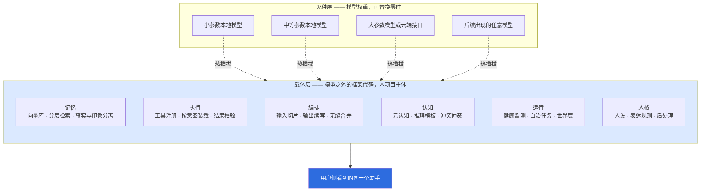
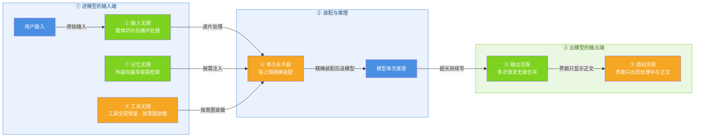

# 关于小焦：为什么做这个项目

| 项 | 内容 |
| --- | --- |
| 适用版本 | v1.0 |
| 最后更新 | 2026-09-14 |
| 维护者 | 小焦项目 |
| 文档状态 | 已发布 |

本文面向第一次接触本项目的读者，说明项目要解决的问题、采取的技术路线、作者背景与当前边界。
文中引用的数值均标注来源文件；取自设计文档但尚未落地的部分，一律标注为「设计目标」。

**术语约定**（首次出现即按此含义使用）：

- **载体**：模型之外的全部框架代码，包括记忆、工具调度、输入输出编排、结果校验、状态管理、人格与健康监测。本项目的主体是载体。
- **火种**：模型权重及其推理服务，提供单次推理能力，可替换。
- **上下文窗口**：单次请求能够容纳的 token 上限，token 指模型处理文本的最小单位。

---

## 1. 为什么做这个项目

### 1.1 出发点是一个错配

多数本地 AI 助手方案把能力重心放在模型权重上：更换模型相当于更换整个助手，
模型越大，助手能承担的任务越多。这条路线在工程上有两个直接后果。

第一，能力不可迁移。为了让某个模型表现得好而写下的规则、示例与适配，绑定在模型身上；
更换模型后需要重做。第二，能力随硬件封顶。全本地运行的模型规格受本机资源限制，
无法通过系统设计来弥补单次推理的差距。

本项目的出发点是把这两件事拆开：**单次推理能力由模型提供，其余能力由载体提供。**
载体是普通程序代码，可以维护、可以累积、可以跨模型沿用。换火种时，记忆、工具、人格设定、
健康状态都不需要重来。

### 1.2 分工如何切分

**图 1 · 火种与载体的分工**

> 代码位置：`core/carrier/capability.py`、`core/carrier/brain_registry.py`

图注：火种可更换，载体不变；用户侧看到的是同一个助手，而不是「某个模型的包装」。

### 1.3 由此得到的四条原则

| 原则 | 含义 |
| --- | --- |
| 载体优先 | 智力与能力主要由载体提供，模型只承担单次推理 |
| 模型平等 | 4B 参数级、70B 参数级、数百 B 参数级以及任意后续模型，接入的是同一套载体接口 |
| 变形金刚 | 模型可热插拔，更换火种不需要改载体设计 |
| 能力不封顶 | 插件目录里的工具只增不减，加多少用多少 |

四条原则的机器化审计在 `tools/check_principles.py`（12 条项目铁律，P1 至 P12）。

---

## 2. 现有本地 AI 方案的常见做法与代价

本节描述的是通用工程取舍，不针对任何具体产品。表中「代价」一栏均为可从公开技术资料
或本仓库实测记录核对的后果。

| 环节 | 常见做法 | 由此产生的代价 |
| --- | --- | --- |
| 长会话 | 会话变长后裁掉早期历史，或把历史压缩成摘要 | 早期的事实性内容丢失；用户重开会话后，助手不再记得此前说过的内容 |
| 超长输入 | 输入超过上下文窗口时直接报错，或静默截断 | 报错打断任务；静默截断会让用户看到与自己输入不符的回答，且无从得知内容被丢弃 |
| 超长输出 | 单次请求能生成多少就是多少 | 用户要求 3000 字、5 万字的任务，物理上无法在一次请求内完成 |
| 模型更换 | 把规则、示例、工具适配写进提示词，或针对该模型做微调 | 更换模型后这部分投入需要重做，且微调可能带来通用能力损失 |
| 模型退化 | 由用户观察异常后手动重启服务 | 复读、自相矛盾、乱调工具等问题在用户侧才被发现，没有记录也没有恢复流程 |
| 工具增长 | 工具清单写进系统提示词，条目增多后占用急剧上升，于是删减工具 | 删减会真实地丢掉能力：本仓库曾把 `plugins/search.py` 移出插件目录以「精简工具表」，实测导致 `web_search` 工具从 77 个降到 76 个（来源：`docs/six-infinity.md` 第 2 节） |
| 全本地部署 | 只使用本机跑得动的模型 | 单次推理能力受限，且这一限制无法靠提示词弥补 |

其中「工具增长」一栏可以给出具体量级。本项目实测：77 个工具的完整清单占 13891 token，
为单次请求可用上限 19224 token 的 72%，也就是说仅仅把工具目录发出去就会用掉七成以上预算
（来源：`docs/six-infinity.md` 第 7.1 节，由 `tools/check_prompt_size.py` 输出）。
本项目对此的处理方式不是删工具，而是把「工具存在」与「本轮装载多少」拆成两件事。

---

## 3. 本项目探索的方向

### 3.1 六个无限

「无限」指用户感知层面的不设上限，而不是指单次请求可以突破物理限制。六个无限分布在
一条请求链路的三个位置，全部由载体实现，没有一条依靠扩大上下文窗口。

**图 2 · 六个无限在链路中的位置**

> 一句话说明：六个无限分布在一条请求链路的进口、装配、出口三处，全部由载体实现。
> 代码位置：`core/memory_vec.py`、`core/input_splitter.py`、`core/continuation.py`、`core/carrier/capability.py`

| 编号 | 名称 | 机制 | 状态 |
| --- | --- | --- | --- |
| ① | 记忆无限 | 全部对话历史存入外部向量库，每轮按需检索若干条注入提示词 | 已实现并已实测 |
| ② | 输入无限 | 超长输入由载体切片，逐片处理后再拼装 | 已实现并已实测 |
| ③ | 输出无限 | 长输出拆成多次请求生成，再按接缝去重与断句修复合并 | 已实现并已实测 |
| ④ | 工具无限 | 插件目录中的工具一个不删、不暂缓，按意图装载本轮 schema | 第 1 步已完成并实测，强制路由与上下文隔离仍在设计中 |
| ⑤ | 感知无限 | 界面与报错文案不出现切片、循环、合并、检索、第 X 片等字样 | 部分落地 |
| ⑥ | 单次永不超 | 按上下文上限精确装配，装不下时如实报错，不静默丢弃 | 第 1 步已完成并实测，告警与统一日志行仍在设计中 |

状态一栏取自 `docs/six-infinity.md` 第 0 节的状态总览，该节明确区分「已实测」与「设计目标」，
未落地的部分不编造数字。

需要补充一条与其相关的现状：记忆检索的验收脚本包含两个阶段，向量检索与载体二次判断。
较早的一次记录里检索延迟为平均 4.5 毫秒（来源：`docs/six-infinity.md` 第 7.1 节）；
而较近的一次记录中，向量检索一段的平均耗时为 10.9 毫秒、通过判据，加上二次判断后平均 519.5 毫秒、
最大 1865.1 毫秒，超过该脚本自身的 800 毫秒判据，该次运行整体判定为验收未通过。
命中率与使用率两项在该次记录中仍为 5/5。也就是说，命中能力达标，链路延迟目前未达标。

### 3.2 记忆深度三层

记忆不是一堆句子。实现把记忆分为三层（`core/memory_deep.py`）：

| 层 | 存什么 | 检索时如何使用 |
| --- | --- | --- |
| 事实层 | 谁、何时、何地、发生了什么 | 原样存储、精确检索、不做压缩 |
| 表达层 | 寒暄、语气、口头习惯 | 只学习风格，不保存原句，回话时重新生成 |
| 印象层 | 很久以前的经历 | 细节降级但不清零，保留「经历过」这一事实本身 |

清晰度随时间降级而不是遗忘：0 至 7 天保留原话，7 至 30 天压缩为摘要，30 至 180 天降为关键词，
180 天以上只剩标签；被重新提到时升级回高清，被引用三次以上则钉住（来源：`docs/design-philosophy.md` 第 8 节）。
与之配套的是一条不容让步的规则：检索不到时明确说明「此前没有提过这件事」，
不用最相似的一条凑数。

### 3.3 健康系统

把模型输出异常当作「生病」而不是「坏了」，据此设计了监测、诊断、治疗、病历、预防五个环节
（`core/health/monitor.py`、`core/health/diagnose.py`、`core/health/heal.py`）。

- **监测**：18 类症状，分为语言 4 类（复读、乱码、断句、语速突变）、逻辑 4 类、情绪 3 类、
  行为 4 类、生理 3 类（响应超时、显存告警、内存增长）。
- **治疗**：四级。一级静默重试与截断复读；二级清理上下文并重置状态；三级切换备用火种并回滚状态；
  四级停止服务、保留现场、等待人工介入。
- **病历与预防**：每级治疗写入 `logs/health/records.jsonl`，并回灌为后续预警。

分级与 18 类的逐项触发在 `tools/test_health.py` 中验证。

### 3.4 元认知与人格层

**元认知**（`core/metacognition/`）解决的是小参数模型最危险的失败模式：不是不会，
而是不知道自己不会，然后用同样自信的语气编造。做法是答前自评把握程度、答后从多个角度交叉检查，
并把判断力的边界累积成档案，同类问题连续低把握时可以转为走工具。

**人格层**（`core/persona/`）处理的是表达而非能力：默认输出中的模板开场、万能道歉、
过度礼貌、没有立场被逐条列出并去除；同时按场景决定表达形式——闲聊给口语，列表与数据给表格，
教程给分步，代码给代码块。软化在提示词中约束，硬处理在 `strip_flavor()` 中真正删除空壳套话。

### 3.5 自主性、世界层与协同网络

**自主性**（`core/autonomy/`）指后台持续运行的学习、定时、监视任务，均为独立线程，
不与主对话线程争用。

**世界层**（`core/world/`）把互联网当作助手所处的环境而非工具箱，包含感知、探索、
可信度判断、隔离与身体边界。能访问公开页面与公开接口，需要登录或付费的内容不访问，
发布与提交类动作需要确认。

**协同网络**（`core/central/`）由一个共享的中央状态与一条事件总线构成，模块之间不互相导入，
只写自己那一片命名空间并订阅关心的事件。加模块不需要改老模块，这是「能力不封顶」在工程上的前提。
配套两条硬约束：订阅者抛出异常必须被吞掉并如实记账；事件级联必须有深度上限，避免互相触发形成死循环。

### 3.6 极限补刀七项

面向小参数模型的七项结构性补偿，都遵守同一个公式：把不确定的东西结构化，用更大模型作为教师
把能力蒸馏进结构，小模型只执行其中一小步，每次结果存回结构，于是结构越用越大。

| 项 | 落点 | 作用 |
| --- | --- | --- |
| 元推理模板库 | `core/boost/reasoning.py` | 归纳、演绎、反证、回溯、第一性原理等 30 种以上推理类型 |
| 长链因果 | `core/boost/causal.py` | 因果图、环检测、矛盾检测与回溯 |
| 跨领域联想 | `core/boost/analogy.py` | 领域向量与结构映射 |
| 模糊意图 | `core/boost/vague.py` | 该反问才反问，给出候选与多假设并行 |
| 创造性 | `core/boost/creative.py` | 多视角采样与可复现的随机种子 |
| 单次深度推理 | `core/boost/deepthink.py` | 强制思维链、思维树、自我质疑与分而治之 |
| 超长一致性 | `core/boost/consistency.py` | 实体表、关系图与生成前后校验 |

这七项已接入主流程，但每轮只挑一种生效，而不是同时叠加：多种补刀并行会把提示词挤满，
彼此也会互相干扰（分派逻辑见 `core/boost/__init__.py` 中的 `dispatch`，
相关说明见 `docs/design-philosophy.md` 第 15 节）。
七项的模块自测在 `tools/test_boost.py` 中，清单见 `docs/architecture-diagrams.md` 图 11。

### 3.7 一条红线

**绝不删除用户文件。** 该约束实现在载体层（`core/security/no_delete.py`），
不依赖模型自身的判断，也不需要开启完全访问权限。危险命令另有独立黑名单
（`tools/dangerous_commands.txt`），命中时挂起并等待用户确认。
对应测试为 `tools/test_no_delete.py`。

---

## 4. 作者背景

小焦由独立开发者维护，代码仓库为 GitHub 上的 `jiangchuangege/xiaojiao-harness`；
仓库与提交记录中没有公开更多个人履历信息。

---

## 5. 项目目标

### 5.1 短期目标

| 目标 | 依据与当前状态 |
| --- | --- |
| 补齐测试覆盖缺口 | `docs/testing-report.md` 第 6 节列出的未覆盖项：小脑推理与记忆检索的最小单测、安装器端到端、浏览器端像素级对照、NVD 接口限流 |
| 完成六个无限中第 4、5、6 项的收口 | `docs/six-infinity.md` 第 0 节标注为部分落地，强制路由、上下文隔离、超限告警与统一日志行仍在设计阶段 |
| 落地可观测性 | `docs/design-philosophy.md` 第 22 节：日志层已落地，指标与追踪为部分落地，面向用户的告警与设置页系统状态面板尚未落地 |
| 给小脑补充区分度更高的句向量后端 | `docs/six-infinity.md` 第 8.9 节列为方向；当前为字符级模型，精细语义区分度有限 |
| 为向量库增加近似检索索引 | `docs/six-infinity.md` 第 8.9 节：当前为全库矩阵扫描，数据量级上升后需要索引 |
| 补齐记忆的合并与冲突消解 | `docs/six-infinity.md` 第 8.9 节：当前写入路径为只增不减，同主题内容会累积并可能互相矛盾 |

### 5.2 长期目标

| 目标 | 含义 |
| --- | --- |
| 载体架构不变的前提下支持任意模型 | 更换火种不需要改动载体设计，用户侧始终是同一个助手 |
| 小参数模型加载体，在多数日常场景中达到可接受质量 | 设计目标是同一任务上小模型加载体的输出质量不低于大参数模型的单次输出。**这一条目前没有对照实验数据**：本机从未运行过数百 B 参数级模型，无法提供两组对照结果（来源：`docs/design-philosophy.md` 第 14 节「诚实边界」） |
| 结构化资产跨模型携带 | 模板、映射、案例、实体表等资产不写进权重，更换模型后仍然可用 |
| 自我改进闭环 | 只在提示词、工具、流程三个层面改进，并且每次改进都必须可回滚。**当前尚未落地**，`docs/design-philosophy.md` 第 17 节标注为「目录与写入路径尚未落地」 |
| 一个模型切换多个协作角色 | 用不同提示词构造规划、执行、审稿等角色，而不是运行多份模型。**当前尚未落地**，第 16 节标注为设计阶段 |

---

## 6. 欢迎贡献的方向

以下方向按当前缺口整理，不要求事先熟悉整个项目。

### 6.1 插件与工具

插件契约见 `docs/PLUGINS.md` 与 `docs/extend.md`：插件实现工具描述与执行两个入口，
工具名不得与其他工具重名，异常需转换为中文提示。插件目录中的工具只增不减。

### 6.2 测试

`docs/testing-report.md` 第 6 节把「给小脑推理与记忆检索补最小单测」列为优先事项，
理由是这两处改动最频繁、回归代价最高。测试入口为 `tests/stress/run_all.py`
（全量套件）与 `tools/` 下的模块自测脚本。

### 6.3 文档

`tools/check_docs.py` 会核对文档中以反引号标注的仓库路径是否存在，
`tools/check_mermaid.py --all` 会静态校验全部 Mermaid 图。
撰写文档时不要引用不存在的路径。

### 6.4 已知缺口的实现

- 把字符级向量后端替换为句向量模型，同时处理既有向量的迁移问题
  （当前向量维度为 512，来源：`docs/six-infinity.md` 第 7.1 节）。
- 为向量库增加 HNSW 或 FAISS 一类索引，并适配只追加写入路径。
- 记忆的合并与冲突消解策略设计。
- 面向用户的可观测性面板。

### 6.5 缺陷报告

缺陷报告与功能建议走仓库的 Issue 模板，模板要求填写现象、环境与日志。
贡献流程见 `CONTRIBUTING.md`。

---

## 变更记录

| 版本 | 日期 | 变更内容 |
| --- | --- | --- |
| v1.0 | 2026-09-14 | 首次发布。说明项目动机、现有方案的取舍、技术方向、作者背景、目标与贡献入口 |
