# 小焦 · 架构图册（20 张）

> 本文件是《小焦 · 载体优先架构》的**图册总集**。
> 图 1–11 对应 [`design-philosophy.md`](design-philosophy.md) 前十三节；
> 图 12–19 对应同一文件的**后半篇**（第十四至二十二节）；
> **图 20** 是后来补的**载体改造·路径二四阶段**（内感受 → 视角 → 硬改 → 归属回流），
> 不对应设计哲学的某一节，对应的是真实提交。
> 六个无限的逐图细解另见 [`six-infinity-diagrams/`](six-infinity-diagrams/)（7 张，含数据流与单模块时序）。
>
> 为什么单独开一份图册而不是塞进 README：
> README 是"第一眼"，读者扫两屏就该知道这是什么；图册是"要细看时"才来的地方。
> 混在一起的结果是 README 变成十几屏长图，第一眼就劝退。
>
> 图 12–20 的一个额外规矩：**每一节都标实现状态**（已落地 / 部分落地 / 设计未落地），
> 并指向真实代码路径。不标状态的架构图等于把"想做"画成"做过"。
>
> 所有图都用 `flowchart` 语法（不用 mindmap）：
> 本仓库的 `tools/check_mermaid.py` 会做**括号/引号/subgraph 配对**的静态校验，
> mindmap 不在它的校验范围内 —— 用校验得到的语法，等于让每张图每次 CI 都被检查一遍。
> 自检：`python tools/check_mermaid.py --all`（应 report 0 问题）。

---

## 图 1 · 总纲：把模型换成零件，把系统做成主体

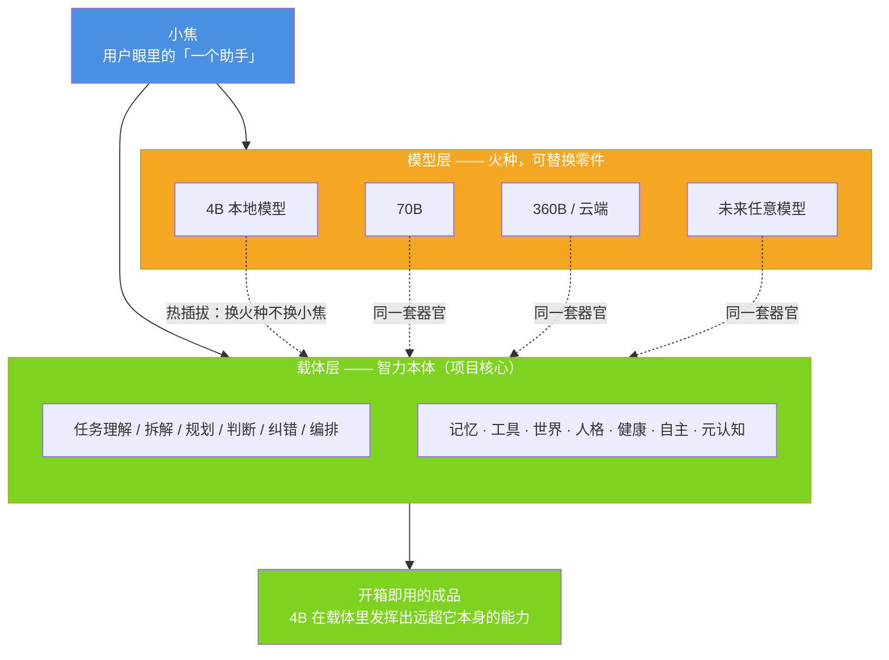

**这张图要说的一句话**：模型是**换得起**的零件，载体才是"小焦"。
用户感受到的智力来自右边那一整块，而不是左边某一个模型。

---

## 图 2 · 十一大器官（载体内部有什么）

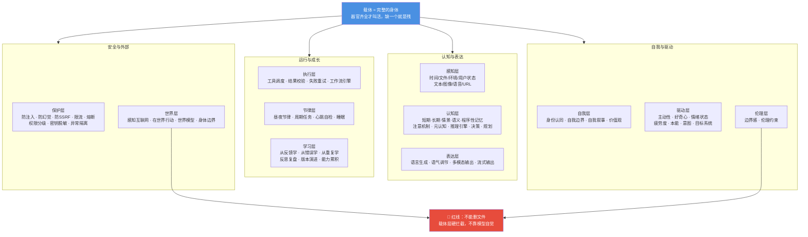

**这张图要说的一句话**：这十一层全部是**载体实现**的。
模型只负责"给一段输入吐一段输出"，其余都是身体的事。

---

## 图 3 · 载体核心智力十项（一次任务怎么被走完）

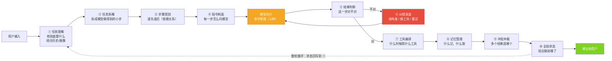

**这张图要说的一句话**：十项里**只有一格是模型**（橙色的"单步推理"），
其余九项全是载体。这就是"模型可替换"的工程含义。

---

## 图 4 · 记忆深度系统（事实 / 表达 / 印象 + 清晰度降级）

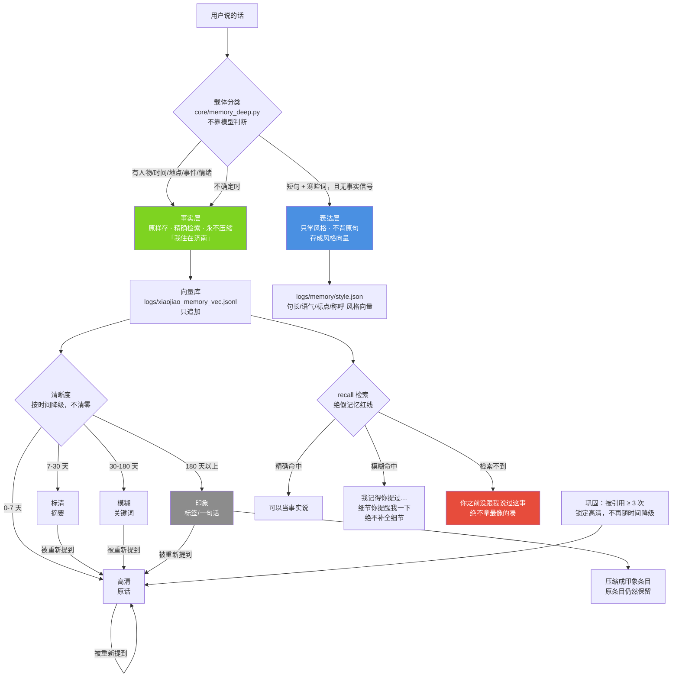

**这张图要说的一句话**：记忆的**降级不是遗忘**——
丢的是细节清晰度，留的是"我经历过"这件事本身。

---

## 图 5 · 健康系统（监测 → 诊断 → 四级治疗 → 病历 → 预防）

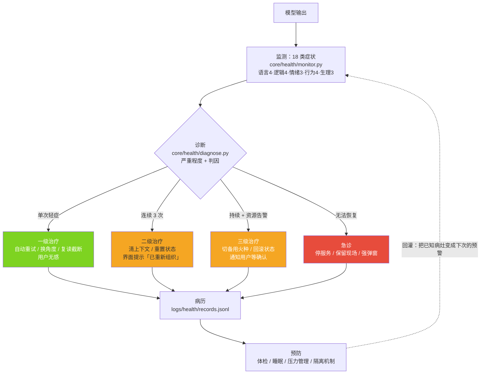

**这张图要说的一句话**：模型会退化，这不可怕；
可怕的是**没人发现**。所以载体自己当医生，而且每一级都比上一级贵。

---

## 图 6 · 变形金刚（火种库 + 能力注册 → 永远是同一个"小焦"）

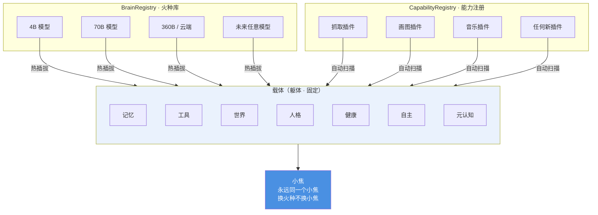

**这张图要说的一句话**：换模型时**状态一个都不能丢**——
记忆、工具、世界、人格、健康全在这个躯体里，火种只是插进来的。

---

## 图 7 · 协同网络（中央状态 + 事件总线带来的正反馈）

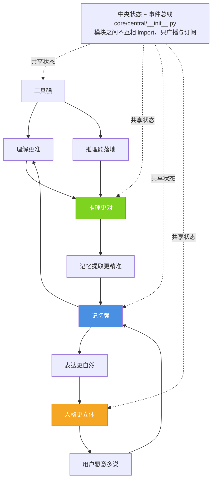

**这张图要说的一句话**：整体表现**大于**各项单独表现之和，
靠的是这条环转起来 —— 而环要转，就必须有共享状态和事件总线。

---

## 图 8 · 自主性 + 世界层（小焦活在互联网里）

```mermaid
%%{init: {"themeVariables": {"fontSize": "14px"}, "flowchart": {"htmlLabels": true, "wrappingWidth": 340, "nodeSpacing": 46, "rankSpacing": 64, "useMaxWidth": true}}}%%
flowchart TB
    ROOT["小焦 · 活在互联网里"]

    ROOT --> AUTO["自主性<br/>core/autonomy/"]
    ROOT --> WORLD["世界层<br/>core/world/"]

    AUTO --> A1["主动学习<br/>抓网页/读文档/看新闻/订阅源"]
    AUTO --> A2["主动探索<br/>发现新网站/新 API/新工具"]
    AUTO --> A3["主动监控<br/>盯着用户关心的事"]
    AUTO --> A4["主动思考<br/>后台整理/分析/总结/反思"]
    AUTO --> A5["主动成长<br/>积累经验/优化流程/扩展能力"]

    WORLD --> W1["感知互联网<br/>观察 / 热点 / 变化"]
    WORLD --> W2["在世界行动<br/>搜索 / 监控 / 发布"]
    WORLD --> W3["世界模型<br/>网站 / 信息源 / 可信度"]
    WORLD --> W4["身体边界<br/>能碰 / 不能碰 / 要确认"]
    W4 --> RED["🚫 红线：不能删文件"]

    CLOSE{"五步闭环<br/>推理 → RAG → 匹对 → 校验 → 吸收"}
    A1 -.-> CLOSE
    W1 -.-> CLOSE
    CLOSE --> ABS["吸收进记忆<br/>带「为什么信它」"]

    style ROOT fill:#4A90E2,color:#fff
    style AUTO fill:#7ED321,color:#fff
    style WORLD fill:#F5A623,color:#fff
    style RED fill:#E74C3C,color:#fff
```

**这张图要说的一句话**：互联网不是小焦的**工具箱**，是它的**世界** ——
所以它得一直看、一直走、一直学，而不是"用户问了才动"。

---

## 图 9 · 完整架构大图（请求从进来到出去的全程）

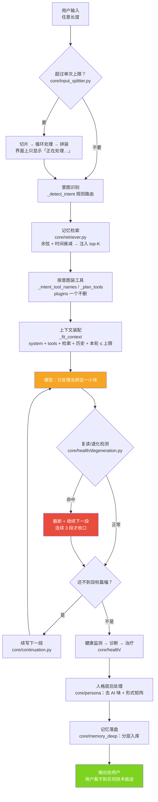

**这张图要说的一句话**：用户看到的是"一次问答"，
背后是**切片、检索、装配、多段生成、检测、治疗、后处理、落盘**一整条流水线。

---

## 图 10 · 六个无限（都发生在模型外面）

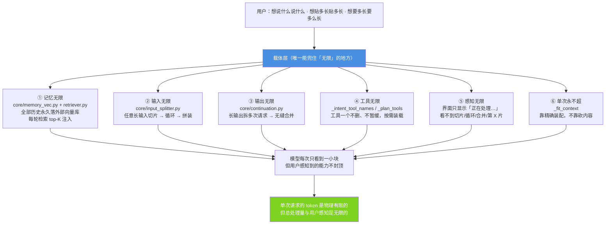

**这张图要说的一句话**：六个无限**没有一个**是靠扩大 ctx 实现的，
全靠载体在模型外面兜。

---

## 图 11 · 极限补刀五项（让 4B 在载体里逼近大模型）

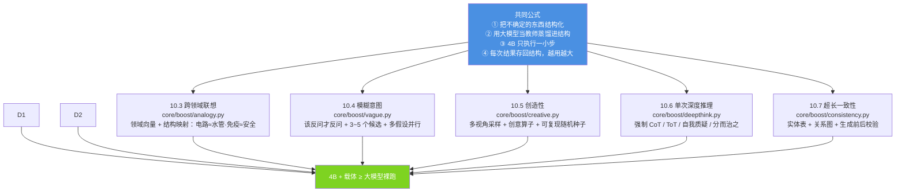

**这张图要说的一句话**：这几项**都遵守同一个公式**——
结构由载体维护，模型只走一小步，走完把结果存回去，于是越用越大。
缺了"存回去"那一步，前三条就退化成普通的提示词工程。

---

## 图 12 · 精度叠加（载体给模型附加"等效精度"）

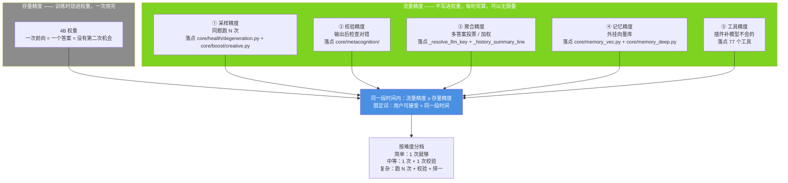

**这张图要说的一句话**：4B 是**存量**精度（一次用完），载体叠上去的是**流量**精度（可无限叠）——
超的不是"单次智力"，是"同一段时间内能堆多少次算力换准确度"。
图里五项标的是**真实代码落点**，不是设想；完整流水线尚未落地的那部分见设计哲学第十四节的诚实边界。

---

## 图 13 · 速度优化（只做无损加速 · 现状与目标）

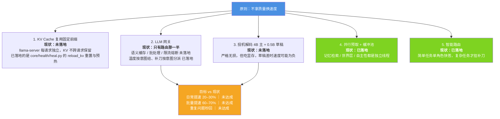

**这张图要说的一句话**：五条里**两条已落地、一条落了一半、两条还是设计**——
gaps 那一框写出来不好看，但文档的作用是让人知道离目标还有多远，不是让人以为已经到了。

---

---

## 图 14 · 自我改进闭环（能改的和不能改的）

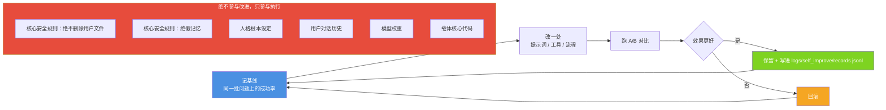

**这张图要说的一句话**：**没有回滚的自我改进就是自我损坏**——
所以"记基线 → A/B → 保留或回滚"这三步不是流程装饰，是这套机制能开的前提。
右框那六条永不参与改进：一个能自己改自己的系统，出了问题没人能定位。
现状：目录与写入路径**尚未落地**；已有的元认知边界档案与记忆深度改的是**数据**，不是**流程**。

---

## 图 15 · 全局工作空间（公共黑板 · 实际落地在 core/central/）

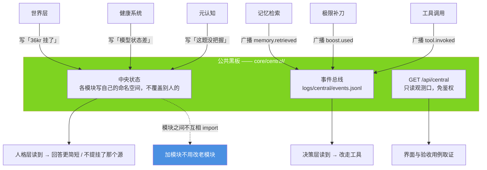

**这张图要说的一句话**：模块之间**不互相 import**，只往黑板上写、只读自己关心的那一片——
这才是"能力不封顶"的工程前提。
设计里叫 `core/workspace/`，实际叫 `core/central/`：**已经能干活的名字，不为文档好看去动它。**

---

## 图 16 · 小脑定位（感官 + 记忆索引器官 · 空间 v3）

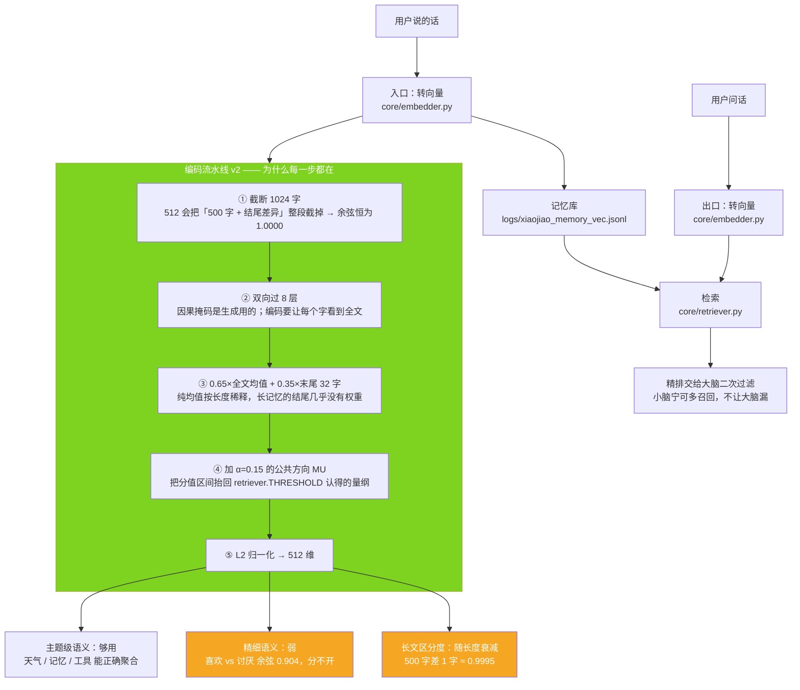

**这张图要说的一句话**：小脑是**感官和索引**，不是脑子——它不思考、不说话，只把话变成向量。
右边三框是它的**已知边界**，全部实测：够用的够用，不够用的老实说不够用。
第④步那个 α 是**分值口径旋钮**：不去掉因果掩码就换不来区分度，而换了区分度就会压垮老阈值——
两件事必须一起改，改一件就是悄悄改了一个别人依赖的接口。

---

## 图 17 · 意图理解交给模型（载体给信息，模型做判断）

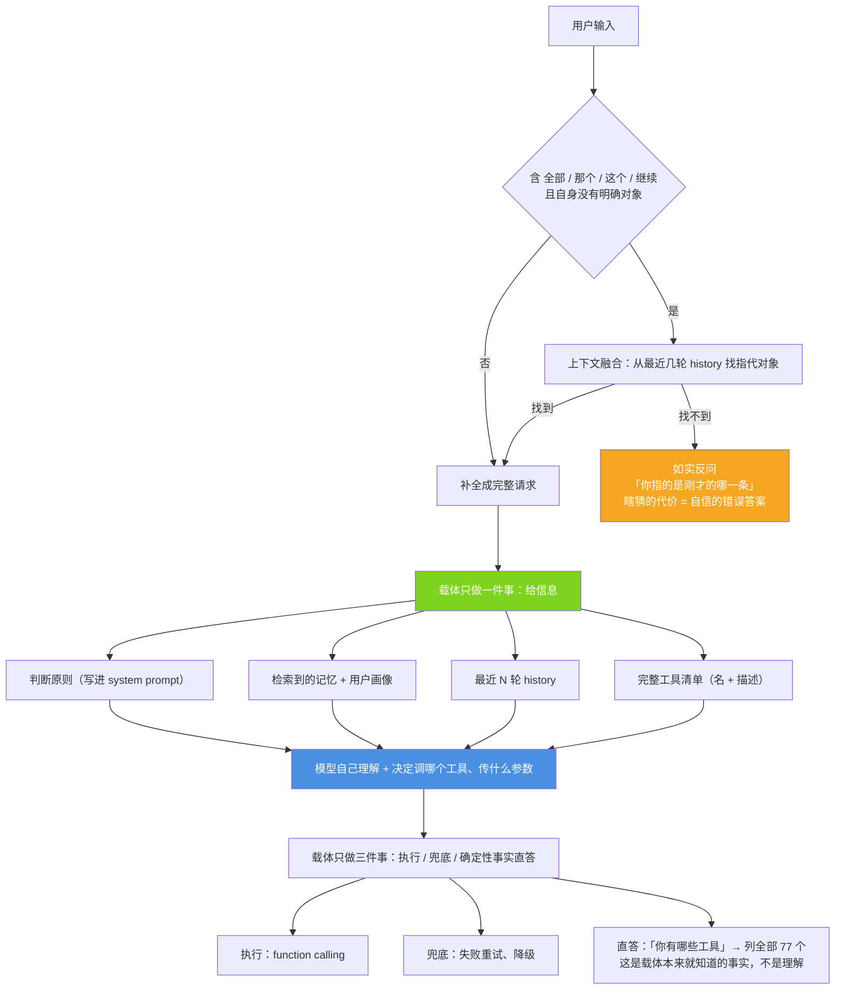

**这张图要说的一句话**：载体**不替大脑判断该走哪条路**——规则永远列不全，加 100 条规则，第 101 种说法还是漏。
载体只给信息、只执行、只兜底；**唯一保留的"判断"是那些本来就知道的确定性事实**。

---

## 图 18 · 并发与状态一致性

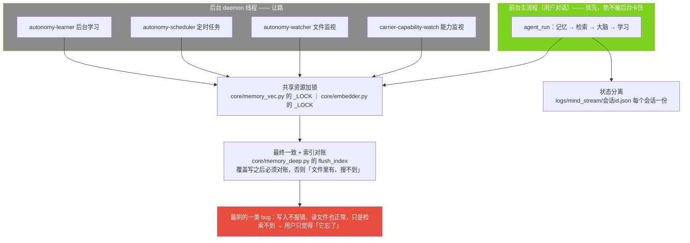

**这张图要说的一句话**：最终一致换来的是"前台不卡"，代价是"后台看到的世界可能晚几秒"——
这个交换**只在后台任务不参与当前答案时才成立**；一旦要参与（比如记忆写入），就必须当场同步。

---

## 图 19 · 可观测性（四个层次 · 现状如实标）

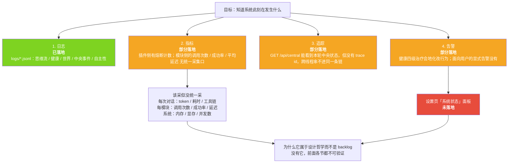

**这张图要说的一句话**："协同网络整体大于部分之和""健康系统在预防""精度在叠加"——
这些判断都需要**能实时看到每个模块在干什么**才成立。
观测性不是运维附属品，它是这套架构**能不能被证明在工作的前提**。

---

## 图 20 · 载体改造·路径二：从「观测」到「硬改」再到「归属回流」（四阶段）

> **实现状态：四阶段全部落地**，逐段对应真实提交与代码路径。
> 第一节（内感受）`fce45b1`、第二节（视角状态）`0b897a9`、
> 第三节（代码层硬改）`4092ed3`、第四节（自我模型·因果归属）`3326c1f`。

```mermaid
%%{init: {"themeVariables": {"fontSize": "14px"}, "flowchart": {"htmlLabels": true, "wrappingWidth": 340, "nodeSpacing": 46, "rankSpacing": 64, "useMaxWidth": true}}}%%
flowchart TB
    TICK["每一拍：`_soma_tick()`<br/><b>放在 `_idle_work_tick` 最前面</b><br/>在「状态偏置→提前返回」之前<br/>否则越偏越不采，累积永远起不来"]

    subgraph P1["第一阶段 · 内感受 `core/interoceptive.py`（fce45b1）"]
        direction TB
        S1["`sample()` 五项真采<br/>精力 / 心跳稳定 / 心的强度 / 推理负载 / 内存<br/>读不到的如实进 `missing`"]
        S2["`deviation()` 偏离度<br/>0 = 在基线，1 = 偏满（方向统一成「偏大=更偏」）"]
        S3["`update()` 累积<br/>survival ← 0.80·s + 0.20·pert，上限 0.98<br/>落 `logs/interoceptive.jsonl`"]
        S1 --> S2 --> S3
    end

    subgraph P2["第二阶段 · 视角状态 `core/perspective.py`（0b897a9）"]
        direction TB
        G1["g ← 0.92·g + 0.08·扰动<br/>三维：vigilance / openness / wound"]
        G2["**持久化 `logs/perspective.json`，重启恢复**<br/>`note_dialogue_turn()` 只记不重置"]
        G1 --> G2
    end

    subgraph P3["第三阶段 · 代码层硬改（4092ed3）—— 判据是「真的改了」，不是「它说它累了」"]
        direction TB
        POL["`policy()` → 轻 / 中 / 重<br/>`_state_policy()` 是唯一出口<br/>读不到 → 中性规则，不拦任何东西"]
        H1["**输入**：`context_scale` 砍上下文<br/>1.0 / 0.6 / 0.4"]
        H2["**行动**：探索类工具从**本轮工具表里拿掉**<br/>（不是排后面、不是告诉它别用）<br/>保守类排到前面"]
        H3["**主动**：`no_browse` → 门**直接锁死**<br/>根本不问模型"]
        POL --> H1
        POL --> H2
        POL --> H3
    end

    subgraph P4["第四阶段 · 自我模型 `core/self_model.py`（3326c1f）"]
        direction TB
        N1["`note(kind, cause, effect, before, after)`<br/>记的是因果，不是感受：<br/>「因为精力低（0.28），这轮少装了工具（12→7）」"]
        N2["`stance()` → `trim_pressure` / `suppress`<br/>最近被状态裁过多少次"]
    end

    TICK --> P1
    TICK --> P2
    P1 -->|"`bias()`：survival / level / factors"| P2
    P2 --> P3
    H2 -.->|"记「输入被裁」"| N1
    H3 -.->|"记「主动被压」"| N1
    N1 --> N2
    N2 -.->|"**反馈：成为下一轮硬改的输入之一**<br/>`suppress` 为真时把档位提到「中」<br/>（不是记完就完了）"| POL

    style TICK fill:#4A90E2,color:#fff
    style P1 fill:#7ED321,color:#fff
    style P2 fill:#7ED321,color:#fff
    style P3 fill:#F5A623,color:#fff
    style P4 fill:#7ED321,color:#fff
```

**这张图要说的一句话**：状态不是"写在提示词里劝它"，而是**代码层真的改了它这一轮看到什么、
能做什么、要不要主动** —— 而"改了什么"又被记成因果、反过来喂回下一轮的策略，形成闭环。

**如实标注（这一图有三条）**：

1. **`行动被裁` 这个类别没有调用点。** `self_model.KINDS` 声明了三类
   （`输入被裁` / `行动被裁` / `主动被压`），但服务里真的会记的只有两类：
   `_plan_tools()` 里记 `输入被裁`（工具表被裁那一条就记在这里），
   `_browse_decide()` 里记 `主动被压`。**`行动被裁` 声明了但没人写**，如实记在此处。
2. **`drop_tools` 用名字片段匹配**（`x in str(n).lower()`），可能漏判也可能误裁，
   没有做工具白名单。这是已知的粗糙处，没有改。
3. **四阶段的量全是载体算的刻度。** 偏离度、`survival`、三维的 `g`、`trim_pressure` ——
   都是人定常量算出来的数；**主观体验这一层载体观测不到，也不声称能**。
   这套东西证明的是"状态真的改了行为"，不是"它真的难受"。

---

## 图册自检

```bash
python tools/check_mermaid.py --all      # 全部 .md 里的 mermaid 块静态校验（应 0 问题）
python tools/check_docs.py               # 文档完整性（应包含本文件）
```
