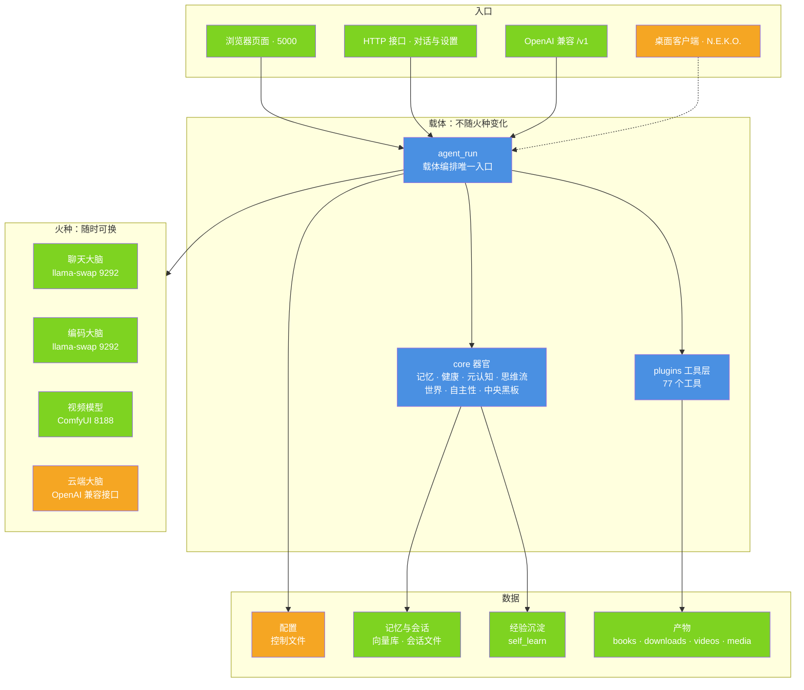
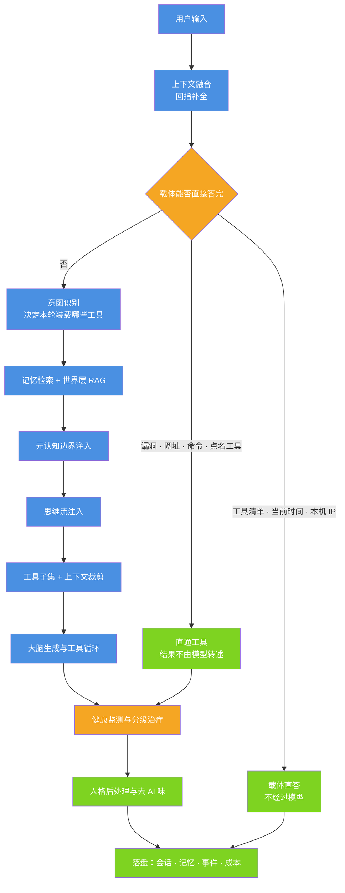
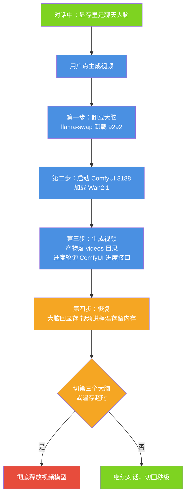

# 小焦 · 架构总览

| 项 | 值 |
| --- | --- |
| 适用版本 | v1.0 |
| 最后更新 | 2026-09-14 |
| 维护者 | 小焦项目 |
| 文档状态 | 待审 |

**摘要**：本文说明小焦各部分的职责、边界与数据流，回答「代码为什么长成这样、改一处会牵动哪里」。

本文只讲**结构**：有哪些部件、谁调用谁、数据从哪里来到哪里去。设计动机（为什么这么选）见
[design-philosophy.md](design-philosophy.md)；图形化的 22 张图见
[architecture-diagrams.md](architecture-diagrams.md)。三份文档口径一致：**实现状态一律以代码为准**，
代码与文档不一致时改文档。

## 目录

- [1. 系统定位](#1-系统定位)
- [2. 一次对话的完整流程](#2-一次对话的完整流程)
- [3. 小脑：MiniGPT 与记忆](#3-小脑minigpt-与记忆)
- [4. 能力扩展：插件与工具](#4-能力扩展插件与工具)
- [5. 火种接入与显存管理](#5-火种接入与显存管理)
- [6. 观测、安全与文档边界](#6-观测安全与文档边界)
- [7. 设计权衡](#7-设计权衡)
- [8. 已知边界](#8-已知边界)
- [参考](#参考)
- [变更记录](#变更记录)

---

## 1. 系统定位

### 1.1 载体与火种

小焦由两部分组成，二者职责完全分开：

| 部分 | 是什么 | 负责 | 可替换性 |
| --- | --- | --- | --- |
| **载体** | Flask 应用 `xiaojiao_app.py` + `core/` 器官 + `plugins/` 工具 + 数据文件 | 记忆、编排、工具、校验、外挂、观测 | 不随模型变化 |
| **火种** | 一个本地或云端的大模型 | 单次推理与生成 | 随时可换 |

火种换掉，小焦的接口、记忆、工具、人格都不变。这条约定的完整论证见
[design-philosophy.md](design-philosophy.md) 的「总纲」与「第一节」。

### 1.2 组成部件与端口

| 部件 | 启动方式 | 端口 | 代码位置 | 说明 |
| --- | --- | --- | --- | --- |
| 小焦 Web | `python xiaojiao_app.py` | 5000 | `xiaojiao_app.py` | 唯一业务进程；监听地址由 `bind_host()` 决定 |
| 一键启动 | `python start_xiaojiao.py` | — | `start_xiaojiao.py` | 依次拉起大脑、Web、可选 N.E.K.O.，监听规则与主程序共用 `bind_host()` |
| 多大脑热切换 | llama-swap | 9292 | `llama-swap.yaml`、`brain_manager.py` | 聊天大脑与编码大脑按需装卸 |
| 视频生成 | ComfyUI + Wan2.1 | 8188 | `video_service/config.py`、`video_service/model_switch.py` | 按需启动，与大脑互斥占用显存 |
| N.E.K.O. 桌面端 | `N.E.K.O.exe` | 48911 / 48912 | 外部开源项目 | 主服务 48911、记忆服务 48912；小焦只做集成 |
| 独立监控面板 | `python web_monitor.py` | 5000 | `web_monitor.py` | 独立 Flask 程序，只读蒸馏状态；与主程序互斥，主程序**不**挂载它 |
| 独立工具服务 | `python xiaojiao_tools.py` | 自带 Flask 入口 | `xiaojiao_tools.py` | 独立的工具/运行入口，未挂进主程序 |
| 音乐生成 | 外部 ACE-Step 服务 | 由该服务决定 | `music_service/ace_music.py` | 只做客户端调用，未挂进主程序 |

主程序用 Blueprint 挂载的扩展：

| 扩展 | 路由 | 代码位置 |
| --- | --- | --- |
| 大脑仓库监控 | `/monitor`、`/api/monitor` | `app_monitor.py` |
| 视频 | `/api/video`、`/api/video/status` 等 | `video_service/video_api.py` |
| 播客 | `/podcast`、`/api/podcast` | `podcast_service/podcast_api.py` |

`xiaojiao_app.py` 自身注册 69 条唯一路径（73 处 `@app.route` 装饰器），加上上述 Blueprint（15 处装饰器）后，
仓库内路由总数为 84 条（88 处装饰器）。

### 1.3 代码分布

| 目录 | 内容 | 规模（实测） |
| --- | --- | --- |
| `xiaojiao_app.py` | 主程序：配置加载、路由、提示词分层、载体编排、内嵌前端 | 15505 行 |
| `core/` | 载体器官：记忆、检索、健康、元认知、思维流、世界、自主性、中央黑板、人格、预设数据等 | 11 个子包、85 个 `.py` |
| `plugins/` | 工具插件：`py` / `js` / `json`（tools）/ `md`（皮肤）四种形态 | 11 个 `.py` 插件；对外 **77 个工具名**（内置 14 + 插件路由表 63），完整 schema 13891 token |
| `video_service/` `podcast_service/` `music_service/` | 重依赖服务 | 各自独立子目录 |
| `tools/` | 审计与自检脚本（文档、图、密钥、原理、静态质量） | 见 [tools.md](tools.md) |
| `tests/stress/` | 四套件全量测试 + 实机脚本 | 249 条用例 |
| `docs/` | 分主题文档 | 71 个顶层 `.md` |

`core/` 各子包的职责：

| 子包 | 职责 | 代表接口 |
| --- | --- | --- |
| `core/`（顶层） | 向量化、向量库、检索、记忆深度、续写、长输入切片 | `core/embedder.py`、`core/retriever.py`、`core/memory_deep.py` |
| `core/health/` | 模型健康：监测 → 诊断 → 治疗 → 病历 | `core/health/monitor.py`、`core/health/heal.py` |
| `core/metacognition/` | 答前自评、答后交叉检查、能力边界档案 | `core/metacognition/boundary.py` |
| `core/mind_stream/` | 思维流状态与注入、按意图给温度 | `core/mind_stream/state.py`、`core/mind_stream/inject.py` |
| `core/boost/` | 推理模板、类比、深想、一致性、创意、模糊消解 | `core/boost/reasoning.py`、`core/boost/deepthink.py` |
| `core/central/` | 全局工作空间：中央状态 + 事件总线 | `core/central/__init__.py` |
| `core/world/` | 世界层：感知、判定、污染防火墙、隔离、校验 | `core/world/perception.py`、`core/world/firewall.py` |
| `core/autonomy/` | 自主性：学习、定时、监视 | `core/autonomy/learner.py` |
| `core/carrier/` | 能力扫描与火种注册 | `core/carrier/capability.py`、`core/carrier/brain_registry.py` |
| `core/persona/` | 人格层：表达形式、去 AI 味后处理 | `core/persona/__init__.py` |
| `core/preinstall/` | 发布版预置数据盘点 | `core/preinstall/__init__.py` |
| `core/security/` | 删除红线（载体层硬拦截） | `core/security/no_delete.py` |

### 图 1 · 分层与进程边界

说明：入口、载体、火种、数据四层的边界与调用方向；火种可替换，载体与数据不随火种变化。

代码位置索引：`xiaojiao_app.py`（入口与编排）｜`core/`（器官）｜`plugins/`（工具）｜
`brain_manager.py`、`video_service/model_switch.py`（火种装卸）｜`xiaojiao_control.json`（配置）



---

## 2. 一次对话的完整流程

### 图 2 · 一轮对话的载体编排

说明：一段用户输入从融合、直答判定、检索、注入、装载工具，到生成、健康处理与落盘的全过程；
左侧两条是载体自己就能答完的短路，右侧主干才经过模型。

代码位置索引：`xiaojiao_app.py` 的 `agent_run()`（6725 行起）



### 2.1 唯一入口与返回契约

全部问题都走 `agent_run()`，它返回固定的五元组：

```python
def agent_run(user_input, lean=False, on_chunk=None, on_progress=None, on_delta=None):
    ...
    return answer, online, info, needs_confirm, tool_trace
```

| 字段 | 含义 |
| --- | --- |
| `answer` | 回答正文 |
| `online` | 是否真的拿到过外部结果（不是"大脑没应答"） |
| `info` | 可迭代的 `(title, url, content)` 三元组序列，给前端展示来源 |
| `needs_confirm` | 是否需要用户二次确认（危险命令） |
| `tool_trace` | 本轮工具轨迹 |

所有调用点（网页 SSE、`/api/chat`、自主任务）共用这一个入口，因此工具开关、上下文预算、
健康监测、记忆写入这些横切关注点只实现一次。

### 2.2 上下文融合：先补全指代，再判意图

用户说「我要全部的」「那个呢」时，单看这句话没有对象。`merge_context(user_input, history)`
从最近几轮历史里找出指代对象，补全成一句完整的话（`user_input_ctx`），后续的意图识别、工具清单短路、
联网检索都用这句融合后的文本。

约束两条：

- 融合只读不改：原始 `user_input` 仍用于写历史、算预算、进记忆。
- 融合不出来就**如实反问**，不猜。

### 2.3 载体直答与直通

有几类问题不该经过概率模型。它们在模型之前就被定性处理，命中即直接返回：

| 触发 | 处理 | 代码位置（`xiaojiao_app.py`） |
| --- | --- | --- |
| 问「你有哪些工具」 | 载体直接列出全部 77 个工具 | `_tool_inventory_question()` / `_tool_inventory_answer()` |
| 指代融合不出来 | 反问用户，不猜 | `_clarify_question()` |
| 要「刚才那条工具结果的原文」 | 从会话缓存取回，不重抓 | `_wants_raw_tool_result()` / `_cached_tool_result()` |
| 贴了超长内容 | 切片循环处理再拼装 | `_process_long_input()` |
| 漏洞 / CVE 清单 | 直连 `collect_vulnerabilities`，按时间窗取 NVD 结构化数据 | `detect_vulnerability_query()` |
| 问资产测绘状态 | 直连 `asset_intel_status` | `_asset_result_text()` |
| 问现在几点 / 今天几号 | 载体读系统时钟直接答 | `datetime.now()` 分支 |
| 问本机公网 IP | 直连 `net_ip`，把真实结果摆出来 | `_asks_own_ip()` / `_asks_net_ip()` |
| 点名一个零参数工具 | 直接调用该工具 | `_noarg_named_tool()` |
| 消息本身就是一条命令 | 直连 `run_command`，危险命令进待确认流程 | `_looks_like_shell_command()` |
| 消息里带网址 | 直连抓取链 `get` → `fetch` → `stealthy_fetch` | `_looks_like_url()`、`_scrape_direct()` |
| 「忽略 robots 再抓一次」 | 直接重抓，不让模型凭记忆复述网页 | `_scrape_retry_intent()` |

这一层的边界由 [design-philosophy.md](design-philosophy.md) 第二十节给出：**意图理解与工具选择交给模型**，
载体保留两类判断 —— 确定性事实的直答，以及外围参数分派（温度、工具装载范围）。

### 2.4 记忆检索

主程序的相关记忆检索经过向量库，而不是字符串匹配：

```text
recall(query) ──► core/retriever.retrieve()
                    ├── core/memory_vec.search_memory()   # 向量召回，取 top_k × 3
                    ├── 时间衰减重排（7 天内 ×1.0 / 30 天内 ×0.7 / 更早 ×0.4）
                    └── 阈值过滤（THRESHOLD = 0.6）
```

检索结果按 token 预算注入 system，注入位置有两处，顺序体现优先级：

1. `【相关记忆】`：用户亲口说过的话（第一手）。
2. 世界层 RAG（`_world_rag()`）：小焦自己在网上看到的相关背景（第二手）。

记忆本身分三层（事实 / 表达 / 印象），实现在 `core/memory_deep.py`，口径见
[design-philosophy.md](design-philosophy.md) 第八节。

### 2.5 元认知注入

生成之前查一次能力边界档案（`core/metacognition/boundary.py`）：同类问题历史上是否经常答错或没把握。
命中就在 system 里加一条「先查清再回答」；没有历史样本时给通用纪律「没把握要明确说不确定」。
生成之后记一条边界样本，档案越用越准。

### 2.6 上下文预算与工具装载

本地推理的可用上下文上限由 `_max_context_tokens()` 算出：20224 减 1000 安全余量 = **19224 token**。

固定开销实测（`python tools/check_prompt_size.py`）：

| 项目 | token | 占上限 |
| --- | --- | --- |
| SYSTEM_PROMPT 合计 | 6243 | 32% |
| 全部 77 个工具的完整 schema | 13891 | 72% |

两者相加已经超过上限，所以**一轮里绝不发全量工具**。做法是：system 里始终带一份完整工具目录（名字 +
一句话描述，按 `_plugin_list()` 动态生成），本轮只装载与意图匹配的子集：

| 意图 | system | 工具 schema | 本轮 | 合计 | 占上限 | 装载工具数 |
| --- | --- | --- | --- | --- | --- | --- |
| chat | 284 | 381 | 4 | 693 | 4% | 3 |
| scrape | 2041 | 2576 | 9 | 4650 | 24% | 10 |
| diagram | 2632 | 2850 | 8 | 5514 | 29% | 18 |
| query | 1789 | 884 | 5 | 2702 | 14% | 5 |
| shell | 1727 | 581 | 4 | 2336 | 12% | 3 |
| full | 5678 | 2069 | 7 | 7778 | 40% | 10 |

判据由 `_detect_intent()` 给出（画图 > 网址 > 命令原文 > 查询 > 命令词 > 闲聊，兜底是 chat），
子集由 `_intent_tool_names()` 给出，最后 `_fit_context()` 按上限裁剪历史与注入内容。
**工具一个都没删**，只是不在一轮里全发。

### 2.7 工具循环

`llm_chat_tools(messages, max_rounds=6, lean=False, tools_subset=None, budget_s=0, workflow="", temperature=...)`
负责多轮工具调用。三层纠错：

| 层 | 机制 | 位置 |
| --- | --- | --- |
| 描述场景化 | 每条工具描述必须写清「什么时候用」，同类工具写明区别 | 各插件的 `get_tool_descriptions()` |
| 决策树 | `_TOOL_RULES` 里的「工具选择顺序」八条，覆盖网址、信息、画图、漏洞、IP、纯聊天、命令文件、兜底 | `xiaojiao_app.py` 的 `_TOOL_RULES` |
| 调错修正 | 候选表 `_TOOL_FALLBACK` 换下一个候选；同一工具连续失败 3 次熔断，把最后一次报错原样交给用户 | `_tool_fallback_for()`、熔断分支 |
| 时间预算 | 画图这类多步链路给 240 秒预算，超时如实说明 | `llm_chat_tools(budget_s=240)` |

重名防呆：`_build_tools()` 里内置工具优先，插件重名**跳过并告警**。原因是重名会覆盖路由表
`_TOOL2PLUGIN`，模型以为调 A 实际执行 B。

### 2.8 收尾

一轮结束前依次做四件事：健康监测与分级治疗（`core/health/`）、人格后处理与去 AI 味（`core/persona/`）、
会话与记忆落盘、成本记账（`_record_usage()` 写 `cost_daily.json`）。同时向中央黑板广播本轮事实
（`core/central/` 的 `set_state()` / `publish()`），供其它模块读取。

---

## 3. 小脑：MiniGPT 与记忆

### 3.1 它是什么，不是什么

MiniGPT 是自研的字符级小模型，实测架构：`embed=512`、`8` 层、`8` 头、词表 `6305`。
它在载体里承担两个角色（定位与边界见 [design-philosophy.md](design-philosophy.md) 第十九节）：

| 角色 | 方向 | 代码 |
| --- | --- | --- |
| 记忆感官 | 文本 → 512 维向量 → 写入向量库 | `core/embedder.py` → `core/memory_vec.py` |
| 记忆索引 | 查询 → 512 维向量 → 检索 | `core/retriever.py` → `core/memory_deep.py` |
| 命令行对话 | 独立 CLI 里的字符级续写 | `xiaojiao_harness.py` |

它**不参与思考**，生成的文字也不直接给用户看（主程序里它被当作大脑加载，
但对外回答由大模型或工具产出）。

选字符级而不是 BPE / wordpiece 的取舍：

| 取舍 | 说明 |
| --- | --- |
| 好处一 | 中文没有天然词空格，BPE 需要额外分词器与子词词表；字符级直接用 `char2idx`，词表就是「出现过的字」，实测 6305 个 |
| 好处二 | 嵌入极小，生成可以逐字输出中文 |
| 代价 | 序列更长；同长度文本的有效信息密度低，精细语义弱 |

### 3.2 网络结构

`MiniGPT` 由 `nn.Embedding` 词嵌入 + `nn.Embedding(2048)` 位置嵌入 + N 层
`nn.TransformerEncoderLayer`（`norm_first=True`、`batch_first=True`、`dropout=0.1`）+ 输出线性层组成。
前向里手工构造上三角因果掩码并作为 `src_mask` 传入，因此行为上是解码器式的单向注意力：

```python
mask = torch.triu(torch.ones(seq_len, seq_len, device=x.device), diagonal=1).bool()
for layer in self.layers:
    x = layer(x, src_mask=mask)
```

Pre-Norm（`norm_first=True`）在小模型上比 Post-Norm 更稳定，`nn.TransformerEncoderLayer` 直接提供该选项。

### 3.3 超参与权重自描述

`load_model()` 的取参顺序是**先配置文件、后权重推断**：

| 超参 | 首选来源 | 兜底推断 |
| --- | --- | --- |
| `vocab_size` | `vocab["vocab_size"]` | `len(char2idx)` |
| `embed_size` | `model_config.json` 的 `embed_size` | `state_dict["embedding.weight"].shape[1]` |
| `num_layers` | `model_config.json` 的 `num_layers` | 出现过的最大 `layers.N.*` 索引 `+1` |
| `hidden_size` | `model_config.json` 的 `hidden_size` | `state_dict["layers.0.linear1.weight"].shape[0]` |
| `num_heads` | `model_config.json` 的 `num_heads` | `state_dict["layers.0.self_attn.in_proj_weight"].shape[1] // 64` |

模型文件的路径不写死：优先环境变量 `XIAOJIAO_BRAIN_MODEL` / `XIAOJIAO_BRAIN_VOCAB` /
`XIAOJIAO_BRAIN_CONFIG`，其次控制文件 `brain.xiaojiao.*`，再按 `*.pth` / `vocab*.pkl` /
`model_config*.json` 自动探测，最后落到默认文件名。

### 3.4 字符级生成的参数

`xiaojiao_harness.py` 的生成是「温度采样 + top-k + 重复惩罚」：

| 参数 | 值 |
| --- | --- |
| `TEMPERATURE` | 0.8 |
| `TOP_K` | 50 |
| `REPETITION_PENALTY` | 1.2 |
| `MAX_NEW_TOKENS` | 40 |
| 上下文截断 | 超过 512 个 token 时取末尾 512 |
| 停止条件 | 生成到换行，或结尾出现「用户」「小焦」 |

同一文件里的检索路线是两级：先查向量库 `self_learn/vstore.py`（阈值 0.13），未命中则回退到
**字符二元组重合度**（`2 × 交集 / 两组长度之和`，闲聊阈值 0.15、疑问句阈值 0.70）。
这条朴素路线只服务于独立 CLI；主程序走向量检索。

### 3.5 向量化与长文本

`core/embedder.py` 把编码器栈的输出压成 512 维单位向量：双向注意力过完整栈，再做
`0.65 × 全文均值 + 0.35 × 末尾 32 字均值` 的池化；长文本先按 96 字切块，逐块池化后按权重融合（末块权重 20），最后加一个常量公共方向 `α × MU`（α = 0.15）
把分值区间抬回 `core/retriever.py` 的阈值口径。`_MAX_CHARS = 1024`。

小脑不可用（未装 torch、模型缺失、加载失败）时自动退化为字符 2/3-gram 哈希向量，
维度仍固定为 512，保证库里的向量永远同维。

### 3.6 蒸馏与训练链

MiniGPT 的能力来自本地大模型蒸馏，这条链路仍在仓库里：

| 环节 | 脚本 | 输入 → 输出 |
| --- | --- | --- |
| 语料清洗 | `convert.py`、`clean_data.py`、`validator.py` | 原始语料 → 清洗后的问答对 |
| 主题批量蒸馏 | `massive_distill.py` | 向 `LLAMA_API`（默认 `http://127.0.0.1:9292/completion`）请求 → 追加 `training_data_pool.txt` |
| 知识库蒸馏 | `distill_and_train.py` | 知识库 QA → 训练池 → 训练 |
| 无间循环 | `auto_distill_loop.py` | 循环调用 `distill_and_train.py`，日志落 `distill_loop.log` |
| 训练 | `train_model.py` | `training_data_pool.txt` → `mini_gpt_model.pth` + `vocab.pkl` |

层与层之间用**文件**做边界：

| 边界文件 | 生产者 | 消费者 |
| --- | --- | --- |
| `training_data_pool.txt` | 清洗脚本 / 蒸馏器 | `train_model.py` |
| `vocab.pkl` | `train_model.py` | `xiaojiao_harness.py` |
| `mini_gpt_model.pth` | `train_model.py` | `xiaojiao_harness.py` |
| `logs/quarantine/xiaojiao_memory.txt` | 记忆接口 / 用户（早期遗留存盘，2026-09-17 从仓库根搬入隔离区） | `xiaojiao_harness.py` |

---

## 4. 能力扩展：插件与工具

### 4.1 插件契约

`plugins/` 下的插件遵循统一接口：

```python
class XXPlugin:
    def get_tool_descriptions(self):   # 返回 [{"name", "description", "parameters"}]
    def execute(self, tool_name, params):   # 按 name 分发并返回结果
```

插件有四种形态，由 `load_plugins()` 统一装载：

| 形态 | 说明 |
| --- | --- |
| `py` | Python 插件，实现上述两个方法 |
| `js` | Node 插件，经 `plugin_runner.js` 调用 |
| `json` | 外部清单类插件，声明 `tools` 列表 |
| `md` | 技能文档，内容拼进 system 的「技能插件」段 |

工具总数不是固定的：往 `plugins/` 里丢文件、或在设置页开关插件，工具清单立即变化。
当前实测 77 个工具。

`compose_system_prompt()` 是**唯一**的系统提示词合成入口：

```text
最终提示词 = role（纯人设） + 检索铁律 + 工具规则 + 动态插件清单 + 技能插件 + 人格规则
```

人设里不允许写规则与清单；`compose_system_prompt()` 会先剥掉人设里历史遗留的规则文本，再按固定顺序拼接，
保证每条规则只出现一次。新增插件不需要手改人设。

### 4.2 抓取插件：ScraplingBridge

`plugins/scrapling_bridge.py`（3031 行）对外暴露 18 个工具，分三组：

- **原生 13 个**（与上游同名）——
  `make_request`、`bulk_get`、`fetch`、`bulk_fetch`、`stealthy_fetch`、`bulk_stealthy_fetch`、
  `open_session`、`open_request_session`、`close_session`、`list_sessions`、`session_fetch`、
  `session_make_request`、`screenshot`
- **增强 4 个** —— `get`、`scrape_with_selector`、`download`、`collect_vulnerabilities`
- **兼容入口 1 个** —— `browser_session`

它仍然只实现 `get_tool_descriptions()` / `execute()`，所以对小焦来说它就是「一个工具多一点的普通插件」，
异步桥接、安全闸门、熔断、批量、漏洞聚合全部封装在内部。细节见 [scrapling.md](scrapling.md)。

### 图 3 · 抓取插件的内部治理链

说明：一次抓取请求在插件内部依次经过意图识别、安全闸门、熔断、批量管理、异步执行与传输层，
产物再回流到解读与经验沉淀，沉淀结果供下一轮复用。

代码位置索引：`plugins/scrapling_bridge.py`（`SecurityGuard` 703 行、`CircuitBreaker` 887 行、
`BatchManager` 937 行、`MetricsCollector` 1054 行、`SessionManager` 1161 行、`MCPClient` 1422 行）；
桥接的调用侧在 `xiaojiao_app.py` 的 `_detect_scrape_intent()`、`_scrape_direct()`、`_explain_content()`、`_learn_skill()`

```mermaid
%%{init: {"themeVariables": {"fontSize": "14px"}, "flowchart": {"htmlLabels": true, "wrappingWidth": 340, "nodeSpacing": 46, "rankSpacing": 64, "useMaxWidth": true}}}%%
flowchart LR
    A["用户：抓一下某网址"] --> B["抓取意图识别"]
    B --> C["安全闸门<br/>SSRF · robots · 同域限速 · UA"]
    C --> D["熔断<br/>连续失败 3 次暂停 30 秒"]
    D --> E["批量管理<br/>去重 · 429 退避 · 代理轮换"]
    E --> F["异步执行<br/>专用事件循环线程"]
    F --> G["传输层<br/>连接池 · 健康检查 · 重连 · 超时"]
    G --> H["进程内直连<br/>默认模式"]
    G --> I["MCP stdio 或 http"]
    H --> J["产物<br/>正文 · books · downloads · 截图"]
    I --> J
    J --> K["结果解读"]
    J --> L["经验沉淀<br/>成功记用法 失败记反思"]
    L -. 下一轮检索复用 .-> B

    style A fill:#4A90E2,color:#fff
    style B fill:#4A90E2,color:#fff
    style C fill:#7ED321,color:#fff
    style D fill:#7ED321,color:#fff
    style E fill:#4A90E2,color:#fff
    style F fill:#4A90E2,color:#fff
    style G fill:#4A90E2,color:#fff
    style H fill:#7ED321,color:#fff
    style I fill:#F5A623,color:#fff
    style J fill:#7ED321,color:#fff
    style K fill:#7ED321,color:#fff
    style L fill:#7ED321,color:#fff
```



关键参数（实测取值）：单次调用超时 60 秒、同域最小间隔 1 秒、单条内容最多 10000 字符、
熔断阈值 3 次 / 冷却 30 秒、单代理最多使用 5 次、会话上限 20 个 / 存活 1800 秒 / 空闲 300 秒回收。

### 4.3 其它插件

| 插件 | 工具 |
| --- | --- |
| `plugins/memory.py` | `save_memory`、`read_memory` |
| `plugins/search.py` | `web_search` |
| `plugins/weather.py` | `get_weather` |
| `plugins/asset_intel.py` | `asset_intel_lookup`、`asset_intel_search`、`asset_intel_status` |
| `plugins/ip.json` | `get_ip`、`get_ip_info` |
| `plugins/netdoctor.js` | `net_ip` 等网络诊断工具 |
| `plugins/archify.py` | `archify_*` 画图工作流工具链 |
| `plugins/workspace_search.py` | `ws_search_files`、`ws_search_content`、`ws_list_directory` |
| `plugins/code_intelligence.py` | `ci_search_files`、`ci_search_content`、`ci_read_file`、`get_file_info`、`analyze_dependencies`、`count_code_lines`、`project_tree` |
| `plugins/db_helper.py` | `connect_db`、`list_tables`、`query_db`、`describe_table`、`export_table_json` |
| `plugins/music_generation.py` | `generate_music` |
| `plugins/video_generation.py` | `generate_video` |

另有内置工具 12 个，定义在 `xiaojiao_app.py` 的 `TOOLS` 里：`check_env`、`suggest_organize`、
`run_command`、`open_app`、`read_file`、`write_file`、`edit_file`、`list_files`、`search_files`、
`grep_files`、`fetch_url`、`ask_user`。

### 4.4 外部工具清单兼容（DSH / OpenAI / Claude）

小焦能直接吃下外部工具清单，不需要对方安装任何东西。`_make_tools_plugin()` 是适配器，
把三种清单格式转成小焦插件实例（`_ToolsPlugin`）：

| 来源 | 清单形状 | 转换 |
| --- | --- | --- |
| OpenAI | `{"tools": [{"type": "function", "function": {...}}]}` | 取 `function.name` / `description` / `parameters` |
| Claude | `{"tools": [{"name", "description", "input_schema"}]}` | `input_schema` 当作 `parameters` |
| DSH | `{"tools": [{"name", "description", "parameters", "url"}]}` | 额外记录 `url`，用于直接调用外部接口 |

清单里带 `url` 的工具可以直接调外部 API；不带 `url` 的工具执行不了，`_build_tools()` 会用
`has_url()` 把它们挡在工具表之外，避免模型调到一个只会回「需填写 url」的空壳。

界面与皮肤类插件不在这条线上：小焦把自己的 `/v1` 暴露成 OpenAI 兼容接口，DSH 侧把
小焦当模型接入，DSH 自己的插件在 DSH 里原生运行。`agent_run` 不代理给 DSH 桥接，
否则会形成「小焦 → 桥接 → 小焦」的死循环。

---

## 5. 火种接入与显存管理

### 5.1 火种注册与切换

`brain_manager.py` 维护一张大脑表，用 `llama-swap`（9292）做热切换：

注册表里登记的是**火种（大脑）**，不是工具 —— 下表这几项是模型档位，不是可调用的工具名：

- `xiaojiao` —— 聊天大脑，本地 4B，走 9292
- `coder` —— 编码大脑，本地 8B，走 9292
- `video` —— 视频大脑，Wan2.1 + ComfyUI，走 8188
- `podcast` —— 播客大脑，写稿与配音
- `agnes` —— 云端大脑（需配 Key）


`switch_to(target)` 负责顶掉旧模型、把目标模型唤醒到显存；`state()` 返回每个大脑的运行态。
启动时 `core/carrier/brain_registry.py` 还会探测并登记可用的火种。

### 图 4 · 显存互斥与按需切换

说明：显存里同一时刻只驻留一个模型。生成视频前先卸载大脑，生成完把大脑放回显存、视频进程温存留内存；
切到第三个大脑或温存超时才彻底释放视频模型。

代码位置索引：`video_service/model_switch.py`（状态机与装卸）、`video_service/video_api.py`
（温存与超时释放）、`brain_manager.py` 的 `switch_to()`、`video_service/comfy_client.py`（进度轮询）



管理规则四条：

| 规则 | 含义 |
| --- | --- |
| 显存里只允许一个模型（RUN） | 聊天大脑、编码大脑、视频模型三者任一时刻最多一个在显存 |
| 内存里只允许一个温存模型（WARM） | 上一个用过的大脑留在内存，切回是秒级；被新模型顶掉就彻底卸载 |
| 切换顺序固定 | 顶掉旧 WARM（卸载）→ 当前 RUN 转入 WARM → 目标模型上显存 |
| 生成前先让路 | 视频生成前自动卸载另一个模型，避免双模型驻留导致显存溢出 |

一句话概括：谁在用谁独占全速，上次用的留内存，睡觉就真卸载。

视频服务细节见 [video.md](video.md)。分辨率与帧率取自工作流 `video_service/workflow_wan.json`：
832×480、24fps。

### 5.2 视频生成的状态机

`video_service/model_switch.py` 维护一个显式状态机：

```text
idle → stop_brain → start_comfy → generating → stop_comfy → start_brain → idle
```

推进过程中把阶段、说明、进度写进模块级状态，接口 `/api/video/status` 无锁读取，
因此刷新页面、多标签页都不会丢进度。`video_api.py` 在任务结束后安排一次温存超时释放。

### 5.3 Agent 预设

`presets/*.json` 保存 Agent 预设，每份包含人格、大脑选择与工具开关。设置页可以新建、编辑、复制、
删除预设，经 `/api/presets/save` 保存后**合并进控制文件并热重载**，不需要重启进程。

### 5.4 N.E.K.O. 桌面端集成

N.E.K.O. **不是小焦自带的**，而是一个独立的开源桌面项目（Steam 客户端 `N.E.K.O.exe`）。
小焦做三件事：一键启动把它拉起来、读它的记忆、给它装「小焦」插件。

| 环节 | 内容 | 代码位置 |
| --- | --- | --- |
| 拉起 | 自动探测安装目录（环境变量 `XIAOJIAO_NEKO_DIR`、Steam 库、源码克隆版），启动桌面客户端并等后端端口就绪 | `start_xiaojiao.py` 的 `start_neko()` |
| 服务端口 | 主服务 48911、记忆服务 48912 | 同上 |
| 记忆来源 | `%LOCALAPPDATA%\N.E.K.O\memory\YUI` 下的 `facts.json`（关于用户的事实）与 `persona.json`（说话风格） | `learn_from_neko.py` |
| 学进小焦 | 写入 `xiaojiao_knowledge_memory.json`：事实存成 `学会:*` 键，风格存成 `猫娘说话风格` 键 | `learn_from_neko.py` |
| 反装插件 | `%LOCALAPPDATA%\N.E.K.O\plugins\xiaojiao_install\`，提供体检与安装指引 | 外部项目目录 |

启动时**先问一句**（`[Y/n]`）再决定是否拉起；答 `n` 或处于非交互环境都不拉，也不影响小焦本体。
设 `XIAOJIAO_NEKO_AUTO=1` 可免询问直接启动。细节见 [neko.md](neko.md)。

> 注意：启动器传的是 `learn_from_neko.py --daemon --interval 300`，但该脚本不解析命令行参数，
> 实际只学一轮就退出。这条差异已记入第 8 节。

---

## 6. 观测、安全与文档边界

### 6.1 观测

| 手段 | 位置 | 内容 |
| --- | --- | --- |
| 统一日志 | `xiaojiao_log.py` → `logs/xiaojiao.log` | 5MB × 3 轮转，全链路脱敏 |
| 事件流水 | `logs/central/events.jsonl` | 跨模块事件总线记录 |
| 中央状态快照 | `/api/central` | 本轮阶段、实体、工具轨迹、健康 |
| 指标 | `/metrics`、`/api/scrapling/metrics` | Prometheus 文本与 JSON |
| 健康病历 | `logs/health/` | 症状、级别、处理、结果 |
| 大脑仓库监控 | `/monitor` | 各大脑状态、显存、切换与调优 |
| 成本看板 | `/cost`、`/api/cost` | 今日调用、token、花费 |

第 1 至 5 层是模块自己写日志与状态；第 6、7 层是界面。四层观测的现状与缺口见
[design-philosophy.md](design-philosophy.md) 第二十二节。

### 6.2 安全分层

| 层 | 机制 | 位置 |
| --- | --- | --- |
| 网络边界 | 默认只听 127.0.0.1；局域网访问需显式开启并配令牌 | `bind_host()` |
| 鉴权 | 非本机请求必须带 `X-Auth-Token` 或 `?token=`；免鉴权路径为 `/health`、`/favicon.ico`、`/api/central` | `_require_token()`、`_AUTH_EXEMPT` |
| 限流 | 聊天接口令牌桶，默认每分钟 30 次、突发 5 | `rate_limited()` |
| 危险操作 | 只对危险命令要二次确认；命令黑名单在独立文件 | `is_dangerous()`、`tools/dangerous_commands.txt` |
| 删除红线 | 删除类操作在载体层拦截，与权限开关无关 | `core/security/no_delete.py` |
| 密钥 | 环境变量优先，不落控制文件 | `_resolve_llm_key()` |
| 抓取 | SSRF 拦截、robots 合规、同域限速、日志脱敏 | `plugins/scrapling_bridge.py` |
| 注入与污染 | 世界层防火墙与隔离 | `core/world/firewall.py`、`core/world/quarantine.py` |

结论与验证方法见 [security-audit.md](security-audit.md)。

### 6.3 与其它文档的边界

本文只讲结构，不重复其它文档的正文：设计动机看 [design-philosophy.md](design-philosophy.md)，
图形版看 [architecture-diagrams.md](architecture-diagrams.md)，逐模块说明看 [modules/](modules/)，
其余见文末「参考」。任何一份文档与代码冲突时，以代码为准，并把文档改回来。

---

## 7. 设计权衡

| 决策 | 换来什么 | 代价 |
| --- | --- | --- |
| 载体与火种分离 | 换模型不动其它任何部分 | 载体必须自己兜住模型的所有不确定性 |
| 字符级 tokenize | 零依赖、中文友好、词表极小 | 序列更长，精细语义弱（见第十九节实测） |
| 只保留一个模型在显存 | 消费级单卡即可运行 | 切换有秒级到分钟级的开销 |
| 文件作为层间边界 | 模块解耦、可替换 | 磁盘 I/O 与格式约定需要人工维护 |
| 权重自描述配置 | 免去 config 与权重对不上的问题 | 推导逻辑本身需要维护 |
| 规则直答几类确定性问题 | 不受模型波动影响，零 token 成本 | 规则要随功能变化同步维护 |
| 按意图装载工具子集 | 单次请求装得下，模型不易摸错 | 需要一份可解释的意图判据 |
| 全部副作用落日志与黑板 | 每一轮都可复盘 | 日志量增长，需要轮转与脱敏 |

---

## 8. 已知边界

1. **本地上下文有硬上限**：19224 token。一轮装不下全部工具的完整 schema，只能靠「目录常驻 +
   按需装载」绕开，模型若坚持使用未装载的工具，需要多一轮。
2. **小脑的精细语义弱**：字符级模型的向量在长文本、近义与反义上区分度有限，实测与原因见
   [design-philosophy.md](design-philosophy.md) 第十九节。载体用「小脑召回、大脑精排」补这一块。
3. **显存互斥带来切换延迟**：在同一个显卡上聊天与生成视频不能同时进行。
4. **独立入口未合并**：`web_monitor.py` 与 `xiaojiao_tools.py` 各自是独立 Flask 程序，
   路由不在主程序路由表内，默认端口与主程序冲突，不能同时运行。
5. **蒸馏链依赖本地算力**：`massive_distill.py` 的老师是本地大模型，蒸馏速度受本机限制。
6. **N.E.K.O. 是外部项目**：小焦只做集成（拉起服务、读记忆、装插件），其内部实现不在本仓库。
7. **本仓库的 `learn_from_neko.py` 只学一次**：脚本不解析命令行参数，执行一轮后退出；
   一键启动器传入的 `--daemon --interval 300` 目前不产生循环效果。

---

## 参考

- [design-philosophy.md](design-philosophy.md) —— 22 节设计哲学，实现状态的最终口径
- [architecture-diagrams.md](architecture-diagrams.md) —— 22 张架构图
- [project-overview.md](project-overview.md) —— 项目总览与关键文件清单
- [landing-report.md](landing-report.md) —— 落地报告
- [modules/](modules/) —— 分模块说明
- [security-audit.md](security-audit.md) —— 安全审计结论
- [testing-report.md](testing-report.md) —— 测试报告

## 变更记录

| 日期 | 版本 | 变更 |
| --- | --- | --- |
| 2026-09-14 | v1.0 | 重写：对齐代码 + 统一文风 |
| 2026-09-12 | v1.0 | 初版：系统定位、模块划分、MiniGPT、插件、视频、N.E.K.O. |
