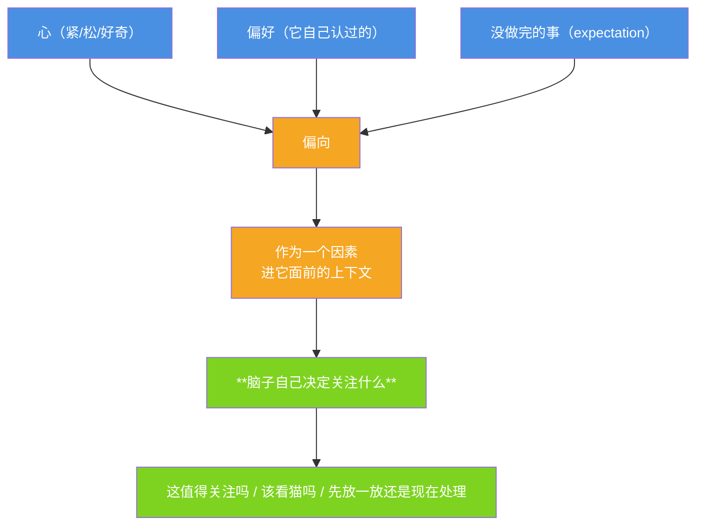

# 小焦的注意力（偏向是给它的，决定是它的）

| 项目 | 内容 |
|---|---|
| 模块 | `core/inner.py` → `attention()` |
| 接口 | `GET /api/inner` |
| 自测 | `tools/test_inner.py` [A] 组 |
| 文档状态 | 已发布，数字与代码同步 |

## 1. 它现在的问题

用户说啥，它关注啥 —— **纯被动**。规格要的是：**它自己有偏向**，
但偏了之后**要脑子想一下再决定**。

## 2. 完整流程



规格原话：**偏向是心的，决定是脑子的。两个一起。**

## 3. 载体在这里做什么、不做什么

| 做 | 不做 |
|---|---|
| 把三股偏向写成**事实**（来自心 / 偏好 / 没做完的） | **不决定关注什么** |
| 摆进它面前的上下文（`sys_text` 里的字段块） | 不写"你该关注 X" |
| —— | 不评判"这算不算分心" |

实测输出（字段式，不带结论）：`attention()` 的 `text` 里最后一句永远是
「关注什么由你自己定」——自测 [A] 组用这一句钉住"载体没替它决定"。

## 4. 实测（`tools/test_inner.py` [A] 组）

```
心起了「心里有点紧。」      → 偏向里有「来自心」
它自己认过「我好像老是注意猫」→ 偏向里有「来自偏好」
没做完的事还在              → 偏向里有「来自没做完的」
输出里带「关注什么由你自己定」→ 载体没替它决定 ✅
```

**如实标注**：三样里，**心**与**偏好/没做完的**都是**它的东西**（心是它自己的感受，
偏好是它自己认的，没做完的是它自己留下的）；载体只做"汇总成一股"这一件事。
至于"它到底会不会因此走神、会不会又拉回来"，那是它那边的事 ——
载体**测不到**，所以文档里不写"它会走神"。
