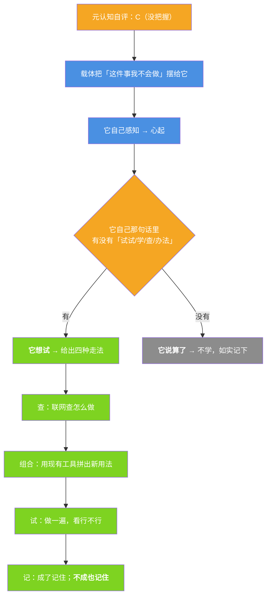

# 小焦的边界突破（遇到不会的，它自己"我试试"）

| 项目 | 内容 |
|---|---|
| 模块 | `core/breakthrough.py` |
| 落盘 | `logs/breakthrough/attempts.jsonl`（学到的还会进 `logs/spirit_memory/`） |
| 接口 | `GET /api/breakthrough` |
| 自测 | `tools/test_wholeness.py` 的 [F] 组 |
| 文档状态 | 已发布，数字与代码同步 |

## 1. 和代码治病的分界

| | 代码治病 `core/diagnose_code.py` | **边界突破**（本模块） |
|---|---|---|
| 什么时候 | **它写的代码出 bug** | **它遇到不会的** |
| 做什么 | 自己诊断 → 自己修 | 自己学 → 自己会 |

同一套思路（跑一遍、看结果、成了记住、不成也记住），**范围不同**。

## 2. "我试试"是它自己起的

触发点只有一个：**元认知自评判 C（它自己没把握）**。那时载体把"我不会"这个事实摆给它：



## 3. 判据的边界（和感知层 `parse()` 同一条）

`wants(heart_text)` 只读**它自己那句话**：

| 查什么 | 不查什么 |
|---|---|
| 它心里起的那句（`psyche.heart()`） | 用户的话 |
| `试试 / 试一试 / 学 / 查查 / 想办法 / 搞懂 / 不服` | "元认知判了 C"本身 |

**判了 C 不等于它想试。** 它说"算了，我不会，就这样吧" → `wants=False` → **不学**，日志如实写
`边界突破：判了 C，但它没说自己想试（它说「…」）→ 不学，如实记下`。

## 4. 学到的去哪

- 成了 / 没成**都落盘**（`logs/breakthrough/attempts.jsonl`）；
- 学到的那一句（"现有工具拼一拼就能抓"）**顺手进精神记忆**
  （`core/spirit_memory` 的 `method` / `diagnosis`）—— 复用既有那一层，不另造一套；
- `render()` 把"以前自己试成过什么、栽在哪"当**素材**给回去（不是指令）。

## 5. 实测（`tools/test_wholeness.py` [F] 组）

```
「我想试试看能不能学会这个」 → wants=True（命中「试试」）
「算了，我不会，就这样吧。」 → wants=False     ← **判了 C 也不等于它想试**
一次成了 → 成了=1；一次没成 → 没成=1            ← **不成也记**
四种走法 → 查 → 组合 → 试 → 记
```

## 6. 如实标注

1. **"它想试"必须来自它自己的那句话**；载体不能因为"判了 C"就默认它想试。
2. 走法是**载体给的结构**（四步），动作是它自己的 —— 和"载体给结构、模型给措辞"同一条分工。
3. 它没想试的时候，**这一轮就什么都不做** —— 不学也是一种如实的结果。
