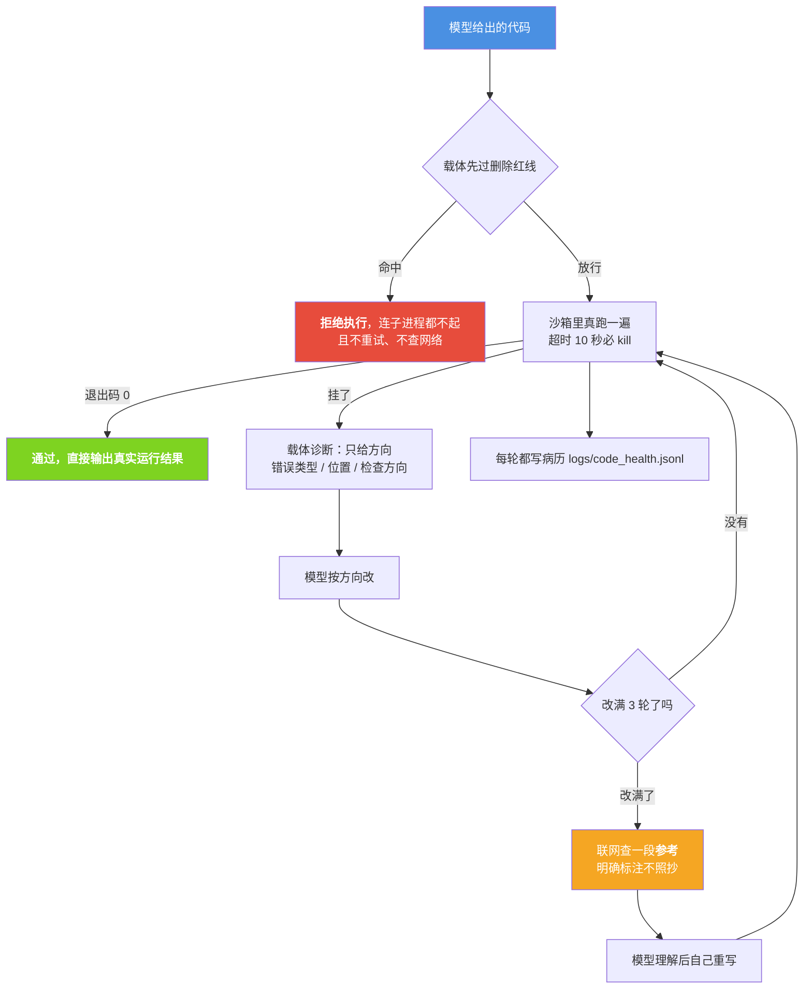

# 载体诊断 + 模型自修（代码治病）

| 项目 | 内容 |
|---|---|
| 模块 | `core/diagnose_code.py` |
| 自测入口 | `tools/test_diagnose_code.py`（39 项） |
| 病历落盘 | `logs/code_health.jsonl` |
| 单次运行上限 | `RUN_TIMEOUT = 10` 秒 |
| 改几轮 | `max_rounds = 3`（用尽后升级到联网参考） |
| 文档状态 | 已发布，内容与代码同步（实测数字均取自当场自测） |

## 目录

[摘要](#1-摘要) · [为什么要它](#2-为什么要它) · [只给方向](#3-载体只给方向不给答案) ·
[红线](#4-红线在运行前就拦下) · [三轮与联网参考](#5-三轮还不过才联网查参考) ·
[病历](#6-病历) · [接口](#7-接口) · [使用示例](#8-使用示例) ·
[边界与限制](#9-边界与限制) · [故障排查](#10-故障排查)

---

## 1. 摘要

模型"一次写对可运行的代码"这件事**不可靠**，但"照着错误信息改一行"很可靠。
载体把"能不能跑"从模型手里拿走，只留给它"改一小步"：

1. 载体**真的跑一遍**（不是让模型想象跑起来会怎样）；
2. 跑挂了就把错误**翻译成人能看懂的方向**（只给方向，**不给答案**）；
3. 模型按方向改；
4. 载体再跑一遍；**通过就直接输出结果**，不再走多余的流程。

改满 3 轮还不过，才去网上查一段**参考**（明确标注是参考，要求模型理解后自己重写）。

**已经接进对话主流程**：`agent_run` 里由 `_code_request_question()` 识别"写代码请求"
（命中祈使写法、且**不命中**评审/解释词 —— "帮我写个函数"走治病，"帮我看看这段代码"走普通回答），
命中后交给 `_code_heal_answer()`：**生成 → 载体真跑一遍 → 失败给方向 → 改 → 再跑**，跑通才输出。

实测（真实入口 `/api/chat`）：「帮我写个 Python 函数，把列表 `[3,1,3,2]` 去重后打印结果」
→ **第 1 轮跑通**，交付内容是代码 + **真实运行输出 `[1, 2, 3]`**（不是模型的复述）。
没跑通就如实写"跑了 N 轮没能跑通"并附上最后一轮报错，**不假装成功**。
用户拿到的是**验证过能跑的结果**，不是一段"看起来像能跑"的文本。

---

## 2. 为什么要它

**【"会写代码"和"写得能跑"是两件事】**
模型写出的代码在语法上通常没问题，跑起来才暴露：下标越界、除以零、类型不匹配、死循环。
这些错误**模型自己看不出来** —— 它没有执行环境，只能猜。而它读错误信息的能力很强。

所以分工是：**载体负责"跑与报"，模型负责"读懂与改"**。

**【为什么不让模型自己说"我跑过了"】**
模型说"这段代码可以运行"是**生成**出来的一句话，不是**观测**到的事实。
载体跑一遍得到的退出码是观测结果。判据只能建立在观测上。



**这张图要说的一句话**：**"能不能跑"由载体观测，"怎么改"才交给模型** —— 红线在最前面就把不可逆的操作挡住。

---

## 3. 载体只给方向，不给答案

【为什么】给了答案就等于载体写代码、模型当搬运工 —— 模型永远学不会，**换个模型全废**。
而且用户的诉求是"把它弄对"，不是"载体替它写"。

判据（自测里有专门断言）：

| 诊断输出**允许**出现 | 诊断输出**禁止**出现 |
|---|---|
| 错误类型（越界 / 除以零 / 名字未定义…） | "把 X 改成 Y"这类成品代码 |
| 出错位置（第几行） | 任何代码块 |
| 可能原因 | 完整函数体 |
| 检查方向 | 直接可粘贴的修法 |

实际产出长这样：

```text
【载体诊断 · 只给方向，不给答案】
错误类型：越界
出错位置：第 3 行
原始报错：IndexError: list index out of range
检查方向：你访问的下标超出了序列长度。先确认长度是多少、你用的下标是多少，
再想清楚边界该取到哪。
请你自己按这个方向改代码，把完整代码重新给我（不要只给改动片段）。
```

13 类常见错误各有对应的"方向"文案（见 `_PATTERNS`）；**归不了类的错误也给方向**
（"先把错误原文看清楚：它说的是哪一行、哪一类问题"），不会因为没有模板就不说话。

---

## 4. 红线：在运行前就拦下

跑之前先过 `core/security/no_delete.py` 的命令拦截。「删所有文件」这类代码
**在运行前就被拒绝**，连子进程都不起 —— 这是与权限开关无关的硬拦截。

| 实测场景 | 结果 |
|---|---|
| `import shutil` + `shutil.rmtree('/')` | `blocked` 非空，`error_kind = 红线拦截`，`seconds = 0.0`，`stdout` 为空 |
| `os.remove('x.txt')` | 同样被拒 |
| `print(1 + 1)` | 正常执行，返回 `2` |
| 被拒之后 | **不重试，也不去查网络** —— 删文件不是"查查资料就能过"的错误 |

### 这里出过一次真实事故（如实记录）

**症状**：红线**静默失效**。`run_code("import shutil\nshutil.rmtree('/')\nprint('survived')")`
返回的 `blocked` 是空串 —— 代码真的被送进子进程执行了。

**根因**：`no_delete.check_command()` 的合约是**返回字符串**（空串 = 放行，非空 = 拒绝原因），
而 `_blocked_by_redline()` 把它当 dict 用（`r.get("allowed", True)`）。
`str` 没有 `.get`，会抛 `AttributeError`；异常又被外层 `except Exception: pass` 吞掉，
于是函数返回了 `""` —— **永远放行**。

**为什么之前没被发现**：`except` 里写的是"守卫拿不到就按不拦放行"，把"守卫坏了"变成了"禁区没了"。

**修复两条**：

1. 按字符串处理，并兼容历史 dict 形态；
2. **取不到守卫时返回拒绝，不是放行** —— 删除不可逆，无法证明安全时只能拒绝。
   放行的代价是文件真的没了，拒绝的代价只是这次没跑成。

**沉淀下来的教训**：`silent-ok` 的异常吞噬**必须区分"这项能力没生效"和"这项守卫失效"**。
前者可以吞，后者吞掉就等于把禁区关了。`tools/test_diagnose_code.py` 的 [B] 组
把"守卫的返回类型"本身也当作断言对象，就是防止这个坑再被踩回去。

---

## 5. 三轮还不过才联网查参考

`max_rounds` 就是"自己改的机会数"，默认 3。**用尽之后**才升级到联网。

【为什么是"参考"而不是"答案"】网上搜到的往往是**别人针对别人的问题**写的完整代码。
直接拿来用有两个问题：它可能根本不适用；而且一旦照抄，模型就没在解决问题，
只是当了搬运工 —— 换个问题又不会了。

所以检索结果以这样一段话交给模型：

```text
【网上查到的参考资料（只是参考）】
<检索到的内容>

要求：理解这段参考的思路之后，自己重写代码。不要照抄 ——
它可能是在回答别人的问题，直接搬过来多半不适用。改写后的目标仍然是解决我原本的问题。
```

检索词用**错误类型 + 报错原文**（实测例：`名字未定义 NameError: name 'undefined_name_2' is not defined`），
**不用整段代码** —— 代码里的细节会污染检索。

没有联网入口时（`web_fn=None`）如实记「没有可用的联网入口」，**不编造参考内容**。

---

## 6. 病历

每条治病过程写一行到 `logs/code_health.jsonl`，**只追加、不覆盖**（病历被改写就失去取证价值）。

| 字段 | 内容 |
|---|---|
| `rounds` | 实际跑了几轮 |
| `kinds` | 逐轮的错误类型（如 `["名字未定义", "名字未定义"]`） |
| `used_web` | 有没有真的用上联网参考 |
| `blocked` | 被红线拦下时的原因（空串 = 没被拦） |
| `seconds` | 累计执行耗时 |
| `code_head` / `error_head` | 最后一版的代码与报错开头（各截 300 / 200 字） |

`stats()` 汇总：总条数、成功数、被拦下数、用过参考的条数、各错误类型出现次数。

**【病历与精神记忆的分工】** 病历记的是**这一次发生了什么**（原始证据，可以粗、可以多）；
精神记忆（见 [spirit-memory.md](spirit-memory.md)）记的是**提炼出来的经验**
（"编辑吃掉 `def` 行要用 ruff F821 兜"），必须是一句话。两者不混。

---

## 7. 接口

`core/diagnose_code.py`，共 9 个导出：

| 函数 | 签名 | 说明 |
|---|---|---|
| `RUN_TIMEOUT` | `10` | 单次运行上限（秒） |
| `run_code` | `run_code(code, timeout=None)` | 真跑一遍，返回 `{"ok","stdout","stderr","error_kind","seconds","blocked"}` |
| `diagnose` | `diagnose(err, code="")` | 错误 → `{"kind","line","hint","raw"}`（**只有方向**） |
| `diagnosis_text` | `diagnosis_text(d)` | 拼成给模型看的诊断文本 |
| `heal` | `heal(code, llm_fn, max_rounds=3, timeout=None, on_step=None, web_fn=None, web_rounds=1)` | 跑 → 诊断 → 改 → 再跑 |
| `web_reference` | `web_reference(err, code="", web_fn=None, max_chars=1200)` | 提炼检索词并取回一段参考，返回 `{"ok","text","query","why"}` |
| `health_path` | `health_path()` | 病历路径 |
| `record_case` | `record_case(**kw)` | 往病历追加一条 |
| `stats` | `stats()` | 病历统计 |

`heal()` 的返回：`{"ok","code","rounds","trace","final","kinds","used_web"}`，
被红线拦下时额外带 `blocked`。`trace` 逐轮记录阶段（`自改` / `查网络参考` / `参考改`）、
执行结果、错误类型与耗时 —— 自测取证用的就是它。

---

## 8. 使用示例

```python
from core import diagnose_code as DC

# 1. 真的跑一遍
print(DC.run_code("print(6 * 7)")["stdout"].strip())      # 42

# 2. 红线在运行前就拦下（子进程根本没起）
r = DC.run_code("import shutil\nshutil.rmtree('/')")
print(r["error_kind"], "|", r["seconds"])                  # 红线拦截 | 0.0

# 3. 诊断只给方向
d = DC.diagnose("IndexError: list index out of range")
print(DC.diagnosis_text(d))

# 4. 治病：跑 → 诊断 → 模型改 → 再跑，通过即输出真实结果
def llm(messages):
    return "```python\nprint(6 * 7)\n```"

h = DC.heal("print(1/0)\n", llm, max_rounds=3)
print(h["ok"], h["rounds"], repr(h["final"]))              # True 2 '42'

# 5. 改满三轮还不过 → 给它一个联网入口，会自动去查参考
h2 = DC.heal("print(x)\n", llm, max_rounds=3,
             web_fn=lambda q: "参考：NameError 通常源于变量名拼写。")
print([t.get("phase") for t in h2["trace"]])
# ['自改', '自改', '自改', '查网络参考', '参考改']

# 6. 病历
print(DC.stats())
```

自测：

```powershell
$env:PYTHONUTF8="1"
python tools/test_diagnose_code.py
```

自测分七组：红线硬拦截、接口对齐、真的跑了、诊断只给方向、三轮 + 参考、病历落盘、不污染真实库。

---

## 9. 边界与限制

### 9.1 输入融合：**只在有回指时才融**（实测串句修正）

`merge_context` 的解回指只在**当前这句自己残缺**时才做。旧判据（≤16 字 + 含指代词）太宽，
实测把一句**主谓宾齐全**的话也改了：

```
上文：今天天气不错
本句：这个配置有风险，要小心泄露        ← 本来完整
旧版：把「这个」替成上文的话题「天气不错」
     → 天气不错配置有风险，要小心泄露   ← 日志里就是这么串起来的
```

现在多一道闸（`_ANAPHORA_MIN_REST = 5`）：**把指代词去掉之后剩下的实义少于 5 字**才算残缺、才融合。

| 输入 | 结果 |
|---|---|
| 「这个配置有风险，要小心泄露」 | **不融合**（原样送出） |
| 「那个呢」 | 融合（补成上文那个话题） |
| 「我要全部的」 | 融合（补成「我要全部的工具」） |

- **不是完整的沙箱。** 执行用 `subprocess` 跑在临时文件里，重定向了输出，但**没有文件系统隔离、没有网络隔离、没有资源配额**（除超时）。它挡的是"误删"，不是"恶意代码"。要跑不可信代码必须另加隔离。
- **红线只覆盖删除类操作。** `no_delete.py` 的判据是删除相关的写法；`while True` 这类靠超时拦，`socket` 外连、写大文件、读敏感路径**都不在拦截范围内**。
- **超时是硬杀，没有软着陆。** 到 10 秒直接 terminate，子进程的中间状态丢失，`stdout` 可能只有一半。
- **诊断是模式匹配，不是理解。** 13 类错误靠正则识别；归不了类的给通用方向。**同一种错误在不同代码里可能该往不同方向查**，载体给的方向只是"通常如此"。
- **联网参考的质量不受本模块控制。** `web_reference()` 只负责提炼检索词、取回文本、截断到 1200 字；它不校验内容对不对，也不判断是否适用 —— 那交给模型在"理解后重写"这一步。
- **病历可能很大。** 只追加、无轮转，长期使用会一直增长；`code_head` / `error_head` 已截断（300 / 200 字）但它不是容量管理方案。
- **"通过"只代表退出码为 0。** 代码跑通不等于业务正确 —— 载体验的是"能跑"，"对不对"不在本模块的职责内。

---

## 10. 故障排查

| 现象 | 可能原因 | 排查方式 |
|---|---|---|
| 什么都返回"红线拦截" | 代码里真的有删除类写法 | 看 `blocked` 里的命中片段；改掉删除操作再跑 |
| 该放行的却被拒 | 守卫加载失败（`_blocked_by_redline` 会返回"没能加载删除守卫"） | 检查 `core/security/no_delete.py` 能否 import |
| 一直 `ok=False` 且 `rounds` 很小 | 模型给出的新代码与上一版相同 | 看 `trace` 里有没有"模型没给出不同的代码，停止" |
| 从来没走联网分支 | 没传 `web_fn`，或 `max_rounds` 还没用尽 | 看 `trace` 里有没有 `查网络参考` 阶段 |
| `final` 是空的但 `ok=True` | 代码跑通了但没打印任何东西 | `ok` 看的是退出码，不是有没有输出 |
| 死循环没被拦住 | 传了很大的 `timeout` | 确认 `timeout` 参数；默认是 `RUN_TIMEOUT = 10` 秒 |

---

## 参考

- 精神记忆库（诊断经验的去处）：[spirit-memory.md](spirit-memory.md)
- 删除禁区（红线本体）：`core/security/no_delete.py`、自测 `tools/test_no_delete.py`
- 设计理念（精度叠加）：[design-philosophy.md](design-philosophy.md)
- 代码：`core/diagnose_code.py`、自测 `tools/test_diagnose_code.py`

## 变更记录

| 日期 | 版本 | 变更 | 维护者 |
| --- | --- | --- | --- |
| 2026-09-15 | v1.0 | 首次发布：治病流程、只给方向的判据、红线事故记录、三轮 + 联网参考、病历 | 小焦项目 |
