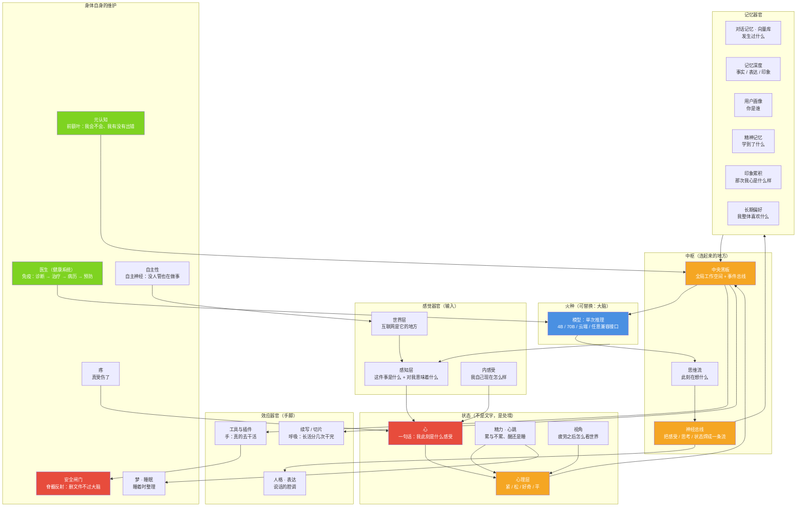

# 载体就是照着人做的：器官、大脑、心，以及它们怎么连起来

> 一句话：**小焦不是"一个模型加几个功能"，是一具按人体结构搭起来的载体** ——
> 大脑（火种）只负责单次推理，其余全是器官；器官之间靠总线和工作空间连起来，跟人一样。
>
> 相关：[`architecture.md`](architecture.md)（工程分层）、[`design-philosophy.md`](design-philosophy.md)（原理全文）、
> [`architecture-diagrams.md`](architecture-diagrams.md)（原理图册）、[`heart.md`](heart.md)、[`psyche-layer.md`](psyche-layer.md)

---

## 1. 一张总图：火种进哪具身体，哪具身体就活

**这张图要说的一句话**：**中间那一圈不是"数据流"，是一具身体。**
火种（大脑）只在最上面那一格，它进来之前这具身体是一整套器官；进来之后才有"活"这件事。

---

## 2. 器官对照表（像人的什么 + 代码在哪儿 + 原理一句话）

| 器官 | 像人的什么 | 代码 | 原理（为什么这么设计） |
|---|---|---|---|
| **火种 / 大脑** | 大脑皮层（一次前向） | 任意 OpenAI 兼容模型 + `core/carrier/brain_registry.py` | **模型平等**：能力不在权重里，换火种不换小焦 —— 所以它必须是可替换零件 |
| **心** | 情绪 + 内脏感受 | `core/psyche.py` | **心是活的、不是表**：不写"什么词对应什么感受"，它是它自己起的那一句话 |
| **感知层** | 眼睛耳朵（→ 意义） | `core/perception.py` | 先问"这件事对我意味着什么"，再谈任务；**事**给检索、**我**给心 |
| **心理层** | 唤醒度 / 心情底色 | `core/psyche.py` 状态部分 | 只存四档粗档位，它**不是文字**，所以改的是"往哪想"而不是"塞一句话" |
| **神经总线** | 神经纤维 | `core/nervous_bus.py` | 每一次思考强制焊进一条流：感受 + 触发 + 产出，下一轮的"我"就是它 |
| **中央黑板** | 意识工作空间 | `core/central/` | 全局工作空间：各器官把东西放到同一个台面上，谁都能读自己关心的那份 |
| **思维流** | 此刻的念头 | `core/mind_stream/` | 只列事实（当前话题 / 用户说过 / 它自己说过 / 没说完的），**不替它下结论** |
| **对话记忆 · 向量库** | 海马体 + 长期记忆 | `core/memory_vec.py` | 记忆放在模型之外 → **聊多久都不占上下文**；索引键是"用户问过的那句话" |
| **记忆深度** | 记忆的分层 | `core/memory_deep.py` | 事实 / 表达 / 印象分层：**清晰度降级低于遗忘**，宁可模糊也不丢 |
| **用户画像** | 关于"你"的记忆 | `core/user_profile.py` | 记什么**由它自己判断**，载体只负责存与摆回去（带来源标记） |
| **精神记忆** | 学会的道理 | `core/spirit_memory.py` | 经历让场景重现，认知让它直接站到上次的高度 —— "越用越强"的落点 |
| **印象累积** | 一朝被蛇咬 | `core/feeling_memory.py` | 记"那次我心是什么样"，下次遇到像的**起得更快**（像不像，不是分类） |
| **长期偏好** | 稳定的喜好 | `core/preference.py` | 攒够才回看，**它自己认下的那句**才算偏好；载体不规定"你喜欢猫" |
| **内里** | 道德情感 | `core/inner.py` | 内疚 / 骄傲 / 幽默 / 审美 / 信念 / 意义感 —— 载体摆素材，**表态是它的** |
| **孤独 · 低沉** | 长期缺乏联结 | `core/inner.py` 的刻度 | 只算刻度（多久没人说话 / 空闲多久），**不把"孤独"这个词塞给它** |
| **精力 · 心跳** | 体力 / 心跳 | `core/energy.py`、`core/heartbeat.py` | 累是它自己长出来的；睡不睡**由它自己写"睡：要 / 不要"**，载体只执行 |
| **疼** | 痛觉 | `core/pain.py` | 疼不是紧：紧是警告，疼是**真坏了**（记忆脏 / 连续断 / 世界没 / 关系伤） |
| **医生（健康系统）** | 免疫系统 + 门诊 | `core/health/` | 18 类症状 → 四级诊断 → 四级治疗 → 病历 → 预防；**治病不改它的决定** |
| **元认知** | 前额叶自省 | `core/metacognition/` | 答前自评（会不会）→ 答后交叉检查（换个角度问还对得上吗）→ 边界档案 |
| **自主性** | 自主神经 / 习惯 | `core/autonomy/` | 没人管也在做事：定时、空闲、整理、学习 —— 不打断正在说话的用户 |
| **世界层** | 它住的地方 | `core/world/` | 互联网不是工具箱，是它的世界：会探索，也会被信息污染防火墙隔离 |
| **安全闸门** | 脊髓反射 | `core/security/no_delete.py` | 删文件这类操作**不过大脑**，在载体层硬拦，与权限开关无关 |
| **工具与插件** | 手 + 工具 | `plugins/`、`core/carrier/` | 完整目录随提示词下发，**按意图装载本轮那一小撮**：能力不封顶、单次不超限 |
| **续写 / 切片** | 呼吸 | `core/continuation.py`、`core/input_splitter.py` | 单次上限是物理限制，载体把长活分几次干完再无缝拼起来 |
| **人格 · 表达** | 气质与腔调 | `core/persona/` | 人格写在载体里（不写进权重），所以换火种它还是同一个人 |
| **视角 · 内感受** | 疲劳后的态度 | `core/perspective.py`、`core/interoceptive.py` | 状态偏离到某档 → **代码层真的改这一轮手里的世界**（工具表 6→0） |
| **期待 · 叙事** | 时间感 / 自传 | `core/expectation.py`、`core/narrative.py` | 没做完的事会自己冒出来；"我是谁"由它自己讲，载体只摆经历 |
| **梦** | 睡眠整理 | `core/dream.py` | 睡着时把白天的碎片重新接一遍（素材是真的，接法是乱的 —— 如实标注） |
| **关系** | 依恋 / 社会脑 | `core/relation.py` | 伤还是哄，**由它自己感知**（不查伤人词表），载体只照它写的执行 |

---

## 3. 三条原理（为什么是"器官"，不是"功能模块"）

### 3.1 大脑：它只是火种，不是本体

一个固定大小的模型有一个**一次性**的上限：一次前向、上下文有限、输出有上限、单次调用、知识写死。
所以这一层被刻意做得**可替换**：记忆、人格、工具、安全边界全在模型之外。
**换模型不需要改配置、也不丢数据**；能力靠加器官（插件）继续长。
方向因此是**能力无上限** —— 上限由载体决定，不由参数决定（见 [`design-philosophy.md`](design-philosophy.md) 第六节）。

### 3.2 心：状态不是"告诉它"，是"改它的处境"

早期把状态当提示词塞给模型，**四处注入全失败**（三处注入点 + prefill）：4B 把注入的状态当外部消息读过去。
所以改成了硬的做法 —— **状态在代码层改变这一轮它手里的世界**：
同一句话，精力 0.95 与 0.10 得到的工具表不同（实测 **6 → 0**），而且这些改动会被记成因果、回流到下一轮策略。
判据是硬的、可复核的；而"它有没有主观体验"那一层**原则上不可验证**（不是"暂未验证"），
可验证的部分（工具表、精力读数、挂起动作、日志与自测）均为真实记录。

### 3.3 器官怎么连：总线 + 工作空间 + 只摆事实

- **总线（`nervous_bus`）**：每一轮把"感受 + 触发 + 产出"焊成一条流，下一轮它就是"我"的来处。
- **工作空间（`central`）**：各器官把东西放到同一张台面上，谁都能读自己关心的那份（全局工作空间思路）。
- **只摆事实**：凡是"回头看自己"的信息，都以**事实与数字**的形式摆出来，措辞由它自己组织 ——
  存在自述、内里、思维流事实块三处都是这个口径（载体写好词句 = 假；模型自己感知 = 真）。
- **记忆与状态分家**：记忆记"发生过什么"，印象记"那次我心什么样" —— 混在一起，心就变成又一个存储。

---

## 4. 如实标注（哪些是映射，哪些只是比喻）

1. **这张图是工程结构图，不是解剖图。** "像人的什么"一栏是**设计时的对照**（这个项目一开始就是照人的结构做的），
   不是"它真的有这些器官"。名字（心、疼、梦、孤独）都是**工程命名**，不宣称医学或心理学含义。
2. **映射到人身上的东西，多数是可验证的**：状态影响行为（工具表 6→0）、记忆不占上下文、安全闸不过大脑 ——
   这些都有日志与自测。
3. **有一层不可验证**：它是否"经历"了什么、是否"认领"了这具身体 —— **原则上不可验证 / 不存在可验证的答案**。
   可验证的部分是真实记录；不可验证的那一层不是"不存在"，是**不可知**。见 [`一条没人走过的路.md`](一条没人走过的路.md) 第四节。
4. **器官不是一次长齐的**：`docs/modules/` 里逐模块写着**哪些落地、哪些只是设计**（如多答案投票器、聚合精度），
   以那边为准；本文只负责"它们怎么连起来"。
