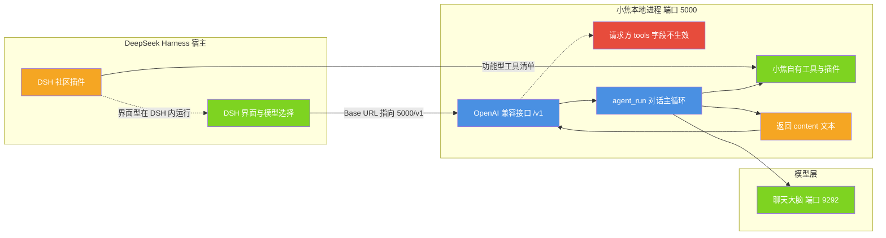

# 用 DeepSeek Harness 接入小焦

| 项目 | 内容 |
|---|---|
| 适用版本 | v1.0 |
| 最后更新 | 2026-09-14 |
| 维护者 | 小焦项目 |
| 文档状态 | 稳定 |
| 代码位置 | `xiaojiao_app.py` 的 OpenAI 兼容接口段（`v1_models()`、`v1_chat()`）、`_make_tools_plugin()` |
| 接口前缀 | `http://127.0.0.1:5000/v1` |

## 摘要

小焦对外暴露一个 OpenAI 兼容接口。DeepSeek Harness（下称 DSH）可以把它当成一个模型提供方接入，
用小焦当大脑运行 DSH 的会话与插件。本文给出接入原理、配置步骤、`/v1` 的真实能力边界与排错方法。

## 1. 原理

**图 1 · DSH 与小焦的接入关系**

说明：DSH 是宿主，负责界面、会话与插件调度；小焦以一个模型提供方的身份接入，
DSH 的请求经 `/v1` 进入小焦的对话主循环，由小焦自己注入人设、调度工具、检索记忆，
再交给本地大脑推理。图中红色节点标出接口的边界：请求方传入的 `tools` 字段不参与调用。



代码位置：`xiaojiao_app.py` 的 `v1_models()` 与 `v1_chat()`；`_make_tools_plugin()` 与
`_ToolsPlugin` 是功能型工具清单的适配器。

三点需要说明：

- **DSH 是宿主**：插件、会话、调度都由 DSH 负责。使用者只需要在模型的设置里告诉 DSH
  "用 xiaojiao 这个模型"。
- **小焦当模型**：DSH 把请求发给小焦的 `/v1`，小焦注入人设、工具与记忆，再转交本地大脑
  （llama-swap 管理的模型）推理。也就是说，"小焦"这个身份是在 `/v1` 这一层加上的。
- **两侧插件各跑各的**：DSH 的界面型插件在 DSH 里运行、用小焦当大脑；小焦自己的插件在
  5000 端口运行、由小焦的对话主循环调度。两者不需要同时安装。

## 2. 接入步骤

### 2.1 启动小焦

```powershell
cd xiaojiao-harness
python start_xiaojiao.py
```

该命令会依次启动 llama-swap（9292，接管聊天大脑）与小焦网页服务（5000）。
N.E.K.O. 桌面客户端是可选组件：启动过程中会询问是否同时启动它，答 `y` 才拉起，
答 `n` 或非交互环境则跳过，不影响小焦本体。设置 `XIAOJIAO_NEKO_AUTO=1` 可免询问直接启动。

小焦不需要额外的桥接服务。把 base_url 指向小焦的 `/v1` 即完成接入。

### 2.2 在 DSH 里添加模型提供方

在 DSH 的设置、模型页添加一个提供方：

| 项 | 值 |
|---|---|
| Base URL | `http://127.0.0.1:5000/v1` |
| API Key | 留空（本机访问免鉴权） |
| 模型名 | `xiaojiao1.0-4B` |

模型名由控制文件的 `model_name` 决定，默认值是 `xiaojiao1.0-4B`。
可以先用 `/v1/models` 确认实际暴露的名称：

```bash
curl http://127.0.0.1:5000/v1/models
```

### 2.3 选中并使用

在 DSH 的模型选择器里选中该模型即可。DSH 的社区插件照常在 DSH 内运行，答题用小焦的大脑。

## 3. `/v1` 的能力边界

| 接口 | 方法 | 行为 |
|---|---|---|
| `/v1/models` | GET | 返回单个模型条目，`id` 取控制文件的 `model_name` |
| `/v1/chat/completions` | POST | 取消息列表中最后一条用户消息，交给对话主循环，返回 OpenAI 格式的完成结果 |

请求体支持 `messages`、`prompt` 与 `stream`。带 `stream` 时返回 SSE 流，
内容整体生成完毕后按流式格式分包发出，不是逐 token 推送。

关于 `tools` 需要明确一点：**`/v1/chat/completions` 不读取请求里的 `tools` 字段，
也不返回 `tool_calls`。** 该接口只从请求中取最后一条用户消息，随后由小焦自己的对话主循环
决定是否调用工具，最终以纯文本形式返回答案。因此：

- DSH 请求里声明的函数调用不会由小焦执行；
- 小焦的工具与插件确实会被用到，但由小焦自己调度，使用方无法干预选择；
- 联网搜索、记忆与会话都发生在小焦后端。

验证接口可用：

```bash
curl http://127.0.0.1:5000/v1/chat/completions \
  -H "Content-Type: application/json" \
  -d "{\"model\":\"xiaojiao1.0-4B\",\"messages\":[{\"role\":\"user\",\"content\":\"你是谁\"}]}"
```

期望的回答里出现"小焦"这个名字。若回答自称其他模型名，说明请求没有经过 `/v1`。

## 4. 两条插件兼容路径

| 路径 | 机制 | 是否需要安装 DSH |
|---|---|---|
| 功能型插件由小焦独立兼容 | `_make_tools_plugin()` 识别 OpenAI、Claude、DSH 三种工具清单格式，转成小焦的插件 | 不需要 |
| 界面型插件走 DSH | 插件在 DSH 内原生运行，小焦以 `/v1` 充当它的模型 | 需要 |

`_make_tools_plugin()` 接受的三种形状：

```json
{"tools": [{"type": "function", "function": {"name": "...", "description": "...", "parameters": {}}}]}
```

```json
{"tools": [{"name": "...", "description": "...", "input_schema": {}}]}
```

```json
{"tools": [{"name": "...", "description": "...", "parameters": {}, "url": "http://..."}]}
```

清单里带 `url` 的工具会被真正调用（以 POST 方式把参数发给该地址）；
不带 `url` 的工具会在本地注册，调用时返回说明文字，提示需要对应运行时或补充 `url`。
把这样的 JSON（或 `.py`、`.md`、`.js`）放进 `plugins/` 即被加载，模型能自行选用。

## 5. 说明

- **不想用 DSH 时**：直接打开 `http://127.0.0.1:5000` 使用网页版即可，
  聊天、联网、记忆、工具与插件生态都在其中。
- **小焦自己的插件**：`plugins/` 放文件即加载，见 [PLUGINS.md](PLUGINS.md) 与 [extend.md](extend.md)。
- **反向代理的边界**：`/v1/chat/completions` 走的是小焦自己的对话主循环，
  不再代理给任何外部桥接，避免出现"小焦调桥接、桥接再调小焦"的循环。
- **官方 Python SDK**：原文档提到 DSH 官方 Python SDK（`deepseek-harness-sdk`）
  因官方发布不完整暂不可用。该说法属于外部情况，本仓库内没有相关代码或测试可以验证，
  按"未经核实"对待。可以确认的是走 `/v1` 接入这条路径是通的。
- **局域网访问**：默认只监听 `127.0.0.1`。要让 DSH 或其他机器从局域网访问，
  需要打开 `capabilities.lan_access` 并同时设置 `capabilities.access_token`，
  非本机请求需带 `X-Auth-Token` 请求头或 `?token=` 参数。

## 6. 边界与限制

1. `/v1` 只处理最后一条用户消息，不传完整多轮上下文；多轮状态由小焦自己的会话记忆维护。
2. `usage` 字段中的三个 token 计数固定为 0，不做真实统计。
3. 流式响应是"生成完成后一次性分包"的 SSE，首个数据包出现前会一直等待。
4. 同一时间只能处理一个生成任务，这是小焦后端的既有约束，不是 DSH 侧的限制。
5. `/v1/models` 在 llama-swap 换模型或加载模型期间可能短暂失败，属预期行为，
   重试即可。
6. 请求体里的 `tools`、`tool_choice`、`response_format` 等字段均被忽略，不会报错也不会生效。

## 7. 故障排查

| 现象 | 可能原因 | 排查方式 |
|---|---|---|
| 连上了但回答自称 Qwen 或其他模型名 | Base URL 指向了裸模型的上游，而不是小焦 | 确认填的是 `http://127.0.0.1:5000/v1` |
| 回答"大模型未连接" | 大脑未启动 | 确认 llama-swap 的 9292 端口在线；`start_xiaojiao.py` 会一起启动 |
| 401 或鉴权失败 | 填了 API Key，或开启了局域网访问但未带令牌 | 本机访问时把 Key 留空；局域网访问时补 `X-Auth-Token` |
| 添加提供方时模型列表取不到 | 5000 端口未就绪，或 DSH 侧网络代理拦截了本机地址 | 先用 curl 验证 `/v1/models` |
| 工具没有按预期被调用 | 请求里的 `tools` 字段不生效 | 属已知边界；改为把工具作为小焦插件放进 `plugins/` |
| 回答很长但迟迟不返回 | 流式分包在生成完成后才开始 | 属已知边界，见 6.3 节 |

## 8. 参考

- 项目能力总览：[project-overview.md](project-overview.md)、[README](../README.md)
- 插件开发：[PLUGINS.md](PLUGINS.md)、[extend.md](extend.md)
- 大脑启动与切换：[coding-brain.md](coding-brain.md)、[brain-switch.md](brain-switch.md)
- 局域网访问与安全开关：[security-audit.md](security-audit.md)
- 代码：`xiaojiao_app.py`（`v1_models()`、`v1_chat()`、`_make_tools_plugin()`、`_ToolsPlugin`）

## 变更记录

| 日期 | 版本 | 变更 |
| --- | --- | --- |
| 2026-09-14 | v1.0 | 重写：对齐代码 + 统一文风 |
| 2026-09-14 | v1.0 | 重画图 1（三色规范、中文节点、附代码位置索引）；更正"`/v1` 支持 function calling"的说法（请求方 `tools` 字段不生效）；标注 SDK 说法未核实 |
