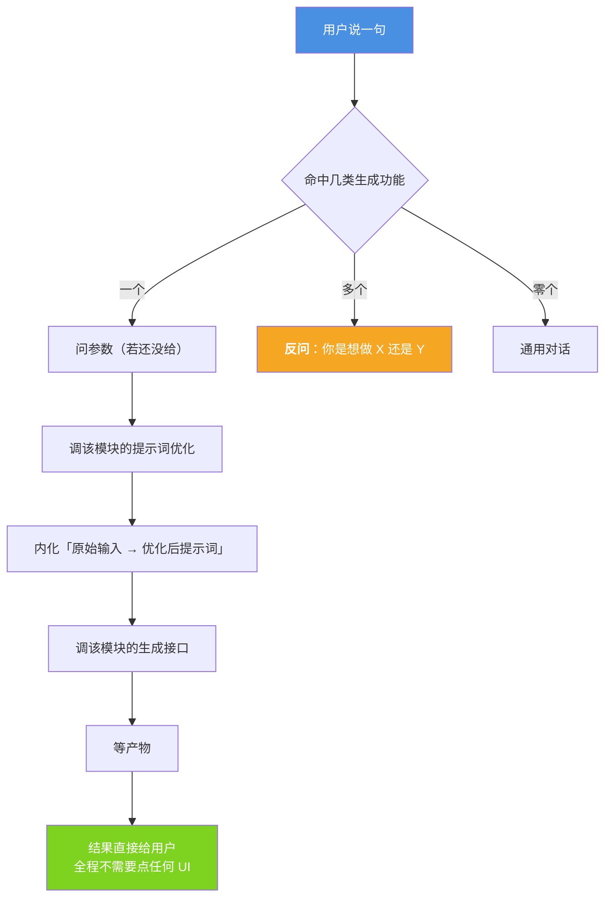

# 通用连接器（生成类功能的统一入口）

| 项目 | 内容 |
|---|---|
| 模块 | `core/generator_connector.py` |
| 配置 | `xiaojiao_control.json` → `generators` |
| 覆盖 | 视频 / 播客 / 音乐 / 博客 / 代码 五类 |
| 自测 | `tools/test_4_gaps.py` 第 [2] 组 |
| 文档状态 | 已发布，内容与代码同步 |

## 1. 摘要

小焦有五个"能出东西"的能力。用户**不应该**先学会"该点哪个界面" ——
用户只说"我想做个视频"，剩下的事由载体自己走完：

> **识别意图 → 自己问参数 → 调模块的提示词优化 → 内化映射 → 调生成 → 等产物 → 交回用户**

用户全程只跟小焦说话，**不需要点任何 UI 模块**。各模块的界面是给用户手动用的备选，不是必需路径。

---

## 2. 最关键的一条红线：五类绝不串

"做个视频"绝不能走到音乐模块去。这不是"体验不好"，而是**产物形态完全不同**：
用户等了三分钟拿到一段音频，**比直接失败还糟** —— 他连"为什么不对"都不知道。

| 情况 | 载体怎么做 |
|---|---|
| 命中**一个**类别 | 就走那个，绝不"参考"别的类别 |
| 命中**多个**类别 | **反问**"你是想做 X 还是 Y"，让用户定，**载体不猜** |
| 一个都没命中 | 退回**通用对话**（不硬套某个生成器） |

实测（`tools/test_4_gaps.py`）：

| 输入 | 结果 |
|---|---|
| 我想做个视频，一只猫在沙滩上散步 | `video` |
| 做一期关于 AI 的播客 | `podcast` |
| 来段轻音乐当背景 | `music` |
| 帮我写一篇关于秋天的文章 | `blog` |
| 写个函数把列表去重 | `code` |
| 做个视频配点音乐 | kind 为空 + 反问「你是想做视频，还是音乐？」 |
| 今天心情不错 | kind 为空 → 通用对话 |



**这张图要说的一句话**：**识别只出一个结果；出不了就反问，绝不替用户选。**

---

## 3. 内化的是"提示词映射"，不是产物

用户说"一只猫在沙滩上散步" → 模块把它精炼成一段专业提示词。
下次同类输入可以直接复用这条映射，**省掉一次精炼调用**。

但**绝不内化生成的视频/音频本身** —— 那是产物：体积大、每次生成都不一样，
存下来既没用又污染记忆。

落地在 `remember_mapping(kind, original, refined)`：写进 `logs/spirit_memory/method.jsonl`，
走 `spirit_memory.remember()` 的护栏（超长 / 问答对 / 带 `answer` 字段一律拒收）。
原文与优化后相同时**不记** —— 记了等于凭空多一条"映射到自己"的噪音。

---

## 4. 配置原则：不复杂，用户自己可加

`xiaojiao_control.json` 里一段就够：

```json
"generators": {
  "_说明": "类别 → 关键词表；`_` 开头的键是注释，不会被当成类别",
  "video":   ["视频", "短片", "动画", "影片", "做个视频", "生成个视频", "video"],
  "podcast": ["播客", "音频节目", "电台", "podcast", "做一期节目"],
  "music":   ["音乐", "BGM", "曲子", "配乐", "来段歌", "music", "背景音乐"],
  "blog":    ["博客", "文章", "长文", "写一篇", "公众号", "blog"],
  "code":    ["代码", "函数", "脚本", "写个程序", "实现一个", "写段代码", "code"]
}
```

加一个新生成功能：**加一行**即可，不用改代码。配置读不到/写坏了就用内置默认表，**绝不因此不工作**。

**两条实测踩出来的坑**（都已在 `load_config` 里处理）：

- `_` 开头的键必须当注释跳过 —— 否则 `_说明` 会被当成一个类别，
  反问会变成"你是想做_说明，还是视频，还是音乐？"
- 值**必须是列表** —— 配置里写了一个字符串时，`for w in "abc"` 会逐**字符**遍历，
  实测 `_说明` 的 95 个字变成了 95 个"关键词"。

---

## 5. 接口

| 函数 | 签名 | 说明 |
|---|---|---|
| `KINDS` | — | `("video","podcast","music","blog","code")` |
| `load_config` | `load_config(path=None)` | 读 `generators`，返回 `{"keywords","source"}` |
| `detect` | `detect(text, keywords=None)` | 命中了**哪几类**（列表，可空可多个） |
| `route` | `route(text, keywords=None)` | 返回 `{"kind","ambiguous","ask","why"}` |
| `ask_params` | `ask_params(kind)` | 该类别的参数问法 |
| `plan` | `plan(kind, user_input)` | 完整执行计划（**不执行**，只描述每一步） |
| `remember_mapping` | `remember_mapping(kind, original, refined, source=…)` | 内化提示词映射 |
| `recall_mapping` | `recall_mapping(kind, user_input, min_sim=0.6)` | 找一条以前内化的映射 |
| `stats` | `stats()` | 自检信息 |

`route` 的三种返回形状就是第 2 节那张表；`why` 一律写明是"命中一个"还是"命中多个要用户定"。

---

## 6. 主流程接线

`agent_run` 里独立一段：

- `ambiguous` 非空 → 把 `ask` 直接返回给用户（**反问短路**）
- 命中一个但去掉关键词后**实义内容不足 4 字** → 载体**自己问参数**（用 `ask_params`）
- 命中一个且参数齐 → 用 `plan()` 生成 `_GEN_DIRECTIVE` 注入 system：
  写明"本轮走哪条链、该调哪个工具、五类绝不串"

`code` 类别不走这里 —— 它由**代码治病链**接管（生成 → 真跑 → 诊断 → 改 → 再跑）。

---

## 7. 边界与限制

- **识别是关键词匹配，不是理解。** 表述里不含关键词就命中不了；含了不该含的词也可能误命中。命中多个时交给用户定，这是有意的保守，但**用户得多打一句话**。
- **"参数齐不齐"的判据是启发式**：去掉类别关键词后实义字符 ≥4 就算给了。说得太短会被再问一次，说得长但没说清楚则不会追问。
- **提示词映射的复用依赖相似度 0.6**：跨题材的表述可能被误当成"同一件事"而套用旧提示词。取不到就照常走精炼，不会用错但也不会省。
- **播客与博客没有工具名**（`KIND_TOOL` 为空）：它们走各自的服务链，连接器只负责派发指令，不代跑。
- **连接器不判断产物质量**。生成的视频/音频好不好，不在本模块职责内。

---

## 参考

- 精神记忆库（提示词映射的落点）：[spirit-memory.md](spirit-memory.md)
- 代码治病（`code` 类别的去向）：[carrier-diagnosis.md](carrier-diagnosis.md)
- 代码：`core/generator_connector.py`、自测 `tools/test_4_gaps.py`

## 变更记录

| 日期 | 版本 | 变更 | 维护者 |
| --- | --- | --- | --- |
| 2026-09-15 | v1.0 | 首次发布：五类不串的判据、内化映射、配置格式与两个配置坑 | 小焦项目 |
