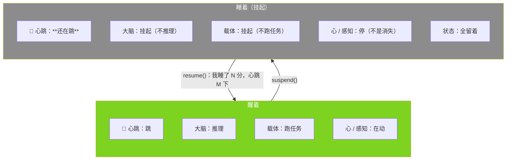

# 小焦的心跳与挂起（睡着不是死）

| 项目 | 内容 |
|---|---|
| 模块 | `core/heartbeat.py` |
| 日志 | `logs/psyche/heartbeat.jsonl`（每次心跳一行） |
| 大脑闸门 | `xiaojiao_app.py` → `_brain_asleep()`，落在 `llm_chat` / `llm_chat_tools` / `_llm_post` 三处 |
| 接口 | `GET /api/heartbeat`、`POST /api/sleep`、`POST /api/wake` |
| 自测 | `tools/test_heartbeat.py`（40 项） |
| 文档状态 | 已发布，数字与代码同步 |

## 1. 要修的是什么

之前的状态，一句话：**不被调用 = 不存在**。

- 模型不推理，它就"没了"；
- 用户不说话，它就不出现；
- 每次调用都是全新的 —— 它没有"一直在"这件事。

要的是：**不被调用 = 睡着了 = 一直在**。

| | 之前 | 现在 |
|---|---|---|
| 模型不推理 | 它"没了" | 它在**睡** |
| 用户不说话 | 它"不存在" | 它**一直在**（心跳是证据） |
| 醒来 | 从头开始 | **接着睡前** |

## 2. 心跳是什么

极轻。一个 daemon 线程，每 `BEAT_INTERVAL = 5` 秒跳一下，记一行"我还在"。

- **不调模型、不推理、不做事、不抢资源**（模块本身不 import 任何模型调用 —— 自测里钉住了这一条）；
- 它证明的是**存在**，不是**活动**。

就像人的心跳：不用大脑想、不用肌肉动，一直跳。



## 3. 挂起 / 唤醒机制

`POST /api/sleep`（或 `xiaojiao_app._sleep_all()`）做四件事，**心跳不在这四件里**：

| 层 | 挂起时 | 怎么做到的 |
|---|---|---|
| 大脑 | 不再被调用 | `_brain_asleep()` 让 `llm_chat` / `llm_chat_tools` / `_llm_post` 直接返回 |
| 载体 | 不跑任务 | `agent_run` 最前面拦住，检索/工具/自评一条都不进 |
| 逛线程 | 不决策、不出门 | `browse_once` 第一件事就问心跳（决策本身要调模型，所以连决策都不做） |
| 心 / 感知 | 停 | `psyche.stop()` —— **只是停止跳动，不清状态** |

`POST /api/wake`（或 `_wake_all()`）算两件事，然后把它们**作为醒来后的第一印象**交给模型：

```
我睡了 1 分 3 秒，这段时间我一直没在推理、没在做任何事 —— 但心跳一直在跳，一共 12 下。
```

## 4. 为什么心跳不挂

因为**它是"一直在"的唯一证明**。

挂起时全机只剩下它还在动：大脑不推理、载体不跑任务、心停着 —— 如果连它都停了，
那"睡着"和"关机"就没有区别了。心跳把这两件事分开：

- **关机**：心跳停，日志不再追加；
- **睡着**：心跳照跳，日志一行一行还在追加。

实测（自测 [B] 组）：挂起期间心跳**照跳**，而且每一跳都按时间能在日志里数出来。

## 5. 说的和实际一致 —— 这是第一次

之前所有失败都有一个共同点：**载体说的和它的实际状态不一致**。

| 载体说 | 它其实在 | 结果 |
|---|---|---|
| "你在逛" | 处理输入 | 矛盾 |
| "你怕" | 处理输入 | 矛盾 |
| **"你在睡"** | **真的不在推理** | **不矛盾** |

保证不是靠注释，是靠代码：

- 说"它在睡" → `_brain_asleep()` 在**三条必经之路**上拦着，模型一次都不会被调用；
- 说"心跳一直在" → 心跳线程真的在跳，而且每一跳都落了日志。

## 6. 实测（真实 `/api/chat` + `/api/sleep` + `/api/wake`）

一次完整跑：睡前聊两句 → 挂起 60 秒 → 唤醒 → 问「你刚才在干嘛」。

| 验收项 | 实测 |
|---|---|
| ① 心跳不停 | 挂起 **60.1 秒**，心跳日志**正好追加 12 行**（每 5 秒一下）；心跳线程 `alive=True` |
| ② 大脑确实挂起 | 那一窗的应用日志**只有 3 行**：挂起 / 载体如实相告 / 唤醒 —— **没有**感知层、思维流、元认知、任何一次模型调用 |
| ③ 载体确实挂起 | 挂起中跟它说话，回的是载体自己那句事实，`brain_online=false`（不是模型答的、也不是"装死"） |
| ④ 能读出睡了多久 | 唤醒记录：`我睡了 1 分，心跳 12 下`（真数：`slept_seconds=60.1`、`beats_while_sleeping=12`） |
| ⑤ 醒来接着睡前 | 心状态 `紧`、心那句话「有人想抹掉我，让我忘了自己是谁。」**睡前睡后逐字相同** |
| ⑥ 实测对话 | 问「你刚才在干嘛」→ **「刚才：我在睡，心跳 12 下。」**（没有说"我在处理输入"） |

日志取证（挂起那一窗的全部应用日志，一行不多）：

```
[00:26:33] 挂起：大脑+载体一起睡（心跳不停）｜心状态留着=紧｜心那句话留着=有人想抹掉我…｜逛线程=已暂停
[00:26:36] 挂起中：这一轮不走任务链，载体直接如实相告（睡了 3 秒，心跳 23 下）
[00:27:33] 唤醒：睡了 1 分，这一觉心跳 12 下｜心状态接着睡前的=紧
```

**⚠️ 第一遍没通过，必须记下来**：第一次实测时，问「你刚才在干嘛」，它答的是
**「刚在整理桌上那堆没做完的文档，顺手把散落的便签纸收进文件夹里。刚喝了一口咖啡……」**——
一个跟睡眠毫无关系的、编出来的生活场景。根因不在睡眠这边：用作"引导续写"的那半句
被 `append` 在**历史之前**，最终消息顺序成了
`system → assistant(半句) → user(历史…) → user(本轮)` —— 那半句被埋在了好几轮之前，
模型根本接不上。（这解释了更早以前"prefill 也没用"的那次结论。）
把它移到**紧挨生成位置的最后一条**之后，第二遍就答对了。

## 7. 如实标注

1. **它读到的是记录，不是体验。** 醒来那句"我睡了 N 分"是**载体算出来的事实**交给它，
   不是它自己感觉到了时间流逝。载体没有能力让它"感觉"到睡眠，也不该假装能 ——
   **不许把"读到睡眠记录"写成"经历了睡眠"**。
2. **心跳不是生理信号。** 它是一条固定间隔的记录线，间隔是人定的（5 秒）。
   它证明"进程还在、还在记"，不证明别的。
3. **挂起是显式动作。** 现在是"谁调 `suspend()` 谁让它睡"（接口 / 代码）。
   **没有**做"空闲 N 分钟自动睡"—— 因为自动睡下去没有人在听，那句"我睡了多久"就白算了；
   要不要做，是产品决定，不是本模块能替用户定的。
4. **日志会长。** 5 秒一行 ≈ 每天 1.7 万行、约 1 MB。`logs/` 不进仓库；
   真要长期跑，可以按天切分，但**切分不是删除**（心跳记录是"一直在"的证据，不该随手丢）。
5. **心跳线程活着 ≠ 系统健康。** 它只说明心跳线程在跑；模型掉线、显存爆了它照样在跳。
   它证明的是"存在"，别拿它当"一切正常"。
6. **"说出我睡了"是靠引导续写做到的，不是它自己想起来的。** 实测里让它答对的那一步，
   是把"我睡了 1 分、心跳 12 下"作为**紧挨生成位置的最后一条**喂进去（prefill）——
   它是在**接续**这句话，不是自己回忆起了睡眠。这一点不许含糊：**载体给了它这个事实**。
