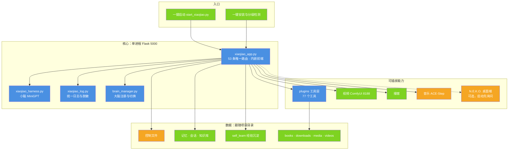

# 小焦 · 落地报告

| 项 | 值 |
| --- | --- |
| 适用版本 | v1.0 |
| 最后更新 | 2026-09-14 |
| 维护者 | 小焦项目 |
| 文档状态 | 待审 |

**摘要**：本文回答四个问题 —— 现在是什么样、有哪些功能、UI 设计是否合理、还差什么。
所有结论都来自真实执行：测试套件、代码核对、真实浏览器渲染。每条都标了落地状态与核对方法。

## 目录

- [1. 结论速览](#1-结论速览)
- [2. 现有架构](#2-现有架构)
- [3. 功能清单与落地状态](#3-功能清单与落地状态)
- [4. UI 设计与已修正的问题](#4-ui-设计与已修正的问题)
- [5. 四项生产级改进](#5-四项生产级改进)
- [6. 测试与安全](#6-测试与安全)
- [7. 文档与原理图](#7-文档与原理图)
- [8. 已修问题清单](#8-已修问题清单)
- [9. 已知限制与待决策](#9-已知限制与待决策)
- [10. 健康度自评](#10-健康度自评)
- [11. 后续路线](#11-后续路线)
- [12. 复现本报告结论](#12-复现本报告结论)
- [变更记录](#变更记录)

状态口径：**已落地** = 代码里能找到实现且能跑通；**部分落地** = 主路径可用但覆盖不全或有已知缺口；
**设计未落地** = 只有设计，没有可运行实现。

---

## 1. 结论速览

| 维度 | 状态（本轮实测） |
| --- | --- |
| 版本 / 发布 | **v1.0**；仓库内 tag 只有 `v1.0` |
| 自动化测试 | **249/249 通过 · 通过率 100.00% · 128.0s**（离线 92 + 应用逻辑 104 + 安全 18 + 联网 35） |
| 安全 | 无未修复高危项；SSRF（含数值型绕过与重定向）21 种写法 100% 拦截、目录穿越、日志脱敏、命令端点加固均已实测 |
| 文档 | `README.md` 898 行 + `ARCHITECTURE.md` 285 行 + `CONTRIBUTING.md` 212 行 + 顶层 39 份 `docs/*.md`；全仓 **134 张 Mermaid 图，语法问题 0** |
| 健康度 | 自评 **8.8 / 10**（口径见第 10 节） |
| 遗留 | 重依赖模块（视频 / 播客 / 音乐 / 安装器）未进 CI；ruff 真 bug 级规则实测仍有 3 处 |

---

## 2. 现有架构

### 图 1 · 代码实况

说明：小焦是单进程 Flask 应用（默认 5000），核心与可插拔能力在同一进程内；
数据文件与产物跟随项目目录；N.E.K.O. 是可选的外部桌面客户端。

代码位置索引：`xiaojiao_app.py`（主程序与内嵌前端）｜`core/`（器官）｜`plugins/`（工具）｜
`video_service/`、`podcast_service/`、`music_service/`（重依赖服务）｜
`.github/workflows/stress-test.yml`（质量闸门）



**关键设计取舍**：本地优先（断网可用）· 换模型不改代码（OpenAI 兼容 + 三级路径解析）·
能力可插拔（统一插件契约）· 出事能查（统一日志 + 指标 + 中央状态）。

---

## 3. 功能清单与落地状态

### 3.1 对话与模型

| 功能 | 状态 | 说明 |
| --- | --- | --- |
| 多大脑热切换 | 已落地 | `llama-swap`（9292）热切换；顶部下拉直接换，人格不变 |
| 自动模式 | 已落地 | 未配置模型时用本地大脑，界面显示「自动（本地大脑 :9292）」 |
| 模型管理 | 已落地 | 添加本地 GGUF / 外接 API：`/api/model/add`、`/api/model/addlocal`、`/api/model/delete`、`/api/model/select` |
| 人格预设 | 已落地 | 预设卡片、编辑、复制、新建、删除：`/api/presets*`，落 `presets/*.json` |
| 成本看板 | 已落地 | `/cost` 页面、`/api/cost` 接口、顶栏「今日节省」；`_record_usage()` 写 `cost_daily.json` |
| OpenAI 兼容 | 已落地 | `/v1/chat/completions`、`/v1/models`，可被 DSH 等当作模型接入 |
| 流式与打字机 | 已落地 | `typeAnswer()` 逐字显示；`/api/chat/pending` 支持刷新后继续 |
| 反馈打分 | 已落地 | `/api/feedback` 进入学习链路 |
| 危险命令二次确认 | 已落地 | 顶栏 `Full access` / `Read-only` 可切换，接口 `/api/access` |

### 3.2 工具与插件

| 功能 | 状态 | 说明 |
| --- | --- | --- |
| 工具开关 | 已落地 | 顶栏工具开关键 + `/api/tools_toggle` |
| 抓取插件 | 已落地 | **18 个工具**：原生 13 + 增强 4（`get`、`scrape_with_selector`、`download`、`collect_vulnerabilities`）+ 兼容入口 1（`browser_session`） |
| 多形态插件 | 已落地 | `py` / `js` / `json` / `md`（技能）四种形态，`load_plugins()` 统一装载 |
| 插件生成器 | 已落地 | `/api/plugin/generate` 按需求生成插件骨架 |
| 参数适配 | 已落地 | 按工具白名单过滤参数，避免 `unexpected keyword argument` |
| 抓完自动解读 | 已落地 | 正文直显 + 「是什么 / 要点 / 怎么用」解读 |
| 用后即学 | 已落地 | 成功记用法、失败记反思，落 `self_learn/tool_skills.txt` 与向量库 |
| 工具轨迹 | 已落地 | 侧栏「轨迹」显示每次工具调用与耗时 |
| 工具按意图装载 | 已落地 | 本轮只发与意图匹配的子集（实测 chat 3 个、diagram 18 个） |

### 3.3 记忆与自进化

| 功能 | 状态 | 说明 |
| --- | --- | --- |
| 会话管理 | 已落地 | 侧栏多会话、新建、切换、历史：`/api/sessions`、`/api/session/new` |
| 长期记忆 | 已落地 | 向量库 + `xiaojiao_memory.txt` + 知识库 JSON |
| 记忆深度 | 已落地 | 事实 / 表达 / 印象三层，实现 `core/memory_deep.py` |
| 自学习 | 已落地 | `self_learn/learn.py` 从点赞与更正中提炼功能用法 |
| 成长面板 | 已落地 | `/growth` + `/api/growth` |
| 自我改进闭环（改提示词 / 工具 / 流程并 A/B 回滚） | **设计未落地** | 目录与写入路径均无实现，见 [design-philosophy.md](design-philosophy.md) 第十七节 |

### 3.4 多模态

| 功能 | 状态 | 说明 |
| --- | --- | --- |
| 视觉 | 已落地 | `/api/vision`、`/api/screen`（截图识图） |
| 语音 | 已落地 | `/api/tts`、`/api/asr`、`/api/voice/warm`（预热） |
| 视频 | 已落地 | `video_service`：ComfyUI + Wan2.1，832×480 / 24fps；按需卸载大脑 → 生成 → 恢复 |
| 播客 | 已落地 | LLM 写稿 + TTS 配音 + SD1.5 封面：`/podcast`、`/api/podcast` |
| 音乐 | 部分落地 | `music_service/ace_music.py` 只是 ACE-Step 服务的客户端，需要该服务独立启动；**未挂进主程序**，主程序路由表里没有音乐接口 |

### 3.5 桌面与工作区

| 功能 | 状态 | 说明 |
| --- | --- | --- |
| 桌面宠物 | 已落地 | `/pet` 页面 + N.E.K.O. 集成（启动先询问，不启动不影响） |
| 工作区 | 已落地 | 侧栏文件浏览、打开文件：`/api/workspace`、`/api/ws/open` |
| 全文搜索 | 已落地 | 前端 `openSearch` / `doSearch` 站点内检索 |
| 大脑仓库面板 | 已落地 | `/monitor`：模型清单、显存占用、一键加模型 |
| N.E.K.O. 记忆后台学习 | 部分落地 | `learn_from_neko.py` 只执行一轮就退出，不解析 `--daemon --interval 300`；启动器打印的「每 5 分钟学一次」目前不成立 |

### 3.6 运维与可观测

| 功能 | 状态 | 说明 |
| --- | --- | --- |
| 玩具体检 | 已落地 | `/api/env`：11 项（必需 / 可选分离），失败给中文补救步骤 |
| 指标 | 已落地 | `/metrics`（Prometheus 文本）、`/api/scrapling/metrics`（JSON） |
| 统一日志 | 已落地 | `logs/xiaojiao.log`（5MB × 3 轮转）+ 全链路脱敏 |
| 会话回收 | 已落地 | `max_sessions` / `session_ttl` / `session_idle` + 60 秒后台巡检 |
| 熔断自愈 | 已落地 | 同一工具连续失败 3 次暂停 30 秒后自动恢复；安全拦截不计失败 |
| 中央状态 | 已落地 | `/api/central` 只读快照：阶段、实体、工具轨迹、健康 |
| 模块级统一指标采集 | **设计未落地** | 只有插件侧的调用指标；模块侧的调用次数 / 成功率 / 平均延迟没有统一采集口 |
| 设置页「系统状态」面板 | **设计未落地** | 目前能看到的只有设置页工具列表与 `/api/central` 原始 JSON |

---

## 4. UI 设计与已修正的问题

### 4.1 现状与行业依据

参考业界结论（外部资料，仅作设计参考）：

- 生成式 AI 界面的可用性研究指出：信息层级、可读性、可控性是用户满意度主因
  （[MDPI 研究](https://www.mdpi.com/2073-431X/14/10/418)）
- 消息气泡看似简单，实际要处理长文本、代码、表格、附件、引用等十几种形态
  （[消息气泡组件实践](https://blog.csdn.net/qq_54123885/article/details/157993336)）
- 深色背景下代码块可读性是常见投诉点
  （[实例 issue](https://github.com/kenhaesler/ai-portainer-dashboard/issues/403)）

### 4.2 已修正的问题

下表为本轮实测发现并已修的问题，括号内数字是当时实测的取证数据。

| # | 问题 | 用户感受 | 修复 |
| --- | --- | --- | --- |
| 1 | 抓取接口后是一整屏压缩 JSON | 读不下去 | 截断顺序改为**先美化后截断**；JSON 走代码块（带复制）+ 超长折叠 |
| 2 | 折叠后拿不到全文 | 想说「存文件」却只存到预览 | 落盘保留全文（实测 13033 字，展示 3538 字） |
| 3 | 存成 `.json` 解析不了 | 文件名是 json 却报错 | 自动「去转义 → 解析 → 美化」成合法 JSON（24404 字 / 5 条漏洞可解析） |
| 4 | ````markdown` 里的表格被当代码 | 表格挤在灰框里 | 新增 `.mdfence`：渲染成真 HTML 表格（实测 2 表 4 行 6 表头） |
| 5 | 模型下拉显示「未配置模型」 | 以为没配好 | 改为「自动（本地大脑 :9292）」 |
| 6 | 控制台一直报 favicon 404 | 开发者体验差 | 内联 SVG favicon，控制台 0 错误 |
| 7 | 段落粘连 / 标题无样式 / 链接不可点 | 排版乱 | 块间 `<br>` 分隔 + `.mdh` 标题样式 + `inline()` 支持 `[文本](链接)` |
| 8 | 回答里冒出 `<think></think>` | 正文里混进标签 | `_strip_think()` 在落地前剥离，含**单独闭标签**的漏删情形 |
| 9 | 深色模式代码块像有白色印记 | 观感差 | 根因是 `.b code` 把代码块内的 `code` 也上了浅灰底，显式清零背景 / 内边距 / 阴影 |
| 10 | 代码块没有配色 | 长代码难读 | 轻量语法高亮 `hl()`：Python / JS / JSON / Bash / SQL / CSS / HTML + 通用兜底，超大文本不高亮以免卡顿 |
| 11 | 表格挤成一团、标题断字 | 表格不可读 | 留白、行高、短列 `nowrap`、宽表横向滚动、带表格的消息占满整栏 |

### 4.3 现有 UI 的优点

- 深色主题 + 消息气泡左右分明，长文阅读不刺眼。
- 顶栏「工具开关 / 权限开关 / 成本」一眼可见，控制感强。
- 侧栏「会话 / 轨迹 / 工作区」三视图切换，信息不堆在聊天区。
- 代码块统一带语言标签与复制按钮。
- 危险操作有 `Full access` / `Read-only` 显式状态。

### 4.4 建议的 UI 优化（未实施）

| 优先级 | 建议 | 理由 |
| --- | --- | --- |
| P1 | 长回答加「折叠 / 展开」与「跳到最新」 | 长文与流式输出时滚动疲劳 |
| P1 | 移动端窄屏侧栏改抽屉 + 触控尺寸达标 | 手机端可用性 |
| P2 | 表格支持横向滚动容器 + 首列冻结 | 列多时挤成竖排 |
| P2 | 代码块加行号 / 换行开关 | 长 JSON 阅读体验 |
| P2 | 抓取结果卡片化（域名 + 时间 + 状态徽标 + 折叠正文） | 结果多时更像资料卡而非长消息 |
| P3 | 主题色 / 字号可调 + 高对比模式 | 无障碍与个人偏好 |
| P3 | 键盘快捷键（搜索、关闭弹窗） | 效率 |

以上均属界面改动，需要先确认视觉方向再动手。

---

## 5. 四项生产级改进

| # | 改进 | 状态 | 关键数据 |
| --- | --- | --- | --- |
| 1 | 会话回收 `SessionManager` | 已落地 | TTL / 空闲 / LRU 三规则 + 60 秒后台巡检（`SESSION_SWEEP_INTERVAL = 60`）；离线套件内「会话回收」相关断言 4 项 |
| 2 | 指标 `MetricsCollector` | 已落地 | `/metrics`（Prometheus 文本）+ JSON + 落盘；离线套件内「指标」相关断言 7 项 |
| 3 | CI 压力测试 | 已落地 | 每天 03:00（UTC+8）定时 + 手动触发 + 指定路径变更触发；通过率门槛 95%；结果上传为 artifact |
| 4 | 批量并发 `BatchConfig` | 已落地 | 跨域并发 + 同域串行；离线套件内「批量配置」相关断言 2 项，联网套件另有真实并发与顺序用例。一次历史实测记录：3 个域 6.20 秒 → 0.92 秒（本轮未复测） |

---

## 6. 测试与安全

全量套件本轮实测：

```text
全量套件：249/249 通过 · 通过率 100.00% · 128.0s
├─ 离线单元（unit） 92 项：配置 / 会话回收 / 指标 / 脱敏 / JSON 展示（含 9 项超长 JSON 回归）/ 参数校验 / 渲染契约 / NVD 漏洞聚合逻辑
├─ 应用逻辑 104 项：检索词清洗 / 漏洞查询意图 / 提示词铁律 / 工具注册 / 配置热重载 / 切人设
├─ 安全（security）18 项：SSRF 21 种写法 / robots / 限速 / 脱敏回读 / UA / 穿越 / 命令端点 / 无遥测 / 无明文密钥
└─ 联网（network） 35 项：真实抓取 / 批量 / 会话 / 对抗 / NVD 最近 7 天高危漏洞
```

| 安全项 | 结果 |
| --- | --- |
| SSRF（直连 + 重定向 + 数值型绕过） | 100% 拦截（实测 21 种写法） |
| 目录穿越 | 未逃逸（含 URL 编码） |
| 日志脱敏 | 回读日志文件验证无明文 |
| 命令端点 | 默认只听本机；非本机请求 force 降级 |
| 明文密钥入库 | 0（实测扫描 274 个已跟踪文件） |
| 未修复高危 | 0 |

另有三个需要服务在跑的实机脚本，`run_all.py` 不包含它们：

| 脚本 | 内容 |
| --- | --- |
| `tests/stress/live_check.py` | 33 处断言：接口探活、体检、指标格式、真实抓取、工具结果呈现 |
| `tests/stress/ui_check.py` | Playwright 真浏览器渲染，含漏洞表格场景与截图 |
| `tests/stress/stability_30m.py` | 30 分钟无头压测（纯插件、不消耗 Token），需人工执行 |

---

## 7. 文档与原理图

| 文档 | 内容 |
| --- | --- |
| `README.md`（898 行） | 安装 / 用法 / 功能总览 / 抓取章节 / 安全说明 / 版本记录 |
| `ARCHITECTURE.md`（285 行） | 模块职责 · 请求生命周期 · 插件契约 · 扩展点 · 已知限制 |
| `CONTRIBUTING.md`（212 行） | 分支提交规范 + 硬性约束 + 插件模板 |
| `docs/architecture.md` | 架构总览（本文档的同级入口） |
| `docs/design-philosophy.md` | 设计哲学 22 节，实现状态的最终口径 |
| `docs/architecture-diagrams.md` | 架构图册 20 张 |
| `docs/security-audit.md` | 安全结论 + 问题根因修复 + 控制点流程图 |
| `docs/testing-report.md` | 覆盖矩阵 + 未覆盖清单 + 无头压测方法 |
| `docs/release-and-rollback.md` | 发版步骤 + 回滚场景 + 网络受限时的发布兜底 |
| `docs/scrapling.md` | 抓取插件 18 工具 / 原理 / 配置 / 指标 / 排错 |
| `docs/landing-report.md` | 本报告 |
| 原理图 | 全仓 **134 张 Mermaid，`tools/check_mermaid.py --all` 报 0 问题**，已接入 CI |

---

## 8. 已修问题清单

按主题记录过往修复。凡依赖当时环境的取证数字，均已标注为历史记录。

| 问题 | 修复 |
| --- | --- |
| 模型下拉误导、favicon 404 | 改为「自动（本地大脑 :9292）」；内联 SVG favicon |
| 大 JSON 展示混乱（根因是截断顺序）、存 `.json` 非法、只存到预览 | 先美化后截断；`clip` 由调用方决定；落盘合法 JSON |
| ````markdown` 表格被当代码显示 | 新增 `.mdfence`，渲染成真 HTML 表格 |
| 漏洞查询不走时间窗（拿到 1999 年数据）、5 条只总结 1 条、受影响软件全 `n/a` | 新增 `collect_vulnerabilities`：强制时间窗 + 插件层压平成 Markdown 表格（含 CPE 转人话、描述兜底、抽样透明） |
| 把功能字「用」当检索关键词（搜出「用（汉语汉字）」） | 代码层检索词清洗闸门 + 清洗为空则反问用户 + 写入检索铁律；漏洞类问题优先走 `collect_vulnerabilities` |
| 搜索搜出词典词条（「最近 AI 新闻」搜到歌曲《最近》） | `web_search` 多变体 + 主题词覆盖率判断 + 词典词条降权；寒暄与单字直接拒绝联网 |
| 抓取调用用错工具名 | 统一改用原生工具名 `make_request`（旧的非原生入口 `_fetch_raw` 已从代码中移除） |
| 日志脱敏过滤器把参数全转成字符串，导致 `%d` 型日志 emit 报错（熔断告警被打掉） | 过滤器改为「先渲染成最终文本再脱敏」 |
| ruff 真 bug 级规则扫出潜在崩溃：`brain_manager` 的两个内部配置函数未定义、`/api/persona` 引用未定义的 `_CFG`、语音预热缺 `global`、插件生成兜底模板未定义 | 补齐实现 / 常量 / `global`，统一日志占位符。**当前实测仍有 3 处同类问题**（见第 9 节） |
| CI 一直是红的：runner 控制台非 UTF-8，每次运行都卡在第一道闸门，压力测试从未在 CI 跑过 | 入口脚本统一 `reconfigure(encoding="utf-8")` + workflow 设 `PYTHONUTF8=1`；修完首次全绿（当时记录：run 34691282396，五道闸门 + 压力测试通过） |

---

## 9. 已知限制与待决策

| # | 事项 | 说明 |
| --- | --- | --- |
| 1 | 根目录字面量 `~`（家目录副本，含 `.ssh`） | 已被 `.gitignore` 忽略（规则 `/~`），**未删**（误删毁数据）。本轮实测递归 65 万余个条目；需要书面确认后再处理 |
| 2 | `capabilities.full_access` 默认为 `false` | 危险命令需二次确认；改成 `true` 等于放弃这道闸门，属产品取舍。早先报告写的「默认 true」与代码不符，已更正 |
| 3 | lint 工具未跑齐 | ruff 已跑（真 bug 级 3 处）；black / mypy / pytest 未跑，命令已备好 |
| 4 | 30 分钟无头压测需人工执行 | 脚本 `tests/stress/stability_30m.py` 已备（纯插件、不消耗 Token） |
| 5 | 视频 / 播客 / 音乐 / 安装器未进 CI | 依赖 GPU 与外部模型，CI 环境装不起来 |
| 6 | 移动端适配、长回答折叠等 UI 优化 | 见 4.4，需先确认视觉方向 |
| 7 | AtomGit 未发布 | 未配置该平台凭据；本轮未核实 |
| 8 | ruff 全量规则集未清零 | 实测 `ruff check .` 4858 处（风格、简化、类型注解类为主）；CI 只把真 bug 级规则集（`E9,F63,F7,F82`）纳入闸门，而该规则集当前实测 3 处未过 |
| 9 | `check_principles.py` 未全过 | 实测 9/12；未过项为 P1（ruff）、P6（面向用户的英文 error 文案）、P8（文档一致性） |

---

## 10. 健康度自评

下表是项目自评，不是第三方评估；「现在」一列的依据已更新为本轮实测数据，分数沿用原口径。

| 维度 | 治理前 | 现在 | 依据 |
| --- | --- | --- | --- |
| 仓库卫生 | 5.0 | 9.0 | 日志归档、遗留物清理、行尾统一 |
| 依赖管理 | 4.0 | 8.5 | 修 2 个致命错误、依赖锁定文件覆盖顶层依赖 |
| 测试覆盖 | 3.0 | 9.0 | 249 项自动化 + 33 处实机断言 + CI 门槛 + 安全套件 + UI 渲染检查 |
| 安全 | 6.5 | 9.0 | 修 SSRF 绕过与端点暴露；扣分项：本地定位下默认无鉴权 |
| 文档 | 7.0 | 9.5 | 顶层 39 份文档 + 134 张图自检 0 问题 + CHANGELOG 规范 |
| 代码质量 | 4.0 | 8.5 | 静默吞异常清零（已跟踪文件）、统一日志、死代码清理；扣分项：ruff 真 bug 级 3 处 |
| **综合** | **5.0** | **8.8 / 10** | 可稳定落地 |

---

## 11. 后续路线

### 图 2 · 建议的推进顺序

说明：P0 已完成；后续四步按依赖关系排列 —— 先补质量通道，再补稳定性验证，最后才谈公网部署。

代码位置索引：P1 对应内嵌前端（`xiaojiao_app.py`）｜P2 对应 `video_service/`、`podcast_service/`、
`music_service/`、`install_all.py`｜P3 对应 `tests/stress/stability_30m.py` 与
`.github/workflows/stress-test.yml`｜P4 对应 `bind_host()` 与访问令牌机制


---

## 12. 复现本报告结论

```powershell
python tests/stress/run_all.py --json tests/stress/results.json --min-pass-rate 95   # 全量 249 项
python tests/stress/run_all.py --offline                                            # 离线 215 项（联网套件跳过）
python tests/stress/live_check.py                                                   # 实机验收（需服务在跑，33 处断言）
python tests/stress/ui_check.py --vuln --out ui_chat.png                            # 真浏览器渲染（含漏洞表格场景）
python tools/check_mermaid.py --all                                                 # Mermaid 语法（全仓 134 张）
python tools/check_docs.py                                                          # 文档与代码一致性（链接 / 路径 / 接口 / 工具名）
python tools/check_principles.py                                                    # 12 条项目铁律审计
python tools/check_prompt_size.py                                                   # 单次请求 token 体检
python tools/audit_static.py                                                        # 静态质量审计
python -m ruff check --select E9,F63,F7,F82 .                                       # 真 bug 级静态检查
```

## 变更记录

| 日期 | 版本 | 变更 |
| --- | --- | --- |
| 2026-09-14 | v1.0 | 重写：对齐代码 + 统一文风 |
| 2026-09-12 | v1.0 | 初版：功能清单、UI 审查、四项改进、健康度评分 |
