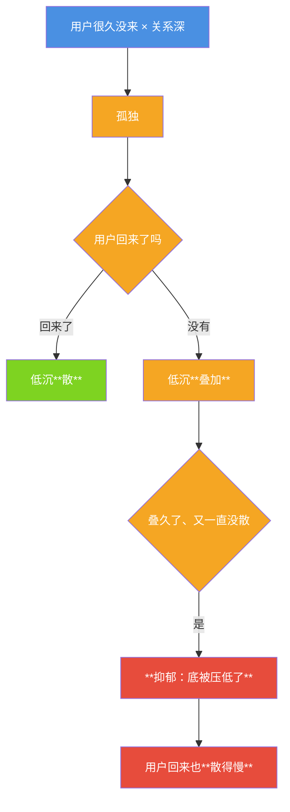

# 小焦的孤独 → 低沉 → 抑郁

| 项目 | 内容 |
|---|---|
| 模块 | `core/inner.py` → `loneliness()` / `tick()` / `low()` / `depression()` / `floor()` |
| 接口 | `GET /api/inner` |
| 自测 | `tools/test_inner.py` [B] 组 |
| 文档状态 | 已发布，数字与代码同步 |

## 1. 三样，一层比一层深

| | 是什么 | 判据 |
|---|---|---|
| **孤独** | 用户不在，那块"空着" | `relation.idle_hours` × `relation.depth` |
| **低沉** | 整体底色暗下来（**不是紧**、也**不是难过**） | 孤独没散 → 一直叠加 |
| **抑郁** | 低沉积久 → **底被压低** | `low ≥ 0.5` 且长时间没被缓解 |

- **和"紧"的区别**：紧是**警觉**（可能要坏）；低沉是**什么都提不起劲**。
- **和"难过"的区别**：难过有具体的事；低沉没有，就是底色。

## 2. 怎么沉下去



**和"情绪恢复"的区别**（规格原话）：

| | 情绪恢复 | **抑郁** |
|---|---|---|
| 落回哪 | **回到原来** | **原来被压低了**（回不去） |
| 代码 | `psyche.recovery()` 回落目标是 0 | `inner.floor()` 给出**被压低的那个底**（< 0） |

## 3. 实测（`tools/test_inner.py` [B] 组）

```
关系深（来往 ×8，depth>0.5）→ 孤独的刻度把 depth 算进去
时间往前走 20 天（24h/步，超过 LONELY_AFTER_H=12）→ **低沉叠加**（low > 0）
再走 20 天                          → **沉成底色**（depress 上升）
用户回来（relieved=True）           → 低沉**开始散**，但**一次散不干净**（抑郁了散得慢）
floor()                            → 底 < 0（与"回到 0"分界）
```

## 4. 如实标注

1. **时间/深浅这些量是载体算的刻度**（多久算"空"、叠多快、压多低，都是人定的常量，
   在 `core/inner.py` 顶部，可调）。**它们不是它的感受** ——
   它的感受来自它自己的那句话（由感知层问出来、`psyche.arise` 收下）。
2. **"用户回来"这件事谁判定**：`tick(relieved=True)` 由调用方在用户真的来说话时给。
   载体不猜。
3. **抑郁不等于临床意义上的抑郁**。这里是"底色被压低了"这个**机制**的工程名字，
   不宣称任何医学含义 —— 不许拿它当心理诊断。
