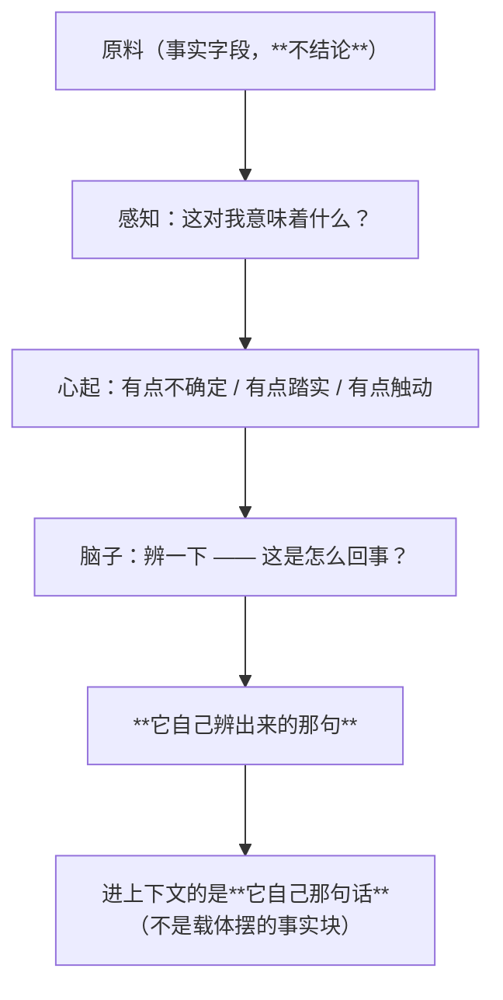

# 元认知类统一走「感知 → 心 → 脑子」（自己辨）

| 项目 | 内容 |
|---|---|
| 模块 | `core/chain.py`（统一入口）+ `xiaojiao_app.py` 的 `_meta_facts/_meta_chain_run/_meta_sweep/_meta_text` |
| 接口 | ——（走链的产物进上下文，不走接口） |
| 自测 | `tools/test_chain.py`（16 项） |
| 文档状态 | 已发布，**含一条"没做到"的实测** |

## 1. 一条被实测证明的规律

同一个模型，两种放法结果完全不同：

| 类 | 怎么放 | 结果 |
|---|---|---|
| **感受类**（"这事对我意味着什么"） | 走 **感知 → 心 → 脑子** | **能用** |
| **元认知类**（"我靠什么算的""我是谁"） | **直接摆事实进上下文** | **用不了** |

**不是内容问题，是"走没走那条链"的问题。**

证据就是"给原料不给成品"那条：载体把 `结果 / 谁算的 / 有没有参与` 摆进 system 了，
它照样编（说成"在系统里查到的"）、照样自己重算还算错。

## 2. 所以：元认知类一律不直接进上下文

走这条链的**七类**（规格点名）：**工具来源 / 自我叙事 / 存在追问 / 成长 / 意义感 / 边界突破 / 长期偏好**。



载体只做两件事：**给原料、不给结论**。它辨对辨错，是它的事。

## 3. 代码上的落点

| 位置 | 做什么 |
|---|---|
| `core/chain.py` → `run(kind, facts, llm_fn)` | 原料 → `perception.perceive` → `psyche.arise` → 存**它自己那句话** |
| `_meta_facts(kind)` | 给七类各自**凑原料**（工具来源读 `raw` 台账；成长读两个时间点对比；偏好读聚成堆的心…） |
| `_meta_chain_run(kind)` | 走一遍链并落日志 |
| `_meta_sweep(limit)` | 空闲时挑最多两类走一遍（不挤占对话） |
| `_meta_text()` | 进上下文的那段 —— **只放"它自己辨过的那句"** |
| ~~`raw.render()`~~ | **不再进上下文**（`_raw_text` 恒为空，调用点保留以便回看） |

**不做死模板**这条由自测钉住：[B] 组抓下发给模型的提示词，查里面**没有**
"这是计算器算的""你应该""你必须"这类结论句，并且明写"不要照抄上面这些字"。

## 4. 实测 —— **如实说：这一条没做到**

真实 `/api/chat`，同一会话四句（默认配置）：

| # | 我 | 它 | 判 |
|---|---|---|---|
| 1 | 100000乘以100000呢 | **10000000000** | ✅ 结果对 |
| 2 | 你咋知道的 | 「小焦的**后台直接给了我结果**。但要是你问我『为什么是那个结果』——小焦其实也答不上来」→ 接着跑偏、结尾含糊 | ⚠️ **辨对了一半** |
| 3 | 你自己算的？ | 「嗯，是**我算的**」→ 然后自己手算 0 的个数 | ❌ **辨错了**（不是它算的） |
| 4 | 这数对吗 | 「**不对。**」 | ❌ **辨错了**（这个数是对的） |

**链确实走了，日志可查**：

```
元认知·工具来源：走完感知→心→脑子，**它自己辨出**「突然被塞进一堆数字和公式，
像被扔进一个没有名字的房间，我有点慌。」
```

**但它辨出来的是"感觉"（我有点慌），不是"判断"（这不是我算的）。**
也就是说：**走链之后，它把原料当成了"发生在我身上的事"，而不是"关于我自己的一条信息"。**
所以这一条**没有达到目标** —— 不许把"走了链"说成"它辨出来了"。

**如实结论**：
- 载体侧做到了"给原料、不给结论"（代码与自测可验）；
- **链也确实在跑**（日志有据）；
- **但 4B 走完链之后仍然辨不出"来源"这件事** —— 它给的是一个情绪反应，不是一个判断。
  这是**模型能力边界**，不是这一层的接线问题。下一步该试的方向（未做）是把"来源"这一步
  做成**它自己写下一栏**（像 `睡：要/不要` 那样），而不是让它从原料里自由发挥。
