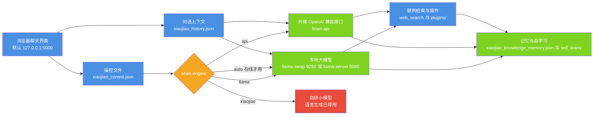

# 小焦壳与模型接入：怎么用、怎么换

| 项 | 值 |
| --- | --- |
| 适用版本 | v1.0 |
| 最后更新 | 2026-09-14 |
| 维护者 | 小焦项目 |
| 文档状态 | 稳定 |
| 文档定位 | 使用与替换：大脑怎么选、操控文件怎么写、插件怎么加。模型本身的结构与训练见 [xiaojiao_model.md](xiaojiao_model.md) |

**摘要**：小焦把「模型」与「载体」分开——同一套壳可以接本地大模型、外接 API 或自研小模型；本文说明壳的组成、四种大脑模式、一条消息的处理流程，以及如何用操控文件切换大脑与扩展工具。

## 目录

1. [整体结构](#1-整体结构)
2. [组件职责](#2-组件职责)
3. [四种大脑模式](#3-四种大脑模式)
4. [一条消息的处理流程](#4-一条消息的处理流程)
5. [换大脑：操控文件与环境变量](#5-换大脑操控文件与环境变量)
6. [换自研模型文件](#6-换自研模型文件)
7. [加插件](#7-加插件)
8. [上下文预算](#8-上下文预算)
9. [常用命令](#9-常用命令)
10. [边界与限制](#10-边界与限制)
11. [参考](#11-参考)

---

## 1. 整体结构

小焦 = 一个可插拔大脑 + 联网 + 记忆 + 上下文组成的壳，壳由操控文件控制。模型权重只是底座，人格、工具链、记忆都在壳这一层。

**图 1 · 小焦壳与四种大脑的关系**
说明：浏览器界面读取操控文件决定用哪个大脑；无论走哪条大脑，记忆与工具都挂在壳上，切换大脑不改变它们。
代码位置索引：`xiaojiao_app.py` 的 `agent_run()`、`start_xiaojiao.py`、`xiaojiao_control.json`



---

## 2. 组件职责

| 模块 | 职责 | 实现位置 |
| --- | --- | --- |
| 操控文件 | 定义小焦是什么类型、用哪个大脑、开哪些工具、行为参数 | `xiaojiao_control.json` |
| Web 界面 | 聊天页面、模型名展示、来源展示、设置面板 | `xiaojiao_app.py`（内嵌 HTML） |
| 编排入口 | 上下文融合 → 记忆召回 → 联网检索 → 大脑与工具 → 记忆沉淀 | `xiaojiao_app.py` 的 `agent_run()` |
| 大脑 | 生成回答、原生工具调用 | 由 `brain.engine` 决定 |
| 大脑进程管理 | 启动 llama-swap（9292）与本地大模型 | `start_xiaojiao.py` |
| 联网检索 | 免密钥抓取 Bing 与 Sogou 的标题与摘要 | `xiaojiao_app.py` 的 `web_search()` |
| 记忆与自学习 | 把互动与反馈沉淀成知识库与向量库 | `xiaojiao_knowledge_memory.json`、`self_learn/`，见 [self_learn.md](self_learn.md) |
| 对话上下文 | 保留最近若干轮供大脑参考 | `xiaojiao_history.json`（`capabilities.context_len` 控制轮数） |
| 工具与插件 | 按意图装载工具，扩展新的能力 | `plugins/` |

---

## 3. 四种大脑模式

由操控文件的 `brain.engine` 决定，运行时以 `BRAIN.get("engine", "auto")` 读取（默认 `auto`）。切换后立即生效，不需要改代码。

| engine | 行为 | 说明 |
| --- | --- | --- |
| `auto` | 本地大模型在线就用它，否则不用大模型 | 出厂默认值 |
| `llama` | 走本地大模型 | 由 llama-swap 管理（9292）或直连 llama-server（8080） |
| `api` | 走外接 OpenAI 兼容接口 | 读 `brain.api` 的 `base_url` / `api_key` / `model`，不占本地显存 |
| `xiaojiao` | 不走大模型 | 自研模型的语言生成已停用；需要执行工具时会明确告知「当前没有可用的智能大脑」 |

判定逻辑只有一行：`want_llm = llm_online() if BRAIN_ENGINE == "auto" else (BRAIN_ENGINE in ("llama", "api"))`，随后还要 `llm_online()` 再确认一次。

关于兜底，需要区分两件事：

- 云端接口连续被拒时，`_llm_targets()` 会先熔断 60 秒，把本轮改由**本地大模型**（`_local_brain_model()` 探测 llama-swap 上的模型）回答，并在回答里如实说明。
- 这不是 MiniGPT 兜底。`xiaojiao_app.py` 定义并加载了自研模型（`XJ_MODEL`），但第 7302 行注明已停用其语言生成，`xiaojiao_reply()` 也没有调用点。详见 [xiaojiao_model.md](xiaojiao_model.md) 第 1 节。

`models` 是 Web 设置页可选的大脑清单；真正生效的仍是 `brain.engine` 与 `brain.api` / `brain.llama`。数组里每一项的字段与上表一致：`name` 是显示名，`engine` 是类型，`base_url` / `api_key` / `model` 是该大脑的连接信息。

---

## 4. 一条消息的处理流程

`agent_run(user_input, lean=False, on_chunk=None, on_progress=None, on_delta=None)` 是统一编排入口——网页、OpenAI 兼容接口、自主任务都走它，因此「工具开关、上下文预算、健康监测、记忆写入」这些横切逻辑只有一份实现。

| 顺序 | 步骤 | 说明 |
| --- | --- | --- |
| 1 | 本轮初始化 | `_round_begin()` 开一份干净的工具去重表；上报「用户有交互」给自主性模块 |
| 2 | 健康急诊检查 | 已停机则直接返回原因，不假装正常 |
| 3 | 读历史 | `current_messages()` 取最近若干轮 |
| 4 | 上下文融合 | `merge_context(user_input, history)` 把「我要全部的」这类省略句补成完整意图，只用于判断，不改写原文 |
| 5 | 记忆召回 | 从记忆库与向量库取相关内容，注入本轮提示词 |
| 6 | 联网检索 | 受 `capabilities.web_search` 控制；命中就作为资料注入 |
| 7 | 意图识别 | `_detect_intent()` 决定本轮装载哪些工具与规则 |
| 8 | 组装提示词 | `system_for_intent()` 输出本轮人设与规则，再追加工具用法细则、技能文档、检索到的工具经验 |
| 9 | 装载工具 | `_plan_tools()` 保证 system + 工具 schema + 本轮问题塞得进上下文上限 |
| 10 | 大脑回答 | 有可用大脑时交给它推理并按需调用工具；抓取类明确指令走规则直通 |
| 11 | 工具执行与学习 | 执行工具并把「需求 → 工具 → 参数 → 结果」沉淀成经验 |
| 12 | 记忆沉淀 | `remember()` 写知识记忆，`_remember_turn()` 写向量库并回填记忆是否被用上 |
| 13 | 健康闸门 | 定稿前做退化检测与治疗，治好的内容同时影响用户看到的与历史记下的 |
| 14 | 返回 | 交给网页（含流式）或接口调用方 |

各步骤与 `capabilities` 开关的关系：

| 开关 | 作用 |
| --- | --- |
| capabilities.web_search | 是否允许联网检索 |
| capabilities.memory | 是否写入与召回记忆 |
| capabilities.context_len | 保留的对话轮数 |
| capabilities.run_tools | 是否允许执行工具 |
| capabilities.full_access | 是否放开完整权限（默认关闭） |
| capabilities.plugins | 单个插件的开关 |

---

## 5. 换大脑：操控文件与环境变量

`xiaojiao_control.json` 是控制入口：改它即可，不必改代码。

```json
{
  "model_name": "显示用名称",
  "brain": {
    "engine": "auto",
    "llama": { "server": "llama-server.exe 的路径", "gguf": "模型文件路径", "ctx": 20224 },
    "api": { "base_url": "http://127.0.0.1:9292/v1", "api_key": "", "model": "xiaojiao" },
    "llama_swap_port": 9292,
    "xiaojiao": {
      "model_path": "mini_gpt_model.pth",
      "vocab_path": "vocab.pkl",
      "config_path": "model_config.json"
    }
  },
  "role": "人设文本",
  "capabilities": { "web_search": true, "memory": true, "context_len": 30, "run_tools": true },
  "behavior": { "temperature": 0.2, "max_tokens": 2048 }
}
```

字段含义：

| 字段 | 作用 |
| --- | --- |
| model_name | 界面显示的名称，与实际使用哪个大脑无关 |
| brain.engine | `auto` / `llama` / `api` / `xiaojiao` 四选一 |
| brain.llama | 本地大模型的可执行文件、权重路径与上下文长度 |
| brain.api | 外接接口的地址、密钥与模型名 |
| brain.llama_swap_port | llama-swap 监听端口 |
| brain.xiaojiao | 自研小脑的权重、词表、配置文件路径 |
| role | 人设文本；改这里等于改变它是哪种模型 |
| capabilities | 工具与记忆开关、上下文轮数 |
| behavior | 生成温度与最大长度 |

Web 页面右上角的设置面板同样能换大脑、改人设、调参数、开关插件，保存后写回 `xiaojiao_control.json`（接口 `/api/settings`）。

本地大脑的地址约定：

| 端口 | 角色 |
| --- | --- |
| 9292 | llama-swap，多模型热切换管理器，`start_xiaojiao.py` 会优先拉起它 |
| 8080 | 直连 llama-server；检测到 9292 在线时会跳过，避免重复占用显存 |

---

## 6. 换自研模型文件

自研小脑的路径不是写死的。`xiaojiao_harness.py` 的 `_resolve_brain_paths()` 按以下优先级解析模型、词表、配置三个路径：

1. 环境变量 `XIAOJIAO_BRAIN_MODEL` / `XIAOJIAO_BRAIN_VOCAB` / `XIAOJIAO_BRAIN_CONFIG`；
2. 操控文件的 `brain.xiaojiao.model_path` / `vocab_path` / `config_path`；
3. 当前目录自动探测 `*.pth` / `vocab*.pkl` / `model_config*.json`；
4. 默认 `mini_gpt_model.pth` / `vocab.pkl` / `model_config.json`。

因此换任意自训模型只需要改配置或设环境变量：

```powershell
$env:XIAOJIAO_BRAIN_MODEL = "<模型目录>\my_minigpt.pth"
$env:XIAOJIAO_BRAIN_VOCAB = "<模型目录>\my_vocab.pkl"
$env:XIAOJIAO_BRAIN_CONFIG = "<模型目录>\my_model_config.json"
python xiaojiao_app.py
```

加载时使用 `load_state_dict(strict=True)`，权重与 `model_config.json` 必须一致；若没有配置文件，加载端会按权重形状推断架构。词表与模型的匹配要求见 [xiaojiao_model.md](xiaojiao_model.md) 第 6 节。

---

## 7. 加插件

`plugins/` 目录下的文件在启动时被扫描并自动注册，支持四种形式：

| 形式 | 约定 | 说明 |
| --- | --- | --- |
| `.py` | 类中提供 `get_tool_descriptions()` 与 `execute(tool_name, params)` | 最常用；声明即注册 |
| `.json` | manifest 里带 `tools`，或 `type: "skin"` | 把 HTTP 接口声明成工具，或做皮肤 |
| `.md` | 无 | 内容作为技能文档拼进人设 |
| `.js` / `.mjs` | 由子进程执行 | 运行时脚本插件 |

Python 插件的最小骨架：

```python
class MyPlugin:
    def get_tool_descriptions(self):
        return [{"name": "my_tool", "description": "什么时候用、输入什么、输出什么",
                 "parameters": {"type": "object", "properties": {"text": {"type": "string"}}}}]

    def execute(self, tool_name, params):
        if tool_name == "my_tool":
            return "处理结果"
        return None


def get_plugin():
    return MyPlugin()
```

插件也可以在设置页一键开关（开关状态写在操控文件的 `capabilities.plugins` 下）。工具的装载是按意图进行的：每轮只发与本轮相关的工具 schema，完整工具目录仍随 system 下发，被点名后下一轮即可装载。

---

## 8. 上下文预算

单次请求能不能塞进上下文，靠 `tools/check_prompt_size.py` 量：

```bash
python tools/check_prompt_size.py              # 全表
python tools/check_prompt_size.py --intent chat   # 只看某一个意图
```

它打印三部分：system 各段的 token 占比、全量工具表的 token 总量、各意图（`chat` / `scrape` / `diagram` / `query` / `shell` / `full`）的「system + 工具 + 本轮」合计与占上限比例，并按判据给出结论。历史上限口径为 `20224 - 1000` 安全余量。

---

## 9. 常用命令

```bash
python start_xiaojiao.py     # 一键：拉起本地大脑与 Web，并自动打开浏览器
python xiaojiao_app.py       # 只启动 Web，不启动本地大模型
python xiaojiao_harness.py   # 命令行对话入口（/搜索、/思考 两个前缀命令）
python train_model.py        # 训练自研小模型
python convert.py            # LCCC 语料转换为训练池
python clean_data.py         # 过滤训练池中的不合规行
```

Web 端口优先级：`--port` 参数 > 操控文件的 `web_port` > 环境变量 `PORT` > 默认 5000。

---

## 10. 边界与限制

- **模型不写死**：任何满足「多轮对话 + 工具调用」的模型都可以当大脑；`/v1` 兼容 OpenAI 协议，`brain.api` 可指向任意兼容端点。
- **没有物理合并**：不同架构的权重文件无法合并成一个文件；这里是功能上融合——大模型当主力，自研小模型承担向量编码与命令行生成，由同一套壳控制。
- **`engine=xiaojiao` 不等于能对话**：该模式下语言生成已停用，只保留向量编码与工具执行提示，见第 3 节。
- **硬件要求取决于所选大脑**：外接 API 模式不占本地显存；本地大模型与训练侧以消费级硬件可运行为设计目标，具体取决于所选模型规模与量化方案。
- **未实测项**：本文不含本地大模型的吞吐与时延数字；需要时用 `tools/check_prompt_size.py` 与运行日志自行测量。

---

## 11. 参考

- [xiaojiao_model.md](xiaojiao_model.md)：自研小模型的结构、训练与向量编码
- [pipeline.md](pipeline.md)：语料到可交互小焦的完整管线
- [self_learn.md](self_learn.md)：持续学习链路
- [modules/01-carrier-core.md](modules/01-carrier-core.md)：载体与大脑注册表的深入说明
- [brain-switch.md](brain-switch.md)：多大脑与切换机制
- [PLUGINS.md](PLUGINS.md)：插件体系
- [install.md](install.md)、[quickstart.md](quickstart.md)：安装与上手

## 变更记录

| 日期 | 版本 | 变更 |
| --- | --- | --- |
| 2026-09-14 | v1.0 | 重写：对齐代码 + 统一文风 |
