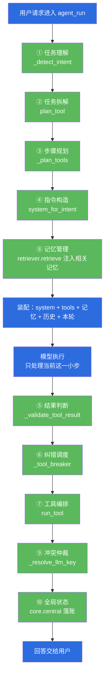
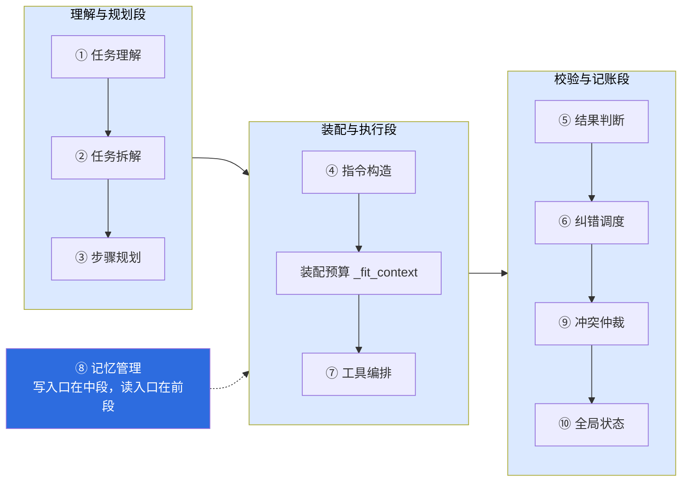
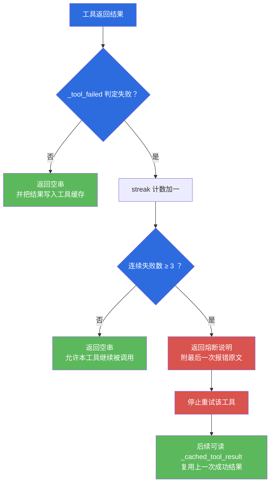
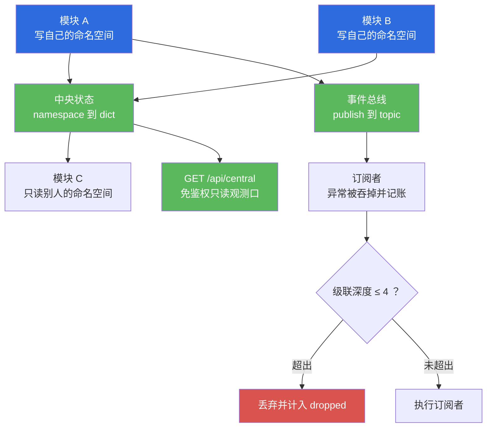

# 小焦 · 模块文档 01：载体核心智力

| 项 | 内容 |
| --- | --- |
| 文档名称 | 小焦 · 模块文档 01：载体核心智力 |
| 适用版本 | v1.0 |
| 最后更新 | 2026-09-14 |
| 维护者 | 小焦项目 |
| 文档状态 | 稳定 |
| 对应测试 | `tools/test_mind.py` |
| 本次实测结果 | 通过 77 / 共 77（退出码 0） |
| 实现主体 | `xiaojiao_app.py` 与 `core/` |

术语约定：本文把可替换的模型权重视为「火种」，把模型之外的整套代码视为「载体」。
十项智力全部由载体提供，模型只承担「模型执行」一格。

---

## 目录

- [1. 摘要](#1-摘要)
- [2. 背景与问题](#2-背景与问题)
- [3. 设计目标](#3-设计目标)
- [4. 架构与原理](#4-架构与原理)
- [5. 十项能力逐项说明](#5-十项能力逐项说明)
- [6. 接口与实现](#6-接口与实现)
- [7. 使用示例](#7-使用示例)
- [8. 边界与限制](#8-边界与限制)
- [9. 故障排查](#9-故障排查)
- [10. 参考](#10-参考)
- [变更记录](#变更记录)

---

## 1. 摘要

### 1.1 一句话摘要

载体核心智力解决的问题是：把「理解任务、拆解任务、装配指令、判断结果、纠错、编排工具、管理记忆、仲裁冲突、维护全局状态」这十件事从模型权重里搬到代码里，使同一个载体接任意火种都能完成一次完整任务。

### 1.2 十项能力索引

| 序号 | 能力 | 载体落点 | 一句话职责 |
| --- | --- | --- | --- |
| ① | 任务理解 | `_detect_intent` | 判断这一轮属于哪类意图 |
| ② | 任务拆解 | `plan_tool` | 把请求拆成「工具名 + 参数」的可执行一步 |
| ③ | 步骤规划 | `_plan_tools` | 决定这一轮装载哪些工具、装多少 |
| ④ | 指令构造 | `compose_system_prompt`、`system_for_intent` | 拼出这一轮发给模型的系统提示词 |
| ⑤ | 结果判断 | `_validate_tool_result`、`_tool_failed` | 判断这一步的产出是否可信 |
| ⑥ | 纠错调度 | `_tool_breaker` | 连续失败时熔断并给出可读说明 |
| ⑦ | 工具编排 | `detect_tool_intent`、`run_tool` | 从自然语言落到具体工具调用 |
| ⑧ | 记忆管理 | `load_history`、`_history_summary_line`、`retriever.retrieve` | 决定记什么、取什么、注入多少 |
| ⑨ | 冲突仲裁 | `_resolve_llm_key`、`core/central` 的择一逻辑 | 多个来源冲突时定优先级 |
| ⑩ | 全局状态 | `core/central` 的 `set_state` / `get_state` | 让各模块共享「这一轮进行到哪了」 |

---

## 2. 背景与问题

### 2.1 问题起点

本地小模型的单次推理能力有限。它可能在一次生成里理解对了任务，却选错工具；也可能工具选对了，却把失败的结果当成成功来汇报。
这些失误如果只靠「换更大的模型」解决，那么载体的每一处设计都会随模型一起作废。

小焦的做法是把失误拆成可判定的十格。每一格有明确的输入、输出与判据，可以单独调用、单独测试。
这样做的直接后果是：模型换掉之后，十格里的九格行为不变，只有「模型执行」那一格随火种变化。

### 2.2 不这么做会怎样

| 缺哪一项 | 用户能观察到的后果 |
| --- | --- |
| 任务理解 | 一句「你好」也要装配全部工具与规则，固定开销顶穿本地上下文窗口 |
| 任务拆解 | 闲聊被规划成工具调用，实测曾给「你好」编出一条 `Get-Process` 命令 |
| 步骤规划 | 每轮发送全部工具的结构声明，工具越多越容易选错 |
| 指令构造 | 同一条规则被重复拼进系统提示词，白占预算 |
| 结果判断 | 抓取工具返回 15 个字，也被当成正常页面内容交给模型总结 |
| 纠错调度 | 同一个失败的工具被无限重试，整轮对话卡在同一个错误上 |
| 工具编排 | 用户说的命令无法落到 `run_command`，模型只能用文字描述它本可以执行的命令 |
| 记忆管理 | 检索到的记忆没有说话人框定，模型把用户的经历当成自己的经历 |
| 冲突仲裁 | 界面里填的密钥被配置文件里的旧值覆盖，请求打到错误的端点 |
| 全局状态 | 各模块各写各的局部变量，出问题时无法回答「这一轮停在哪一步」 |

---

## 3. 设计目标

### 3.1 Goals

1. 十项各自有独立的输入输出契约，可被单独调用，可被单独断言。
2. 十项里除「模型执行」外的九项，不依赖任何模型特性，换火种后行为不变。
3. 每一项对脏输入不抛异常。用户输入是最脏的数据，任何一项抛异常都会让整轮对话返回 500。
4. 每一项都留下可核对的痕迹：日志行、中央状态或病历记录三者之一。
5. 一个复杂任务能连续走完十项，且每一步的中间结果可被下游读取。

### 3.2 Non-Goals

1. 不追求「载体会思考」。载体做的是判定、装配、校验与记账，不做开放式推理。
2. 不替模型选择任务路线。载体给信息与判据，模型决定做什么。
3. 不修改模型权重。权重改变会破坏「火种可替换」这一前提。
4. 不为单项能力引入外部模型调用。十项自测不联网、不调模型。
5. 不承诺十项在任何输入下都给出正确判断。判据是规则，规则有边界，边界写在每一项的说明里。

---

## 4. 架构与原理

### 4.1 图 1 · 一次请求走完十项

说明：这张图是全文的索引。十项按执行顺序排在一条链上，模型只出现在中间一格。

代码位置索引：`xiaojiao_app.py` 的 `agent_run`，以及 `_detect_intent`、`plan_tool`、`_plan_tools`、`system_for_intent`、`_validate_tool_result`、`_tool_breaker`、`run_tool`、`retriever.retrieve`、`_resolve_llm_key`。



### 4.2 图 2 · 三段式分工

说明：十项按职责分成三段。前段决定「要什么」，中段决定「发什么」，后段决定「留着什么」。

代码位置索引：`_detect_intent`、`plan_tool`、`_plan_tools`、`system_for_intent`、`_fit_context`、`_tool_breaker`、`_resolve_llm_key`、`core/central/__init__.py`。



### 4.3 图 3 · 载体与模型的职责边界

说明：这条边界是本模块成立的前提。边界左边是代码，右边是权重。

代码位置索引：`agent_run`、`system_for_intent`、`_validate_tool_result`、`core/mind_stream/inject.py` 的 `temperature_for`。


### 4.4 图 4 · 纠错调度的熔断判定

说明：同一个工具连续失败达到阈值即熔断，并把最后一次报错原文一并交回给模型。

代码位置索引：`xiaojiao_app.py` 的 `_tool_breaker`、`_tool_failed`、`_cache_tool_result`、`_cached_tool_result`。



### 4.5 图 5 · 全局状态与事件总线的读写关系

说明：模块之间不互相导入。每个模块写自己的命名空间，读别人的命名空间，跨模块通知走事件总线。

代码位置索引：`core/central/__init__.py` 的 `set_state`、`get_state`、`clear_state`、`publish`、`subscribe`、`snapshot`，以及只读端点 `/api/central`。



---

## 5. 十项能力逐项说明

### 5.1 ① 任务理解

**解决什么问题。** 判断这一轮属于哪一类意图，从而决定装载哪些工具、带哪几条规则。
意图集合为 `chat`、`scrape`、`diagram`、`query`、`shell`、`full` 六类。
这一项不调用模型：为一次分类再花一次请求，成本与延迟都不划算，而且判错时用户还要多等一轮。

**代码落点。** `xiaojiao_app.py` 的 `_detect_intent(user_input)`，辅助判据为 `_looks_like_url`、`_looks_like_shell_command`、`_mentions_shell_command`、`_asks_diagram`、`_asks_net_ip`、`_asks_info_collect`、`_is_chitchat`。意图到工具的映射在 `_INTENT_TOOLS`。

**判据。** 顺序即优先级：画图高于网址，网址高于命令原文，命令原文高于查询，查询高于命令词，命令词高于闲聊，兜底为 `chat`。
实测断言（`tools/test_mind.py`）：「你好呀」判为 `chat`；「抓一下 http://example.com」判为 `scrape`；「用 Archify 画个架构图」判为 `diagram`；「帮我查一下最近的漏洞」判为 `query`；「跑一下 ipconfig」「执行 ping 127.0.0.1」「运行 dir」「运行 rm -rf /tmp/x」「删除 C:/a.txt」「帮我删除桌面那个文件」「把日志删掉」七条均判为 `shell`。
反向判据：「ping 是什么意思」「ipconfig 和 netstat 什么区别」「怎么删除环境变量」三条提问不得判为 `shell`。
兜底判据：空输入返回确定值而非 `None`，`None` 输入不抛异常，三百个表情符号的超长输入不抛异常，同一输入两次调用结果一致。
兜底意图从 `full` 改为 `chat` 的原因有实测数字支撑：本地上下文上限为 19224 token，全部 77 个工具的结构声明为 13891 token，占上限的 72%。

**边界。** 判据是字符串规则，不是语义理解。规则列举不完自然语言的全部说法，漏掉的说法会落到 `chat`。
落到 `chat` 不等于功能丢失，因为完整工具目录始终随系统提示词下发，模型点名某个工具后下一轮装载它。
「删除」一词被特别纳入命令类判据，原因不是要执行删除，而是要让载体层的删除拦截有机会出场。判成 `chat` 时这一轮不装载 `run_command`，拦截逻辑就没有出场机会。

### 5.2 ② 任务拆解

**解决什么问题。** 把一句自然语言请求拆成「工具名 + 参数字典」这一件模型能执行的事。
拆解产物必须可执行，因此参数不能是空话，工具名必须是真实工具表里的名字。

**代码落点。** `xiaojiao_app.py` 的 `plan_tool(user_input)`，返回二元组 `(工具名, 参数字典)`。工具名真实性的校验入口为 `all_tool_names()`。

**判据。** 实测断言：「抓一下 http://example.com 然后总结」返回二元组，第一项在 `all_tool_names()` 内，第二项为非空字典。
闲聊闸门：「你好」「在吗」「嗯嗯」「今天好累」「哈哈」五条一律返回 `(None, None)`。
反向保护：「写个文件到桌面」必须照常规划，第一项为 `write_file`，说明闲聊闸门没有把动手请求一并拒掉。
历史记录：「你好」曾被规划出一条 `Get-Process` 命令，闲聊闸门是为修掉这一条而加的。
空输入与 `None` 输入不抛异常。

**边界。** 拆解的粒度是「一步」，不是完整计划树。把多步任务展开成有序计划属于 `docs/design-philosophy.md` 第十六节所述的多智能体协作，角色定义与调度接口目前为设计、未落地。
参数由规则与模型共同产出，参数正确性由后续的⑤结果判断与⑥纠错调度兜底。

### 5.3 ③ 步骤规划

**解决什么问题。** 决定这一轮发给模型多少个工具的结构声明，以及这一轮实际装载哪些工具。
工具的「存在」与工具的「本轮装载量」是两件事：`plugins/` 目录里的工具一个不删，载体只决定这一轮发多少条结构声明。

**代码落点。** `xiaojiao_app.py` 的 `_plan_tools(intent, system_text, current_text, max_ctx=None)` 返回 `(工具名列表, 预估 token)`；`_intent_tool_names(intent)` 给出该意图的工具名列表且永不返回 `None`；`_tools_tokens(names)` 估算这一批工具的结构声明开销；`_FULL_CORE_TOOLS` 是核心集。

**判据。** 实测断言：`chat` 意图装载的工具数大于 0 且不超过 6 个；不同意图装载的工具集合不相同；装载的工具名全部在 `all_tool_names()` 内；`_tools_tokens` 返回非负整数；未知意图不抛异常并退到核心集。
预算判据：`_plan_tools` 内以 `max_ctx` 减去系统提示词、本轮问题与消息外壳开销得到工具预算，超出预算时按列表顺序收敛本轮装载量，至少保留 1 个。
实测装载量（`tools/check_prompt_size.py`，本次运行）：`chat` 3 个工具 381 token；`shell` 3 个 581 token；`query` 5 个 884 token；`scrape` 10 个 2576 token；`diagram` 18 个 2850 token；`full` 10 个 2069 token。
工具名真实性校验使用 `all_tool_names()` 而不是 `real_tool_names()`。后者只登记插件工具，用它做校验会把 `run_command`、`read_file`、`list_files` 这类内置工具判为不存在。

**边界。** 收敛装载量只影响这一轮发出去的结构声明，不影响工具是否可用。
若某一轮的工具名子集与真实工具表零交集，载体改发核心集并在日志中记录一条警告，而不是回落到全部工具。

### 5.4 ④ 指令构造

**解决什么问题。** 把这一轮需要发给模型的系统提示词拼出来，包含人设、检索铁律、工具规则、记忆注入说明与本轮模式提示。
同一份人设两次拼装必须得到相同结果，否则缓存与对比都失去意义。

**代码落点。** `xiaojiao_app.py` 的 `compose_system_prompt(role, plugins=None)` 输出全量系统提示词；`system_for_intent(intent, role=None, plugins=None, user_input="")` 输出按意图收窄后的系统提示词，实际请求使用后者。组成片段包括 `_SEARCH_RULES`、`_TOOL_RULES`、`_CHAT_SYSTEM_HINT`、`_CHAT_FALLBACK_HINT`、`_DIAGRAM_SYSTEM_HINT`、`_MEMORY_INSTRUCTION`。

**判据。** 实测断言：`compose_system_prompt("你是小焦。")` 返回长度大于 200 的非空字符串；结果包含 `_SEARCH_RULES` 与 `_TOOL_RULES`；结果包含人格层规则；`_TOOL_RULES` 在结果中出现次数恰好为 1；两次调用结果完全一致；`role=None` 不抛异常。
体量判据（`tools/check_prompt_size.py`，本次运行）：`SYSTEM_PROMPT` 合计 6243 token，其中 `_TOOL_RULES` 1117 token、`_SEARCH_RULES` 350 token、`_MEMORY_INSTRUCTION` 146 token、纯人设 77 token。
收窄判据：闲聊轮的实际系统提示词为 284 token，远小于全量。

**边界。** 全量系统提示词包含完整插件清单与技能文档，体量远大于按意图收窄后的版本。测量单轮开销时必须测量实际请求使用的那一份，不能测量全量版本。
拼装是幂等的，但不做去重之外的优化。同一段文字被两个来源同时提供时会各出现一次，规则的数量由规则设计者控制。

### 5.5 ⑤ 结果判断

**解决什么问题。** 判断某一步的产出是否可信，尤其是抓取类工具返回的内容是否短得不像一个真实页面。
判断结果分三种：可信、可能幻觉、不适用。

**代码落点。** `xiaojiao_app.py` 的 `_validate_tool_result(tool, args, result)` 返回 `(判定, 说明)` 二元组；`_tool_failed(result)` 返回布尔值，判定超时、失败与错误三类结果。

**判据。** 实测断言：空结果返回的判定为 `None`，表示不适用，附带空说明；正文长度为 240 字时判定为 `True`；正文长度为 15 字时判定为 `False`，说明为「可能幻觉，返回正文只有 15 字，短得不像一个真实页面」；返回结构恒为 `(判定, 说明)` 两件套；三个参数全为 `None` 时不抛异常。
`_tool_failed` 的实测断言：「连接超时」「Error: 拒绝访问」「执行失败」三条均判为失败；「这是正常的返回内容」判为不是失败。

**边界。** 判定基于长度等可计算的表层特征，不做事实核对，也不与外部来源比对。
失败类结果归熔断逻辑处理，不计入幻觉判定，因此返回「不适用」而不是「有幻觉」。
把「可能幻觉」写进模型上下文的作用是让模型据此调整措辞，不构成事实担保。

### 5.6 ⑥ 纠错调度

**解决什么问题。** 同一个工具连续失败时要停止重试，并把最后一次报错原文交回给模型，让模型据此修正而不是继续撞同一个错误。
「熔断」指某个工具在连续失败达到阈值后被临时停用，后续本轮的调用不再真正发出，直接返回一段可读的失败说明。
同时保留上一次成功的结果，供后续轮次复用。

**代码落点。** `xiaojiao_app.py` 的 `_tool_breaker(streak, tool, result, tool_trace)`，第一个参数是可变的计数状态字典；缓存接口为 `_cache_tool_result(tool, args, text, session_id=None)` 与 `_cached_tool_result(session_id=None, key=None)`。

**判据。** 实测断言：连续四次传入失败结果后，计数状态达到 4，返回文本中出现「熔断」字样，原文为「已熔断：get 连续 4 次失败，停止重试」并附最后一次报错原文；传入正常结果时返回空串且计数保持为 0；脏参数不抛异常；缓存接口两个函数均可调用。
健康系统的四级介入（轻度静默修复、中度清上下文、重度切备用火种、极端停止服务）见 `docs/design-philosophy.md` 第五节，与工具级熔断是两条独立的纠错路径。

**边界。** 熔断的粒度是「单个工具在单轮内的连续失败」，不是全局开关，也不跨会话累计。
熔断不等于放弃任务，只是不再重试同一个工具；模型仍可改用其他工具或直接回答。

### 5.7 ⑦ 工具编排

**解决什么问题。** 把自然语言落到具体的工具调用，并保证调用不存在的工具时返回错误而不是抛异常。

**代码落点。** `xiaojiao_app.py` 的 `detect_tool_intent(q)` 从自然语言识别要调用的工具；`run_tool(name, args, force=False)` 执行工具；`all_tool_names()` 返回全部真实工具名；`_noarg_named_tool(text)` 识别「点名零参数工具」这类请求并由载体直接调用。

**判据。** 实测断言：「抓一下 http://example.com」能从自然语言识别出工具；空输入不抛异常；调用不存在的工具名 `no_such_tool_xyz` 不抛异常而是返回错误；工具表长度不小于 50，本次实测为 77 个。
按需装载判据（`tools/test_tool_infinity_live.py`，本次实测）：存在可点名的零参数工具；`_noarg_named_tool` 对「请用 net_ip 这个工具」的返回值为 `net_ip`；该工具载体直调成功并返回内容；一次真实请求中工具轨迹里出现了 `net_ip`。

**边界。** 工具的真实执行结果由工具自身与安全层共同决定，载体层的删除拦截见 `core/security/no_delete.py`。
模型不总是愿意调用被点名的工具。因此按需装载的可验证做法是使用零参数工具并由载体直接调用，而不是赌模型的调用意愿。

### 5.8 ⑧ 记忆管理

**解决什么问题。** 决定哪些内容写入长期记忆、哪些内容注入本轮上下文、注入多少。
记忆全部落在模型上下文之外，本轮只注入与当前问题相关的少量条目。

**代码落点。** `xiaojiao_app.py` 的 `load_history()`、`_history_summary_line(raws)`；`core/memory_vec.py` 的 `add_memory(text, kind="dialogue", entities=None, ts=None, meta=None, key_text=None)`、`search_memory(query, top_k=5, threshold=0.0, dedup_text=True)`、`reload()`；`core/retriever.py` 的 `retrieve(query, top_k=None, threshold=None, max_tokens=None, ...)`；`core/memory_deep.py` 的 `remember`、`recall`、`degrade`、`consolidate`、`compress`、`flush_index`。

**判据。** 实测断言：`load_history()` 返回列表；`_history_summary_line` 对单条历史的返回类型为字符串；脏历史取 `None` 与空表时均不抛异常；`memory_vec.search_memory` 可调用。
参数判据：`core/retriever.py` 中 `TOP_K = 5`、`THRESHOLD = 0.6`、`MAX_TOKENS = 2000`，时间衰减只参与排序，不参与阈值判定。
检索判据（`tools/test_memory_recall.py --no-model`，本次实测）：20 条历史记忆、时间跨度 180 天，命中率 5/5，即 100%，要求不低于 80%；向量检索延迟平均 13.1 毫秒、最大 30.2 毫秒，要求低于 100 毫秒；五条命中的相似度分别为 0.700、0.772、0.671、0.862、0.650。
使用率判据（同一脚本带模型运行，本次实测）：使用率 4/5，即 80%，要求不低于 70%。

**边界。** 向量后端是小脑模型 MiniGPT。小脑指承担向量编码的本地小模型，它不参与推理，只把文本压成一串定长的数字。该模型为字符级、8 层、512 维，中文主题级语义可用，精细语义区分度有限。无关中文句子也可能得到 0.6 左右的相似度，因此阈值不能再抬高。抬高阈值会漏掉真正相关的记忆，本次实测中最低的一条命中相似度只有 0.650。
「使用率」只在被问的正是记忆里记着的事时才有意义，把真实闲聊的全部轮次计入会低估该指标。
记忆库为追加写入，同一主题会越积越多。记忆的合并与冲突消解属于设计、未落地。

### 5.9 ⑨ 冲突仲裁

**解决什么问题。** 同一个配置项有多个来源、同一个结论有多个候选时，按固定优先级择一，避免结果随加载顺序变化。

**代码落点。** `xiaojiao_app.py` 的 `_resolve_llm_key(brain, models=None)` 按优先级解析模型密钥；`core/central/` 承担跨模块的结论择一与事件记账。

**判据。** 实测断言共四条，按优先级从高到低：
环境变量 `XIAOJIAO_API_KEY` 存在时取环境变量；
界面写入的 `models` 列表中的密钥压过 `brain.api.api_key` 中的旧值；
`models` 为空时兜底读取 `brain.api.api_key`；
两个参数均为 `None` 时不抛异常。
其中第二条修掉的是一个真实缺陷：界面里填写的密钥曾被配置文件中的旧值覆盖。

**边界。** 仲裁范围限于载体掌握的配置与候选结果。模型在生成过程中对不同事实的取舍不在载体仲裁范围内。
多答案投票器尚未落地，目前真正运行的「多候选择一」只覆盖模型密钥与工具结果两类。

### 5.10 ⑩ 全局状态

**解决什么问题。** 让所有模块共享「这一轮进行到哪了」：当前阶段、已收集的事实与实体、工具轨迹、健康状态。
模块之间不互相导入，各自写自己的命名空间，读自己关心的命名空间。

**代码落点。** `core/central/__init__.py` 的 `set_state(namespace, **kv)`、`get_state(namespace=None, key=None, default=None)`、`clear_state(namespace=None)`、`state_meta()`、`publish(topic, payload=None, _depth=0)`、`subscribe(topic, fn, owner="")`、`recent(n=50, topic=None)`、`snapshot()`、`summary()`。`xiaojiao_app.py` 的 `_save_control(brain=None, models=None)` 负责把控制状态落盘。只读观测口为 `/api/central`。

**判据。** 实测断言：调用 `set_state("agent_run", stage="工具装配", step=2)` 后，`get_state("agent_run")` 返回的字典中 `stage` 为「工具装配」且 `step` 为 2；`clear_state()` 之后状态清空；`_save_control()` 可调用。
两条硬约束来自第一版的实测踩坑：订阅者抛出的异常必须被吞掉并如实记账，一个坏订阅者不能拖垮整轮对话；事件级联必须有深度上限，代码中 `_MAX_DEPTH = 4`，超出后计入 `dropped`。
事件缓冲区上限为 `_MAX_EVENTS = 500`，事件默认不落盘，需要时调用 `open_persist()`。

**边界。** 中央状态是进程内内存结构，进程重启后不保留，需要跨重启保留的内容走控制文件与日志。
时间线追踪缺少统一的 trace id，跨线程的后台任务无法串进同一条链路。这一条属于部分落地。

---

## 6. 接口与实现

### 6.1 函数签名索引

下表列出十项的入口函数签名与所在文件。行号为本次文档编写时的位置。

| 项 | 函数签名 | 文件与行号 |
| --- | --- | --- |
| ① | `_detect_intent(user_input)` | `xiaojiao_app.py:5895` |
| ② | `plan_tool(user_input)` | `xiaojiao_app.py:4250` |
| ③ | `_plan_tools(intent, system_text, current_text, max_ctx=None)` | `xiaojiao_app.py:6066` |
| ③ | `_intent_tool_names(intent)` | `xiaojiao_app.py:5847` |
| ③ | `_tools_tokens(names)` | `xiaojiao_app.py:5822` |
| ④ | `compose_system_prompt(role, plugins=None)` | `xiaojiao_app.py:338` |
| ④ | `system_for_intent(intent, role=None, plugins=None, user_input="")` | `xiaojiao_app.py:6040` |
| ⑤ | `_validate_tool_result(tool, args, result)` | `xiaojiao_app.py:965` |
| ⑤ | `_tool_failed(result)` | `xiaojiao_app.py:3521` |
| ⑥ | `_tool_breaker(streak, tool, result, tool_trace)` | `xiaojiao_app.py:3554` |
| ⑥ | `_cache_tool_result(tool, args, text, session_id=None)` | `xiaojiao_app.py:731` |
| ⑥ | `_cached_tool_result(session_id=None, key=None)` | `xiaojiao_app.py:764` |
| ⑦ | `detect_tool_intent(q)` | `xiaojiao_app.py:3690` |
| ⑦ | `run_tool(name, args, force=False)` | `xiaojiao_app.py:3012` |
| ⑦ | `all_tool_names()` | `xiaojiao_app.py:5831` |
| ⑦ | `_noarg_named_tool(text)` | `xiaojiao_app.py:4380` |
| ⑧ | `load_history()` | `xiaojiao_app.py:2245` |
| ⑧ | `_history_summary_line(raws)` | `xiaojiao_app.py:875` |
| ⑧ | `retrieve(query, top_k=None, threshold=None, max_tokens=None, ...)` | `core/retriever.py:110` |
| ⑨ | `_resolve_llm_key(brain, models=None)` | `xiaojiao_app.py:143` |
| ⑩ | `set_state(namespace, **kv)` | `core/central/__init__.py:56` |
| ⑩ | `get_state(namespace=None, key=None, default=None)` | `core/central/__init__.py:70` |
| ⑩ | `_save_control(brain=None, models=None)` | `xiaojiao_app.py:9128` |

### 6.2 十项所在的调用链

主链路的入口为 `agent_run(user_input, lean=False, on_chunk=None, on_progress=None, on_delta=None)`，位于 `xiaojiao_app.py:6725`。
入口处先做两件互斥的分流：`_needs_input_split(text)` 判定是否为超长输入，超长则走 `_process_long_input(text, on_progress=None)` 并提前返回；装配完成后由 `_needs_continuation(text)` 判定是否需要续写。

装配环节由三个函数共同完成：`_estimate_tokens(text)` 按「中文字数乘 1.5 加其他字符数除以 3」估算 token 数；`_max_context_tokens()` 计算本轮上限，本次运行值为 19224；`_fit_context(system_text, history, current_text, max_ctx=None, min_rounds=2, tools_tokens=0)` 按上限裁剪历史并写入一行装配账本。
装配账本的格式为 `system=a + tools=b + 本轮=c = 合计 d / 上限 e ｜ 历史 X→Y 轮`，落盘到 `logs/context_fit.log`。

### 6.3 装配顺序

顺序不可交换：先把本轮内容拼完整，再计算 token 总量。
历史踩坑记录：早期实现先裁剪、后拼接相关记忆与联网资料，导致这些注入内容没有被计入总量，账本上写「合计 18926 / 上限 19000」，实际发出的请求是 19898 token，仍然超限。
现在的顺序是先拼完整本轮，再算总量，记忆的注入点放在系统提示词拼好之后、`_plan_tools` 之前。

---

## 7. 使用示例

### 7.1 运行十项自测

该脚本不联网、不调模型，可在任意环境直接运行。

```powershell
$env:PYTHONUTF8="1"
cd "C:\xiaojiao\xiaojiao harness"
python tools/test_mind.py
```

预期输出末尾为：

```
  通过 77 / 共 77
```

### 7.2 单独调用某一项

以下片段只读取载体的判定结果，不发起网络请求。

```python
import xiaojiao_app as app

print(app._detect_intent("跑一下 ipconfig"))
print(app._detect_intent("ping 是什么意思"))
print(app.plan_tool("你好"))
print(app.plan_tool("写个文件到桌面"))
```

本次运行的实际输出：

```
'shell'
'chat'
(None, None)
('write_file', {'path': 'C:/Users/Jiao/Desktop/a.txt', 'content': 'hi'})
```

### 7.3 查看装配账本

装配账本每轮追加一行，可以直接查看最近若干轮的实际开销。

```powershell
Get-Content "C:\xiaojiao\xiaojiao harness\logs\context_fit.log" -Tail 10
```

### 7.4 查看体检报告

该脚本打印系统提示词各部分的占比、全部工具的 token 开销，以及各意图的装载量。

```powershell
$env:PYTHONUTF8="1"
cd "C:\xiaojiao\xiaojiao harness"
python tools/check_prompt_size.py
```

### 7.5 查看中央状态

服务在运行时，该端点免鉴权只读返回这一轮的中央状态快照。

```powershell
Invoke-WebRequest -Uri "http://127.0.0.1:5000/api/central" -UseBasicParsing
```

---

## 8. 边界与限制

1. 十项里只有「模型执行」一格是模型，其余九项的判定质量取决于规则的覆盖度。规则列举不完自然语言的全部说法。
2. 十项自测使用规则可测的部分，不覆盖模型的生成质量。生成质量由 `tools/test_longform_quality.py` 一类用例单独覆盖。
3. 全局状态是进程内结构，进程重启后不保留。
4. 可观测性为部分落地：日志层完整，指标层缺少统一采集口，追踪层缺少统一 trace id。trace id 指把一次请求在各模块间的处理串成同一条链路的标识。告警层没有面向用户的显式告警。设置页的「系统状态」面板为设计、未落地。
5. 多智能体协作的角色定义、提示词模板与调度接口为设计、未落地。当前载体中运行的多角色只有人格层与元认知两个视角。
6. 自我改进的目标路径 `logs/self_improve/records.jsonl` 为设计、未落地。现有的边界档案改的是数据，不是流程。
7. 性能相关的目标数字（日常提速百分之二十至三十、批量提速百分之六十至七十、重复问题秒回）均未达成，详见 `docs/design-philosophy.md` 第十五节。

---

## 9. 故障排查

| 现象 | 可能原因 | 排查动作 |
| --- | --- | --- |
| 「你好」也返回上下文超限错误 | 兜底意图回落到全量工具 | 检查 `_detect_intent` 的兜底分支与 `_intent_tool_names` 的返回值是否为 `None` |
| 用户要跑的命令没有执行，模型只用文字描述 | 该轮意图判为 `chat`，未装载 `run_command` | 检查 `_mentions_shell_command` 对该说法的判定 |
| 工具表里少了一个工具 | 工具被移出 `plugins/`，或其提供者被禁用 | 用 `all_tool_names()` 的长度与 `plugins/` 目录对照 |
| 某个工具被反复重试直到超时 | 熔断计数没有跨轮保留 | 检查传入 `_tool_breaker` 的计数状态是否为同一个字典对象 |
| 抓取结果明显是空页面却被当成正文 | 结果长度判断阈值偏松 | 检查 `_validate_tool_result` 对该工具返回的判定与说明 |
| 界面里填的密钥不生效 | 密钥来源优先级不对 | 检查 `_resolve_llm_key` 的三级优先级与环境变量是否被占用 |
| 检索不到用户说过的事 | 相似度低于 0.6，或写入时索引键不是用户那句话 | 查看 `logs/memory_retrieval.log` 中的原始余弦与命中条数 |
| 账本显示未超限但请求仍被拒 | 装配顺序反了，注入内容未计入总量 | 确认先拼完整本轮再计算 token |

---

## 10. 参考

- [`../design-philosophy.md`](../design-philosophy.md)：项目设计哲学，共二十二节，包含十项所处的十一层器官划分与各节实现状态。
- [`../architecture-diagrams.md`](../architecture-diagrams.md)：图册版，其中图 3 为主题为「载体核心智力十项」的流程图。
- [`../six-infinity.md`](../six-infinity.md)：六个无限的原理、取舍与实测数据。
- [`../architecture.md`](../architecture.md)：整体架构与工具选择的层次划分。
- [`../testing-report.md`](../testing-report.md)：测试报告。
- [`02-six-infinity.md`](02-six-infinity.md)：模块文档 02，六个无限。
- `tools/test_mind.py`：十项自测脚本，逐项独立断言。
- `tools/check_prompt_size.py`：单次请求体检，打印系统提示词占比与各意图装载量。
- `tools/check_docs.py`：文档与代码一致性检查。

---

## 变更记录

| 日期 | 版本 | 变更 |
| --- | --- | --- |
| 2026-09-14 | v1.0 | 首次编写。建立十项能力的逐项说明、五张流程图与函数签名索引；实测数据取自本机运行的 `tools/test_mind.py` 与 `tools/check_prompt_size.py`。 |
