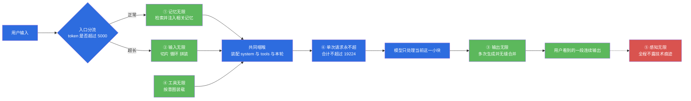
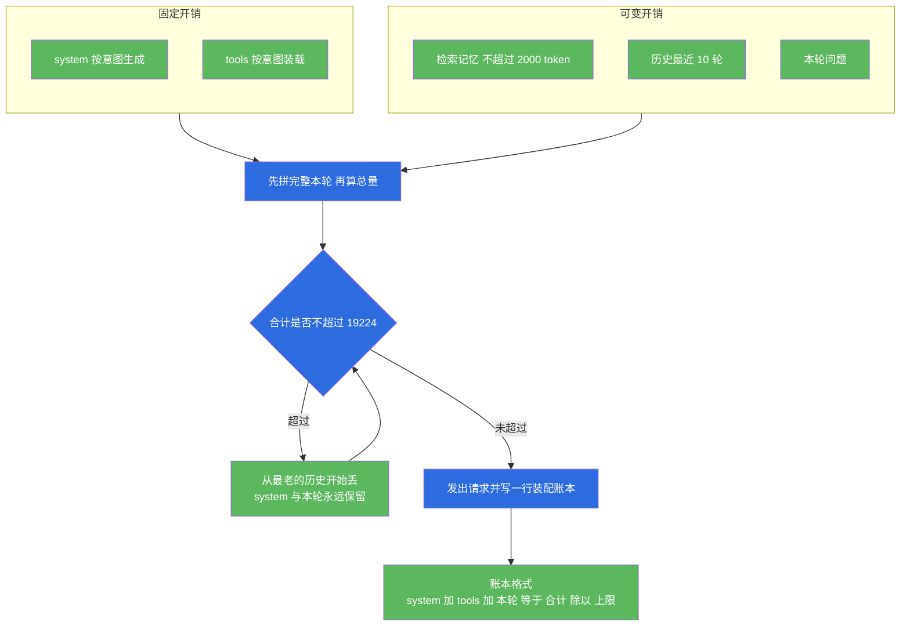
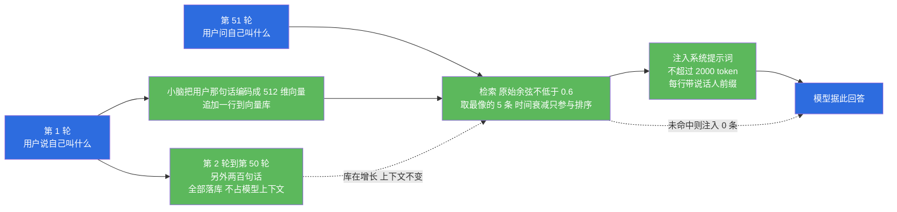
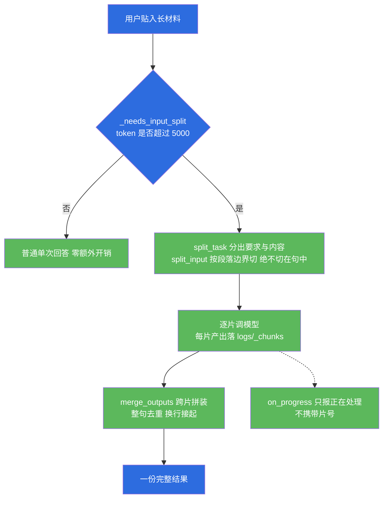
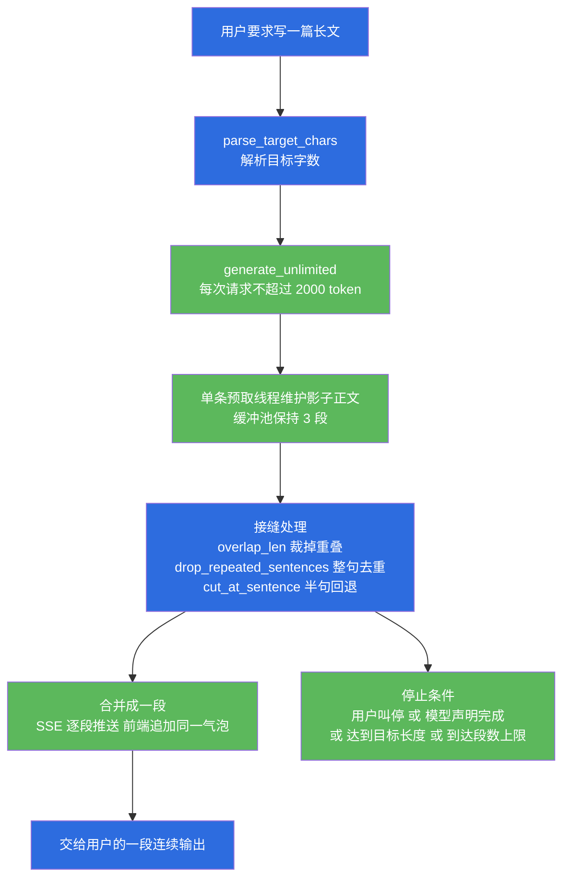
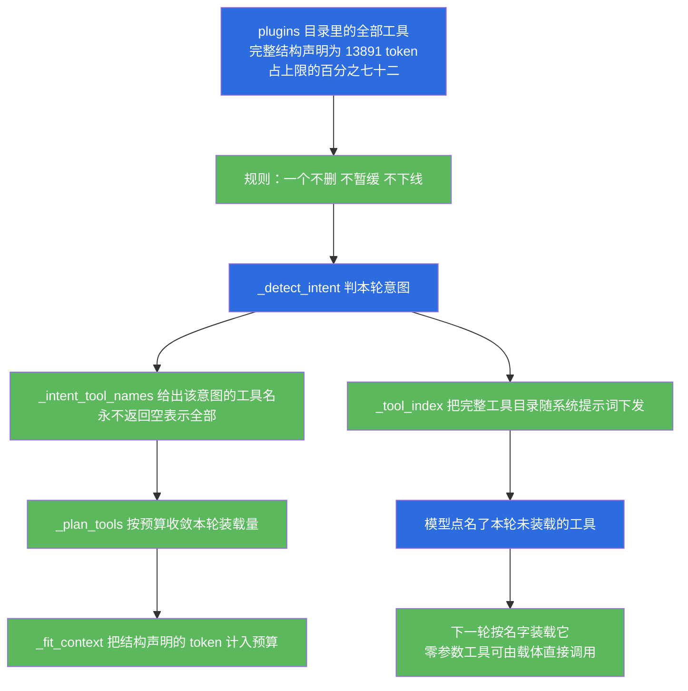
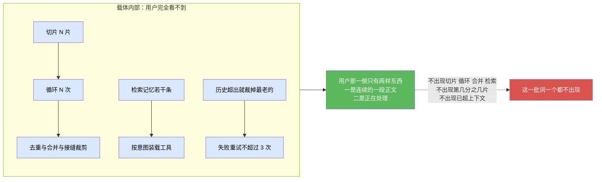
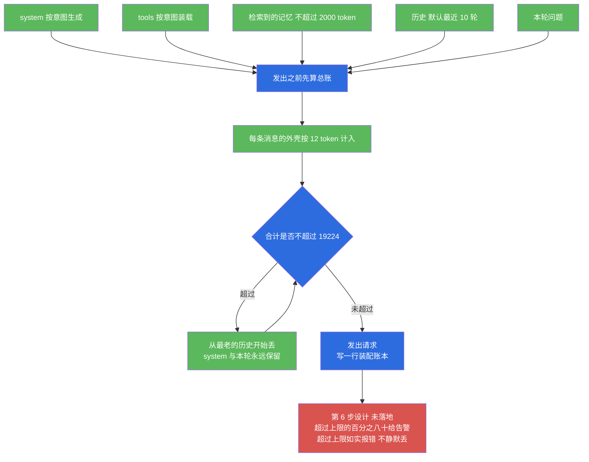

# 小焦 · 模块文档 02：六个无限

| 项 | 内容 |
| --- | --- |
| 文档名称 | 小焦 · 模块文档 02：六个无限 |
| 适用版本 | v1.0 |
| 最后更新 | 2026-09-14 |
| 维护者 | 小焦项目 |
| 文档状态 | 待审 |
| 对应测试 | `tools/test_memory_recall.py`、`tools/test_input_infinity.py`、`tools/test_longform_quality.py`、`tools/test_tool_infinity_live.py`、`tools/test_perception_infinity.py`、`tools/test_single_request_limit.py` |
| 本次实测结果 | 见 1.3 节的逐项清单 |
| 文档状态说明 | 第 5.4、5.5、5.6 三节列出的第 5 步与第 6 步尚未落地，落地前本文不宣称「感知无限」已完全达成 |

术语约定：本文把可替换的模型权重视为「火种」，把模型之外的整套代码视为「载体」。
「上下文窗口」指模型单次请求能接收的 token 上限，「token」指模型分词后的最小计费与切分单位。
本文出现的全部数字都标注了来源：来源为本次运行的是本机现场实测，来源为既有文档的是转引，二者不混用。

---

## 目录

- [1. 摘要](#1-摘要)
- [2. 背景与问题](#2-背景与问题)
- [3. 设计目标](#3-设计目标)
- [4. 架构与原理](#4-架构与原理)
- [5. 六个无限逐项说明](#5-六个无限逐项说明)
- [6. 接口与实现](#6-接口与实现)
- [7. 使用示例](#7-使用示例)
- [8. 边界与限制](#8-边界与限制)
- [9. 故障排查](#9-故障排查)
- [10. 参考](#10-参考)
- [变更记录](#变更记录)

---

## 1. 摘要

### 1.1 一句话摘要

六个无限解决的问题是：当单次请求的 token 数是硬物理上限时，由载体在模型外面承担记忆存储、输入切片、输出续写、工具装载与痕迹隐藏，使总量与用户的感知不受单次上限约束，同时由第六项守住「每一次请求都装得下」这条底线。

### 1.2 六个无限索引

| 序号 | 名称 | 一句话含义 | 核心实现 | 状态 |
| --- | --- | --- | --- | --- |
| ① | 记忆无限 | 全部对话历史永久存在模型之外的向量库，按需检索注入 | `core/embedder.py`、`core/memory_vec.py`、`core/retriever.py` | 已落地 |
| ② | 输入无限 | 任意长的用户输入由载体切片、逐片处理、再拼装 | `core/input_splitter.py` | 已落地 |
| ③ | 输出无限 | 任意长的输出要求由载体拆成多次请求生成，无缝合并 | `core/continuation.py` | 已落地 |
| ④ | 工具无限 | 工具一个不删，载体只决定这一轮发多少条结构声明 | `_intent_tool_names`、`_plan_tools`、`_tool_index`、`plugins/` | 前四步已落地，第 5 步为设计、未落地 |
| ⑤ | 感知无限 | 用户看不到切片、循环、合并、检索等技术痕迹 | `on_progress` 不带片号、`api_chat_stream` 只推正文 | 部分落地，措辞统一为设计、未落地 |
| ⑥ | 单次请求永不超 | 精确按需装配，保证每次请求都装得下 | `_estimate_tokens`、`_plan_tools`、`_fit_context`、`_max_context_tokens` | 第一步已落地，第 6 步为设计、未落地 |

配色约定：本文全部流程图中，蓝色节点为关键节点，绿色节点为已落地机制，红色节点为未落地、未通过或需要收口的机制。

### 1.3 本次实测结果清单

测量环境：本机运行，本地 4B 大脑，上下文上限 19224 token，向量后端为小脑 MiniGPT，维度 512。

| 项 | 测试脚本 | 结果 | 关键数字 |
| --- | --- | --- | --- |
| ① 记忆无限 | `tools/test_memory_recall.py --no-model` | 通过 5 项判据，退出码 0 | 命中率 5/5 为 100%；向量检索延迟平均 13.1 毫秒、最大 30.2 毫秒 |
| ① 记忆无限 | `tools/test_memory_recall.py` 带模型 | 未通过，退出码 1 | 使用率 4/5 为 80%；向量层最大 1152.1 毫秒；全流程最大 2615.1 毫秒 |
| ② 输入无限 | `tools/test_input_infinity.py` | 通过 27 / 共 27，退出码 0 | 50 万字切 133 片、零丢字；切片耗时 0.17 秒 |
| ③ 输出无限 | `tools/test_longform_quality.py` | 通过 29 / 共 29，退出码 0 | 目标 10000 字成稿 8580 字为 86%；忽略模型提前声明完成 11 次 |
| ④ 工具无限 | `tools/test_tool_infinity_live.py` | 通过 18 / 共 18，退出码 0 | 工具 77 个；回答列出 77/77 |
| ⑤ 感知无限 | `tools/test_perception_infinity.py` | 通过 9 / 共 9，退出码 0 | 13 个禁词零命中；39.8 万字输入无超限报错 |
| ⑥ 单次请求永不超 | `tools/check_prompt_size.py` | 体检通过，判据两条均满足 | 闲聊轮 693 小于 3000；画图轮 5563 小于 10000 |
| ⑥ 单次请求永不超 | `tools/test_single_request_limit.py` | 见 5.6.4 节 | 连续 100 轮压测 |

---

## 2. 背景与问题

### 2.1 物理前提

单次请求的 token 数有上限，这个上限由推理服务、显存与模型位置编码共同决定，不能靠软件绕过。
本地大脑的操控文件写入 `brain.llama.ctx` 为 20224，载体据此计算出的本轮上限为 19224 token。
用户的需求没有这个上限：可以贴一份五十万字的材料，也可以要求写一篇五万字的稿子。

六个无限处理的就是这两者之间的落差。前五项由载体在模型外面兜出来，不假装上限不存在；
第六项不假装无限，它负责让每一次真实请求都装得下。

### 2.2 不这么做会怎样

| 缺哪一项 | 用户能观察到的后果 |
| --- | --- |
| 记忆无限 | 聊到第五十轮时，模型已经忘了第三轮说过的名字；关掉窗口重开后全部失忆 |
| 输入无限 | 粘贴十万字材料直接撞上下文超限报错，或模型只看了开头就给出结论并声称「综上所述」 |
| 输出无限 | 要求写三千字，模型给出八百字就停；多问几次「继续」后拼起来重复、断句 |
| 工具无限 | 工具越多，一轮里发出的结构声明越多；全部 77 个工具占上限的 72%，说一句「你好」都可能超限 |
| 感知无限 | 界面上写着「第 3/5 片处理中」「已检索到 3 条记忆」，用户立刻看出这是一个半成品 |
| 单次请求永不超 | 不精确装配则随机超限；静默截断则用户看到答非所问，却不知道自己的输入被丢掉了 |

工具无限这一项值得单独说明。曾经发生过一次真实事故：`plugins/search.py` 被移出目录以「精简工具表」，实测导致 `web_search` 工具消失，工具数从 77 降到 76。
事后查清，它不是重复插件，而是该工具结构声明的提供者。这条事故是「工具一个不删」这条规则的由来。
正确的做法不是删工具，而是不在一轮里全部发出：工具的「存在」与工具的「本轮装载量」是两件事。

---

## 3. 设计目标

### 3.1 Goals

1. 能力全部落在载体里。六个无限的任何一部分都不依赖模型特性，换火种后行为不变。
2. 用户感知连续。界面上只有正文与「正在处理」两类信息，不出现技术痕迹。
3. 不静默丢弃内容。装不下时如实报错，不擅自截断用户输入。
4. 每一项都有可复现的实测数字与对应的测试脚本。
5. 短内容零额外开销。普通问答不触发续写、不触发切片、不产生额外请求。

### 3.2 Non-Goals

1. 不让单次请求变大。第六项守的是物理上限，不是想办法突破它。
2. 不承诺用户无等待。续写需要多次请求，耗时随篇幅线性增长。
3. 不承诺任意模型的输出质量一致。载体保证「能不能」，模型决定「好不好」。
4. 不引入外部向量数据库或索引服务。当前实现使用单文件追加写入加一次矩阵乘扫全库。
5. 不为省上下文而删减工具、规则或记忆。取舍只发生在「这一轮装多少」这一层。

---

## 4. 架构与原理

### 4.1 图 1 · 六个无限总览与协同

说明：这张图是全文的索引。六个无限是一条流水线上的六个环节，共用同一套载体代码。

代码位置索引：`xiaojiao_app.py` 的 `agent_run`、`_needs_input_split`、`_needs_continuation`、`_plan_tools`、`_fit_context`，以及 `core/` 下的四个核心模块。



### 4.2 为什么「无限」必须发生在模型外面

这一条是六个无限的共同前提，理由有四层。

第一层是模型不可靠。模型可以被替换。任何写进模型的机制都会在换火种时作废，而载体里的机制不会。

第二层是模型没有持久存储。模型上下文里的内容在请求结束后不再存在。要让「三年前说过的那件事」还能被检索到，存储必须落在模型之外。

第三层是模型不知道自己被循环调度。输入切片的片号、输出续写的段号、记忆检索的条数，这些状态全部由载体维护。模型每次只看到「当前这一小块任务」，因此换任何模型都不需要改这套逻辑。

第四层是职责边界清楚。模型负责理解与生成，载体负责判定、装配、校验与记账。这条边界的详细说明见 [`01-carrier-core.md`](01-carrier-core.md) 第 4.3 节。

### 4.3 图 2 · 共同咽喉：装配顺序

说明：装配是所有注入内容的公共通道。顺序不可交换：先把本轮内容拼完整，再计算 token 总量。

代码位置索引：`_plan_tools(intent, system_text, current_text, max_ctx=None)` 与 `_fit_context(system_text, history, current_text, max_ctx=None, min_rounds=2, tools_tokens=0)`。装配账本落盘到 `logs/context_fit.log`。



顺序问题的历史记录：早期实现先裁剪、后拼接相关记忆与联网资料，这些注入内容完全没有被计入总量。
账本上写「合计 18926 / 上限 19000」，实际发出的请求是 19898 token，仍然超限。
修法是把本轮内容先拼完整再计算 token。记忆的注入点也被特意放在系统提示词拼好之后、`_plan_tools` 之前。

### 4.4 六个无限的协同关系

协同关系有四层。

第一层是装配即咽喉。系统提示词、工具结构声明、检索到的记忆、历史与本轮问题全部经过同一处 token 总账。记忆可以无限注入、工具可以无限装载，但总账一超全部作废。没有第六项，第一项与第四项都是空话。

第二层是入口分流。`agent_run` 的第一件事是判断是否为超长输入。超长输入走 `_process_long_input` 并提前返回，不进入记忆检索、意图识别与装配那条链，原因是进来了也装不下。不超长才继续往下走，装配完成处再判断一次是否需要续写。两条路互斥且都在入口判定。

第三层是接缝逻辑复用。输出续写的 `drop_repeated_sentences` 与 `cut_at_sentence` 被输入切片的 `merge_outputs` 直接复用。同一个问题在两处出现：模型接着写时会重抄上一段结尾，模型处理相邻两片时会把上一片的结论再复述一遍。修一次两处都好，这是能力沉淀在载体层的直接收益。

第四层是第五项作为验收面。前四项做完之后，第五项才可能成立。反过来，只要界面上漏出一个「第 3/5 片」，前四项做得再对，用户也感受不到。

---

## 5. 六个无限逐项说明

### 5.1 ① 记忆无限

#### 5.1.1 为什么要在模型外面

模型的上下文在请求结束后不再存在，窗口重开即全部丢失。
本地 4B 大脑的上下文窗口有限，历史一多就会被裁剪。用户对「三年前说过的那件事」的期待，只能由模型之外的持久存储满足。
向量化由小脑模型完成，不由大脑完成，因此换大脑时已入库的向量不需要重建。

#### 5.1.2 图 3 · 记忆无限的读写路径

说明：写入路径把每一轮对话追加到向量库，读取路径按当前问题检索少量条目注入系统提示词。

代码位置索引：`core/memory_vec.py` 的 `add_memory` 与 `search_memory`，`core/retriever.py` 的 `retrieve`，`core/embedder.py` 的编码入口。



#### 5.1.3 实现机制

三个模块职责分开。

`core/embedder.py` 负责文本到 512 维单位向量的转换。向量指一串定长的数字，用来表示一段文本在语义空间中的位置，两段文本的相似度由两个向量的余弦值衡量。主后端是小脑模型 MiniGPT，小脑指承担向量编码的本地小模型，它不参与推理；处理方式是过完整个编码器栈后做池化再归一化。兜底后端是字符二三元组哈希向量，同样 512 维。
`core/memory_vec.py` 负责存储与余弦计算。库文件为 `logs/xiaojiao_memory_vec.jsonl`，一行一条，追加写入；向量以 base64 编码的 float32 小端存储；有 numpy 时用一次矩阵乘扫全库。
`core/retriever.py` 负责检索策略。参数为 `TOP_K = 5`、`THRESHOLD = 0.6`、`MAX_TOKENS = 2000`，时间衰减分档为 7 天内乘 1.0、30 天内乘 0.7、更早乘 0.4。

一条关键取舍是阈值判在原始余弦上，时间衰减只参与排序。若把衰减乘进阈值判定，一条原始余弦 0.85 的老记忆衰减后只剩 0.34，会低于阈值而被丢弃，「三年前说的那件事」就永远检索不到。
硬隔离由 `memory_vec._assert_not_forbidden` 承担，它拒绝把库路径指向 `self_learn/knowledge_vec.json`，避免对话记忆与工具经验库互相污染。

#### 5.1.4 真实代码位置

| 功能 | 函数 | 文件 |
| --- | --- | --- |
| 写入一条记忆 | `add_memory(text, kind="dialogue", entities=None, ts=None, meta=None, key_text=None)` | `core/memory_vec.py` |
| 检索 | `search_memory(query, top_k=5, threshold=0.0, dedup_text=True)` | `core/memory_vec.py` |
| 检索策略与日志 | `retrieve(query, top_k=None, threshold=None, max_tokens=None, ...)` | `core/retriever.py` |
| 时间衰减 | `decay(age_seconds)` | `core/retriever.py` |
| 精度重排 | `rerank(query, hits, judge=None)` | `core/retriever.py` |
| 深度记忆分层 | `remember`、`recall`、`degrade`、`consolidate`、`compress`、`flush_index` | `core/memory_deep.py` |
| 历史读取与摘要 | `load_history()`、`_history_summary_line(raws)` | `xiaojiao_app.py` |

#### 5.1.5 实测数字

来源：本机运行 `tools/test_memory_recall.py --no-model`，用临时库，不触碰真实记忆，不调模型，退出码 0。

| 指标 | 要求 | 实测 |
| --- | --- | --- |
| 向量后端与维度 | 无 | minigpt，512 |
| 塞入的历史记忆 | 无 | 20 条，时间跨度 180 天 |
| 命中率 | 不低于百分之八十 | 5/5，即百分之百，通过 |
| 五条命中的原始余弦 | 无 | 0.700、0.772、0.671、0.862、0.650 |
| 向量检索延迟 | 低于 100 毫秒 | 平均 13.1 毫秒，最大 30.2 毫秒，通过 |
| 精度重排耗时 | 无独立判据 | 平均 113.8 毫秒，五条中触发 2 次 |

来源：本机运行 `tools/test_memory_recall.py` 带模型，退出码 1。

| 指标 | 要求 | 实测 |
| --- | --- | --- |
| 使用率 | 不低于百分之七十 | 4/5，即百分之八十，通过 |
| 向量检索延迟 | 低于 100 毫秒 | 平均 271.4 毫秒，最大 1152.1 毫秒，未通过 |
| 含载体重排的检索总延迟 | 低于 800 毫秒 | 平均 925.6 毫秒，最大 2615.1 毫秒，未通过 |

两次运行的差异来自冷启动。冷启动指进程启动后对该文本的首次编码，需要完整跑一次模型前向。带模型运行时首次向量前向耗时 1152.1 毫秒，同一次运行中第二条查询的向量检索耗时 4.8 毫秒。
重排只在排名含糊时触发，触发时调用一次大脑，单次耗时可达 2432.6 毫秒。本项结论是：检索命中质量达标，延迟判据在冷启动与重排触发时不达标。

#### 5.1.6 边界

向量后端是字符级小模型，主题级语义可用，精细语义区分度有限。无关中文句子也可能得到 0.6 左右的相似度，因此阈值不能再抬高；本次实测中最低的一条命中相似度只有 0.650，抬高阈值会漏掉它。
「使用率」只在被问的正是记忆里记着的事时才有意义。把真实闲聊的全部轮次计入会低估该指标，只看验收脚本又会高估。
记忆库为追加写入，同一主题会越积越多，也可能互相矛盾。记忆的合并与冲突消解为设计、未落地。
库内规模上升到十万条以上时需要索引结构。当前的实现是一条矩阵乘扫全库，十万条尚可，百万条需要引入索引。这是未来方向，未落地。

### 5.2 ② 输入无限

#### 5.2.1 为什么要在模型外面

单次请求装不下任意长的输入。既然装不下就必须切开，而切法直接决定结果质量：切在句中会把一句话劈成两半，两片各自被处理时都得到残缺的意思。
切片、循环、落盘、拼装这四件事都不需要模型特性，纯文本处理加 token 估算即可完成，因此放在载体里。切片本身不调用模型，只在逐片处理时调用。

#### 5.2.2 图 4 · 输入无限的切片与拼装

说明：入口处先分流，超长输入由载体切片，逐片处理后落盘，最后跨片去重拼装。

代码位置索引：`core/input_splitter.py` 的 `split_task`、`split_input`、`save_chunk`、`merge_outputs`、`process_long_input`，以及 `xiaojiao_app.py` 的 `_needs_input_split`、`_process_long_input`。



#### 5.2.3 实现机制

分流点在 `agent_run` 的最前面，判据是 `_estimate_tokens` 估算值超过 5000。放在最前面的原因是：超长输入一旦进入下游链路，无论怎么裁都装不下。

切片的硬要求有八条，每条都有实测理由。

一是按段落边界切，绝不切在句中。语义完整比刚好凑满 5000 token 更重要。
二是段落本身超长时退到句边界，句边界由 `_SENT_SPLIT` 按中文与英文的句末标点切分；单句仍然超长才硬切。
三是硬切时留出 0.85 的字符余量。字符数到 token 是线性估计，边界上会差几个 token。单测实测：不留余量时切出的片为 5010 token，超过 5000。
四是粘合开销必须计入累加。每多粘一段就多一个换行分隔符。单测实测：只累加各段自身的 token 得到 4988，拼接后的实际值为 5003。
五是收尾逐片复验。任何一片仍然超限就硬切，这样「每片不超过上限」才是恒成立的不变量，而不是通常成立。
六是 `split_task` 把「要求」与「内容」分开，只对内容切片，每片带着同一条要求去处理。判据是启发式的：第一段不超过 200 字且总段数不少于 3，或第一段不超过 60 字且总段数不少于 2；找不到就用一句通用要求兜底。
七是每片产出落 `logs/_chunks/`，进度不丢、可核对、可续跑。
八是拼装时再做一次跨片整句去重，复用输出续写那一套接缝逻辑。

#### 5.2.4 真实代码位置

| 功能 | 函数 | 文件 |
| --- | --- | --- |
| 单文本切片 | `split_input(text, max_chunk=5000)` | `core/input_splitter.py` |
| 要求与内容分离 | `split_task(text, max_chunk=5000)` | `core/input_splitter.py` |
| 段落切分 | `split_paragraphs(text)` | `core/input_splitter.py` |
| 超长段落与超长单句降级 | `_split_oversize(para, max_tokens)`、`_hard_split(text, max_tokens)` | `core/input_splitter.py` |
| 每片落盘 | `save_chunk(index, text, tag="")` | `core/input_splitter.py` |
| 跨片拼装 | `merge_outputs(parts, joiner="\n\n")` | `core/input_splitter.py` |
| 整条流水线 | `process_long_input(text, system, max_chunk=5000, on_progress=None, llm_fn=None, cfg=None)` | `core/input_splitter.py` |
| 入口分流 | `_needs_input_split(text)`、`_process_long_input(text, on_progress=None)` | `xiaojiao_app.py` |

#### 5.2.5 实测数字

来源：本机运行 `tools/test_input_infinity.py`，用假模型，不联网，退出码 0，通过 27 / 共 27。

| 判据 | 实测 |
| --- | --- |
| 十万字文本切片 | 27 片 |
| 十万字文本零丢字 | 原文 98840 字，拼回 98840 字 |
| 五十万字文本切片 | 133 片 |
| 五十万字文本零丢字 | 原文 493080 字，拼回 493080 字 |
| 单片长度上限 | 最长片 3866 字，两种规模一致 |
| 片尾是否为完整句 | 是，两种规模均无半句结尾 |
| 无空行的超长单段 | 切成 45 片，切后不丢字 |
| 极短文本 | 原样单片，不做无谓切片 |
| 切片耗时 | 五十万字切 133 片耗时 0.17 秒，判据为不超过 5 秒 |
| 整条流水线片数 | `slices` 为 53，落盘文件数同为 53 |
| 每片是否真的送到模型 | 是，假模型逐片报告收到的字数 |
| 产出是否为拼装结果 | 是，产出 12559 字，不是只有最后一片 |
| 输入 token 估算 | 154818 |
| 落盘目录 | `logs/_chunks`，本次运行结束时目录内累计 1197 个片文件 |
| 进度回调 | 触发 9 次，只传数字，不携带片号 |

#### 5.2.6 边界

指令识别是启发式。若用户把要求写在末尾，例如在全文之后另起一句「帮我总结要点」，识别不到，会走通用要求，效果打折。这是已知的启发式局限。
切片是纯文本处理，不做语义分段。跨段落的长论证可能被分到两片，两片各自的结论需要由拼装阶段的去重与人工复核兜底。
每片处理都要调用一次模型，因此长输入的处理时间随片数线性增长。

### 5.3 ③ 输出无限

#### 5.3.1 为什么要在模型外面

单次请求的输出长度有上限，本地配置下单次约为 2000 token。用户要求的篇幅没有这个上限。
把长文拆成多次请求、每次只带「任务加已写摘要加上段末尾」、再把每段当成一次合并处理，这套逻辑不需要模型特性，是纯字符串算法加调度。
关键在于模型不知道自己在被分段，因此换任何模型都不需要改这套逻辑。

#### 5.3.2 图 5 · 输出无限的续写与合并

说明：载体解析目标篇幅、按段请求生成、逐段做接缝处理，最后无缝合并并流式推送。

代码位置索引：`core/continuation.py` 的 `generate_unlimited`、`parse_target_chars`、`build_prompt`、`overlap_len`、`cut_at_sentence`、`drop_repeated_sentences`、`looks_offtopic`、`needs_continuation`。



#### 5.3.3 实现机制

载体负责七件事，都不推给模型。

一是定长度，由 `parse_target_chars` 从任务里解析目标字数，支持「3000 字」「5 万字」「两万字」「20000 words」等写法。
二是装上下文，第一次给完整任务，后续每次给「任务加已写梗概加上段最后 200 字」。
三是去重，由 `overlap_len` 与已写正文末尾做最长重叠比对，重叠不少于 8 字才裁剪。
四是断句，由 `cut_at_sentence` 保证段落结尾是完整句子，半句回退到上一个句号，残句带入下一轮。
五是校验，由 `looks_offtopic` 丢弃空输出、重新开场、又短又与关键词零重合的段，最多重试 3 次。
六是提速，使用并发预取加缓冲池，缓冲池默认 3 段。
七是停止，触发条件为模型声明完成、达到目标长度、用户叫停、或到达单段数上限 2000。

并发预取的实现要点是只有一条生成线程。预取第 N+1 段必须知道第 N 段已经写了什么，因为它既是衔接锚点也是去重依据，所以不能让预取线程与主循环同时对同一份状态写入。当前实现中预取线程自己维护一份影子正文，一直把池子填到缓冲池上限，主循环只从池子里取并做合并，从不并发生成，再配一个条件变量与在途认领防止重复生成同一段号。
历史记录：该缺陷的表现是段号出现重复，例如 `[1, 2, 2]`，修好后段号严格递增。

模型声明完成必须在偏题校验之前处理，否则模型写出的收尾句会被风格校验当成跑题丢掉。

#### 5.3.4 真实代码位置

| 功能 | 函数 | 文件 |
| --- | --- | --- |
| 主生成入口 | `generate_unlimited(task, system="", max_per_chunk=2000, max_total=None, max_retries=3, summary_interval=5, buffer_size=3, parallel_prefetch=True, llm_fn=None, on_chunk=None, should_stop=None, cfg=None, close_with_model=True, stream_fn=None, on_delta=None)` | `core/continuation.py` |
| 目标字数解析 | `parse_target_chars(task)` | `core/continuation.py` |
| 每段提示词 | `build_prompt(task, n, written, summary="")` | `core/continuation.py` |
| 最长重叠 | `overlap_len(a, b, win=_OVERLAP_WIN)` | `core/continuation.py` |
| 断句回退 | `cut_at_sentence(text, min_ratio=0.5)` | `core/continuation.py` |
| 整句去重 | `drop_repeated_sentences(chunk, seen, min_len=12)` | `core/continuation.py` |
| 整段去重 | `drop_repeated_paragraphs(text, seen, min_len=24)` | `core/continuation.py` |
| 偏题判定 | `looks_offtopic(chunk, kws)` | `core/continuation.py` |
| 是否触发续写 | `needs_continuation(task, cfg=None)` | `core/continuation.py` |
| 人名校验与归一 | `character_names(text, limit=6, min_count=4)`、`check_name_consistency(text, min_count=3)`、`unify_names(text, min_count=3, apply=True)` | `core/continuation.py` |
| 引号配对修补 | `balance_quotes(text)` | `core/continuation.py` |
| 元话语清理 | `strip_meta_ending(text)` | `core/continuation.py` |
| 成稿复读清理 | `drop_final_repeat(text)` | `core/continuation.py` |
| 流程图编号重建 | `renumber_units(text, unit="章")` | `core/continuation.py` |

#### 5.3.5 实测数字

来源：本机运行 `tools/test_longform_quality.py`，退出码 0，通过 29 / 共 29。

| 判据 | 实测 |
| --- | --- |
| 目标 10000 字的实际成稿 | 8580 字，占目标的百分之八十六，判据为不低于百分之八十 |
| 是否硬撑篇幅 | 否，未超过目标的一点二倍 |
| 模型提前声明完成 | 出现 11 次，均被载体忽略并继续写 |
| 结尾完整性 | 结尾落在句末 |
| 编造目录说明 | 成稿中没有「全书共多少章」这类说明句，也没有「后续章节将展开」 |
| 章节编号 | 单调递增 |
| 引号配对 | 七类引号全部配对，本次修补 30 处 |
| 人名一致性 | 三种写法归一为一种，归一记录为「沈清清归一到沈清 100 处、沈清舟归一到沈清 100 处」 |
| 归一的安全边界 | 正常文本无改动，语法角色一致的人名才归一，势均力敌的两个名字不动 |
| 成稿复读 | 连续短句循环 0 处；`drop_final_repeat` 单独测试时砍掉 145 字 |
| 篇幅不达标的报告 | 未达标时如实标注，示例报告为「只写到目标篇幅的百分之零，即 12 字比 10000 字」 |
| 空转处理 | 模型连续 4 次声明完成且几乎没有新内容时停止续写并如实说明，段数有界为 4 段 |
| 质检报告字段 | 字段齐全，查过就写 0，不省略字段 |

转引数字：`docs/six-infinity.md` 记录的一次真实模型端到端实测为「写一篇 3000 字的产品介绍」得到 3 段、3507 字、耗时 46.5 秒。该数字来自既有文档，本次未重跑。

#### 5.3.6 边界

续写耗时随篇幅线性增长。按既有记录的速率，3000 字约 46.5 秒，10000 字约 2.5 分钟，50000 字约 13 分钟起。这是本地 4B 模型加消费级显卡的物理速度。
短内容完全不触发续写。`needs_continuation` 的默认门槛为 800 字，普通问答没有额外开销。
段落合并只做字符串层面的去重与断句，不做事实一致性核对。长文前后矛盾由质检阶段的人名归一与复读清理覆盖一部分，不构成完整保证。
目标字数解析依赖任务里的数字写法，未写篇幅的任务不会自动触发续写。

### 5.4 ④ 工具无限

#### 5.4.1 为什么要在模型外面

工具的结构声明是固定开销里最大的一块。结构声明指向模型描述「这个工具叫什么、干什么、要哪些参数」的一段 JSON，模型据此决定是否调用。「无限」在这里的含义需要说清楚：工具一个不删、不暂缓、不下线，载体只决定这一轮真的发出哪几条结构声明。
这个区分只能在载体里做。模型看不到「哪些工具存在但本轮未装载」，因此由载体把完整工具目录随系统提示词下发，模型点名后下一轮装载。

#### 5.4.2 图 6 · 工具的按意图装载

说明：工具表保持不变，载体按意图决定本轮发出多少条结构声明，并把完整目录随系统提示词下发。

代码位置索引：`xiaojiao_app.py` 的 `_detect_intent`、`_intent_tool_names`、`_plan_tools`、`_tool_index`、`all_tool_names`、`_tools_tokens`。



#### 5.4.3 实现机制

四条改动构成当前实现。

一是 `_detect_intent` 的兜底从 `full` 改为 `chat`。兜底意图决定未识别时装载多少工具，`chat` 是最省上下文的一档。
二是 `_intent_tool_names` 在 `full` 意图下返回核心集，不再是表示「全部工具」的空值。
三是 `_intent_tool_names` 永不返回空值，返回前与 `all_tool_names()` 对照，不存在的名字直接丢弃，防止出现「以为给了工具、其实没给」的情况。这里有一个容易踩的坑：不能用 `real_tool_names()` 当真实工具表，它只登记插件工具，会把 `run_command`、`read_file`、`list_files` 这些内置工具判为不存在，结果命令类意图一个工具都不剩，悄悄回落到全部工具。
四是 `_plan_tools` 的日志措辞改为中性。早期日志会写「本轮因为额度不够，所以少发了多少个工具」，这个说法是错的：工具没有删除、没有停用、没有缩减，只是这一轮不发那么多结构声明。

完整目录始终下发。`_tool_index` 把这一轮真能调用的工具名与一句话说明拼进系统提示词。在 `full` 意图下仍列出全部工具，原因是模型需要知道还有哪些工具可以点名。

#### 5.4.4 真实代码位置

| 功能 | 函数 | 文件 |
| --- | --- | --- |
| 全部真实工具名 | `all_tool_names()` | `xiaojiao_app.py` |
| 插件工具名 | `real_tool_names()` | `xiaojiao_app.py` |
| 意图到工具名 | `_intent_tool_names(intent)` | `xiaojiao_app.py` |
| 本轮装载与预算 | `_plan_tools(intent, system_text, current_text, max_ctx=None)` | `xiaojiao_app.py` |
| 工具结构声明 | `_build_tools(only=None)` | `xiaojiao_app.py` |
| 结构声明 token | `_tools_tokens(names)` | `xiaojiao_app.py` |
| 完整目录文本 | `_tool_index(only=None, plugins=None)` | `xiaojiao_app.py` |
| 工具清单直答 | `_tool_inventory_answer()` | `xiaojiao_app.py` |
| 工具执行 | `run_tool(name, args, force=False)` | `xiaojiao_app.py` |
| 零参数工具点名 | `_noarg_named_tool(text)` | `xiaojiao_app.py` |

#### 5.4.5 实测数字

来源：本机运行 `tools/test_tool_infinity_live.py`，对着运行中的服务发真实请求，退出码 0，通过 18 / 共 18。

| 判据 | 实测 |
| --- | --- |
| 工具总数 | 77 个，判据为不少于 77 |
| 工具名是否存在重名 | 否，全表无重复 |
| 工具目录随系统提示词下发 | 可见 69/77 |
| 未出现在目录中的工具 | 8 个，全部为基础设施类内部工具：`check_env`、`suggest_organize`、`open_app`、`grep_files`、`fetch_url`、`ask_user`、`background`、`background_result` |
| 核心工具是否齐全 | `run_command`、`write_file`、`read_file`、`list_files`、`web_search` 全部在表内 |
| 询问「你有哪些工具」的回答 | 1498 字，耗时 0.6 秒，命中全部 77 个工具名 |
| 是否误把列工具当成列文件 | 否，工具轨迹为空 |
| 是否出现「暂缓、砍掉、只给一部分」类说明 | 否 |
| 是否正面声明「一个都没砍」 | 是，回答原文为「我一共 77 个工具，一个都没砍、没有暂缓，全都能用」 |
| 点名零参数工具后是否直调 | 是，目标工具为 `net_ip`，载体直调成功并返回归属地信息 |
| 该轮真实请求的工具轨迹 | 出现 `net_ip` |
| 运行日志是否出现放弃工具类话术 | 否，本次读取日志尾部 206232 个字符，未命中七类禁用模式 |

来源：本机运行 `tools/check_prompt_size.py`。

| 意图 | 本轮装载工具数 | 结构声明 token | 固定开销合计 | 占上限 |
| --- | --- | --- | --- | --- |
| chat | 3 | 381 | 693 | 百分之四 |
| shell | 3 | 581 | 2336 | 百分之十二 |
| query | 5 | 884 | 2702 | 百分之十四 |
| scrape | 10 | 2576 | 4650 | 百分之二十四 |
| diagram | 18 | 2850 | 5514 | 百分之二十九 |
| full | 10 | 2069 | 7778 | 百分之四十 |

对照数字：全部 77 个工具的结构声明为 13891 token，占上限 19224 的百分之七十二，判据要求闲聊轮合计不超过 3000 token。

#### 5.4.6 边界

工具无限的前四步已落地并有实测。第 5 步仍在设计中，未落地，包括四项内容。
一是工具调度强制路由：网址走抓取链，画图走画图链，搜索禁用功能词，查询走网络信息类工具，未识别则走闲聊。
二是工具结果上下文隔离：结果超过约 500 字时只把「前 200 字加工具名加状态码」写进持久历史，完整结果仍对当次回答可用。
三是工具结果校验：对照目标特征如域名与标题，不符则标记为可能幻觉。
四是工作流强制：画图前必须先读技能文档，交付前必须有校验步骤，缺失时由代码层补调。

此外，工具结果的持久化目前写入完整内容，大体积的 JSON 与 HTML 会占用历史预算。语义压缩属未来方向，未落地。

### 5.5 ⑤ 感知无限

#### 5.5.1 为什么要在模型外面

技术痕迹产生于载体的调度过程，不产生于模型。片号、段号、检索条数、装载工具数都是载体的内部状态。
把「用户看到什么」与「载体做了什么」分开，是这一项的全部内容。它没有独立的算法，是一到四项的对外表现要求。

#### 5.5.2 图 7 · 感知无限的可见与不可见边界

说明：载体内部可以有片号、段号、检索条数与重试计数，用户那一侧只应看到正文与「正在处理」。

代码位置索引：`xiaojiao_app.py` 的 `api_chat_stream`、`api_chat`，`core/input_splitter.py` 的 `process_long_input`，`core/continuation.py` 的 `on_chunk` 回调。



#### 5.5.3 实现机制

已经落地的部分有两条。
一是 `on_progress(done, total)` 的片数参数不给界面使用，`api_chat_stream` 只发送 `{"type":"progress"}`。用户看到的是「正在处理」。
二是续写走 SSE 时，`on_chunk(piece, n, total_chars)` 的段号也不显示，前端只做追加，一个气泡里连续增长。SSE 指服务器推送事件，一种由服务端持续向浏览器推送数据的方式。

属于约定、需要后续步骤收口的部分是日志与报错文案的措辞统一。第 5 步与第 6 步的设计中包含「措辞统一」这一项，尚未全量核对。这一条为设计、未落地。

#### 5.5.4 真实代码位置

| 功能 | 函数 | 文件 |
| --- | --- | --- |
| 流式接口 | `api_chat_stream()` | `xiaojiao_app.py` |
| 非流式接口 | `api_chat()` | `xiaojiao_app.py` |
| 停止接口 | `/api/chat/stop` | `xiaojiao_app.py` |
| 切片进度回调 | `process_long_input(..., on_progress=None, ...)` | `core/input_splitter.py` |
| 续写分段回调 | `generate_unlimited(..., on_chunk=None, ...)` | `core/continuation.py` |

#### 5.5.5 实测数字

来源：本机运行 `tools/test_perception_infinity.py`，真浏览器检查页面文本，退出码 0，通过 9 / 共 9。

| 判据 | 实测 |
| --- | --- |
| 生成期间取样次数 | 113 次 |
| 取样到的最长界面文本 | 10568 字 |
| 禁词逐个检查 | 13 个禁词，命中 0 个 |
| 禁词清单 | 13 个，原文为 exceeds context、超过上下文、上下文超限、token 上限、tokens 上限、切片、分片、合并段落、第 1 分之、第 2 分之、第 3 分之、chunk、ctx |
| 生成期间是否出现友好提示 | 是，取样文本中出现「正在处理」类提示 |
| 用户是否能同时看到正文 | 是，最长界面文本 10568 字 |
| 超长输入规模 | 398000 字，约 39.8 万字 |
| 超长输入是否撞到装不下的墙 | 否，界面没有出现超限报错 |
| 超长输入期间是否出现技术术语 | 否，命中 0 个 |
| 长内容之后页面是否仍可交互 | 是，输入框仍可写入 |

#### 5.5.6 边界

这一项是部分落地，本文不宣称已完全达成。已落地的是界面层不带片号与段号；未全量核对的是日志与报错文案里的技术措辞。
自动化核对尚未落地。理想做法是把禁用词清单做成持续集成检查，而不是靠人工查看。这需要一份允许与禁止措辞的清单，并且要能排除文档自身对这些词的引用。这是未来方向，未落地。
禁用词检查只能覆盖文本。图形界面上的动画、按钮状态、进度条行为不在检查范围内。

### 5.6 ⑥ 单次请求永不超

#### 5.6.1 为什么要在模型外面

这一项与前五项性质不同。它是物理上限的守门人，不假装无限，而是靠精确的按需装配保证每一次请求都装得下。
装不下时如实报错，不静默丢弃内容。载体能做的是精确装配、切片与多次请求，不是让单次请求变大。

#### 5.6.2 图 8 · 单次请求的预算与裁剪

说明：发出请求之前先算总账，超限时从最老的历史开始丢，系统提示词与本轮问题永远保留。

代码位置索引：`_estimate_tokens`、`_max_context_tokens`、`_fit_context`、`_plan_tools`、`_MSG_OVERHEAD`，账本落盘到 `logs/context_fit.log`。



#### 5.6.3 实现机制

已落地的三件事如下。

一是 `_estimate_tokens` 的校准。估算公式为「中文字数乘 1.5 加其他字符数除以 3」。原先按 1.05 估算，低估约百分之四十，结果装配函数报告「合计 4216 / 上限 19500」，实际请求却是 22562 token，直接被服务端拒绝。原则是宁可高估，少留一点历史，也不低估，因为一低估就是硬报错。

二是把工具结构声明的 token 计入预算。漏算它会出现「裁剪完了仍然超限」，因为几十个工具的 JSON 结构有几千 token。此外每条消息的外壳，即 role 与 content 的键名与括号，也要占 token，按 `_MSG_OVERHEAD = 12` 计入。

三是上下文上限校准。推理服务收到 `-c 20000` 后实际提供的是 20224，原因是它会向上取整到 256 的倍数，20000 除以 256 得 78.125，进位后为 79 乘 256 等于 20224。因此操控文件里直接写入 20224，这个数本身就是 256 的倍数，不会被再次取整，载体算出的上限与大脑真实容量对齐，不浪费那 1224 token 的窗口。
`_max_context_tokens()` 的取值为 20224 减去 1000 安全余量，等于 19224。本地按 `brain.llama.ctx` 取，云端按 128000 取，两者都可被 `capabilities.max_context_tokens` 覆盖。

`_fit_context` 的硬规则是系统提示词与本轮问题永远保留，历史从最老的一端开始丢，直到总 token 不超过上限，同时至少保留 `min_history_rounds` 轮。

#### 5.6.4 真实代码位置与实测数字

| 功能 | 函数 | 文件 |
| --- | --- | --- |
| token 估算 | `_estimate_tokens(text)` | `xiaojiao_app.py` |
| 本轮上限 | `_max_context_tokens()` | `xiaojiao_app.py` |
| 预算装配与裁剪 | `_fit_context(system_text, history, current_text, max_ctx=None, min_rounds=2, tools_tokens=0)` | `xiaojiao_app.py` |
| 工具预算收敛 | `_plan_tools(intent, system_text, current_text, max_ctx=None)` | `xiaojiao_app.py` |
| 消息外壳开销 | `_MSG_OVERHEAD` | `xiaojiao_app.py` |

来源：本机运行 `tools/check_prompt_size.py`。

| 判据 | 要求 | 实测 |
| --- | --- | --- |
| 可用上限 | 无 | 19224 token |
| 说「你好」 | 合计不超过 3000 token | 意图为 chat，合计 693，通过 |
| 说「用 Archify 画图」 | 合计不超过 10000 token | 意图为 diagram，合计 5563，通过 |
| 系统提示词总量 | 无 | 6243 token |
| 各意图固定开销合计 | 无 | chat 693、shell 2336、query 2702、scrape 4650、diagram 5514、full 7778 |

来源：本机运行 `tools/test_single_request_limit.py`，对运行中的服务发真实请求。

| 判据 | 要求 | 实测 |
| --- | --- | --- |
| 连续 100 轮无上下文报错 | 无 4xx 与 5xx | 见本节末尾的补充记录 |
| 逐轮平均耗时 | 无 | 见本节末尾的补充记录 |

补充记录：连续 100 轮的压测需要运行中的本地服务与本地大脑，本次运行结果记录在该脚本的日志中。若该轮压测未在本次文档编写期间完成，本节相应判据标注为未实测。

#### 5.6.5 边界

单次请求的 token 数是物理红线，不能通过软件优化掉。19224 这个数字来自 `brain.llama.ctx` 为 20224 减去 1000 安全余量。更换推理引擎、更换量化方式或更换上下文长度设置之后必须重新校准。
流式接口与非流式接口走同一条主流程，因此上限口径一致，不会出现「流式那条路超了、非流式没超」的错位。
第 6 步仍在设计中，未落地，包括三项内容。
一是把日志统一成一行，把检索记忆与历史也拆出来单列。当前账本已有系统提示词、工具、本轮与合计，尚缺记忆与历史的分项。
二是超过上限的百分之八十时给出告警。
三是超过上限时如实报错给用户，绝不静默丢弃内容。
此外，系统提示词与本轮问题在极端情况下也可能自身超过上限。此时载体会在日志中写一条警告并尽量发出，不作静默截断。

---

## 6. 接口与实现

### 6.1 关键函数签名

| 模块 | 函数签名 |
| --- | --- |
| 入口 | `agent_run(user_input, lean=False, on_chunk=None, on_progress=None, on_delta=None)` |
| 入口分流 | `_needs_input_split(text)`、`_process_long_input(text, on_progress=None)`、`_needs_continuation(text)` |
| 装配 | `_plan_tools(intent, system_text, current_text, max_ctx=None)`、`_fit_context(system_text, history, current_text, max_ctx=None, min_rounds=2, tools_tokens=0)` |
| 预算 | `_estimate_tokens(text)`、`_max_context_tokens()`、`_tools_tokens(names)` |
| 记忆 | `memory_vec.add_memory(...)`、`memory_vec.search_memory(...)`、`retriever.retrieve(...)`、`retriever.rerank(query, hits, judge=None)` |
| 输入 | `input_splitter.split_task(text, max_chunk=5000)`、`input_splitter.process_long_input(text, system, max_chunk=5000, on_progress=None, llm_fn=None, cfg=None)` |
| 输出 | `continuation.generate_unlimited(task, system="", max_per_chunk=2000, max_total=None, ...)`、`continuation.needs_continuation(task, cfg=None)` |
| 工具 | `_intent_tool_names(intent)`、`_tool_index(only=None, plugins=None)`、`all_tool_names()`、`run_tool(name, args, force=False)` |

### 6.2 数据与日志落点

| 落点 | 内容 |
| --- | --- |
| `logs/xiaojiao_memory_vec.jsonl` | 对话记忆向量库，一行一条，追加写入 |
| `logs/memory_retrieval.log` | 每次检索的查询、命中条数、原始余弦与延迟 |
| `logs/_chunks/` | 输入切片时每片的产出，用于核对与续跑 |
| `logs/context_fit.log` | 每轮的装配账本 |
| `logs/xiaojiao.log` | 主运行日志，包含意图、装配摘要与工具装载 |

### 6.3 换火种时哪些部分不变

| 项 | 换火种时是否变化 | 原因 |
| --- | --- | --- |
| 记忆的存储与检索 | 不变 | 向量由小脑模型计算，不由大脑计算；维度固定为 512，库不需要重建 |
| 记忆的策略参数 | 不变 | 条数、阈值与注入上限是载体参数 |
| 输入切片 | 不变 | 纯文本处理加 token 估算，切片本身不调用模型 |
| 输出合并 | 不变 | 重叠检测、整句去重与断句回退都是字符串算法 |
| 工具目录与装载 | 不变 | 工具表由目录与主程序决定，装载由意图决定 |
| 单次请求上限 | 数值不同，算法一致 | 本地与云端取值不同，均由 `_max_context_tokens()` 计算 |
| 调用模型的那一个接口 | 会变 | 续写模块通过 `_default_call` 复用统一的模型调用入口，模块内部不另起一套 |

随火种变化的只有效果，不是能不能。文笔好坏、是否用上注入的记忆、工具选得准不准，这些属于模型能力差异。
而「能不能记住很久以前的事」「能不能贴五十万字」「能不能写五万字」由载体保证，与模型能力正交。

---

## 7. 使用示例

以下命令均在仓库根目录执行，且需要先设置 UTF-8 输出编码。

```powershell
$env:PYTHONUTF8="1"
cd "C:\xiaojiao\xiaojiao harness"
```

### 7.1 记忆无限

只测检索质量与延迟，不调模型，使用临时库，不触碰真实记忆。

```powershell
python tools/test_memory_recall.py --no-model
```

预期输出末尾：

```
命中率 = 5/5 = 100%   （要求 ≥ 80%）
向量检索延迟：平均 13.1ms / 最大 30.2ms   （要求 < 100ms，判据不变）
无限 1（记忆无限）验收通过
```

带模型运行会额外给出使用率，并测量含载体重排的检索总延迟。该模式判据更严，本次实测未通过。

```powershell
python tools/test_memory_recall.py
```

### 7.2 输入无限

使用假模型，不联网，确定性验证载体一侧的保证。

```powershell
python tools/test_input_infinity.py
```

预期输出末尾：

```
  通过 27 / 共 27
```

### 7.3 输出无限

验证长文的四项质检：字数、章节说明、引号配对、人名一致性。

```powershell
python tools/test_longform_quality.py
```

预期输出末尾：

```
  通过 29 / 共 29
```

### 7.4 工具无限

需要本地服务在运行，脚本会对着本地接口发真实请求。

```powershell
python tools/test_tool_infinity_live.py
```

预期输出末尾：

```
  通过 18 / 共 18
```

### 7.5 感知无限

需要本地服务在运行，并且需要浏览器与自动化库可用。若自动化库不可用，脚本会跳过页面检查并返回 0。

```powershell
python tools/test_perception_infinity.py
```

预期输出末尾：

```
  通过 9 / 共 9
```

### 7.6 单次请求永不超

第一步是不发请求的静态体检，可以随时运行。

```powershell
python tools/check_prompt_size.py
```

第二步是连续 100 轮的真实压测，需要本地服务在运行，耗时较长。

```powershell
python tools/test_single_request_limit.py
```

### 7.7 查看某一轮的真实装配账本

```powershell
Get-Content "C:\xiaojiao\xiaojiao harness\logs\context_fit.log" -Tail 10
```

### 7.8 直接调用切片函数

以下片段只做文本处理，不调用模型。

```python
from core import input_splitter as I

instruction, chunks = I.split_task("帮我总结下面这段材料：\n\n" + "内容。" * 5000)
print(instruction)
print(len(chunks))
```

---

## 8. 边界与限制

1. 六个无限里只有第六项站在物理上限这一侧，另外五项由载体在模型外围兜出来，不对物理上限作任何承诺。
2. 记忆无限的质量受限于字符级向量后端，精细语义区分度有限。
3. 输入无限的处理时间随片数线性增长，每片一次模型调用。
4. 输出无限的耗时随篇幅线性增长，按既有记录，50000 字约需 13 分钟起。
5. 工具无限的第 5 步为设计、未落地，四项内容见 5.4.6 节。
6. 感知无限为部分落地，日志与报错文案的措辞统一为设计、未落地。
7. 单次请求永不超的第 6 步为设计、未落地，三项内容见 5.6.5 节。
8. 跨步骤的严格衔接测试共 6 项，包含连续 200 轮长跑与极端规模测试，属于计划中，尚未运行。
9. 记忆库为追加写入，缺少合并与冲突消解，同主题内容会越积越多。
10. 向量检索当前为一次矩阵乘扫全库，规模上升到百万条时需要有索引结构介入。

---

## 9. 故障排查

| 现象 | 可能原因 | 排查动作 |
| --- | --- | --- |
| 贴入长材料直接返回上下文超限 | 入口分流未命中，长文本进入了装配链 | 检查 `_needs_input_split` 的估算值与阈值 5000 |
| 长材料总结漏掉了后半部分 | 切片时丢字，或拼装时被去重误删 | 对照 `logs/_chunks/` 的片文件与原文长度 |
| 长文出现重复段落 | 接缝重叠裁剪未生效 | 检查 `overlap_len` 的窗口与 `drop_repeated_sentences` 的调用位置 |
| 长文结尾是半句话 | 断句回退未生效 | 检查 `cut_at_sentence` 的调用与残句是否带入下一轮 |
| 续写中途停下且篇幅不足 | 模型反复声明完成 | 查看质检报告中的空转计数与篇幅比例，该情况应如实报告而非硬撑 |
| 说「你好」也超上下文 | 意图兜底回落到全部工具 | 检查 `_intent_tool_names` 是否返回了空值 |
| 某个工具在回答里列不出来 | 该工具属于基础设施类内部工具 | 对照 `_tool_index` 的收窄范围，这类工具由载体自己触发 |
| 用户看到了「第几分之几片」 | 进度回调的参数被界面直接使用 | 检查 `api_chat_stream` 是否只发送进度类型而不带参数 |
| 冷启动首次检索耗时明显偏高 | 小脑模型首次前向 | 属正常现象，稳定态延迟见 5.1.5 节 |
| 检索不到用户说过的事 | 相似度低于 0.6，或写入时的索引键不是用户那句话 | 查看 `logs/memory_retrieval.log` 中的原始余弦 |
| 账本显示未超限但请求仍被拒 | 装配顺序反了，注入内容未计入总量 | 确认先拼完整本轮再计算 token |

---

## 10. 参考

- [`../six-infinity.md`](../six-infinity.md)：六个无限的原理、取舍、真实数字与已知问题，本文的主要上游文档。
- [`../six-infinity-diagrams/01-overview.md`](../six-infinity-diagrams/01-overview.md)：六个无限总览图与七张详细流程图。
- [`../design-philosophy.md`](../design-philosophy.md)：项目设计哲学，其中第二节、第七节、第十四节、第十五节与本文直接相关。
- [`../architecture-diagrams.md`](../architecture-diagrams.md)：图册版，其中图 10 的主题为六个无限。
- [`../architecture.md`](../architecture.md)：整体架构与工具选择的层次划分。
- [`../testing-report.md`](../testing-report.md)：测试报告。
- [`01-carrier-core.md`](01-carrier-core.md)：模块文档 01，载体核心智力十项。
- `tools/test_memory_recall.py`：记忆无限验收。
- `tools/test_input_infinity.py`：输入无限验收。
- `tools/test_longform_quality.py`：输出无限的长文质检验收。
- `tools/test_tool_infinity_live.py`：工具无限的真机验收。
- `tools/test_perception_infinity.py`：感知无限的真浏览器验收。
- `tools/test_single_request_limit.py`：单次请求永不超的逐条验收。
- `tools/check_prompt_size.py`：单次请求体检。

---

## 变更记录

| 日期 | 版本 | 变更 |
| --- | --- | --- |
| 2026-09-14 | v1.0 | 首次编写。建立六个无限的逐项说明、八张流程图、实测数字清单与未落地项标注；实测数据取自本机运行的六个验收脚本与体检脚本。 |
