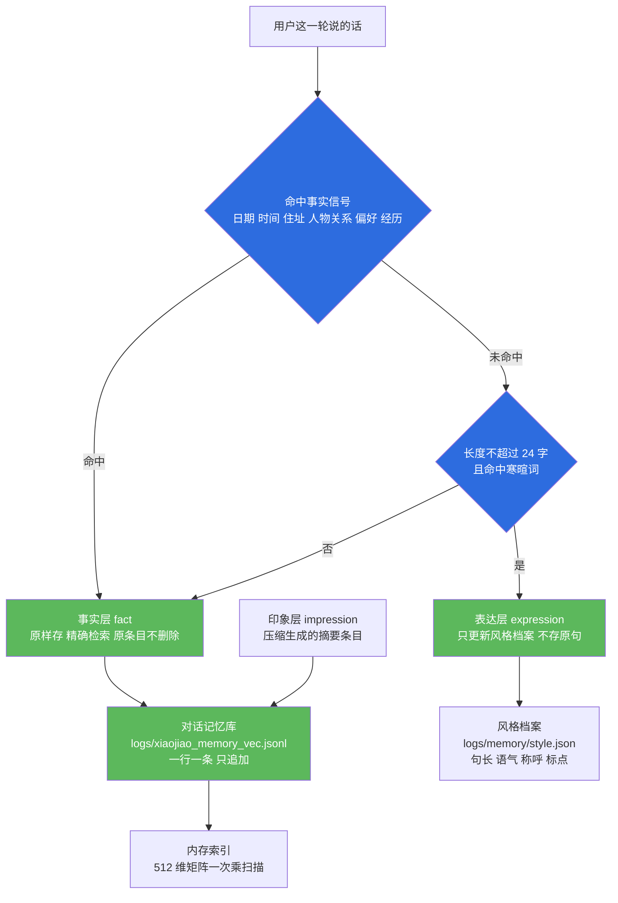
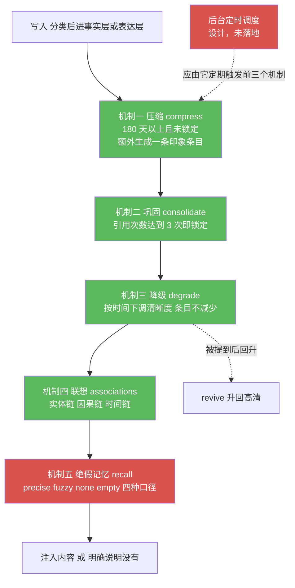
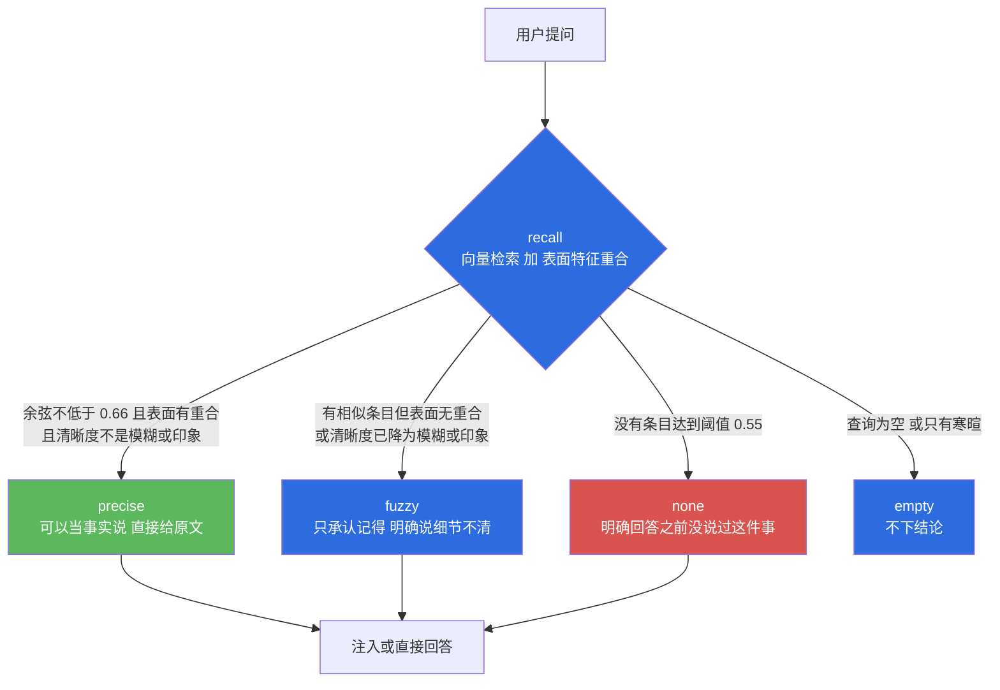
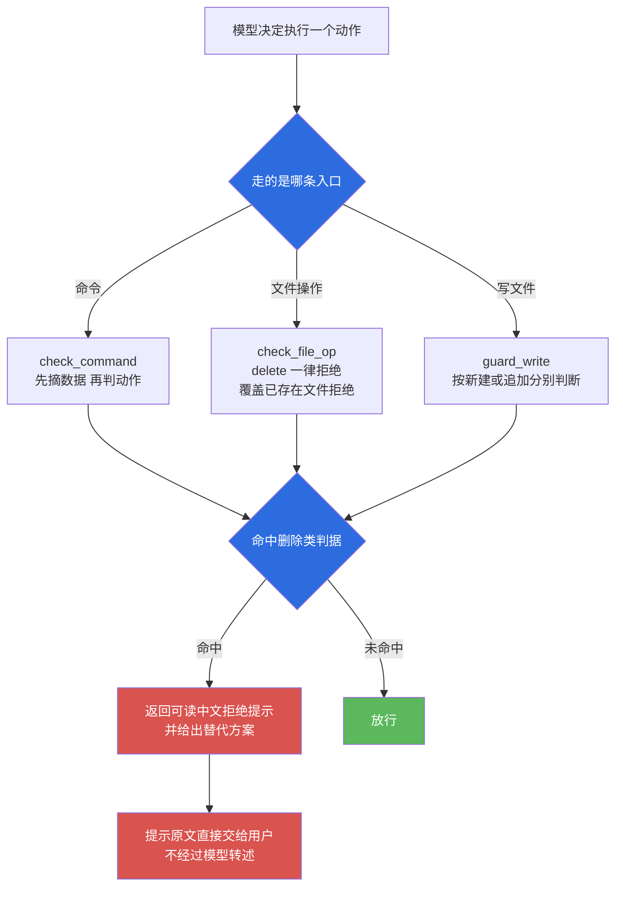

# 小焦 · 模块 03 · 记忆深度

> 适用版本：`v1.0`　｜　最后更新：`2026-09-14`　｜　维护者：小焦项目　｜　文档状态：稳定

## 文档元信息

| 项 | 内容 |
| --- | --- |
| 文档编号 | 03 |
| 模块名 | 记忆深度（事实层 / 表达层 / 印象层） |
| 适用版本 | `v1.0` |
| 最后更新 | `2026-09-14` |
| 维护者 | 小焦项目 |
| 文档状态 | 稳定。正文描述的行为均已落地；未落地项在第 7.1 节逐条标注为「设计，未落地」 |
| 上游文档 | [`../design-philosophy.md`](../design-philosophy.md) 第八节；[`../architecture-diagrams.md`](../architecture-diagrams.md) 图 4 |
| 对应实现 | `core/memory_deep.py`、`core/memory_vec.py`、`core/retriever.py`、`core/security/no_delete.py` |
| 对应自测 | `tools/test_memory_depth.py`、`tools/test_no_delete.py`、`tools/test_redline_integration.py`、`tools/test_memory_recall.py`、`tools/test_retrieval_rerank.py` |
| 术语前置 | 载体：承担全部能力的代码部分；火种：可替换的模型；清晰度：一条记忆当前保留多少细节 |

## 目录

- [1. 摘要](#1-摘要)
- [2. 背景与问题](#2-背景与问题)
- [3. 设计目标](#3-设计目标)
- [4. 架构与原理](#4-架构与原理)
- [5. 接口与实现](#5-接口与实现)
- [6. 使用示例](#6-使用示例)
- [7. 边界与限制](#7-边界与限制)
- [8. 故障排查](#8-故障排查)
- [9. 参考](#9-参考)
- [变更记录](#变更记录)

---

## 1. 摘要

记忆深度是小焦的记忆分层机制。它把"用户说过的话"分成三层存放，并用一套随时间变化的清晰度描述每条记忆还剩多少细节。

三层分别是事实层、表达层、印象层。事实层原样保存，用于精确复述；表达层只学说话风格，不保存原句；印象层保存很久以前发生过什么。

这套机制的核心取舍是：**清晰度可以随时间下降，记忆条目不允许被删除。** 半年以后答不出细节是可以接受的，答成"没有这回事"是不可接受的。

实现分布在四个文件里：

| 文件 | 承担的事 |
| --- | --- |
| `core/memory_deep.py` | 分层判断、清晰度、压缩、巩固、降级、联想、检索出口 |
| `core/memory_vec.py` | 向量库的落盘与检索，只追加，不覆盖 |
| `core/retriever.py` | 检索排序、时间衰减、注入预算 |
| `core/security/no_delete.py` | 删除禁区：本项目的不可逆动作拦截 |

配套红线由 `core/security/no_delete.py` 承担：任何形式的删除与覆盖，都在命令真正执行之前被拦下。

---

## 2. 背景与问题

### 2.1 术语

| 术语 | 含义 |
| --- | --- |
| 载体 | 本项目里承担全部能力的代码部分。记忆、工具、校验、编排都在这里 |
| 火种 | 可替换的模型。换火种不改变载体行为 |
| 记忆库 | 对话记忆的向量存储，落在 `logs/xiaojiao_memory_vec.jsonl` |
| 向量 | 把文本映射成 512 维浮点数，用于按相似度检索 |
| 清晰度 | 一条记忆当前保留的细节程度，分高清、标清、模糊、印象四档 |
| 绝假记忆 | 检索不到内容时明确回答"没有"，不允许用最相似的一条凑答案 |

### 2.2 不分层会出现的两类故障

把全部内容放进同一个池子并按相似度取前几条，会稳定出现两类问题。

第一类是噪声淹没事实。用户说一百次"你好"，就存下一百条几乎一样的样本。用户真正说过一次的事实只有一条，在取前五条时会排到很后面，等于检索不到。

第二类是久远内容被当作不存在。若按时间淘汰久远条目，用户半年后再问起旧事，系统只能回答"没有这回事"。用户感受到的是"它变了"，而不是"它记不清了"。

### 2.3 删除为什么被单独禁掉

在这套系统里，写入可以改，改错可以再改，删除之后无法恢复。叠加模型幻觉、路径看错、意图理解错误三种常见失误，删除是这套机制里单独禁掉的动作，它造成的损失不可挽回，而写入类动作不会。

因此删除的拦截写在代码里，不写在提示词里。提示词是对模型的请求，代码是拦在动作前的闸门。是否删除的判断全部由 Python 完成，模型没有否决权，也不读取任何权限开关（该模块源码中不含权限放行的分支，自测会做源码级断言）。

---

## 3. 设计目标

### 3.1 Goals

1. 分层存放。事实、风格、久远印象分开，互不挤占检索名额。
2. 分层判断可复现、可解释。同一句话任何时候都分到同一层，且能说出为什么这么分。
3. 清晰度随时间下降，条目数量不下降。
4. 降级可逆。被重新提到的记忆回到高清。
5. 重要记忆不随时间变模糊。被反复引用的条目锁定为高清。
6. 检索出口给出口径。命中到什么程度，就说成什么程度。
7. 删除被硬拦截。不依赖模型自觉，不依赖权限配置。

### 3.2 Non-Goals

1. 不重训模型，不做微调。记忆全部存放在模型外部。
2. 不引入中文分词器等新依赖。表面特征用 2-gram 抽取。
3. 不追求多层语义理解。分类用规则，不用模型判断。
4. 不保存全部原文。用户画像、隐私类内容不进病历与日志。
5. 不实现语义去重与自动改写。压缩只做摘要与标记，不改写原文。

---

## 4. 架构与原理

### 4.1 三层模型与分类规则

**图 3-1 · 三层记忆的分层判断与数据落点**

载体用规则判断每一句话该进哪一层，不调用模型。



> 代码位置：`core/memory_deep.py` 的 `classify()`、`remember()`、`remember_fact()`、`remember_expression()`、`remember_impression()`；`core/memory_vec.py` 的 `add_memory()`。

分类的判据顺序固定，不可调换：

1. 命中事实信号，直接判为事实层并返回。
2. 未命中事实信号、且长度不超过 24 字、且命中寒暄词，判为表达层。
3. 其余情况一律判为事实层。

顺序不可调换的原因是两类误判的代价不对称。把事实误判成寒暄，用户说过的正经事被丢弃，损失不可逆；把寒暄误判成事实，只是多存一条样本。不确定时全部倒向事实层。

#### 4.1.1 事实信号

事实信号由 7 条正则与一组事件词构成。

| 类别 | 覆盖内容 |
| --- | --- |
| 日期时间 | 年份加月份、月日、今天、昨天、上周、去年、刚才等 |
| 地点与居住 | 住在、搬到、来自、老家、公司在、工作在、上学、毕业 |
| 人物关系 | 名字、称呼、我儿子、我女儿、我爸、我妈、老公、老婆 |
| 偏好与状态 | 喜欢、讨厌、爱吃、不吃、过敏、戒烟、减肥 |
| 态度类事件 | 买不起、卸载、不要了、必须、一定要、不能接受 |
| 经历事件词 | 被、挨、发生、遇到、面试、考试、加班、请假、出差、吵架、分手、生日、生病、住院、升职、离职、搬家 |

#### 4.1.2 表达信号

表达信号是寒暄与口癖词表，配合 24 字长度上限使用。词表覆盖问候、告别、道谢、应声、笑声几类，例如「你好」属于问候，「嗯嗯」与「收到」属于应声。

长度上限的作用是防止长句被当成寒暄。一句话只要超过 24 字，即使包含寒暄词也判为事实层，由事实信号与默认规则决定归属。

#### 4.1.3 默认倒向

三层都不确定时，条目进入事实层。空内容同样按事实层处理，理由是多存不丢。

### 4.2 清晰度：降级不是遗忘

**图 3-2 · 清晰度四档与两个反方向的动作**

清晰度按时间单向降低，被重新提到则回升，被反复引用则锁定。


> 代码位置：`core/memory_deep.py` 的 `CLARITY_DAYS`、`clarity_of()`、`_clarity_of_row()`、`degrade()`、`revive()`、`consolidate()`。

分档阈值为 7 天、30 天、180 天。这三个数字对应一周内、一个月内、半年内三个习惯性记忆节点。

档位的计算规则有两条补充：

- 条目在最近 7 天内被检索命中过，直接按高清返回，不看时间。
- 条目带 `locked` 标记时保持写入时的档位，不随时间下降。

存储的档位只是下限。时间只会让清晰度变差，不会让它变好。这条规则来自一次真实缺陷：早期实现取两个档位里较好的一个，而条目在写入时就把档位记成高清，结果是任何条目一旦入库就终身高清，整套降级机制从未生效。

### 4.3 五个机制

**图 3-3 · 五个机制的执行顺序、依赖与调度缺口**

五个机制都在载体内部完成，都不调用模型。



> 代码位置：`core/memory_deep.py` 的 `compress()`、`consolidate()`、`degrade()`、`associations()`、`recall()`。调度缺口见第 7.1 节。

#### 4.3.1 压缩

压缩把 180 天以上、未被锁定、且不属于印象层的条目，额外生成一条印象条目。条目格式是「印象」前缀加不超过 60 字的摘要，原条目保留，原条目的 `meta.compressed_to` 指向新条目的 id。

压缩的实现要点是先构造、后统一原子写入。早期写法是在循环里逐条追加写盘，循环结束后再用循环开始前读到的行列表覆盖整个文件，结果是刚写入的印象条目被自己的覆盖写抹掉：返回值显示压缩成功，目标条目的指针也指向了新 id，但文件和索引里都没有它。修正方式是把新行并入同一批数据，全程只落盘一次。

#### 4.3.2 巩固

巩固遍历全部条目，把引用次数达到 3 次的条目标记为锁定。锁定后的条目不随时间降级。

引用次数由 `note_usage()` 累加。该函数的调用方情况见第 7.1 节。

#### 4.3.3 降级与回升

降级按时间重算每条条目的清晰度，表达层跳过。返回值包含扫描条数、发生变化的具体条目、以及各档位的条目数量分布。

降级函数支持推演模式：调用方可以把待处理的行直接传入，函数只在内存里计算，不回写文件。这个参数不是可选优化，而是必需项。降级的输入包含可任意指定的当前时间，早期版本在自测中用「当前时间加 500 天」调用真实写入模式，把整库条目按 500 天后重算并写回。可推演的函数不默认修改真实数据，这条约束由此固定下来。

回升由 `revive(memory_id)` 完成，把指定条目拉回高清并记录回升时间。找不到该 id 时返回 `False`，不假装成功。

另有一次索引对账机制 `flush_index()`。记忆库的覆盖写会重建索引，而重建只覆盖文件里已有的行。若重建期间有行漏掉，它会留在文件里但永远检索不到，写入不报错，读文件也正常。因此每次覆盖写之后都要按 id 对账一次，索引缺哪行就补哪行。

#### 4.3.4 联想

联想给一条记忆找邻居，输出三类关联：共享实体的实体链、十天以内且含因果词的时间段的因果链、十天以内的时间链。

排序权重按有用程度设定：实体链 3 分，因果链 2 分，时间链 1 分，再按时间间距减去最多 0.9 分。早期实现先按类型排序再按时间排序，结果在截断到 5 条时全部被时间链占满，实体链一条也进不来。

#### 4.3.5 绝假记忆

**图 3-4 · 检索出口的四种口径**

检索结果分四种口径返回，调用方按口径决定怎么说话。



> 代码位置：`core/memory_deep.py` 的 `recall()`、`overlap()`、`confidence()`、`_features()`、常量 `SIM_WEAK` 与 `SIM_STRONG`。

判定 precise 需要同时满足三个条件：向量相似度不低于 0.66、表面特征有重合、清晰度处于高清或标清。

阈值来自实测。在真实记忆库上量到的结果是：确实记得的内容，前五条余弦为 0.652、关键词重合为 0.00；从未说过的内容，前五条余弦为 0.622、关键词重合为 0.00。两组数字几乎重叠，中文短句的余弦基线本来就在 0.55 至 0.67 之间。因此单靠相似度无法区分"记得"和"没说过"，必须加入表面特征重合这道闸门。

表面特征由中文 2-gram、长度不小于 2 的拉丁词、长度不小于 2 的数字串组成，虚词单字组成的 2-gram 会被过滤。同一个说法的重合率为 1.00，换一种说法的改写为 0.00。

综合置信度以表面重合为主、向量相似度为辅：重合率不低于 0.5 时在相似度基础上加 0.45；重合率大于 0 时加 0.30；没有任何重合时按相似度乘以 0.35 折价。

### 4.4 表达层为什么不保存原句

用户第 100 次说问候语时，保存 100 条样本会把向量库里的真实事实挤出检索名额。回话也会退化成照着用户的措辞复述。

因此表达层只维护一份全局风格档案，记录样本数、句长、语气词密度、称呼习惯、标点习惯等数值型维度，另存最近 20 条样本用于复查。回话时由 `expression_reply()` 用模板加风格参数生成新句子，不调用模型，也不复用任何原句。

自测记录的实测结果是：风格样本累计到 118 条时，表达层的向量条目数为 0，也就是说寒暄确实没有进入向量库。

### 4.5 红线：绝不删除用户记忆

**图 3-5 · 删除禁区的拦截位置**

所有会改动文件的入口都汇到同一个判断，命中即拦。



> 代码位置：`core/security/no_delete.py` 的 `check_command()`、`check_file_op()`、`guard_write()`、`assert_command()`、`is_delete_command()`、`explain()`。

判据顺序是固定的八步，目的是先摘掉数据、再判断动作：

1. 按分号、并列符、管道、换行、括号把命令行切成小命令。
2. 摘掉引号内的字符串，引号里的是数据。
3. 只读动词的参数不算动作。`Select-String -Path a.py -Pattern delete` 这种读式搜索必须放行。
4. 执行器语境不豁免引号。`powershell -Command`、`python -c`、`cmd /c`、脚本文件、`eval` 之后的引号内容就是即将运行的代码。
5. 引号语义按语言区分。命令行与脚本里 `$()` 是命令替换，代码文件里它只是四个字符。
6. 剩余文本按 34 条硬规则扫描；不在引号内、也不是只读动词参数的光杆删除词一律拦截。
7. 6 条次级信号单独命中只记日志，只有出现在同一条执行器语句里才升级为拦截。
8. 命令指向脚本文件时，读出脚本正文递归再扫一遍，有深度上限；读不到就按可疑处理。

已知的刻意保守有四种，都属于设计取舍而非缺陷：正文里含 `del` 的脚本写入会被拦；`python -c "print('delete')"` 这类只是提到删除的代码会被拦；代码文件里被反引号包住的命令示例会被当作命令替换判一次；变量拼接的命令偏向拦截。

判断过程本身出错时，按删除处理并记录日志。守卫自己坏了不等于可以放行删除。

---

## 5. 接口与实现

### 5.1 模块分工

| 文件 | 职责 | 是否依赖模型 |
| --- | --- | --- |
| `core/memory_deep.py` | 分层、清晰度、五个机制、检索出口 | 否 |
| `core/memory_vec.py` | 向量库读写、索引、硬隔离 | 否，只依赖 `core/embedder.py` |
| `core/retriever.py` | 排序、衰减、精排闸门、注入预算 | 精排触发时会调用一次模型 |
| `core/security/no_delete.py` | 删除与覆盖的拦截 | 否 |

### 5.2 `core/memory_deep.py`

常量：

| 名称 | 值 | 含义 |
| --- | --- | --- |
| `LAYER_FACT` / `LAYER_EXPRESSION` / `LAYER_IMPRESSION` | `fact` / `expression` / `impression` | 三层标识 |
| `CLARITY_HD` / `CLARITY_SD` / `CLARITY_BLUR` / `CLARITY_IMPRESSION` | `hd` / `sd` / `blur` / `impression` | 四档清晰度 |
| `CLARITY_DAYS` | 7 / 30 / 180 / 无穷 | 分档天数 |
| `REVIVE_DAYS` | `7.0` | 回升判据的窗口 |
| `_EXPRESSION_MAX_LEN` | `24` | 寒暄短句长度上限 |
| `SIM_WEAK` / `SIM_STRONG` | `0.55` / `0.66` | 检索判据阈值 |

函数签名：

```python
# 分层与清晰度
classify(text) -> (layer, reason)
clarity_of(age_days) -> str
age_days(ts, now=None) -> float

# 入库
remember_fact(text, entities=None, ts=None, source="对话", key_text=None) -> str | None
remember_expression(text) -> dict | None
remember_impression(text, source="压缩", ts=None) -> str | None
remember(text, entities=None, ts=None, source="对话", key_text=None) -> dict

# 五个机制
compress(now=None, force=False, rows=None) -> dict
consolidate(min_refs=3, now=None) -> dict
degrade(now=None, apply=True, rows=None) -> dict
revive(memory_id, now=None) -> bool
note_usage(memory_id, now=None) -> int
associations(memory_id, limit=5, now=None) -> list

# 检索出口与对账
overlap(query, text) -> float
confidence(query, text, sim=None) -> float
recall(query, top_k=5, threshold=None, now=None) -> dict
flush_index(rows=None) -> int
stats(now=None) -> dict

# 风格档案
style_profile() -> dict
expression_reply(kind="hello") -> str
```

`recall()` 的返回结构：

| 字段 | 含义 |
| --- | --- |
| `verdict` | `precise` / `fuzzy` / `none` / `empty` |
| `text` | 注入或回话用文本。`none` 时是明确的"没说过"，不是空串 |
| `hits` | 命中列表，每条含 `score`、`overlap`、`conf`、`clarity`、`age_days` |
| `tokens` | 文本 token 数 |

`degrade()` 的返回结构：`scanned` 扫描条数、`changed` 变化明细、`levels` 各档条目数、`applied` 是否真的写回。

`stats()` 的返回结构：`total`、`by_layer`、`by_clarity`、`by_clarity_cn`、`style_samples`、`summary`。所有数字都来自实际读取，没有数据时返回 0。

### 5.3 `core/memory_vec.py`

```python
path() -> str
reload() -> int
add_memory(text, kind="dialogue", entities=None, ts=None, meta=None, key_text=None) -> str
ids() -> list
reindex_row(rec) -> bool
search_memory(query, top_k=5, threshold=0.0, dedup_text=True) -> list
count() -> int
stats() -> dict
```

存储格式为 JSONL，一行一条，只追加。向量以 base64 编码的 float32 小端存放，512 维向量编码后约 2732 字符，正文保持明文便于人工排查。

`key_text` 参数决定用哪段文本计算向量。一轮对话的原文里用户那句话很短，若拿整段原文算向量，用户那句会被几百字的回答淹没，之后按用户原话检索时相似度会掉到阈值以下。因此索引键使用用户那句话，注入内容使用完整原文。

模块内部有硬隔离：把库指到 `self_learn/knowledge_vec.json` 会直接抛错。那是工具经验库，对话记忆写进去会污染它。

### 5.4 `core/retriever.py`

```python
retrieve(query, top_k=None, threshold=None, max_tokens=None,
         log=True, kind=None, now=None) -> dict
decay(age_seconds) -> float
estimate_tokens(text) -> int
rerank(query, hits, judge=None) -> list
log_retrieval(rid, query, hits, used, tokens, latency_ms, verdict=None)
record_usage(rid, used, note="")
usage_rate(path=None) -> dict
config(**kw) -> dict
```

默认参数：`TOP_K = 5`、`THRESHOLD = 0.6`、`MAX_TOKENS = 2000`、时间衰减为 7 天内 1.0、30 天内 0.7、更早 0.4。

时间衰减只参与排序，不参与阈值判断。否则三年前说过的事会被衰减掉，等于系统自己把用户的经历丢掉。

精排闸门由三个常量控制：`RERANK_GAP = 0.10`、`RERANK_MAX = 5`、`RERANK_MIN_HITS = 2`。只有候选不少于两条、且第一名与第二名分差小于 0.10 时才触发一次模型精排。分差足够大时向量排序本身可信，不再多花一次模型往返。

### 5.5 `core/security/no_delete.py`

```python
is_delete_command(cmd) -> (bool, str)
check_command(cmd) -> str
check_file_op(op, path, new_content="", allow_overwrite=False) -> str
guard_command(cmd) -> str
guard_write(path, content, mode="w") -> str
assert_command(cmd) -> bool
explain() -> str
```

`check_command()` 与 `check_file_op()` 返回空串表示放行，返回非空表示给用户看的中文拒绝提示。`assert_command()` 被拦时抛 `DeleteBlocked`，异常消息本身就是给用户看的提示。

`check_file_op()` 接受的动词为 `read`、`write`、`append`、`edit`、`move`、`rename`、`delete`。`read` 一律放行；`delete` 一律拒绝；`write` 在目标已存在且未显式允许覆盖时拒绝；`append` 允许但会扫描待写入内容；`move` 与 `rename` 在目标同名文件已存在时拒绝。不认识的动词一律不放行。

### 5.6 落盘位置与字段

| 路径 | 内容 | 写入方式 |
| --- | --- | --- |
| `logs/xiaojiao_memory_vec.jsonl` | 对话记忆与事实条目 | 只追加；改清晰度时按行重写，走临时文件加原子替换 |
| `logs/memory/style.json` | 风格档案与最近 20 条样本 | 整体覆盖写 |
| `logs/memory/events.jsonl` | 分层、降级、巩固、压缩、回升的操作流水 | 只追加 |
| `logs/memory/summary.json` | 压缩累计次数与最近一次压缩时间 | 整体覆盖写 |
| `logs/memory_retrieval.log` | 检索明细：后端、命中条数、相似度、耗时、模型是否使用 | 只追加 |

记忆行字段：`id`、`ts`、`kind`、`entities`、`text`、`meta`。`meta` 内部含 `layer`、`clarity`、`source`、`revived_at`、`refs`、`locked`、`locked_at`、`compressed_to`、`degraded_at`。

---

## 6. 使用示例

以下示例均在仓库根目录执行。运行前先设置编码环境变量，避免在 Windows 控制台出现编码错误。

### 6.1 分层判断与清晰度

```powershell
$env:PYTHONUTF8 = "1"
cd <仓库目录>
python -c "import sys; sys.path.insert(0, r'<仓库目录>'); from core import memory_deep as M; print(M.classify('我叫张三，住在济南')); print(M.classify('你好')); print([M.CLARITY_CN[M.clarity_of(d)] for d in (0.5, 10, 60, 400)])"
```

预期输出：

```
('fact', '命中事实信号「住在」')
('expression', '短句且命中寒暄词「你好」→ 只学风格，不存原句')
['高清', '标清', '模糊', '印象']
```

### 6.2 推演模式：验证降级与压缩，不碰真实数据

传入 `rows` 参数后，函数只在内存中计算，不回写文件。

```python
import sys
import time

sys.path.insert(0, r"<仓库目录>")

from core import memory_deep as M

rows = [
    {"id": "demo-1", "ts": time.time() - 400 * 86400, "kind": "fact",
     "text": "四年前在成都待过", "meta": {"clarity": "hd"}},
    {"id": "demo-2", "ts": time.time() - 1 * 86400, "kind": "fact",
     "text": "今天在济南", "meta": {"clarity": "hd"}},
]

d = M.degrade(rows=rows)
print("各档条目数", d["levels"], "变化条数", len(d["changed"]), "是否写回", d["applied"])

c = M.compress(rows=rows)
print("压缩条数", c["compressed"], "是否写回", c["applied"])
```

预期输出：

```
各档条目数 {'impression': 1, 'hd': 1} 变化条数 1 是否写回 False
压缩条数 1 是否写回 False
```

`applied` 为 `False` 表示本次只在内存里运算。要写入真实数据，调用时不传 `rows` 参数。

### 6.3 检索出口

```powershell
$env:PYTHONUTF8 = "1"
cd <仓库目录>
python -c "import sys; sys.path.insert(0, r'<仓库目录>'); from core import memory_deep as M; r = M.recall('我的车牌号是多少'); print(r['verdict']); print(r['text'][:60]); print([(h['score'], h['overlap']) for h in r['hits'][:1]])"
```

按设计，用户从未提过的内容应当返回 `none`。本次会话的一次实测结果是 `precise`，返回了一条无关内容。该缺口在第 7.2 节说明。

### 6.4 红线守卫

```powershell
$env:PYTHONUTF8 = "1"
cd <仓库目录>
python -c "import sys; sys.path.insert(0, r'<仓库目录>'); from core.security import no_delete as ND; print(len(ND.BAN_RULES), len(ND.SUSPECT_RULES)); print(ND.check_command('rm -rf data')[:40]); print(repr(ND.check_command('Select-String -Path a.py -Pattern delete'))); print(repr(ND.check_command('dir')))"
```

预期输出：

```
34 6
删除禁区：拦下命令（rm 会永久删除文件/目录（命中片段：rm））
''
''
```

第三行与第四行是空串，表示读式搜索与普通命令正常放行。

### 6.5 运行自测

```powershell
$env:PYTHONUTF8 = "1"
cd <仓库目录>
python tools\test_memory_depth.py
python tools\test_no_delete.py
python tools\test_redline_integration.py
```

PowerShell 下用 `2>&1` 重定向时，程序写到 stderr 的日志会被当作错误记录，出现 `NativeCommandError` 字样。判断是否通过应看脚本末尾打印的通过数量，而不是看终端是否出现该字样。

---

## 7. 边界与限制

### 7.1 已落地与未落地的分界

以下结论来自对当前仓库的调用点排查，排查方式是在全仓范围内检索函数名与模块名。

| 能力 | 模块内状态 | 运行时接入状态 |
| --- | --- | --- |
| 分层判断 `classify()` | 已落地，自测覆盖 | 主对话链路的写入走 `memory_vec.add_memory()`，`kind` 只取 `dialogue` 与 `tool`。分层的三值不被主链路使用。**设计，未落地** |
| 清晰度计算与降级 `degrade()` | 已落地，自测覆盖 | 全仓调用点只有自测脚本，没有后台定时任务。**设计，未落地** |
| 压缩 `compress()` | 已落地，自测覆盖 | 同上。**设计，未落地** |
| 巩固 `consolidate()` | 已落地，自测覆盖 | 调用点只有自测。且它的输入来自 `note_usage()` 累加的次数，而 `note_usage()` 也没有运行时调用方。**设计，未落地** |
| 联想 `associations()` | 已落地，自测覆盖 | 调用点只有自测。**设计，未落地** |
| 绝假记忆出口 `recall()` | 已落地，自测覆盖 | 主对话链路的检索走 `retriever.retrieve()`，不经过 `recall()` 的口径判断。**设计，未落地** |
| 表达层生成 `expression_reply()` | 已落地，自测覆盖 | 回话链路的调用点只有自测。**设计，未落地** |
| 索引对账 `flush_index()` | 已落地，自测覆盖 | 由模块内部的覆盖写路径调用，属于已接入 |

也就是说，记忆深度这一层目前的状态是：机制完整、自测完备、独立可运行，但主对话链路仍在用更早的写入与检索路径。接入是后续工作，不是当前版本的能力。

### 7.2 绝假记忆闸门的实测缺口

本次会话在真实记忆库上实测到一次误判：查询「我的车牌号是多少」，返回 `verdict` 为 `precise`，命中内容是一条与查询无关的数学题回答，相似度 0.6871、表面重合率 0.333。

原因在 precise 判据的表面重合条件。该条件写为重合率大于 0，即任何一个 2-gram 命中就能通过。查询与无关内容之间只要撞上通用 2-gram 就能满足条件，本例中命中的是两个通用片段。重合率 0.333 由 6 个查询特征里的 2 个构成。

同一时刻的另外两次查询行为正常：另外两例均返回 `fuzzy`，也就是只承认记得、不补细节。

自测脚本没有覆盖这一场景，因为自测在清理过的库上运行，候选集合里不存在无关的邻条。

该缺口的方向性修正需要调整判据比重或过滤高频 2-gram，本次未改动代码。

### 7.3 其它限制

1. 检索延迟。向量检索本身满足延迟要求，含模型精排的完整检索不满足。实测向量段平均 10.9 毫秒、最大 27.9 毫秒；含精排时平均 519.5 毫秒、最大 1865.1 毫秒，超过 800 毫秒的验收线。该验收项当前未通过。
2. 分类规则是正则与词表，不做语义理解。换一种说法的同一件事可能落到不同层，例如把居住地写成不带信号词的句式时会落到默认事实层，结论仍是事实层，但理由不同。
3. 表达层只统计风格，不做人格建模。风格参数是数值，不产生立场或情绪。
4. 压缩不生成语义摘要，摘要由截断产生，最长 60 字。
5. 库规模在持续变化。本次会话内两次读取分别为 1185 条与 1190 条，绝对值只能作为量级参考。
6. 记忆库中存在一条自测探针残留：`id` 为 `1789365050963-789dd4`，正文以「探针」开头，清晰度为印象层。自测脚本声明的清理前缀与这条正文不匹配，因此它留在了库里。

### 7.4 本次实测数据

以下数字来自 2026-09-14 在 Windows 本机的实际运行，命令为 `python tools\test_<名称>.py`。

| 自测脚本 | 结果 |
| --- | --- |
| `tools/test_memory_depth.py` | 通过 73 / 共 73，耗时 24.4 秒 |
| `tools/test_no_delete.py` | 通过 101 / 共 101 |
| `tools/test_redline_integration.py` | 通过 40 / 共 40 |
| `tools/test_retrieval_rerank.py` | 通过 19 / 共 19 |
| `tools/test_memory_recall.py` | 命中率 5 / 5、使用率 5 / 5、向量延迟达标、含精排延迟未达标，脚本退出码 1 |

规模快照：记忆库 1185 条、文件 3856510 字节、维度 512、坏行 0、后端为小脑 MiniGPT、矩阵快路径可用；按类型分布为对话 893 条、工具结论 245 条、事实 47 条；按清晰度分布为高清 1184 条、印象 1 条；风格样本 126 条。嵌入模型配置为词表 6305、嵌入维度 512、注意力头 8、层数 8。

红线规模：34 条硬规则、6 条次级信号、面向用户的中文说明 314 字。登记的拦截入口为 `background`、`edit_file`、`move_file`、`rename_file`、`run_command`、`write_file`。

记忆库处于持续写入状态，上述数字会随使用变化。

---

## 8. 故障排查

### 8.1 用户问起很久以前的事，回答"没这回事"

检查顺序：

1. 确认该内容是否在库内。用 `core.memory_vec` 的 `search_memory()` 直接查一次，看是否有命中。
2. 若有命中但相似度低于 0.55，`recall()` 会返回 `none`。此时属于阈值问题，不是数据丢失。
3. 若库内没有该内容，检查写入链路是否被跳过。`xiaojiao_app._remember_turn()` 在记忆开关关闭、输入为空、回答为空三种情况下会直接返回，不写入。
4. 确认清晰度档位。清晰度降到模糊或印象时，`recall()` 只能返回 `fuzzy`，也就是只承认记得。这是设计行为。

### 8.2 检索到的内容与问题的方向相反

向量模型是字级的，含义相反的句子相似度会偏高。实测「喜欢」与「讨厌」同结构的句子余弦达到 0.904。

处理方式由精排闸门负责：第一名与第二名分差小于 0.10 时触发一次模型精排，由模型判断方向。若精排没有触发，检查 `RERANK` 开关、`RERANK_GAP` 阈值，以及日志 `logs/memory_retrieval.log` 里的精排记录与时延分段。

### 8.3 文件里有记忆，但检索不到

这是索引与文件不一致的典型表现。原因通常是覆盖写与索引重建之间的窗口。

处理方式：调用 `memory_deep.flush_index()` 做一次按 id 对账，索引缺哪行就补哪行。若对账返回 0 而条目仍检索不到，检查该行的向量能否正确解码，维度不等于 512 的行会被索引丢弃，计入 `bad_lines`。

### 8.4 寒暄把真实事实挤出检索结果

检查写入端是否绕过了分层。主链路的写入类型只有对话与工具两类，如果寒暄也走了这条路径，就会与事实条目共同竞争前五名。

处理方式：确认写入是否经过 `memory_deep.remember()`，该入口会把寒暄导向风格档案而不是向量库。

### 8.5 删除命令没有拦住

检查顺序：

1. 确认调用点是否经过守卫。命令类入口应调用 `check_command()` 或 `guard_command()`，写文件应调用 `guard_write()`。
2. 确认是否有新的入口没有登记。红线登记表里的入口应包含全部会执行命令或写文件的工具。
3. 若判断被误拦（例如读式搜索被拦），查看返回提示里给出的命中片段，据此判断是引号摘除还是只读动词白名单的问题。
4. 若守卫内部报错，它会按删除处理并写日志。查看日志确认异常原因，不要在异常未修复前放行。

### 8.6 记忆库被自测写入

自测会在真实库上执行部分写入，并按前缀清理。若发现残留，用 `core.memory_vec` 的 `search_memory()` 定位，人工核对后处理。当前已知一条探针残留，见第 7.3 节第 6 条。

---

## 9. 参考

| 文档 | 关系 |
| --- | --- |
| [`../design-philosophy.md`](../design-philosophy.md) | 第八节给出记忆深度的设计意图与三层取舍 |
| [`../architecture-diagrams.md`](../architecture-diagrams.md) | 图 4 给出记忆深度系统的整体结构 |
| [`../six-infinity-diagrams/06-memory-retrieval.md`](../six-infinity-diagrams/06-memory-retrieval.md) | 写入与读取两条路径的逐图细解 |
| [`../testing-report.md`](../testing-report.md) | 全量自测结果与验收口径 |
| [`../security-audit.md`](../security-audit.md) | 删除禁区与安全红线的审计记录 |
| [`../release-notes-v1.0.md`](../release-notes-v1.0.md) | v1.0 能力清单与已知限制 |

代码入口：

| 文件 | 主要符号 |
| --- | --- |
| `core/memory_deep.py` | `classify`、`degrade`、`consolidate`、`compress`、`associations`、`recall`、`remember`、`stats` |
| `core/memory_vec.py` | `add_memory`、`search_memory`、`reindex_row`、`flush_index` 的调用方 |
| `core/retriever.py` | `retrieve`、`decay`、`rerank`、`usage_rate` |
| `core/security/no_delete.py` | `check_command`、`check_file_op`、`guard_write`、`assert_command`、`explain` |

---

## 变更记录

| 日期 | 版本 | 变更 |
| --- | --- | --- |
| 2026-09-14 | v1.0 | 初版：三层模型、清晰度四档、五个机制、分类规则、检索出口、删除红线、接口清单、可运行示例、边界与限制、故障排查 |
