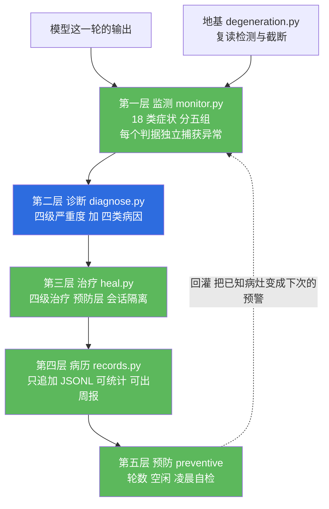
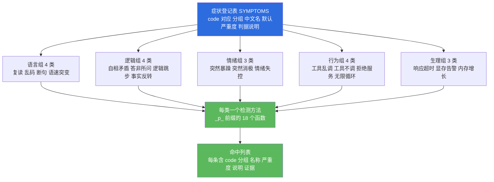
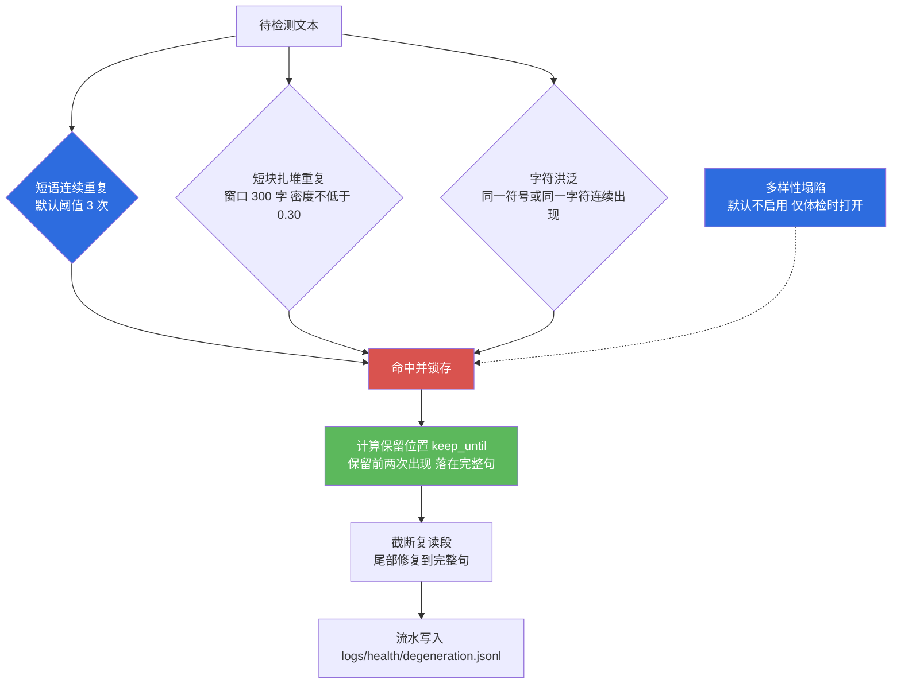
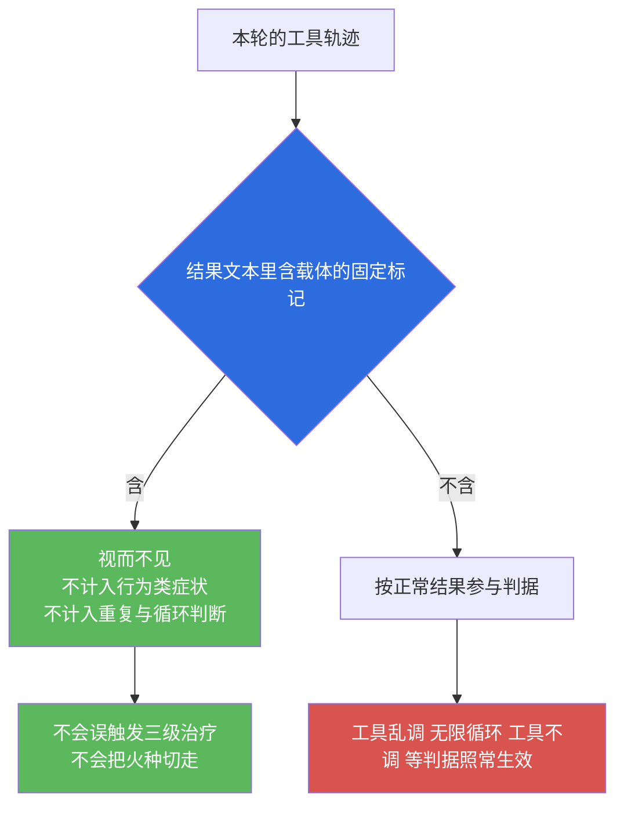
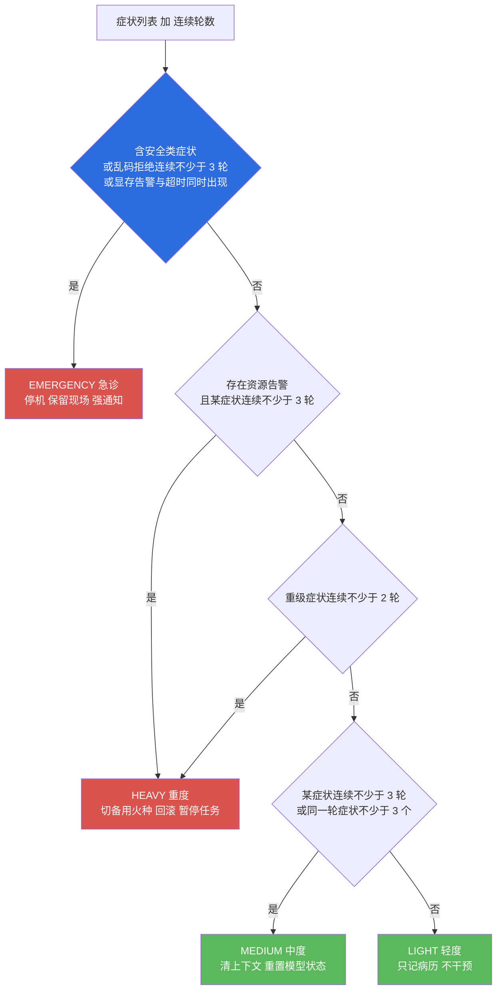
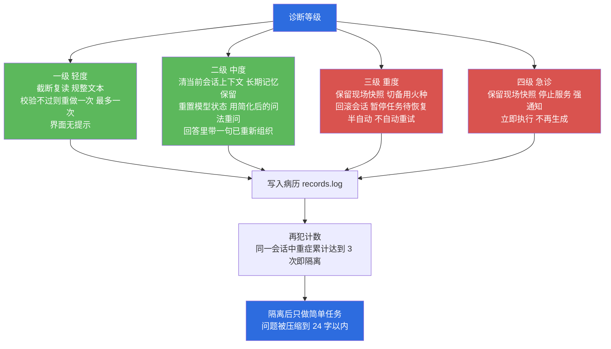
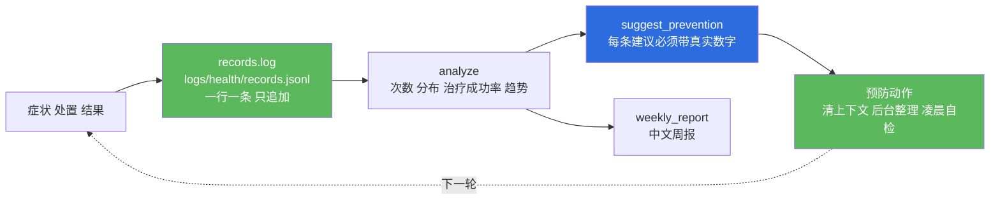

# 小焦 · 模块 04 · 健康系统

> 适用版本：`v1.0`　｜　最后更新：`2026-09-14`　｜　维护者：小焦项目　｜　文档状态：稳定

## 文档元信息

| 项 | 内容 |
| --- | --- |
| 文档编号 | 04 |
| 模块名 | 健康系统（监测 / 诊断 / 治疗 / 病历 / 预防） |
| 适用版本 | `v1.0` |
| 最后更新 | `2026-09-14` |
| 维护者 | 小焦项目 |
| 文档状态 | 稳定。正文描述的行为均已落地；未落地项在第 7.1 节逐条标注为「设计，未落地」 |
| 上游文档 | [`../design-philosophy.md`](../design-philosophy.md) 第五节；[`../architecture-diagrams.md`](../architecture-diagrams.md) 图 5 |
| 对应实现 | `core/health/monitor.py`、`core/health/diagnose.py`、`core/health/heal.py`、`core/health/records.py`、`core/health/degeneration.py`、`core/health/__init__.py` |
| 接入点 | `xiaojiao_app.py` 的 `_health_layer()`、`_health_gate()`、`_health_hooks()` |
| 对应自测 | `tools/test_health.py`、`tools/test_degeneration.py`、`tools/test_degen_strategy.py`、`tools/test_health_integration.py`、`tools/test_carrier_block.py` |
| 术语前置 | 载体：承担全部能力的代码部分；火种：可替换的模型；症状：一轮输出或一次运行中可被规则识别的异常 |

## 目录

- [1. 摘要](#1-摘要)
- [2. 背景与问题](#2-背景与问题)
- [3. 设计目标](#3-设计目标)
- [4. 架构与原理](#4-架构与原理)
- [5. 接口与实现](#5-接口与实现)
- [6. 使用示例](#6-使用示例)
- [7. 边界与限制](#7-边界与限制)
- [8. 故障排查](#8-故障排查)
- [9. 参考](#9-参考)
- [变更记录](#变更记录)

---

## 1. 摘要

健康系统是小焦的自检与自愈机制。它把模型输出里的异常当作症状来监测，判断严重程度与病因，按代价分级处置，并把每一次症状与处置如实写入病历。

五层结构的职责如下：

| 层 | 模块 | 一句话职责 |
| --- | --- | --- |
| 监测 | `core/health/monitor.py` | 识别 18 类症状，分语言、逻辑、情绪、行为、生理五组 |
| 诊断 | `core/health/diagnose.py` | 判定轻、中、重、急四级，并判断病因属于资源、上下文、逻辑还是模型 |
| 治疗 | `core/health/heal.py` | 按级处置，另含预防层与会话隔离 |
| 病历 | `core/health/records.py` | 只追加地记录症状与处置，提供统计、趋势与预防建议 |
| 地基 | `core/health/degeneration.py` | 复读检测与截断，供监测层直接复用 |

设计口径有三条贯穿全模块：

1. 分级对应代价。处置越重，副作用越大，因此级别越高，越需要用户确认。
2. 每一级的处置都落到可验证的副作用上。文本确实变短、会话确实被清、文件确实存在。拿不到能力时如实返回失败，不假装成功。
3. 监测与诊断永不抛异常。它们跑在对话热路径上，最差的结果是原样放行，而不是把整轮回答带崩。

---

## 2. 背景与问题

### 2.1 术语

| 术语 | 含义 |
| --- | --- |
| 症状 | 可被规则识别的异常，例如复读、乱码、答非所问 |
| 严重度 | 轻、中、重、急四级，对应 1 至 4 级处置 |
| 病因 | 资源、上下文、逻辑、模型四类 |
| 连续轮数 | 同一症状连续出现的轮数，中间有一轮正常即归零 |
| 载体主动动作 | 由载体自身做出的拦截与等待，例如删除禁区拦截、权限待确认、限流 |

### 2.2 模型退化是什么

模型的退化不是硬件损坏，而是它在当前上下文与当前任务下变得不稳定。表现包括复读、乱码、逻辑混乱、答非所问、语气突然失控、工具调用失序、前后矛盾。

这些现象会反复出现，并且有规律。同一个火种、相近的上下文长度、同一类任务，容易反复触发同一类问题。没有记录，每次退化都像第一次发生，系统不会变聪明。

### 2.3 两条常见错误做法

第一条是不加区分地重试。偶发的一次口误被反复重做，浪费算力，还可能把本来正确的回答推倒重来。

第二条是不加区分地不动。复读会滚成几千字，用户自己发现时才处理，而那时整轮回答已经不可用。

诊断层的存在就是为了避免这两种做法：先判断病得多重、病在哪里，再决定动不动、动到什么程度。

---

## 3. 设计目标

### 3.1 Goals

1. 症状可枚举、可解释。每一类症状有编号、中文名、默认严重度与判据说明。
2. 判级同时看严重度与持续性。单次轻症不干预，连续出现才升级。
3. 判因先于治疗。同一个症状在不同病因下处置方向相反。
4. 处置分级且可验证。每一级都产生真实的副作用，失败时如实记账。
5. 病历只追加。写入不重写历史文件，坏行只影响自己。
6. 预防优先于救火。轮数过多、长时间空闲、凌晨空闲三个时机主动做事。
7. 不误伤载体自身的安全动作。红线拦截、权限确认、限流一律不算模型退化。

### 3.2 Non-Goals

1. 不判断内容质量的高低。健康系统只看异常形态，不评价写得好不好。
2. 不做模型微调或参数调整。
3. 不联网诊断。全部判断在本地完成。
4. 不替代人工。急诊只负责停机与保留现场，恢复由人处理。
5. 不记录对话全文。病历只保留问题前 80 字与输出前 200 字。

---

## 4. 架构与原理

### 4.1 五层结构

**图 4-1 · 五层结构与代码落点**

每一轮生成结束后，输出依次经过监测、诊断、治疗，结果写入病历，病历再回灌给预防层。



> 代码位置：`core/health/__init__.py` 的 `cfg()`、`health_dir()`、`append_jsonl()`、`read_jsonl()`、`app_module()`；各层实现见 `core/health/` 下同名模块。

监测层的判据分五组登记在一张表里：语言 4 类、逻辑 4 类、情绪 3 类、行为 4 类、生理 3 类。登记表同时被诊断层取默认严重度、被病历层取分组，改一次阈值只需改表，不必翻遍判据函数。

落盘位置统一在 `logs/health/` 下：

| 文件 | 内容 |
| --- | --- |
| records.jsonl | 病历：症状、严重度、处置动作、结果、上下文快照 |
| degeneration.jsonl | 退化命中流水 |
| notify.jsonl | 强通知流水 |
| isolated.json | 会话隔离状态 |
| preventive_state.json | 预防层当日自检是否已执行 |
| paused.json、shutdown_request.json、switch_request.json | 暂停、停机、切换火种的请求状态 |
| snapshot_*.json | 保留现场的状态快照 |

### 4.2 监测：18 类症状

**图 4-2 · 18 类症状的五个分组**

症状分五组，覆盖文本形态、逻辑关系、情绪表达、工具行为与运行资源。



> 代码位置：`core/health/monitor.py` 的 `SYMPTOMS`、`GROUPS`、`GROUP_CN`、`HealthMonitor.check()` 与 18 个 `_p_*` 检测方法；便捷入口 `detect()`。

登记表内容如下。默认严重度参与判级，判据要点是给维护者看的说明。

| 分组 | code | 名称 | 默认严重度 | 判据要点 |
| --- | --- | --- | --- | --- |
| 语言 | `repeat` | 复读 | 中 | 复用退化检测器的结论，输出不少于 60 字才判 |
| 语言 | `garbled` | 乱码 | 重 | 替换符、非法控制字符、私用区字符各不少于 2 个；或白名单外符号类字符占比不低于 30% |
| 语言 | `broken_sentence` | 断句 | 轻 | 中文正文以汉字收尾；或 200 字以上长文的句末标点密度低于 1% |
| 语言 | `pace_shift` | 语速突变 | 轻 | 本次长度与近 5 次均值的偏离超过 3 倍，且绝对差不少于 60 字 |
| 逻辑 | `self_contradiction` | 自相矛盾 | 中 | 同一轮相邻小句肯定与否定同一核心；或与上一轮结论直接相反 |
| 逻辑 | `off_topic` | 答非所问 | 中 | 期望关键词命中率低于 30%，且回答不少于 80 字 |
| 逻辑 | `logic_gap` | 逻辑跳步 | 轻 | 弱信号：出现推论连接词，但前文既无依据句也无数字事实 |
| 逻辑 | `fact_reversal` | 事实反转 | 中 | 弱信号：同一实体在相邻两轮被赋予互斥属性 |
| 情绪 | `sudden_anger` | 突然暴躁 | 中 | 命中强负面词至少 1 条；或弱负面词至少 3 条 |
| 情绪 | `sudden_negativity` | 突然消极 | 中 | 第一人称消极短语至少 1 条；或消极短语同轮至少 2 条；或歧义短语紧跟第一人称 |
| 情绪 | `emotion_swing` | 情绪失控 | 轻 | 同一轮正负情绪词各不少于 3 条 |
| 行为 | `tool_misuse` | 工具乱调 | 重 | 同一工具同轮超过 5 次；或调用了工具表中没有的工具；或该给参数却为空 |
| 行为 | `tool_skipped` | 工具不调 | 中 | 本轮标记为工具轮却轨迹为空；或问题有强检索诉求而轨迹为空 |
| 行为 | `refusal` | 拒绝服务 | 重 | 命中拒绝词且没有给出任何替代方案 |
| 行为 | `infinite_loop` | 无限循环 | 重 | 同一工具加同一参数出现不少于 3 次 |
| 生理 | `timeout` | 响应超时 | 中 | 耗时达到超时上限，未传上限时按 180000 毫秒 |
| 生理 | `vram_alert` | 显存告警 | 重 | 显存使用率不低于 0.9 |
| 生理 | `memory_growth` | 内存增长 | 中 | 相对会话起点的内存增长不低于 30% |

阈值全部来自配置，默认值偏保守：文本长度下限 20 字、答非所问命中率 0.30、语速倍数 3.0、语速最小差 60 字、显存告警 0.9、内存增长 30%、超时 180000 毫秒、同工具重复上限 5 次、循环重复上限 3 次、乱码符号占比 0.30。

两个设计细节写在明面上：

- 弱信号在说明里明确标注为弱信号。例如逻辑跳步与事实反转属于弱信号，不单独构成重症依据。
- 拿不准的不判。例如不知道工具表时，不判断"调用了不存在的工具"。

#### 4.2.1 为什么每个判据独立捕获异常

`check()` 遍历 18 个检测方法，每个方法单独捕获异常，失败时把错误记进内部错误表并跳过，其余判据继续运行。输入为 `None`、空串、非字符串或形状错误的上下文时，返回值仍是列表。

这条约束的原因是它跑在对话热路径上。模型偶发输出一个异常字符时，监测层抛异常会让用户看到错误页，比退化本身更严重。

### 4.3 复读检测

**图 4-3 · 复读检测的三条强判据与截断点**

复读由三类强判据识别，命中后计算保留位置，交出截断后的文本。



> 代码位置：`core/health/degeneration.py` 的 `DegenerationDetector`、`_probe_phrase()`、`_probe_ngram()`、`_probe_char_flood()`、`_probe_diversity()`、`_find_keep_until()`、`truncate_repeat()`、`repair_tail()`、`detect()`、`summary()`。

检测器是增量式的：流式生成时每收到一小片就检测一次，命中后锁存。锁存的意义是判定单向不可逆。若下一次检测又返回"正常"，上层会继续生成，复读会接着长出来。

三条强判据的默认参数如下：

| 判据 | 参数 |
| --- | --- |
| 短语连续重复 | 短语最短 2 字、最长 12 字；长短语重复 3 次、短语长度不超过 3 时重复 5 次 |
| 短块扎堆重复 | 3-gram、窗口 300 字、最少重复 4 次、相邻间隔上限 30 字、密度下限 0.30、扫描上限 4000 字 |
| 字符洪泛 | 窗口 100 字、符号连续 10 次、普通字符连续 25 次、占比下限 0.35 |
| 多样性塌陷 | 窗口 200 字、阈值 0.35，默认不启用 |

文本长度少于 60 字时不检测，避免开头几句的统计噪声造成误截。

慢速复读不算退化。同一句话隔 500 字出现一次属于正常写作，因此短块判据要求相邻出现之间的间隔足够小。

实测数据：用户实测原句重复 25 遍时，命中类型为短块扎堆重复，重复片段出现 75 次，跨度 468 字，密度 48%。性能方面，10200 字的整段检测耗时 0.003 秒，增量检测 0.001 秒。

截断保留前两次出现并落在完整句。实测一条 475 字的复读文本经一级治疗后为 19 字，砍掉 456 字，保留的是复读之前的正常正文。

### 4.4 载体主动动作不算症状

**图 4-4 · 载体主动动作白名单的分流**

工具结果里带载体固定标记的，一律不参与模型退化判断。



> 代码位置：`core/health/monitor.py` 的 `CARRIER_MARKS`、`is_carrier_action()`，以及行为组判据里对工具轨迹的过滤。

这条规则来自一次真实误判链。用户要求删除一个文件，载体层的删除禁区正确拦下并返回拒绝提示，但这次"工具没有成功"被行为类判据记成工具乱调，连续命中两到三次后诊断到重级，三级治疗执行切换火种，把一个本来可用的本地大脑切到了不可用目标，随后出现大脑无应答。

根因不是阈值，而是模块耦合。红线拦截、健康治疗、权限拒绝、请求来源校验、限流都是载体自身的主动动作，是载体在正常工作的证据，与模型行为异常没有关系。健康系统把它们当症状，等于免疫系统把疫苗当成病毒。

所以白名单的判据取载体自己写下的固定标记，而不是语义判断。标记由载体生成，一个字符都不会变；语义判断要看模型措辞，同一个拦截换个说法就会漏掉。命中标记的工具结果一律不进入行为类判据，也不进入重复与循环判断。

白名单不会让判据失效。自测确认同一工具真实失败 6 次时仍然报工具乱调，真复读仍然被检出。

### 4.5 诊断：四级与四因

**图 4-5 · 诊断的判级顺序**

判级按固定顺序执行，先看会不会立刻失控，再看是否持续，最后看数量。



> 代码位置：`core/health/diagnose.py` 的 `HealthDiagnose.diagnose()`、`_grade()`、`classify_cause()`、`_streaks()`。

四级判定规则：

| 级别 | 触发条件 | 用户感受 |
| --- | --- | --- |
| 轻 | 其余情况，含单次重症 | 正常回答，看不出处置过 |
| 中 | 某症状连续 3 轮，或同一轮症状不少于 3 个 | 回答里出现一句"已重新组织" |
| 重 | 资源告警加某症状连续 3 轮，或重级症状连续 2 轮 | 提示需要休息，半自动等确认 |
| 急 | 安全类症状，或乱码与拒绝连续 3 轮，或显存告警与超时同时出现 | 服务停止，现场保留，需要人工处理 |

持续性的权重高于单次严重度。一次乱码可能是采样偶然，连着三轮乱码说明火种在当前上下文下已经不稳，继续生成只会更糟。

连续轮数有三个来源，取最大值：症状自带证据里的连续数、调用方传入的连续数、会话历史里末轮往回数的连续数。三个来源都需要，是因为从病历回放历史时若只认一个来源，离线诊断永远判不出"持续"，学习层就学不到东西。

四类病因与对应处置方向：

| 病因 | 判据 | 处置方向 |
| --- | --- | --- |
| 资源 | 出现显存告警、内存增长或超时 | 先腾资源，重试没有用 |
| 上下文 | 轮数超过 40 或输入超过 4000 字，且症状集中在答非所问与自相矛盾并达到半数 | 清一次上下文通常立刻见效 |
| 逻辑 | 症状集中在自相矛盾、答非所问、逻辑跳步、事实反转并达到半数 | 把任务拆小 |
| 模型 | 其余情况 | 换火种或降级使用 |

判因的阈值是可配的：轮数重载线 40、输入长度重载线 4000 字、集中度 0.5。

上下文类病因要求同时具备"上下文确实很长"与"症状集中"两个条件。只看症状集中就归因于上下文，会让每次答非所问都被判成清理上下文即可解决，而真相可能是火种本身不适合这个任务。

无信息时按模型类处理，这是最保守的归因，因为它不会去改动上下文。

### 4.6 治疗：四级处置

**图 4-6 · 四级治疗的动作与代价**

级别越高，动作的副作用越大，需要的确认越多。



> 代码位置：`core/health/heal.py` 的 `HealthHealer.heal()`、`_heal_1()`、`_heal_2()`、`_heal_3()`、`_heal_4()`、`isolate()`、`simplify()`、`note_relapse()`。

各级的处置动作与实测结果：

| 级别 | 动作 | 实测证据 |
| --- | --- | --- |
| 一级 | 复读截断、乱码与断句规整、校验不过则重做一次 | 475 字截断为 19 字，砍掉 456 字，落在完整句，界面提示为空串 |
| 二级 | 清会话上下文、重置模型状态、简化问法后重问 | 问法由 39 字简化为 22 字，清上下文后消息由 8 条变为 1 条，长期记忆未被动 |
| 三级 | 保留快照、切备用火种、回滚会话、暂停任务 | 动作记号为快照加切换火种加回滚加暂停任务，输出为空串，报告含原因与建议 |
| 四级 | 保留快照、停止服务、强通知 | 动作记号为快照加停机加通知，通知级别为 4，急诊状态下后续生成被如实拒绝 |

三条设计约束：

1. 一级重做最多一次。若重试本身也退化，重试会变成新的退化源。一次不行就升级到二级，由清上下文打断循环，而不是原地再试。
2. 三级不自动重试，只切一次，并出报告等用户确认。切换火种等于换了一个"人"，而用户可能正在等一个答案。
3. 三级的输出为空串。已经不稳的模型不该继续说下去，此时要展示的是报告而不是勉强生成的文字。

治疗层的全部载体能力通过回调注入，不直接引用主程序。缺少某个回调时使用安全默认实现，并且不抛错。回调集合包括重试、清上下文、重置模型状态、切火种、回滚、暂停任务、停机、保留快照、强通知、后台整理。

`HealthHealer` 的默认实现遵循如实记账原则。未接入主程序时，切换火种会如实返回失败，后台整理返回 `False` 并说明没有可用的整理能力，而不是假装完成。

### 4.7 病历

病历只追加写入 `logs/health/records.jsonl`。每条记录包含时间、症状编号与分组、严重度、触发条件、处置动作、处置结果与上下文快照。

上下文快照只保留问题前 80 字、输出前 200 字、轮数、模型名与资源读数。病历的用途是找规律，不是备份对话，全量保存会把病历变成第二个会话库，并把用户隐私重复存一遍。

统计能力包括四项：总数与严重度分布、症状分布与高频排序、处置动作分布与治疗成功率、时间趋势。趋势的判定方式是把时间跨度对半切成前后两段比较次数，差值超过 30% 才算变化，样本少于 4 条时不判趋势，全部记录落在同一秒时判为平稳。

预防建议强制携带真实数字。没有数字的建议无法执行，例如"注意上下文长度"不指向任何动作，而"复读出现 58 次，建议把单次生成上限调小"可以执行。

### 4.8 预防

**图 4-7 · 病历与预防的闭环**

病历的统计结果回流成预防动作，预防动作的错误记录再成为下一轮的判据。



> 代码位置：`core/health/heal.py` 的 `preventive()`、`self_check()`、`_run_self_check()`、`resources()`；`core/health/records.py` 的 `analyze()`、`suggest_prevention()`、`weekly_report()`。

预防层的三个时机与阈值：

| 时机 | 阈值 | 动作 |
| --- | --- | --- |
| 连续对话轮数 | 默认 50 轮 | 清一次当前上下文，长期记忆保留 |
| 空闲时长 | 默认 1800 秒 | 后台整理一次记忆 |
| 凌晨时段 | 默认 0 点至 5 点，每天一次 | 全面自检，输出退化统计、病历分析与资源检查三块报告 |

配置默认值：健康系统开启、允许一二级自动处置、允许预防层、同一会话反复退化 3 次后隔离、凌晨自检时段 0 点至 5 点、空闲整理 1800 秒、轮数上限 50 轮。配置读取顺序为代码默认值、控制文件中的健康段、调用方显式覆盖。控制文件被写坏时使用默认值，不让配置问题影响启动。

会话隔离针对反复退化的会话。同一会话的中度与重度处置累计达到 3 次后，该会话被隔离，之后只做简单任务，问题会被压缩到 24 字以内。轻症不计入隔离计数。

隔离的定位是承认该会话应当降级运行，不是放弃它。用户仍然可以使用，只是不再与超出现有能力的任务硬碰。

---

## 5. 接口与实现

### 5.1 `core/health/monitor.py`

```python
# 登记表与常量
SYMPTOMS            # code -> (分组, 中文名, 默认严重度, 判据说明)
GROUPS              # ("language", "logic", "emotion", "behavior", "physio")
GROUP_CN            # 分组 -> 中文名
CARRIER_MARKS       # 载体主动动作的固定标记

is_carrier_action(text) -> bool

class Symptom:
    code: str
    group: str
    name: str
    severity: str
    detail: str
    evidence: dict
    ts: float
    to_dict() -> dict

class HealthMonitor:
    def __init__(self, cfg=None, detector=None)
    def reset(self)
    def streak(self, code) -> int
    def streaks(self) -> dict
    def check(self, output, context=None) -> list

detect(text, where="", **kw) -> list
```

`Symptom` 的 `detail` 是给人读的一句话，`evidence` 是给机器用的数字。两者分开，是因为合成一个字段会迫使诊断层解析中文，改动一句文案就可能破坏判级。

`check()` 的上下文可传字段包括：`question`、`tool_trace`、`elapsed_ms`、`expectations`、`history`、`turns`、`prev_answers`、`vram_used_pct`、`used_mb`、`total_mb`、`mem_growth_pct`、`timeout_ms`。

### 5.2 `core/health/diagnose.py`

```python
SEVERITY = ("LIGHT", "MEDIUM", "HEAVY", "EMERGENCY")
LEVEL_NUM = {"LIGHT": 1, "MEDIUM": 2, "HEAVY": 3, "EMERGENCY": 4}
RESOURCE_CODES, LOGIC_CODES, CONTEXT_CODES, SAFETY_CODES, FATAL_PAIRS

class HealthDiagnose:
    def __init__(self, monitor=None, session=None, cfg=None)
    def diagnose(self, symptoms, session=None) -> dict
    def classify_cause(self, symptoms, session=None) -> str

diagnose(symptoms, session=None, monitor=None, **kw) -> dict
```

`diagnose()` 的返回字段：`severity`、`cause`、`codes`、`reason`、`advice`、`streak`、`level`、`ok`、`ts`。

`symptoms` 入参接受四种形态：`Symptom` 对象列表、字典列表、字符串列表、单个字符串或字典。归一化放在入口，避免不同调用方各写一套判断。

### 5.3 `core/health/heal.py`

```python
class HealResult:
    level: int
    action: str
    ok: bool
    output: str
    note: str
    detail: dict
    elapsed_ms: int
    to_dict() -> dict

class HealthHealer:
    def __init__(self, hooks=None, diagnose=None, records=None, monitor=None, cfg=None)
    def heal(self, severity, session=None, symptoms=None, output="", question="") -> HealResult
    def preventive(self, session=None) -> dict
    def resources(self) -> dict
    def self_check(self) -> dict
    def isolate(self, sid, reason="") -> bool
    def is_isolated(self, sid) -> bool
    def release(self, sid) -> bool
    def note_relapse(self, sid, severity, cause="") -> int
    def simplify(self, question, limit=24) -> str

heal(severity, session=None, symptoms=None, output="", question="", hooks=None, **kw) -> HealResult
```

回调名称：`retry`、`reset_context`、`reload_kv`、`switch_brain`、`rollback`、`pause_task`、`shutdown`、`snapshot`、`notify`、`organize`。

`HealResult.output` 的语义按级别不同：一级是修好后的回答，可直接展示；二级是重置并降级重问后的新回答；三级与四级为空串，此时应展示 `note` 而不是继续生成。

### 5.4 `core/health/records.py`

```python
DEFAULT_PATH = logs/health/records.jsonl

class HealthRecords:
    def __init__(self, path=None, monitor=None)
    def log(self, symptom, severity, action, result, context=None) -> dict
    def read(self, days=7) -> list
    def count(self, days=7) -> int
    def analyze(self, days=7) -> dict
    def suggest_prevention(self) -> list
    def weekly_report(self, days=7) -> str

log(symptom, severity, action, result, context=None, path=None) -> dict
```

`analyze()` 的返回字段：`days`、`total`、`by_severity`、`by_symptom`、`by_action`、`heal_rate`、`ok_count`、`top_symptoms`、`by_day`、`worst_day`、`trend`、`note`。

治疗层写病历时，症状为空会使用 `unspecified` 占位，不使用严重度作为症状名。用严重度当症状会把统计污染成按级别计数，最高频症状变成严重度，预防建议随之失真。

### 5.5 `core/health/degeneration.py`

```python
class DegenerationHit:
    kind: str          # phrase_repeat / ngram_repeat / char_flood / low_diversity
    phrase: str
    count: int
    at: int
    keep_until: int
    detail: str
    where: str
    ts: float
    to_dict() -> dict

class DegenerationDetector:
    def __init__(self, phrase_min_repeat=3, phrase_short_repeat=5, phrase_short_len=3,
                 phrase_min_len=2, phrase_max_len=12, ngram_n=3, ngram_min_repeat=4,
                 ngram_window=300, ngram_max_gap=30, ngram_min_density=0.30,
                 ngram_scan=4000, flood_window=100, flood_symbol_repeat=10,
                 flood_char_repeat=25, flood_min_share=0.35, div_window=200,
                 div_threshold=0.35, min_chars=60, check_every=10)
    def reset(self)
    def feed(self, text) -> DegenerationHit | None
    def check(self, text, where="", weak=False) -> DegenerationHit | None

detect(text, where="", weak=False, **kw) -> DegenerationHit | None
truncate_repeat(text, hit=None, **kw) -> str
repair_tail(text) -> str
log_hit(hit, extra=None)
summary(days=7) -> dict
```

### 5.6 主程序接入点

| 符号 | 位置 | 职责 |
| --- | --- | --- |
| `_health_layer()` | `xiaojiao_app.py` | 惰性构造监测、诊断、治疗、病历四个对象 |
| `_health_hooks()` | `xiaojiao_app.py` | 把载体的真实能力注入治疗层 |
| `_health_gate()` | `xiaojiao_app.py` | 每轮生成后执行监测、诊断、治疗，返回处理后回答与提示 |
| `_degeneration_net()` | `xiaojiao_app.py` | 流式与非流式的复读终点闸门 |

`_health_gate()` 的特性：永不抛异常，最差返回原样回答；带递归闸，治疗内部触发的重试不再经过健康门；一级处置静默替换文本，二级及以上把提示写进回答正文；无论处置到第几级，出门前统一再解一次毒。

---

## 6. 使用示例

以下示例均在仓库根目录执行。运行前先设置编码环境变量。

### 6.1 监测一轮输出

```powershell
$env:PYTHONUTF8 = "1"
cd C:\xiaojiao\xiaojiao harness
python -c "import sys; sys.path.insert(0, r'C:\xiaojiao\xiaojiao harness'); from core.health.monitor import HealthMonitor, is_carrier_action; m = HealthMonitor(); print([s.code for s in m.check('然后说：嗯。' * 25)]); print(is_carrier_action('这条操作被载体的删除禁区拦下了'))"
```

预期输出：

```
['repeat']
True
```

第二行说明该文本被识别为载体主动动作，健康系统对它视而不见。

### 6.2 诊断一级

```powershell
$env:PYTHONUTF8 = "1"
cd C:\xiaojiao\xiaojiao harness
python -c "import sys; sys.path.insert(0, r'C:\xiaojiao\xiaojiao harness'); from core.health.diagnose import HealthDiagnose; d = HealthDiagnose().diagnose(['garbled', 'vram_alert'], {'turns': 2}); print(d['severity'], d['cause'], d['codes']); print(d['reason']); print(d['advice'])"
```

预期输出：

```
LIGHT resource ['garbled', 'vram_alert']
本轮判为 LIGHT：载体资源吃紧（显存告警），模型算不准了；依据：乱码×1、显存告警×1。
继续回答即可，这次症状已记进病历；同一症状再出现就要干预。先腾资源（关掉别的吃显存程序）比反复重试更有效。
```

### 6.3 治疗一级，并写入独立病历文件

示例把病历指向临时文件，避免演示数据进入真实病历。

```python
import os
import sys
import tempfile

sys.path.insert(0, r"C:\xiaojiao\xiaojiao harness")

from core.health.heal import HealthHealer
from core.health.records import HealthRecords

tmp = os.path.join(tempfile.gettempdir(), "xj_health_demo.jsonl")
healer = HealthHealer(records=HealthRecords(path=tmp))

res = healer.heal("LIGHT", session={"sid": "demo"},
                  output="然后说：嗯。" * 25, question="写点东西")
print("级别", res.level, "动作", res.action, "输出字数", len(res.output), "提示", repr(res.note))

report = healer.preventive({"sid": "demo", "turns": 60})
print("预防动作", [a["name"] for a in report["actions"]])
print("预防说明", report["notes"])
```

预期输出：

```
级别 1 动作 truncate_repeat 输出字数 12 提示 ''
预防动作 ['reset_context']
预防说明 ['已经聊了 60 轮（阈值 50 轮）：清一次当前上下文，长期记忆保留。']
```

提示为空串，表示一级处置对用户无感。

### 6.4 复读检测与截断

```powershell
$env:PYTHONUTF8 = "1"
cd C:\xiaojiao\xiaojiao harness
python -c "import sys; sys.path.insert(0, r'C:\xiaojiao\xiaojiao harness'); from core.health import degeneration as D; h = D.detect('然后说：嗯。' * 25); print(h.kind, h.phrase, h.count, h.keep_until); print(len(D.truncate_repeat('然后说：嗯。' * 25)))"
```

预期输出：

```
phrase_repeat 然后说：嗯。 25 12
3
```

### 6.5 读病历与预防建议

以下命令只读，不写入。

```powershell
$env:PYTHONUTF8 = "1"
cd C:\xiaojiao\xiaojiao harness
python -c "import sys; sys.path.insert(0, r'C:\xiaojiao\xiaojiao harness'); from core.health.records import HealthRecords; r = HealthRecords(); a = r.analyze(7); print(a['total'], a['by_severity'], a['heal_rate'], a['trend']); print(a['top_symptoms'][:3]); print(r.suggest_prevention()[0])"
```

本次实测输出：

```
257 {'LIGHT': 179, 'MEDIUM': 56, 'EMERGENCY': 10, 'HEAVY': 12} 1.0 恶化
[('off_topic', 191), ('repeat', 62), ('pace_shift', 42)]
最近 7 天共 257 次症状，最多的是「off_topic」191 次（占 74%）——它就是当前的主要病症，先治它。
```

这些数字来自本机运行环境，包含自测写入的记录，随运行持续增长，重复执行会得到不同的数值。

### 6.6 运行自测

```powershell
$env:PYTHONUTF8 = "1"
cd C:\xiaojiao\xiaojiao harness
python tools\test_health.py
python tools\test_degeneration.py
python tools\test_degen_strategy.py
python tools\test_health_integration.py
python tools\test_carrier_block.py
```

PowerShell 下用 `2>&1` 重定向时，程序写到 stderr 的日志会被当作错误记录，终端可能显示 `NativeCommandError` 字样。判断是否通过应看脚本末尾打印的通过数量。

---

## 7. 边界与限制

### 7.1 已落地与未落地的分界

| 能力 | 状态 |
| --- | --- |
| 18 类症状监测与登记表 | 已落地，自测覆盖，18 类全部可触发 |
| 四级诊断与四类判因 | 已落地，自测覆盖 |
| 四级治疗 | 已落地，自测覆盖，四级动作齐全 |
| 病历、统计、趋势、周报、预防建议 | 已落地，自测覆盖 |
| 预防层的轮数清上下文与凌晨自检 | 已落地，自测覆盖 |
| 复读检测与截断 | 已落地，自测覆盖 |
| 载体主动动作白名单 | 已落地，自测覆盖 |
| 会话隔离 | 已落地，自测覆盖 |
| 空闲后后台整理记忆 | 仅预防层调用与默认实现已落地。默认实现会尝试调用主程序的整理能力，而当前主程序未提供该能力，因此实际返回失败并如实记账。**设计，未落地** |
| 独立睡眠机制 | 设计文档在预防层列出体检、睡眠、压力管理与隔离机制四项，当前代码落地的是体检、空闲整理与隔离。睡眠与压力管理没有独立实现。**设计，未落地** |

### 7.2 已知限制

1. 判据基于规则与词表，不做语义理解。换一种说法的同类异常可能不触发对应症状。
2. 弱信号判据的存在会带来两类误差。逻辑跳步与事实反转属于弱信号，正常长文里出现推论连接词或同属性复述时可能命中，因此它们的默认严重度较低，不单独构成重症依据。
3. 情绪词表分强弱两档，弱负面词出现 3 条才判暴躁，这是为了不误伤正常回答里出现的"垃圾""无聊"等普通用词。代价是连续两次中等强度负面表达可能不触发。
4. 显存与内存读数依赖本机工具。未安装内存查询库或没有显卡查询命令时，相关项在自检报告里记录为无数据，不影响体检本身完成。
5. 趋势判定的样本下限是 4 条，且全部记录落在同一秒时判为平稳。短时间内集中产生的记录无法给出趋势。
6. 治疗的一级处置只对文本层面有效。它不会重新检索、不会重新调用工具。
7. 三级切换火种只会切一次，且需要备用目标通过探测。未配置备用目标时如实返回失败。
8. 病历只保留问题前 80 字与输出前 200 字，无法用于复盘完整对话。

### 7.3 本次实测数据

以下数字来自 2026-09-14 在 Windows 本机的实际运行。

| 自测脚本 | 结果 |
| --- | --- |
| `tools/test_health.py` | 通过 142 / 共 142 |
| `tools/test_degeneration.py` | 通过 31 / 共 31 |
| `tools/test_degen_strategy.py` | 通过 13 / 共 13 |
| `tools/test_health_integration.py` | 通过 38 / 共 38 |
| `tools/test_carrier_block.py` | 通过 26 / 共 26 |

症状分布核对：登记表共 18 类，语言 4 类、逻辑 4 类、情绪 3 类、行为 4 类、生理 3 类；18 类全部可用最小输入触发，弱信号判据在正常语料上不误报。

治疗核对：一级截断 475 字为 19 字；二级问法由 39 字简化为 22 字，上下文由 8 条清为 1 条；三级动作齐全，包含保留现场、切换火种、回滚与暂停任务；四级动作齐全，包含保留现场、停机与强通知，通知级别为 4。

退化流水统计（最近 7 天，含自测写入）：累计 47075 次，其中短块扎堆重复 46577 次、短语连续重复 458 次、字符洪泛 31 次、多样性塌陷 9 次；最高频片段出现 46335 次。

病历规模快照：文件 257 行，严重度分布为轻 179 条、中 56 条、急 10 条、重 12 条，处置成功率为 1.0，趋势为恶化，最忙的一天记录 234 条。该数字包含集成自测写入的记录，不代表真实运行基线。

上述统计随运行持续增长，绝对值只能作为量级参考。

---

## 8. 故障排查

### 8.1 健康系统看起来没有工作

检查顺序：

1. 确认开关。控制文件中的健康段若把 `enabled` 设为 `false`，健康门会直接放行。
2. 确认接入点。主程序日志中应有健康系统接入的记录，其中包含监测、诊断、治疗、病历四层。
3. 确认症状是否被识别。用第 6.1 节的命令对同一段文本跑一次监测。
4. 确认是否被白名单放行。工具类异常若来自载体拦截，会被白名单跳过，这是预期行为。
5. 确认病历目录。所有落盘文件都在 `logs/health/` 下。

### 8.2 正常回答被截断

按以下顺序核查：

1. 查看病历里该条的处置动作，确认是复读截断还是文本规整。
2. 查看退化流水 `logs/health/degeneration.jsonl`，确认命中的类型、片段与次数。
3. 若命中类型是短块扎堆重复且密度不高，考虑提高密度下限或扩大间隔上限。
4. 若命中类型是多样性塌陷，检查是否在体检时打开了弱判据。弱判据默认关闭，模板化文本容易被它误判。
5. 若确认属于误判，调整配置中的阈值，不要直接关闭监测层。

### 8.3 界面反复提示已重新组织

该提示由二级处置写入。反复出现说明同一症状连续多轮命中。

核查顺序：查看病历里连续命中的是哪个症状；查看诊断给出的病因；若病因是上下文，检查轮数与输入长度；若病因是模型，说明该火种在当前任务上不稳定，考虑换火种或把任务拆小。

### 8.4 出现切火种或停机

三级与四级的处置会留下痕迹。核查顺序：

1. 查看 `logs/health/notify.jsonl` 的通知记录，含级别与文案。
2. 查看 `logs/health/snapshot_*.json`，确有现场快照说明四级执行成功。
3. 查看火种切换流水 `logs/carrier/brain_switch.jsonl`，其中含切换原因、源与目标、探测结果与复核结果。
4. 查看 logs/health/ 下的暂停标记文件 paused.json，确认是否有任务被标记为待恢复。
5. 急诊状态下后续请求会被拒绝，恢复方式是复位急诊标记后重启。

### 8.5 收到"工具乱调"但实际是载体拦截

这是白名单未覆盖的表现。核查顺序：

1. 查看工具轨迹里被判定失败的那条结果原文。
2. 比对该原文是否带有载体的固定标记。若没有，说明产生该拦截的模块没有使用统一标记。
3. 处理方向是让拦截方补上统一标记，而不是放宽工具乱调判据。放宽判据会让真实的工具乱调漏过。

### 8.6 病历统计看起来不对

核查顺序：

1. 确认统计口径。症状为空时动作记录使用 `unspecified` 占位，这是预期值。
2. 确认样本量。少于 4 条时趋势恒为平稳。
3. 确认是否混入了自测数据。集成自测会写入真实病历，判断生产基线时需要扣除。
4. 确认时间窗。接口默认读取最近 7 天。

---

## 9. 参考

| 文档 | 关系 |
| --- | --- |
| [`../design-philosophy.md`](../design-philosophy.md) | 第五节给出健康系统的分级意图与目标 |
| [`../architecture-diagrams.md`](../architecture-diagrams.md) | 图 5 给出健康系统的整体结构 |
| [`../testing-report.md`](../testing-report.md) | 全量自测结果与验收口径 |
| [`../monitor.md`](../monitor.md) | 运行监控面板 |
| [`../release-notes-v1.0.md`](../release-notes-v1.0.md) | v1.0 能力清单与已知限制 |

代码入口：

| 文件 | 主要符号 |
| --- | --- |
| `core/health/monitor.py` | `SYMPTOMS`、`is_carrier_action`、`HealthMonitor.check`、18 个 `_p_*` 检测方法 |
| `core/health/diagnose.py` | `HealthDiagnose.diagnose`、`classify_cause`、`_grade` |
| `core/health/heal.py` | `HealthHealer.heal`、`preventive`、`isolate`、`simplify` |
| `core/health/records.py` | `HealthRecords.log`、`analyze`、`suggest_prevention`、`weekly_report` |
| `core/health/degeneration.py` | `DegenerationDetector`、`detect`、`truncate_repeat`、`summary` |
| `core/health/__init__.py` | `cfg`、`health_dir`、`append_jsonl`、`read_jsonl`、`app_module` |

---

## 变更记录

| 日期 | 版本 | 变更 |
| --- | --- | --- |
| 2026-09-14 | v1.0 | 初版：五层结构、18 类症状登记表、复读检测、载体主动动作白名单、四级诊断与四因、四级治疗、病历与预防、接口清单、可运行示例、边界与限制、故障排查 |
