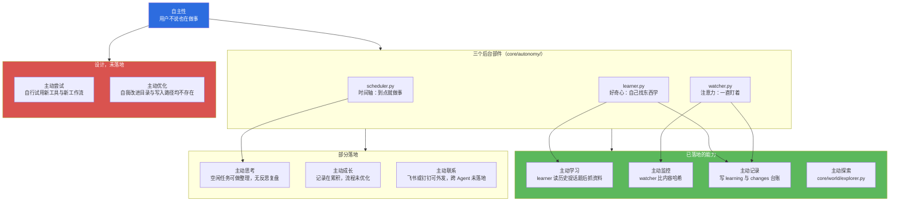
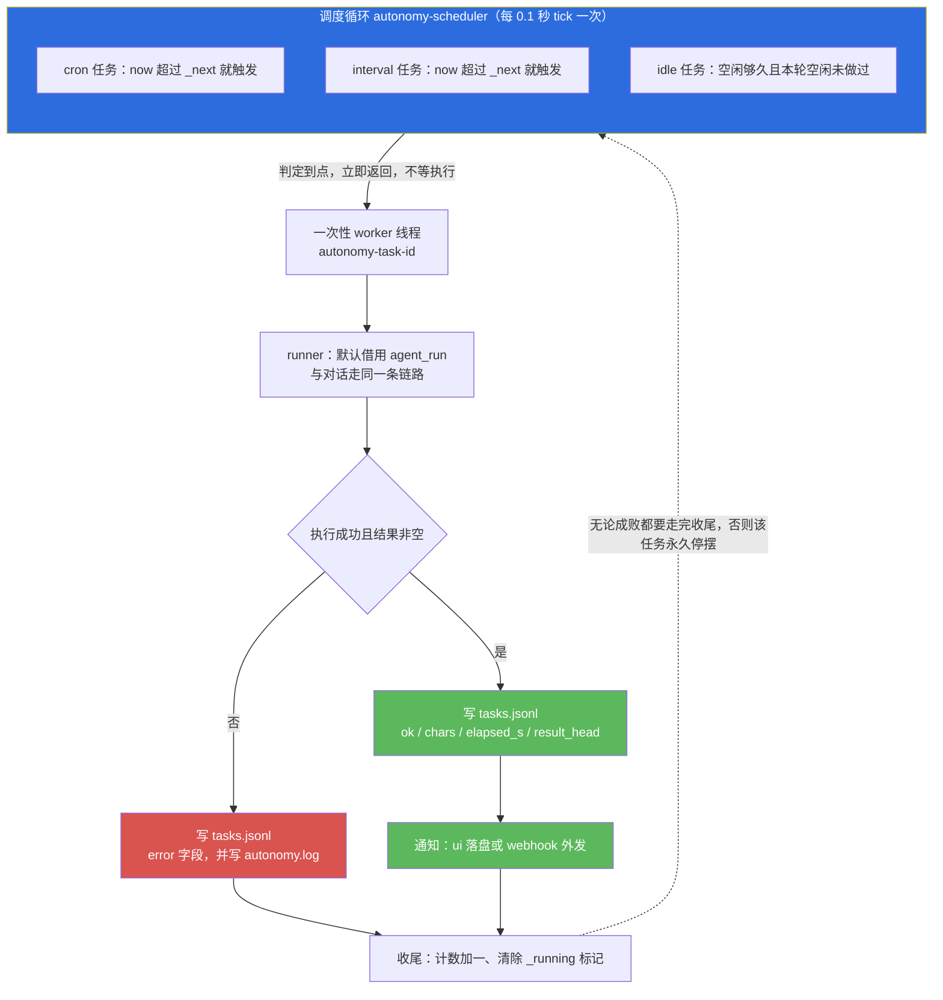
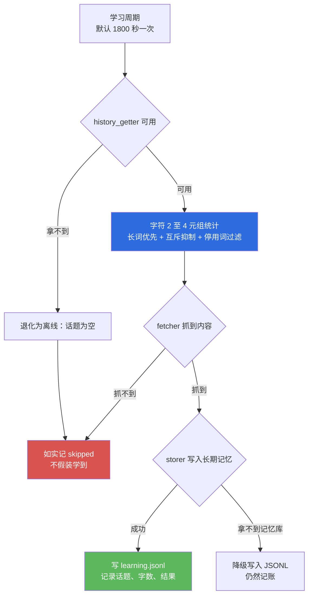
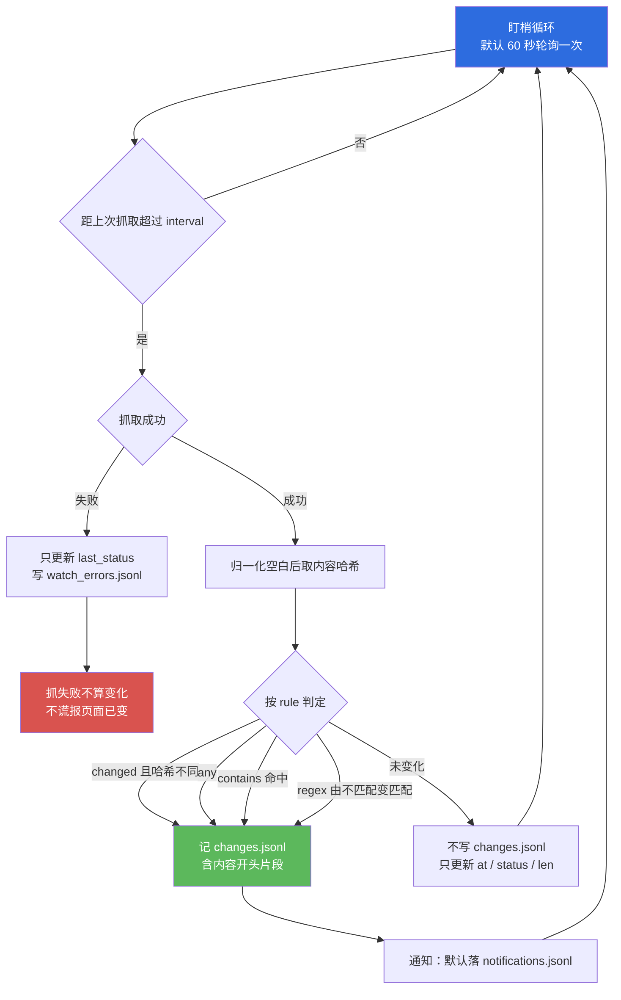

# 小焦 · 模块文档 05：自主性

> 本文说明一个问题：**用户不说话的时候，小焦在做什么。**
> 内容覆盖九项自主能力与三个后台部件的对应关系、触发机制、数据落盘、接口签名、使用示例，
> 以及尚未落地的部分（标注为「设计，未落地」）。
> 所有实测数字均来自 2026-09-14 在本机的真实运行，未实测的部分一律写明。

| 项 | 内容 |
| --- | --- |
| 文档名称 | 小焦 · 模块文档 05：自主性 |
| 适用版本 | v1.0 |
| 最后更新 | 2026-09-14 |
| 维护者 | 小焦项目 |
| 文档状态 | 稳定。未落地项集中在 7.2 节，逐条标注「设计，未落地」 |
| 对应测试 | `tools/test_autonomy.py` |
| 本次实测结果 | 通过 110 / 共 110（退出码 0，耗时 26.7s） |
| 实现主体 | `core/autonomy/`（`scheduler.py`、`learner.py`、`watcher.py`、`__init__.py`） |
| 阅读前置 | [`../design-philosophy.md`](../design-philosophy.md) 第四节与第二十一节 |

**术语表（首次出现即在此解释）**

| 术语 | 含义 |
|---|---|
| 小焦 | 本项目交付的本地 AI 助手。用户看到的整体叫「小焦」 |
| 载体 | 除模型以外的全部系统代码，即 `core/`、`plugins/`、`xiaojiao_app.py` 等。它提供记忆、工具、调度、校验、世界访问等能力 |
| 火种 | 可替换的模型。接入任一模型，系统即开始工作；更换模型，系统结构不变 |
| 自主性 | 载体在用户没有提出请求时，仍然主动执行的后台行为 |
| 后台部件 | 以守护线程（daemon thread，主进程退出即随之结束的线程）形式常驻运行的模块 |
| 守护线程 | 不阻止主进程退出、也不被主进程等待的线程。用于「做不做都不影响这一轮对话」的工作 |
| JSONL | 每行一条 JSON 记录的追加式文本文件。优点是追加不需要重写整个文件 |

---

## 目录

- [1. 摘要](#1-摘要)
- [2. 背景与问题](#2-背景与问题)
- [3. 设计目标](#3-设计目标)
- [4. 架构与原理](#4-架构与原理)
- [5. 接口与实现](#5-接口与实现)
- [6. 使用示例](#6-使用示例)
- [7. 边界与限制](#7-边界与限制)
- [8. 故障排查](#8-故障排查)
- [9. 参考](#9-参考)
- [变更记录](#变更记录)

---

## 1. 摘要

### 1.1 一句话定位

自主性模块让载体拥有一根自己的时间轴与自己的注意力：到了约定的时间就做事，用户安静下来就去学东西、盯页面，做完之后如实记账。

### 1.2 核心主张

**用户不说，也在做事。** 这句话在工程上有三层含义：

1. **触发不依赖对话。** 三种触发方式（cron 表达式、固定间隔、空闲时长）都在后台线程里判定，与「用户这一轮说了什么」无关。
2. **结果不依赖对话。** 后台任务的产出写入 `logs/autonomy/` 下的追加式文件，并可选推送到飞书或钉钉机器人；用户下一轮对话时不需要知道它跑过。
3. **失败不依赖对话。** 每一次失败都落到日志，不弹窗、不阻塞、不重试到死。

### 1.3 本文的读者与适用范围

本文面向三类读者：

- 部署与运维人员：需要知道开关在哪、数据落在哪、出错看哪个文件；
- 二次开发者：需要知道接口签名、扩展点、不能违反的约束；
- 评审人员：需要区分「已经跑起来的」与「只是设计好的」。

本文只描述 `core/autonomy/` 这一个包。世界层的自主探索（`core/world/explorer.py`）属于模块 06，本文只在对照表中提及。

---

## 2. 背景与问题

### 2.1 被动问答机的边界

只由用户请求驱动的系统有一个共同边界：**用户必须记得自己想要什么**。

- 用户说「帮我盯着这个页面，一有新版就告诉我」，系统抓一次就结束，用户需要自己每天回来问一遍；
- 用户在对话里反复提到某个技术话题，系统不会把这件事实转化为知识，除非用户明确要求「你去学一下」。

这两件事都不是模型能力问题。即使换成参数更大的模型，只要触发条件仍然写在对话里，行为就不会改变。

### 2.2 后台任务的三类工程风险

把行为搬进后台会引入三类风险，这三类风险决定了本模块的全部设计取舍。

| 风险 | 具体表现 | 本模块的应对 |
|---|---|---|
| 拖垮主对话 | 后台线程与对话共用进程与资源，一次卡住会连带卡住用户 | 后台任务一律守护线程；任务在独立 worker 线程中执行；主循环只负责判定「到点没有」 |
| 消耗用户资源 | 后台自行联网、自行调用模型，用户不知情时正在消耗带宽与额度 | `autonomy.enabled` 默认 `false`，用户不开启则不启动任何线程 |
| 网络调用悬空 | 一次没有超时的请求可以让后台线程长时间挂住 | 全部网络调用带超时（8 秒）；失败只更新状态并记日志，下一个周期再试 |

### 2.3 为什么默认关闭

`core/autonomy/__init__.py` 中的默认配置是：

```json
{
  "enabled": false,
  "tasks": [],
  "watchers": [],
  "webhooks": {},
  "learn_interval_s": 1800,
  "watch_poll_s": 60
}
```

默认关闭的理由是：后台会自行联网并调用模型。用户没有明确开启时，不应在后台消耗他的额度与带宽。需要说明的是，世界层的自主探索采用相反的默认值（`world.explore_enabled` 默认为 `true`，见 `core/world/explorer.py` 的 `DEFAULT_CFG`），两处口径不同，配置时以各自文件为准。

---

## 3. 设计目标

### 3.1 Goals（要达成的）

| 编号 | 目标 | 验收方式 |
|---|---|---|
| G1 | 到点就做事，且判定与对话无关 | `tools/test_autonomy.py` 第 1、2 节：注入假时钟，把 cron 的下一次触发断言到秒；interval 任务在真实后台线程里跑满两轮 |
| G2 | 用户安静下来才做自己的事，不打扰正在使用的用户 | 第 3 节：`touch()` 上报后 idle 任务不触发，空闲够久才触发 |
| G3 | 「一直盯」而非「盯一次」 | 第 4 节：用脚本自起的 `http.server` 当被测站点，连续多轮抓到变化 |
| G4 | 抓不到时如实记录，不假装学到 | 第 5 节：fetcher 全部替换为「返回空串」，断言记录 `skipped` 且不崩 |
| G5 | 一条坏配置只影响它自己 | 第 6 节：`tasks` 中混入非法项，合法项照常登记 |
| G6 | 启动幂等、停止可退出 | 第 7 节：重复 `start()` 返回 `False`；`stop()` 后线程数回落（实测 4 → 1） |
| G7 | 全程离线可测 | 自测脚本接触的网络仅限于它自己启动的本地 HTTP 服务，端口由系统分配 |

### 3.2 Non-Goals（明确不做的）

| 编号 | 不做的事 | 原因 |
|---|---|---|
| N1 | 不做常驻的分布式任务队列 | 单机本地助手，引入队列会带来部署与一致性的额外成本 |
| N2 | 不在默认状态下打开后台 | 见 2.3 |
| N3 | 不因为后台失败而重试到成功 | 一次失败即等待下一个周期。反复重试会持续消耗额度并放大对目标站点的压力 |
| N4 | 不让后台任务直接触发界面对话框 | 后台线程弹出确认框会让用户在没有操作的情况下看到提示，属于不可接受的交互 |
| N5 | 不删除任何文件 | 全项目的删除红线（见模块 06）。本模块的测试数据也只追加、不删除 |
| N6 | 不用规则推断任务语义 | 「含某关键词就走某路径」这类规则永远列不全。任务定义由用户显式写出 cron 或间隔 |

---

## 4. 架构与原理

### 4.1 九项自主能力与三个后台部件

设计文档列出九项自主能力（主动学习、主动探索、主动监控、主动记录、主动思考、主动尝试、主动成长、主动联系、主动优化）。它们在代码中的承担情况如下，未落地项如实标注。

| 序号 | 自主能力 | 承担部件 | 代码位置 | 状态 |
|---|---|---|---|---|
| 1 | 主动学习 | 学习者 | `core/autonomy/learner.py` | 已落地 |
| 2 | 主动探索 | 世界层探索器 | `core/world/explorer.py` | 已落地，详见 [`06-world.md`](06-world.md) |
| 3 | 主动监控 | 观察者 | `core/autonomy/watcher.py` | 已落地 |
| 4 | 主动记录 | 观察者与学习者 | `changes.jsonl`、记忆库写入 | 已落地 |
| 5 | 主动思考 | 调度器的空闲触发 | `core/autonomy/scheduler.py` | 部分落地：可配置空闲任务去整理、分析与总结；「反思复盘」没有独立实现 |
| 6 | 主动尝试 | 无 | 无 | 设计，未落地。当前没有「自行试用新工具、自行试验新工作流」的代码路径 |
| 7 | 主动成长 | 学习记录与世界模型累积 | `logs/autonomy/learning.jsonl`、`logs/world/model.json` | 部分落地：经验在累积，但「优化流程」没有实现 |
| 8 | 主动联系 | 通知通道 | `core/autonomy/scheduler.py` 的 `_default_notify` | 部分落地：飞书与钉钉机器人可主动外发；与外部 Agent 的双向交互未落地 |
| 9 | 主动优化 | 无 | 无 | 设计，未落地。自我改进目录与写入路径均不存在，详见 [`../design-philosophy.md`](../design-philosophy.md) 第十七节 |

三个后台部件只覆盖上表中的第 1、3、4、5、8 项及其部分形态。**把九项能力说成「全部已实现」是不准确的。**

### 4.2 三个后台部件与代码映射

**图 1 · 自主能力到后台部件的映射**

说明：本图给出九项能力各自是否有可运行的代码落点，颜色区分已落地与未落地。

代码位置索引：`core/autonomy/`、`core/world/explorer.py`



### 4.3 调度器：三种触发方式

`AutonomyScheduler` 是载体自己的时间轴。一条任务只使用一种触发方式，优先级为 cron 高于 interval 高于 idle。

| 触发方式 | 配置字段 | 语义 | 判定依据 |
|---|---|---|---|
| cron | `cron` | 5 段式表达式 `分 时 日 月 周`，支持 `*`、`*/n`、`a-b`、`a,b,c` | `next_run_from_sets()` 逐天跳进，找到第一个命中的整分钟 |
| interval | `interval_s` | 每 N 秒触发一次 | `_next` 时间戳 |
| idle | `idle_s` | 用户安静 N 秒之后触发一次 | 最近一次 `touch()` 的时间戳，且这一轮空闲只会做一次 |

日与周字段同时被限定时采用 OR 语义（`0 0 1 * 1` 表示每月 1 号或每周一），这与 POSIX cron 的传统一致。

**图 2 · 调度器的时间轴与执行路径**

说明：本图说明「到点」与「执行」为什么必须分开——判定在调度循环里，执行在一次性 worker 线程里，任何一条任务卡住都不会影响其他任务。

代码位置索引：`core/autonomy/scheduler.py`



关键取舍说明：

- **任务在独立 worker 线程中执行。** 若直接在调度循环里执行，一次 30 秒的网络请求会把 cron、interval、idle 三类判定一起卡住。
- **`_running` 标记防止并发重入。** 上一轮尚未结束的任务不会被再次触发。
- **收尾必须无条件执行。** 无论成功或失败，都会递增计数并清除 `_running`。否则一次失败会让任务永久停在运行态，此后不再触发。
- **通知只在有内容时发送。** 空的成功结果（例如「本轮没有新内容」）不打扰用户；失败只写日志，避免断网一晚累积大量失败通知。

### 4.4 学习者：从对话历史到长期记忆

`AutonomousLearner` 的循环是：读对话历史、提炼高频话题、主动抓取资料、写入长期记忆。

中文话题提取采用字符 2 至 4 元组（n-gram）加停用词过滤，不引入分词依赖。停用词分两张表：多字停用词按子串判定；单字虚词只在「整段全部由这些字组成」时判定为噪声。后者是踩坑后的修正——若把所有单字停用字都按子串过滤，「向量检索」会因为含「向」被判成噪声。

**图 3 · 学习闭环与三条降级路径**

说明：本图说明学习循环在拿不到历史、拿不到网络、拿不到记忆库三种情况下分别退化成什么行为，三种情况都不崩溃。

代码位置索引：`core/autonomy/learner.py`



三个接缝（读历史、抓取、写记忆）都允许「拿不到」，此时按离线模式运行。

### 4.5 观察者：四种变化判定

`AutonomousWatcher` 负责「一直盯」。判定规则由 `rule` 字段给出：

| rule 取值 | 触发条件 |
|---|---|
| `changed` | 归一化后的内容哈希发生变化。首次看到记 `first_seen` |
| `any` | 每次抓取都记一条 |
| `contains:关键词` | 新出现了该关键词。关键词消失后重置，下次再出现仍会报告 |
| `regex:正则` | 正则从不匹配变为匹配 |

无法识别的 `rule` 按 `changed` 处理并记一条警告。用户写错一个规则时，行为退化为保守的默认值，而不是静默失效。

**图 4 · 变化判定与两条诚实约束**

说明：本图说明「抓取失败」为什么不能计为「页面变化」——把网络故障记成内容变化会让用户去检查一个根本没有变的页面。

代码位置索引：`core/autonomy/watcher.py`



另外两条实现细节值得说明：

- 抓取不走宿主的工具层。宿主工具只返回前 2500 字，而盯梢依靠全文哈希判断变化，页面在第 3000 字之后发生变化就看不到；宿主工具还会改动全局状态并可能推送「待确认」提示，后台线程触发界面对话框不可接受。
- 中文站点的响应体不能直接用 `resp.text`。很多站点不声明 charset，此时 requests 按 ISO-8859-1 解码，中文变乱码，`contains:中文关键词` 永远命不中。因此统一走 `_resp_text()`：按响应头声明的编码、严格 UTF-8、自动推测编码、GB18030、替换式兜底依次尝试。

### 4.6 三条铁律与线程模型

三条铁律写在包级文档中，并在三个模块里一致执行：

1. **所有循环都是守护线程。** 主进程退出时它们自动结束，不会挂住 Flask 或网页端。
2. **每一步都吞异常并落日志。** 后台出错只意味着「少做一件事」，不影响用户这一轮对话。
3. **网络调用一律带超时，失败不重试到死。** 一次失败等下一个周期，不空转消耗资源。

线程命名与归属：

| 线程名 | 来源 | 生命周期 |
|---|---|---|
| `autonomy-scheduler` | `AutonomyScheduler.start()` | `start_all()` 至 `stop_all()` |
| `autonomy-learner` | `AutonomousLearner.start()` | 同上 |
| `autonomy-watcher` | `AutonomousWatcher.start()` | 同上 |
| `autonomy-task-<任务 id>` | 每次触发时临时创建 | 该次任务执行结束即退出 |

### 4.7 数据落盘

全部数据落在 `logs/autonomy/`（`logs/` 已被 `.gitignore` 忽略，不进入仓库）。

| 文件 | 内容 |
|---|---|
| `tasks.jsonl` | 每一次任务执行的记录：触发方式、是否成功、字符数、耗时、错误 |
| `learning.jsonl` | 每一轮学习周期的记录 |
| `changes.jsonl` | 盯梢发现的变化 |
| `logs/autonomy/watch_errors.jsonl` | 盯梢抓取失败 |
| `logs/autonomy/notifications.jsonl` | 默认通知落盘（网页端读取显示） |
| `logs/autonomy/watchers_state.json` | 每个盯梢对象的 `at`、`status`、`len`，是判断「它还在不在盯」的凭据 |
| `logs/world/explorer_state.json` | 世界层当日预算计数（属于世界层，见模块 06） |
| `logs/autonomy/autonomy.log` | 跳过与降级的说明，例如哪条任务因何被跳过 |

---

## 5. 接口与实现

### 5.1 文件与职责

| 文件 | 职责 | 是否依赖宿主 |
|---|---|---|
| `core/autonomy/__init__.py` | 配置读取、目录解析、JSONL 追加、宿主惰性获取、`start_all` / `stop_all` / `touch` | 否，宿主缺失时全部降级 |
| `core/autonomy/scheduler.py` | cron 解析、任务登记与校验、触发判定、执行与记账、通知 | 否，`_default_runner` 拿不到宿主时返回空串 |
| `core/autonomy/learner.py` | 话题提取、资料抓取、记忆写入 | 否，三个接缝均有离线实现 |
| `core/autonomy/watcher.py` | 盯梢登记、轮询抓取、变化判定、状态保存 | 否，抓取优先借宿主、其次 requests、最后 urllib |

### 5.2 关键函数签名

#### 5.2.1 包级入口

宿主只需调用这三个：

```python
start_all(cfg=None, learn_interval_s=None, watch_poll_s=None) -> dict
    # 按配置启动三个后台部件。autonomy.enabled 不为 True 时一个线程都不起。
    # 返回 {"enabled": bool, "scheduler": bool, "learner": bool, "watcher": bool}

stop_all(timeout=3) -> dict
    # 停掉 start_all 拉起的所有后台线程，有界等待。返回各部件是否退出。

touch() -> None
    # 上报「用户有交互」。宿主每收到一条用户消息调用一次，idle 任务据此判断是否该出现。
```

#### 5.2.2 纯函数

可单独测试，不依赖任何状态：

```python
parse_field(field, lo, hi) -> set[int]
parse_cron(expr) -> tuple[set, set, set, set, set]      # 格式非法抛 ValueError
next_run_from_sets(sets, after) -> float                # 找不到返回 0.0
looks_like_cron(expr) -> bool                           # 仅做输入提示，不承担校验职责
```

#### 5.2.3 调度器

```python
AutonomyScheduler(runner=None, notify=None, state_dir=None)
.add(task) -> bool                     # 校验并登记，非法任务返回 False 并记日志
.remove(tid) -> bool
.get(tid) -> dict | None
.next_run_after(task, after) -> float   # cron 的下一次触发时间戳
.touch() -> None                        # 上报用户交互
.tick(now=None) -> list                 # 单步推进，可注入假时钟
.run_now(tid) -> str                    # 手动触发一次，同步执行
.list_tasks() -> list
.start() -> bool                        # 幂等：已在运行返回 False
.stop(timeout=3) -> bool
.is_running() -> bool
.load_from_config(cfg=None) -> int      # 返回成功登记条数，坏一条只跳过那一条
.maybe_start(cfg=None, start_if_enabled=True) -> dict
get_scheduler(runner=None, notify=None, state_dir=None) -> AutonomyScheduler   # 进程内单例
```

#### 5.2.4 学习者

```python
AutonomousLearner(history_getter=None, fetcher=None, storer=None, state_dir=None)
.extract_topics(messages, top_n=8) -> list
.learn_once(topics=None) -> dict
.cycle() -> dict
.start(interval_s=1800) -> bool
.stop(timeout=3) -> bool
.is_running() -> bool
.stats() -> dict
```

#### 5.2.5 观察者

```python
AutonomousWatcher(fetcher=None, notify=None, state_dir=None)
.add(url, interval=3600, rule="changed", note="") -> bool
.remove(url) -> bool
.list_watchers() -> list
.check_once(now=None, force=False) -> dict
.start(poll_s=60) -> bool
.stop(timeout=3) -> bool
.load_from_config(cfg=None) -> int
content_hash(text) -> str               # 归一化后的 sha1
```

### 5.3 配置项

配置写在 `xiaojiao_control.json` 的 `autonomy` 段。该段不存在时使用默认值（全部关闭）。

```json
{
  "autonomy": {
    "enabled": true,
    "tasks": [
      {
        "id": "morning_news",
        "cron": "0 8 * * *",
        "prompt": "总结今天的科技新闻要点",
        "notify": "ui"
      },
      {
        "id": "idle_organize",
        "idle_s": 600,
        "prompt": "整理最近的对话要点",
        "notify": "ui"
      }
    ],
    "watchers": [
      { "url": "https://example.com/releases", "interval": 3600, "rule": "changed" }
    ],
    "webhooks": { "feishu": "", "dingtalk": "" },
    "learn_interval_s": 1800,
    "watch_poll_s": 60
  }
}
```

字段说明：

| 字段 | 含义 | 约束 |
|---|---|---|
| `enabled` | 总开关。为 `false` 时不启动任何后台线程 | 默认 `false` |
| `tasks[].id` | 任务标识，同时是日志里的记录名 | 必填。重复 id 会被忽略并记日志 |
| `tasks[].cron` | 5 段式 cron 表达式 | 与 `interval_s`、`idle_s` 三者取一 |
| `tasks[].interval_s` | 固定间隔秒数 | 下限 1 秒，上限 30 天 |
| `tasks[].idle_s` | 空闲触发秒数 | 需要宿主调用 `touch()` 才有意义 |
| `tasks[].prompt` | 交给 `agent_run` 的任务描述 | 空则任务执行结果为空白 |
| `tasks[].notify` | `ui`、`feishu`、`dingtalk` | 未配置 webhook 时降级为 `ui` 并记 `note` |
| `watchers[].rule` | `changed`、`any`、`contains:词`、`regex:正则` | 无法识别时按 `changed` 处理并记警告 |
| `webhooks` | 机器人地址 | 留空即不发 |

### 5.4 与宿主的接入点

宿主 `xiaojiao_app.py` 与自主性模块的接触面很小：

| 接触点 | 位置 | 作用 |
|---|---|---|
| 每条用户消息 | `from core.autonomy import touch as _auto_touch` | 上报「用户在交互」，idle 任务据此让路 |
| 后台执行 | `autonomy.__init__._app_module()` 惰性读取 `sys.modules` | 借用 `agent_run`，使后台任务与对话走同一条链路 |

`_app_module()` 只查 `sys.modules`，不主动 import。原因是主动 import 会在后台线程里执行宿主模块的加载副作用（加载模型、挂载媒体服务），并在以 `python xiaojiao_app.py` 启动时导入出第二份应用。

---

## 6. 使用示例

### 6.1 离线自测

不需要启动小焦、不需要模型、不需要外网。脚本接触的网络仅限于它自己启动的本地 HTTP 服务（端口由系统分配）。

```powershell
cd <仓库目录>
$env:PYTHONUTF8="1"
python tools/test_autonomy.py
```

实测结果（2026-09-14，本机）：

```
通过 110 / 共 110（耗时 26.7s）
EXIT=0
```

自测覆盖七组：cron 解析、真实 interval 任务、idle 任务的让路行为、盯梢（本地站点）、学习者的降级、坏配置隔离、单例与线程退出。

### 6.2 最小可运行配置

把下面内容写进 `xiaojiao_control.json`，再以正常方式启动小焦：

```json
{
  "autonomy": {
    "enabled": true,
    "tasks": [
      { "id": "ping_note", "interval_s": 300, "prompt": "用一句话汇报当前时间", "notify": "ui" }
    ],
    "watchers": [],
    "learn_interval_s": 1800,
    "watch_poll_s": 60
  }
}
```

启动后可以这样确认它在工作：

```powershell
Get-Content logs\autonomy\tasks.jsonl -Tail 3
Get-Content logs\autonomy\notifications.jsonl -Tail 3
```

实测（2026-09-14，本机，含自测追加记录）：`tasks.jsonl` 44 行，`notifications.jsonl` 45 行。这两个数字随运行持续增长，不是固定值。

### 6.3 代码内手动触发一次任务

下面这段可以复制运行，用于在不开启后台线程的情况下验证一条任务的配置是否合法：

```python
from core.autonomy.scheduler import AutonomyScheduler  # 运行前需先进入仓库根目录

s = AutonomyScheduler(state_dir="logs/autonomy/_manual")
print("登记：", s.add({
    "id": "manual_demo",
    "cron": "*/15 * * * *",
    "prompt": "汇报一次时间",
    "notify": "ui",
}))
print("任务清单：", s.list_tasks())
print("立即执行一次：", s.run_now("manual_demo")[:60])
```

说明：`run_now()` 不会启动任何后台线程，也不会调用模型。它执行的是 `runner`，默认 runner 在宿主不存在时返回空串并如实记录。要验证真实问答链路，需要在小焦进程内运行。

### 6.4 验证「不打扰正在使用的用户」

idle 任务的行为可以直接观察：

1. 配置一条 `idle_s` 为 300 的任务；
2. 通过网页端持续对话，宿主每收到一条消息就会调用 `touch()`；
3. 在持续对话期间查询 `logs/autonomy/tasks.jsonl`，看不到这条任务的执行记录；
4. 停止对话并等待超过 300 秒，再次查询，可以看到执行记录。

自测中对应的断言输出为：`空闲 0s < 300s` 时不探索，空闲够久才触发。

---

## 7. 边界与限制

### 7.1 已确认的工程边界

| 边界 | 说明 |
|---|---|
| cron 粒度是分钟 | 秒字段一律归零，`after=12:34:56` 的下一次必然不早于 12:35:00 |
| cron 搜索上限 1500 天 | 覆盖 2 月 29 日这类四年一次的日期组合。超出上限返回 0.0，表示为「不知道下一次」 |
| 单条任务超时阈值 300 秒 | 仅记日志，不中断执行。超过该值时执行记录里的 `elapsed_s` 会明显偏大 |
| 状态不跨进程恢复 | 调度器与盯梢状态保存在内存与状态文件里，进程被强制结束后，未执行完的周期不会补跑 |
| 依赖宿主上报 `touch()` | 宿主不调用 `touch()` 时，idle 任务永远不会触发（`_last_touch` 为 `None` 时直接不触发，不擅自开工） |
| 配置读取容错优先 | 控制文件损坏时按默认值处理（等于全关），不抛异常。代价是配置错误会表现为「后台没反应」而不是报错 |
| 通知失败不影响任务结论 | 通知异常只写日志，任务仍记为成功 |

### 7.2 未落地的部分

| 项目 | 状态 | 说明 |
|---|---|---|
| 主动尝试（自行试用新工具、新工作流） | 设计，未落地 | 仓库内没有对应的代码路径 |
| 主动优化（自我改进） | 设计，未落地 | `logs/self_improve/` 目录与写入路径都不存在。全仓库检索 `self_improve` 无结果 |
| 与外部 Agent 的双向交互 | 设计，未落地 | 当前只有单向通知通道（飞书、钉钉机器人） |
| 任务间依赖与编排 | 设计，未落地 | 一条任务只使用一种触发方式，任务之间没有先后关系 |
| 后台任务的持久化队列 | 设计，未落地 | 无队列，进程退出即停止调度 |
| 反思复盘 | 设计，未落地 | 空闲任务可以执行用户写的提示词，但载体没有内建的复盘流程 |

### 7.3 实测数字与口径

以下数字均为 2026-09-14 在本机的实测结果。涉及日志行数的数字随运行持续增长，仅表示当时的规模。

| 项目 | 数字 | 来源 |
|---|---|---|
| `tools/test_autonomy.py` | 通过 110 / 共 110，耗时 26.7s，退出码 0 | 本次实跑 |
| 启动后线程数 | 1 → 4（三个后台部件加上主线程） | 自测输出 |
| `stop_all()` 后线程数 | 4 → 1 | 自测输出 |
| `enabled=false` 时的启动结果 | `{'enabled': False, 'scheduler': False, 'learner': False, 'watcher': False}` | 自测输出 |
| 自测运行后的 `changes.jsonl` | 124 条 | 自测输出 |
| 自测运行后的 `watch_errors.jsonl` | 14 条 | 自测输出 |
| 自测运行后的 `learning.jsonl` | 14 条 | 自测输出 |
| `logs/autonomy/tasks.jsonl` | 44 行 | 本次实测 |
| `logs/autonomy/notifications.jsonl` | 45 行 | 本次实测 |
| cron 断言 | 4 组表达式全部断言到秒，另加「正好在触发点上顺延」1 组 | 自测输出 |

未实测的项目：后台任务在长时间（小时级）连续运行下的稳定性、多进程并发启动时的互斥行为，均未做过实验。

---

## 8. 故障排查

| 症状 | 可能原因 | 处理方式 |
|---|---|---|
| 后台什么都不做 | `autonomy.enabled` 不是 `true` | 检查 `xiaojiao_control.json` 的 `autonomy` 段。该段缺失时默认全关 |
| 某个任务从来不触发 | cron 非法、interval 太小或太大、缺少触发字段 | 查看 `logs/autonomy/autonomy.log`，跳过原因写在那里 |
| 任务只执行一次就再也不执行 | 任务未走完收尾，`_running` 停在 `True` | 这一步在代码里已强制无条件执行；若仍然出现，检查 worker 线程是否被外部强杀 |
| 收到重复通知 | 起了两个调度器实例 | 使用 `get_scheduler()` 单例，不要自行构造 |
| 用户正在对话时被打扰 | idle 任务未收到 `touch()` | 确认宿主每条消息都调用 `autonomy.touch()` |
| 中文关键词规则永不命中 | 响应体按 ISO-8859-1 解码成乱码 | 已经统一走 `_resp_text()`。若自行扩展抓取逻辑，注意不要回退到 `resp.text` |
| 页面没有变化却收到大量通知 | 站点每次请求都变动时间戳 | `changed` 规则已做空白归一化。仍有抖动时可改用 `contains:关键词` |
| 飞书或钉钉没有收到消息 | webhook 未配置 | 通知会降级为 `ui`，并在 `notifications.jsonl` 的 `note` 字段如实写明降级原因 |
| `stop_all()` 后线程数没有回落 | 某条任务正卡在网络请求上 | `stop()` 使用有界等待，最多拖 `timeout` 秒；守护线程最终随主进程退出 |
| 后台报错但对话正常 | 这是预期行为 | 三条铁律中的第二条：后台异常被吞掉并记日志，不影响对话 |

---

## 9. 参考

| 文档 | 内容 |
|---|---|
| [`../design-philosophy.md`](../design-philosophy.md) | 第四节（自主性）、第二十一节（并发与状态一致性） |
| [`../architecture-diagrams.md`](../architecture-diagrams.md) | 图 8（自主性 + 世界层）、图 19（并发与状态一致性） |
| [`06-world.md`](06-world.md) | 世界层：主动探索的落点 |
| [`../architecture.md`](../architecture.md) | 系统总体架构 |
| [`../testing-report.md`](../testing-report.md) | 测试报告与口径 |
| `core/autonomy/__init__.py` | 三条铁律与包级入口的完整说明 |
| `core/autonomy/scheduler.py` | cron 解析与调度实现 |
| `core/autonomy/learner.py` | 话题提取与学习循环 |
| `core/autonomy/watcher.py` | 盯梢与变化判定 |
| `tools/test_autonomy.py` | 离线自测（110 项） |

---

## 变更记录

| 版本 | 日期 | 变更内容 | 作者 |
|---|---|---|---|
| v1.0 | 2026-09-14 | 首次发布。覆盖九项自主能力对照、三个后台部件、四张流程图、接口签名、配置与故障排查；7.2 节列出 6 项未落地内容 | 小焦项目 |
