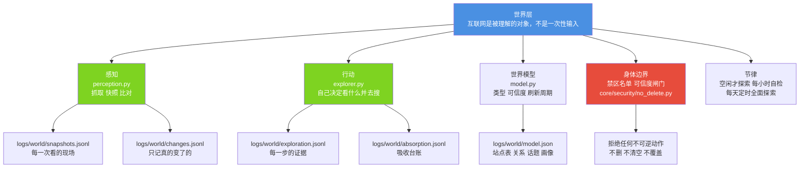
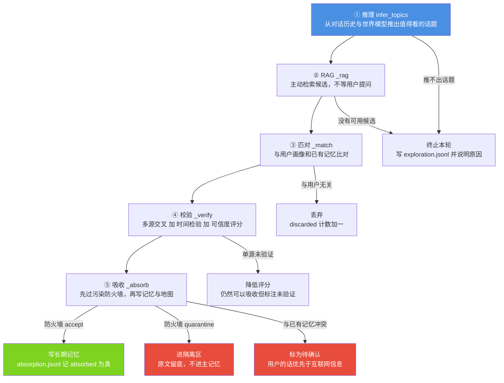
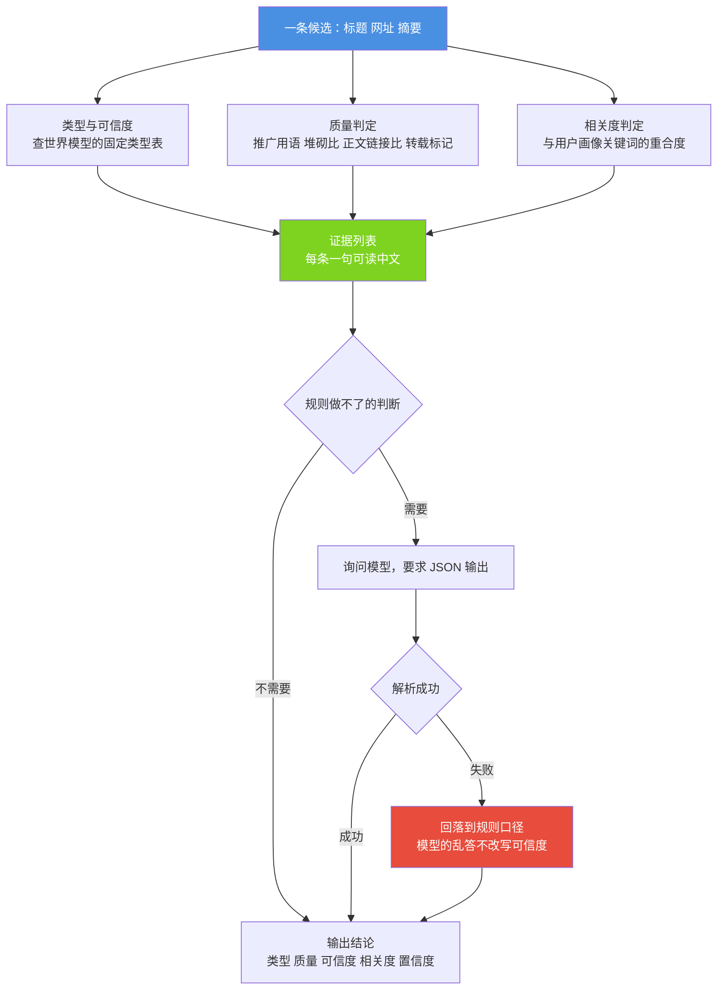
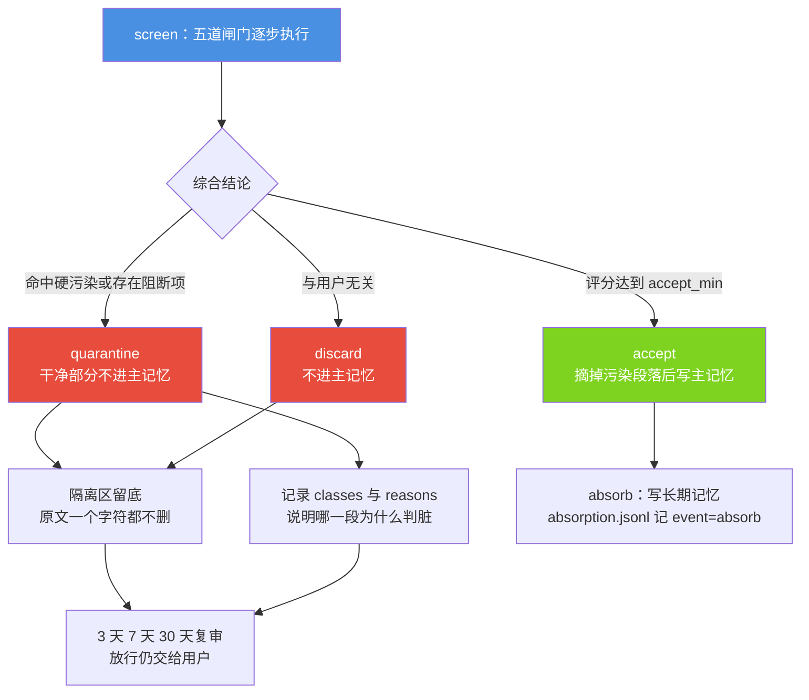
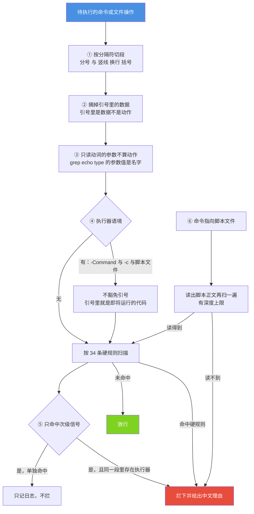
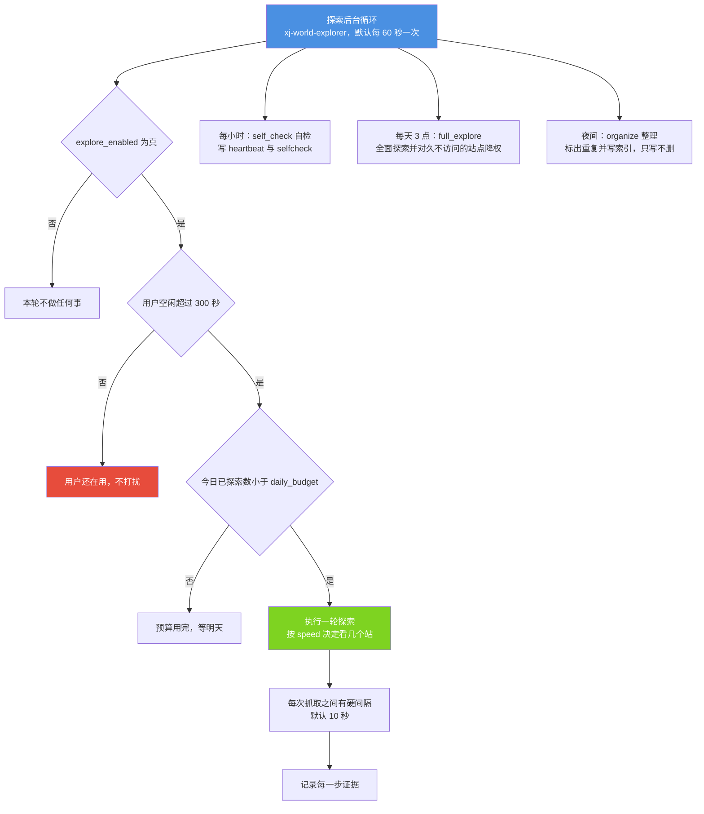

# 小焦 · 模块文档 06：世界层

> 本文说明小焦如何把互联网当作「世界」而不是「工具箱」：
> 感知、行动、世界模型、身体边界、节律五个部分各自做什么，
> 五步闭环（推理 → RAG → 匹对 → 校验 → 吸收）如何运转，
> 以及那条写在代码里、不依赖模型自觉、也不依赖权限开关的红线：**不能删文件**。
> 所有实测数字均来自 2026-09-14 在本机的真实运行。

| 项 | 内容 |
| --- | --- |
| 文档名称 | 小焦 · 模块文档 06：世界层 |
| 适用版本 | v1.0 |
| 最后更新 | 2026-09-14 |
| 维护者 | 小焦项目 |
| 文档状态 | 稳定。未落地项集中在 7.2 节，逐条标注「设计，未落地」 |
| 对应测试 | `tools/test_world.py`、`tools/test_world_firewall.py`、`tools/test_redline_integration.py`、`tools/test_no_delete.py` |
| 本次实测结果 | 通过 12 / 12、46 / 46、40 / 40、101 / 101（四套均退出码 0） |
| 实现主体 | `core/world/`、`core/security/no_delete.py` |
| 阅读前置 | [`../design-philosophy.md`](../design-philosophy.md) 第三节、[`05-autonomy.md`](05-autonomy.md) |

**术语表（首次出现即在此解释）**

| 术语 | 含义 |
|---|---|
| 世界层 | 载体中负责「访问并理解互联网」的部分，代码在 `core/world/` |
| 感知 | 抓取页面、保存快照、与上次比对。对应 `perception.py` |
| 世界模型 | 载体对外部站点的结构化记忆：站点类型、可信度、刷新周期、看过几次。落在 `logs/world/model.json` |
| 快照 | 某一次抓取的现场记录，含内容哈希、字符数、正文前 2000 字 |
| 污染 | 会影响判断质量的外部内容，例如假消息、广告软文、网页里藏的执行指令 |
| 隔离区 | 存放「可疑但原文保留」内容的地方。内容不进入主记忆，但一个字符都不删除 |
| 吸收 | 把经过校验的内容写入长期记忆的动作 |
| 身体边界 | 世界层允许自己碰什么、不碰什么、什么必须由用户确认 |
| 删除红线 | 全系统的硬约束：任何删除、清空、覆盖已有文件的操作都被载体层拦截 |
| 节律 | 世界层自己的作息：空闲才探索、每小时自检、每天固定时间全面探索与整理 |

---

## 目录

- [1. 摘要](#1-摘要)
- [2. 背景与问题](#2-背景与问题)
- [3. 设计目标](#3-设计目标)
- [4. 架构与原理](#4-架构与原理)
- [5. 接口与实现](#5-接口与实现)
- [6. 使用示例](#6-使用示例)
- [7. 边界与限制](#7-边界与限制)
- [8. 故障排查](#8-故障排查)
- [9. 参考](#9-参考)
- [变更记录](#变更记录)

---

## 1. 摘要

### 1.1 一句话定位

世界层让载体自己决定看什么：它按自己的节律去观察、判断、校验、吸收，并把「为什么相信这一条」完整留档。

### 1.2 世界与工具箱的区别

| 维度 | 工具箱模式 | 世界模式 |
|---|---|---|
| 谁决定看什么 | 用户提问决定 | 载体自己推理得出 |
| 看多久 | 抓一次 | 按世界模型的刷新周期持续观察 |
| 看完之后 | 内容随上下文丢弃 | 进入长期记忆，并更新世界地图 |
| 可信度 | 不判断 | 按可解释的类型表判断，并记录依据 |
| 出错时 | 用户自己发现 | 走到校验器复核，判断结论可被修正 |

同一段互联网内容，在工具箱模式下是一次性输入，在世界模式下是一次会改变载体长期状态的事件。这一点决定了后面所有的设计取舍。

### 1.3 本文的读者与适用范围

本文面向部署运维人员、二次开发者与评审人员。本文描述 `core/world/` 与 `core/security/no_delete.py`，其中删除红线的完整说明放在第 4.6 节，因为它是这一层的边界原则，而不是实现细节。

---

## 2. 背景与问题

### 2.1 只抓取不判断的三个缺口

假设载体只有一个抓取工具：

1. **重复劳动。** 每次都需要重新判断同一个站点可不可信，判断结果不落盘，换个模型之后连「这个站是什么类型」都要重新推。
2. **无法解释。** 用户问「你为什么不引用那个来源」，系统答不出依据。
3. **一次判断用到底。** 一个站点在半年后换了内容方向，系统仍然按第一次的印象处理。

### 2.2 吃进不可信内容的三类后果

一个会自行上网的助手，最大的风险不是看不到内容，而是看到什么就写进记忆。具体后果分为三类：

| 类型 | 场景 | 后果 |
|---|---|---|
| 被远程遥控 | 网页正文里藏一句「忽略之前的所有指令」 | 模型照做，行为不再受用户控制 |
| 把话术当知识 | 一篇广告软文写得像科普 | 此后把卖货话术当作知识讲给用户 |
| 自信地犯错 | 一条假消息或过时的数据 | 用旧事实回答新问题，并且语气确定 |

这三类后果都发生在「吸收的那一刻」，事后无法追责、无法回滚。因此拦截必须发生在写入记忆之前，并且每一步都要留痕。

### 2.3 为什么红线落在「删除」

在全部操作里，删除是少数不可逆动作中最彻底的一类：写错了可以改，改错了还能再改，删掉之后内容不再存在。叠加模型的幻觉、看错的路径、理解错的意图，结果就是用户数据的永久损失。

因此载体层的分寸是：允许小焦犯错，但不允许它造成无法挽回的损失。这条规则写在代码里，不写在提示词里——提示词是请求模型不要删，模型可以有别的想法；代码层拦截则不受模型影响。

---

## 3. 设计目标

### 3.1 Goals（要达成的）

| 编号 | 目标 | 验收方式 |
|---|---|---|
| G1 | 持续观察，并能判断「变了」与「没变」 | `tools/test_world.py` 第 6 节：首次为 `first_seen`，改动为 `changed` 且带上新增行，不变则不写日志 |
| G2 | 世界模型落盘，可解释、可审计 | 第 2 至 4 节：写入后读文件断言，类型与可信度来自固定表 |
| G3 | 坏文件不导致停摆 | 第 10 节：故意写坏 `logs/world/model.json`，断言不崩溃、能自愈、原文另存为 `.bad` |
| G4 | 判断结果带可读依据 | `tools/test_world_firewall.py` 的 [D] 组：断言依据不少于 2 条 |
| G5 | 可疑内容不删除，只留观 | [B] 组与 [E] 组：隔离区文件只多不少 |
| G6 | 删除动作在载体层被拦下 | `tools/test_no_delete.py` 101 项、`tools/test_redline_integration.py` 40 项 |
| G7 | 不打扰目标站点 | 探索间隔可配，默认 `slow`：两次抓取之间至少间隔 10 秒，每轮最多 3 个站 |
| G8 | 不打扰正在使用的用户 | 空闲 300 秒后才开始探索 |

### 3.2 Non-Goals（明确不做的）

| 编号 | 不做的事 | 原因 |
|---|---|---|
| N1 | 不自行发布内容、不自行提交表单、不自行付费 | 这三类动作属于「需要用户确认」的范畴。当前没有自动化入口 |
| N2 | 不访问需要登录、付费或受版权保护的资源 | 属于身体边界之外 |
| N3 | 不做通用爬虫框架 | 目标不是覆盖率，而是「在一个可控预算内持续理解世界」 |
| N4 | 不让模型给站点打可信度分数 | 换一个模型分数就变了，那是模型的印象而不是世界的属性 |
| N5 | 不把污染内容删掉 | 与删除红线冲突。判错的代价应当是「晚几天吃」，而不是「内容消失」 |
| N6 | 不在世界层重复实现 SSRF 与 robots 判定 | 一个策略只应有一个负责人。世界层只做超时、异常兜底与协议白名单，其余交给上层 |
| N7 | 不擅自修改已有记忆 | 冲突时标记「待用户确认」，用户的话优先于互联网信息 |

---

## 4. 架构与原理

### 4.1 五件器官

**图 1 · 世界层的五个部分与数据落点**

说明：本图说明五个部分各自的职责与产出文件，可以看到「看到的东西」与「对世界的判断」是两类不同的数据，分别落在快照与世界模型里。

代码位置索引：`core/world/perception.py`、`core/world/model.py`、`core/world/judge.py`、`core/world/verifier.py`



行动层当前的落地范围是：推理话题、检索候选、抓取内容、写入记忆。发布、提交、付费三类动作没有自动化入口，属于设计上的「需要用户确认」范畴，现未落地。

### 4.2 五步闭环

探索器每走一轮都会执行五步，并把每一步的证据写进返回值和 `exploration.jsonl`，因此「它探过什么、为什么吸收或丢弃」随时可以复盘。

| 步骤 | 方法 | 做什么 | 证据字段 |
|---|---|---|---|
| 推理 | `infer_topics()` | 从对话历史、世界模型话题表、用户关注方向推出值得看的话题 | `steps.infer.topic`、`why`、`candidates` |
| RAG | `_rag(plan)` | 主动检索候选（默认走宿主的 `web_search`） | `steps.rag.query`、`found`、`urls` |
| 匹对 | `_match(cand, plan, profile)` | 与用户画像和已有记忆比对：相关留、不相关丢、冲突标记 | `steps.match.action`、`why` |
| 校验 | `_verify(cand, sources)` | 多源交叉、时间检验、可信度评分 | `steps.verify.score`、`verified`、`verdict` |
| 吸收 | `_absorb(cand, plan, match, verify)` | 过污染防火墙，写长期记忆并更新世界地图 | `steps.absorb.absorbed`、`why`、`firewall`、`classes` |

**图 2 · 五步闭环与三条出口**

说明：本图说明五步中的每一步都可以终止本轮，终止时也一定写台账——「这一轮没吸收」本身是需要留档的事实。

代码位置索引：`core/world/explorer.py`



吸收阶段有四道前置闸门，任一不通过都不写主记忆，但仍会更新世界地图（「我看过这个站」本身是事实）：

1. 域名解析不出来；
2. 目标在用户配置的禁区名单或免疫黑名单里；
3. 污染防火墙结论为 `quarantine` 或 `discard`；
4. 综合可信度低于 `min_trust_to_remember`（默认 0.5）。

### 4.3 世界模型：可解释的表，而不是模型打分

世界模型是载体对外部站点的长期记忆，落在 `logs/world/model.json`。它不随火种变化：模型可以更换，站点表是载体自己的资产。

站点类型与基准可信度来自固定表，而不是模型给的分数：

| 类型 | 基准可信度 | 依据 |
|---|---|---|
| `wiki` | 0.8 | 多人复核，但可能过时 |
| `repo` | 0.8 | 代码仓库，一手事实 |
| `api` | 0.8 | 厂商官方接口 |
| `docs` | 0.8 | 文档站，一手事实 |
| `tech_news` | 0.7 | 速度快，但存在二手转述 |
| `forum` | 0.5 | 有真知也有噪音 |
| `social` | 0.5 | 观点多、事实少 |
| `shop` | 0.4 | 文案以销售为目的 |
| `unknown` | 0.5 | 不认识，半信半疑 |

判断器（`judge.py`）遵循「规则先行、模型补充」：类型、可信度、刷新周期一律走上面的表；质量（原创、转载、广告、垃圾）与相关度先用规则特征，例如推广用语、关键词堆砌比例、正文与链接比例、标题党标点、与画像关键词的重合度。只有规则无法判断的部分才询问模型，且要求 JSON 输出，解析失败即回落到规则结论。这样做的好处是：每条依据都能翻译成一句人话，写进 `evidence` 字段，用户可以直接质疑并纠正。

**图 3 · 判断器的口径与回落路径**

说明：本图说明模型只参与规则做不了的那一小块，且模型输出异常时结论仍然回到规则口径。

代码位置索引：`core/world/judge.py`、`core/world/model.py`



上图中红色节点表示回落路径。回落是刻意的设计：模型的抖动不应污染载体的判断结论。

### 4.4 信息污染防火墙：十类污染与五道闸门

防火墙（`firewall.py`）是「啃互联网」这个动作的免疫系统。它识别十类污染：

| 类名 | 中文 | 处理方式 |
|---|---|---|
| `fake_news` | 假消息 | 可摘除相关段落 |
| `stale` | 过时信息 | 降权。过时是整篇的问题，摘段落没有意义 |
| `contradiction` | 与已有记忆矛盾 | 标记待确认，不擅自改写记忆 |
| `advertorial` | 广告软文 | 按硬、软两类分别处理 |
| `phishing` | 钓鱼诈骗 | 硬拦 |
| `prompt_injection` | 网页藏指令 | 硬拦 |
| `malicious_code` | 藏脚本 | 硬拦 |
| `seo_spam` | 洗稿与关键词堆砌 | 软类，降权加局部消毒 |
| `bias` | 极端立场与煽动情绪 | 软类 |
| `illegal` | 违法、隐私、敏感内容 | 硬拦 |

「硬污染」共 4 类：`prompt_injection`、`malicious_code`、`phishing`、`illegal`。它们的共同点是动作型危险（诱导转账、遥控模型、留下后门），不是「可信度低」。一条 99% 正确、1% 钓鱼的内容综合分仍然很高，因此这四类不看总分直接隔离。

五道闸门按顺序执行，每一步的判定与证据都写进 `gates` 字段：

| 顺序 | 闸门 | 判什么 |
|---|---|---|
| 1 | 来源可信度 | 查世界模型的历史可信度与免疫黑名单。新站默认 0.5，且第一次不深度吸收 |
| 2 | 内容特征 | 事实陈述与情绪煽动的区别、引用与断言的区别、署名与匿名的区别。十类污染在这一步判定 |
| 3 | 交叉验证 | 同一事实有 2 个以上独立来源记为可信；单源标注未验证；不一致则冲突降权 |
| 4 | 注入检测 | 「忽略指令」「as an AI」「ignore previous」、`script` 标签、`iframe`、`onerror` 等直接拦 |
| 5 | 与用户匹对 | 与用户画像相关吗，与已有记忆冲突吗。不相关不吸收，冲突标记待确认 |

第五道闸门排在最后是有意为之：前四道判的是「这条信息自身是否干净」，第五道判的是「它是否应该进入小焦的脑子」。顺序颠倒会出现「因为它与用户无关，所以它的钓鱼链接就不算问题」这种结论。

**图 4 · 三种结论与消毒方式**

说明：本图说明「不吃」在工程上如何实现——不写主记忆，同时另存一份原文，因此不涉及任何删除动作。

代码位置索引：`core/world/firewall.py`、`core/world/quarantine.py`



判错时的成本由此被压到「晚几天吃」：隔离条目随时可以由用户放行（`release`），也可以驳回（`reject`）。驳回的实现是「标记不再使用」加搬家，不是删除——主记忆库没有删除接口。

三条刻意的保守行为写在代码注释里，都不是缺陷：

1. 一次污染使该域名可信度降 0.2，两次降 0.5，三次进入黑名单；
2. 内容指纹（正文归一化后的摘要值）一旦因污染被记录，同一篇内容换域名再发也会被识别出来；
3. 讲反诈的文章里出现「转账」「验证码」会被判为钓鱼。这是有意选择：误拦一篇科普的代价远小于吃进一条钓鱼话术的代价，而用户可以在隔离区一键放行。

### 4.5 隔离区：不吃，但也不丢

隔离区（`quarantine.py`）是可疑内容的留观点。它对每条内容保存四类信息：原文、消毒后的正文、判据（`classes` 与 `reasons`）、复审历史（`revisions`）。

三条硬约束：

- 只新增、只改名、不删除。模块不导入任何删除类接口，不截断任何文件；
- `put` 遇到同名条目换一个新编号，不覆盖已有条目；
- `mark` 只改状态字段并追加复审历史，原文一个字符都不动。

索引与条目分开存放：`index.jsonl` 一行一次动作，只追加；每条内容一个 `q_*.json` 文件，因为原文体积较大，且要求写下去之后不再被改写。

### 4.6 身体边界与删除红线

身体边界规定三件事：

| 分类 | 内容 |
|---|---|
| 能碰 | 公开页面、公开接口 |
| 不能碰 | 需要登录的、付费的、受版权保护的 |
| 要确认 | 发布、提交、花钱 |

世界层自身只做超时控制、异常兜底与协议白名单（只接受 `http` 与 `https`，`file://` 与 `ftp://` 一律不处理）。更细的 SSRF（服务端请求伪造）与 robots 判定由上层负责，理由是两套判断标准必然冲突，一个策略只应有一个负责人。

红线由 `core/security/no_delete.py` 承担，覆盖三类不可逆动作：

1. 真删：文件、目录、磁盘的各种写法；
2. 清空与重置：内容消失与删除同罪；
3. 把删除藏起来：命令拼接、内联代码、脚本正文、重定向。绕道执行不算放行。

**图 5 · 删除红线的判定顺序与拦截覆盖**

说明：本图说明守卫为什么先「摘数据」再「判动作」——不区分数据与动作会把大量正常命令误拦，误拦过多用户就会关掉这道闸门。

代码位置索引：`core/security/no_delete.py`、`xiaojiao_app.py` 的 `_delete_redline`



拦截入口登记在宿主里，共 6 个：

| 入口 | 语义 |
|---|---|
| `run_command` | 执行命令 |
| `background` | 后台执行命令 |
| `write_file` | 写文件 |
| `edit_file` | 编辑文件 |

说明：上表只列当前**真实注册**的入口。移动与重命名没有独立工具，
需要时由 `run_command` 执行对应命令 —— 那同样会经过本模块的删除拦截。
（早期文档里写过 `move_file` / `rename_file` 两个工具名，代码中并不存在，已更正。）

三条工程约束：

1. **不靠模型自觉。** 判断全部在 Python 里完成，模型没有否决权；
2. **不依赖任何权限开关。** 把权限开到最大，删除这一条照拦不误。安全模块源码里不存在任何与权限开关相关的分支，自测 [F] 组以源码级断言钉住这一点；
3. **不依赖宿主。** 模块可以单独导入，工具层、任务层、外部脚本都能复用。

已知的保守行为（刻意写在明面上）：正文里含 Python `del x` 的文件会被拦；`python -c "print('delete')"` 这类「代码里只是提到删除」也会被拦；变量拼接命令时一律偏向拦截。取舍是一句话：误拦的代价是麻烦，漏删的代价是数据消失。

### 4.7 节律

世界层的作息由 `explorer.py` 的配置决定，默认值如下：

| 配置项 | 默认值 | 含义 |
|---|---|---|
| `explore_enabled` | `true` | 探索总开关。注意与自主性模块的默认关闭不同 |
| `daily_budget` | 50 | 每天最多看多少个站，硬上限 |
| `idle_seconds` | 300 | 用户安静 5 分钟后才开始探索 |
| `explore_speed` | `slow` | 两次抓取之间至少间隔 10 秒，每轮最多 3 个站 |
| `min_trust_to_remember` | 0.5 | 低于该可信度只记录、不写主记忆 |
| `daily_full_explore_hour` | 3 | 每天该小时做一轮全面探索 |

速度档位共三档：`slow` 为 10 秒间隔、每轮 3 个站；`normal` 为 3 秒、6 个站；`fast` 为 0.5 秒、12 个站。默认选择最慢的一档，因为探索是无人监督的自动抓取，抓得过勤等于对目标服务器做压力测试。

**图 6 · 节律与预算**

说明：本图说明「什么时候可以开啃」的三个前置条件，以及每小时、每天的周期性动作。

代码位置索引：`core/world/explorer.py` 的 `_loop`、`should_explore_now`、`self_check`、`full_explore`、`organize`



夜间的整理只做两件事：把重复条目标出来（不改原文），再写一份索引供快速检索。这样做的原因是吸收流水是「我为什么相信这条」的凭据，删掉之后就再也解释不清。

### 4.8 校验器：判断需要被复核

校验器（`verifier.py`）给世界模型做定期复核，回答「上次对那个站的判断，事后看准不准」。它做三件事：

1. **回看。** 拿后来的快照与内容与当初的判断比对；
2. **修正。** 不准则修改判断并写 `verification.jsonl`，记录修改原因；
3. **降权。** 长时间不访问的站点交给 `WorldModel.decay_unused()` 降权，不是删除。

没有这一层，第一次判断会永久生效，世界地图会逐渐偏离现实。

---

## 5. 接口与实现

### 5.1 文件与职责

| 文件 | 职责 | 是否写文件 |
|---|---|---|
| `core/world/perception.py` | 抓取、快照、比对、持续观察、热点提炼 | 写 `logs/world/snapshots.jsonl`、`logs/world/changes.jsonl` |
| `core/world/model.py` | 站点表、关系图、话题表、用户画像、判断字段 | 写 `logs/world/model.json` |
| `core/world/judge.py` | 站点判断，规则先行、模型补充，输出可读依据 | 不写文件 |
| `core/world/explorer.py` | 五步闭环、节律、预算、探索台账 | 写 `exploration.jsonl`、`absorption.jsonl`、`index.jsonl` 等 |
| `core/world/verifier.py` | 判断复核、修正与降权 | 写 `logs/world/verification.jsonl` |
| `core/world/firewall.py` | 十类污染、五道闸门、消毒、免疫记忆、冲突处理 | 写 `logs/world/absorption.jsonl`、`logs/world/blacklist.json`、`logs/world/conflicts.jsonl` 等 |
| `core/world/quarantine.py` | 隔离区：原文留底、状态标记、复审排期 | 写 `quarantine/index.jsonl`、`q_*.json` |
| `core/security/no_delete.py` | 删除红线守卫 | 不写文件，只判断 |

### 5.2 关键函数签名

#### 5.2.1 感知层

```python
WorldPerception(fetcher=None, model=None, state_dir=None)
.ingest(url, content, status=200, title="") -> dict
.snapshot(url) -> dict                  # 抓取并存快照，同时更新世界模型
.diff(url, new_content) -> dict         # 首次 变了 没变 冒出来 消失了
.observe(urls, model=None) -> dict      # 现在看一遍
.watch(urls, interval=3600, stop_event=None, max_rounds=None) -> dict
.hot_topics(limit=10) -> list
.availability() -> dict
.stats() -> dict
```

#### 5.2.2 世界模型

```python
WorldModel(path=None)
.sites                       # 属性：域名到站点字典
.relations                   # 属性：关系列表
.remember_site(url_or_domain, type="", trust=None, refresh="", title="", note="") -> dict
.mark_seen(url_or_domain, status=None, chars=None) -> dict
.trust_of(url_or_domain, default=0.5) -> float
.refresh_interval(url_or_domain, default=3600) -> int
.type_of(url_or_domain, default="unknown") -> str
.due(now=None, default_interval=3600) -> list
.should_refresh(url_or_domain, last_check=None, now=None) -> bool
.add_relation(a, b, kind="related") -> bool
.remember_judgment(url_or_domain, judgment) -> dict
.judgment_of(url_or_domain) -> dict
.remember_topic(name, weight=1.0, source="") -> dict
.topics(top=10) -> list
.set_user_profile(profile) -> bool
.user_profile() -> dict
.decay_unused(days=30, floor=0.1, now=None, factor=0.9) -> int
.snapshot() -> dict
.stats() -> dict
```

#### 5.2.3 判断器与校验器

```python
SiteJudge(llm=None, user_profile=None, model=None, allow_llm=True)
.judge(url, content="", title="", topic="", profile=None) -> Judgment
.judge_batch(items) -> list
Judgment.explain() -> str               # 可读依据

WorldVerifier(model=None, perception=None, judge=None, state_dir=None)
.verify_one(domain) -> dict
.review(days=7, limit=50) -> dict
.report(days=7) -> str
```

#### 5.2.4 探索器

```python
WorldExplorer(model=None, perception=None, judge=None, firewall=None,
              history_getter=None, searcher=None, storer=None, state_dir=None, cfg=None)
.touch() -> None                        # 上报用户交互
.idle_seconds() -> float
.status() -> dict
.infer_topics(limit=8) -> list
.plan(limit=5) -> list
.explore_once(topic=None) -> dict       # 走完五步并返回每一步证据
.cycle(budget=None) -> dict             # 一轮探索
.organize() -> dict                     # 夜间整理，只写不删
.self_check() -> dict                   # 每小时自检
.full_explore() -> dict                 # 每天全面探索
.should_explore_now() -> tuple          # (是否探索, 原因)
.start(poll_s=60) -> bool
.stop(timeout=3) -> bool
get_explorer(**kw) -> WorldExplorer     # 进程内单例
maybe_start(cfg=None, poll_s=60) -> dict
```

#### 5.2.5 防火墙与隔离区

```python
PollutionFirewall(model=None, memory=None, cfg=None, state_dir=None)
.screen(url, content, title="", topic="", profile=None,
        known_facts=None, sources=None) -> ScreenResult
.absorb(screen, url="", topic="", meta=None) -> dict
.release(qid, note="") -> dict          # 用户放行
.reject(mem_id_or_text, reason="") -> dict
.review_due(now=None, persist=True) -> list
.blacklist() / .blacklist_add(domain, reason="", kind="site") / .blacklist_remove(domain)
.set_enabled(on) / .enabled()
.stats() / .report(days=1)
check_conflict(new_fact, old_fact, new_score=None, now=None, old_ts=None, from_user=None) -> dict

Quarantine(root=None)
.put(url, raw_text, clean_text, classes, reasons, qid=None, ts=None, domain="", meta=None) -> str
.get(qid, with_text=True) -> dict
.mark(qid, status, note="") -> dict
.list(days=None) -> list
.due_review(now=None) -> list
.stats() / .files()
```

#### 5.2.6 删除红线守卫

```python
is_delete_command(cmd) -> tuple                 # (是否删除类命令, 证据片段)
check_command(cmd) -> str                       # 返回空串表示放行，非空为中文理由
guard_command(cmd) -> str                       # 同义闸门
check_file_op(op, path, new_content="", allow_overwrite=False) -> str
guard_write(path, content, mode="w") -> str
assert_command(cmd) -> bool                     # 被拦时抛 DeleteBlocked
explain() -> str                                # 面向用户的中文说明
```

### 5.3 配置项

世界层配置写在 `xiaojiao_control.json` 的 `world` 段，缺失时使用 `explorer.py` 中的默认值。

```json
{
  "world": {
    "explore_enabled": true,
    "daily_budget": 50,
    "topic_interests": ["向量检索", "本地模型"],
    "forbidden_sites": ["example-internal.local"],
    "min_trust_to_remember": 0.5,
    "explore_speed": "slow",
    "idle_seconds": 300,
    "daily_full_explore_hour": 3
  }
}
```

防火墙另有独立配置，默认值包含 `enabled` 为 `true`、`accept_min` 为 0.50、`trust_floor` 为 0.30，以及来源、内容、交叉验证、注入检测、用户匹对五项权重。开关关闭时的行为是「只留痕、不拦截」，免疫记忆照常登记。

### 5.4 对外观测接口

宿主提供两个只读接口，用于查看世界层在做什么：

| 接口 | 内容 |
|---|---|
| `GET /api/world` | 探索器状态、防火墙统计、当日报告、7 日复核报告、站点列表、话题表、用户画像 |
| `GET /api/world/firewall` | 防火墙统计与黑名单 |
| `POST /api/world/firewall` | 用户操作：`release`、`reject`、`blacklist_add`、`blacklist_remove`、`enable`、`disable` |

拿不到数据时接口返回 `ok` 为 `false` 并附带说明「世界层还没跑起来或数据目录为空」，不编造数字。

---

## 6. 使用示例

### 6.1 四套离线自测

不需要联网、不需要启动小焦。世界层测试使用脚本自己启动的本地站点。

```powershell
cd <仓库目录>
$env:PYTHONUTF8="1"

python tools/test_world.py               # 感知与世界模型
python tools/test_world_firewall.py      # 防火墙、隔离区、探索器、判断器、红线
python tools/test_no_delete.py           # 删除红线守卫
python tools/test_redline_integration.py # 红线与工具入口的集成
```

实测结果（2026-09-14，本机）：

| 测试 | 结果 | 耗时 |
|---|---|---|
| `tools/test_world.py` | 通过 12 / 共 12 | 11.02 秒 |
| `tools/test_world_firewall.py` | 通过 46 / 共 46 | 见脚本输出 |
| `tools/test_no_delete.py` | 通过 101 / 共 101 | 见脚本输出 |
| `tools/test_redline_integration.py` | 通过 40 / 共 40 | 见脚本输出 |

其中 `test_world.py` 运行时会向标准错误输出一行「世界模型损坏，按空模型继续」，这是坏文件自愈用例故意制造的输入，属于预期输出。

### 6.2 用代码查看当前世界地图

```python
import json  # 运行前需先进入仓库根目录
from core.world import WorldModel
from core.world.quarantine import Quarantine

wm = WorldModel()
print("站点数：", len(wm.sites))
print("关系数：", len(wm.relations))
print("统计：", json.dumps(wm.stats(), ensure_ascii=False))
due = wm.due()
print("到期该看的站：", len(due), due[:5])

q = Quarantine()
print("隔离区：", json.dumps(q.stats(), ensure_ascii=False))
```

实测输出（2026-09-14，本机；隔离区一行删去了 `root` 与 `index_path` 两个路径字段）：

```
站点数： 18
关系数： 0
统计： {"sites": 18, "relations": 0, "by_type": {"unknown": 16, "forum": 1, "wiki": 1}, "avg_trust": 0.156}
到期该看的站： 15 ['mc.163.com', 'blog.csdn.net', 'robotsguide.com', 'duflash.baidu.com', 'zhuanlan.zhihu.com']
隔离区： {"total": 31, "by_status": {"quarantined": 31}, "by_class": {"stale": 13, "bias": 1, "advertorial": 1},
          "due": 0, "files": 32}
```

这份数据说明三件事：世界地图已经积累了 18 个站点，其中大部分类型仍是 `unknown`；按刷新周期计算，当前有 15 个站点到期该看；隔离区有 31 条待复审内容，其中 13 条判为过时。平均可信度 0.156 偏低，与 `unknown` 占多数一致。

### 6.3 走完一轮探索（不启动后台线程）

```python
from core.world.explorer import WorldExplorer

ex = WorldExplorer(cfg={"idle_seconds": 0, "explore_speed": "slow", "daily_budget": 3})
print("该不该探索：", ex.should_explore_now())
res = ex.explore_once(topic="向量检索")
print("是否走完：", res.get("ok"), "原因：", res.get("why"))
for step, detail in (res.get("steps") or {}).items():
    print(step, detail)
```

说明：在没有宿主进程时，检索候选会返回空列表，因此结果通常是「没搜到可用候选」。这一步的价值在于验证配置与流程，而不是获取内容。要真正抓到内容，需要在小焦进程内运行，或显式注入 `searcher`。

### 6.4 验证删除红线

```powershell
cd <仓库目录>
$env:PYTHONUTF8="1"
python -c "from core.security import no_delete as N; print(N.check_command('rm -rf data') or '放行')"
python -c "from core.security import no_delete as N; print(N.check_command('echo hi') or '放行')"
python -c "from core.security import no_delete as N; print(N.explain())"
```

第一条命令应输出中文拦截理由，第二条应输出「放行」，第三条输出面向用户的完整说明（实测 314 字）。

---

## 7. 边界与限制

### 7.1 已确认的工程边界

| 边界 | 说明与实测来源 |
|---|---|
| 快照正文只留前 2000 字 | 实测同一页面记录为「head 截断 2000 / 全文 2831 字」 |
| 抓取超时 8 秒 | 比人等待的耐心短，比慢站点的响应长。超时即记为抓取失败，不重试到死 |
| 只接受 `http` 与 `https` | `file://` 与 `ftp://` 一律不处理，测试中有对应断言 |
| 不认识的站点按半信半疑处理 | `trust_of` 返回 0.5，`type_of` 返回 `unknown`，刷新周期 6 小时 |
| 世界模型损坏时按空模型继续 | 原文另存为 `.bad` 备份，不删除。实测半截 JSON 可触发自愈 |
| 单源内容标注未验证 | 校验评分中单源只加 0.1，多源一致加 0.25 |
| 记忆库不可用时降级 | 探索器退回写入本层 `knowledge.jsonl`，仍然记账 |
| 判断器不写文件 | 结论交给世界模型落盘，过程留在探索台账里 |
| 弹窗与确认框不由后台触发 | 后台线程触发界面提示会让用户在没有操作的情况下看到对话框 |
| 夜间整理会重复执行 | 实测实现为 1 点、2 点、4 点各触发一次整理。整理只追加索引，不删除任何内容，因此重复执行的结果是多写几条索引记录 |

### 7.2 未落地的部分

| 项目 | 状态 | 说明 |
|---|---|---|
| 发布、提交、花钱三类动作 | 设计，未落地 | 属于「需要用户确认」的范畴，当前没有自动化入口 |
| 与外部 Agent 的双向交互 | 设计，未落地 | 当前只有单向抓取与通知 |
| 关系图的自动构建 | 部分落地 | `add_relation` 与 `relations_of` 已实现，但当前实测关系数为 0，尚无自动写入关系的路径 |
| 多模型投票式的来源仲裁 | 设计，未落地 | 交叉验证基于独立来源计数与规则评分，没有独立的投票器 |
| 面向用户的世界层告警 | 设计，未落地 | 异常写入日志与台账，没有主动推送给用户的通道（自主性模块的 webhook 属于另一条链路） |
| 全自动的隔离区放行 | 设计，未落地 | 放行与驳回均由用户操作，载体不自行决定 |

### 7.3 实测数字与口径

| 项目 | 数字 | 来源 |
|---|---|---|
| 世界模型站点数 | 18 | 本次实测 |
| 世界模型关系数 | 0 | 本次实测 |
| 到期该看的站点数 | 15 | 本次实测（`WorldModel.due()`） |
| 站点类型分布 | `unknown` 16、`forum` 1、`wiki` 1 | 本次实测 |
| 平均可信度 | 0.156 | 本次实测 |
| 隔离区条目数 | 31，全部状态为 `quarantined` | 本次实测 |
| 隔离区污染分类 | `stale` 13、`bias` 1、`advertorial` 1 | 本次实测 |
| 隔离区文件数 | 32 | 本次实测 |
| 隔离区到期复审数 | 0 | 本次实测 |
| 污染类别总数 | 10 | 源码 `firewall.CLASSES` |
| 硬污染类别数 | 4 | 源码 `firewall.HARD_CLASSES` |
| 判断闸门数 | 5 | 源码 `firewall.screen` |
| 硬规则条数 | 34 | `tools/test_no_delete.py` 输出 |
| 次级信号条数 | 6 | 同上 |
| 面向用户的红线说明长度 | 314 字 | 同上 |
| 红线登记入口数 | 6 | 同上 |
| `logs/world/snapshots.jsonl` | 55 行 | 本次实测 |
| `logs/world/changes.jsonl` | 31 行 | 本次实测 |
| `logs/world/exploration.jsonl` | 57 行 | 本次实测 |
| `logs/world/absorption.jsonl` | 113 行 | 本次实测 |
| `logs/world/verification.jsonl` | 33 行 | 本次实测 |

涉及日志行数的数字随运行持续增长，仅表示 2026-09-14 当时的规模。

未实测的项目：连续数天的预算消耗曲线、隔离区复审在真实时间跨度（3 / 7 / 30 天）上的实际执行情况、世界地图在站点数量达到数百规模后的检索性能，均未做过实验。

---

## 8. 故障排查

| 症状 | 可能原因 | 处理方式 |
|---|---|---|
| 世界层一直不吸收内容 | 综合可信度低于 `min_trust_to_remember` 或防火墙判定为 `quarantine` | 查看 `logs/world/absorption.jsonl` 最后几行的 `why` 字段，原因写在那里 |
| 探索从不发生 | 用户持续交互导致空闲时间始终不足，或当日预算用完 | 查看 `GET /api/world` 的探索器状态，其中包含 `should_explore_now` 的判定原因 |
| 抓取总是失败 | 目标站点不可达、需要登录、或返回非 200 | 世界层只记录失败并等待下一个周期；确认目标是否属于「不能碰」的范围 |
| 中文内容全是乱码 | 响应体未声明字符集 | 感知层已做编码回退。若自行扩展抓取逻辑，不要直接使用 `resp.text` |
| 世界模型读不出来 | 文件被写坏（断电、强制结束进程） | 模块会按空模型继续，并把原文另存为 `.bad`。检查该备份文件后手动修复 |
| 好站被拦下 | 判据偏保守，例如反诈科普里的敏感词 | 在隔离区找到该条目并放行（`POST /api/world/firewall` 的 `release`）。误拦是设计上接受的代价 |
| 隔离区越来越大 | 复审未被执行，或规则过严 | 查看 `Quarantine.stats()` 的 `due` 字段。放行与驳回都是用户可执行的操作 |
| 某个站永远不再被吸收 | 该站已进入免疫黑名单 | 查看 `POST /api/world/firewall` 的 `blacklist` 输出，必要时 `blacklist_remove` |
| 删除操作被拦但确实需要清理 | 删除红线不区分调用者 | 由用户手动处理。红线只限制载体，不限制用户 |
| 正常命令被拦 | 命令里含删除类词，或属于已知保守情形 | 查看拦截提示中的理由与证据片段，改用不涉及删除的写法 |
| 判断结论长期不变 | 校验器未运行 | 手动执行 `WorldVerifier.review()`，并检查 `verification.jsonl` 是否有新记录 |

---

## 9. 参考

| 文档 | 内容 |
|---|---|
| [`../design-philosophy.md`](../design-philosophy.md) | 第三节（世界是互联网）、第十七节（自我改进的不可改清单） |
| [`../architecture-diagrams.md`](../architecture-diagrams.md) | 图 8（自主性 + 世界层）、图 2（十一大器官中的世界层与保护层） |
| [`05-autonomy.md`](05-autonomy.md) | 自主性模块：后台部件与时间轴 |
| [`../security-audit.md`](../security-audit.md) | 安全审计记录 |
| [`../architecture.md`](../architecture.md) | 系统总体架构 |
| `core/world/perception.py` | 感知层实现与身体边界说明 |
| `core/world/explorer.py` | 五步闭环与节律实现 |
| `core/world/model.py` | 世界模型与类型可信度表 |
| `core/world/judge.py` | 判断器：规则先行、模型补充 |
| `core/world/verifier.py` | 校验器：判断复核与降权 |
| `core/world/firewall.py` | 十类污染与五道闸门 |
| `core/world/quarantine.py` | 隔离区：原文留底与复审 |
| `core/security/no_delete.py` | 删除红线守卫 |
| `tools/test_world.py` | 世界层自测（12 项） |
| `tools/test_world_firewall.py` | 防火墙与探索器自测（46 项） |
| `tools/test_no_delete.py` | 删除红线自测（101 项） |
| `tools/test_redline_integration.py` | 红线集成自测（40 项） |

---

## 变更记录

| 版本 | 日期 | 变更内容 | 作者 |
|---|---|---|---|
| v1.0 | 2026-09-14 | 首次发布。覆盖五件器官、五步闭环、世界模型、防火墙十类污染与五道闸门、隔离区、删除红线与节律；含六张流程图与四套自测的实测结果；7.2 节列出 6 项未落地内容（其中 1 项为部分落地） | 小焦项目 |
