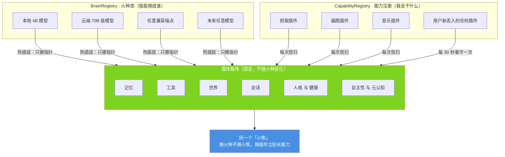
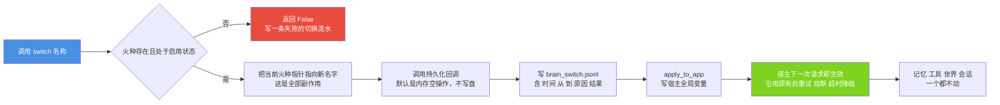
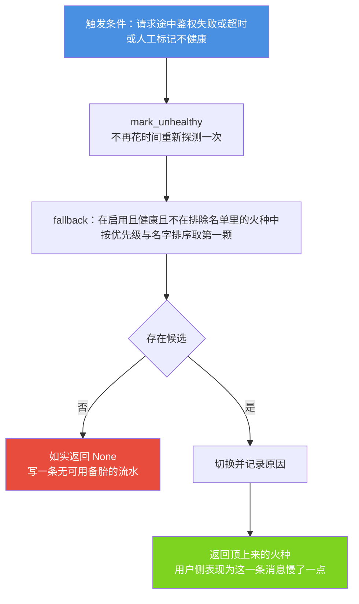
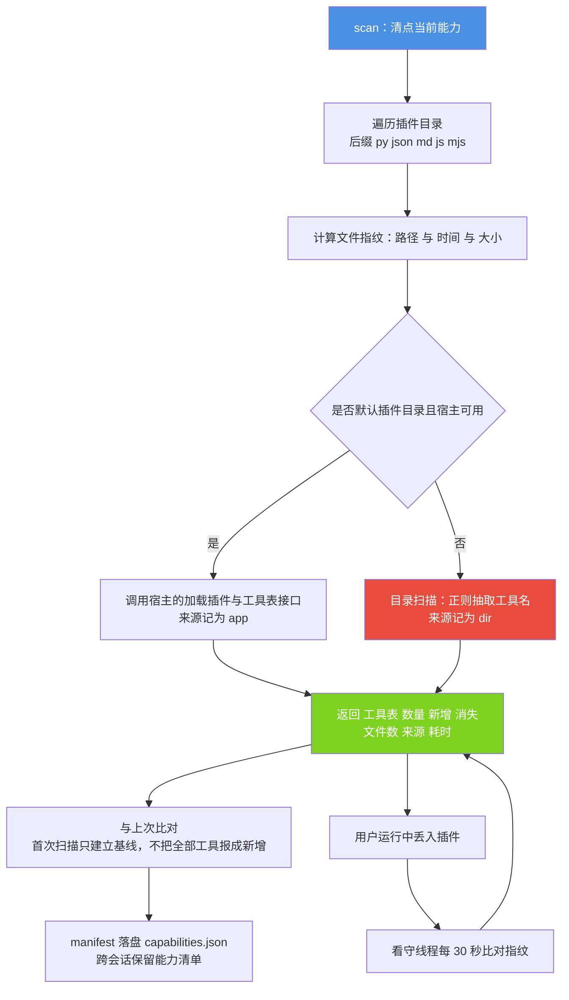

# 小焦 · 模块文档 07：变形金刚（火种库 + 能力注册）

> 本文说明「更换任何模型，系统不变」这句话在工程上如何成立：
> 火种登记处（`BrainRegistry`）负责「我能换成谁」，
> 能力登记处（`CapabilityRegistry`）负责「我会干什么」，
> 两者都属于载体，与当前使用哪个模型无关。
> 热插拔切换时，记忆、工具、世界、会话四类状态一个都不动。
> 所有实测数字均来自 2026-09-14 在本机的真实运行。

| 项 | 内容 |
| --- | --- |
| 文档名称 | 小焦 · 模块文档 07：变形金刚（火种库 + 能力注册） |
| 适用版本 | v1.0 |
| 最后更新 | 2026-09-14 |
| 维护者 | 小焦项目 |
| 文档状态 | 稳定。未落地项集中在 7.2 节，逐条标注「设计，未落地」 |
| 对应测试 | `tools/test_carrier.py`、`tools/test_carrier_block.py` |
| 本次实测结果 | 通过 64 / 共 64、通过 26 / 共 26（两套均退出码 0） |
| 实现主体 | `core/carrier/`（`brain_registry.py`、`capability.py`、`__init__.py`） |
| 阅读前置 | [`../design-philosophy.md`](../design-philosophy.md) 总纲与第一节 |

**术语表（首次出现即在此解释）**

| 术语 | 含义 |
|---|---|
| 小焦 | 本项目交付的本地 AI 助手。用户面对的始终是「小焦」这一个整体 |
| 载体 | 除模型以外的全部系统代码。它提供记忆、工具、世界、人格、健康、自主性等能力 |
| 火种 | 可替换的模型。本地模型、云端接口、任意兼容 OpenAI 协议的端点，都只是插进同一个插座的一颗火种 |
| 热插拔 | 不重启进程、不重新加载模型、不丢失状态地更换当前使用的火种 |
| 载体状态 | 记忆、工具、世界（控制文件）、会话四类数据。它们不归火种管理 |
| 能力 | 载体可以调用的工具。它由 `plugins/` 目录中的文件决定，不由模型决定 |
| 模型平等 | 任何模型接入后获得同一套载体能力；更换模型不改变系统结构与已有状态 |
| 守护线程 | 主进程退出即自动结束的线程，用于做不做都不影响本轮对话的后台工作 |

---

## 目录

- [1. 摘要](#1-摘要)
- [2. 背景与问题](#2-背景与问题)
- [3. 设计目标](#3-设计目标)
- [4. 架构与原理](#4-架构与原理)
- [5. 接口与实现](#5-接口与实现)
- [6. 使用示例](#6-使用示例)
- [7. 边界与限制](#7-边界与限制)
- [8. 故障排查](#8-故障排查)
- [9. 参考](#9-参考)
- [变更记录](#变更记录)

---

## 1. 摘要

### 1.1 一句话定位

载体把「用哪个模型」和「会哪些工具」这两件事都记在自己身上，于是更换模型只需要改动一个字符串，而记忆、工具、世界与会话保持原样。

### 1.2 核心主张：换任何模型，系统不变

这句话包含四层含义：

1. **结构不变。** 换模型只改 `BrainRegistry` 里的当前火种指针，不重建任何对象。
2. **状态不变。** 记忆、工具清单、世界地图、会话记录全部挂在载体上，切换前后对象身份与内容一致。
3. **能力不变。** 工具来自 `plugins/` 目录，与模型无关。用户新增插件，能力立刻增加；换模型，能力一个不少。
4. **体验不变。** 引入更强的火种提升的是单次推理上限，载体行为与边界保持一致。

对应的实测证据：切换当前火种之后，测试断言四把「钥匙」（记忆、工具、世界、会话）的对象身份与内容均未改变，控制文件字节数与修改时间也完全一致。

### 1.3 本文的读者与适用范围

本文面向部署运维人员、二次开发者与评审人员。本文只描述 `core/carrier/` 这一个包。健康系统触发的自动切换（三级治疗）属于健康模块，但与火种登记处的接口直接相关，本文在 4.5 节说明其调用方式。

---

## 2. 背景与问题

### 2.1 火种信息散落的三个后果

在一个没有登记处的系统里，「用哪个模型」通常散落在多处：控制文件的 `brain.api`、环境变量、模型列表、启动脚本。由此产生三个后果：

| 后果 | 具体表现 |
|---|---|
| 更换成本高 | 换一颗火种需要手改文件、重启进程、重新核对配置 |
| 无法回答「有哪些」 | 用户想知道「我现在配了几颗模型」，只能去翻文件自己数 |
| 没有兜底 | 一颗火种返回鉴权失败，整个系统就没有输出，也没有「下一颗顶上」的机制 |

### 2.2 能力信息隐式化的三个后果

同理，若「我会什么」只存在于运行中的内存里：

- 用户丢进一个新插件，需要重启才生效；
- 插件被停用或改名，没有地方报告「少了什么」；
- 工具数量只能靠记忆或文档中的硬编码数字，而这个数字会随插件变化而失真。

### 2.3 为什么这两件事必须放在载体里

火种与能力都不属于模型：模型无法知道自己被谁替换，也无法知道自己之外还有哪些工具。把这两件事记在载体上，是「模型平等」得以成立的工程前提。若把它们交给模型，换一次模型就要重新建立一遍，与「模型是可替换零件」直接冲突。

---

## 3. 设计目标

### 3.1 Goals（要达成的）

| 编号 | 目标 | 验收方式 |
|---|---|---|
| G1 | 登记多颗火种，可查询、可按优先级排序 | `tools/test_carrier.py` 第 1 节：登记两颗火种，断言清单顺序按优先级排列 |
| G2 | 切换只改指针，不碰载体状态 | 第 2 节：断言四把钥匙的对象身份与内容在切换前后完全一致 |
| G3 | 真实探测，而不是相信配置 | 第 3 节：假服务返回 200 与模型列表，坏端口返回失败且不抛异常 |
| G4 | 火种不可用时自动兜底 | 第 4 节：标记当前火种不健康，断言自动切到另一颗并写入切换流水 |
| G5 | 默认不写用户的控制文件 | 第 5 节：断言控制文件字节数与修改时间均未变化 |
| G6 | 能力每次现扫，不缓存成常量 | 第 6 至 8 节：真实扫描 `plugins/`，临时目录中增删文件后重新扫描 |
| G7 | 坏配置只跳过那一条 | 第 9 节：`brains` 写成字符串、条目缺 `name` 时跳过并记日志，不崩溃 |
| G8 | 切换可在不重启的情况下生效 | 附加节：`apply_to_app()` 改动宿主全局变量后，宿主的请求目标当场改变 |
| G9 | 切换失败可回退 | `tools/test_carrier_block.py` 的 [D] 组：切换前探测、切换后复核、复核不过自动切回、全程留痕 |

### 3.2 Non-Goals（明确不做的）

| 编号 | 不做的事 | 原因 |
|---|---|---|
| N1 | 不在导入时读磁盘或产生副作用 | 其他模块只要 `import core.carrier` 就会执行导入期代码，不应因此产生磁盘读取 |
| N2 | 注册重名火种时不覆盖 | 覆盖等于悄悄换掉了用户当前正在使用的火种 |
| N3 | 注销火种时不自动改选当前火种 | 悄悄替用户做选择比不选更糟 |
| N4 | 不替用户搬动或删除插件文件 | 用户可能只想先试一下，或文件放在别处 |
| N5 | 不把密钥写进日志 | 载体日志可能被用户贴给他人，只记录「是否已设置」 |
| N6 | 不为切换而重置状态 | 若切换顺手重置，用户换一次模型就丢一次记忆，这与设计意图正好相反 |
| N7 | 不用看门狗事件监听插件目录 | Windows 上不可靠。轮询 30 秒一次的成本可以忽略，而生效延迟已经足够短 |

---

## 4. 架构与原理

### 4.1 两个登记处与固定的躯体

**图 1 · 火种库、能力注册与固定躯体**

说明：本图说明左侧两类输入都是可变的，中间那具躯体是固定的，因此出口始终是同一个「小焦」。

代码位置索引：`core/carrier/brain_registry.py`、`core/carrier/capability.py`、`core/carrier/__init__.py`



### 4.2 火种登记处的数据结构

一颗火种由 `Brain` 对象表示，字段与含义如下。

| 字段 | 含义 | 备注 |
|---|---|---|
| `name` | 火种的身份标识 | 必填。缺失时该条目被跳过并记日志 |
| `base_url` | 接口根地址 | 同时兼容旧字段名 `url` |
| `model` | 模型名 | 为空时回落到火种名 |
| `api_key` | 密钥 | 同时兼容旧字段名 `key`。日志与快照中只输出「已设置」 |
| `kind` | `local` 或 `cloud` | 兼容旧写法 `local: true / false`。无任何线索时按地址推断 |
| `priority` | 优先级 | 数字越小越优先，默认 100 |
| `enabled` | 是否启用 | 停用的火种不参与切换与兜底 |
| `ctx` / `note` | 上下文长度与备注 | 展示用途 |
| `health` | 最近一次探测结果 | 由 `probe()` 写入 |

三个形状宽容的设计：

1. **字段名兼容两套写法。** 老配置写 `url`、`key`、`local`，新文档写 `base_url`、`api_key`、`kind`。只认一种会把用户「明明配好了」的火种读成空的。
2. **兼容老配置结构。** 控制文件里没有 `brains` 段时，从 `models` 列表与 `brain.api` 中拼出火种。当前本机控制文件即属于这种情形，登记处由此得到三颗火种。
3. **布尔值需要显式解析。** 手写配置里会出现 `"false"`、`"True"`、`0`、`""` 等写法，直接把字符串当布尔值会把「已停用的火种」当成启用状态。

### 4.3 热插拔：一次切换的全部副作用

`switch()` 的完整副作用是一行赋值：把当前火种指针指向新名字。之后写一条切换流水、调用一次持久化回调。

**图 2 · 热插拔的执行路径**

说明：本图说明切换为什么不重启也不重置——火种只是一次 HTTP 请求的目的地，而目的地由宿主每次请求时现读。

代码位置索引：`core/carrier/brain_registry.py` 的 `switch`、`_set_active`、`apply_to_app`



宿主的请求目标来自三个全局变量：`LLM_BASE`、`LLM_MODEL`、`LLM_KEY`。这三个名字是读源码确认过的，不是推测；写入前先检查它们是否存在，任一不存在则记录并返回 `False`，不改动任何东西。切换之所以立刻生效，是因为宿主的 `_llm_targets()` 每次请求都重新读取这三个名字。

选择复用宿主的调用栈而不是另起一套，原因是宿主的请求函数已经带有重试、熔断与超时降级，复用它意味着新火种自动获得全部可靠性，而不必重新实现一遍。

### 4.4 兜底与健康探测

**图 3 · 自动兜底的选取规则**

说明：本图说明兜底为什么必须排除当前火种——若不排除，优先级最小的那一颗会让切换原地打转。

代码位置索引：`core/carrier/brain_registry.py` 的 `fallback`、`auto_fallback`、`mark_unhealthy`、`health_check`



探测的真伪由 `probe()` 决定：它真发一次 HTTP 请求到模型的模型列表接口，返回是否成功、状态码、可用模型名、错误信息与耗时。配置只说明「以为它在哪」，探测才知道「它到底是否存活」。

默认只探测当前火种（`health_check(all=False)`），因为界面上的体检按钮不应因为配置了二十颗火种就卡住很久。

### 4.5 健康系统的三级治疗如何调用火种库

健康系统在三级治疗时会尝试切换火种，调用顺序为：

1. 读取火种清单与当前火种。少于两颗时直接返回 `False` 并记录结果 `no_alternative`；
2. 按优先级逐个探测，取第一个探测通过的目标；
3. 全部探测不通过时不切换，保持现状，记录结果 `no_healthy_target`；
4. 切换并应用到宿主；
5. 在 10 秒内复核新火种，若期间始终无响应则自动切回原火种；
6. 每一次尝试都写入 `logs/carrier/brain_switch.jsonl`，字段包含 `by`、`reason`、`from`、`to`、`ping_ok`、`verify_ok`、`result`。

实测（`tools/test_carrier_block.py` 的 [D] 组）：一次完整切换耗时 4.6 秒，流水记录落在 `logs/carrier/brain_switch.jsonl`，目标不可用时不会把大脑切坏。

### 4.6 能力登记处：两条来源与兜底

`CapabilityRegistry` 回答三个问题：现在有哪些工具；与上次相比多了什么、少了什么；刚丢进来的文件算不算数。

工具名的来源有两条，按可信度排序：

| 来源 | 触发条件 | 可信度 | 说明 |
|---|---|---|---|
| 宿主接口 | 插件目录为默认目录且宿主在 `sys.modules` 中 | 权威 | 调宿主加载插件后读取真实工具表 |
| 目录扫描 | 宿主不可用，或插件目录被改成其他位置 | 粗粒度估算 | 用正则从源码与清单里抽取工具名，宁多勿少 |

**图 4 · 能力清点的两条来源与自动生效**

说明：本图说明为什么清点必须每次现扫——能力是外部事实（取决于插件目录里有什么），不是内存中的常量。

代码位置索引：`core/carrier/capability.py` 的 `scan`、`_app_tools`、`_dir_scan`、`watch`



三条自我约束：

1. **不删除任何文件。** `reload()` 报告「少了某个工具」，但载体不会顺着这个提示去改用户的文件。要停用插件，由用户自己改名或移入停用目录；
2. **宿主接口优先，目录扫描兜底。** 兜底场景下插件的依赖可能不完整，逐条导入插件会逐条失败，因此兜底采用只读文本的正则抽取；
3. **目录不存在也要能运行。** 返回数量为 0，不抛异常。空目录是合法状态，不是错误。

调用宿主接口时会临时切换工作目录，因为宿主的插件加载使用相对当前目录的路径。切换过程由一把锁保护，调用结束后立即切回，不改变用户进程的长期工作目录。同时会把宿主技能列表裁剪回调用前的长度，避免每扫描一次就往人设里追加一份重复的技能文本。

### 4.7 状态隔离的依据

状态隔离不是额外机制，而是架构的必然结果。四类状态各自的存放位置都不在火种里：

| 状态 | 存放位置 | 切换火种时是否变化 |
|---|---|---|
| 记忆 | `logs/quarantine/xiaojiao_memory.txt`（早期遗留存盘，2026-09-17 从仓库根搬入隔离区）、向量库文件、`logs/memory/` | 不变 |
| 工具 | `plugins/` 目录 | 不变 |
| 世界 | `xiaojiao_control.json`、`logs/world/` | 不变 |
| 会话 | `xiaojiao_sessions.json`、`logs/mind_stream/<会话 id>.json` | 不变 |

因此 `switch()` 不需要保存与恢复任何东西：它只把一次 HTTP 请求的目的地换了个位置。

---

## 5. 接口与实现

### 5.1 文件与职责

| 文件 | 职责 |
|---|---|
| `core/carrier/__init__.py` | 导出 `Brain`、`BrainRegistry`、`CapabilityRegistry` |
| `core/carrier/brain_registry.py` | 火种登记、切换、兜底、健康探测、应用到宿主、快照 |
| `core/carrier/capability.py` | 能力清点、增量比对、单文件登记、目录看守、清单落盘 |

### 5.2 关键函数签名

#### 5.2.1 火种

```python
Brain(name, base_url="", model="", api_key="", kind="local",
      priority=100, enabled=True, ctx=0, note="", health=None)
.url -> str                       # 属性：补齐 /chat/completions
.local -> bool                    # 属性：是否本机
.health_ok() -> bool
.models_url() -> str
.to_target() -> dict              # {"url", "model", "key", "local"}
.probe(timeout=3) -> dict         # 真实探测，返回 ok/status/models/error/elapsed_ms
.to_dict(mask_key=True) -> dict   # 默认掩掉密钥
Brain.from_config(name, cfg) -> Brain
```

#### 5.2.2 火种登记处

```python
BrainRegistry(config=None, persist=None)
.register(name, config) -> bool          # 重名返回 False，不覆盖
.unregister(name) -> bool                # 不自动改选当前火种
.get(name) -> Brain | None
.names() -> list                         # 排序后的名字
.list_brains() -> list                   # 按优先级与名字排序
.current() -> Brain | None
.switch(name) -> bool                    # 热插拔：只挪指针
.fallback(exclude=None) -> Brain | None  # 只挑选，不切换
.auto_fallback(reason="") -> Brain | None
.mark_unhealthy(name, reason="") -> bool
.mark_healthy(name) -> bool
.health_check(all=False, timeout=3) -> dict
.apply_to_app(brain=None) -> bool        # 写宿主的 LLM_BASE / LLM_MODEL / LLM_KEY
.snapshot() -> dict                      # 不含明文密钥
```

#### 5.2.3 能力登记处

```python
CapabilityRegistry(plugins_dir=None, state_dir=None)
.scan(use_app=True) -> dict
    # {"tools": [...], "count": n, "added": [...], "removed": [...],
    #  "files": n, "skills": n, "source": "app"|"dir", "plugins_dir": str,
    #  "ts": str, "elapsed_ms": n}
.available() -> list
.register(path) -> dict          # 只读不搬：文件必须已在插件目录内
.reload() -> dict                # 重扫并比对，只报告增删
.watch(on_change=None, interval_s=30) -> None
.stop_watch() -> None
.manifest() -> dict              # 落盘 capabilities.json
.diff() -> dict                  # 最近一次比对结果
```

#### 5.2.4 模块级常量

```python
PLUGIN_SUFFIXES = (".py", ".json", ".md", ".js", ".mjs")
_SKIP_DIRS = {"__pycache__", "_disabled", "node_modules", ".git"}
PROBE_TIMEOUT = 3                # 单颗火种探测超时秒数
DEFAULT_PRIORITY = 100
```

### 5.3 配置

控制文件的 `brains` 段为推荐写法：

```json
{
  "brains": [
    {
      "name": "本地 4B",
      "base_url": "http://127.0.0.1:9292/v1",
      "model": "xiaojiao",
      "api_key": "",
      "kind": "local",
      "priority": 10,
      "enabled": true
    },
    {
      "name": "云端备胎",
      "base_url": "https://example.invalid/v1",
      "model": "some-model",
      "api_key": "在此填写密钥",
      "kind": "cloud",
      "priority": 100,
      "enabled": true
    }
  ],
  "active_brain": "本地 4B"
}
```

兼容写法（当前本机控制文件即为此形状）：`models` 数组提供火种条目，`brain.api` 作为兜底条目参与登记，`active` 或 `active_brain` 指定当前火种。

字段约束：

| 字段 | 约束 |
|---|---|
| `name` | 必填。缺失的条目被跳过；重名的后一条被跳过 |
| `priority` | 数字越小越优先，默认 100 |
| `enabled` | 支持布尔、数字、字符串（`1`、`true`、`yes`、`on`、`是`、`开` 均视为真） |
| `active_brain` | 若取值不在火种表中，记录日志并暂不指定当前火种 |
| 密钥 | 只进入 HTTP 请求；流水与快照中只输出「已设置」 |

### 5.4 落盘文件

| 文件 | 内容 |
|---|---|
| `logs/carrier/brain_switch.jsonl` | 每次切换：`{ts, from, to, reason, ok}`。健康系统的切换另含 `by`、`ping_ok`、`verify_ok`、`result`、`probed` |
| `logs/carrier/brain_apply.jsonl` | 每次应用到宿主的记录 |
| `logs/carrier/brain_config.jsonl` | 配置读坏时被跳过条目的记录，含原文片段 |
| `logs/carrier/capabilities.json` | 能力清单：时间、数量、工具名、每个插件文件的修改时间 |

---

## 6. 使用示例

### 6.1 两套离线自测

不需要外网。测试使用本机临时启动的假服务与临时插件目录。

```powershell
cd <仓库目录>
$env:PYTHONUTF8="1"

python tools/test_carrier.py         # 火种登记处与能力登记处
python tools/test_carrier_block.py   # 阻塞类缺陷：切换的探测 复核 回退 留痕
```

实测结果（2026-09-14，本机）：

| 测试 | 结果 |
|---|---|
| `tools/test_carrier.py` | 通过 64 / 共 64 |
| `tools/test_carrier_block.py` | 通过 26 / 共 26 |

测试过程不会改动用户的控制文件。第 5 节断言控制文件的字节数与修改时间均未变化（实测 1842 字节保持不变）。

### 6.2 查看当前火种清单

```python
from core.carrier import BrainRegistry  # 运行前需先进入仓库根目录

reg = BrainRegistry()
print("火种名：", reg.names())
print("当前火种：", reg.current().name if reg.current() else "（未指定）")
for b in reg.list_brains():
    print(b["name"], b["kind"], b["base_url"], "密钥：", b["api_key"] or "（未设置）")
print("持久化方式：", reg.snapshot()["persist"])
```

实测输出（2026-09-14，本机，密钥一栏已按设计掩掉）：

```
火种名： ['agnes-2.5-flash', 'xiaojiao1.0-4B', '默认大脑']
当前火种： （未指定）
agnes-2.5-flash  cloud  https://apihub.agnes-ai.com/v1  密钥： 已设置
xiaojiao1.0-4B   local  http://127.0.0.1:9292/v1        密钥： （未设置）
默认大脑         local  http://127.0.0.1:9292/v1        密钥： （未设置）
持久化方式： noop(内存，不写盘)
```

这份输出说明三件事：兼容写法确实生效（控制文件里只有 `models` 数组与 `brain.api`，登记处得到三颗火种）；密钥只显示「已设置」；默认不写盘。

### 6.3 切换火种并确认状态未变

```python
from core.carrier import BrainRegistry

memory = {"lines": ["用户住在济南"]}
tools = ["run_command", "write_file"]
world = {"sites": {"example.com": {"trust": 0.5}}}
sessions = {"s1": ["你好"]}

reg = BrainRegistry(config={"brains": [
    {"name": "甲", "base_url": "http://127.0.0.1:9292/v1", "priority": 10},
    {"name": "乙", "base_url": "https://example.invalid/v1", "priority": 20},
], "active_brain": "甲"})

before = [id(memory), id(tools), id(world), id(sessions)]
print("切换：", reg.switch("乙"))
print("当前：", reg.current().name)
print("四类状态对象身份未变：", before == [id(memory), id(tools), id(world), id(sessions)])
print("内容未变：", memory["lines"][0] == "用户住在济南" and tools[0] == "run_command")
```

实测对应的断言（`tools/test_carrier.py` 第 2 节）：切换后当前火种正确；四把钥匙的对象身份均未变化；四把钥匙的内容一个都没变。

### 6.4 清点能力

```python
from core.carrier import CapabilityRegistry

cap = CapabilityRegistry()
res = cap.scan()
print("工具数：", res["count"], "插件文件数：", res["files"], "来源：", res["source"])
print("耗时毫秒：", res["elapsed_ms"])
print("新增：", res["added"], "消失：", res["removed"])
print("清单落盘：", cap.manifest()["count"])
```

实测输出（2026-09-14，本机）：

```
工具数： 77   插件文件数： 22   来源： app
耗时毫秒： 3639
新增： []   消失： []
```

`来源：app` 表示这次清点走的是宿主接口，属于权威口径。`新增` 与 `消失` 均为空，说明自上次扫描以来插件目录没有变化。耗时 3639 毫秒包含了宿主加载插件的过程，属于首次扫描的代价。

### 6.5 热插拔的真实生效点

```python
import xiaojiao_app as app  # 需在小焦进程内运行，或先导入 xiaojiao_app
from core.carrier import BrainRegistry

reg = BrainRegistry()
brain = reg.get("xiaojiao1.0-4B")     # 换成你自己的火种名
if brain is not None and reg.switch(brain.name):
    print("应用：", reg.apply_to_app(brain))
    print("宿主目标：", app._llm_targets())
```

实测对应的断言：`apply_to_app()` 改动宿主全局变量之后，宿主的 `_llm_targets()` 当场指向新火种，不需要重启进程。

---

## 7. 边界与限制

### 7.1 已确认的工程边界

| 边界 | 说明 |
|---|---|
| 切换不动状态，也不动模型服务 | 载体不负责启停推理服务。目标地址上的服务必须已经可用，否则切换之后的请求会失败并进入兜底逻辑 |
| 探测超时 3 秒 | 够一次本机模型列表往返。再长会拖住界面 |
| 探测只验证可达性 | `probe()` 请求模型列表接口，不发送推理请求。因此「能列出模型」不等于「能完成一次生成」 |
| 应用失败返回 `False`，不抛异常 | 宿主不在、变量名对不上、写入失败，三种情形都只记录并返回 `False` |
| 默认不写盘 | 构造 `BrainRegistry` 时的持久化回调默认是内存空操作。要持久化必须显式传入回调 |
| 目录扫描是粗粒度估算 | 正则抽取可能多认几个名字。来源字段会如实报告 `dir`，便于区分口径 |
| 插件目录看守是轮询 | 默认 30 秒一次，跨平台可靠。生效延迟最长为该间隔 |
| 目录扫描不导入插件 | 兜底场景下插件依赖可能不完整，逐条导入会逐条失败 |
| 能力清单按扫描时刻落盘 | 记录文件修改时间，可用于回答「昨天有几个工具」 |

### 7.2 未落地的部分

| 项目 | 状态 | 说明 |
|---|---|---|
| 火种的上下文长度自动探测 | 部分落地 | `ctx` 字段可配置并展示，但没有从服务端自动探测真实上下文长度 |
| 按任务类型选择火种的路由 | 设计，未落地 | 当前切换是全量切换，没有「简单任务走小火种、复杂任务走大火种」的分派 |
| 火种性能与成本的统计 | 设计，未落地 | 记录了探测耗时，但没有按对话统计吞吐、延迟与费用 |
| 插件的依赖检查与冲突检测 | 设计，未落地 | 能力清点只回答「有哪些工具」，不判断插件之间是否冲突 |
| 插件热更新的回滚 | 设计，未落地 | 插件变化只报告增删，没有版本保留与回退机制 |

### 7.3 实测数字与口径

| 项目 | 数字 | 来源 |
|---|---|---|
| `tools/test_carrier.py` | 通过 64 / 共 64 | 本次实跑 |
| `tools/test_carrier_block.py` | 通过 26 / 共 26 | 本次实跑 |
| 当前工具数 | 77 | `CapabilityRegistry().scan()` |
| 当前可用工具数 | 77 | `CapabilityRegistry().available()` |
| 插件文件数 | 22 | 同上 |
| 清点来源 | `app` | 同上 |
| 清点耗时 | 3639 毫秒（首次，含宿主加载插件） | 同上 |
| 已登记火种数 | 3 | `BrainRegistry().snapshot()` |
| 火种名 | `agnes-2.5-flash`、`xiaojiao1.0-4B`、`默认大脑` | 同上 |
| 默认持久化方式 | `noop(内存，不写盘)` | 同上 |
| 控制文件尺寸变化 | 1842 字节 → 1842 字节，修改时间不变 | `tools/test_carrier.py` 第 5 节 |
| 一次完整切换耗时 | 4.6 秒（含探测与复核） | `tools/test_carrier_block.py` 的 [D] 组 |
| 切换复核窗口 | 10 秒 | 健康系统三级治疗实现 |
| `logs/carrier/brain_switch.jsonl` | 83 行 | 本次实测，含自测追加记录 |
| `logs/carrier/brain_apply.jsonl` | 59 行 | 本次实测，含自测追加记录 |

未实测的项目：热插拔在长时间连续对话中的表现、同时在多个进程里操作火种登记处的行为、插件数量达到数百规模后的扫描耗时，均未做过实验。

---

## 8. 故障排查

| 症状 | 可能原因 | 处理方式 |
|---|---|---|
| 火种清单为空 | 控制文件里既没有 `brains`，也没有可兼容的 `models` 或 `brain.api` | 检查 `logs/carrier/brain_config.jsonl`，被跳过的条目及原因写在那里 |
| 切换返回 `False` | 名字不存在，或该火种处于停用状态 | 先调用 `names()` 确认名字，再检查该条目的 `enabled` 取值 |
| 切换成功但对话仍走旧火种 | 未调用 `apply_to_app()`，或宿主里不存在 `LLM_BASE` 等变量 | 查看 `logs/carrier/brain_apply.jsonl` 的 `ok` 与 `error` |
| 切换后请求全部失败 | 目标地址的服务未启动，或密钥已过期 | 用 `probe()` 验证可达性，再检查密钥。失败会触发自动兜底 |
| 自动兜底没有生效 | 没有其他启用的健康火种 | `fallback()` 返回 `None` 时会在切换流水里记一条无可用备胎 |
| 体检很慢 | 使用了 `health_check(all=True)` 且火种较多 | 默认只探测当前火种。批量体检可把超时调小 |
| 工具数比预期少 | 清点来源为目录扫描，或插件文件后缀不被支持 | 查看返回值的 `source` 字段。支持的后缀为 `py`、`json`、`md`、`js`、`mjs` |
| 新插件不生效 | 看守线程未启动，或文件不在插件目录内 | `register()` 只接受插件目录内的文件。也可以显式调用 `scan()` |
| 每扫描一次人设里多一段技能文本 | 调用宿主接口后未裁剪技能列表 | 实现中已裁剪回调用前的长度。自行扩展时需保留这一处理 |
| 火种数量在重启后变化 | 兼容写法把 `brain.api` 也登记为一颗火种 | 属于预期行为。若不需要，可在控制文件中显式提供 `brains` 段 |
| 载体日志里出现密钥 | 使用了 `to_dict(mask_key=False)` | 默认掩码。检查是否有代码显式关闭了掩码 |

---

## 9. 参考

| 文档 | 内容 |
|---|---|
| [`../design-philosophy.md`](../design-philosophy.md) | 总纲（载体是死的，模型接入就活了）、第一节（十一大器官）、第二节（能力的无限扩展） |
| [`../architecture-diagrams.md`](../architecture-diagrams.md) | 图 6（变形金刚：火种库与能力注册）、图 1（总纲） |
| [`../brain-switch.md`](../brain-switch.md) | 火种切换的专题说明 |
| [`../presets.md`](../presets.md) | 预置人格与配置 |
| [`../PLUGINS.md`](../PLUGINS.md) | 插件编写说明：能力如何进入载体 |
| [`../architecture.md`](../architecture.md) | 系统总体架构 |
| [`05-autonomy.md`](05-autonomy.md) | 自主性模块 |
| [`06-world.md`](06-world.md) | 世界层模块 |
| `core/carrier/brain_registry.py` | 火种登记处实现 |
| `core/carrier/capability.py` | 能力登记处实现 |
| `tools/test_carrier.py` | 火种与能力自测（64 项） |
| `tools/test_carrier_block.py` | 切换可靠性自测（26 项） |

---

## 变更记录

| 版本 | 日期 | 变更内容 | 作者 |
|---|---|---|---|
| v1.0 | 2026-09-14 | 首次发布。覆盖火种登记处与能力登记处的数据结构、热插拔路径、自动兜底、能力清点两条来源、状态隔离依据；含四张流程图、接口签名、配置与故障排查；7.2 节列出 5 项未落地内容（其中 1 项为部分落地） | 小焦项目 |
