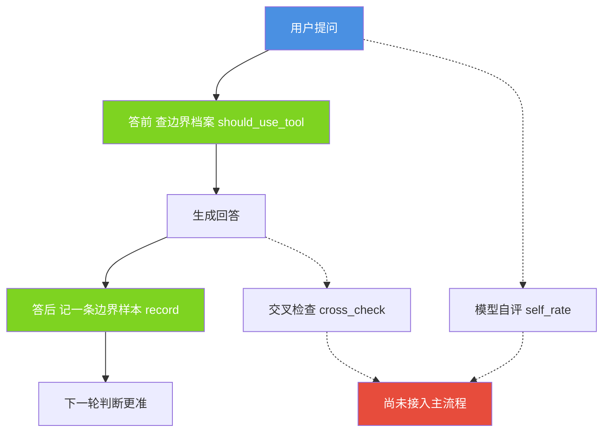
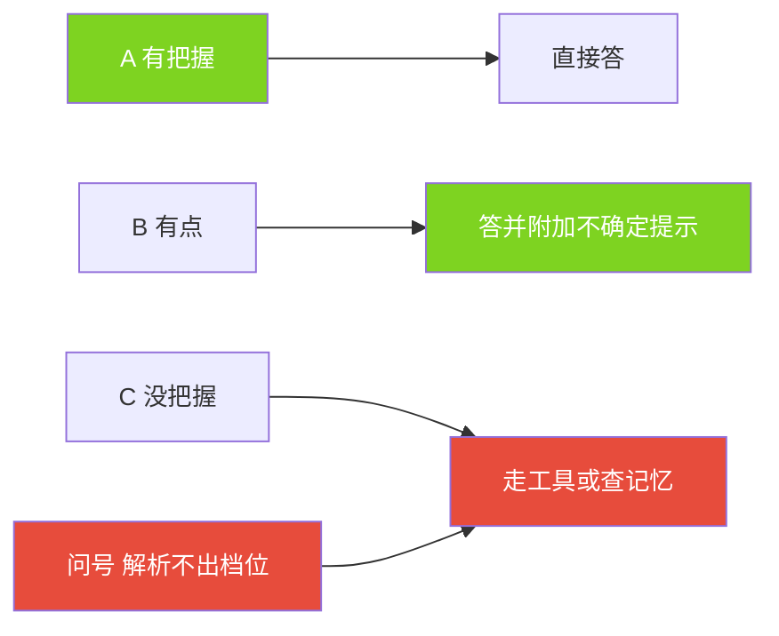
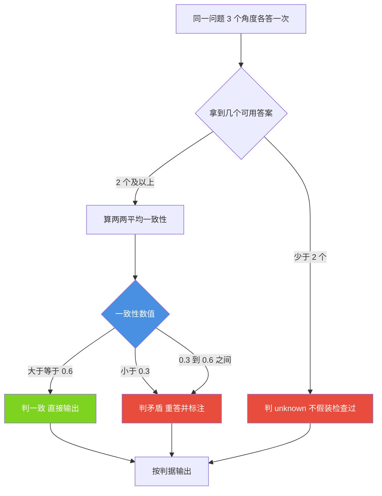
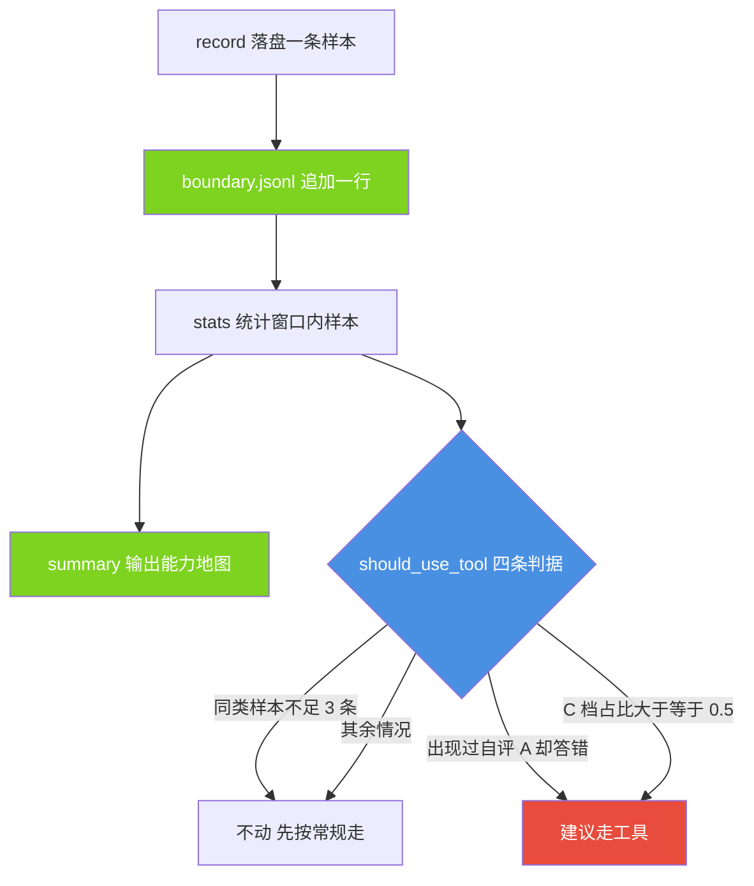

# 08 · 元认知（metacognition）

| 项目 | 内容 |
|---|---|
| 文档编号 | 08 |
| 模块名 | 元认知（metacognition） |
| 适用版本 | v1.0 |
| 最后更新 | 2026-09-14 |
| 维护者 | 小焦项目 |
| 文档状态 | 已发布，内容与 v1.0 代码同步；未落地部分在正文逐处标注 |
| 代码位置 | `core/metacognition/` |
| 自测入口 | `tools/test_metacognition.py` |

## 目录

[摘要](#1-摘要) · [背景与问题](#2-背景与问题) · [设计目标](#3-设计目标) · [架构与原理](#4-架构与原理) · [接口与实现](#5-接口与实现) · [使用示例](#6-使用示例) · [边界与限制](#7-边界与限制) · [故障排查](#8-故障排查) · [参考](#9-参考) · [变更记录](#10-变更记录)

## 1. 摘要

元认知层解决的问题是：系统是否知道自己哪些问题答不了。其他模块处理"怎么答得又多又好"，本模块处理"这一次该不该由模型直接答"。本层由三个部分组成。

- 答前自评（`core/metacognition/selfrate.py`）：让模型给把握打 A/B/C 三档，载体按档位决定直接答、带标注答，或改走工具与记忆检索。
- 答后交叉检查（`core/metacognition/crosscheck.py`）：同一问题用 2 至 3 个角度各答一次，比对答案一致性。
- 边界档案（`core/metacognition/boundary.py`）：把每次自评与事后对错落盘成追加式账本，跨轮次积累判断力。

三个部分共享三条取向：拿不准时倒向更稳的一侧、解析不到就不猜、模型函数由调用方注入而不在载体内部绑定具体模型。

自测结果为通过 143 项、共 143 项，退出码 0。自测当日边界档案统计到 355 条样本。

## 2. 背景与问题

小参数量模型的危险失败不是"不会"，而是"不知道自己不会"。它对任何问题都使用同一个自信的语气。断言一个训练数据里存在的常识，与断言用户昨天提过的某个车牌号，语气上难以区分，而后者往往是现场编造。

模型权重不可修改，载体能做的是在模型外侧补上判断环节，具体为三件事。

1. 开口之前先要一个把握档位，让"不确定"变成可被代码读取的数据。
2. 开口之后再问一遍，用多个角度的答案互相校验。
3. 把结果记账，使同类问题在下一次遇到时有历史可查。

其中第三件事是跨轮次收益的来源：只看当轮，前两件事只能拦住一次；有了账本，同一个坑才不会一遍遍踩。判断的代价也不对等，把不确定说成确定，后果是编造，用户可能直接拿去使用；把确定说成不确定，后果只是多确认一次。因此本层在所有含糊处一律倒向后者，这条取向贯穿三个模块，是本层设计的起点。

## 3. 设计目标

### Goals

- 模型对自身把握输出可解析的档位，且档位解析规则只有一份，路由与记账共用同一套解析。
- 档位到行为的映射固定且可解释：A 直接答，B 带标注答，C 与解析失败都改走工具。
- 交叉检查的角度由规则拼装，不交给被检查的模型生成。
- 一致性判据不依赖向量模型，换火种后判据继续有效。
- 边界档案跨轮次累积，同类样本足够时自动给出"建议走工具"的结论与人话理由。
- 全部函数在模型缺失、参数为脏值、档案损坏时不抛异常，且每个子模块可脱离 Flask 与主程序单独 import。

### Non-Goals

- 不训练、不微调模型。
- 不做通用事实核查，也不访问互联网；需要外部事实时由工具层负责。
- 不修改回答的实质内容；除 B 档附加一句不确定提示外，本层不重写答案。
- 不替换健康系统与决策层；本层只输出判断，由调用方决定如何使用。
- 不保证档位判断本身正确；本层负责记录与约束，不负责让模型的自评变可靠。本模块的阈值与判据以实现为准，本文给出的数值来自代码常量。

## 4. 架构与原理

### 4.1 介入点与当前接线状态

**图 8-1 · 元认知在一次对话轮次中的介入点**

说明：本图给出各部分的先后关系；绿色为已接入对话主流程，红色为模块内已实现但主流程尚未调用。



代码位置：模块侧为 `core/metacognition/boundary.py`、`core/metacognition/selfrate.py`、`core/metacognition/crosscheck.py`；接入点在 `xiaojiao_app.py` 的 `agent_run` 内。

未落地部分需要说明清楚。`self_rate()` 需要一次额外的模型调用，主流程当前未调用它，改用规则近似：回答文本中出现"不确定""不清楚""我查一下"等措辞时记为 C 档，否则按本轮是否调用过工具记为 A 档或 B 档。因此真实档案里的档位来自规则推断，不是模型自评。`cross_check()` 目前在自测中被调用，主流程未调用，用户对话时不会触发多角度比对。两者都属于"模块已实现、自测通过，但尚未接入对话主流程"。

### 4.2 档位与路由

档位共四个取值，其中 `?` 表示解析不出档位。路由表定义在 `selfrate.ROUTES`。

**图 8-2 · 档位到行为的映射**

说明：四个档位映射到三条路径；解析失败与"没把握"合并处理，理由是两者的代价不对称。



代码位置：`core/metacognition/selfrate.py`，常量 `RATINGS`、`ALL_RATINGS`、`ROUTES` 与函数 `route()`。

档位解析分两级。先认字母 A/B/C，再认中文措辞。措辞按保守顺序匹配，C 的措辞先于 B，B 先于 A，避免把"我不太确定"听成"确定"。`parse_rating()` 会把模型原话一并存进字段 `rating_raw`，使解析规则将来修改后仍能重审旧记录。

### 4.3 交叉检查的判据

角度模板共 5 条，定义在 `crosscheck.ANGLES`：直接答、反着问、只讲关键事实、换个说法、列要点。默认使用 3 个。一致性数值是所有两两组合相似度的平均值，相似度使用中文二元组集合的 Dice 系数。

**图 8-3 · 交叉检查的判据与出口**

说明：平均一致性落入中间地带时判为矛盾，这是刻意的从严设计。



代码位置：`core/metacognition/crosscheck.py`，常量 `CONSISTENT_MIN = 0.6`、`CONFLICT_MAX = 0.3`、`PREFER`，函数 `cross_check()`、`similarity()`、`prefer()`。取最小值会让偶发口误永久判为矛盾，取最大值会放过"两个相似、一个完全不同"的组合，平均值是两者的折中，严格性交给两刀阈值。

### 4.4 边界档案与能力地图

档案文件是 `logs/metacognition/boundary.jsonl`，一行一条 JSON，只追加不修改。每条记录含时间、问题前 200 字、话题键、归一后的档位、模型原话、事后对错、备注与来源。

"能力地图"由 `stats()` 与 `summary()` 输出，内容为档位分布、低把握话题清单与"自评有把握却答错"的条数。它是一份可读的报告，不画图。

**图 8-4 · 边界档案的累积与决策**

说明：档案只累积事实，决策由 `should_use_tool()` 按四条判据从事实推出。



代码位置：`core/metacognition/boundary.py`，常量 `MIN_SAMPLES = 3`、`C_RATIO = 0.5`、`SAME_TOPIC_MIN = 0.5`、`TOPIC_MIN_SAMPLES = 2`、`TOP_LIMIT = 5`，函数 `record()`、`stats()`、`should_use_tool()`、`summary()`。

判据按严重程度排序，先判最严重的一条。

1. 同类样本少于 3 条时不做任何行为改变，理由文字明确写出"样本不足，先按常规走"。
2. 同类问题出现过"自评 A 却事后答错"，判定走工具。这是账本中最有价值的一条，它意味着模型在这类问题上的自评不可信。
3. 同类问题 C 档占比大于等于 0.5，判定走工具；其余情况按常规走，理由文字如实写明看过几条、其中 C 档几条。

归类使用重合度而非话题键相等，因为决策要的是不漏；报告中的话题清单使用话题键分组，因为报告要的是人能看懂的分类名。两个口径不同是刻意设计，不是笔误。

## 5. 接口与实现

### 5.1 包级入口

`core/metacognition/__init__.py` 提供共享工具，并通过 PEP 562 的模块级 `__getattr__` 惰性导出子模块中的函数，避免三个子模块与本文件形成循环 import。低于 1000 行的独立 import 不会连带拉起 Flask 与主程序，这一条在自测中有覆盖。

| 名称 | 签名 | 说明 |
|---|---|---|
| `meta_dir` | `meta_dir(sub=None)` | 返回元认知数据目录，默认 `logs/metacognition/`，建不出目录也不抛 |
| `cfg` | `cfg(override=None)` | 合并代码默认值、`xiaojiao_control.json` 的 `metacognition` 段与显式覆盖 |
| `log_line` | `log_line(name, msg)` | 追加一行人读日志到 `logs/metacognition/<name>.log` |
| `clean_text` | `clean_text(text)` | 剔除标点与空白，只保留中英文与数字 |
| `bigrams` | `bigrams(text)` | 返回清洗后的中文二元组列表，含重复，滤掉纯虚词片段 |
| `features` | `features(text)` | 返回二元组集合，供一致性比对使用 |
| `app_module` | `app_module()` | 惰性取已在内存中的主程序模块，取不到返回 `None` |

配置默认值定义在 `_DEFAULT_METACOGNITION`，共六项：`enabled` 为 `True`、`self_rate` 为 `True`、`cross_check` 为 `True`、`cross_check_n` 为 `3`、`min_samples` 为 `3`、`days` 为 `30`。`days` 是档案回看窗口，单位为天；`min_samples` 是判"这类问题老不行"的最少同类样本数。

### 5.2 三个子模块的公开函数

| 模块 | 函数签名 |
|---|---|
| selfrate | `rate_prompt(question, context="")`、`parse_rating(text)`、`route(rating)`、`self_rate(question, llm_fn=None, context="")`、`apply_route(text, rating, caveat)` |
| crosscheck | `angles(question, n=3)`、`angle_names(n=3)`、`similarity(a, b)`、`cross_check(question, llm_fn=None, n=3)`、`prefer(verdict)` |
| boundary | `boundary_path(path=None)`、`topic_of(question)`、`same_topic(a, b)`、`record(question, rating, correct=None, note="", source="", path=None)`、`stats(days=30, path=None)`、`should_use_tool(question, days=30, path=None)`、`summary(days=30, path=None)` |

返回结构。

- `self_rate` 返回 `{"rating", "raw", "ok", "why"}`；`ok` 表示是否真的取到 A/B/C 之一，取到 `?` 时为 `False`。
- `cross_check` 返回 `{"answers", "agree", "verdict", "detail"}`；`verdict` 取 `consistent`、`conflict`、`unknown`。
- `record` 返回写进档案的那一行字典，含 `written` 与 `path` 两个字段。
- `stats` 返回 `{"total", "by_rating", "low_conf_topics", "false_confidence"}`；`by_rating` 固定带 A/B/C/? 四个键。
- `should_use_tool` 返回 `{"use_tool", "why", "samples"}`。

## 6. 使用示例

以下代码可直接复制运行。运行前设置环境变量 `PYTHONUTF8` 为 `1`，工作目录为仓库根。

### 6.1 解析档位、自评与交叉检查

```python
from core.metacognition import selfrate, crosscheck

print(selfrate.parse_rating("我认为是C"))     # C
print(selfrate.parse_rating("我不太确定"))     # C
print(selfrate.route("?"))                   # use_tool

r = selfrate.self_rate("小焦的记忆存在哪", llm_fn=lambda prompt: "B")
print(r["rating"], r["ok"], r["why"])
print(selfrate.self_rate("随便问问")["why"])   # 没有可用的模型

same = lambda prompt: "北京。"
print(crosscheck.cross_check("中国的首都是哪", llm_fn=same)["verdict"])   # consistent
print(crosscheck.cross_check("中国的首都是哪", llm_fn=None)["verdict"])   # unknown
```

### 6.2 记录样本并查询是否该走工具

```python
from core.metacognition import boundary

for i in range(3):
    boundary.record("小焦的记忆是怎么存的 %d" % i, "C", source="示例")

print(boundary.should_use_tool("小焦的记忆是怎么存的"))
```

连续 3 条低把握样本之后，返回的理由文字会给出该类问题的历史比例。自测中的实测输出如下，同一条判据在 3 条样本中 2 条为 C 时会给出占 67% 的结论，此时仍然判走工具，因为阈值是 0.5。

```text
{"use_tool": True, "why": "这类问题历史 3 条里有 3 条自评「没把握」（占 100%）——多半要靠猜，直接走工具更稳", "samples": 3}
```

### 6.3 读出能力地图

```python
from core.metacognition import boundary

print(boundary.summary(days=30))
```

写档当日的实测输出如下。

```text
最近 30 天记了 355 条自评：A 档（有把握）38 条、B 档（有点）303 条、C 档（没把握）14 条、解析不出档位 0 条；还没有出现过「自评有把握却答错」的记录；C 档最集中的话题是「我写」（5 条里 2 条没把握，占 40%）。
```

该输出的每个数字都取自 `stats()`。`summary()` 内部不另行计算，以保证报告与统计口径一致。

### 6.4 跑自测

```powershell
$env:PYTHONUTF8="1"
python tools/test_metacognition.py
```

自测只删除自己写入的、带自测标记的行，不删除任何文件。写档当日输出为通过 143 项，共 143 项。

## 7. 边界与限制

- 档位判断的可靠性未实测。自评依赖模型对自身能力的判断，而模型在需要判断的地方恰不可靠。本层的作用是记录这种不可靠并据此改行为，不是消除它。
- `self_rate()` 与 `cross_check()` 未接入对话主流程，用户对话时不会触发，详见 4.1 节。
- 交叉检查的相似度基于中文字符二元组，对同义改写不敏感。两个答案用完全不同的词汇表达同一件事时，一致性数值偏低从而被判为矛盾。该偏差方向是多报矛盾，与从严取向一致，代价是额外的重答。
- 话题归类是粗粒度的。话题键取问题中第一个有实义的中文二元组，因此"我写"这类片段会作为话题名出现；一致性判据对纯英文问题的区分度也未实测，二元组切分对英文的作用有限。
- 回看窗口默认 30 天。换火种、补充记忆或接入新工具后，历史记录的参考价值会下降。窗口可配置，`days=None` 表示不限制。
- 档案为追加式，不做压缩与清理，长期运行后文件会持续增长；每条只保留问题前 200 字。
- 本层不做事实核查。交叉检查比对的是模型自身前后答案的一致性，而不是答案与外部事实的一致性，因此三个角度一致但同样错误的情形无法被本层发现。

## 8. 故障排查

排查用的日志有三份，都在 `logs/metacognition/` 下：`boundary.jsonl` 存结论，`selfrate.log` 与 `crosscheck.log` 存过程。结论可以重算，过程不能重算，因此过程量单独留痕。

| 现象 | 可能原因 | 排查方式 |
|---|---|---|
| `summary()` 说没有一条记录 | 档案路径不对，或窗口内确实无数据 | 打印 `boundary.boundary_path()` 的实际值，再查看该文件最后几行 |
| 档案里有记录但统计看不见 | `ts` 字段损坏，或落在窗口之外 | 用 `stats(days=None)` 读全部数据；损坏行会被读取层跳过 |
| `should_use_tool()` 总说样本不足 | 同类判定的重合度与用户提问的措辞习惯不匹配 | 直接调用 `same_topic()` 比对两个问题，确认是否被判为同类 |
| `self_rate()` 一直返回问号 | 未注入 `llm_fn`，或模型返回内容不含档位信息 | 查看返回的 `why` 字段，其中带模型原话的前若干字符 |
| `cross_check()` 始终判 unknown | 角度调用失败，可用答案少于 2 个 | 查看 `crosscheck.log`，其中记录了失败原因与一致性数值 |
| 回答里出现多余的"不太确定"，或导入 `core.metacognition` 报 AttributeError | 前者说明判为 B 档；后者说明取了 `__all__` 之外的名字 | 前者查看 `selfrate.log` 里的 rating 与 ok；后者改用具名导入，例如 `from core.metacognition.selfrate import self_rate` |

## 9. 参考

- 设计理念第九节元认知：[../design-philosophy.md](../design-philosophy.md)
- 架构图册：[../architecture-diagrams.md](../architecture-diagrams.md)
- 代码：`core/metacognition/__init__.py`、`core/metacognition/selfrate.py`、`core/metacognition/crosscheck.py`、`core/metacognition/boundary.py`
- 自测：`tools/test_metacognition.py`
- 相邻模块文档：`docs/modules/09-persona.md`、`docs/modules/10-boost.md`

## 10. 变更记录

| 日期 | 版本 | 变更内容 | 维护者 |
|---|---|---|---|
| 2026-09-14 | v1.0 | 首次发布。记录三个子模块的接口、判据与阈值，并标注自评与交叉检查尚未接入对话主流程 | 小焦项目 |

---

## 变更记录

| 日期 | 版本 | 变更 |
| --- | --- | --- |
| 2026-09-14 | v1.0 | 首次发布：答前自评、答后交叉检查与边界档案 |
