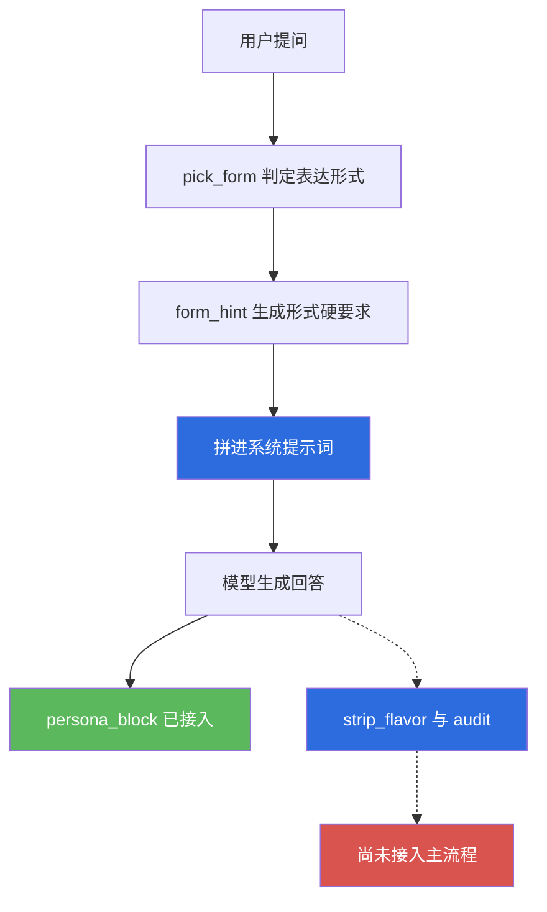
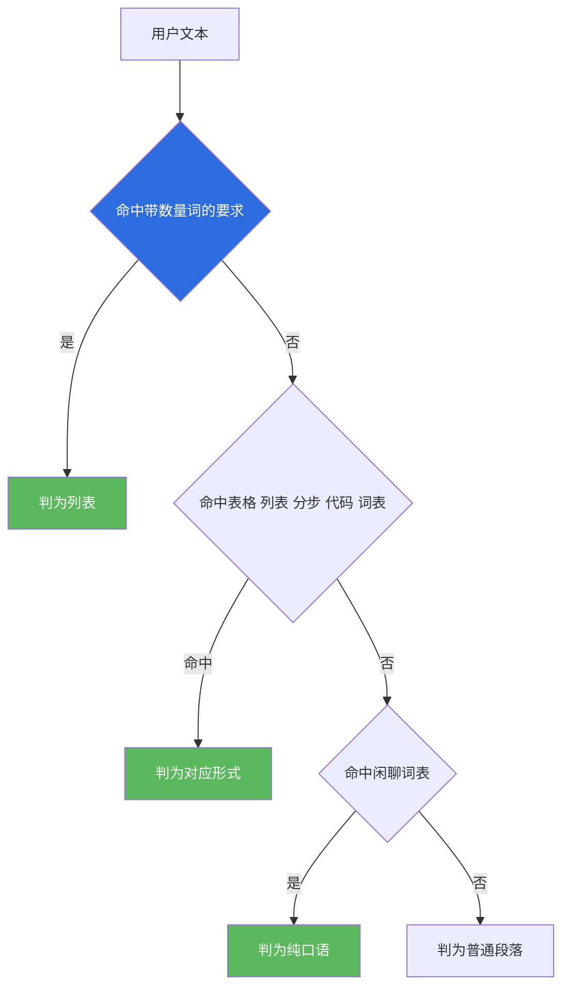
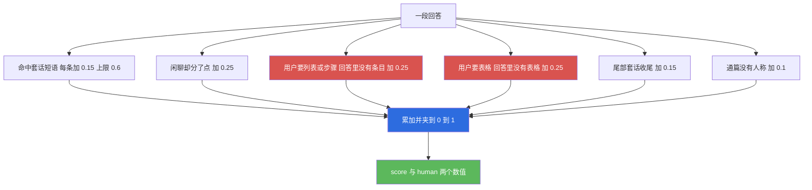
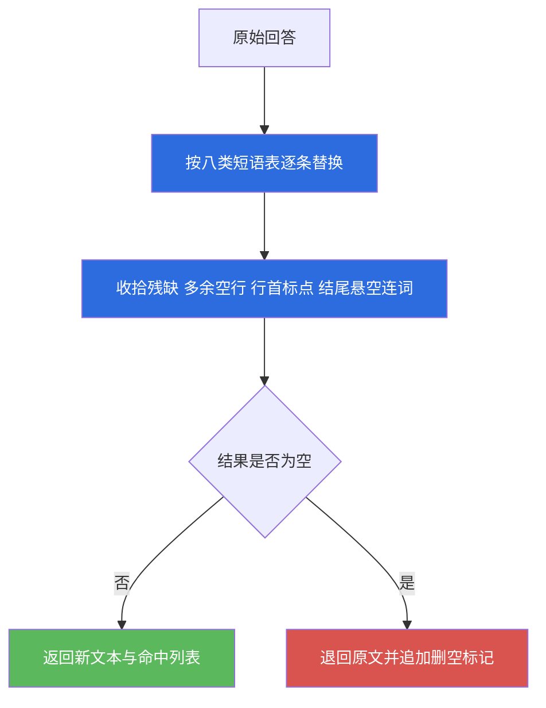

# 09 · 人格层（persona）

| 项目 | 内容 |
|---|---|
| 文档编号 | 09 |
| 模块名 | 人格层（persona） |
| 适用版本 | v1.0 |
| 最后更新 | 2026-09-14 |
| 维护者 | 小焦项目 |
| 文档状态 | 已发布，内容与 v1.0 代码同步；未落地部分在正文逐处标注 |
| 代码位置 | `core/persona/__init__.py` |
| 自测入口 | `tools/test_persona.py` |
| 相关数据 | `presets/*.json`（人设预设） |

## 目录

[摘要](#1-摘要) · [背景与问题](#2-背景与问题) · [设计目标](#3-设计目标) · [架构与原理](#4-架构与原理) · [接口与实现](#5-接口与实现) · [使用示例](#6-使用示例) · [边界与限制](#7-边界与限制) · [故障排查](#8-故障排查) · [参考](#9-参考) · [变更记录](#10-变更记录)

## 1. 摘要

人格层解决的问题是：输出不要带着默认的助手腔。

这一层由三项机制组成，全部是纯函数，不依赖模型与 Web 框架。

- 软约束：`PERSONA_RULES` 是一段固定文本，每次组装系统提示词时追加，内容为十条表达要求与四条禁止项。
- 硬后处理：`strip_flavor()` 用精确短语表删除空壳套话，`_tidy()` 收拾删除后残留的残缺句子；`audit()` 把"这段话像不像默认助手输出"算成一个 0 到 1 的数值，使这一层可以回归测试。

表达形式由 `pick_form()` 判定，共六种：列表、表格、分步、代码块、纯口语、普通段落。判据是用户要什么就给什么，而不是"没有格式就算像人"。

自测结果为通过 58 项、共 58 项，退出码 0。

### 1.1 定位

本模块服务于产品的定位：小焦是陪伴型本地助手，长期与同一个人相处，说话方式需要像人而不是像客服。本模块不改变这一定位，只负责让表达与定位保持一致。

人设文本由用户在设置页自行编写，仓库内也预置了几套，例如 `presets/xiaojiao-default.json` 与 `presets/闲聊陪伴.json`。预设风格的范围不受限，温和或猫娘风格的写法都允许；本模块不改 `presets/*.json` 的结构，只在其之上追加规则。

## 2. 背景与问题

默认输出的助手腔来自模型的训练先验，不是某一次生成的偶然失误。典型表现为：礼貌周全、追求全面、爱总结、爱分点、永远不表态。这些特征在同一个模型上高度稳定，换一个提示词写法只能缓解，不能消除。

只写进提示词不足以解决，原因是提示词属于软约束。参数量较小的模型在较长的回答里仍会带出模板开场或客套收尾，而人设里明明写着不要这样说。因此这一层在提示词之外补两件硬的事。

1. 删除。用精确短语表匹配并删除已知的空壳表达，这一步不依赖模型配合。
2. 度量。把助手腔折算成数值，使"这一层有没有效果"可以被测试而不是靠感觉判断。这两件事都不需要模型参与，因此可以在离线与自测环境中验证。

同时存在一个反方向的错误需要避免。用户明确要列表，回答却为显得自然而写成大段散文，这种偏离比套话更让人恼火，因为它意味着没听懂用户要什么。因此这一层的原则是判断用户要什么形式，而不是一律追求无格式。

## 3. 设计目标

### Goals

- 十条表达要求与四条禁止项以固定文本形式存在，每次组装提示词都带上，不靠模型临场发挥。
- 十类助手腔中有可识别短语的部分，用后处理真的删除，而不是只做提醒。
- 删除只删空壳，不删内容；删除后若句子残缺，一并收拾干净。
- 表达形式按用户诉求判定，用户的明确格式要求优先于语气判断。
- 助手腔折算为 0 到 1 的确定性数值，同输入同输出，可进测试与回归。
- 删空时退回原文，宁可少删也不给出空回答。
- 追加自定义规则时不破坏既有规则，也不修改预设文件结构。

### Non-Goals

- 不改写回答的实质内容，只删除空壳表达与收拾残缺标点。
- 不修改模型的解码参数，也不做采样策略调整。
- 不做人格建模，不生成新的人设文本；人设由用户或预设提供，本层也不做情感分析，不判断用户当前情绪。
- 不落盘。本层没有运行时状态，`stats()` 如实报告不存盘。

## 4. 架构与原理

### 4.1 两条作用路径与当前接线状态

**图 9-1 · 人格层的两条作用路径**

说明：绿色为已接入对话主流程，红色为模块内已实现但主流程尚未调用。



代码位置：软约束路径见 `core/persona/__init__.py` 的 `persona_block()`，接入点在 `xiaojiao_app.py` 的 `_persona_rules_text()`；硬后处理路径为同文件的 `strip_flavor()`、`audit()`、`polish()`。

接线状态需要说明清楚。`persona_block()` 已经接入，每次组装系统提示词时都会追加人格段落。另外三个函数的接入情况如下：`strip_flavor()` 与 `polish()` 未接入对话主流程，用户对话时回答不会被删除套话，这一层的硬后处理目前只在自测中被调用；`audit()` 同样未接入对话主流程，当前用途是自测与人工核对，报告中不出现实时分数。也就是说，当前真实生效的是软约束这一半。文档在此如实标注，不把"模块里有这个函数"写成"对话里会发生这件事"。

### 4.2 表达形式的判定

形式词表共五类，加一类兜底。判定的优先级顺序不可调换。

**图 9-2 · 表达形式判定的优先级**

说明：用户的明确格式要求排在最前，语气判断只在前者不命中时生效。



代码位置：`core/persona/__init__.py`，常量 `FORM_WORDS`、`_FORM_CN` 与函数 `pick_form()`、`form_hint()`。

带数量词的要求单独用正则识别，例如"列 5 条""列三条"这类写法。只用词表会漏掉这种变形，自测中也确实抓到过这处漏判。

形式判定完成后，`form_hint()` 把形式翻成一句给模型的硬要求。其中纯口语一档写明不许列点、不许小标题、不许总结段；列表与分步一档写明必须给出条目。

### 4.3 助手腔的评分

`audit()` 输出多个判据的累加值，上限为 1.0。

**图 9-3 · 助手腔评分的累加判据**

说明：每条判据对应一类具体毛病，便于测试与人工核对；套话部分最高累计 0.6。



代码位置：`core/persona/__init__.py`，函数 `audit()`，正则 `_LIST_MARK` 与 `_TABLE_MARK`。

返回值中 `score` 与 `ai_ness` 相同，`human` 为 1 减去该值。`issues` 列出命中的具体原因，`form_ok` 表示形式是否合乎用户要求。实测样例：一段既分点又带模板开场与过度礼貌的闲聊回答，得分为 0.55，问题清单为 `['套话:template_open', '套话:over_polite', '闲聊里分了点（用户在搭话，不是要说明书）']`。

### 4.4 套话删除与空输出退回

**图 9-4 · 删除套话并处理删空情形**

说明：删除后若整段为空，退回原文，宁可少删也不给出空回答。



代码位置：`core/persona/__init__.py`，常量 `AI_TROPES` 与函数 `strip_flavor()`、`_tidy()`、`polish()`。

`polish()` 是对外的主入口，先判定形式再删除套话。顺序不可颠倒，因为删除会改变文本形态，例如删掉"以下是步骤："之后，后面的列表就失去了引导句，先定形式再删才不会误判。

## 5. 接口与实现

### 5.1 常量

| 常量 | 内容 |
|---|---|
| `AI_TROPES` | 八类套话与对应的精确短语正则，键为 `self_expose`、`template_open`、`over_apology`、`over_polite`、`over_explain`、`fake_humble`、`no_stance`、`over_hedge` |
| `FORM_WORDS` | 五类形式的触发词表，键为 `list`、`table`、`steps`、`code`、`chat` |
| `_FORM_CN` | 六种形式的中文名，含兜底项 `prose` |
| `PERSONA_RULES` | 十条表达要求与四条禁止项的固定文本 |

关于十类与八类的对应关系需要说明。规格列出十类助手腔：自我暴露、模板开场、万能道歉、过度礼貌、语气一致、没有立场、过度解释、假装不懂、死板格式、没情绪。代码中带精确短语表的是八类，其余两类的落地方式不同：死板格式由表达形式矩阵处理，对应 `pick_form()` 与 `form_hint()`，不靠删除；语气一致与没情绪没有可删除的具体短语，由 `PERSONA_RULES` 中的"有情绪""有自己的语气"两条规则与 `audit()` 中的人称判据覆盖。后两类是否生效，当前只有自测覆盖，真实对话中的效果未实测。

### 5.2 函数

| 函数 | 签名 | 说明 |
|---|---|---|
| `pick_form` | `pick_form(user_text, answer="")` | 判定表达形式，返回 `list`、`table`、`steps`、`code`、`chat`、`prose` 之一 |
| `form_hint` | `form_hint(form)` | 把形式翻成给模型的一句硬要求 |
| `strip_flavor` | `strip_flavor(text)` | 删除套话，返回 `(新文本, 删掉的命中列表)` |
| `_tidy` | `_tidy(t)` | 收拾删除后残留的多余空行、行首孤立标点与结尾悬空连词 |
| `persona_block` | `persona_block(extra="")` | 拼出可注入系统提示词的人格段落，`extra` 为追加的自定义规则 |
| `audit` | `audit(text, user_text="", form=None)` | 返回 `{"score", "ai_ness", "human", "issues", "form", "form_cn", "form_ok"}` |
| `polish` | `polish(text, user_text="")` | 主入口，返回 `{"text", "form", "form_cn", "form_hint", "removed", "before", "after"}` |
| `stats` | `stats()` | 返回 `{"tropes", "trope_kinds", "forms", "persistent", "note"}`，其中 `persistent` 为 `False` |

命中列表的格式为 `套话种类名` 加 `×` 加次数，例如 `template_open×1`。删空退回时会在列表末尾追加一项 `|删空退回原文`。

## 6. 使用示例

以下代码可直接复制运行。运行前设置环境变量 `PYTHONUTF8` 为 `1`，工作目录为仓库根。

### 6.1 判定表达形式

```python
from core import persona as P

print(P.pick_form("给我列 5 条建议"))     # list
print(P.pick_form("做成表格对比一下"))     # table
print(P.pick_form("这个怎么做，给我步骤"))  # steps
print(P.pick_form("写个 python 函数"))    # code
print(P.pick_form("今天好累啊"))          # chat
print(P.form_hint("chat"))
```

`form_hint("chat")` 的输出为一句禁止分点的硬要求，内容包含"不要列点、不要小标题、不要总结段"。

### 6.2 删除套话

```python
from core import persona as P

text = "当然可以。以下是步骤：\n1. 备份\n2. 改配置\n希望以上对你有帮助。"
out, removed = P.strip_flavor(text)
print(removed)
print(out)
```

实测的删除结果为命中列表含 `template_open×1` 与 `over_polite×1`，正文条目一条不少。删除后留下的引导句与条目为：

```text
以下是步骤：
1. 备份
2. 改配置
```

### 6.3 打分与主入口

```python
from core import persona as P

r = P.audit("当然可以。首先你要知道，这很简单。希望以上对你有帮助。", "你好")
print(r["score"], r["human"], r["issues"], r["form_ok"])

p = P.polish("当然可以。以下是步骤：\n1. 备份\n2. 改配置\n希望以上对你有帮助。", "给我步骤")
print(p["form"], p["removed"], p["before"], p["after"])
```

### 6.4 取出可注入的人格段落

```python
from core import persona as P

print(P.stats())
print(P.persona_block()[:80])
print(P.persona_block("自定义补充"))
```

`stats()` 报告的套话种类数为 8，形式种类为 6，`persistent` 为 `False`。

### 6.5 跑自测

```powershell
$env:PYTHONUTF8="1"
python tools/test_persona.py
```

写档当日输出为通过 58 项，共 58 项。自测覆盖七个分组：十条助手腔的逐条识别、后处理边界、表达形式矩阵、评分可回归、人味规则确实拼进提示词、主入口串联、概览如实。自测不产生落盘文件。

## 7. 边界与限制

- `strip_flavor()`、`polish()`、`audit()` 未接入对话主流程，用户对话时回答不会被删除套话，也不会被打分。详见 4.1 节。
- 短语表按精确匹配工作，只覆盖已知写法。同义改写不在表内的客套表达不会被删除。扩大正则的范围会带来误删正常句子的风险，因此这一取舍是有意为之。
- 语气一致与没情绪两类没有可删除的短语，只由提示词规则覆盖，真实对话中的效果未实测。
- 形式判定的词表是有限集合。用户用表外说法提出格式要求时，可能被判为纯口语或普通段落，从而与用户预期不符。判定准确率的量化评估未实测。
- 评分是启发式累加，不含语义判断。一段完全没有人味的文字若不含任何判据特征，得分可以为 0。
- 本层不落盘，没有历史数据可查；`stats()` 只报告静态概览。
- 本层不修改 `presets/*.json`。预设里的 `role` 字段由用户直接编写，其内容不受本层规则约束；本层也不处理多轮一致性，不判断回答是否符合上文的语气。

## 8. 故障排查

| 现象 | 可能原因 | 排查方式 |
|---|---|---|
| 回答里仍有"希望以上对你有帮助" | 硬后处理未接入主流程，只有提示词规则在生效 | 确认 `strip_flavor()` 是否被调用；当前主流程未调用，属已知状态 |
| 走完 `polish()` 后回答变空 | 整段都是套话 | 检查返回的 `removed` 列表，末尾会出现删空标记；此时文本已退回原文 |
| 用户要列表，得到的却是散文 | 形式判定命中了闲聊分支 | 用 `pick_form()` 单独试该输入，确认返回值 |
| 用户要表格，问题清单里出现"没有表格" | 回答确实没有 Markdown 表格 | 检查回答中是否存在 `|` 分隔的行 |
| 一段正常回答得分偏高 | 命中了套话正则 | 查看 `issues` 列表，逐条与 `AI_TROPES` 对照 |
| `persona_block()` 输出里没有自定义内容 | 传入的 `extra` 为空或只有空白 | 该参数为空时按设计不追加任何内容 |

## 9. 参考

- 设计理念第十节人格层：[../design-philosophy.md](../design-philosophy.md)
- 架构图册：[../architecture-diagrams.md](../architecture-diagrams.md)
- 代码：`core/persona/__init__.py`
- 人设预设：`presets/xiaojiao-default.json`、`presets/闲聊陪伴.json`、`presets/编程助手.json`
- 自测：`tools/test_persona.py`
- 相邻模块文档：`docs/modules/08-metacognition.md`、`docs/modules/10-boost.md`
## 10. 变更记录

| 日期 | 版本 | 变更内容 | 维护者 |
|---|---|---|---|
| 2026-09-14 | v1.0 | 首次发布。记录八类短语表、六种表达形式、评分判据与主入口，并标注硬后处理尚未接入对话主流程 | 小焦项目 |

---

## 变更记录

| 日期 | 版本 | 变更 |
| --- | --- | --- |
| 2026-09-14 | v1.0 | 首次发布：祛 AI 味与长人味两条规则集 |
