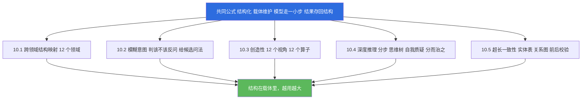
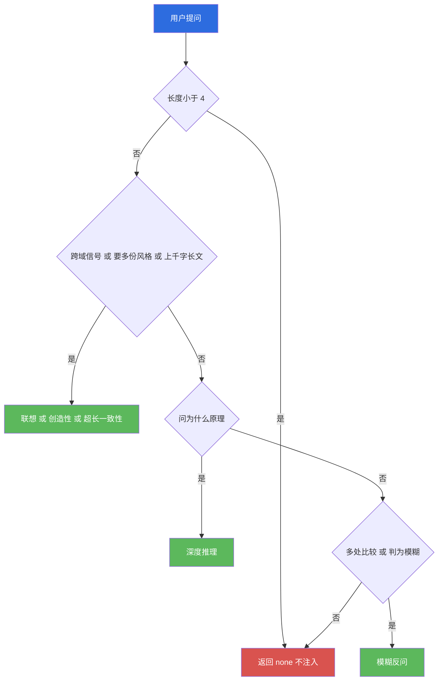
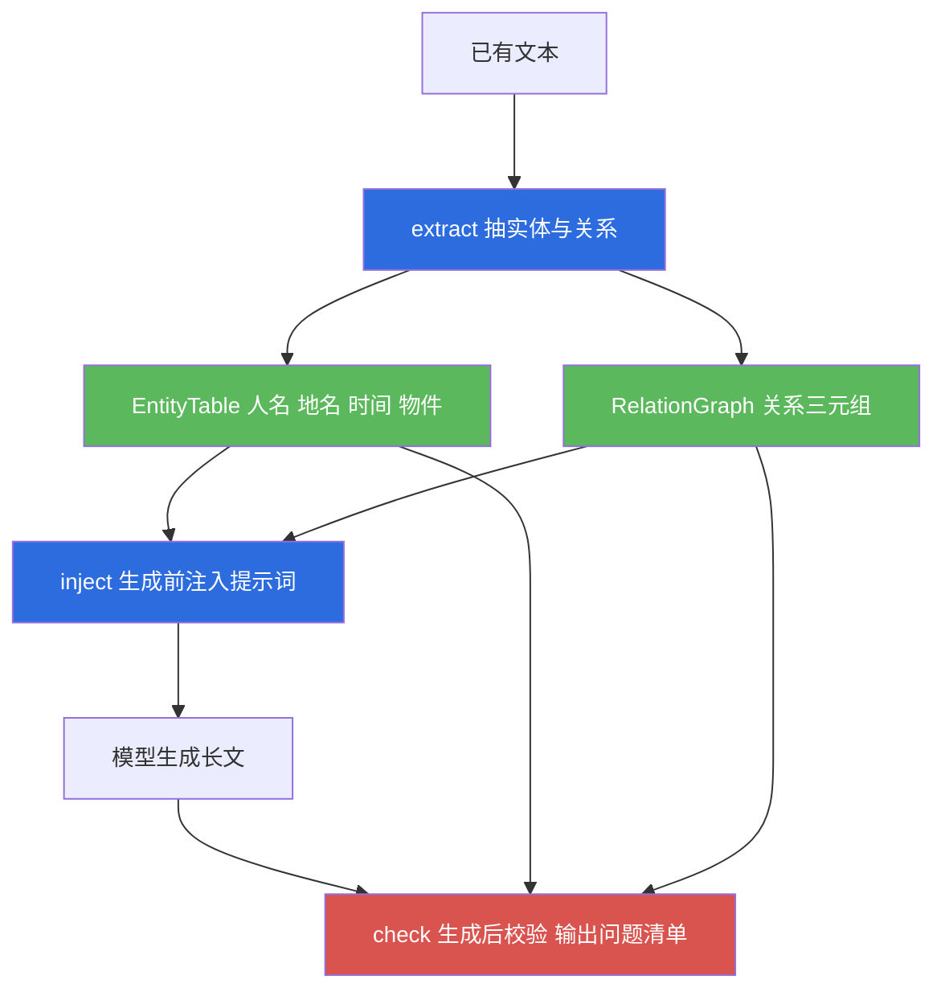

# 10 · 极限补刀五项（boost）

| 项目 | 内容 |
|---|---|
| 文档编号 | 10 |
| 模块名 | 能力增益包（boost），含五项补刀 |
| 适用版本 | v1.0 |
| 最后更新 | 2026-09-14 |
| 维护者 | 小焦项目 |
| 文档状态 | 已发布，内容与 v1.0 代码同步；未落地部分在正文逐处标注 |
| 代码位置 | `core/boost/`（调度层加各项模块） |
| 自测入口 | `tools/test_boost.py` |
| 数据落盘 | `logs/boost/` |

## 目录

[摘要](#1-摘要) · [背景与问题](#2-背景与问题) · [设计目标](#3-设计目标) · [架构与原理](#4-架构与原理) · [接口与实现](#5-接口与实现) · [使用示例](#6-使用示例) · [边界与限制](#7-边界与限制) · [故障排查](#8-故障排查) · [参考](#9-参考) · [变更记录](#10-变更记录)

## 1. 摘要

本包解决的问题是：参数量较小的模型"不会想"。它会把"帮我搞一下"当成可以立刻回答的问题，会把长文第三段里的人名写错，会在需要归纳时交出一段散文。这些不是智力不足，而是缺少外部结构支撑。本包包含五项，全部遵守同一个公式：把不确定的东西结构化，结构由载体维护，模型每次只走一小步，每一步的结果存回结构。

| 编号 | 项 | 代码位置 |
|---|---|---|
| 10.1 | 跨领域结构映射 | `core/boost/analogy.py` |
| 10.2 | 模糊意图反问 | `core/boost/vague.py` |
| 10.3 | 多视角采样与创意算子 | `core/boost/creative.py` |
| 10.4 | 单次深度推理 | `core/boost/deepthink.py` |
| 10.5 | 超长一致性 | `core/boost/consistency.py` |

五项由 `core/boost/__init__.py` 的 `dispatch()` 统一选型。一轮对话只挑一项补刀，命不中则一项不加，理由见 4.2 节。自测结果为通过 195 项、共 195 项，退出码 0。

## 2. 背景与问题

把同一条提示词交给更大的模型，同样的错误会少一些，但不会消失。把结构补上则不同：映射库、实体表这些资产由载体维护，与模型参数量无关，也不随换模型而失效。这与"模型是可替换零件"的架构取向一致，也是本包不做重训的原因，重训一次会把通用能力换掉一部分，换模型时还会全部作废。五项各自对应一类缺口：需要归纳或反证时模型倾向直接给结论，需要长链推导时一次给出整条链而中途错一步即全错，需要解释陌生问题时缺少可借用的结构，用户表述含糊时按自己的假设硬答，需要创意时给出平均化的答案，需要深度推理时走最短路径，生成超长内容时中途改变人名写法与设定。

## 3. 设计目标

### Goals

- 五项共享同一批底层工具：文本规整、中文二元组、命中词查询、落盘目录、事件流水。
- 结构由载体维护，判断、打分、连边、归一都在载体代码中完成，模型只执行其中一小步。
- 每项的结果可以存回结构，使资产随使用增长。
- 选型是纯规则、只读、确定性的，每轮都跑且开销可忽略；选不出来时不硬塞。
- 参数为脏值、输入超长、模块单独 import 时都不抛异常；全程不删除任何文件，落盘只使用写、追加与覆盖。

### Non-Goals

- 不训练、不微调模型，不改变权重。
- 不引入新的第三方依赖，不使用分词库或向量模型。
- 不替代元认知层与人格层；本包只提供推理与生成的脚手架。
- 不保证注入提示词一定改变输出；注入的是方法提示，执行由模型完成。
- 不做在线学习；写回结构需要显式调用，不是对话中自动发生。

## 4. 架构与原理

### 4.1 共同公式与五项

**图 10-1 · 五项与共同公式**

说明：五项结构不同，但都走同一条四步公式；缺少第四步，前三步就退化为普通的提示词工程。



代码位置：`core/boost/__init__.py` 的总纲注释，以及各模块各自的文件头注释。

### 4.2 一轮只挑一种补刀

**图 10-2 · dispatch 的选型顺序**

说明：按顺序逐项试探，命中即返回并结束；全部不命中时返回 `kind` 为 `none`，不注入任何内容。



代码位置：`core/boost/__init__.py`，函数 `dispatch()`，返回 `{"kind", "text", "why", "evidence"}`。图把性质相近的判据并成一组，实际执行是逐项试探，顺序为：跨领域联想、创造性、超长一致性、深度推理、模糊意图反问。命中即返回并结束，不再往下试。

**为什么一轮只挑一种。** 五种提示词同时塞进系统提示词，等于要求模型在同一轮里同时做五件事：一边列推理步骤，一边借别的领域结构，一边反问澄清，一边给多个视角，一边守住实体一致性。这些要求彼此冲突：反问要求先别答，深度推理要求立刻开始分步；多视角要求发散，一致性要求收敛。实际结果不是能力叠加，而是方法互相干扰，输出变成谁都没执行到位。成本是第二个原因：每一项都要占用提示词额度，而额度存在硬上限，五项叠在一起会把额度吃光，反而挤掉记忆、工具说明与技能文档。因此选型按问题类型只取一项，问题不属于任何一项时不做任何注入。

顺序中有一处刻意安排：跨领域联想必须排在模糊意图之前。实测中"用物理学的思维分析一下公司现金流"会被模糊意图判为缺宾语，但用户已经把方法说清楚了，这种句子该走跨领域联想，不该被反问。

### 4.3 超长一致性

**图 10-4 · 实体表、关系图与生成前后校验**

说明：生成之前把已登记实体注入提示词，生成之后再校验文本，两次使用同一张表。



代码位置：`core/boost/consistency.py`，类 `EntityTable` 与 `RelationGraph`，函数 `extract()`、`inject()`、`check()`、`save()`、`load()`。实体表处理同名归一：`merge_alias()` 把同一实体的不同写法并成一条，保留首次出现的写法作为规范名，其余写法进入别名列表。类型冲突指同一个名字被登记为两种实体类型。关系矛盾指同一对实体之间同时存在互斥关系，例如"是"与"不是"。校验结果中的"新实体"不计为错误，文本里出现表外名字可能是新引入的角色，也可能是同一个人的新写法，需要确认后再登记。

### 4.4 越用越大的落盘资产与当前闭环状态

共同公式的第四步是"结果存回结构"。当前哪些资产真的会增长，需要按实测如实区分。

| 资产 | 文件 | 读取当日状态 |
|---|---|---|
| 事件流水 | `logs/boost/boost.jsonl` | 持续增长，845 行 |
| 创造性台账与深度推理记录 | `logs/boost/creative_uses.json`、`logs/boost/creative/samples.jsonl`、`logs/boost/deepthink/plans.jsonl` | 持续增长 |
| 追加结构映射 | `logs/boost/maps.json` | 1 条映射，来自自测写入 |
| 实体表快照 | `logs/boost/consistency.json` | 当前为 0 字节文件，读取时返回空表 |
| 模糊意图案例 | 无 | `case_stats()` 读取时为 0 条，`record_case()` 尚无调用方 |

由此得到明确结论：真正随对话增长的是事件流水、创造性台账与深度推理记录。结构映射库与实体表的写回路径目前只在自测中被走到，**真实对话中不会增长**；超长一致性在对话中不建表也不做生成后校验，`extract()` 与 `check()` 无对话侧调用方，此项属于**设计，未落地**。

## 5. 接口与实现

### 5.1 共用工具与调度入口

`core/boost/__init__.py` 不存放任何一项的业务逻辑，只提供共用工具，并通过 PEP 562 的模块级 `__getattr__` 惰性导出各子模块，避免循环 import。

| 函数 | 签名 | 说明 |
|---|---|---|
| `boost_dir` | `boost_dir(sub=None)` | boost 数据目录，默认 `logs/boost/` |
| `boost_path` | `boost_path(name)` | 只算路径，不建目录不碰文件 |
| `norm` | `norm(text)` | 规整为可安全处理的字符串，`None` 转为空串 |
| `cjk_count` | `cjk_count(text)` | 数中日韩表意文字个数 |
| `bigrams` | `bigrams(text)` | 中文二元组 |
| `hits` | `hits(text, words)` | 命中的词，按在原文中首次出现的位置排序并去重；`has_any()` 为其布尔快路径，`weighted_hits(text, words, weight=1.0)` 返回命中词数乘以权重 |
| `note` | `note(event, **kw)` | 往事件流水追加一条记录 |
| `dispatch` | `dispatch(question)` | 按类型挑一项，返回 `{"kind", "text", "why", "evidence"}` |

`dispatch()` 返回的 `kind` 取值与对应模块：`analogy`、`creative`、`consistency`、`deepthink`、`vague`、`none`。`evidence` 是给人看的短标签，用于日志与验证。全程只读、纯规则、不调模型。

### 5.2 五项的公开函数

| 项 | 主要函数 |
|---|---|
| 10.1 analogy | `list_maps()`、`add_map(from_domain, to_domain, pairs, m_id=None, note="")`、`domain_vector(text)`、`best_domain(text)`、`map_structure(text)`、`analogies(text, limit=3)` |
| 10.2 vague | `ambiguity(question)`、`clarify_candidates(question, n=5)`、`hypotheses(question, n=3)`、`should_ask(question, threshold=0.5)`、`explain(question)`、`record_case(question)`、`case_stats()` |
| 10.3 creative | `resample(question, n=5)`、`apply_operator(op_id, seed="")`、`random_seeds(question, n=3)`、`stats()` |
| 10.4 deepthink | `cot_prompt(question)`、`tot_branches(question, n=3)`、`self_doubt(answer)`、`divide(question, n=4)`、`plan(question, mode="auto")`、`evaluate(candidates, llm_fn=None)`、`stats()` |
| 10.5 consistency | `extract(text)`、`inject(table, prompt)`、`check(text, table, rels)`、`save(table, rels, path=None)`、`load(path=None)` |

几处约定需要说明。`plan()` 的 `mode` 取 `cot`、`tot`、`doubt`、`divide` 之一，`auto` 表示按问题自动选型。`evaluate()` 在未提供模型函数时使用规则打分，并在结果中如实标注来源，不会假装模型评过。`apply_operator()` 的随机扰动由问题文本与给定种子决定，使用稳定散列而非内置 `hash`，因此跨进程可复现。

## 6. 使用示例

以下代码可直接复制运行。运行前设置环境变量 `PYTHONUTF8` 为 `1`，工作目录为仓库根。

### 6.1 选型

```python
from core.boost import dispatch

for q in ("帮我搞一下", "为什么天是蓝的", "用物理学的思维分析一下公司现金流"):
    r = dispatch(q)
    print(r["kind"], "|", r["why"], "|", r["evidence"])
```

三句依次命中模糊意图、深度推理与跨领域联想。长度小于 4 的输入与不含任何信号的输入返回 `none`。

### 6.2 跨领域联想、模糊意图、创造性与深度推理

```python
from core.boost import analogy as A, vague as V, creative as C, deepthink as D

print(A.best_domain("电压不够，电流就小，电阻太大"), A.list_maps()[:2])
print(V.ambiguity("帮我搞一下"), V.clarify_candidates("帮我搞一下", n=4))
print([s["perspective"] for s in C.resample("给这个功能想个开场白", n=3)])
print(C.apply_operator("invert", seed="seed-abc")["twist"])
print(D.plan("为什么天是蓝的")["mode"])          # cot
print(D.plan("帮我看看这个答案对不对")["mode"])   # doubt
print(D.evaluate(["短", "因为 A，所以 B。例如 C。"]))
```

`ambiguity()` 对"帮我搞一下"给出的信号包含过短、缺宾语、含歧义词与多义动词缺对象。自测当日 `list_maps()` 返回 12 条映射，领域表 12 个；`creative.stats()` 报告视角 12 个、算子 12 个、种子池 20 条；`evaluate()` 在无模型时 `scored_by` 为 `rule`。

### 6.3 一致性校验与自测

```python
from core.boost import consistency as CS

tbl, rels = CS.extract("沈清住在济南，2026年9月14日认识了李医生。")
print(tbl.names(), rels.all())
print(CS.check("沈清舟住在济南。", tbl, rels)["issues"])
```

`check()` 会把"沈清舟"识别为"沈清"的别名写法并给出统一写法建议。自测当日 `extract()` 从同一句话中抽出了 5 个实体。

```powershell
$env:PYTHONUTF8="1"
python tools/test_boost.py
```

自测覆盖九个分组。自测不删除任何文件，只删除自己写入的带标记行，并在结束时把标记数据从真实路径还原。

## 7. 边界与限制

- **本包曾评估过元推理模板库与长链因果图两个方向，已永久划掉，本文档不再描述。** 对应代码 `core/boost/reasoning.py`、`core/boost/causal.py` 以及 `dispatch()` 中的 `reasoning`、`causal` 两个分支仍留在仓库里，属待清理的遗留，未被对话主流程调用。
- 一轮只挑一项补刀。同一问题同时具备多种特征时只有排在前面的那一项生效，其余不生效，详见 4.2 节。
- 选型基于关键词与规则，不调用模型。表述与关键词表不匹配时不会命中，因此存在漏选；跨领域联想另受领域词表限制，说法不在词表内时判不出源领域，`analogies()` 返回空列表，调度层虽有兜底匹配，覆盖范围仍限于内置映射表。命中率的量化评估未实测。
- 结构映射库与实体表的写回路径未接入对话主流程，真实对话中不会增长；模糊意图的误反问记账同样尚无调用方，详见 4.4 节。
- 实体抽取为纯规则，对中文人名与地名的识别依赖上下文模式，对非常见写法与外语名称的识别能力未实测。
- 深度推理的 `evaluate()` 规则分基于长度、依据词命中与用字重复度，属于启发式，不代表答案正确性；提示词被注入也不等于模型照做，实际执行率未实测。本包全程不删除文件，`save()` 类函数采用直写而非临时文件加重命名。

## 8. 故障排查

| 现象 | 可能原因 | 排查方式 |
|---|---|---|
| `dispatch()` 总返回 `none` | 问题过短，或不含任何一类的信号词 | 打印返回的 `kind` 与 `why`，逐条与 4.2 节的判据对照 |
| 用户明确要跨界却走了反问 | 跨域信号未命中关键词表 | 检查问题中是否含思维、视角、角度、类比这类信号 |
| 一致性校验把新角色报成问题 | 表外名字会被列为"新实体" | 该项不计为错误，确认后用 `merge_alias()` 登记 |
| 事件流水没有新记录 | 写入被容错分支吞掉 | 查看 `logs/boost/boost.jsonl` 的最后几行与文件修改时间 |
| 单独 `import core.boost.reasoning` 报错 | 取了 `__all__` 之外的名字 | 改用具名导入，例如 `from core.boost import reasoning` |

## 9. 参考

- 设计理念第十一节通用与专用：[../design-philosophy.md](../design-philosophy.md)
- 架构图册图 11 极限补刀五项：[../architecture-diagrams.md](../architecture-diagrams.md)
- 代码：`core/boost/reasoning.py`、`core/boost/causal.py`、`core/boost/analogy.py`、`core/boost/vague.py`、`core/boost/creative.py`、`core/boost/deepthink.py`、`core/boost/consistency.py`、`core/boost/__init__.py`
- 自测：`tools/test_boost.py`
- 相邻模块文档：`docs/modules/08-metacognition.md`、`docs/modules/09-persona.md`

## 10. 变更记录

| 日期 | 版本 | 变更内容 | 维护者 |
|---|---|---|---|
| 2026-09-14 | v1.0 | 首次发布。记录五项接口与共同公式，写明一轮只挑一项的约束与理由，并标注四项资产的写回路径尚未接入 | 小焦项目 |

---

## 变更记录

| 日期 | 版本 | 变更 |
| --- | --- | --- |
| 2026-09-14 | v1.0 | 首次发布：五项补刀的结构、调度与一轮只挑一种的取舍 |
