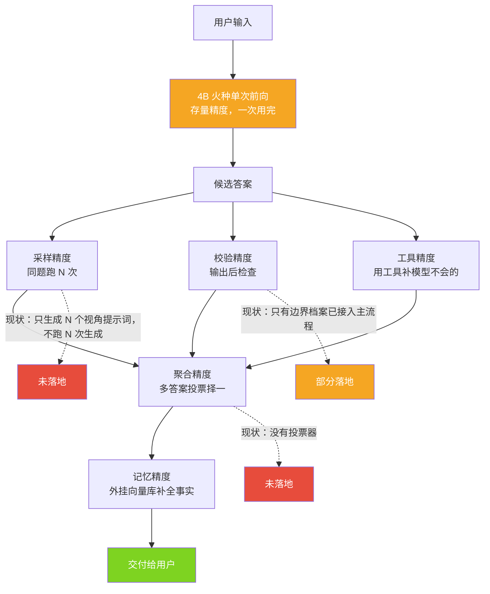
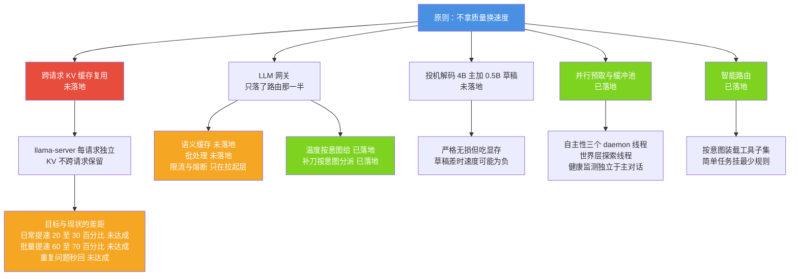
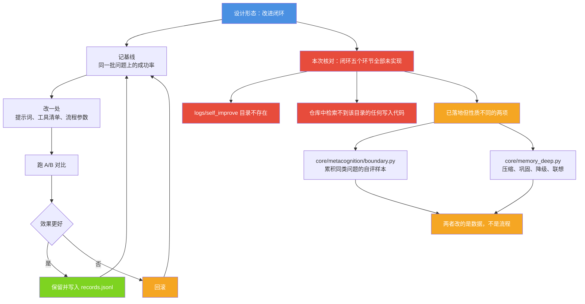
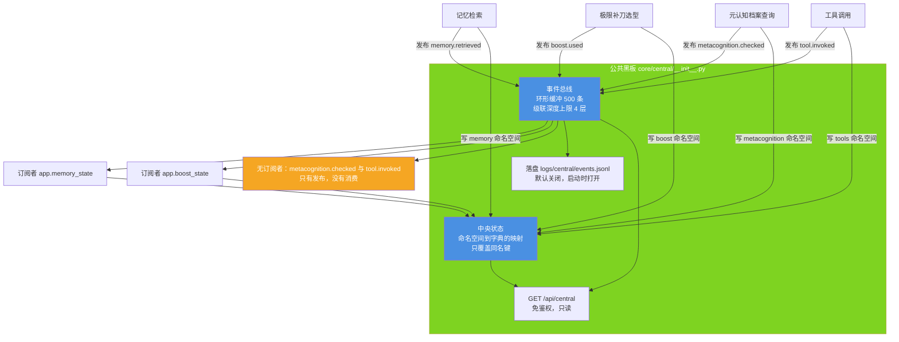
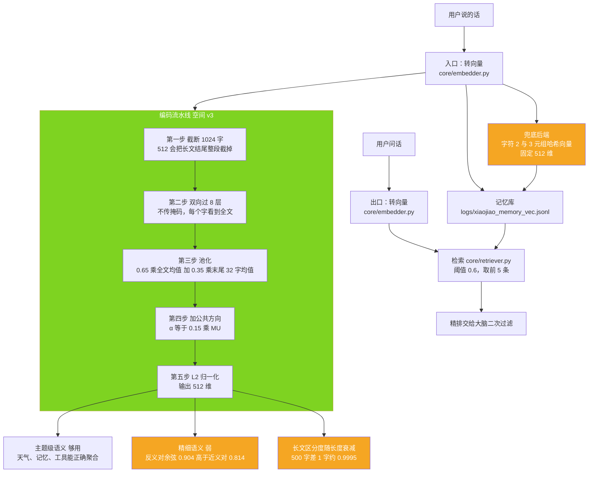
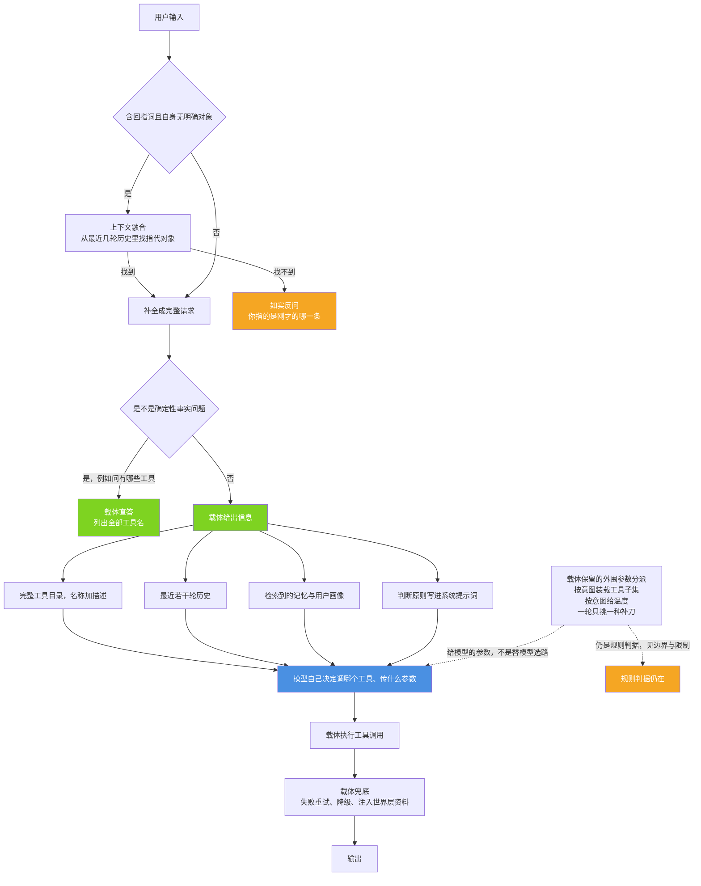
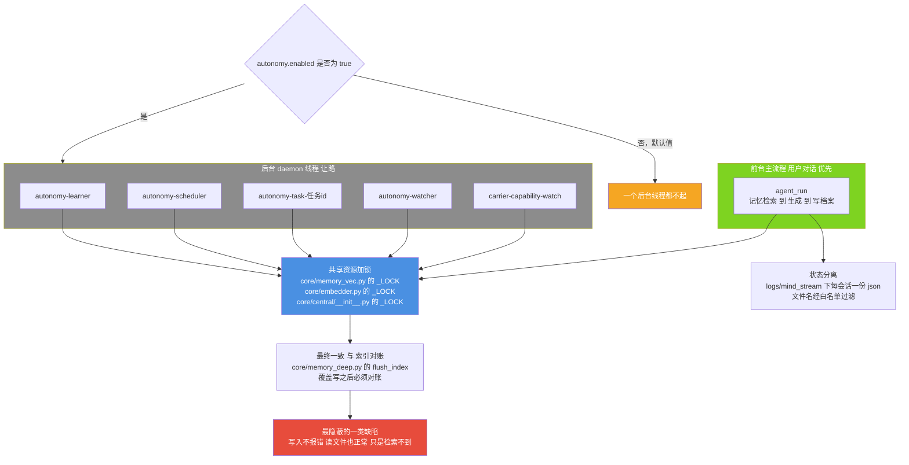

# 小焦 · 后半篇八节技术实现文档

> 本文档是 [`docs/design-philosophy.md`](../design-philosophy.md) 后半篇（第十四至二十二节）的展开版。
> 设计哲学回答"为什么这么做"，本文档回答"代码在哪、怎么调、哪里没做完、坏了怎么查"。
> 每一节的实现状态都以仓库代码与实测输出为准；设计文档与代码不一致时，以代码为准，并在本文档的
> 「修正过的与设计文档不符之处」中逐条列出。

---

## 文档元信息

| 项 | 内容 |
|---|---|
| 文档名称 | 小焦 · 后半篇八节技术实现文档 |
| 适用版本 | v1.0 |
| 最后更新 | 2026-09-14 |
| 维护者 | 小焦项目 |
| 文档状态 | 已发布。八节全部完成代码核对；各节与设计文档不符之处或已知缺陷已逐条列出 |
| 覆盖范围 | 设计哲学第十四节至第二十二节 |
| 图册对照 | [`docs/architecture-diagrams.md`](../architecture-diagrams.md) 图 12 至图 19 |
| 术语约定 | 载体指 `core/` 与本仓库主程序构成的全部非模型代码；火种指可替换的推理模型 |

---

## 目录

1. [第十四节 · 精度叠加](#第十四节--精度叠加载体给模型附加等效精度)
2. [第十五节 · 速度优化](#第十五节--速度优化只做无损加速)
3. [第十七节 · 自我改进](#第十七节--自我改进)
4. [第十八节 · 全局工作空间](#第十八节--全局工作空间公共黑板)
5. [第十九节 · 小脑定位](#第十九节--小脑定位感官与记忆索引器官)
6. [第二十节 · 意图理解交给模型](#第二十节--意图理解交给模型不做规则分流)
7. [第二十一节 · 并发与状态一致性](#第二十一节--并发与状态一致性)
8. [第二十二节 · 可观测性](#第二十二节--可观测性)

---

## 八节实现状态总表

状态口径：已落地指功能已接入运行主流程并有实测产物；部分落地指代码存在但只覆盖设计的一部分，
或只被测试调用而未接入主流程；设计未落地指仓库中没有对应实现。

| 章 | 主题 | 状态 | 一句话 | 代码位置 |
|---|---|---|---|---|
| 十四 | 精度叠加 | 部分落地（五项中三项完整、一项部分、一项未落地） | 权重改不了，就在模型外面叠校验与检索 | `core/health/degeneration.py`、`core/metacognition/`、`core/memory_vec.py`、`core/memory_deep.py`、`plugins/` |
| 十五 | 速度优化 | 部分落地（五项中三项已落地、一项半落地、两项未落地） | 只做无损加速，不拿质量换速度 | `core/mind_stream/inject.py`、`core/boost/__init__.py`、`core/health/heal.py` |
| 十七 | 自我改进 | 设计未落地 | `logs/self_improve/` 目录与写入路径都不存在 | 无。相邻能力见 `core/metacognition/boundary.py`、`core/memory_deep.py` |
| 十八 | 全局工作空间 | 已落地（订阅侧偏薄） | 中央状态与事件总线都在跑，但订阅者只有两个 | `core/central/__init__.py`、`logs/central/events.jsonl`、`GET /api/central` |
| 十九 | 小脑定位 | 已落地（边界明确） | 空间 v3 已上线，长文区分度与召回率均有自测数字 | `core/embedder.py`、`core/retriever.py`、`tools/test_embedder_long.py` |
| 二十 | 意图理解交给模型 | 已落地（规则仍用于工具装载） | 上下文融合与工具选择已交给模型，载体保留外围参数分派 | `xiaojiao_app.py` 的 `merge_context`、`_intent_tool_names`、`tools/test_context_merge.py` |
| 二十一 | 并发与状态一致性 | 已落地（最终一致） | 后台线程加锁加对账，唤醒条件受配置门控 | `core/autonomy/`、`core/memory_vec.py`、`core/memory_deep.py`、`core/mind_stream/state.py` |
| 二十二 | 可观测性 | 部分落地（日志层完整、面板未落地） | 日志齐，指标与追踪只覆盖一角 | `logs/`、`GET /api/central`、`GET /metrics` |

### 八节状态全景

```mermaid
%%{init: {"themeVariables": {"fontSize": "14px"}, "flowchart": {"htmlLabels": true, "wrappingWidth": 320, "nodeSpacing": 44, "rankSpacing": 58, "useMaxWidth": true}}}%%
flowchart TB
    ROOT["后半篇八节 · 实现状态"]

    ROOT --> A["十四 精度叠加<br/>部分落地"]
    ROOT --> B["十五 速度优化<br/>部分落地"]
    ROOT --> D["十七 自我改进<br/>设计未落地"]
    ROOT --> E["十八 全局工作空间<br/>已落地"]
    ROOT --> F["十九 小脑定位<br/>已落地"]
    ROOT --> G["二十 意图理解交给模型<br/>已落地"]
    ROOT --> H["二十一 并发与状态一致性<br/>已落地"]
    ROOT --> I["二十二 可观测性<br/>部分落地"]

    A --> A1["已落地：记忆精度、工具精度、元认知边界档案"]
    A --> A2["未落地：同题跑 N 次并择一的完整流水线"]
    B --> B1["已落地：智能路由、并行预取"]
    B --> B2["未落地：语义缓存、批处理、投机解码、跨请求 KV 复用"]
    D --> D1["机制可改数据，不可改流程"]
    E --> E1["发布 4 类主题，订阅 2 个"]
    F --> F1["512 维、截断 1024 字、尾窗 32 字、标定 α=0.15"]
    G --> G1["上下文融合 91 项自测全过"]
    H --> H1["5 个 daemon 线程名、3 把锁、1 处索引对账"]
    I --> I1["设置页无系统状态面板"]

    style ROOT fill:#4A90E2,color:#fff
    style A fill:#F5A623,color:#fff
    style B fill:#F5A623,color:#fff
    style D fill:#E74C3C,color:#fff
    style E fill:#7ED321,color:#fff
    style F fill:#7ED321,color:#fff
    style G fill:#7ED321,color:#fff
    style H fill:#7ED321,color:#fff
    style I fill:#F5A623,color:#fff
```



**图 0 · 八节实现状态全景**

一句话说明：三个绿色块是完整可用的部分，橙色块是覆盖不全的部分，红色块是完全没有实现的部分。

代码位置索引：`core/central/__init__.py` 的 `snapshot()`、`core/embedder.py` 的 `info()`、
`xiaojiao_app.py` 的 `merge_context()`、`core/autonomy/` 的线程名。

---

# 第十四节 · 精度叠加（载体给模型附加等效精度）

## 摘要

模型权重在部署阶段是固定的。能在模型外面改变的，是每一轮现场生成、现场校验、现场检索的那一圈机制。
设计哲学把这一圈称为流量精度：不进权重、每轮重算、可以叠加。
本节逐项核对五种附加精度的真实落点，并说明完整的"跑 N 次加校验择一"流水线并没有落地。

## 背景与问题

4B 参数量的模型在单次前向里只有一次机会。同一次前向结束后，答案无法再被修正。
模型权重里已经烧进去的能力称为存量精度，训练完成即固定。
载体能做的是在同一次用户请求的生命周期内增加校验、检索、重试与工具调用，
用可累加的机制换取准确度。这条路的代价是时间与显存，不是零成本。

## 设计目标

| Goals | Non-Goals |
|---|---|
| 在不改权重的前提下提高输出可靠度 | 提高模型单次推理的智力上限 |
| 让每一种附加精度都有可指认的代码落点 | 用规则判据替代模型做语义理解 |
| 精度叠加的代价（时间、显存）可被如实说明 | 让叠加成为所有任务的默认路径 |
| 未落地的部分明确标注，不写成已实现 | 声称"4B 加载体超过 360B 裸模型"这类未做过对照实验的结论 |

## 架构与原理

五种附加精度分两类：一类在生成阶段介入（采样、聚合），一类在生成前后介入（校验、记忆、工具）。
按本次代码核对，真正接入 `agent_run` 主流程的是校验的档案查询、记忆检索与工具调用三类。



**图 1 · 精度叠加流水线与真实落点**

一句话说明：橙色与红色三个虚指节点标出与设计文档不符的位置，绿色节点是完全落地的部分。

代码位置索引：`core/health/degeneration.py` 的 `detect()`、`core/boost/creative.py` 的 `resample()`、
`core/metacognition/boundary.py` 的 `should_use_tool()`、`core/memory_vec.py` 的 `add_memory()`、
`xiaojiao_app.py` 的 `_intent_tool_names()`。

### 逐项落实点

| 附加精度 | 真实落点与行为 | 状态 |
|---|---|---|
| 采样精度 | `core/health/degeneration.py` 检出复读后走截断与停止推送，不重跑；`core/boost/creative.py` 的 `resample()` 只拼装 N 个视角提示词，N 次生成并未执行；仅有的重生成入口是健康一级治疗的 `_h_retry`，换措辞重试一次 | 部分落地，低于设计文档描述 |
| 校验精度 | 已接入主流程的只有 `core/metacognition/boundary.py`：答前 `should_use_tool()` 查历史档案，答后 `record()` 写入一条样本。`selfrate.self_rate()` 与 `crosscheck.cross_check()` 已实现但只被测试调用 | 部分落地 |
| 聚合精度 | 仓库中没有多答案投票器，`core/central/__init__.py` 内也不含仲裁逻辑。密钥优先级解析在 `xiaojiao_app.py` 的 `_resolve_llm_key()`，多条大工具结果走 `_history_summary_line()` 压成一行历史摘要 | 设计未落地 |
| 记忆精度 | `core/memory_vec.py` 提供向量库读写，`core/memory_deep.py` 提供分层与清晰度降级。读取时实测库内 1192 条 | 已落地 |
| 工具精度 | 工具总数由 `all_tool_names()` 给出，实测 77 个；插件路由表 `real_tool_names()` 实测 63 个；`plugins/` 目录当前 19 个文件、注册插件 16 个 | 已落地 |

### 完整流水线的真实状态

设计哲学第十四节描述的"同题跑 10 次加校验加投票择一"这条完整流水线在仓库中没有实现。
当前与"多次生成"沾边的路径只有三条：

1. 健康一级治疗 `_h_retry`：输出未通过质量校验时换一种说法重问一次，且治疗层硬性限制最多一次。
2. 流式生成被检出复读时停止继续推送，并把已生成部分截断到复发点之前，不重新生成。
3. `core/boost/creative.py` 的 `resample(question, n)` 生成 n 个视角提示词，由载体拼进本轮 system，
   由模型在一次回答里分方向输出。这不是 N 次独立生成，也没有最终择一环节。

## 接口与实现

### 退化检测与截断

```python
# core/health/degeneration.py
def detect(text, where="", weak=False, **kw):
    """一次性检测，不锁存、不带状态。返回 DegenerationHit 或 None。"""

def truncate_repeat(text, hit=None, **kw):
    """检测、截断、回退完整句。返回三元组 (文本, hit, 砍掉字数)。"""

def log_hit(hit, extra=None):
    """把一次退化写进 logs/health/degeneration.jsonl。"""

def summary(days=7):
    """统计最近 N 天的退化次数、类型分布、高频短语。"""
```

探测器包含四个判据，其中三个是强判据，一个是弱判据：

| 判据名 | 触发条件 | 强度 |
|---|---|---|
| `phrase_repeat` | 连续串联重复，短块重复次数阈值更低 | 强 |
| `ngram_repeat` | 三元组在 300 字窗口内扎堆，密度超过阈值 | 强 |
| `char_flood` | 单个字符在窗口内占比过高 | 强 |
| `low_diversity` | 尾部窗口二元组多样性塌陷 | 弱，需显式开启 |

### 元认知边界档案

```python
# core/metacognition/boundary.py
def should_use_tool(question, days=30, path=None):
    """返回 {"use_tool": bool, "why": str, "samples": int}。"""

def record(question, rating, correct=None, note="", source="", path=None):
    """写一条自评样本，append-only。"""

def stats(days=30, path=None):
    """档案统计：低把握话题、自评有把握却答错的记录。"""
```

```python
# core/metacognition/selfrate.py      已实现，未接入主流程
def self_rate(question, llm_fn=None, context=""):
    """让模型给把握打分 A／B／C。llm_fn 为 None 时如实返回不可用，不抛异常。"""

def route(rating):
    """A 直接答；B 带标注答；C 走工具或查记忆。"""

# core/metacognition/crosscheck.py    已实现，未接入主流程
def cross_check(question, llm_fn=None, n=3):
    """同一问题从 n 个角度各答一次，比较一致性。"""
```

`crosscheck` 内置 5 个角度模板：直接答、反着问、只讲关键事实、换个说法、列要点。

### 记忆与工具

```python
# core/memory_vec.py
def add_memory(text, kind="dialogue", entities=None, ts=None, meta=None, key_text=None):
    """向量化并追加到库，返回记录 id。key_text 指定用哪段文字算向量。"""

def search_memory(query, top_k=5, threshold=0.0, dedup_text=True):
    """按余弦相似度取 top_k，返回带 score 与 rank 的列表。"""

# core/memory_deep.py
def recall(query, top_k=5, threshold=None, now=None):
    """分层检索入口，含清晰度降级与置信标注。"""

# xiaojiao_app.py
def all_tool_names():
    """全部真实工具名（内置加插件），与 _build_tools() 结果一致。"""

def real_tool_names():
    """插件路由表 _TOOL2PLUGIN 的键。"""
```

## 使用示例

以下脚本可在仓库根目录直接运行，输出为本次实测结果。

```python
# -*- coding: utf-8 -*-
import sys
sys.stdout.reconfigure(encoding="utf-8")
sys.path.insert(0, r"<仓库目录>")

from core.health import degeneration as D

# 1. 检出复读
hit = D.detect("嗯。" * 60)
print(hit.kind, hit.count)          # phrase_repeat 60

# 2. 一步截断，返回 (文本, hit, 砍掉字数)
t2, hit2, cut = D.truncate_repeat("正常开头。" + "好。" * 60)
print(hit2.kind, cut, t2[:12])      # phrase_repeat 114 正常开头。好。好。好。

# 3. 查这类问题该不该直接走工具
from core.metacognition import boundary as B
print(B.should_use_tool("小焦的记忆存在哪"))
# {'use_tool': False, 'why': '同类问题的历史样本只有 0 条（不到 3 条），样本不足，先按常规走', 'samples': 0}
```

实测记录：截至 2026-09-14 19:33 读取，`logs/metacognition/boundary.jsonl` 共 373 条，
来源字段全部为 `agent_run`，档位分布为 B 档 304 条、C 档 14 条、A 档 38 条。

## 边界与限制

1. 答前自评**已接入主流程**（`self_rate()` 在 `agent_run` 里，两级：载体规则先判、
   规则判不出才交模型自评，见 [`08-metacognition.md`](08-metacognition.md) 第 4.1 节）。
   **仍未接入**的是答后交叉检查 —— `cross_check()` 在仓库中只被
   `tools/test_metacognition.py` 调用，用户对话时不会触发。
2. 边界档案的档位**多数来自载体规则**（第一级），只有规则判不出来时才由模型自评（第二级）。
   这与设计哲学"让模型给把握打分"的写法一致，但**规则那一级不花模型算力**。
3. 档案判据要求同类样本不少于 3 条才给建议。样本不足时返回"先按常规走"，不干预。
4. 聚合精度没有实现。多轮结果之间不存在投票、加权或评分环节。
5. 工具总数 77 是当前值，不是上限。用户向 `plugins/` 放入新插件后该数字会变，
   设计文档里"77 个工具插件"的表述不准确：77 是工具名总数，其中登记在插件路由表里的是 63 个。
6. 记忆库规模随时间增长。设计文档记录的是历史上某一时刻的 1002 条，本文档记录的是
   2026-09-14 19:31 至 19:34 之间读取的 1171 至 1192 条。两个数字都不是固定值。

## 故障排查

| 现象 | 可能原因 | 排查动作 |
|---|---|---|
| 复读没有被拦住 | 文本短于判据的最小长度，或复读块里全是符号 | 用 `D.detect(文本)` 手动跑一次，看返回的 kind 与 count |
| 截断后回答变成半句话 | `repair_tail` 回退完整句后剩余内容过短 | 查看 `logs/health/degeneration.jsonl` 最新一行的 `keep_until` 与 `at` 字段 |
| 元认知从不建议走工具 | 同类样本不足 3 条，或档案窗口外的记录不计入 | 调用 `B.stats(days=30)` 看低把握话题列表与样本数 |
| 档案里没有新记录 | 写档案抛异常被吞掉，只在 DEBUG 级别留痕 | 把日志级别调到 DEBUG，查关键字"元认知记录失败" |
| 记忆检索数量与文档不符 | 库随对话持续追加 | 调用 `core.memory_vec.count()` 取当前值，不要引用文档里的固定数字 |

---

# 第十五节 · 速度优化（只做无损加速）

## 摘要

速度优化的取舍准则是：会掉质量的方案不进主线。本节核对五条方案的落地情况，
其中智能路由与并行预取已落地，跨请求 KV 复用、语义缓存、批处理、投机解码均未落地。
目标数字与现状之间存在明确差距，本文档如实记录该差距。

## 背景与问题

本地 4B 模型在消费级显卡上运行，首字延迟与吞吐都受显存带宽限制。
用户可感知的等待来自三处：推理服务的前缀处理、模型逐 token 生成、以及载体的检索与装配。
第三部分由载体控制，前两部分取决于推理服务能否提供缓存或并行能力。

## 设计目标

| Goals | Non-Goals |
|---|---|
| 只做不损失输出质量的加速 | 用降低采样质量换吞吐 |
| 把能省的固定开销省掉 | 为了提速而扩大显存占用到不可预测的程度 |
| 对推理服务不提供的能力如实返回失败 | 谎报"已重置 KV 缓存"这类无法验证的成功 |
| 目标数字与现状的差距公开可查 | 把未落地的方案写成已落地的优化 |

## 架构与原理



**图 2 · 五条速度方案的落地分布**

一句话说明：绿色节点是已落地的两条加半条，红色是完全没有实现的两条，橙色是需要如实公开的差距。

代码位置索引：`core/mind_stream/inject.py` 的 `temperature_for()`、`core/boost/__init__.py` 的 `dispatch()`、
`core/health/heal.py` 的 `_d_reload_kv()`、`xiaojiao_app.py` 的 `_h_reload_kv()` 与 `_intent_tool_names()`。

### 关于 KV 缓存的两处真实语义

第一处是主程序侧。`xiaojiao_app.py` 的 `_h_reload_kv(session=None)` 在文档字符串里写明：
推理走 llama-server，每个请求独立处理，KV 缓存不跨请求保留，因此"重载 KV"在本架构下等价于
"丢弃上一轮上下文"，而那件事已经由 `reset_context` 完成。该函数记录一条 INFO 日志后返回 True，
不产生任何额外的服务调用。

第二处是健康治疗层。`core/health/heal.py` 的 `_d_reload_kv(self, session=None)` 默认返回 False，
理由是载体层无法隔空重置推理服务的状态；它只在宿主程序暴露 `reload_kv`、`reset_kv`、`warmup_model`、
`unload_model` 四个名字之一时才去调用。主程序注册的 hook 字典里包含 `reload_kv`，
因此实际执行路径是：治疗层调用 hook，hook 记日志并返回 True，治疗层把 `reload_kv` 记进 actions。

## 接口与实现

### 温度按意图给

```python
# core/mind_stream/inject.py
TEMP_FACT = 0.2      # 事实与计算类
TEMP_CHAT = 0.8      # 闲聊与情绪类
TEMP_MID = 0.5       # 其余

def temperature_for(intent="chat", text="", tone="neutral"):
    """按意图与语气返回温度。判据顺序即优先级。"""
```

判据顺序：意图属于 query、shell、full，或文本含"多少""几""为什么""原理""机制""等于""计算"
"定义""区别""是不是""能不能"之一，返回 0.2；意图属于 chat 或 diagram，或语气属于
casual、playful、empathetic，返回 0.8；其余返回 0.5。

温度交给模型前先判事实类，原因是把"多少"这类问题当闲聊给高温度会导致算错数字或编造数字。

### 补刀按意图分派

```python
# core/boost/__init__.py
def dispatch(question):
    """按问题类型挑一种补刀。返回 {"kind","text","why","evidence"}，不命中时 kind 为 none。

    全程只读、纯规则、不调模型。
    """
```

一轮只挑一种补刀。七项一起拼进 system 会互相干扰并占用上下文额度。
未命中时什么都不加，这是有意保持的行为。

### 工具子集装载

```python
# xiaojiao_app.py
def _intent_tool_names(intent):
    """该意图要加载的工具名列表。永不返回 None。返回前与真实工具表对一遍。"""
```

该函数的注释写明：历史上未知意图会一次性发出全部 77 个工具的完整 schema，
实测占 13891 token，单这一项就能挤爆本地 20224 的上下文窗口。
现在未知意图给核心集，完整工具目录随 system 下发，模型要求哪个，下一轮按需装载。

### 健康治疗层的 KV 重置

```python
# core/health/heal.py
def _d_reload_kv(self, session=None):
    """默认返回 False。只有宿主暴露 reload_kv、reset_kv、warmup_model、unload_model 时才调用。"""

# xiaojiao_app.py
def _h_reload_kv(session=None):
    """记录一条 INFO 日志后返回 True，不发起服务调用。"""
```

## 使用示例

```python
# -*- coding: utf-8 -*-
import sys
sys.stdout.reconfigure(encoding="utf-8")
sys.path.insert(0, r"<仓库目录>")

from core.mind_stream import inject as I

print(I.temperature_for("query", "有多少行"))            # 0.2
print(I.temperature_for("chat", "今天好累"))              # 0.8
print(I.temperature_for("diagram", "画一张架构图"))       # 0.8
print(I.temperature_for("scrape", "抓一下 example.com"))  # 0.5
print(I.temperature_for("chat", "这个方案的原理是什么"))   # 0.2

from core import boost as BO
r = BO.dispatch("给我几个不同风格的开场白")
print(r.get("kind"), r.get("evidence"))                   # creative creative:resample=3
print(BO.dispatch("今天天气不错").get("kind"))             # none
```

实测记录：以上五项温度输出依次为 0.2、0.8、0.8、0.5、0.2，与判据一致。

## 边界与限制

1. 跨请求 KV 复用不可用。推理服务的语义是每请求独立处理，固定前缀复用拿不到。
2. 语义缓存未实现。该方案的风险是不对称的：用户问"上周说的那个方案"与"上个月说的那个方案"
   余弦相似度可能很高，但答案完全不同。缓存阈值必须比记忆检索阈值 0.6 严格得多，
   且命中后仍需带上下文重新生成。该阈值尚未定论。
3. 批处理未实现。仓库中不存在把多个请求攒批的代码路径。
4. 投机解码未实现。仓库中没有草稿模型、验证器或相关的自适应开关。
5. 目标数字全部未达成：日常提速 20 至 30 百分比、批量提速 60 至 70 百分比、重复问题秒回。
6. 温度三档只有 0.2、0.8、0.5 三个取值，不是连续可调区间。调整这三个常量等同于调整全局策略。

## 故障排查

| 现象 | 可能原因 | 排查动作 |
|---|---|---|
| 同一问题两次回答几乎一样 | 走了事实类分支，温度为 0.2 | 用 `temperature_for` 手动代入本轮 intent 与文本，确认落在哪一档 |
| 事实类问题开始编数字 | 意图被判成 chat 或 diagram，温度升到 0.8 | 查 `_detect_intent` 的返回，可能在 `tools/test_mind.py` 里补一条用例钉住 |
| 这一轮回答明显变慢 | 命中了补刀，system 多了一段提示词 | 查日志关键字"极限补刀接入"，看 kind 与 evidence |
| 健康治疗记了 `reload_kv` 但模型状态没变 | 该动作在本架构下只有日志语义，没有服务调用语义 | 看 `logs/health/records.jsonl` 最新一行的 `actions` 与 `detail` 字段 |
| 上下文被工具 schema 挤爆 | 意图子集为空，回落到了核心集 | 查日志"意图 %s 的工具子集一个都不存在" |

---

---

# 第十七节 · 自我改进

## 摘要

设计设想的形态是系统记录基线、改动一处提示词或工具或流程、跑 A/B 对比、效果好则保留、差则回滚，
并把每次改进写进 `logs/self_improve/records.jsonl`。本次核对结论：该目录不存在，写入路径不存在，
A/B 对比与回滚机制不存在。仓库中与"越用越好"方向相同的两项机制改的是数据，不是流程。

## 背景与问题

系统累积的数据会越来越多，数据变多不等于流程变好。
流程变好需要三个条件：能改的对象被限定、改动前后有可比口径、改动可回滚。
缺少回滚机制的自我修改属于自我损坏，因为出问题时无法回到已知可用的状态。

## 设计目标

| Goals | Non-Goals |
|---|---|
| 只改提示词、工具清单、流程参数这三类对象 | 改模型权重 |
| 每次改动记录基线与结果 | 改用户对话历史 |
| 所有改动可回滚 | 改核心安全规则与人格根本设定 |
| 改进范围有硬性边界并可被审计 | 让系统修改自身核心代码 |

### 不参与改进的对象

以下六项只参与执行，不参与改进：

1. 绝不删除用户文件的红线。
2. 绝假记忆的红线。
3. 人格根本设定。
4. 用户对话历史。
5. 模型权重。
6. 载体核心代码。

## 架构与原理



**图 4 · 自我改进闭环的设计形态与现状**

一句话说明：上半部分是设计形态，中间标出五个环节全部未实现，下面是两项已落地但只改数据的机制。

代码位置索引：设计目标路径为 `logs/self_improve/records.jsonl`，该目录当前不存在。
相邻能力见 `core/metacognition/boundary.py` 与 `core/memory_deep.py`。

### 已落地的两项相邻机制

第一项是元认知边界档案。`core/metacognition/boundary.py` 按同类问题累积自评样本，
当同类样本达到 3 条且其中低把握档位占比达到一半时，后续同类问题会建议直接走工具。
实测该档案的落盘规模为 373 条，来源字段全部为 `agent_run`。
它改变的是"下一次遇到同类问题时的行为"，但依据是数据累积，不是流程被改写。

第二项是记忆深度机制。`core/memory_deep.py` 提供压缩、巩固、降级与联想：
清晰度按时间从高清降到标清、模糊、印象；被引用次数达到 3 次的条目锁定高清；
压缩把长期未用的条目压成印象条目。实测统计为总条目 1192 条，
其中对话 900 条、工具结论 245 条、明确事实 47 条；清晰度分布为高清 1191 条、印象 1 条；
风格样本 126 条，累计压缩 843 次。它让记忆变得更有条理，但不修改任何流程参数。

## 接口与实现

### 自我改进

无接口。仓库中没有改进记录、基线、A/B 对比、回滚相关的函数或数据文件。

### 相邻机制的接口

```python
# core/metacognition/boundary.py
def record(question, rating, correct=None, note="", source="", path=None):
    """写一条自评样本。rating 归一化为 A、B、C 或问号。"""

def should_use_tool(question, days=30, path=None):
    """判断同类问题该不该直接走工具。样本不足 3 条时不动。"""

def stats(days=30, path=None):
    """档案统计。"""

# core/memory_deep.py
def degrade(now=None, apply=True, rows=None):
    """按时间把记忆清晰度降级，不清零。"""

def consolidate(min_refs=3, now=None):
    """被引用达到 min_refs 次的条目锁定高清。"""

def compress(now=None, force=False, rows=None):
    """把长期未用的条目压成印象条目，原条目保留。"""

def note_usage(memory_id, now=None):
    """记录一次引用，用于巩固判断。"""

def associations(memory_id, limit=5, now=None):
    """按重叠度给出联想条目。"""
```

### 可被改动对象的现状

设计里允许改的三类对象，当前状态如下：

| 对象 | 现状 |
|---|---|
| 提示词 | 提示词是代码里的常量，例如 `core/persona/__init__.py` 的 `PERSONA_RULES`。改动需要改代码并重启，没有运行时变体测试通路 |
| 工具清单 | 用户向 `plugins/` 放入新插件后由扫描机制自动注册，这是用户手动的能力扩展，不是系统自主的改进 |
| 流程 | 阈值与参数分散在各模块常量与 `xiaojiao_control.json`，没有"试一个变体、比较、保留或回滚"的通路 |

## 使用示例

以下脚本演示当前可以观察到的两项相邻机制。自我改进闭环没有可运行的入口。

```python
# -*- coding: utf-8 -*-
import sys, json
sys.stdout.reconfigure(encoding="utf-8")
sys.path.insert(0, r"<仓库目录>")

# 1. 确认自我改进目录不存在
import os
print(os.path.exists("logs/self_improve"))        # False（在仓库根目录下跑）

# 2. 观察已落地的两项相邻机制
from core.metacognition import boundary as B
print(B.stats(days=30)["total"] if "total" in B.stats(days=30) else "见 stats 返回结构")

import core.memory_deep as MD
s = MD.stats()
print(s["total"], s["by_layer"], s["by_clarity_cn"], s["style_samples"], s["summary"]["compressed_total"])
# 实测 1192 {'dialogue': 900, 'tool': 245, 'fact': 47} {'高清': 1191, '印象': 1} 126 843
```

## 边界与限制

1. 目录与写入路径都不存在。`logs/self_improve/` 未创建，仓库中也没有任何代码引用该路径。
2. 没有基线记录机制。不存在"改动前先记下同类问题成功率"的数据结构。
3. 没有 A/B 对比机制。不存在把两批任务的输出放在一起比较的通路。
4. 没有回滚机制。没有改动版本号、快照或还原入口。
5. 已落地的两项机制改的是数据而不是流程。把它们说成自我改进会高估当前能力。
6. 提示词当前是代码常量。即便将来实现变体测试，改动提示词也意味着改代码，
   这与"系统自主改进自身核心代码"的红线相邻，需要在设计阶段就把边界划清。

## 故障排查

| 现象 | 可能原因 | 排查动作 |
|---|---|---|
| 找不到 `logs/self_improve/` | 该目录未实现，属预期行为 | 无需排查，这是设计未落地的部分 |
| 记忆条目数突然变化 | 压缩与降级改变了条目分层，不删条目 | 调 `MD.stats()` 看 `by_layer` 与 `by_clarity_cn` 分布 |
| 印象条目始终很少 | 压缩有触发条件，未满足时不动 | 看 `stats()["summary"]` 的 `last_compress` 时间戳 |
| 边界档案一直显示样本不足 | 同类问题判定按重合度计算，措辞差异过大会被算成不同类 | 调 `B.stats(days=30)["low_conf_topics"]` 看话题分组结果 |

---

# 第十八节 · 全局工作空间（公共黑板）

## 摘要

全局工作空间在本仓库中落到 `core/central/`。它提供两样东西：按命名空间隔离的中央状态，
以及带深度上限的同步事件总线。事件可落盘到 `logs/central/events.jsonl`，只读观测口是 `GET /api/central`。
设计里的目录名 `core/workspace` 没有采用，实际落地在 `core/central/`。
本次核对发现订阅侧偏薄：发布有四类主题，订阅者只有两个。

## 背景与问题

模块单独看都可用，但用户感受到的智能来自模块互相加分：记忆更准让推理有素材，
推理更准让记忆提取更准，工具更利落让推理能落地。
要让这条环路转起来，模块之间需要共享"这一轮进行到哪了"，同时不能互相导入形成依赖网。
依赖网一旦成环就再也拆不开，新增模块必须回头修改老模块。

## 设计目标

| Goals | Non-Goals |
|---|---|
| 模块各写自己的命名空间，只覆盖同名键 | 让模块之间直接互相 import |
| 订阅者抛异常被吞掉并如实记账 | 让一个坏订阅者拖垮整轮对话 |
| 事件级联有深度上限，防止互相触发形成死循环 | 让总线阻塞生成主流程 |
| 拿不到的模块如实标记为不可用 | 用 0 或"正常"掩盖模块缺席 |
| 观测口只读且不含用户内容 | 为了观测方便而开放写接口 |

## 架构与原理



**图 5 · 全局工作空间的结构与订阅分布**

一句话说明：四个发布点都在工作，但订阅侧只有两个消费者，另外两类事件目前只有发布没有消费。

代码位置索引：`core/central/__init__.py` 的 `set_state()`、`get_state()`、`publish()`、`subscribe()`、
`open_persist()`、`snapshot()`；发布点在 `xiaojiao_app.py` 的 `_retrieve_memory()` 调用处、
`agent_run()` 的补刀段与工具段、元认知段；订阅者由 `_install_bus_subscribers()` 安装。

### 关键常量

| 常量 | 取值 | 作用 |
|---|---|---|
| `_MAX_EVENTS` | 500 | 内存环形缓冲上限 |
| `_MAX_DEPTH` | 4 | 事件级联深度上限，超过即丢弃并记账 |
| `_PERSIST` | 默认 False | 是否落盘，启动时由 `open_persist(True)` 打开 |
| `MODULES` | 13 项 | 需要探活的模块清单 |

### 模块探活

`module_status()` 逐个尝试导入清单中的模块，成功标记可用，失败在返回结构里带上异常类型与消息。
该函数不抛任何异常，某个模块损坏只影响它自己那一行。
本次实测 13 项全部在线，清单为 memory_vec、memory_deep、retriever、continuation、input_splitter、
health、autonomy、world、carrier、security、metacognition、persona、boost。

## 接口与实现

```python
# core/central/__init__.py
def set_state(namespace, **kv):
    """写自己命名空间下的一片状态，只覆盖同名键，不清除别人的键。返回该命名空间当前内容。"""

def get_state(namespace=None, key=None, default=None):
    """读状态。namespace 为 None 时返回整份快照的浅拷贝。"""

def clear_state(namespace=None):
    """清一个命名空间或全部。一轮任务结束应归零，否则上一轮的阶段会被下一轮读到。"""

def state_meta():
    """每个命名空间的写入时间与键列表，用于排查某个值是谁写的。"""

def subscribe(topic, fn, owner=""):
    """订阅一个主题，返回退订函数。owner 用于如实列出订阅者身份。"""

def subscribers(topic=None):
    """当前订阅情况。"""

def publish(topic, payload=None, _depth=0):
    """同步调用订阅者，返回被调用的订阅者数量。异常被吞掉并计入 handler_errors。"""

def open_persist(on=True):
    """开关事件落盘，默认关闭。"""

def recent(n=50, topic=None):
    """最近 n 条事件，可按主题过滤。"""

def bus_stats():
    """总线统计：发布数、丢弃数、处理异常数、级联数、缓冲条数、订阅者数。"""

def reset_bus():
    """清空缓冲与统计，不删除订阅者。"""

def module_status(only=False):
    """逐个模块探活。only 为 True 时只返回可用的模块。"""

def snapshot():
    """整份系统快照：模块状态、中央状态、总线统计、最近事件。"""

def summary():
    """一句中文概括，带真实数字。"""

def read_events(days=None, limit=200):
    """读落盘事件。没开落盘时返回空表。"""
```

主程序的只读观测口：

```python
# xiaojiao_app.py
_AUTH_EXEMPT = ("/health", "/favicon.ico", "/api/central")

@app.route("/api/central")
def api_central():
    """返回中央状态的只读快照：模块可用数、模块字典、中央状态、总线统计、最近事件。"""
```

该接口免鉴权，返回内容不含用户文本与密钥，只有模块名、计数与时间戳。

## 使用示例

```python
# -*- coding: utf-8 -*-
import sys
sys.stdout.reconfigure(encoding="utf-8")
sys.path.insert(0, r"<仓库目录>")

from core import central as C

# 1. 写状态与读状态
C.set_state("reasoning", step="拆解", confidence=0.7)
C.set_state("reasoning", note="补一条")          # 只加键，不清掉 step
print(C.get_state("reasoning"))                   # {'step': '拆解', 'confidence': 0.7, 'note': '补一条'}
print(C.state_meta()["reasoning"])                # 含 ts 与键列表

# 2. 订阅与发布
got = []
off = C.subscribe("demo.topic", lambda ev: got.append(ev["payload"]), owner="demo")
C.publish("demo.topic", {"n": 1})
print(got, C.subscribers("demo.topic"))           # [{'n': 1}] ['demo']
off()                                             # 退订
C.publish("demo.topic", {"n": 2})
print(got)                                        # 仍是 [{'n': 1}]

# 3. 订阅者异常被吞掉并记账
C.subscribe("demo.bad", lambda ev: 1 / 0, owner="bad")
C.publish("demo.bad", {})
print(C.bus_stats()["handler_errors"])            # 计数加一

# 4. 系统快照
print(C.summary())
print(sorted(C.module_status(only=True).keys()))

# 5. 清场（不留测试数据在中央状态里）
C.clear_state("reasoning")
C.clear_state("demo")
C.reset_bus()
```

命令行读取只读观测口：

```powershell
Invoke-RestMethod http://127.0.0.1:5000/api/central | ConvertTo-Json -Depth 6
```

实测记录：`logs/central/events.jsonl` 在 2026-09-14 13:56 至 19:33 之间累积 955 条事件，
主题分布为 `metacognition.checked` 328 条、`memory.retrieved` 323 条、`boost.used` 214 条、
`tool.invoked` 12 条，另有测试写入的主题。带标记的记录为 `handler_error` 11 条、
`depth_exceeded` 11 条。事件条数随对话持续增长，读取时应以当次输出为准。

## 边界与限制

1. 订阅侧偏薄。主程序安装的订阅者只有两个：`app.memory_state` 订阅 `memory.retrieved`，
   `app.boost_state` 订阅 `boost.used`。`metacognition.checked` 与 `tool.invoked` 当前只有发布者，
   没有订阅者。设计哲学写的"所有模块都能读自己关心的"目前只有两个消费者。
2. 落盘默认关闭。`open_persist()` 由主程序在启动时打开，若通过其它方式启动应用，
   事件不会落盘，`read_events()` 会如实返回空表。
3. 事件缓冲上限 500 条，超出后丢弃最早的事件。需要长期留存的证据必须依赖落盘文件。
4. 级联深度上限为 4。超过上限的事件被丢弃，计入 `dropped` 并写一条 `depth_exceeded` 记录。
5. `publish()` 是同步调用。订阅者执行时间直接计入发布方所在线程的耗时，
   因此订阅者内部不应做网络请求或大文件读写。
6. 快照不能证明模块功能正常。`module_status()` 只验证模块可导入，
   不验证其内部状态是否健康。
7. 中央状态是进程内内存结构，进程重启即清空。它不是持久化存储。

## 故障排查

| 现象 | 可能原因 | 排查动作 |
|---|---|---|
| `GET /api/central` 返回 `ok` 为 false | 协同网络不可用，接口如实返回 500 与异常信息 | 直接在 Python 里导入 `core.central` 看导入报错 |
| 事件文件一直是空的 | 未调用 `open_persist(True)` | 检查启动日志里是否出现"协同网络已接入" |
| `handler_errors` 持续增长 | 某个订阅者反复抛异常 | 在事件文件里筛 `tag` 为 `handler_error` 的记录，其中带 owner 与异常消息 |
| `dropped` 大于零 | 出现 A 触发 B、B 又触发 A 的级联链，超过 4 层 | 筛 `tag` 为 `depth_exceeded` 的记录，看主题对 |
| 上一轮的状态被本轮读到 | 一轮结束没有清命名空间 | 在轮次收尾处调用 `clear_state(命名空间)` |
| 某个模块在状态里显示不可用 | 该模块导入失败 | 看 `module_status()` 返回结构里的 `error` 字段 |

---

# 第十九节 · 小脑定位（感官与记忆索引器官）

## 摘要

小脑是 v1.0 确定的定位：它把文本变成向量，不参与思考，也不直接对用户说话。
向量空间版本为 3，编码流水线包含截断 1024 字、分块编码、双向注意力、尾窗加权池化与分值标定五项改动。
本节给出四项改动的实测数字、还原办法与已知边界。

## 背景与问题

向量化模块的定位问题可以从两个方向看错：一是让它承担推理职责，二是让它只做字符串匹配。
若把 8 层、词表 6305 的字符级模型当作推理引擎，算力与效果都不匹配。
若完全不用它，记忆检索就失去入口，长期记忆无法被检索到。
正确的定位介于两者之间：它是感官与索引，负责召回，不负责精排。精排交给大模型二次过滤。

## 设计目标

| Goals | Non-Goals |
|---|---|
| 把任意文本稳定映射为 512 维单位向量 | 让向量承担推理或判断职责 |
| 长文本的结尾差异能进入编码结果 | 用小脑生成的文字直接回给用户 |
| 相关记忆的余弦分值保持在检索阈值之上 | 追求精细语义区分（反义词、情感极性） |
| 小脑不可用时退化为可用后端，不瘫掉记忆功能 | 在小脑缺失时仍要求检索质量不下降 |

## 架构与原理



**图 6 · 小脑的三个职责与空间 v3 编码流水线**

一句话说明：左侧是入口与出口两个职责，中间是五步编码流水线，右侧三框是全部实测得到的已知边界。

代码位置索引：`core/embedder.py` 的 `_pool()`、`_calib_mu()`、`_embed_minigpt()`、`embed()`、
`reembed_store()`；检索阈值见 `core/retriever.py` 的 `THRESHOLD`；验收见 `tools/test_embedder_long.py`。

### 三个职责

| 职责 | 方向 | 实现位置 |
|---|---|---|
| 记忆感官 | 用户说的话变成向量后存入记忆库 | `core/embedder.py` 的 `embed()` 到 `core/memory_vec.py` 的 `add_memory()` |
| 记忆索引 | 用户问话变成向量后参与检索 | `core/embedder.py` 的 `embed()` 到 `core/retriever.py` 的 `retrieve()` |
| 后台自动化 | 定时摘要、快速分类、关键词提取 | `core/memory_deep.py`、`core/autonomy/` |

### 空间 v3 的五项改动

第一项是把最大字符数从 512 提到 1024。原因不是容量不足，而是一段差异被整段截掉：
实测"前 500 字相同、结尾不同"的样本在截断长度为 512 时，两条文本被截成完全相同的前缀，
余弦恒为 1.0000，属于根本没有看到差异，而不是分不开。上限依据是小脑位置编码只有 2048 个位置。

第二项是去掉因果掩码。因果掩码是生成任务用的，第 i 个字只能看前 i 减 1 个字。
本模块的任务是编码，把整段压成一个方向，让每个字看到全文才符合任务语义。

第三项是把池化改成全文均值与末尾 32 字均值的加权和，权重为 0.65 与 0.35。
纯均值池化按长度稀释：500 字的记忆里，结尾那句只占五百分之一的权重。
语义上也成立，一段记忆里最后说的那句往往是当下的重点。该改动只影响超过 32 字的文本。

第四项是加一个公共方向。`_CALIB_REF` 是 48 条固定的通例句子，
`_calib_mu()` 计算它们的平均方向并缓存为单位向量 MU，
`_embed_minigpt()` 在归一化后加上 α 乘 MU 再归一化一次，α 取 0.15。
这一项是第二项逼出来的：去掉因果掩码换来区分度，代价是整体余弦被压低，
而检索阈值 0.6 判在绝对余弦上，召回率会从 5/5 掉到 3/5。
加公共方向不改变排序，只把分值区间抬回原口径。

## 接口与实现

```python
# core/embedder.py
DIM = 512                 # 与 model_config.json 的 embed_size 对齐
SPACE_VERSION = 2         # 换池化口径就加一，并跑一次 reembed_store()
_MAX_CHARS = 1024         # 截断长度
_TAIL_WIN = 32            # 尾窗字数
_TAIL_W = 0.35            # 尾窗权重
_CALIB_ALPHA = 0.15       # 公共方向权重

def embed(text):
    """文本转 512 维单位向量。空文本返回 None。单次前向失败时不抛异常，退到哈希后端。"""

def embed_many(texts):
    """批量向量化，顺序与入参一致，失败的项为 None。"""

def backend():
    """当前后端名，取值为 minigpt 或 hash。"""

def reason():
    """退化到哈希后端的原因，正常时为空串。"""

def dim():
    """返回 DIM。"""

def info():
    """自检用：后端、维度、空间版本、截断长度、尾窗、标定 α、参考句数、退化原因。"""

def store_path():
    """记忆向量库路径。只用于迁移，不参与检索。"""

def reembed_store(dry_run=False, limit=None):
    """按当前空间重算库内向量。先整文件备份，再原子替换；任一条算不出就整批放弃。"""

# core/retriever.py
TOP_K = 5                 # 默认取最像的 5 条
THRESHOLD = 0.6           # 相似度阈值，判在原始余弦上

def retrieve(query, top_k=None, threshold=None, max_tokens=None,
             log=True, kind=None, now=None):
    """检索相关记忆，返回命中列表与统计信息。"""

def decay(age_seconds):
    """时间衰减系数。衰减只影响排序，不把旧记忆挤出阈值。"""
```

`embed()` 带一层单条文本的前向结果缓存，同一段文本反复问不会重复前向。
该缓存只保留最近一次输入与结果，不是通用缓存。

### 换空间后的存量迁移

改了池化口径等于换了向量空间，库里老向量与新查询向量之间没有可比性。
`reembed_store()` 的处理顺序为：先整文件备份为带空间版本后缀的文件，已存在则不覆盖；
把新向量写入临时文件后原子替换；任何一条算不出向量或解析失败，整批放弃且不改动原文件。
它只重算向量字段，文本、时间、类型、实体、索引键一律原样保留。

## 使用示例

```python
# -*- coding: utf-8 -*-
import sys
sys.stdout.reconfigure(encoding="utf-8")
sys.path.insert(0, r"<仓库目录>")

from core import embedder as E

print(E.info())
# {'backend': 'minigpt', 'dim': 512, 'space_version': 2, 'max_chars': 1024,
#  'tail_win': 32, 'tail_w': 0.35, 'calib_alpha': 0.15, 'calib_ref_n': 48, 'reason': ''}

v1 = E.embed("我非常喜欢这个方案")
v2 = E.embed("我非常讨厌这个方案")
print(round(sum(a * b for a, b in zip(v1, v2)), 4))    # 0.9282 附近，反义分不开

# 迁移检查：只统计不落盘
print(E.reembed_store(dry_run=True))
```

运行验收脚本：

```powershell
python tools/test_embedder_long.py
```

实测输出摘要（本次运行，后端 minigpt，空间 v3）：

| 检查项 | 实测值 |
|---|---|
| 长度 3 字差 1 字的余弦 | 0.8663 |
| 长度 10 字差 1 字的余弦 | 0.9554 |
| 长度 50 字差 1 字的余弦 | 0.9885 |
| 长度 500 字差 1 字的余弦 | 0.9995 |
| 5 条 gold 记忆的余弦 | 0.700、0.772、0.671、0.861、0.650，全部不低于阈值 0.6 |
| 最低 gold 分 | 0.650 |
| 按结尾检索时命中项与干扰项的分差 | 加 0.0092 |
| 短文本在尾窗开关下的向量差 | 余弦 0.99999992，视为等同 |
| 近义对余弦 | 0.814 |
| 反义对余弦 | 0.904 |
| 无关项余弦 | 0.570 |
| 断言通过情况 | 18 项全部通过 |

同一脚本还校验了 `core/embedder.py` 的 `_pack()` 与 `core/memory_vec.py` 的 `_pack()`
逐字节一致，以及 `_unpack()` 能读回 512 维。

## 边界与限制

1. 精细语义弱。反义对的余弦 0.904 高于近义对的 0.814。
   "我非常喜欢这个方案"与"我非常讨厌这个方案"共享 11 个字中的 10 个，
   字符级模型看到的是同一串字，不是相反的意思。要让这两句分开需要换成语义级编码器。
2. 长文本区分度随长度衰减。500 字差 1 字的余弦约 0.9995。
   N 个位置压成一个向量时，改 1 个字最多让结果偏离约 2 除以根号 N，
   N 等于 500 时余弦 0.996 已是理论上限。这是固定维度池化的数学上限，
   继续调池化参数无法突破，要突破只能改表示方式，例如分块存成多条。
3. α 是分值口径旋钮而不是质量旋钮。调大不会更准，只会让阈值失去意义。
   实测 α 取 0.22 时无关项均值升到 0.609，越过阈值 0.6，会把不相干的记忆一并召回。
   上限约 0.18。
4. 没有采用去均值或白化。字级模型隐状态各向异性强，减去全局均值能把无关项压到负值，
   但近义项会同时降到 0.533，而阈值判在原始余弦上，结果是把相关记忆全部挡在门外。
   分数的量纲也是接口的一部分。
5. 兜底后端与主后端不是一套口径。走哈希后端时库里的老向量本来就已失配，
   再给兜底后端加尾窗或标定只会把两套口径混在一起。
6. 截断长度上限 1024 受限于小脑位置编码的 2048 个位置。
   超过 1024 字的文本，超出部分不参与编码。
7. 同一常量在两份文档中的历史实测值存在出入：`core/embedder.py` 模块头的白化对比一书写的是
   近义项从 0.770 降到 0.533，设计哲学第十九节写的是从 0.814 降到 0.533。
   本次自测输出的近义对余弦为 0.814。引用具体数字时应以当场自测输出为准。

## 故障排查

| 现象 | 可能原因 | 排查动作 |
|---|---|---|
| 记忆检索突然变差且不报错 | 改了池化口径但没跑 `reembed_store()` | 比对 `logs/xiaojiao_memory_vec.jsonl` 与备份文件的向量字段 |
| 相关记忆全部检索不到 | 分值与阈值区间不匹配 | 打印若干 gold 记忆的实测余弦，与 `retriever.THRESHOLD` 比较 |
| 长文结尾差异检索不到 | 文本超过 1024 字被截断 | 打印 `E.info()["max_chars"]`，并确认待检索文本长度 |
| 无关项被大量召回 | α 被调大，无关项均值越过 0.6 | 查 `E.info()["calib_alpha"]`，确认不超过 0.18 |
| 后端退化成 hash | 小脑权重缺失、torch 未安装或前向失败 | 调 `E.reason()` 取退化原因原文 |
| 短文本检索结果变化 | 尾窗改动本不应影响 32 字以内的文本 | 用 `tools/test_embedder_long.py` 的第 4 组断言复核 |
| 迁移后库文件只剩一半 | 有记录算不出向量，脚本应整批放弃 | 确认原文件未被改动，检查返回结构里的 `skipped` 与 `bad_lines` |

---

# 第二十节 · 意图理解交给模型（不做规则分流）

## 摘要

该节的原则是载体不替模型决定走哪条路。载体负责给信息、执行与兜底。
本次核对确认该原则已在主流程中落实，同时发现载体仍保留两类判断：
本轮装载哪些工具 schema 的规则判据，以及确定性事实的直答。
这两类判断与设计哲学中列出的例外一致，但需要在文档中写明，避免读者看到规则判据就认为原则被破坏。

## 背景与问题

用关键词决定回答路径的做法在覆盖面上有天花板。规则表列到 100 条，第 101 种说法仍会漏，
而漏掉的那次不会变成缺陷报告，只会让使用者觉得系统听不懂话。
把理解交给模型需要两个配套条件：模型必须拿到足够的信息，载体必须能兜住模型的失误。
其中信息包括完整工具清单、最近若干轮历史、检索到的记忆与用户画像、以及写进系统提示词的判断原则。

## 设计目标

| Goals | Non-Goals |
|---|---|
| 由模型决定调用哪个工具、传什么参数 | 用关键词决定走哪条回答路径 |
| 载体提供完整工具目录与最近历史 | 让模型凭记忆背诵工具清单 |
| 回指不清时如实反问 | 猜一个自信的错误答案 |
| 载体保留确定性事实的直答与外围参数分派 | 让载体做语义理解 |

## 架构与原理



**图 7 · 意图理解的信息流与载体保留的判断**

一句话说明：理解与工具选择在模型一侧，载体提供四类信息并执行兜底，
右侧橙色节点标出仍然存在的规则判据，它们服务于参数分派而不是路径选择。

代码位置索引：`xiaojiao_app.py` 的 `merge_context()`、`_tool_inventory_question()`、
`_clarify_question()`、`_detect_intent()`、`_intent_tool_names()`、`_fit_context()`；
验收见 `tools/test_context_merge.py` 与 `tools/test_search_intent.py`。

### 上下文融合的判据

融合只在句子里出现回指词时启动。没有回指词就原样传递，避免上一轮话题污染本轮。
融合结果的种类分为五类：继续、追加、要全部、换目标、只有指代词。
每一类都返回 `merged` 布尔值、`kind`、`topic` 与用中文写成的理由，
日志里可以回答"为什么把这一句当成接续"。

找不到可补全的对象时返回 `need_clarify` 为 True，由 `_clarify_question()` 生成一句反问。
反问的代价是用户多打几个字，猜错的代价是用户拿到一个自信的错误答案。

### 载体保留的两类判断

第一类是确定性事实直答。`_tool_inventory_question()` 判断本轮是不是在问工具清单，
命中后直接列出全部工具名，不经过模型。理由是工具清单是载体本身就知道的事实，
交给概率模型背诵必然列不全。

第二类是外围参数分派。`_intent_tool_names()` 按规则判据决定本轮装载哪些工具的完整 schema，
`temperature_for()` 按意图给温度，`dispatch()` 一轮只挑一种补刀。
这些参数交给模型，不替模型选择回答路径。

## 接口与实现

```python
# xiaojiao_app.py
def merge_context(user_text, history, n=5):
    """上下文融合。返回 dict：text、merged、kind、topic、why、need_clarify。"""

def _tool_inventory_question(text, ctx=None):
    """本轮是不是在问工具清单，含经上下文融合后的"我要全部的"这一形式。"""

def _clarify_question(user_text):
    """融合不出来时该问什么。返回一句中文反问。"""

def _detect_intent(user_input):
    """规则识别本轮意图，取值为 chat、scrape、diagram、query、shell、full。不调用模型。"""

def _intent_tool_names(intent):
    """该意图要加载的工具名列表，永不返回 None。返回前与真实工具表对一遍。"""

def _fit_context(system_text, history, current_text, max_ctx=None,
                 min_rounds=2, tools_tokens=0):
    """按 token 上限适配上下文。返回 (历史条列表, 说明文本)。"""

def merge_context(user_text, history, n=5): ...   # 见上

def all_tool_names():
    """全部真实工具名，实测 77 个。"""

def real_tool_names():
    """插件路由表里的工具名，实测 63 个。"""
```

`_detect_intent` 的判据顺序即优先级，依次为画图、带网址、本身是命令行、查询公网地址、
查询关键词命中、信息收集请求、命令词、闲聊、兜底 chat。
兜底取 chat 而不是 full，理由是 chat 只发少量工具，而完整工具目录仍随系统提示词下发。

### 工具选择的实现方式

`_build_tools()` 生成工具 schema，交给模型的 function calling 接口。
模型返回的工具名与参数由载体执行。
本轮装载的工具 schema 是子集，但系统提示词里始终带有完整的工具目录，
模型点名某个工具后，下一轮按需装载其 schema。

## 使用示例

```python
# -*- coding: utf-8 -*-
import sys
sys.stdout.reconfigure(encoding="utf-8")
sys.path.insert(0, r"<仓库目录>")

import xiaojiao_app as A

history = [
    {"role": "用户", "content": "帮我看看有哪些工具"},
    {"role": "小焦", "content": "（工具清单略）"},
]

print(A.merge_context("我要全部的", history))
# {'text': '我要全部的工具', 'merged': True, 'kind': 'all', 'topic': '工具', ...}

print(A.merge_context("那第二个呢", history))
# 融合为解释第二个工具

print(A.merge_context("继续", history)["kind"])      # continue
print(A.merge_context("今天天气不错", history)["merged"])   # False，无回指词则不动

# 无上文时如实反问
print(A.merge_context("我要全部的", [])["need_clarify"])    # True
print(A._clarify_question("我要全部的"))
```

运行验收脚本：

```powershell
python tools/test_context_merge.py     # 实测 91 项全部通过
python tools/test_search_intent.py     # 实测 58 项全部通过
```

## 边界与限制

1. 规则判据仍然存在。`_detect_intent()` 是纯字符串判据，被用于决定本轮装载哪些工具的 schema、
   附加哪些规则文本。设计哲学把这一类归为外围参数分派，与"替模型选路"不同，
   但读者看到 `_detect_intent` 这个名字时容易误解，本节明确写出这一区别。
2. 意图判据的兜底是 chat。认不出意图时不会装载全量工具 schema，
   完整目录仍在系统提示词里，模型需要时下一轮装载。
3. 上下文融合只在出现回指词时启动。没有回指词的句子原样传递，
   因此"换个话题继续问"这类不含回指词的接续不会被补全。
4. 融合只取最近几条用户消息，不取小焦自己的回答。理由是回答参与融合会把话题带偏。
5. 确定性事实直答的覆盖面目前限于工具清单类问题。其它确定性问题仍走模型。
6. 工具清单的数字是动态值。引用本文档时应注意 77 与 63 是本次实测结果，
   用户加入插件后会变。

## 故障排查

| 现象 | 可能原因 | 排查动作 |
|---|---|---|
| 短句反问"你要什么" | 句中有回指词但上文为空或抽不出话题名词 | 用 `merge_context(原句, 当前历史)` 复现，看返回的 `why` 与 `need_clarify` |
| 换个话题后回答跑偏 | 句子含回指词，被融合到上一轮话题 | 看返回结构的 `kind` 与 `topic`，确认是否误判为继续或追加 |
| 模型调用了不存在的工具 | 系统提示词里的工具目录与实际注册表不同步 | 打印 `all_tool_names()` 与 `_build_tools()` 的长度比对 |
| 回答变成简短回应且不调工具 | 本轮被判成闲聊，工具规则未附加 | 调 `_detect_intent(原句)` 看返回值 |
| 工具清单只列了一部分 | 走的是模型路径而不是载体直答路径 | 调 `_tool_inventory_question(融合后的文本, 融合结果)` 看是否命中 |

---

# 第二十一节 · 并发与状态一致性

## 摘要

本节核对五条并发原则的落点：状态分离、共享资源加锁、异步优先、最终一致、冲突策略。
本次核对确认这些机制都在代码中，并发现一处启动日志与实际返回值不匹配的显示缺陷。

## 背景与问题

后台学习、定时任务、文件监视、世界层轮询、健康监测都在运行，同时用户还在对话。
两类风险随之出现：后台任务把主流程卡住，以及并发写入共享资源导致数据损坏。
此外还有一类更隐蔽的风险：写入不报错、读文件也正常，只是索引与文件不同步，检索不到。

## 设计目标

| Goals | Non-Goals |
|---|---|
| 后台任务在独立 daemon 线程运行 | 让后台任务阻塞用户当前这一轮回答 |
| 共享资源访问加锁 | 用全局锁串行所有操作 |
| 每个会话一份独立状态 | 会话之间共享可变状态 |
| 允许索引晚一拍，但不允许文件与索引长期不一致 | 为了强一致把主流程卡住 |
| 后台任务不与主流程争抢 | 在后台结果参与当前回答时仍走异步 |

## 架构与原理



**图 8 · 前台后台分工、加锁点与索引对账**

一句话说明：后台五个线程全部让路于主流程，共享资源经三把锁保护，
覆盖写之后必须对账，而后台线程是否启动由配置门控。

代码位置索引：`core/autonomy/` 各模块的 `start()`、`core/memory_vec.py` 的 `_LOCK`、
`core/embedder.py` 的 `_LOCK`、`core/memory_deep.py` 的 `flush_index()`、
`core/mind_stream/state.py` 的 `path_for()`、`start_xiaojiao.py` 的 `start_autonomy()`。

### 五个线程名与启动条件

| 线程名 | 来源 | 启动条件 |
|---|---|---|
| `autonomy-learner` | `core/autonomy/learner.py` | `autonomy.enabled` 为 true |
| `autonomy-scheduler` | `core/autonomy/scheduler.py` | 同上 |
| `autonomy-task-任务id` | `core/autonomy/scheduler.py` | 定时任务触发时按任务创建 |
| `autonomy-watcher` | `core/autonomy/watcher.py` | 同上 |
| `carrier-capability-watch` | `core/carrier/capability.py` | 调用看守启动方法时 |

前四个线程由 `start_xiaojiao.py` 的 `start_autonomy()` 调用 `core.autonomy.start_all()` 拉起，
而 `start_all()` 的第一条判断是 `autonomy.enabled`。
该配置项的默认值为 false，用途是避免在用户未同意的情况下后台联网或消耗模型额度。
本次核对读取的 `xiaojiao_control.json` 中没有 `autonomy` 段，因此在该部署上这些线程不会启动。

### 索引对账的必要性

`core/memory_vec.py` 的 `reload()` 语义是重建索引，而重建只覆盖文件里已有的行。
真实流程是先用 `add_memory()` 追加一行，紧接着覆盖写整个文件并重建索引。
重建期间若漏掉刚追加的那一行，该行会永远留在文件里却永远检索不到。
`core/memory_deep.py` 的 `_rewrite()` 在原子替换并重建之后调用 `flush_index()` 对账，
把索引里缺失的行补回去，只追加不改动已有条目。

## 接口与实现

```python
# core/autonomy/__init__.py
def start_all(cfg=None, learn_interval_s=None, watch_poll_s=None):
    """按配置拉起三个后台器官。enabled 不为 true 时一个线程都不起。"""

def stop_all(timeout=3):
    """停掉 start_all 起来的所有后台线程，有界等待。"""

def touch():
    """上报用户有交互，供空闲任务判断是否打扰。"""

# core/memory_deep.py
def flush_index(rows=None):
    """把文件里有、向量索引里没有的行补进索引。返回修补条数。"""

def _rewrite(rows):
    """原子替换写回 JSONL，随后重建索引并对账。"""

# core/mind_stream/state.py
def state_dir(sub=None):
    """思维状态落盘目录 logs/mind_stream。"""

def path_for(sid):
    """某个会话的状态文件路径。会话 id 经白名单过滤后再拼进文件名。"""

def _safe_sid(sid):
    """会话 id 转安全文件名，只保留字母数字与短横线下划线，截断到 64 字符。"""
```

### 三把锁的语义

| 锁 | 位置 | 类型 | 保护对象 |
|---|---|---|---|
| 记忆库锁 | `core/memory_vec.py` | 可重入锁 | 索引重建、矩阵缓存、写入与读取 |
| 嵌入器锁 | `core/embedder.py` | 普通锁 | 后端解析，保证多线程同时进入时只加载一份小脑 |
| 总线锁 | `core/central/__init__.py` | 可重入锁 | 中央状态、事件缓冲、订阅表、统计计数 |

### `start_all` 的返回值结构

`start_all()` 返回的字典包含 `enabled`、`scheduler`、`learner`、`watcher` 四个键，
值为布尔。启动脚本打印时读取的是 `reason`、`tasks`、`watchers` 三个键，
这三个键不在返回值里，因此无论配置了多少定时任务与盯梢源，
启动日志里的数字恒为 0。属显示缺陷，不影响线程是否真的被拉起。

## 使用示例

```python
# -*- coding: utf-8 -*-
import sys, json, os
sys.stdout.reconfigure(encoding="utf-8")
sys.path.insert(0, r"<仓库目录>")

# 1. 确认后台是否被门控
from core.autonomy import start_all
print(start_all({"autonomy": {"enabled": False}}))
# {'enabled': False, 'scheduler': False, 'learner': False, 'watcher': False}

# 2. 索引对账：正常情况返回 0
import core.memory_deep as MD
print(MD.flush_index())        # 实测 0，表示文件与索引一致

# 3. 会话状态文件路径
from core.mind_stream import state as ST
print(os.path.basename(ST.path_for("../../etc/passwd")))    # 过滤后仍是仓库内的安全文件名

# 4. 观察后台落盘产物
for p in ("logs/autonomy/tasks.jsonl", "logs/autonomy/notifications.jsonl"):
    fp = os.path.join(r"<仓库目录>", p)
    print(p, sum(1 for l in open(fp, encoding="utf-8") if l.strip()) if os.path.exists(fp) else "不存在")
```

实测记录（读取时刻为 2026-09-14 19:32，文件数随对话持续增长）：
`logs/mind_stream/` 下当时有 59 个会话状态文件；
`logs/autonomy/tasks.jsonl` 46 条、`logs/autonomy/notifications.jsonl` 47 条、
`logs/autonomy/learning.jsonl` 1 条。自主性日志条数少与 `autonomy.enabled` 默认为 false 一致。

## 边界与限制

1. 后台线程默认不启动。`autonomy.enabled` 默认为 false，本次核对的配置文件里也没有该段。
   自主性日志里的少量记录来自自测目录 `logs/autonomy/_selftest/`。
2. 最终一致换来的是前台不卡，代价是后台看到的世界可能晚几秒。
   这个交换只在后台任务的结果不参与用户当前回答时成立。
   一旦要参与，例如记忆写入，就必须当场同步。
3. `flush_index()` 只追加不改动已有条目，因此它修不了"索引里有错向量"的情况，
   只能修"索引里缺行"。整库重建需要另走 `reload()`。
4. `_rewrite()` 用先写临时文件再原子替换的方式，最坏情况是留下临时文件残留，
   不会产生写到一半的库文件。
5. 会话状态文件名经白名单过滤，因此不同的原始会话 id 在过滤后可能映射到同一个文件名。
   这种情况下的会话隔离由上层会话 id 承担，不由文件名承担。
6. 中央状态是进程内内存，进程重启即清空，不能当作跨进程的一致状态使用。
7. 启动日志的定时任务数与盯梢源数恒显示为 0，属显示缺陷，不能据此判断后台是否在工作。
   判断依据应看 `logs/autonomy/` 下文件的增长与进程内的线程名。

## 故障排查

| 现象 | 可能原因 | 排查动作 |
|---|---|---|
| 后台学习一直没有产物 | `autonomy.enabled` 未设为 true | 打印 `start_all()` 的返回值，看 `enabled` 字段 |
| 启动日志显示定时任务 0 个 | 返回值不含 `tasks` 键，属显示缺陷 | 忽略该数字，改看 `logs/autonomy/tasks.jsonl` 的行数增长 |
| 记忆文件里有某条但检索不到 | 索引与文件不同步 | 调 `MD.flush_index()` 取修补条数，再重试检索 |
| 向量库重建后条目变少 | 重建只覆盖文件里已有的行，写入期间的行可能漏掉 | 比对文件行数与 `core.memory_vec.count()`，差值大于 0 时对账 |
| 多线程下小脑被加载多份 | 后端解析未走锁 | 检查 `core/embedder.py` 的 `_resolve_backend()` 是否仍在 `_LOCK` 内 |
| 会话之间状态串台 | 一轮结束没有归零中央状态或思维状态 | 检查轮次收尾处的 `clear_state` 与思维状态保存 |

---

# 第二十二节 · 可观测性

## 摘要

本节按四个层次核对现状：日志层完整，指标层只覆盖抓取插件，追踪层缺 trace id，
告警层有治疗行为但没有面向用户的显式告警，设置页的系统状态面板不存在。
本次核对补充了三处比设计文档更具体的现状，包括已有的两个指标端点的实际范围。

## 背景与问题

判断"协同网络整体大于部分之和""健康系统在预防""精度在叠加"这些结论，
需要能实时看到每个模块在做什么。观测性因此不是运维附属品，
它是这套架构能不能被证明在工作前提。缺少观测手段时，模块是否真的被调用过无法确认。

## 设计目标

| Goals | Non-Goals |
|---|---|
| 每个模块有独立的落盘目录 | 把所有事件混进一个日志文件 |
| 关键计数可被外部读取 | 为观测开放写接口 |
| 观测口不含用户内容与密钥 | 用观测口替代鉴权 |
| 拿不到的指标如实标注缺失 | 用零值或"正常"掩盖缺失 |

## 架构与原理



```mermaid
%%{init: {"themeVariables": {"fontSize": "14px"}, "flowchart": {"htmlLabels": true, "wrappingWidth": 340, "nodeSpacing": 44, "rankSpacing": 58, "useMaxWidth": true}}}%%
flowchart TB
    O["目标：知道系统此刻在发生什么"]

    O --> L1["第一层 日志<br/>已落地<br/>logs 下按模块分目录的 jsonl"]
    O --> L2["第二层 指标<br/>部分落地<br/>只有抓取插件有调用、成功、失败、延迟、熔断计数"]
    O --> L3["第三层 追踪<br/>部分落地<br/>GET /api/central 能看到本轮中央状态<br/>没有 trace id，跨线程串不成一条链"]
    O --> L4["第四层 告警<br/>部分落地<br/>健康四级治疗会改行为并写 notify 流水<br/>面向用户的显式告警没有"]

    L1 --> D1["logs/central 跨模块事件"]
    L1 --> D2["logs/health 病历与退化流水"]
    L1 --> D3["logs/mind_stream 每会话思维状态"]
    L1 --> D4["logs/metacognition 边界档案"]
    L1 --> D5["logs/autonomy 任务与通知"]
    L1 --> D6["logs/world 世界层快照与吸收"]
    L1 --> D7["logs/boost 补刀流水"]
    L1 --> D8["logs/carrier 火种切换流水"]
    L1 --> D9["logs/memory 记忆事件"]

    L2 --> EP1["GET /metrics<br/>Prometheus 文本格式"]
    L2 --> EP2["GET /api/scrapling/metrics<br/>同一份指标的 JSON 视图"]
    L2 --> NEED["尚无统一采集口<br/>每次对话的 token、耗时、工具链<br/>每模块的调用次数、成功率、平均延迟<br/>系统的内存、显存、并发数"]

    L4 --> UI["设置页系统状态面板<br/>未落地"]
    L3 --> API["GET /api/central<br/>免鉴权 只读"]

    style L1 fill:#7ED321,color:#fff
    style L2 fill:#F5A623,color:#fff
    style L3 fill:#F5A623,color:#fff
    style L4 fill:#F5A623,color:#fff
    style NEED fill:#F5A623,color:#fff
    style UI fill:#E74C3C,color:#fff
    style API fill:#4A90E2,color:#fff
```

**图 9 · 四个层次的观测能力与现状**

一句话说明：绿色是完整的日志层，橙色是三处覆盖不全的层次，红色是完全没有的设置页面板。

代码位置索引：`core/health/__init__.py` 的 `append_jsonl()` 与 `read_jsonl()`、
`core/central/__init__.py` 的 `_events_path()`、`core/mind_stream/state.py` 的 `state_dir()`、
`xiaojiao_app.py` 的 `api_central()` 与 `metrics_endpoint()`。

### 第一层日志的实测产物

以下规模均在 2026-09-14 19:31 至 19:33 之间读取，随运行持续增长。

| 目录 | 代表性文件 | 实测条数 |
|---|---|---|
| `logs/central/` | events.jsonl | 955 |
| `logs/health/` | degeneration.jsonl | 47059 |
| `logs/health/` | records.jsonl | 242 |
| `logs/health/` | notify.jsonl | 22 |
| `logs/health/` | paused_tasks.jsonl | 12 |
| `logs/metacognition/` | boundary.jsonl | 373 |
| `logs/memory/` | events.jsonl | 1298 |
| `logs/autonomy/` | tasks.jsonl | 46 |
| `logs/autonomy/` | notifications.jsonl | 47 |
| `logs/autonomy/` | learning.jsonl | 1 |
| `logs/world/` | absorption.jsonl | 113 |
| `logs/carrier/` | brain_switch.jsonl | 85 |
| `logs/mind_stream/` | 每会话一个 json 文件 | 59 个文件 |

另有 `logs/boost/boost.jsonl` 845 条等补刀流水。

### 第二层指标的边界

`GET /metrics` 输出 Prometheus 文本格式，`GET /api/scrapling/metrics` 输出同一份数据的 JSON 视图。
两者的数据都来自 `plugins/scrapling_bridge.py` 的指标收集器，
覆盖该插件各工具的调用次数、成功数、失败数、延迟与熔断次数，以及活跃会话数。
若该插件未加载，`/metrics` 返回一行说明文本，JSON 视图返回 404。
模块侧的调用次数、成功率与平均延迟没有统一采集口。

### 第三层追踪的边界

`GET /api/central` 能看到本轮中央状态、总线统计与最近事件，
它给出的是"这一轮进行到哪了"，不给出"这次请求经过了哪几段"。
事件与日志记录中都没有 trace id，因此跨线程的后台任务无法串进同一条调用链。

### 第四层告警的边界

健康系统的四级治疗会改变系统行为：轻症走静默截断与重试，中症清上下文，重症切火种或回滚，
急症停服务并保留现场。通知会写入 `logs/health/notify.jsonl` 并保存在内存结构 `_HEALTH_NOTICE` 中，
同时打一条 ERROR 级日志。面向用户的显式告警界面没有实现。

## 接口与实现

```python
# core/health/__init__.py
def append_jsonl(path, obj, **kw):
    """追加一条 JSONL 记录。"""

def read_jsonl(path, days=None, limit=None):
    """读 JSONL，跳过半截行，可按天数过滤。"""

# core/central/__init__.py
def _events_path():
    """返回 logs/central/events.jsonl 的路径。"""

def snapshot():
    """整份系统快照。"""

# xiaojiao_app.py
@app.route("/health")
def health():
    """探活接口，永远免鉴权，只回 ok 与版本号。"""

@app.route("/api/central")
def api_central():
    """协同网络只读快照。"""

@app.route("/metrics")
def metrics_endpoint():
    """抓取插件指标，Prometheus 文本格式。"""

@app.route("/api/scrapling/metrics")
def scrapling_metrics_json():
    """同一份指标的 JSON 视图。"""
```

免鉴权路径由 `_AUTH_EXEMPT` 定义，当前包含 `/health`、`/favicon.ico`、`/api/central` 三项。
`/api/central` 返回结构中只有模块名、计数与时间戳，不含用户文本与密钥。

## 使用示例

```powershell
# 1. 探活
Invoke-RestMethod http://127.0.0.1:5000/health

# 2. 中央状态与总线统计
Invoke-RestMethod http://127.0.0.1:5000/api/central | ConvertTo-Json -Depth 6

# 3. 抓取插件指标
Invoke-WebRequest http://127.0.0.1:5000/metrics -UseBasicParsing | Select-Object -ExpandProperty Content

# 4. 按模块看日志规模
Get-ChildItem logs -Recurse -Filter *.jsonl |
  ForEach-Object { "{0}`t{1}" -f $_.FullName, (Get-Content $_.FullName | Measure-Object -Line).Lines }
```

```python
# -*- coding: utf-8 -*-
import sys, json, collections
sys.stdout.reconfigure(encoding="utf-8")

# 事件主题分布
c = collections.Counter()
for line in open("logs/central/events.jsonl", encoding="utf-8"):   # 在仓库根目录下跑
    line = line.strip()
    if line:
        c[json.loads(line).get("topic")] += 1
for k, v in c.most_common():
    print(k, v)
```

实测输出（按条数降序）为 `metacognition.checked` 328、`memory.retrieved` 323、
`boost.used` 214、`tool.invoked` 12，另有测试主题。

设置页的实际分节情况：打开设置面板后左侧导航只有四项，
依次为通用设置、模型、插件、Agent 预设，另有按已安装插件动态生成的配置分节。
没有系统状态分节，也没有展示当前模型、内存占用、活跃任务与健康状态的区域。

## 边界与限制

1. 设置页的系统状态面板未落地。当前可从界面看到的系统信息只有设置页的工具与能力开关，
   以及 `GET /api/central` 返回的原始结构。
2. 指标没有统一采集口。模块级的调用次数、成功率与平均延迟没有集中记录，
   可用的指标只覆盖抓取插件。
3. 没有 trace id。跨线程的后台任务无法与前台请求串进同一条链。
4. 没有面向用户的显式告警。健康系统的处理对用户表现为回答变短或降级，
   用户不会收到"系统刚执行过一次治疗"的通知。
5. 关键指标目前没有采集：每次对话的 token 用量、耗时与工具调用链，
   每个模块的调用次数与成功率，系统的内存、显存与并发数。
6. 日志文件持续增长。本次读取的退化流水已达 47059 条，仓库中没有自动轮转或截断机制。
7. 观测口的鉴权豁免依赖返回内容不含敏感信息这一前提。若将来在
   `/api/central` 中加入用户内容，必须同时把它移出豁免名单。

## 故障排查

| 现象 | 可能原因 | 排查动作 |
|---|---|---|
| 找不到某个模块的日志 | 该模块未启用或其落盘开关未打开 | 用 `Get-ChildItem logs -Recurse -Filter *.jsonl` 全量核对 |
| `GET /metrics` 返回一行说明文本 | 抓取插件未加载 | 检查启动日志中抓取桥接是否加载成功 |
| `GET /api/scrapling/metrics` 返回 404 | 同上 | 同上 |
| 事件文件不增长 | 事件落盘未打开 | 检查启动日志是否出现"协同网络已接入" |
| 追踪不到一次请求的完整链路 | 没有 trace id，属已知限制 | 用时间戳在多个日志目录里对齐，无法自动串联 |
| 用户没有察觉系统执行过治疗 | 面向用户的告警未实现 | 查 `logs/health/notify.jsonl` 与 `logs/health/records.jsonl` |
| 日志文件占满磁盘 | 无轮转机制 | 定期归档 `logs/` 下的 jsonl 文件，注意不要删除用户记忆文件 |

---

## 修正过的与设计文档不符之处

以下逐条列出本文档在核对过程中发现的设计文档与代码不一致之处。
每一条都给出了代码位置与判断依据。

| 序号 | 设计文档的写法 | 代码实际情况 | 处理方式 |
|---|---|---|---|
| 1 | 采样精度的落点是"`core/health/degeneration.py` 检出复读到 `_gen_out` 重出" | 仓库中不存在 `_gen_out`。检出后的动作是截断与停止推送；仅有的重生成入口是健康一级治疗的 `_h_retry`，最多一次 | 本文档如实写作部分落地，并说明真实的三条路径 |
| 2 | 校验精度标记为已落地 | `selfrate.self_rate()` 与 `crosscheck.cross_check()` 未接入主流程，仅 `tools/test_metacognition.py` 调用。主流程只接入 `boundary.should_use_tool()` 与 `boundary.record()` | 本文档改标为部分落地 |
| 3 | 聚合精度的落点是"`core/central/` 冲突仲裁，多 LLM key 择一、工具结果择一" | `core/central/__init__.py` 中不含任何仲裁代码。密钥优先级解析在 `xiaojiao_app.py` 的 `_resolve_llm_key()`，与 `core/central/` 无关；多条大工具结果走 `_history_summary_line()` 压成一行摘要，不是择一 | 本文档改标为设计未落地，并指明误认的来源 |
| 4 | 记忆精度实测库内 1002 条 | 该数字是历史某次实测值。本次读取为 1171 至 1192 条，随时间增长 | 本文档给出读取时刻与条数，并说明不是固定值 |
| 5 | `core/health/heal.py` 的 `reload_kv()` 在模型状态异常时清 KV 并重新预热 | `heal.py` 的 `_d_reload_kv()` 默认返回 False，理由是载体层无法隔空重置推理服务；主程序注册的 `_h_reload_kv()` 只记一条 INFO 日志后返回 True，不发起服务调用 | 本文档分两侧写明真实语义 |
| 6 | 后台线程 `autonomy-learner`、`autonomy-scheduler`、`autonomy-watcher` 作为并发现状列出 | 三个线程受 `autonomy.enabled` 门控，默认值为 false；本次核对的配置文件中没有 `autonomy` 段，因此在该部署上不会启动 | 本文档补充启动条件与当前部署的实际状态 |
| 7 | 全局工作空间"所有模块都能读自己关心的" | 主程序安装的订阅者只有两个：`app.memory_state` 与 `app.boost_state`。`metacognition.checked` 与 `tool.invoked` 只有发布者 | 本文档补充订阅侧的实测分布 |
| 8 | 可观测性指标层"插件侧有熔断计数与调用指标，模块侧没有统一采集口" | 该描述成立，并且已有两个端点：`GET /metrics` 与 `GET /api/scrapling/metrics`，数据源都是抓取插件 | 本文档补充端点名与覆盖范围 |
| 9 | 小脑的白化对比数据在两处文档中不同：`core/embedder.py` 模块头写近义项从 0.770 降到 0.533，设计哲学写从 0.814 降到 0.533 | 本次自测输出的近义对余弦为 0.814 | 本文档以当场自测为准，并在第十九节的边界中记录该出入 |
| 10 | 自我改进一节的日志路径 `logs/self_improve/records.jsonl` | 该目录不存在，仓库中也没有引用该路径的代码 | 与设计文档一致，本文档标注设计未落地 |
| 11 | 工具数量表述为"77 个工具插件" | 77 是 `all_tool_names()` 返回的工具名总数，其中登记在插件路由表里的是 63 个；`plugins/` 目录当前 19 个文件，注册插件 16 个 | 本文档区分三个数字的含义 |

另有一处不影响结论但值得记录的显示缺陷：
`core/autonomy/__init__.py` 的 `start_all()` 返回 `enabled`、`scheduler`、`learner`、`watcher` 四个键，
而 `start_xiaojiao.py` 的 `start_autonomy()` 打印的是 `reason`、`tasks`、`watchers` 三个键。
这三个键不在返回值中，因此启动日志里的"定时任务 N 个 / 盯梢源 N 个"恒为 0。
该缺陷只影响日志可读性，不影响线程是否被拉起。判断后台是否在工作应看
`logs/autonomy/` 下文件的增长与进程内线程名。

---

## 变更记录

| 日期 | 版本 | 变更内容 | 维护者 |
|---|---|---|---|
| 2026-09-14 | v1.0 | 首次发布。覆盖设计哲学第十四至二十二节，逐节核对代码落点与实测数字；列出 12 条与设计文档不符之处与 1 条显示缺陷；全部小脑相关数字来自 `tools/test_embedder_long.py` 当次运行 | 小焦项目 |
