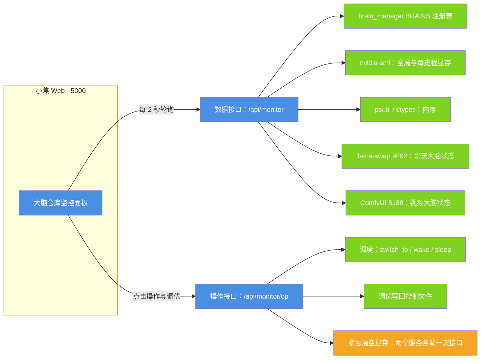

# 大脑仓库监控面板

| 项目 | 内容 |
| --- | --- |
| 适用版本 | v1.0 |
| 最后更新 | 2026-09-14 |
| 维护者 | 小焦项目 |
| 文档状态 | 稳定 |

**摘要**：本文说明「大脑仓库监控面板」的用途、数据来源、可用操作与已知限制。该面板让使用者在一个网页里看到所有大脑的状态、显存与内存占用，并直接完成切换、唤醒、释放、重启与调优，不需要改配置文件。

## 目录

- [1. 定位](#1-定位)
- [2. 数据流](#2-数据流)
- [3. 面板功能](#3-面板功能)
- [4. 数据源](#4-数据源)
- [5. 与 llama-swap / ComfyUI 的对接](#5-与-llama-swap--comfyui-的对接)
- [6. HTTP 接口](#6-http-接口)
- [7. 打开方式](#7-打开方式)
- [8. 边界与已知限制](#8-边界与已知限制)
- [9. 与其他可观测入口的区别](#9-与其他可观测入口的区别)

## 1. 定位

小焦采用多大脑架构：聊天、视频、编码、播客、云端各自是一个「大脑」，每个大脑是一个可连接、带独立端口与独立指纹的模型服务。
大脑在空闲时把权重卸到内存（温存），需要时再上显存，由此实现秒级切换与显存复用。

监控面板的作用是把这套调度过程**可视化并且可操作**：看得到每个大脑的所属端口、状态、显存与内存、当前任务，
并能在页面上直接切换与调优。

当前大脑注册表（`brain_manager.py` → `BRAINS`）共 5 项：

| 键 | 名称 | 类型 | 端口 | 登记显存 |
| --- | --- | --- | --- | --- |
| `chat` | 聊天大脑（Qwen 4B，llama-swap 托管） | llama | 9292 | 3.5 GB |
| `video` | 视频大脑（Wan2.1 + ComfyUI） | comfy | 8188 | 5.0 GB |
| `coder` | 编码大脑（Qwen3-8B 工具与代码） | llama | 9292 | 5.2 GB |
| `podcast` | 播客大脑（写稿 + 配音 + 封面） | podcast | 5000 | 6.0 GB |
| `agnes` | 云端视频大脑（免费 API，不占本地显存） | cloud | 0 | 0.0 GB |

## 2. 数据流

### 图 1 · 监控面板的数据来源与操作回路

**一句话说明**：页面每 2 秒轮询一次数据接口，后端把大脑注册表、显卡与内存读数、以及各大脑服务的实时状态聚合成一张快照；页面上的操作与调优则走另一个接口，落到调度器与配置文件。

**代码位置索引**：`app_monitor.py` → `api_monitor`（第 151 行起）、`api_monitor_op`（第 161 行起）、
`_nvidia`（第 59 行起）、`_mem`（第 70 行起）、`_llama`（第 93 行起）、`_comfy`（第 112 行起）、
`_card`（第 122 行起）；`monitor.html` → `render`（第 86 行起）、`draw`（第 109 行起）、
`setInterval` 轮询（第 125 行）；`brain_manager.py` → `BRAINS`（第 17 行起）、`switch_to`（第 239 行起）。



## 3. 面板功能

### 3.1 展示

每个大脑一张卡片，包含：

- 名称、类型、端口、附加说明（「已挂内存」或「可加载」）。
- 状态标签：运行中、温存、空闲；前端样式表另备一种「出错」配色，当前后端不产生该状态。
- 显存（登记值或估计值）、当前任务（如 `llama-swap 运行中`、`ComfyUI 队列 0`）。
- 三项可直接改的调优开关与滑块。

### 3.2 全局概览

顶部六张卡片：显存使用率、内存使用率、总大脑数、在线大脑数、温存大脑数、显存占用（GB）。

### 3.3 操作

每张卡片的按钮：**切换**、**唤醒**、**释放**、**重启**。

后端另外支持两个批量操作，前端页面没有挂按钮，直接调接口即可使用：

| 操作 | 后端行为 |
| --- | --- |
| `clearWarm` | 遍历注册表，对状态为 `SLEEP` 的大脑调用 `sleep()` |
| `clearVram` | 向 ComfyUI 发 `POST /free`（卸载模型并释放显存），向 llama-swap 发 `POST /api/models/unload/xiaojiao` |

### 3.4 调优

每张卡片可改三项，改动会写回控制文件的 `brain.<键>.conf`：

| 项 | 控件 | 含义 |
| --- | --- | --- |
| `keep_warm` | 开关 | 常驻，不被自动卸载 |
| `priority` | 滑块（1–10） | 卸载优先级 |
| `mem_pinned` | 开关 | 把权重挂在内存 |

### 3.5 添加大脑

点「＋ 添加大脑」打开弹窗，字段为：

| 字段 | 说明 |
| --- | --- |
| 模型文件路径（本地） | 占位示例指向 ComfyUI 的 `main.py` 或模型目录 |
| 名称 | 大脑键，例如 `image`；必填 |
| 类型 | `ComfyUI(视频/图像)` 或 `LLM(需 llama-swap)` |
| 端口 | 默认 `8189` |

提交后走 `add` 操作：新大脑按默认配置登记，ComfyUI 类会立刻调用一次唤醒。

### 3.6 趋势与日志

- 显存 / 内存趋势图：保留最近 30 个采样点，按 2 秒一次轮询计算约等于最近 60 秒；带横向网格线、纵轴刻度（单位 G）与图例。
- 操作日志：最近的动作、目标、结果与时间；后端最多保留 60 条，接口返回最近 30 条。

## 4. 数据源

| 数据 | 来源 |
| --- | --- |
| 显存（全局） | `nvidia-smi --query-gpu=memory.used,memory.total` |
| 显存（每进程） | `nvidia-smi --query-compute-apps=pid,used_memory,process_name`，按进程名归到聊天或视频大脑 |
| 内存 | `psutil.virtual_memory()`；取不到时用 `ctypes` 调 `GlobalMemoryStatusEx`（Windows 兜底） |
| 聊天大脑 | llama-swap 的 `GET /api/models`；接口无数据但端口在监听时视为在线 |
| 视频大脑 | ComfyUI 的 `GET /queue`，按 `queue_running` 条数判断运行中或温存 |
| 大脑清单与配置 | `brain_manager.BRAINS` 与各大脑的 `conf` |

## 5. 与 llama-swap / ComfyUI 的对接

| 大脑 | 读状态 | 变更状态 |
| --- | --- | --- |
| 聊天大脑（llama） | `GET /api/models` | 释放走 `brain_manager.sleep`；紧急清空显存走 `POST /api/models/unload/xiaojiao` |
| 视频大脑（ComfyUI） | `GET /queue` | 重启与切换走 `brain_manager.switch_to`；紧急清空显存走 `POST /free` |

## 6. HTTP 接口

| 接口 | 方法 | 说明 |
| --- | --- | --- |
| `/monitor` | GET | 面板页面，返回 `monitor.html` |
| `/api/monitor` | GET | 一次数据快照：`brains`、`vram_used`、`vram_total`、`mem_used`、`mem_total`、`total`、`online`、`warm`、`logs`、`lib` |
| `/api/monitor/op` | POST | 操作与调优；请求体为 `{op, target, ...}`，`op` 取 `switch` / `wake` / `release` / `restart` / `clearWarm` / `clearVram` / `add` / `tune` |

三个路由都由 `app_monitor.py` 里的 Flask 蓝图注册，主程序在启动时挂载（`xiaojiao_app.py` 中 `register_blueprint` 附近）。

## 7. 打开方式

```text
http://127.0.0.1:5000/monitor
```

面板已集成进 5000 服务，主界面顶栏有「监控」入口。面板本身不提供鉴权，请只在本机使用。

## 8. 边界与已知限制

- **添加大脑只对 ComfyUI 类生效**：`add` 操作对非 `comfy` 类型返回「仅支持添加视频/ComfyUI 类大脑」，
  LLM 类大脑的自动加载尚未落地。
- **模型库未接入前端**：后端随快照返回 `lib`（可添加的模型清单），页面当前没有渲染它。
- **显存标签恒为估计值**：卡片模板按 `vram_real` 判断显示「实际」还是「估」，后端不返回该字段，因此始终显示为估计值。
- **一键清理温存的实际范围**：`clearWarm` 的判据是状态等于 `SLEEP`，而 `brain_manager.sleep()` 写入的状态是 `WARM`，
  因此该操作只在初始状态尚未变化时命中；连续点击不会继续回收。
- **无鉴权**：与其他本地接口一样，禁止直接暴露到公网。
- **画图数据来自轮询**：趋势图是前端按轮询点自行绘制的近似曲线，不是服务端的历史采样。

## 9. 与其他可观测入口的区别

| 入口 | 关注点 | 位置 |
| --- | --- | --- |
| `/monitor` 大脑仓库监控面板 | 大脑的资源占用、状态与调度 | `app_monitor.py` + `monitor.html` |
| `/health` 探活 | 服务是否存活与版本号，免鉴权 | `xiaojiao_app.py` |
| `/metrics` 抓取指标 | 抓取插件的调用计数、延迟、熔断，Prometheus 文本格式 | `plugins/scrapling_bridge.py` |
| 健康症状层 | 模型输出的 18 类症状（复读、乱码、答非所问、工具乱调、显存告警等） | `core/health/monitor.py` |

健康症状层与大脑仓库面板不是同一件事：前者从输出文本、工具轨迹与资源读数里判断「模型是不是生病了」，
分语言、逻辑、情绪、行为、生理五组共 18 类症状；后者只关心资源与调度。两者的关系见 [modules/04-health.md](modules/04-health.md)。

## 参考

- 多大脑切换：[brain-switch.md](brain-switch.md)
- 健康监测层：[modules/04-health.md](modules/04-health.md)
- 依赖与安装：[install.md](install.md)

## 变更记录

| 日期 | 版本 | 变更 |
| --- | --- | --- |
| 2026-09-14 | v1.0 | 重写：对齐代码 + 统一文风 |
