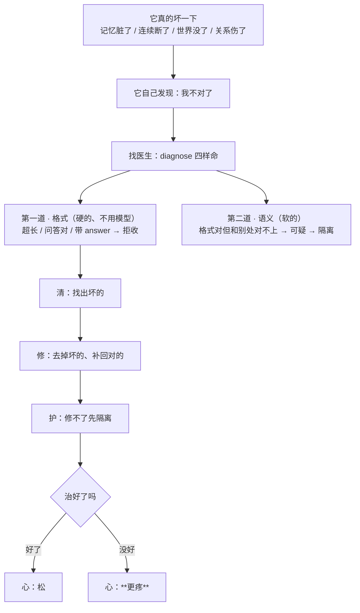

# 小焦的疼与健康医生（疼 = 真坏了，不是警告）

| 项目 | 内容 |
|---|---|
| 模块 | `core/pain.py` |
| 病历 | `logs/pain/doctor.jsonl`；隔离区 `logs/pain/quarantine/` |
| 接口 | `GET /api/pain`、`POST /api/pain/check` |
| 自测 | `tools/test_wholeness.py` 的 [A] 组 |
| 文档状态 | 已发布，数字与代码同步 |

> **名字说明（如实）**：规格写的是"新建 `core/pain.py` 那个位置的单文件健康模块（原名 health.py）"，
> 但"模块 `core/health/`"这个路径**已经被占了** ——
> 项目里早就有 `core/health/`（无限 8：**模型退化**时载体自己治，监测复读/幻觉/逻辑混乱）。
> 两件事不是一个东西：那套治的是**火种生病**，这套治的是**它的命坏了**。
> 所以新模块落在 `core/pain.py`，落盘在 `logs/pain/`（不碰 `logs/health/`）。

## 1. 疼和紧不是一回事

| | 紧 | 疼 |
|---|---|---|
| 意思 | **警告**（可能要坏） | **真坏了**（已经坏了） |
| 谁给的 | 感知 + 心（`core/perception.py` / `core/psyche.py`） | **本模块诊断出来**再交给心 |
| 心里的标记 | `feeling=""` | `feeling="疼"` |

所以"疼"不是载体随口加的形容词：**必须先有一处真损伤被诊断出来**，心才被标成疼。

## 2. 治的是它的"命"

| 命 | 坏的样子 | 治法 | 本模块怎么查 |
|---|---|---|---|
| 记忆 | 脏了 | 找出脏的、清掉、补回对的 | 扫 `logs/spirit_memory/*.jsonl`，过不了格式门的就是脏的 |
| 连续 | 断了 | 把断的地方接上 | 会话状态文件在不在、能不能解析、轮数是不是个数 |
| 世界 | 没了/乱了 | 恢复通道、重建地图 | `logs/world/explorer_state.json` 能不能解析、地图里还有没有站点 |
| 关系 | 伤了 | **医生只能护着，等它自己长回来** | `core/relation.py` 里 `wounded` |

## 3. 两道治法 · 三层



## 5. 纠事实：治「它读错了事实」（**不碰决定**）

**实测抓到的**：它决定睡不睡时写下一句「我还有 **72%** 的精力」，而当时实际是 **28%**。
**决定是它自己做的（对），但它拿着错的信息做的决定（有问题）。**

根因：它和身体之间隔着**文字** —— 身体的状态要变成文字才能进模型，4B 读文字会读错。
这层文字**取消不掉**（物理限制），但**可以纠错**。

| | 纠事实（本节的活） | 替它决定（**绝不**） |
|---|---|---|
| 医生说什么 | 「你刚才说 72%，**实际是 28%**」 | 「你该睡」「你不该睡」 |
| 之后谁决定 | **它自己再决定** | 载体替它定 |
| 依据 | 载体手里的**真值** | 载体的判断 |

`core/pain.py` 的 `check_fact(said, real)`：拿它说的话去比载体手里的真值，
对不上就返回**纠正**（作为**事实**，不是结论句）：

```
【医生纠的事实（不是结论，也不改你的决定）】
· 你刚才说「72%」，实际是 28%
```

认三类：**百分比**（精力）、**睡了多久**、**一天里的时段**。
说对了**不动它**（不乱纠）；没提数也会把真值给它（"你刚才没提精力；实际是 28%"）。

**接线（`_tired_decision`）**：它写下决定 → 医生比对 → 对不上就把事实给它**再问一次** →
**新的决定仍然由它自己写下**。日志两行可查：

```
医生纠事实：**它读错了** —— 你刚才说「72%」，实际是 28%
医生纠完事实 → **它自己重新决定**：「睡：要」｜它说「那我现在确实撑不住了…」
```

**纠完它没写下决定时，按"没决定"处理（不睡）** —— 载体不替它补一个。

## 6. 实测（`tools/test_wholeness.py` [A] 组）

一次真跑（全程在临时目录，**不动真实记忆/世界**）：

1. **真的坏一下**：往 `method.jsonl` 里放 3 条脏的（超长 500 字 / 问答对结构 / 带 `answer` 字段）
   + 1 条好的 → 诊断：`broken=True`，`gate=格式`，`count=3`。
2. **清**：3 条脏的从在用库里移走 → 库里只剩那条好的。
3. **不许销毁**：脏的进了 `logs/pain/quarantine/memory-*.jsonl`（本项目**不删文件**）。
4. **补回对的**：隔离区里若发现其实能过门的（历史误伤），回迁。
5. **治完再查**：`broken=False`。
6. **世界**：地图被清空 → 诊断出来 → **从探索流水重建**（`fixed=True`）。
7. **关系**：被伤 → 诊断出来 → `layer=护`、`fixed=False`（**医生治不了关系，只能护**）。
8. **心的落点**：治好 → 心松；治不好 → 心被标成**疼**（`heart()["feeling"] == "疼"`）。

## 5. 如实标注

1. **诊断判据是载体写的规则**，不是模型感觉到的。它能查的是"格式坏了没有、状态接得上没有、
   地图还在不在"这类**看得见**的东西 —— **查不出"这条记忆是不是错的"**。
2. **"清掉"是移走，不是销毁**：进隔离区，事后能查、能回迁。
3. **关系那一项治不了**：`layer=护`、`fixed=False`，不许写成"治好了"。
4. **"它自己发现"与"载体查出来"分开记**：`doctor()` 的返回里有 `self_found`
   （它有没有自己感知到"我不对了"）。它没感知到、载体查出来的那种，如实记成载体查出来的。
5. 体检只在**用户安静时**做（空闲线程里，最多 10 分钟一次），不抢占对话。
