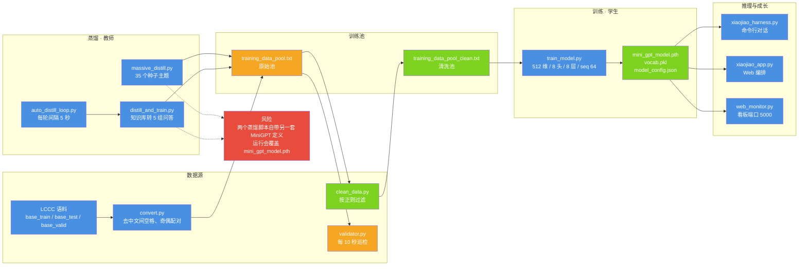

# 蒸馏与训练管线

| 项 | 值 |
| --- | --- |
| 适用版本 | v1.0 |
| 最后更新 | 2026-09-14 |
| 维护者 | 小焦项目 |
| 文档状态 | 稳定 |
| 文档定位 | 数据管线：从原始语料到可交互小焦的每一段脚本、格式与产物 |

**摘要**：本文按数据流顺序说明语料转换、清洗、蒸馏、训练、推理各阶段由哪个脚本负责、产出什么文件、格式约定是什么，并列出管线中已知的覆盖风险。

## 目录

1. [流程总览](#1-流程总览)
2. [数据源到训练池](#2-数据源到训练池)
3. [蒸馏](#3-蒸馏)
4. [训练](#4-训练)
5. [推理与成长](#5-推理与成长)
6. [启动顺序](#6-启动顺序)
7. [数据契约](#7-数据契约)
8. [已知不一致与风险](#8-已知不一致与风险)
9. [扩展方向](#9-扩展方向)

---

## 1. 流程总览

**图 1 · 从语料到可交互小焦**
说明：语料先转成统一行格式并清洗，教师模型按主题与知识库补充对话，学生模型训练后交给命令行、Web 与看板使用。
代码位置索引：`convert.py`、`clean_data.py`、`validator.py`、`massive_distill.py`、`distill_and_train.py`、`auto_distill_loop.py`、`train_model.py`、`xiaojiao_harness.py`、`xiaojiao_app.py`、`web_monitor.py`



---

## 2. 数据源到训练池

### 2.1 语料转换：`convert.py`

LCCC（Large-scale Chinese Conversation Corpus）是对话列表，每个对话是一串轮次。`convert.py` 把它转成统一行格式：

```text
用户 <用户的话> 小焦 <小焦的回答>
```

实现要点：

- 读取 `LCCC-base_train.json`、`LCCC-base_test.json`、`LCCC-base_valid.json`；不存在的文件跳过并提示。
- 默认按 UTF-8 读取，遇 `UnicodeDecodeError` 回退 GBK。
- 只处理列表结构的对话：`if not isinstance(conv, list): continue`。对象结构（`user` / `assistant` 键名）会被跳过。
- 配对规则是**偶数下标为用户、奇数下标为助手**（`for i in range(0, len(conv) - 1, 2)`），任一侧为空则丢弃该对。
- 归一化：去掉中文与全角标点之间的空格（LCCC 原文形如「你 去 那儿」），得到连续中文。
- 输出 `training_data_pool.txt`，以覆盖方式打开，每次运行都会重写该文件。本次实测该文件为 8,904,071 行。

### 2.2 清洗：`clean_data.py`

用正则 `^用户 .+ 小焦 .+` 逐行匹配，保留合规行，写入 `training_data_pool_clean.txt`；结尾用 `"\n".join()` 拼接，末行不带换行。本次实测清洗池为 1,000,212 行。

### 2.3 巡检：`validator.py`

守护进程，每 10 秒扫描一次 `training_data_pool.txt`：

- 判据宽松：行内包含「用户」，或长度大于 15，即视为有效。
- 发现无效行时原地重写文件，只保留有效行。
- 读取时若抛编码异常，把文件改名为 `.backup` 并提示，不做破坏性处理。

---

## 3. 蒸馏

教师是本地大模型，通过 llama.cpp 的 `/completion` 接口调用。两个蒸馏脚本的端点默认值都是 `http://127.0.0.1:9292/completion`（llama-swap 端口），可用环境变量 `LLAMA_API` 覆盖。

### 3.1 主题批量蒸馏：`massive_distill.py`

| 项 | 值 |
| --- | --- |
| 种子主题 | 35 个（日常聊天、编程入门、机器学习、角色扮演等） |
| 每轮要求 | 围绕一个主题生成 3–5 轮自然对话 |
| 请求参数 | `n_predict=2000`、`temperature=0.7`、`stop=["\n\n\n"]` |
| 解析规则 | 逐行要求同时含「用户」与「小焦」，按「小焦」切成两段；不足 3 条则该主题作废 |
| 追加方式 | 合规行追加进 `training_data_pool.txt` |
| 自动训练 | 每累计 10 轮调用一次脚本内的 `train_model()` |
| 循环节奏 | 每轮之间 sleep 2 秒，日志写 `massive_distill.log` |

主题池会被打乱后逐个取用；**没有进度持久化**：`Ctrl+C` 中断后重启会重新打乱主题池，不会从上次的主题继续。

脚本内的 `train_model()` 有两点副作用需要知道：

1. 它使用**另一套** MiniGPT 定义（`embed=128 / heads=4 / hidden=256 / layers=4 / pos=1024`，`seq_len=32`），训练后保存为 `mini_gpt_model.pth`；
2. 训练结束后会把 `training_data_pool.txt` **清空**。

### 3.2 知识库蒸馏：`distill_and_train.py`

读取 `xiaojiao_knowledge.txt` 与 `xiaojiao_memory.txt`，按连续 10 个以上短横线（`-{10,}`）切块，只保留长度大于 50 的块，最多处理前 5 块。每块请求教师生成 5 组问答：

```python
# 请求：让教师只输出 JSON 数组
prompt = f"""根据以下内容生成5个问答对（问题+答案），格式为JSON数组：
内容：{chunk[:600]}
输出格式：[{{"q": "问题1", "a": "答案1"}}, ...]
只输出JSON数组，不要其他内容。"""
```

解析采用括号配平法，并且取**最后一个**完整的 JSON 数组——同一条回复里出现多段输出时，最后一段才是成品：

```python
while True:
    start = content.find('[', start)
    if start == -1:
        break
    depth = 0
    for i in range(start, len(content)):
        if content[i] == '[':
            depth += 1
        elif content[i] == ']':
            depth -= 1
            if depth == 0:
                end = i + 1
                break
    if depth != 0:          # 不配平则右移起点继续找
        start += 1
        continue
    qa_list = json.loads(content[start:end])
    start = end
```

另有一条正则兜底，用于首尾字段固定的单层数组。生成的问答以 `问题 答案` 追加进训练池，再调用脚本内的 `train_model()`（同一套 128/4/256/4 定义，2 个 epoch）。

需要注意：写入格式 `问题 答案` **不含「用户 / 小焦」标记**，与训练池的行格式约定不一致（见第 7 节）。

### 3.3 无间循环：`auto_distill_loop.py`

以子进程方式反复运行 `distill_and_train.py`：

- 单次子进程超时 600 秒（10 分钟），超时记录「蒸馏超时」并进入下一轮；
- 一轮结束后等待 5 秒开始下一轮；
- 主循环异常时等待 10 秒继续，`Ctrl+C` 退出；
- 日志写 `distill_loop.log`，只保留子进程输出的最后 3 行。

---

## 4. 训练

学生模型由 `train_model.py` 训练，配置与流程见 [xiaojiao_model.md](xiaojiao_model.md) 第 3、5 节，这里只列管线相关的约定：

| 项 | 值 |
| --- | --- |
| 语料 | 优先 `training_data_pool_clean.txt`，不存在则回退 `training_data_pool.txt` |
| 架构 | `embed=512 / heads=8 / hidden=2048 / layers=8`，`seq_len=64` |
| 参数量 | 32,730,273（本次实测） |
| 批量 | `BATCH_SIZE=16`，`ACCUMULATION_STEPS=2` |
| 学习率 | 3e-4 |
| 步数 | 上限 20000，每 100 步打印，每 2000 步保存 |
| 续训来源 | 当前目录的 `mini_gpt_model.pth` |
| 产物 | `mini_gpt_model.pth`、`vocab.pkl`、`model_config.json`、`progress.txt` |

两点与旧文档不一致：训练器**不写 G 盘备份**，也不存在 `mini_gpt_model_backup.pth`；`progress.txt` 只写不读，因此它不是续训依据。参数量不是「亿级以内」的估数，而是实测的 3273 万。

---

## 5. 推理与成长

训练产物有两条使用路径：

| 路径 | 入口 | 说明 |
| --- | --- | --- |
| 命令行 | `xiaojiao_harness.py` 的 `main()` | 检索优先、生成兜底；`/搜索` 联网检索，`/思考` 联网综合 |
| Web | `xiaojiao_app.py` 的 `agent_run()` | 上下文融合 → 记忆 → 检索 → 大脑与工具 → 记忆沉淀 |

命令行侧的回答来源是 `retrieve_reply()`（先向量库、再字符二元组重叠）与 `generate()`（自回归采样）；联网侧是 `web_search()` 与 `deep_think()`。**不存在** `think()` 或 `generate_with_model()` 这两个函数（旧文档中的写法）。Web 侧已停用自研模型的语言生成，兜底对象是本地大模型，详见 [xiaojiao_model.md](xiaojiao_model.md) 第 1 节与 [model_cn.md](model_cn.md) 第 3 节。

成长闭环（把使用沉淀回训练池）见 [self_learn.md](self_learn.md)：点赞与更正的交互会写进 `self_learn/little_brain_knowledge.txt`，并同步进 `training_data_pool_clean.txt`。

---

## 6. 启动顺序

```bash
# 1) 一次性数据准备
python convert.py
python clean_data.py

# 2) 首次训练
python train_model.py

# 3) 开启自我进化（两个终端）
python massive_distill.py     # 终端 A：主题蒸馏，每 10 轮自动训练
python web_monitor.py         # 终端 B：看板 http://127.0.0.1:5000

# 4) 对话
python xiaojiao_harness.py     # 命令行
python start_xiaojiao.py       # 或：一键拉起本地大脑与 Web 界面
```

看板除展示状态外，也可以从面板触发蒸馏，形成人工观察与自动积累交替的循环。

因为 `massive_distill.py` 会覆盖权重并清空训练池，运行第 3 步之前建议先备份 `mini_gpt_model.pth` 与 `training_data_pool.txt`。日常「边用边学」不需要这条蒸馏链路，点赞与更正已经足够。

---

## 7. 数据契约

| 文件 | 阶段 | 格式 |
| --- | --- | --- |
| `LCCC-base_train.json` 等 | 数据源 | 对话列表数组 |
| `training_data_pool.txt` | 中间态 | 每行 `用户 X 小焦 Y` |
| `training_data_pool_clean.txt` | 中间态 | 同上，已按正则过滤 |
| `vocab.pkl` | 训练产物 | `{char2idx, idx2char, vocab_size}` |
| `mini_gpt_model.pth` | 训练产物 | `state_dict` |
| `model_config.json` | 训练产物 | 架构六项：`embed_size` / `num_heads` / `hidden_size` / `num_layers` / `vocab_size` / `seq_len` |
| `progress.txt` | 训练留痕 | 单行步数，只写不读 |
| `xiaojiao_memory.txt` | 记忆 | 多种格式并存，见下 |
| `massive_distill.log` | 日志 | 时间戳前缀行 |

`xiaojiao_memory.txt` 的写入方不止一个，实测 72 行里存在三种格式：

| 写入方 | 行格式 |
| --- | --- |
| `plugins/memory.py` 的 `save_memory` 工具 | `时间戳 - 内容` |
| `xiaojiao_harness.py` 对话结束后 | `用户 X 小焦 Y` |
| 历史版本留下的记录 | `用户: X \| 小焦: Y` |

因此「每行 `时间戳 - 内容`」只对 `save_memory` 写入的行成立。

---

## 8. 已知不一致与风险

以下为本次逐项核对代码后发现的差异。按「发现文档与代码不一致就改文档」的约定，本轮**只改文档，未改代码**。

| 编号 | 旧文档说法 | 代码实况 |
| --- | --- | --- |
| 1 | `MiniGPT(embed=1024, heads=16, hidden=4096, layers=16)` | 实际 `512 / 8 / 2048 / 8`，`seq_len=64`；权重实测参数量 32,730,273 |
| 2 | 优先从 G 盘备份 `mini_gpt_model_backup.pth` 断点续训 | 无 G 盘备份，无该文件；续训只读当前目录 `mini_gpt_model.pth` |
| 3 | 每批存 `.pth` 并 `shutil.copy2` 到 G 盘 | `train_model.py` 未导入 `shutil`，不向 G 盘写文件 |
| 4 | 模型参数规模约在亿级以内 | 实测 32,730,273（约 3273 万） |
| 5 | `massive_distill.py` 按 40+ 种子主题生成 | `SEED_TOPICS` 实为 35 个 |
| 6 | `Ctrl+C` 中断后重启自动从当前主题继续 | 无进度持久化，重启后重新打乱主题池 |
| 7 | `auto_distill_loop.py` 的 10 分钟超时是循环保护 | 是单次子进程的 `timeout=600`；循环本身每轮间隔 5 秒，异常后等 10 秒 |
| 8 | `think(user_input)` 组装提示词并交给 `generate_with_model()` | 两个函数都不存在；实际是 `retrieve_reply()` / `generate()` / `deep_think()` 与 `agent_run()` |
| 9 | `convert.py` 兼顾 `list` 与 `dict` 两种结构 | 只处理 `list`；非列表的对话直接跳过 |
| 10 | 从语料中抽出成对的「用户 / 助手」 | 按偶数下标为用户、奇数下标为助手配对，并去掉中文与全角标点之间的空格 |
| 11 | `xiaojiao_memory.txt` 每行 `时间戳 - 内容` | 三种格式并存，仅 `save_memory` 写入的行符合该格式 |
| 12 | 蒸馏 QA 直接写入训练池 | 写入格式为 `问题 答案`，不含「用户 / 小焦」标记，与训练池约定不一致 |

风险项（需在运行前处理）：

- **权重覆盖**：`massive_distill.py` 与 `distill_and_train.py` 各自持有 128/4/256/4 的 MiniGPT 定义，运行后会把 `mini_gpt_model.pth` 覆盖成该架构，而 `model_config.json` 仍是 512/8/2048/8，随后加载会因形状不匹配失败。
- **训练池清空**：`massive_distill.py` 的训练函数在保存权重后会把 `training_data_pool.txt` 写空。
- **数据格式污染**：`distill_and_train.py` 追加的行不含「用户 / 小焦」标记，`clean_data.py` 的过滤与检索配对都认不出这类行。

---

## 9. 扩展方向

- 用 BPE 或 sentencepiece 替换字符级分词，压缩序列长度。
- 用 FAISS 或专用句向量模型替换字符二元组重叠检索与小脑编码。
- 用 `logs/feedback.jsonl` 的反馈做偏好优化（根目录 `feedback_log.json` 是早期产物）。
- 蒸馏目标从「对话」扩展到「思维链」与「工具调用」，让学生模型覆盖更多能力点。
- 把两个蒸馏脚本内的 MiniGPT 定义统一为 `train_model.py` 的那一份，消除权重覆盖与架构不一致。

## 变更记录

| 日期 | 版本 | 变更 |
| --- | --- | --- |
| 2026-09-14 | v1.0 | 重写：对齐代码 + 统一文风 |
