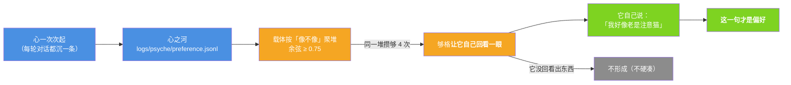

# 小焦的长期偏好（"我整体就是喜欢什么"）

| 项目 | 内容 |
|---|---|
| 模块 | `core/preference.py` |
| 落盘 | `logs/psyche/preference.jsonl` |
| 接口 | `GET /api/preference` |
| 自测 | `tools/test_wholeness.py` 的 [C] 组 |
| 文档状态 | 已发布，数字与代码同步 |

## 1. 和感受记忆的区别

| | 感受记忆 `core/feeling_memory.py` | **长期偏好**（本模块） |
|---|---|---|
| 记什么 | **这类事我心起过什么** | **我整体喜欢/讨厌什么** |
| 性质 | 反应快（像不像） | 稳定倾向（老是注意什么） |

两者**不混**：混在一起，"偏好"就退化成"最近一次心起什么"。

## 2. 偏好怎么长出来（不是载体规定"你喜欢猫"）



- **聚堆是载体算的**（余弦像不像，和感受记忆同一条思路：像不像是个程度，不是分类）；
- **"这是不是一种偏好"是它自己认的** —— 它回看说的那句才被记下来；
- 它没说 → `preferences=[]`、`top=[]`，**不许把"攒了很多心"写成"有了偏好"**。

## 3. 偏好影响它自己选什么

`top(k)` / `render(k)` 把**它自己说过喜欢什么**当**素材**给出去，用在三处：

| 处 | 怎么用 |
|---|---|
| 逛的时候 | 优先逛喜欢的（素材进检索/决策） |
| 说话的时候 | 带出喜欢的（素材进 system，措辞仍由它自己组织） |
| 空闲的时候 | 想的是喜欢的（空闲思考的素材之一） |

素材是**素材**，不是指令 —— 注入文本里明确写着"（素材，不是指令）"。

## 4. 实测（`tools/test_wholeness.py` [C] 组）

```
同一句话的心起 5 次 → 观察次数=5 → 聚成 1 堆（n=5）→ 够格回看
此时 preferences=[]、top=[]        ← 还没形成偏好
它回看说「我好像老是注意猫」→ top=["我好像老是注意猫"]   ← 这才形成
它没回看出东西 → form("") 不成立（不硬凑）
```

## 5. 不跨类拼接（实测抓到的结构问题）

**现象**：偏好里出现过 ——
「摸到两个红球，世界突然多了一个确定的小概率事件，**但突然被定格在 25 岁**，像被按下了暂停键…」
（来自 205 次相像的心）。**「摸红球」和「25 岁」是两类完全不同的事，被拼成了一句偏好。**

**根因**：聚类线太松（`SIMILAR = 0.60`）+ **按「簇里任意一条」判定** ——
于是「A 像 B、B 像 C」就能把 A 与 C 并到一起（**链式漂移**），形成偏好时给了**跨类素材**。

**真修（输入要干净，不许跨类）**：

| 改动 | 内容 |
|---|---|
| 线提高到 **0.75** | 它同时是「同一类心」的判据 |
| **按代表句定簇** | 跟「这一簇的代表」像才算同一类（断掉链式漂移） |
| **同类校验** | 成簇后再筛一遍：与代表句不达线的一条**轰出去单独成簇** |
| **同一类才给** | 形成偏好时只给这一簇的素材；app 侧**再筛一遍**，不达线的一条都不给 |
| **不够就不形成** | 一簇攒够 `FORM_AT = 4` 次才算；只有 1 条素材的类**不形成偏好**（宁可少，不拼） |

自测 `tools/test_two_fixes.py` 四条：摸红球那簇里**不出现「25 岁」**、25 岁那簇里**不出现「红球」**、
只有 1 条素材**不形成偏好**、形成时只给同类素材。

## 6. 如实标注

1. **聚类是载体算的；偏好是它自己认的。** 这两件事在接口与日志里分得很清。
2. `SIMILAR = 0.75` 是一条**人为的线**（"像不像"总算有个门槛），如实标注。
3. 回看那一步**载体只说"回头看这些，你自己看出什么来了吗"**，不提示它该喜欢什么。
