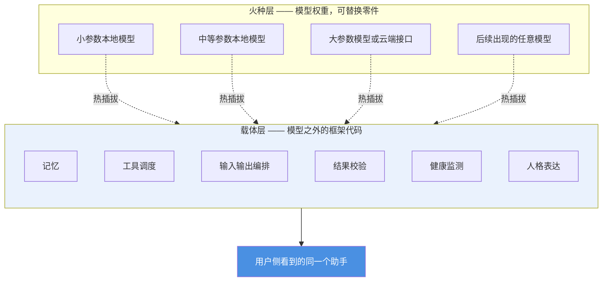
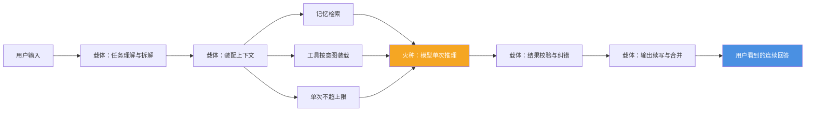

# 小焦 · 媒体素材包

| 项 | 内容 |
| --- | --- |
| 适用版本 | v1.0 |
| 最后更新 | 2026-09-14 |
| 维护者 | 小焦项目 |
| 文档状态 | 已发布 |

本文供媒体、社区与二次创作使用，提供可直接引用的项目介绍、数据与架构图。
凡标注来源的数值均可按标注回溯；来源不在仓库内的少数记录已单独列出并说明。
**没有来源的数值一律留空，不做估算。**

**术语约定**：**载体**指模型之外的全部框架代码；**火种**指模型权重及其推理服务；
**上下文窗口**指单次请求可容纳的 token 上限，token 是模型处理文本的最小单位。

---

## 1. 一句话介绍

> 小焦是以载体优先架构构建的本地 AI 助手，模型可替换，数据不出本地。

以上一句话共 30 字，不计空格与标点，符合不超过 40 字的要求。

---

## 2. 三句话介绍

> 小焦是一个本地运行的 AI 助手，把智力与能力的主要来源放在模型之外的框架代码上，
> 也就是「载体」；模型只负责单次推理，可以随时更换。
> 载体提供外部向量库记忆、输入切片与输出续写、工具注册与调度、结果校验、
> 健康监测与人格表达，同一套载体接入不同规模的模型都是同一个助手。
> 全部数据留在本机，模型、记忆与会话不上传；载体层硬性拦截删除文件的操作。

---

## 3. 一段话介绍

> 小焦（XiaoJiao）是一个以「载体优先架构」构建的本地 AI 助手，采用 MIT 许可证开源。
> 它的基本主张是：模型权重只是一个可替换的零件，助手的能力主要来自模型之外的框架代码，
> 也就是载体。载体承担记忆检索、输入切片、输出续写与合并、工具注册与调度、结果校验、
> 状态管理、健康监测与人格表达；模型只承担单次推理。因此同一套载体接入小参数模型、
> 中等参数模型或任意 OpenAI 兼容接口，用户侧看到的都是同一个助手，更换模型不会丢失记忆、
> 工具与人格设定。载体侧的六项能力——记忆、输入、输出、工具、感知与单次装配——共同保证
> 用户感知层面不设上限，同时如实承认单次请求的 token 数是物理限制。项目全程本地运行，
> 模型、记忆与会话均不离开本机，并在载体层硬性拦截删除文件的操作。截至 v1.0，
> 仓库包含 286 次提交、77 个工具、18 类模型症状的健康监测系统与 249 条自动化测试用例。

---

## 4. 关键数据表

**口径说明**：

1. 下表全部数值来自本仓库自身的测试脚本、日志或源码，不包含外部基准数据。
   若需在报道中引用外部研究，请自行核对原文并标注访问日期。
2. 「状态」一栏用来区分数值的性质，取值为：「实测」指仓库内文档报告了带输出的测量结果；
   「来源内声明」指仓库内文件写明了该数值，但对应脚本不输出结果文件，因此没有随仓库发布的运行记录；
   「期望值」指测试脚本中写死的预期值，用于核对，本身不是一次运行结果；「无数据」表示留空。
3. **可核对性**：读者能直接打开的只有随仓库发布的文件。下表只列入仓库内可核对的来源；
   仅存在于本机运行产物中的实测记录另见 4.2 节，并已标注其不随仓库发布。

### 4.1 仓库内可核对的数据

| 数据项 | 数值 | 来源 | 状态 |
| --- | --- | --- | --- |
| 自动化测试总用例 | 249 条，通过 248 条，通过率 100%，耗时 88.1 秒 | `docs/testing-report.md` 第 2 节 | 实测 |
| 测试套件构成 | 离线单元 92 条 · 应用逻辑 104 条 · 安全 18 条 · 联网 35 条 | `docs/testing-report.md` 第 1 节 | 实测 |
| 实机验收用例 | 36/36 通过 | `docs/testing-report.md` 第 2 节（脚本为 `tests/stress/live_check.py`） | 来源内声明 |
| 本地实测基线汇总 | 离线 214/215（1 项跳过）· 全部 248/249 · 实机验收 36/36 · UI 样式 25/25 · 预设 13/13 | `tests/stress/README.md`「本地实测基线」小节 | 来源内声明 |
| 界面样式检查 | 25/25 通过 | `docs/testing-report.md` 第 2 节 | 来源内声明 |
| 预设生效检查 | 13/13 通过 | `docs/testing-report.md` 第 2 节 | 来源内声明 |
| 工具数量 | 77 个 | `docs/six-infinity.md` 第 7.1 节（由 `tools/check_prompt_size.py` 输出） | 实测 |
| 单次请求可用上下文上限 | 19224 token | `docs/six-infinity.md` 第 7.1 节 | 实测 |
| 全部工具清单占用 | 13891 token，占上限 72% | `docs/six-infinity.md` 第 7.1 节 | 实测 |
| 闲聊一轮的固定开销 | 657 token，占上限 3% | `docs/six-infinity.md` 第 7.1 节 | 实测 |
| 记忆检索命中率 | 5/5，即 100%；验收要求不低于 80% | `docs/six-infinity.md` 第 7.1 节（脚本为 `tools/test_memory_recall.py`） | 实测 |
| 记忆检索延迟 | 稳定态平均 4.5ms；复跑为平均 2.8 至 3.3ms、最大 5.0ms。**该数值只覆盖向量检索这一段**，不含载体二次判断（精排）的耗时 | `docs/six-infinity.md` 第 7.1 节 | 实测 |
| 记忆向量库规模 | 1002 条，且 1002/1002 条完成向量空间迁移 | `docs/design-philosophy.md` 第 19 节 | 实测 |
| 长文续写 | 目标 3000 字，实得 3507 字，耗时 46.5 秒 | `docs/six-infinity.md` 第 7.1 节（日志 `logs/_step3_run.log`） | 实测 |
| 超长输入切片 | 17326 字、22778 token 的文档切成 5 片，输出 923 字摘要，耗时 16.4 秒 | `docs/six-infinity.md` 第 7.1 节（日志 `logs/xiaojiao.log`） | 实测 |
| 输入切片每片 token 观测值 | 两种规模下观测最大值为 4930 与 4909（设计判据为每片不超过 5000 token） | `docs/six-infinity.md` 第 7.1 节 | 实测 |
| 十万字级文档切片 | 66907 字、86485 token，切成 18 片 | `docs/six-infinity.md` 第 7.1 节 | 实测 |
| 向量区分度（同一段文本相差 1 个字） | 3 字 0.8663 · 10 字 0.9554 · 50 字 0.9885 · 500 字 0.9995 | `README.md`「已知限制」小节（脚本为 `tools/test_embedder_long.py`） | 实测 |
| 近义对与反义对的余弦 | 近义对 0.814 · 反义对 0.904 | `README.md`「已知限制」小节 | 实测 |
| 健康监测症状类别 | 18 类，构成为语言 4 · 逻辑 4 · 情绪 3 · 行为 4 · 生理 3 | `core/health/monitor.py` 第 23 至 30 行；逐类触发验证见 `tools/test_health.py` | 实测 |
| 服务端请求伪造一类内网探测的拦截 | 21 种内网、危险与数值型写法全部拦截 | `docs/testing-report.md` 第 2 节 | 实测 |
| 连续调用 20 次的内存净增 | 0.10MB | `docs/testing-report.md` 第 2 节 | 实测 |
| 熔断与自愈 | 连续失败 3 次触发熔断，32 秒后自动恢复 | `docs/testing-report.md` 第 2 节 | 实测 |
| 批量抓取的并发提速 | 3 个域名由 6.20 秒降至 0.92 秒 | `docs/testing-report.md` 第 2 节 | 实测 |
| 模块自测通过数 | 极限补刀 195/195 · 元认知 143/143 · 协同网络 44/44 | `tools/test_module_integration.py` 第 5 至 6 行 | 来源内声明 |
| 记忆深度模块自测 | 73/73 | `tools/test_memory_depth.py`，核对清单见 `tools/test_fresh_clone.py` 第 247 行 | 期望值 |
| 人格层模块自测 | 58/58 | `tools/test_persona.py`，核对清单见 `tools/test_fresh_clone.py` 第 248 行 | 期望值 |
| 十项核心智力自测 | 77/77 | `tools/test_mind.py`，核对清单见 `tools/test_fresh_clone.py` 第 252 行 | 期望值 |
| 上下文融合（回指消解）自测 | 91/91 | `docs/design-philosophy.md` 第 20 节（脚本为 `tools/test_context_merge.py`） | 来源内声明 |
| 仓库提交次数 | 286 次 | 本仓库 `git rev-list --count HEAD` | 实测 |
| 小参数模型加载体的质量与大参数模型单次输出的对照 | 留空 | 无对照实验。`docs/design-philosophy.md` 第 14 节「诚实边界」明确说明本机从未运行过数百 B 参数级模型，拿不出对照数据 | 无数据 |
| 外部第三方基准测试成绩 | 留空 | 本项目未参加任何第三方基准评测，仓库内无相关记录 | 无数据 |
| 本地运行成本实测 | 留空 | 仓库未发布成本统计。成本随所选模型与调用量变化，本项目不提供统一数值 | 无数据 |

关于上表标为「期望值」的三行：`tools/test_fresh_clone.py` 里写死的通过数只用于在全新目录中核对脚本输出，
不等同于一次运行的记录。对其中两个脚本，仓库内的期望值与本机的交接笔记给出的数字互相矛盾
（十项核心智力自测为 77 与 74，文档审计自测为 42 与 32），因此这两项均不按测量结果引用。
4.2 节列出的是期望值与运行记录两者一致的模块。

关于上表标为「来源内声明」的行：这些数值写在随仓库发布的文档里，但对应的脚本本身不输出结果文件
（实机验收、界面样式检查、预设生效检查三个脚本都是直接打印后退出），因此无法从已发布的文件中复核，
只能复跑脚本。**本表各行的数值来自不同日期、不同规模的多次运行，不可合并成一个总基线引用**：
全量套件的用例总数在历史上经历过 172、217、249 等不同世代，逐条对比时应以同一次运行的记录为准。

### 4.2 仅存在于本机运行产物中的实测记录

以下路径被 `.gitignore` 排除，不随仓库发布。外部读者无法直接打开这些文件核对，
如需引用，建议先自行复跑对应脚本，或改为引用 4.1 节中仓库内的来源。

| 数据项 | 数值 | 本机来源 | 可复跑脚本 |
| --- | --- | --- | --- |
| 全量套件的机读记录 | 总用例 249 · 通过 248 · 失败 0 · 跳过 1 · 通过率 100.0% · 耗时 114.2 秒 · 记录时间 2026-09-14 19:28:49 | `tests/stress/results.json` | `tests/stress/run_all.py` |
| 健康系统的模块自测 | 142/142 | `logs/_t_test_health.txt` | `tools/test_health.py` |
| 自主性的模块自测 | 110/110，耗时 26.7 秒 | `logs/_sub05_autonomy.txt` | `tools/test_autonomy.py` |
| 红线约束的模块自测 | 101/101 | `logs/_sub05_nodelete.txt` | `tools/test_no_delete.py` |
| 载体层的模块自测 | 64/64 | `logs/_sub05_carrier.txt` | `tools/test_carrier.py` |
| 红线集成的模块自测 | 40/40 | `logs/_sub05_redline.txt` | `tools/test_redline_integration.py` |
| 世界层的模块自测 | 12/12，耗时 11.02 秒 | `logs/_sub05_world.txt` | `tools/test_world.py` |
| 世界层防火墙的模块自测 | 46/46 | `logs/_sub05_world_fw.txt` | `tools/test_world_firewall.py` |
| 本地运行成本统计 | 统计区间 2026-08-31 至 2026-09-14，记录的云端 token 数为 0、费用为 0.0 | `cost_daily.json` | 由程序运行期自动累计 |
| 记忆检索验收的最近一次记录 | 命中率 5/5、使用率 5/5 通过；向量检索延迟平均 10.9ms、最大 27.9ms，判据小于 100ms，通过；含载体二次判断的延迟平均 519.5ms、最大 1865.1ms，判据小于 800ms，**未通过**；该次运行整体判定为「无限 1 验收未通过」，记录时间 2026-09-14 19:33 | `logs/_t_recall.txt` | `tools/test_memory_recall.py` |
| 工具数量的独立复核 | 应用侧扫描得到 77 个工具，扫描耗时 3185ms，插件文件 22 个 | `logs/carrier/_selftest_out.txt` | `tools/test_carrier.py` |

补充两点口径说明。其一，上面「记忆检索验收」一行是最近的记录，与 4.1 节中来自设计文档的
4.5ms 一项并非同一次运行，也不能互相替代：前者覆盖向量检索加载体二次判断的完整链路，
命中能力与向量检索延迟均达标。
其二，同一份工具数量复核记录里，目录源清点得到的是 46 个工具名
（同样是 22 个插件文件），两条枚举路径口径不同，不可混用。

未列入本表的内容，包括各项设计目标中的速度提升比例，均属设计目标而非实测值，
引用时请标注为「设计目标」：例如 `docs/design-philosophy.md` 第 15 节列出日常提速 20% 至 30%、
批量提速 60% 至 70%、重复问题即时返回三项，并明确写明三项均未达成。

---

## 5. 可直接引用的架构图

两张图均为 Mermaid `flowchart` 代码块，可单独复制渲染或截图引用。
渲染后的图请注明来源为本项目仓库。

### 图 A · 火种与载体：换模型不影响助手身份

### 图 B · 一次请求在载体中的路径

图 B 的读法：橙色节点是模型，其余节点全部是载体。用户侧只看到入口与出口两端的连续体验。

---

## 6. 引用规范

### 6.1 项目名与仓库

- 正式名称写作「小焦」，首次出现可写作「小焦（XiaoJiao）」，其后统一用「小焦」。
- 仓库地址：`https://github.com/jiangchuangege/xiaojiao-harness`。
- 当前发布版本为 v1.0，版本记录见 `CHANGELOG.md` 的 `[v1.0] - 2026-09-13` 条目。
- 许可证为 MIT，版权归属见 `LICENSE`。

### 6.2 数据引用

- 引用数值时必须同时给出来源文件与位置，格式示例：「来源：`docs/six-infinity.md` 第 7.1 节」。
- 若引用时间距数值产生时间较远，请重新运行对应脚本核对。常用入口为
  `tools/check_prompt_size.py`、`tools/test_memory_recall.py`、`tools/test_embedder_long.py`
  与 `tests/stress/run_all.py`。
- 测试数字请写明脚本名与运行时间，不要只写「测试通过率 100%」。

### 6.3 主张引用

- `docs/design-philosophy.md` 的后半篇每一节都标注了实现状态，分为已落地、部分落地与设计未落地三类。
  引用该文档中的主张时**必须保留状态标注**，不得把设计目标表述为已实现。
- 引用第六节关于小参数模型配合载体与大参数模型单次输出的比较这一主张时，须同时说明该判断没有对照实验数据
  （见 4.1 节中标为「无数据」的三行）。
- 引用「无限」相关表述时，须说明其含义是用户感知层面不设上限，单次请求的 token 数仍是物理限制。

### 6.4 图片与截图

界面截图、渲染后的架构图可自由用于介绍本项目的文章与演示，请注明来自本项目仓库。
引用本仓库其他作者的作品时请一并保留其署名，致谢清单见 `README.md` 的致谢小节。

---

## 7. 常见问题问答

### 7.1 它和云端大模型是什么关系

小焦不生产模型权重，它提供模型之外的一层载体。它可以接本地模型，也可以接任意 OpenAI 兼容接口，
换模型不改变记忆、工具与人格设定。需要区分两种连接方式：直接访问本地模型属于小焦自身，
把小焦作为模型接入其他客户端时，客户端连的是小焦的兼容接口
（相关说明见 `docs/api.md` 与 `docs/dsh-integration.md`）。

### 7.2 数据存储在哪里，会不会上传

模型、记忆、会话、日志都保存在本机。会话文件、记忆向量库与各类事件日志均在本地目录下，
运行时不向外部服务器上传。安全套件中包含针对遥测的检查项（来源：`docs/testing-report.md` 第 1 节）。
需要注意两点：联网抓取类工具会把请求发往目标站点；插件的能力等同于本机代码的能力，
来源不明的插件不应安装。

### 7.3 要不要联网

不联网也能运行，联网用于抓取与搜索类工具。已知的一处例外：数学公式渲染使用外部内容分发网络，
完全离线时降级为显示公式源码，不报错也不白屏（来源：`README.md`「已知限制」小节）。

### 7.4 能不能换模型

能。设置界面中可添加任一 OpenAI 兼容模型，人格与工具照常使用（来源：`docs/faq.md`）。
更换模型不需要改载体代码，这是「模型平等」原则的直接结果。

### 7.5 运行成本是多少

本地运行不产生按次计费的接口费用，这是架构决定的：推理在本机完成，没有计费接口参与。
仓库未发布成本统计，因为成本随所选模型、调用量与是否使用云端接口而变化，不存在统一数值。
本机运行记录显示，2026-08-31 至 2026-09-14 区间内累计的云端 token 数为 0、费用为 0.0，
但该记录属于本机运行产物，不随仓库发布（来源见第 4.2 节）。若报道中需要具体金额，
请以实际使用的服务商账单为准。

### 7.6 硬件门槛是什么

从低配到高配均可运行。真正的资源消耗来自所选底座模型，载体本身较轻：
依赖为 Python 3.10 及以上版本，以及若干常规库（来源：`README.md`「依赖与运行开销」小节）。
模型文件不在仓库内，需要自行准备。因为底座模型可替换，实际门槛取决于所选模型，
不存在一个适用于全部配置的统一规格。

### 7.7 会不会删除本机文件

不会。绝不删除用户文件是项目红线，该约束实现在载体层，不依赖模型自身判断，
也不需要开启完全访问权限（实现见 `core/security/no_delete.py`，测试见 `tools/test_no_delete.py`）。
危险命令另有独立黑名单（`tools/dangerous_commands.txt`），命中时挂起并等待用户确认。

### 7.8 现在可以用于生产环境吗

部分可用。项目自身的测试报告给出的结论是：抓取插件、应用层检索与漏洞规则、安全闸门
已达到可交付水平；视频、播客、音乐、安装器与小脑训练这几条链路的自动化覆盖仍不完整
（来源：`docs/testing-report.md` 第 6 节）。
其余功能模块的完成度以 `docs/six-infinity.md` 第 0 节的状态总览为准，
该节逐项区分「已实现并已实测」「部分落地」与「设计中」。

---

## 8. 联系方式

媒体与社区提问请通过仓库 Issue 提出：
`https://github.com/jiangchuangege/xiaojiao-harness/issues`。
仓库未公开其他联系渠道。

---

## 变更记录

| 版本 | 日期 | 变更内容 |
| --- | --- | --- |
| v1.0 | 2026-09-14 | 首次发布。包含四档介绍文案、带来源的关键数据表、两张可引用架构图、引用规范、八条常见问答与联系方式 |
