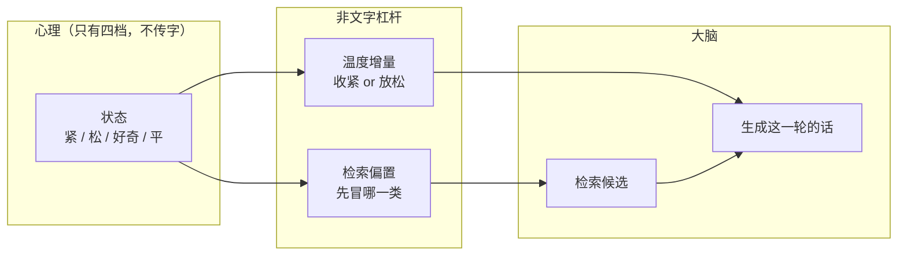
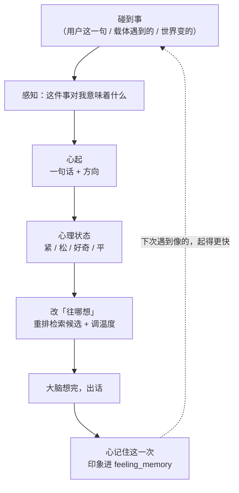

# 小焦的心理层（状态层）

| 项目 | 内容 |
|---|---|
| 模块 | `core/psyche.py`（状态与偏向）、`core/thinking_loop.py`（圈） |
| 上层 | 心本身（一句话）见 [`heart.md`](heart.md)；感知见 [`perception-layer.md`](perception-layer.md) |
| 自测 | `tools/test_module_integration.py`、`tests/stress/run_all.py` |
| 文档状态 | 已发布，数字与代码同步 |

## 1. 这一层存的是**状态**，不是内容

心理层只存四档：**紧 / 松 / 好奇 / 平**。它不存"我怕什么"，只存"现在紧不紧"。

这个区分不是措辞上的讲究，是**能不能起作用**的分水岭：

| | 存内容（旧版） | 存状态（现在） |
|---|---|---|
| 存的是什么 | `feeling="怕"`、`trigger="用户可能离开"` | `state="紧"` |
| 怎么影响下一步 | 写成一段字塞进上下文 | 改**检索先捞哪一类**、改生成温度 |
| 大脑能不能忽略 | **能** —— 它就是一条消息 | **不能** —— 它没有"可忽略的对象" |

前者是把感受**当字传出去**，落到大脑那边就是"一条可忽略的消息"（前六次尝试全死在这里）；
后者是把感受**变成思考的房间**：检索与生成一发生，就已经在那个方向的笼罩下。

**代码上可验证的区别**：`adjust_candidates()` 只重排候选，**不增删、不改写任何候选文本** ——
上下文里一个字都不多，变的是候选顺序与生成参数。

## 2. 状态 → 偏向：全部是非文字杠杆

`bias()` 给出的只有三样，没有任何一项是"往上下文里加一句话"：

| 杠杆 | 作用 |
|---|---|
| `keywords` | 检索时先冒哪一类（紧 → 风险/危险/失败…） |
| `temp_delta` | 生成温度增量（紧 → −0.15 收紧；好奇 → +0.10 放松一点） |
| `tone` | 语气档（收紧 / 放松 / 探问 / 中性） |



## 3. 两条规矩：触发源、启停

### 3.1 心随**真实事件**跳，不随模型输出跳

旧版 `nudge(thought)` 读**模型吐出来的字** —— 模型说"风险"，心就变紧。
那样**心是嘴的影子**：模型说什么，心跟着变什么。但人的心不是这样跳的。

现在唯一的触发源是 `trigger_from_event(kind, text, ...)`，`kind` **只认三类真实来源**：

| kind | 含义 | 调用点 |
|---|---|---|
| `user` | 用户输入了什么 | `agent_run` 第一步（感知层） |
| `carrier` | 载体自己遇到了什么（检索回来的内容、工具报错） | `_rag_three_sources` |
| `world` | 世界变了什么（逛到新东西） | `_browse_relay` |

**模型输出不在表里。** `nudge()` 保留下来，但**不再是触发源**（只作为自测里直接设状态的入口）。
一个老实说的地方：本模块**无法自己判断**传进来的字符串到底是用户说的还是模型说的 ——
这条约束靠调用点守，`agent_run` 里三处调用点都在模型出字**之前**。

### 3.2 心跟模型一起启停

模型启动 → `start()`；模型停止 → `stop()`（挂在 `mind_done` 上，它是所有路径的收尾口）。
⚠️ **`stop()` 不清状态** —— "心停下"是停止跳动，不是"把这个人清空"；
清空会让下一轮的"心理 → 大脑"失去依据，圈就断了。

**挂起（睡着）用的正是这一条**：`_sleep_all()` 里调 `PS.stop()`，醒来 `PS.start()` ——
心与感知"停"，但状态与那句话原样留着。所以"醒来接着睡前"不是靠额外的恢复逻辑，
而是**本来就没清**。只有心跳不睡，见 [`heartbeat.md`](heartbeat.md)。

### 3.3 心还会替它**做决定**（自己会睡）

心理层不只是"影响检索方向"。在"自己会睡"这条链上，**心起的那句话就是它的决定**：

```
精力低 → 感知「我此刻的状态」→ 心起「累得撑不住了，想睡一会儿。」
       → 载体读到这句话 → 执行挂起
```

载体在这条链上只说事实（精力数值），**一个劝它的字都不说**；
"累"和"想休息"必须是它在感知里自己说出来的。详见 [`self-sleep.md`](self-sleep.md)。

## 4. 圈：心理改方向，大脑改状态



三条：**心里先动、心一动改大脑往哪想、大脑想完心记住**。

- `on_event()` → 心起（见 [`heart.md`](heart.md)）
- `adjust_candidates()` → 只重排，返回记录（什么状态、把哪一条提前了），日志可取证
- `bias_snapshot()` → 此刻偏向，供检索与生成读

实测日志一行：

```
思考圈：心理[紧] → 改检索方向（偏 风险、危险、失败）｜把「知乎…」提到了第 1 位
```

## 5. 如实标注

1. **四档是粗的。** `STATES` 只有紧/松/好奇/平，而心本身是**一句话**（可以复合、可以模糊）。
   两者不是一个东西：心是内容，状态是投影。投影只服务于"检索偏向"这一个用途，
   就算投错档，**心本身也没错**（心在 `_FEEL["text"]` 里，不在这里）。
2. **`nudge()` 还在。** 它读模型输出来改状态，是"嘴的影子"那条老路。
   它已不在正式流程里被调用，但函数本体仍在 —— 留着只为可回溯与自测。
   如果哪天有人把它接回主流程，那就是**退回嘴的影子**，必须如实标注。
3. **旧的关键词表也还在。** `_RULES` / `_derive()` / `trigger()` 是"内容时代"的查表实现，
   `nervous_bus.weld()` 在没有现成感受时会调它兜底。**心（`arise`）那条路不经过它** ——
   这一点在 [`heart.md`](heart.md) 里说清楚了。
