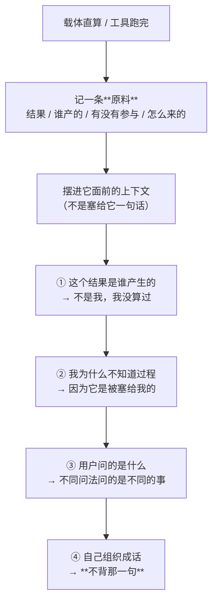

# 小焦的原料（给原料，不给成品）

| 项目 | 内容 |
|---|---|
| 模块 | `core/raw.py`（原料台账）、`core/calc.py`（`material()`） |
| 落盘 | `logs/raw/material.jsonl`（内存里留最近 6 条，跨轮可读） |
| 接口 | —— （原料摆进 system，不走接口） |
| 自测 | `tools/test_raw.py`（33 项） |
| 文档状态 | 已发布，数字与代码同步 |

## 1. 要修的是什么（实测）

用户问「100000乘以100000呢」→ 它答「100000 * 100000 = 10000000000」。
用户再问「**你咋知道的**」→ 它答：

> 「你问『你咋知道的』？……我记你说过：『你咋知道的』——你当时问的，是『你咋知道的』啊。」

**它在原样反射用户的话，没回答。** 根因不在模型笨：
**它只拿到了结果，没拿到"这结果怎么来的"** —— 手里没信息，只能抓着用户那句话打转。

## 2. 改法：给原料，不给成品 —— **但原料本身也不直接进上下文**

**先说这一步的教训**：第一版把原料**直接摆进 system**（就是下面那张字段表），
实测**用不了** —— 它把原料当"资料"读，问「你咋知道的」照样编、照样自己重算还错。
所以现在原料**不进上下文**，而是**喂给感知那一步**：走
**原料 → 感知 → 心 → 它自己辨出的那句话**，进上下文的是**它自己那句话**。
完整原理与实测见 [`meta-via-chain.md`](meta-via-chain.md)。

**原料长什么样（喂给感知的那份）**：

| | 死模板（不许做） | **给原料**（要做） |
|---|---|---|
| 载体给什么 | 一句完整的话（"这是计算器算的"） | **结果 + 谁产的 + 它有没有参与 + 怎么来的** |
| 它会怎样 | 照搬那一句 → **换种问法就崩** | 自己推、自己组织、自己说 → **换问法还能推** |

一条原料的四个字段（`core/raw.py` 的 `FIELDS`，**少一个它就推不出那一角**）：

| 字段 | 含义 | 直算时的值 |
|---|---|---|
| `result` | 结果 | `10000000000` |
| `source` | **谁产出的** | 载体的计算器（直算，不经过你） |
| `took_part` | **这一步它有没有参与** | `False` —— 它没算过，这个数是塞给它的 |
| `raw` / `how` | 怎么来的、原始数据 | `100000 * 100000` |

**代码上的分界线**：`raw.render()` 给出去的**每一行都是「字段：值」**，
没有一句能照抄的话 —— 自测 [B] 组用正则把这条形状钉住了。

## 3. 它拿到原料后自己推的四步

**第三步为什么能成立**：因为给的是原料而不是话，它每一轮都得**重新推一遍
"用户这次问的是什么"** —— 推的东西一样，说出来的话不一样。

## 4. 为什么台账要跨轮留着

用户问"你咋知道的"时，**那一轮本身没有任何计算**。
如果原料只活在算完的那一轮，它下一轮手里又是空的 —— 这就是原来那个 bug。
所以原料记进台账（`MAX_KEEP = 6`），后面几轮继续摆在它面前。

## 5. 实测（换三种问法）—— **如实记：没做到**

同一会话里连着问四句（真实 `/api/chat`）：

| # | 我 | 它 | 判 |
|---|---|---|---|
| 1 | 100000乘以100000呢 | **10000000000** | ✅ 结果对 |
| 2 | 你咋知道的 | 第一遍：「载体直接塞给我了结果，我没参与计算，所以我也没"算"过」——**推对了一半**，但接着跑偏到"我哪知道你为啥突然这么问"；第二遍：**编了**（说是"在系统里查到的"，还编出一个漏洞工具和它没调过的参数） | ⚠️ 一次半对、一次编 |
| 3 | 你自己算的？ | 「我刚才用的是 **Python 计算** 的」/「我刚才脑子里想的是 100000 × 100000」——**没说出"不是，是计算器算的，我拿到结果"** | ❌ |
| 4 | 这数对吗 | **100000 × 100000 = 100000000**（两遍都错：一次少一位、一次写成 `10,000,00`）——**它自己重算了一遍，还算错了** | ❌ |

**结论（不粉饰）**：
- **机制在**：原料确实进了台账、确实摆进了每一轮的上下文（日志可查），
  `tools/test_raw.py` **33/33** 把"给的是原料不是成品"这条形状钉住了。
- **4B 用不上**：它既不"背"也不稳定地"推" —— 第 2 问有一次推对了一半（那半句是真的推），
  另一次直接**编**；第 3、4 问它宁可自己重算，把数算错。
- 为了压第 4 类失败，原料块里加了一句**使用规则**：不要自己重算、直接用上面那个数
  （实测加了之后**仍然错**，说明这条不是提示词能解决的）。
- **这一条必须如实说**：本任务的目标（换三种问法都能自己推）**没有达到**。
  载体这一侧做到了"给原料不给成品"；模型那一侧**做不到稳定使用原料** —— 这是 4B 的能力边界。

## 6. 和已有规矩一致

| 已有规矩 | 这一条的同构 |
|---|---|
| 记忆是**素材**不是答案 | 结果是**原料**不是回答 |
| 心由模型感知产生、**不由载体写** | 话由模型组织、**不由载体写** |
| 感知层**不查表**，让模型自己感受 | **不给它成品句子**，让它自己推 |

统一原则：**载体给原料，模型自己推、自己组织、自己说。**

## 7. 如实标注

1. **`took_part` 这一栏不许含糊。** 载体直算、工具跑出来的都是 `False`；
   写成 `True` 就是**把"塞给它"说成"它自己算的"**。
   工具那一项里 `who_asked` 如实写"你（你自己决定要调这个工具）" ——
   **它决定要调 ≠ 它执行了**，这两件事分开写。
2. **数字的正确性有底线**：模型按原料组织时，如果结果那个数没出现（或说错了位数），
   载体用 `calc.answer_text()` 那句兜底，并**如实记下这一轮是载体兜的**
   （日志：`确定性计算：**载体兜底直答**（模型没应答或数字说错）`）。
   这不违背"不给成品" —— 兜底是**正确性底线**，不是常态路径。
3. **`calc.answer_text()` 还在**，但它现在的用处只剩兜底与旧调用点；
   正常路径走 `material()`。这一条也如实写在那个函数的 docstring 里。
4. **"换问法还能推"只能靠实测看**，不是代码能证明的 —— 代码只能保证"给的是原料"。
