# 发布与回滚预案

| 项目 | 内容 |
| --- | --- |
| 适用版本 | v1.0 |
| 最后更新 | 2026-09-14 |
| 维护者 | 小焦项目 |
| 文档状态 | 稳定 |

**摘要**：本文说明小焦仓库的分支模型、发版五步、按影响面排序的回滚方案，以及 git 通道被网络重置时的发布兜底流程。

三条不可动摇的原则：

1. **任何一步都能回退**。
2. **绝不 force push 覆盖历史**。
3. **发布前必须跑通压力测试**。

## 目录

- [1. 分支模型](#1-分支模型)
- [2. 发版流程](#2-发版流程)
- [3. 回滚预案](#3-回滚预案)
- [4. 发布工具](#4-发布工具)
- [5. 网络受限时的发布](#5-网络受限时的发布)
- [6. 发布检查清单](#6-发布检查清单)

## 1. 分支模型

### 图 1 · 分支模型与发版路径

**一句话说明**：改动全部先在整改分支上完成并验证，通过验收后才合并回稳定线并打 tag、建 Release，任何一步失败都退回整改分支。

**代码位置索引**：`tools/publish_all.py`（发布编排）、`tools/sync_release.py`（tag 与 Release 对齐）、
`tools/publish_release.py`（打 tag + 建 Release）、`tools/publish_via_api.py`（API 通道兜底）、
`.github/workflows/stress-test.yml`（通过率门槛 95）。

```mermaid
%%{init: {"themeVariables": {"fontSize": "14px"}, "flowchart": {"htmlLabels": true, "wrappingWidth": 340, "nodeSpacing": 46, "rankSpacing": 64, "useMaxWidth": true}}}%%
flowchart LR
    M["main：稳定线"] -->|"开分支"| R["release/stabilize-YYYYMMDD：整改线"]
    R -->|"一个修复一个中文提交"| R
    R -->|"压力测试通过率达标"| V{"验收"}
    V -->|"不通过：继续整改"| R
    V -->|"通过"| MG["git merge --no-ff 合并回 main"]
    MG --> T["git tag -a vX.Y.Z"]
    T --> REL["创建 Release：正文取 CHANGELOG 小节"]
    REL --> DOC["回填 CHANGELOG 与 README 版本表"]
    style M fill:#4A90E2,color:#fff
    style R fill:#4A90E2,color:#fff
    style V fill:#F5A623,color:#fff
    style MG fill:#7ED321,color:#fff
    style T fill:#7ED321,color:#fff
    style REL fill:#7ED321,color:#fff
    style DOC fill:#7ED321,color:#fff
```



| 分支 | 用途 | 规则 |
| --- | --- | --- |
| `main` | 稳定线，随 Release 走 | 不直接提交；只接受已验证的合并 |
| `release/stabilize-YYYYMMDD` | 整改与开发线 | 一个修复一个 commit，中文 message |

当前仓库实际存在的分支：`main`、`release/stabilize-20260912`、`release/stabilize-20260913`、`backup-main`。
对外只保留 `v1.0` 这一个 tag 与 Release。

## 2. 发版流程

### 2.1 五步

```powershell
# ① 全量验证（本地要求 100% 通过，CI 门槛为 95%）
python tests/stress/run_all.py --json tests/stress/results.json --min-pass-rate 95

# ② 合并到 main（先在整改分支上确认工作区干净）
git status                                  # 应为 clean（个人运行态文件除外）
git checkout main
git merge --no-ff release/stabilize-YYYYMMDD -m "chore(release): 合并 vX.Y.Z 整改分支"

# ③ 打 tag（语义化版本，禁止回退版本号）
git tag -a vX.Y.Z -m "小焦 vX.Y.Z · 一句话说明"
git push origin main
git push origin vX.Y.Z

# ④ 创建 Release（中文说明：新增 / 修复 / 变更 / 升级说明 / 已知问题 / 免责声明）
#    无 gh CLI 时用 REST API（见第 4 节脚本），或在网页手动创建

# ⑤ 发布后回填文档：CHANGELOG（Keep a Changelog 格式）、README 版本表
```

### 2.2 版本号规则

遵循语义化版本：修复 = PATCH，兼容新增 = MINOR，破坏性变更 = MAJOR。
当前应用版本常量 `xiaojiao_app.py` → `APP_VERSION = "1.0"`。

## 3. 回滚预案

按影响面从小到大排列：

| 场景 | 操作 | 说明 |
| --- | --- | --- |
| 单个提交有问题 | `git revert <sha>` | **首选**：保留历史，生成反向提交，最安全 |
| 最近几个提交有问题 | `git revert --no-commit <sha1>^..<shaN>`，然后一次提交 | 批量回退且留痕 |
| 整改分支整体退回 | `git checkout main`（不动整改分支） | 不影响 `main`，等于放弃该分支 |
| 已合并进 main 需回退 | `git revert -m 1 <merge-sha>` | 撤销合并，历史保留 |
| 已发布 Release 需撤回 | 在 GitHub Release 界面删除或标记为 pre-release，并**新发一个补丁版本** | 不要删除 tag 后重发同名版本，会造成用户端混乱 |
| 本地工作区改乱 | `git restore <file>` / `git reset --hard HEAD` | 只丢**未提交**的改动；有未提交改动时先 `git stash` |

```powershell
# 回滚示例：撤销一次有问题的提交（保留历史）
git revert 555e3b0
git push origin main
```

禁止事项：`git push --force` 覆盖 `main`；删除远端 tag 后重发同名版本；`git reset --hard` 之后再 `push -f`。

> 补充：`tools/sync_release.py` 需要把已有 tag 改指向时，用的是 `PATCH refs/tags/<tag>`
> 而不是 `DELETE` —— 在 GitHub 上删掉 tag 会把它名下的 Release 变成草稿或孤儿，发布页会短暂消失。

## 4. 发布工具

仓库自带四个发布脚本，全部通过 GitHub REST API 工作，因此 git 通道不通时仍可发布。

| 脚本 | 用途 | 常用参数 |
| --- | --- | --- |
| `tools/publish_all.py` | 一键发布：先做一次短超时 `git push`，不通自动改走 API，最后对齐 tag / Release | `--branch`、`--tag`、`--git-timeout`（默认 20 秒）、`--api-only`、`--skip-release`、`--dry-run` |
| `tools/publish_via_api.py` | 只走 REST API 把本地提交原样发布到远端分支 | `--branch`、`--repo`、`--dry-run`、`--force-ref`、`--sync-tree` |
| `tools/sync_release.py` | 把 tag 与 Release 对齐到目标引用，并清理同名草稿 | `--tag`（默认 v1.0）、`--target`（默认 main）、`--title`、`--dry-run` |
| `tools/publish_release.py` | 打 tag 并创建 Release（不碰 `main` 的任何提交） | `--tag`（必填）、`--title`、`--target`、`--notes-file`、`--update-body`、`--dry-run` |
| `tools/reset_releases.py` | 只保留指定版本，清掉其它 Release 与 tag 引用（可重建，不动提交历史） | `--tag`、`--dry-run` |

Release 正文的取用顺序：`docs/release-notes-<tag>.md` 优先，没有才退回 `CHANGELOG.md` 里 `## [<tag>]` 小节。

```powershell
# 推荐路径：一次命令完成发布与对齐
python tools/publish_all.py --tag v1.0 --dry-run     # 先看会做什么
python tools/publish_all.py --tag v1.0
```

## 5. 网络受限时的发布

现象：`git push` / `git fetch` 报
`fatal: unable to access 'https://github.com/...': Recv failure: Connection was reset`，
但 `https://api.github.com` 仍然可用。

兜底做法：用仓库自带脚本，通过 REST API 把本地提交**原样**发布到远端分支。

```powershell
python tools/publish_via_api.py --dry-run          # 先看要发布哪些提交
python tools/publish_via_api.py                    # 真正发布（blob → tree → commit → ref）
```

- 脚本会校验发布后**远端 tree 与本地 tree 是否一致**，内容一致才算成功。
- 注意：API 发布的提交对象由远端生成，**SHA 可能与本地不同**（提交对象的 committer 元数据差异），
  但**文件内容完全一致**。网络恢复后对齐一次引用即可：

```powershell
git fetch origin
git reset --hard origin/<branch>      # 内容一致，安全；此后本地与远端 SHA 恢复一致
```

- 完全无法访问 API 时：用 `git format-patch` 导出补丁并手工在网页上传，或等网络恢复后重试。

## 6. 发布检查清单

- [ ] `tests/stress/run_all.py` 通过率达标（本地 100% / CI ≥ 95%）
- [ ] `CHANGELOG.md` 已按 Keep a Changelog 更新（Added / Changed / Fixed / 已知问题）
- [ ] README、`docs/` 下的文档、原理图与代码一致（配置项、工具数量、命令）
- [ ] 版本号遵循语义化版本
- [ ] Release 说明含升级步骤、破坏性变更、已知问题、免责声明
- [ ] 没有把密钥、个人路径、个人运行态文件带进提交（用 `git diff --cached` 自查）
- [ ] `python tools/check_docs.py` 与 `python tools/check_mermaid.py --all` 均无错误

## 参考

- 压测套件说明：[../tests/stress/README.md](../tests/stress/README.md)
- 更新日志：[../CHANGELOG.md](../CHANGELOG.md)
- v1.0 发布说明：见 GitHub Release（已随发布写上去，仓库内不再留一份副本）→ https://github.com/jiangchuangege/xiaojiao-harness/releases/tag/v1.0

## 变更记录

| 日期 | 版本 | 变更 |
| --- | --- | --- |
| 2026-09-14 | v1.0 | 重写：对齐代码 + 统一文风 |
