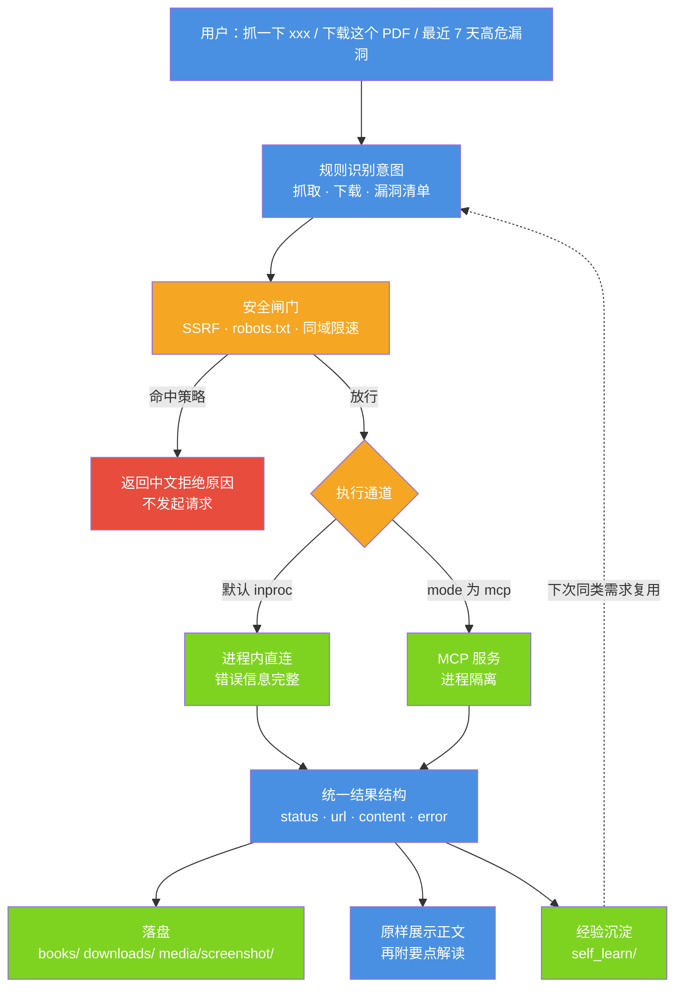
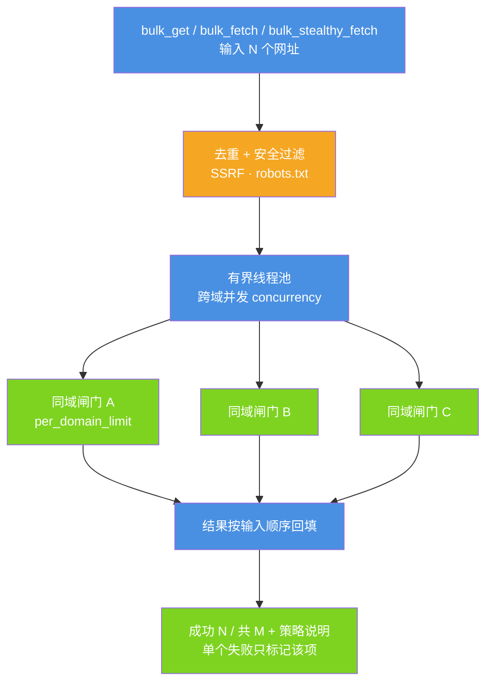
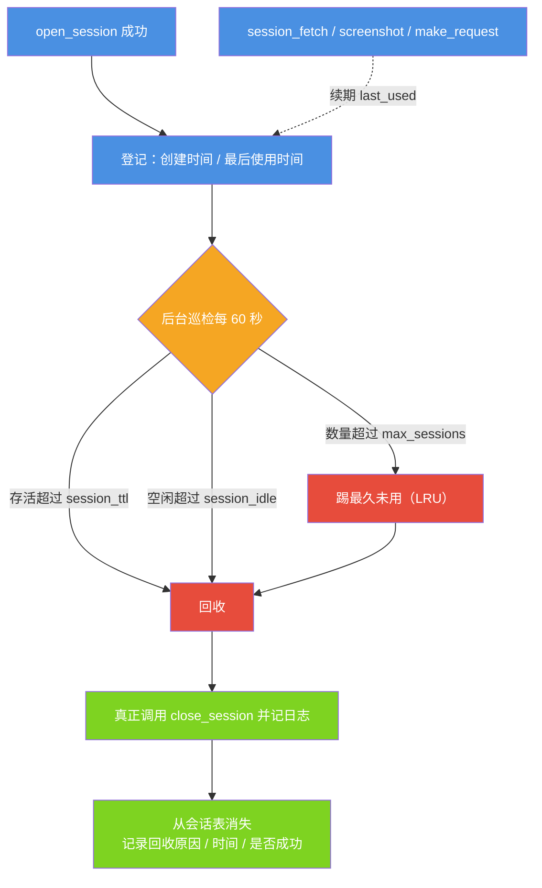
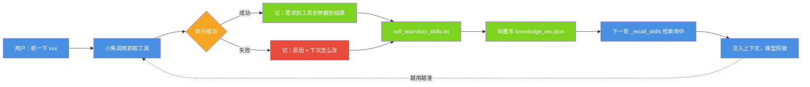
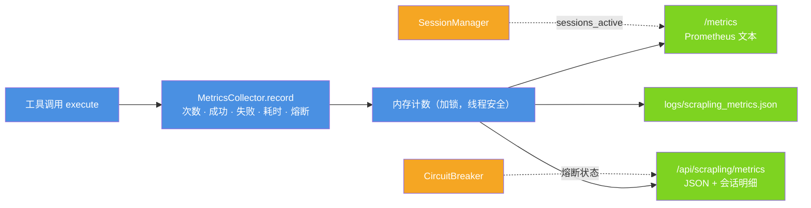

# 内置 Scrapling 抓取插件

| 项 | 值 |
| --- | --- |
| 适用版本 | v1.0 |
| 最后更新 | 2026-09-14 |
| 维护者 | 小焦项目 |
| 文档状态 | 稳定 |

**摘要**：小焦内置 Scrapling 抓取桥接插件，把「抓网页 / 渲染动态页 / 取接口 JSON / 批量抓列表 / 绕反爬 / 登录态抓取 / 下载任意文件 / 查 NVD 漏洞」统一成 18 个工具，并在插件层完成安全闸门、限速退避、熔断自愈、结果标准化与内容解读。本文说明这 18 个工具、工作原理、全部配置项、观测方式与验收方法。

插件文件：`plugins/scrapling_bridge.py`。依赖：`scrapling[fetchers]`、`markdownify`（`mcp` 仅在 MCP 模式下需要）。

---

## 目录

- [1. 概述](#1-概述)
- [2. 快速开始](#2-快速开始)
- [3. 工具清单](#3-工具清单)
- [4. 用法示例](#4-用法示例)
- [5. 工作原理](#5-工作原理)
- [6. 配置](#6-配置)
- [7. 用户使用时学习](#7-用户使用时学习)
- [8. 指标与观测](#8-指标与观测)
- [9. 测试与验收](#9-测试与验收)
- [10. 故障排查](#10-故障排查)
- [11. 免责声明](#11-免责声明)

---

## 1. 概述

### 1.1 定位

抓取能力对模型是「外部能力」：模型只会生成文本，不会取网页。Scrapling 是一个开源 Python 抓取库，提供 HTTP 抓取、Playwright 浏览器渲染、隐身指纹、会话保持与自适应选择器等能力。

直接把这些能力暴露给一个 4B 级别的小模型会出两类问题：

1. **选不对**：参数太多（指纹、代理、超时单位、提取类型），模型无法稳定选择，常见结果是编造一段代码而不是真的去抓。
2. **扛不住**：抓取会失败、会被 WAF 拦、会被限速。模型没有重试、退避、熔断、限流的能力，失败一次就把错误原样抛给用户。

本插件的做法是把复杂度收进插件层，对外只留 18 个语义明确的工具，并加上五条保障：安全闸门（SSRF / robots.txt / 限速）、熔断自愈、批量策略（去重 / 退避 / 代理轮换 / 失败隔离）、结果标准化（统一结构 + 中文错误 + 日志脱敏）、内容解读（正文直显 + 要点解读）。

### 1.2 覆盖的能力

| 能力 | 对应工具 |
| --- | --- |
| 普通 HTTP 抓取 | `make_request` / `get` |
| 浏览器渲染抓取 | `fetch` |
| 隐身抓取（过 Cloudflare 类风控） | `stealthy_fetch` |
| 批量抓取 | `bulk_get` / `bulk_fetch` / `bulk_stealthy_fetch` |
| 会话保持（登录态 / 已过验证） | `open_session` / `session_fetch` 等 7 个会话与截图工具 |
| 选择器抓取（自适应抗改版） | `scrape_with_selector` |
| 下载任意文件 | `download` |
| 漏洞清单 | `collect_vulnerabilities` |

---

## 2. 快速开始

```powershell
# ① 安装依赖（示例使用清华镜像）
python -m pip install "scrapling[fetchers]" markdownify mcp -i https://pypi.tuna.tsinghua.edu.cn/simple

# ② 浏览器渲染需要 Chromium：自备 Chrome 时填路径，否则用官方安装命令
scrapling install

# ③ 启动小焦（插件自动加载）
python start_xiaojiao.py

# ④ 验证：浏览器打开小焦 → 设置 → 插件 → 应看到 scrapling_bridge 及其 18 个工具
```

在 `xiaojiao_control.json` 里按需配置（完整字段见[第 6 节](#6-配置)）：

```json
"scrapling": {
  "mode": "auto",
  "executable_path": "D:\\tools\\chrome-win64\\chrome.exe",
  "rate_limit": 1.0,
  "timeout": 60
}
```

---

## 3. 工具清单

插件共暴露 **18 个工具**：Scrapling 原生 13 个 1:1 暴露 + 4 个小焦增强 + 1 个兼容入口。

### 3.1 原生 13 个

工具名与 Scrapling 官方一致，参数按 Scrapling 0.4.15 的真实签名整理并做过白名单过滤（不支持该工具的参数会被丢弃，见 [5.10](#510-内容标准化与安全)）。

| 工具 | 参数 | 说明 |
| --- | --- | --- |
| `make_request` | `url` `timeout?` `save_to?` `ignore_robots?` | 普通 HTTP 抓取，纯 HTTP，最快（等价于 `get`） |
| `bulk_get` | `urls` `ignore_robots?` | 批量 HTTP 抓取（去重 / 限速 / 退避 / 失败隔离） |
| `fetch` | `url` `wait_selector?` `timeout?` `save_to?` `ignore_robots?` | Playwright 浏览器渲染 |
| `bulk_fetch` | `urls` `ignore_robots?` | 批量浏览器渲染 |
| `stealthy_fetch` | `url` `timeout?` `save_to?` `ignore_robots?` | 隐身抓取（指纹随机化 + 尝试过 Cloudflare 验证） |
| `bulk_stealthy_fetch` | `urls` `ignore_robots?` | 批量隐身抓取，最多 20 个 URL |
| `open_session` | `session_type?` `session_id?` | 开浏览器会话（`dynamic` / `stealthy`） |
| `open_request_session` | `session_id?` | 开 HTTP 会话（保持 cookie） |
| `close_session` | `session_id` | 关闭会话、释放资源 |
| `list_sessions` | — | 列出当前所有会话 |
| `session_fetch` | `url` `session_id` `wait_selector?` `ignore_robots?` | 用会话抓页面（保持登录态 / 已过验证） |
| `session_make_request` | `url` `session_id` `ignore_robots?` | 用 HTTP 会话发请求（保持 cookie） |
| `screenshot` | `url` `session_id` `full_page?` `ignore_robots?` | 页面截图，存到 `media/screenshot/` 并返回路径 |

### 3.2 小焦增强 4 个

| 工具 | 参数 | 说明 |
| --- | --- | --- |
| `get` | `url` `stealth?` `timeout?` `save_to?` `ignore_robots?` | 抓网页首选（静态页 / 接口 / JSON 一律先用它），是 `make_request` 的中文友好别名 |
| `scrape_with_selector` | `url` `selector` `adaptive?` `name?` `ignore_robots?` | 选择器抓取指定区块，自适应抗改版（存档 + 相似度找回） |
| `download` | `url` `filename?` `ignore_robots?` | 下载任意文件（PDF / EPUB / ZIP / 图片 / 音视频），Scrapling 原生没有这个能力 |
| `collect_vulnerabilities` | `days?` `severity?` `limit?` | NVD 漏洞时间窗查询，插件层直接产出 Markdown 表格（见 [3.5](#35-collect_vulnerabilities)） |

### 3.3 兼容入口 1 个

`browser_session`：用一个工具按 `action` 走完会话全流程，适合不便分步调用的场景。7 种 action 与 7 个原生会话工具一一对应：

| action | 作用 | 关键参数 |
| --- | --- | --- |
| `open` | 开浏览器会话（`dynamic` / `stealthy`），后续复用可省去反复启动浏览器 | `session_type` |
| `open_http` | 开 HTTP 会话（`static`），保持 cookie 与连接 | — |
| `close` | 关闭会话，释放资源 | `session_id` |
| `list` | 列出当前所有会话 | — |
| `fetch` | 用会话抓页面（保持登录态 / 已过验证的浏览器） | `url` `session_id` |
| `request` | 用 HTTP 会话发请求（保持 cookie） | `url` `session_id` |
| `screenshot` | 给页面截图（可整页），图片存 `media/screenshot/` | `url` `session_id` `full_page` |

典型流程：`open(stealthy)` → 多次 `fetch`（同一浏览器、已过验证）→ `close`。

### 3.4 返回值结构

所有抓取类工具返回统一结构的 JSON 字符串：

```json
{ "status": 200, "url": "https://…", "content": "Markdown 正文", "error": "" }
```

- `status`：HTTP 状态码；被安全策略拒绝时为 `0`。
- `content`：Markdown 正文，已做 JSON 美化与超长截断。
- `error`：空串表示成功；非空时是**中文可读**原因，不会是 Python 堆栈。

批量工具额外带 `items`，逐项结构与上面一致：

```json
{ "status": 200,
  "content": "批量抓取完成：成功 3 / 共 4（去重+安全过滤后实际请求 3，并发 3（跨域）/ 同域 1 / 同域间隔 1.0s / 重试 3 次 / 退避基数 1.0s）",
  "items": [ { "status": 200, "url": "…", "content": "…", "error": "" } ] }
```

批量结果**按输入顺序回填**；只要有一项失败，`items` 里那一项的 `error` 非空，其余项不受影响。全部失败时顶层 `status` 为 `0`，避免调用方把「全军覆没」当成成功。

### 3.5 collect_vulnerabilities

#### 3.5.1 为什么漏洞查询要单独做一个工具

真实缺陷复盘：让小焦「抓最近 7 天的高危漏洞」，模型自己拼出的 URL 是

```text
https://services.nvd.nist.gov/rest/json/cves/2.0?resultsPerPage=5&cvssV3Severity=HIGH
```

三个后果同时出现：

1. **没带时间窗**，拿回的是 1999 年的历史数据；
2. 原始 JSON 直接丢给模型，5 条只总结了 1 条；
3. 「受影响软件」要求模型自己从 `configurations[].nodes[].cpeMatch[].criteria` 里推导，结果全部变成 `n/a`。

修法是把「拼 URL + 挑字段 + 排版」整体收进插件层，模型只负责调用。

#### 3.5.2 插件层的处理

| 环节 | 做法 |
| --- | --- |
| 时间窗 | **强制**带 `lastModStartDate` / `lastModEndDate`（UTC）；`days` 默认 7，上限 120（NVD 官方限制） |
| 取数 | `resultsPerPage=50`；窗口内记录多于一页时取「最新一页 + 最早一页」，保证最新几条在手里（NVD 返回按 `lastModified` 升序） |
| 等级 | CVSS 取值优先级 v4.0 → v3.1 → v3.0 → v2；v2 没有 `baseSeverity` 时按官方分段区间补等级；`severity=HIGH` 表示 HIGH 及以上（含 CRITICAL），也可写多个等级（`HIGH,CRITICAL`）或 `ANY` |
| 受影响软件 | 从 CPE 还原为可读名称：`cpe:2.3:a:apache:http_server:1.0` → `Apache HTTP Server 1.0`；新 CVE 尚未收录 CPE 时，从英文描述里**保守摘取**并标注「（描述推断）」，摘不到就写「（NVD 未收录产品配置）」，不写 `n/a` |
| 输出 | 直接返回 Markdown 表：`序号 / CVE 编号 / 等级 / 评分 / 受影响软件 / 发布时间 / 摘要`，表头带时间窗、数据源、**实际扫描范围**、命中条数 |
| 抽样透明 | 没拉到的页、没有 CVSS 评分的记录都在表头如实标注（例如「本次只扫描了最新 50 条」），不把不完整讲成完整 |

被撤销的 CVE（`vulnStatus=Rejected`）不进表。

#### 3.5.3 实测

2026-09-14 的联网压力测试（`python tests/stress/run_all.py`）实测结果：

| 判据 | 实测 |
| --- | --- |
| 请求「最近 7 天高危漏洞」 | 走 `collect_vulnerabilities`，返回 1634 字、7 行（表头 + 分隔 + 5 行数据） |
| 时间窗 | 窗口起点为 2026-09-07，即最近 7 天，不是历史数据 |
| 耗时 | 14.1s（真实 NVD 接口，受 NVD 侧负载影响） |
| 受影响软件 | 每行都有交代：命中 CPE 的还原为可读软件名，未收录的标注「（NVD 未收录产品配置）」或「（描述推断）」，无裸 `n/a` |
| 等级 | 仅返回要求范围内的等级（HIGH 及以上） |
| 参数边界 | `days=999` 被夹到 NVD 上限 120 天，并在表头如实反映 |

NVD 官方接口对无密钥调用限流较严（5 次 / 30 秒）。插件遇到 HTTP 429（以及 500 / 502 / 503 / 504）会退避重试一次；仍失败则返回中文可读原因，不会把半截结果当成完整结果返回。

---

## 4. 用法示例

| 目标 | 对小焦说 | 结果 |
| --- | --- | --- |
| 抓普通页 | 抓一下 example.com | 正文 + 要点解读 |
| 批量抓 | 抓取 https://a.com 和 https://b.com | 逐项结果（自动去重，单项失败不影响其它） |
| 抓动态页 | 用浏览器渲染抓 https://… | 渲染后的正文 |
| 绕反爬 | 用 stealthy_fetch 抓 https://… | 隐身抓取结果 |
| 存成文件 | 抓这章存成 ch1.md | `books/ch1.md` |
| 下载任意文件 | 把这个 PDF / ZIP 下载下来 https://… | `downloads/book.pdf`（PDF / EPUB / TXT / ZIP / 图片 / 音视频均可） |
| 抓接口 JSON | 抓 https://…/api/list（返回 JSON） | 美化后的 JSON 文本 |
| 登录态抓取 | 开个会话，然后抓 https://…（需要登录的页） | 会话内抓取结果 |
| 整页截图 | 给 https://… 截个整页图 | `media/screenshot/*.png` |
| 漏洞情报 | 抓取最近 7 天的高危漏洞 / 看看这个月的严重漏洞 10 条 | NVD 漏洞表（等级 / 评分 / 受影响软件 / 时间 / 摘要），走 `collect_vulnerabilities` |
| 指定条件 | 帮我看下 30 天的中危漏洞 | 自动解析为 `days=30`、`severity=MEDIUM` |

### 4.1 抓取结果的自动解读

抓到的正文之后会附一段解读，形如：

```text
https://example.com · HTTP 200

# Example Domain
This domain is for use in documentation examples without needing permission…

──────────────
小焦解读
这是一个用于文档示例的占位域名页面，本身不提供实际功能。
· 它仅用于演示和文档说明，不具备任何真实服务或数据。
· 域名由 IANA 专门保留，用于技术文档、教程和示例代码中。
· 页面中唯一的可点击链接指向 IANA 官网。
```

解读按固定结构生成：一句话说明这是什么 → 3~6 条要点 → 怎么用。生成时明确要求「只依据抓到的内容、不编造」。若模型不可用或输出短于 20 字，自动退回**规则提纲**（抽标题 / 链接 / 段落首句），保证总有结构可看。

对应实现：`_explain_content()`（模型解读）与 `_auto_outline()`（规则兜底），见 `xiaojiao_app.py`。

---

## 5. 工作原理

### 5.1 架构与数据流

插件内部由 5 个组件分工：`SecurityGuard`（安全）、`CircuitBreaker`（熔断自愈）、`BatchManager`（批量）、`SelectorManager`（自适应选择器）、`AsyncRunner` + `MCPClient`（双通道）。

**图 1 · 一次抓取请求的完整链路**

一句话说明：用户一句话从意图识别到落盘、展示、经验沉淀，中间的每一步都由插件层负责，模型只决定「抓哪个网址」。

代码位置索引：`plugins/scrapling_bridge.py` 的 `ScraplingBridge.execute()`；意图识别在 `xiaojiao_app.py` 的 `_detect_scrape_intent()` 与 `_scrape_direct()`。



### 5.2 抓取意图直通

4B 级别模型的 function calling 不稳定：让它自行决定用什么工具，常见结果是编造一段代码而不是真的去抓。所以抓取走**规则识别兜底**：

- **动词词表**：抓取 / 爬取 / 抓一下 / 爬一下 / 下载 / 浏览器渲染 / 隐身 / stealthy / Cloudflare 等（`_SCRAPE_TOOL_HINTS`）。
- **网址提取**：`https?://…`；裸域名（`example.com`）自动补 `https://`。混进中文的网址会按「中文落在主机名还是路径」分别处理：落在主机名说明网址已结束，落成路径则保留并百分号编码（`_clean_url()`）。
- **命中即直接构造工具调用并执行**；多个网址自动升级为批量工具。
- 升级链：`get` 失败（被拦 / 403 / 空正文 / 结果校验不过）→ 自动升级到 `fetch` → `stealthy_fetch`（`_tool_fallback_for()`）。同一轮不会重复跑同一个工具。

### 5.3 正文直显

抓到的正文如果先交给小模型「总结成一句话」，用户就只能看到「已获取内容」。因此抓取结果**原样展示**：单页限 4000 字、批量每项限 1500 字，之后**再附**解读。

### 5.4 robots.txt 怎么判

判定按 RFC 9309，避免误伤：

| 情况 | 做法 |
| --- | --- |
| 能读到 robots.txt 且有 `Disallow` 命中 | **拦**，给出中文提示 + 放行方法 |
| 该站没有 robots.txt（404 / 410） | **放行** |
| robots.txt 被 WAF 拦（401 / 403） | **放行**：这是「拿不到规则」，不是「站点禁抓」 |
| 超时 / 5xx / 解析失败 | **放行**：不能因为查不到就把请求拦住 |

不使用 `urllib.robotparser.read()` 的原因：它遇到 401 / 403 会设 `disallow_all=True`，把**整站**判成禁止抓取。现实中大量站点（例如 `services.nvd.nist.gov` 这类 API 域名）的 WAF 会 403 掉默认 `Python-urllib` UA 的 robots 请求，而站上其实没有 robots.txt，用它就会误拦。插件自己拉取 robots.txt（缓存 1 小时），再交给 `RobotFileParser.parse()` 判定。

确认自己有权抓取被禁地址时，两种放行方式：

```json
"scrapling": { "allow_robots_skip": true }
```

或在对话里直接说「忽略 robots 抓一次」（单次生效，对应 `ignore_robots: true`），不写死配置。

### 5.5 异步桥接

这是最容易出问题的一环。

| 问题 | 做法 |
| --- | --- |
| Flask 是同步线程，Scrapling 是异步 API | 起一条**常驻事件循环线程**（`AsyncRunner`），协程提交进去执行 |
| 反复 `asyncio.run()` 会不断建 / 销毁事件循环，导致冲突 | 禁止直接调用 `asyncio.run()`，统一走 `run_coroutine_threadsafe` |
| 调用可能挂死 | `future.result(timeout=…)`；超时则 `future.cancel()` 并返回中文超时错误 |
| MCP 服务崩溃 | 调用前健康检查（进程存活 / 连接有效），失效即重连（30 秒窗口内自动恢复） |

### 5.6 双通道

| 通道 | 何时使用 | 优点 | 缺点 |
| --- | --- | --- | --- |
| `inproc`（默认） | `mode=auto` / `inproc` | 错误信息**完整**（能拿到真实异常）、无子进程、延迟低 | 与宿主同进程 |
| `mcp` | `mode=mcp` | 进程隔离、可接远程 HTTP MCP | 出错只回一句 `Error executing tool xxx`，难排查 |

`auto` 的行为是 **inproc 优先**：4B 场景最需要「错误可读」。MCP 的笼统错误也在插件里做了中文化与排查建议（例如提示缺 `markdownify`）。

### 5.7 批量策略

两个维度分开控制：**跨域并发**（快）与**同域闸门**（礼貌）。

**图 2 · 批量抓取：跨域并发 + 同域闸门**

一句话说明：批量抓取对内逐个 URL 调用「单个」工具以便真正控制限速与退避，对外用有界线程池并发、用每域信号量保证同一个站点不被并发打。

代码位置索引：`plugins/scrapling_bridge.py` 的 `BatchManager.run_batch()` / `_sem_for()` / `_bulk_one()`，配置类 `BatchConfig`。



其余策略：URL 去重 → 逐条限速（≥ `rate_limit` 秒 / 域）→ 遇 429 指数退避（1→2→4→8 秒，最多 `max_retries` 次）→ 代理轮换（单个代理最多用 5 次，用满重置）→ 单个失败只标记该项。单次批量上限 200 个 URL。

**并发模型实测**（用固定 0.5 秒时延的函数替代真实网络，隔离出并发模型本身的表现，结果可复现）：

| 场景 | 配置 | 耗时 |
| --- | --- | --- |
| 跨域 3 个不同域名 | `concurrency=1` | 1.50s |
| 跨域 3 个不同域名 | `concurrency=3` | 0.50s（提速 67%） |
| 同域 3 个 URL | `concurrency=3` + `per_domain_limit=1` | 1.50s（严格串行） |
| 同域 3 个 URL | `concurrency=3` + `per_domain_limit=3` | 0.50s |

同域默认严格串行（`per_domain_limit=1`）并遵守 `rate_limit`。跨域并发在真实网络下的提速幅度取决于各站点的响应时间，不同时段波动明显，因此上表用固定时延给出可复现的口径。

配置非法时不静默忽略，批量工具直接返回中文错误：

```text
批量配置不合法：批量并发 concurrency 必须 ≥ 1（当前 0）—— 请修正 xiaojiao_control.json 的 scrapling.batch 段
```

实现说明（务实取舍）：插件对外是**同步**接口，Scrapling 内核跑在专用事件循环线程里，在事件循环内部再用 `asyncio.Semaphore` 会自锁，因此改用「有界线程池 + 每域信号量」实现等价语义。

### 5.8 熔断自愈

同一工具连续失败 `circuit_breaker_threshold`（默认 3）次后，暂停该工具 `circuit_breaker_timeout`（默认 30 秒），期间返回：

```text
工具暂时不可用（连续失败触发保护），请 30 秒后重试
```

到期自动恢复（半开状态），绝不永久禁用。

**安全拦截（SSRF / robots / 参数缺失）不计入失败**：那是按策略正常拒绝，不是工具故障。否则连续拦截几个内网地址就会把工具误判为不可用。

### 5.9 自适应选择器

- **保存指纹**：标签、class 集合、id、文本、父节点路径、兄弟位置、属性集合（`SelectorRecord`）。
- **恢复**：加权相似度比对，权重为 text 0.25、classes 0.25、tag 0.15、id 0.15、path 0.10、sibling 0.10。
- 多个相似度超过 90% 的候选时**全部返回并附置信度**，不擅自只取第一个。
- 目标元素被删除或选择器匹配不到内容时，返回结构化 `{"status": 0, "not_found": true, "error": "…"}`，**绝不返回错误元素**，也不返回「成功 + 空正文」这种误导结果。

### 5.10 内容标准化与安全

- 统一返回 `{status, url, content, error}`；HTML 转 Markdown；**Setext 标题转 ATX**（`标题\n====` → `# 标题`，否则前端渲染不出标题样式）。
- JSON 美化后超长折叠：超过 120 行或 3500 字符即折叠，并提示「存成文件」或「只取某几个字段」。单条内容总上限 10000 字符。
- 参数白名单过滤：每个工具只接受自己的参数，避免 `Unexpected keyword argument` 这类内部错误漏给模型。
- 错误一律中文可读（超时 / 域名解析失败 / 连接被拒 / TLS 握手失败 / 会话不存在等都有对应中文说明），绝不输出 Python 堆栈。
- 日志脱敏：`Authorization` / `api_key` / `token` / `cookie` / `bearer` 一律替换为 `***`；裸凭据（`sk-…`、`gho_…`、`AKIA…`、Slack token、JWT）整串打码。
- 文件写入只落本地（`books/`、`downloads/`、`media/screenshot/`），带目录穿越防护；下载默认上限 500 MB。**不上传任何第三方**。

### 5.11 会话回收

`open_session` 每调用一次就真起一个浏览器上下文。用户或模型忘记 `close_session`，会话就会一直占内存，几十个之后机器明显变卡，而且没人知道原因。`SessionManager` 用三条规则兜住（任一命中即回收，并真正调用 `close_session`）。

**图 3 · 会话回收的三条规则**

一句话说明：会话不靠用户记得关，靠 TTL、空闲时长与数量上限三条规则自动回收，后台巡检每 60 秒跑一次。

代码位置索引：`plugins/scrapling_bridge.py` 的 `SessionManager.__init__()` / `_expired()` / `_enforce_limit()` / `sweep()`。



设计取舍：

- 配置非法（`0` / 负数 / 非数字）→ **回退默认值并给中文告警**，不会让插件起不来。
- 关闭失败（会话已不存在）不算失败：目标是「别留着」，不是「必须由我关掉」。
- 后台线程按需启动（首次登记才起），daemon 线程且可 `stop()`，对测试友好。

---

## 6. 配置

### 6.1 配置项

配置写在 `xiaojiao_control.json` 的 `scrapling` 段；环境变量优先级高于配置文件。

| 字段 | 默认 | 说明 |
| --- | --- | --- |
| `mode` | `auto` | `auto`（进程内优先）/ `mcp`（强制 MCP）/ `inproc` |
| `scrapling_mcp_url` | `""` | MCP 的 HTTP 模式地址，如 `http://127.0.0.1:8000/mcp` |
| `mcp_command` | `scrapling` | stdio 模式的可执行命令 |
| `executable_path` | 自动探测 | 自备 Chrome / Chromium 路径（如 `D:\tools\chrome-win64\chrome.exe`；留空即自动探测或使用内置 Chromium） |
| `proxy_list` | `[]` | 代理池，逐条轮换（单个最多用 5 次） |
| `rate_limit` | `1.0` | 同域最小请求间隔（秒） |
| `timeout` | `60` | 单次调用超时（秒）；浏览器类工具内部自动换算成毫秒 |
| `max_retries` | `2` | 普通失败重试次数 |
| `circuit_breaker_threshold` | `3` | 连续失败几次触发熔断 |
| `circuit_breaker_timeout` | `30` | 熔断后多久自动恢复（秒） |
| `allow_robots_skip` | `false` | 为 `true` 时 robots.txt 禁止也放行（默认严格遵守） |
| `solve_cloudflare` | `true` | 隐身模式尝试自动过 Cloudflare 验证 |
| `headless` | `true` | 浏览器是否无头 |
| `max_sessions` | `20` | 会话回收：同时最多保留几个会话，超出踢掉最久未用的 |
| `session_ttl` | `1800` | 会话回收：单个会话最长存活秒数 |
| `session_idle` | `300` | 会话回收：空闲多少秒没用就回收 |
| `batch.concurrency` | `3` | 批量并发：跨域同时抓几个（≥ 1） |
| `batch.per_domain_limit` | `1` | 批量并发：同一域名同时最多几个请求（默认串行） |
| `batch.rate_limit` | `1.0` | 批量并发：同域最小间隔（秒） |
| `batch.max_retries` | `3` | 批量并发：429 / 失败重试次数（0~10） |
| `batch.backoff_base` | `1.0` | 批量并发：退避基数（秒），即 1→2→4→8 |

### 6.2 环境变量

`XIAOJIAO_SCRAPLING_MODE` / `_MCP_URL` / `_CHROME` / `_TIMEOUT` / `_RATE` / `_MAX_SESSIONS` / `_SESSION_TTL` / `_SESSION_IDLE` / `_BATCH_CONCURRENCY` / `_BATCH_PER_DOMAIN` / `_BATCH_RETRIES` / `_BATCH_BACKOFF`。

### 6.3 配置示例

```json
"scrapling": {
  "mode": "auto",
  "timeout": 60,
  "rate_limit": 1.0,
  "max_sessions": 20,
  "session_ttl": 1800,
  "session_idle": 300,
  "allow_robots_skip": false,
  "batch": {
    "concurrency": 3,
    "per_domain_limit": 1,
    "max_retries": 3,
    "backoff_base": 1.0
  }
}
```

---

## 7. 用户使用时学习

经验不是从插件代码里学来的，而是**用户每次让它干活时**沉淀下来的：成功记住用法，失败记住原因与「下次怎么改」。

**图 4 · 经验沉淀与复用**

一句话说明：每次工具调用都写成一条经验，进可读日志与向量库；下一轮同类需求由检索命中并注入上下文，模型直接照做。

代码位置索引：`xiaojiao_app.py` 的 `_learn_skill()` / `_reflect()` / `_recall_skills()`；存储位置 `self_learn/tool_skills.txt`（可读日志）与 `self_learn/knowledge_vec.json`（向量库，由 `self_learn/vstore.py` 维护）。



自动反思规则（`_reflect()`）：

| 失败原因 | 自动记下的「下次怎么改」 |
| --- | --- |
| robots.txt 禁止 | 提示用户换站点或说明原因 |
| SSRF 拦截 | 内网 / 本机地址属安全拦截，直接告知用户 |
| 超时 | 加大 timeout，或改用更轻的 `get` |
| 缺 markdownify | `pip install markdownify` |
| MCP 未运行 | 先启动 Scrapling MCP 服务 |
| 会话未开 | 先开会话（`browser_session action=open`） |

---

## 8. 指标与观测

没有指标就只能靠感觉。插件内置 `MetricsCollector`，**每次工具调用都自动记录**。

| 指标 | 含义 |
| --- | --- |
| `calls` | 调用总次数 |
| `success` / `fail` | 成功 / 失败次数（SSRF、robots 等安全拦截**不算失败**） |
| `total_latency` / `avg_latency` / `max_latency` | 累计 / 平均 / 最大耗时（秒） |
| `min_latency` | 最小耗时（秒） |
| `circuit_breaks` | 熔断触发次数 |
| `last_error` | 最近一次错误（**已脱敏**） |
| `last_called_at` | 最近一次调用时间 |

**图 5 · 指标采集与三种导出**

一句话说明：所有工具的调用都经过同一个 `execute()` 入口，在那里统一记账，再分别以 Prometheus 文本、JSON 视图、落盘文件三种形式导出。

代码位置索引：`plugins/scrapling_bridge.py` 的 `MetricsCollector` 与 `ScraplingBridge.execute()`；端点注册在 `xiaojiao_app.py` 的 `metrics_endpoint()` / `scrapling_metrics_json()`。



三种取法：

```powershell
# ① Prometheus 文本（可直接被抓取，也能人眼看）
curl http://127.0.0.1:5000/metrics

# ② JSON 视图（含活跃会话明细 + 熔断状态）
curl http://127.0.0.1:5000/api/scrapling/metrics

# ③ 落盘成文件（默认 logs/scrapling_metrics.json）
python -c "import plugins.scrapling_bridge as m; print(m._METRICS.export())"
```

`/metrics` 的真实输出（本次实测：抓一次 `example.com`，再故意抓一次 `http://127.0.0.1/`）：

```text
# TYPE xiaojiao_scrapling_calls_total counter
xiaojiao_scrapling_calls_total{tool="get"} 2.0
# TYPE xiaojiao_scrapling_success_total counter
xiaojiao_scrapling_success_total{tool="get"} 2.0
# TYPE xiaojiao_scrapling_fail_total counter
xiaojiao_scrapling_fail_total{tool="get"} 0.0
# TYPE xiaojiao_scrapling_circuit_breaks_total counter
xiaojiao_scrapling_circuit_breaks_total{tool="get"} 0.0
# TYPE xiaojiao_scrapling_latency_seconds_max gauge
xiaojiao_scrapling_latency_seconds_max{tool="get"} 2.0994
xiaojiao_scrapling_sessions_active 0.0
xiaojiao_scrapling_sessions_max 20.0
xiaojiao_scrapling_uptime_seconds 2.1
```

这一份真实输出同时验证了两件事：指标在调用后自动累加；被 SSRF 拦截的那一次**计入 `success` 而不是 `fail`**（安全拦截不算工具故障）。

---

## 9. 测试与验收

```powershell
cd xiaojiao-harness
# 依赖
python -m pip install "scrapling[fetchers]" markdownify mcp -i https://pypi.tuna.tsinghua.edu.cn/simple
# 启动
python start_xiaojiao.py
```

| # | 测什么 | 期望 |
| --- | --- | --- |
| 1 | 设置 → 插件 → `scrapling_bridge` | 看到 **18 个工具**（原生 13 + 增强 4 + 兼容 1） |
| 2 | 对小焦说「用 stealthy_fetch 抓一下 example.com」 | 工具轨迹出现 `stealthy_fetch`，返回正文 + 解读 |
| 3 | 说「抓一下 127.0.0.1」 | 中文提示「禁止访问本机/内网地址（SSRF 防护）」 |
| 4 | 说「抓取 https://a.com 和 https://b.com」 | 批量结果，重复 URL 只抓一次 |
| 5 | 说「抓这章存成 ch1.md」 | 生成 `books/ch1.md` |
| 6 | 说「下载 https://…epub」 | 生成 `downloads/*.epub`，返回路径 + 大小 |
| 7 | 说「给 https://… 截个整页图」 | 生成 `media/screenshot/*.png` |
| 8 | 连续用同一抓取 3 次都失败 | 第 4 次提示「工具暂时不可用…请 N 秒后重试」，冷却结束后自动恢复 |
| 9 | 查 `self_learn/tool_skills.txt` | 每次使用都新增一条（成功记用法 / 失败记反思） |
| 10 | 切换 `mode="mcp"` 且不启动 MCP 服务 | 中文提示「Scrapling MCP 未运行，请先执行 scrapling mcp」，无堆栈 |
| 11 | 说「抓取最近 7 天的高危漏洞」 | 走 `collect_vulnerabilities`，表头时间窗为最近 7 天，完整表格，等级仅在要求范围内，受影响软件不是 `n/a` |
| 12 | 说「用搜索工具找漏洞」 | 不把「用」当关键词去搜；直接给 NVD 漏洞表，或在检索词被清洗时如实说明清洗结果 |

自动化验收：

```powershell
python tests/stress/run_all.py            # 离线 + 安全 + 联网三套件
python tests/stress/run_all.py --offline  # 只跑离线 + 安全（不联网）
python tests/stress/live_check.py         # 对小焦正在运行的实例发真实请求
```

2026-09-14 实测：

| 套件 | 结果 |
| --- | --- |
| 离线 + 安全（`--offline`） | 通过 214 / 共 215（失败 0，跳过 1 项联网用例）· 通过率 100.00% |
| 全部（含联网） | 通过 249 / 共 249（失败 0，跳过 0）· 通过率 100.00% · 耗时 124.1s |

---

## 10. 故障排查

| 现象 | 原因 | 解决 |
| --- | --- | --- |
| 插件列表里没有 `scrapling_bridge` | 依赖缺失或模块加载报错（旧版加载器不注册 `sys.modules` 时 `@dataclass` 会失败） | 更新小焦到本版；确认 `pip install "scrapling[fetchers]"` 成功 |
| 报 `Markdown conversion requires the "markdownify"` | 缺 `markdownify` | `pip install markdownify`（插件已做降级：缺它则用 html 提取 + 内置 HTML 转 Markdown） |
| 报 `Error executing tool make_request`（MCP 模式） | MCP 只回笼统错误 | 把 `mode` 改成 `auto` 或 `inproc`，可拿到真实异常 |
| 目标返回 403 / 202 且内容为空 | 站点 WAF 拦 UA，或无头浏览器被识别 | 用 `stealthy_fetch`；或先 `browser_session` 开 stealthy 会话再 `session_fetch` |
| 报 `Unexpected keyword argument` | 参数被白名单过滤后仍不匹配（不同工具支持的参数不同） | 对照[第 3 节](#3-工具清单)各工具的参数表 |
| 浏览器起不来 | Chromium 未安装或路径不对 | 填 `executable_path`，或执行 `scrapling install` |
| 小焦重启后改动没生效 | 可能有两个 Python 进程同时占用 5000 端口（旧进程抢答） | `netstat -ano | findstr :5000` → 结束多余进程后重启 |
| 漏洞表显示「（NVD 未收录产品配置）」 | 该 CVE 刚公布，NVD 还没收录 CPE 影响配置（`vulnStatus=Received`） | 正常现象，如实标注；等 NVD 补充分析后同一条会变成真实软件名 |
| 漏洞查询提示接口限流 | NVD 无 API Key 时限 5 次 / 30 秒 | 等 30 秒再问；插件已自动退避重试一次 |

---

## 11. 免责声明

本功能仅用于抓取**公开可访问**的网页与文件，请自行遵守目标站点条款与当地法律。请勿用于绕过付费墙、破解版权内容或任何违法用途，使用产生的后果由使用者自行承担。

技术上插件会主动拦掉内网 / 本机地址（SSRF 防护）并自动检查 robots.txt，但这只是安全兜底，不代表可以用它去抓不该抓的内容。

---

## 变更记录

| 日期 | 版本 | 变更 |
| --- | --- | --- |
| 2026-09-14 | v1.0 | 重写：对齐代码 + 统一文风 |

---

> 相关文档：[持续学习](self_learn.md) · [插件指南](PLUGINS.md) · [工具说明](tools.md) · [README](../README.md)
