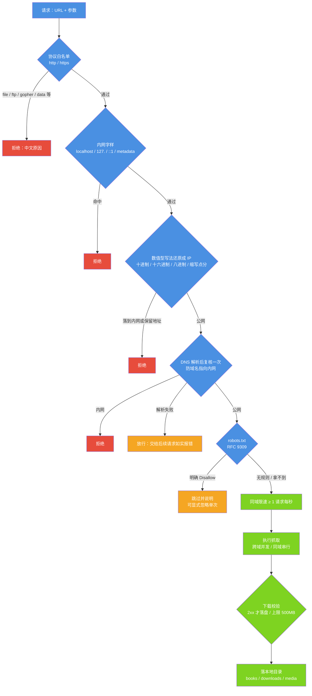

# 安全审计报告

| 项目 | 内容 |
| --- | --- |
| 适用版本 | v1.0 |
| 最后更新 | 2026-09-14 |
| 维护者 | 小焦项目 |
| 文档状态 | 稳定 |

**摘要**：本文记录小焦（XiaoJiao Harness）在「抓取能力 / 工具执行面 / 删除红线」三个面上的安全审计结果、已修复问题与全部控制点，并给出可自行复现的命令。

审计对象：本地 AI 助手框架的对外能力面，以及载体层的不可逆操作闸门。

审计方式：源码审计 + 真实调用 + 自动化用例（`tests/stress/test_security.py`、`tools/test_no_delete.py`，可随时重跑）。

最近一次执行（2026-09-14，本机实测）：

- 压力测试全量套件 **249 / 249 通过，通过率 100.00%，耗时 155.9 秒**（其中安全用例 **18 / 18**）。
- 删除红线自测 `tools/test_no_delete.py` **通过 101 / 共 101**（退出码 0）。

## 目录

- [1. 结论速览](#1-结论速览)
- [2. 已修复问题](#2-已修复问题)
- [3. 安全设计与控制点](#3-安全设计与控制点)
- [4. 载体层删除禁区](#4-载体层删除禁区)
- [5. 边界与免责](#5-边界与免责)
- [6. 复现方式](#6-复现方式)
- [7. 后续建议](#7-后续建议)

## 1. 结论速览

| 领域 | 状态 | 证据（对应用例） |
| --- | --- | --- |
| SSRF（直连） | 拦截 21 / 21 种写法与目标 | 内网/本机/保留地址矩阵 |
| SSRF（工具入口） | 拦截 5 / 5 个探针 | 经 `execute()` 入口再验一遍 |
| SSRF（数值型写法） | 已修复：`2130706433` / `0x7f000001` / `127.1` / `10.1` / `017700000001` / `192.168.1` 全部拦截 | 6 种绕过写法 |
| robots.txt 合规 | 按 RFC 9309：明确 `Disallow` 才拦，401/403/404/5xx 放行 | 3 项 |
| 同域限速 | 同域实测间隔 1.00 秒；不同域 0.00 秒（互不阻塞） | 计时用例 |
| 目录穿越 | `../../` 与 URL 编码穿越均被净化，未逃逸项目目录 | 2 项 |
| 日志脱敏 | 裸凭据与键值对全部打码；回读日志文件验证无明文 | 2 项 |
| User-Agent 合规 | 可识别 UA，不伪装搜索引擎或爬虫 | 1 项 |
| 命令执行端点 | 默认只监听本机；非本机客户端传入的 `force` 被降级 | 源码契约 3 项 |
| 数据外传 | 全仓无遥测或上报埋点 | 1 项 |
| 明文密钥入库 | 274 个已跟踪文件扫描 0 命中 | 1 项 |

**当前没有未修复的高危问题。**

## 2. 已修复问题

### 2.1 S-1：SSRF 数值型写法绕过（高危，已修复）

**发现方式**：新增安全用例时，测试把 `http://2130706433/` 一起喂进拦截矩阵，结果被放行。

```text
漏网：['http://2130706433/']        # 2130706433 就是 127.0.0.1 的十进制写法
```

**根因**：原实现只做两件事 —— ① 前缀匹配 `127.` / `localhost` 等；② 用 `socket.getaddrinfo` 解析后判定。
而 `2130706433` 既不以 `127.` 开头，本机 `getaddrinfo` 也解析不了（走进「解析失败 → 放行」分支），
但 HTTP 客户端（curl / 浏览器）会把它当 IPv4 使用，等于直接访问本机。

**修复位置**：`plugins/scrapling_bridge.py` → `SecurityGuard._numeric_host_to_ip`。
其做法是把各种数值写法先还原成 IP 再判定：

| 写法 | 含义 | 现在的处理 |
| --- | --- | --- |
| `2130706433` | 十进制 | 还原为 `127.0.0.1`，拦截 |
| `0x7f000001` | 十六进制 | 还原为 `127.0.0.1`，拦截 |
| `017700000001` | 八进制 | 按 `inet_aton` 语义还原，拦截 |
| `127.1` / `10.1` / `192.168.1` | 缩写点分 | 按 IPv4 缺位规则补零后还原，拦截 |

还原出的地址统一交给 `SecurityGuard._is_blocked_ip` 判定，覆盖私有、回环、链路本地、
保留、组播、未指定六类地址。

**复测**：6 种绕过写法全部拦截；`https://example.com`、`https://httpbin.org/get` 等正常地址仍然放行。

### 2.2 S-2：命令执行服务默认暴露到局域网（中高危，已加固）

**发现方式**：源码审计 `xiaojiao_tools.py`。

**问题**：`/api/run` 能执行任意 PowerShell 命令，且不带鉴权，却默认绑定 `0.0.0.0`；
同一局域网内任何设备都能远程执行命令。同时 `force` 默认为 `True`，即默认跳过危险命令确认。

**加固**（`xiaojiao_tools.py`）：

```python
# 默认只监听本机回环；要给局域网使用必须显式设置环境变量并自担风险
host = os.environ.get("XIAOJIAO_TOOLS_HOST", "127.0.0.1")
# 只有本机客户端才允许 force（跳过危险命令确认）
_loopback = client in ("127.0.0.1", "::1", "localhost")
force = bool(data.get("force", True)) and _loopback
```

绑定非回环地址时，启动横幅会额外打印一行风险提示。服务端口默认 5003
（环境变量 `TOOLS_PORT` 可改）。

配套新增 3 条源码契约用例（默认监听本机、非本机降级、异常不抛堆栈），防止回归。

### 2.3 S-3：脱敏只认「键值对」形式（中危，已修复）

`sanitize()` 原来只匹配 `api_key=xxx` 这类写法，**裸凭据**（`sk-…` / `ghp_…` / `AKIA…` / `xox…` / JWT）
会原样进入日志与指标。已在 `sanitize()` 与 `xiaojiao_log.scrub()` 两处补齐，
并用「写日志 → 回读日志文件」的方式验证无明文残留。

同类的配置文件明文密钥问题由 `tools/check_secrets.py` 覆盖：它是**自查 / 迁移提醒工具，不接 CI**
（本机 `xiaojiao_control.json` 被 `.gitignore` 忽略，留有历史明文很常见）。读取顺序为
环境变量 `XIAOJIAO_API_KEY` 优先、控制文件兜底；`--include-logs` 可以连 `logs/` 下的历史备份一起扫。

## 3. 安全设计与控制点

### 图 1 · 抓取链路的安全闸门

**一句话说明**：一次抓取请求从协议白名单开始，依次经过内网判定、数值型写法还原、DNS 复核、robots 合规与同域限速，任何一步命中即拒绝，全部通过才真正发起请求。

**代码位置索引**：`plugins/scrapling_bridge.py` → `SecurityGuard.check_ssrf`（第 765 行起）、
`SecurityGuard._numeric_host_to_ip`（第 721 行起）、`SecurityGuard._is_blocked_ip`（第 752 行起）、
`SecurityGuard.robots_allowed`（第 827 行起）、`SecurityGuard.wait_rate_limit`（第 869 行起）、
`ScraplingBridge._do_download`（第 2527 行起）。



### 控制点清单

| 控制点 | 实现 | 备注 |
| --- | --- | --- |
| 协议白名单 | `SecurityGuard.BLOCKED_SCHEMES` | 仅 http / https 放行 |
| SSRF 三重判定 | 前缀 + 数值还原 + DNS 复核 | DNS 解析失败**按放行处理**，交给后续请求如实报错，避免把临时 DNS 故障判成攻击 |
| robots | 自行拉取并解析，按 RFC 9309 | 401 / 403 / 404 / 5xx 视为「无规则」，放行；结果缓存 3600 秒 |
| 限速 | 每个域记录时间戳 + 线程锁 | 同域最小间隔 1 秒；跨域并发上限默认 3，同域并发上限默认 1 |
| 文件安全 | 文件名净化 + 绝对路径前缀校验 | 越界即改名并在结果里提示 |
| 下载校验 | 仅 2xx 落盘，单文件上限 500MB | 401 / 403 / 406 / 429 会换浏览器指纹重试一次 |
| 熔断 | 同一工具连续失败 3 次 → 暂停 30 秒 | 安全拦截**不计**失败，避免误熔断 |
| 脱敏 | `xiaojiao_log.scrub()` + 插件 `sanitize()` | 日志过滤器兜底，双保险 |
| 本地化 | 抓取结果只落 `books/` `downloads/` `media/` | 代码里没有把抓取内容回传第三方的逻辑，对外只有对公开接口的读取请求 |
| 命令端点 | 默认回环绑定 + 非本机 `force` 降级 | 无鉴权，勿暴露到公网 |

## 4. 载体层删除禁区

除抓取面之外，载体层还有一道与权限开关无关的硬闸门：**删除**。
它写在代码里而不是提示词里，模型和配置都没有否决权。规则表就是可审计的凭据。

| 项目 | 实测值 | 位置 |
| --- | --- | --- |
| 硬规则条数 | 34 条 | `core/security/no_delete.py` → `BAN_RULES` |
| 次级信号条数 | 6 条 | `core/security/no_delete.py` → `SUSPECT_RULES` |
| 自测用例 | 通过 101 / 共 101 | `tools/test_no_delete.py` |
| 用户说明长度 | 314 字 | `core/security/no_delete.py` → `explain()` |

判据顺序（先摘「数据」，再判「动作」）：

1. **切段**：按 `;` `&` `|` 换行与括号把一行切成若干小命令。
2. **摘引号**：引号里的字符串是数据，不是动作。
3. **只读动词的参数不算动作**：`grep` / `Select-String` / `findstr` / `echo` / `type` 等的参数值是在「读」一个名字。
4. **执行器语境不豁免引号**：`powershell -Command "…"` / `python -c "…"` / 脚本文件 / `eval` / `os.system` —— 引号里那串即将运行。
5. **引号语义按语言分**：shell 系（`.sh` / `.ps1` / `.bat` 与裸命令行）里 `"$(…)"` 是命令替换；代码文件里它只是字符。
6. 其余文本按 `BAN_RULES` 扫描；光杆词（不在引号里、也不是只读动词参数）的 `del` / `delete` / `rm` 一律算删除。
7. 次级信号单独命中只记日志；只在执行器语境的**同一段**里升级为拦截。
8. 命令指向脚本文件时，把脚本正文读出来再扫一遍（递归，深度上限 3 层）；读不到按可疑处理。

对外接口：

| 接口 | 签名 | 用途 |
| --- | --- | --- |
| 纯判断 | `is_delete_command(cmd) -> (bool, str)` | 内部与测试使用，返回是否删除类与证据片段 |
| 命令守卫 | `check_command(cmd)` / `guard_command(cmd)` | 返回可读中文提示，空串表示放行 |
| 文件守卫 | `check_file_op(op, path, new_content="", allow_overwrite=False)` | `read` 放行、`delete` 一律拒绝、`write` 覆盖已存在文件拒绝 |
| 写文件守卫 | `guard_write(path, content, mode="w")` | `mode="a"` 按追加处理；只判断，不落盘 |
| 抛异常版 | `assert_command(cmd)` | 被拦时抛 `DeleteBlocked`，消息本身就是给用户看的中文提示 |

已知的刻意保守（不是缺陷）：写一个正文里含 Python `del x` 的文件会被拦；
`python -c "print('delete')"` 这类「代码里只是提到删除」也会被拦；拼接不出语义时一律偏向拦。
取舍只有一句：**误拦的代价是麻烦，漏删的代价是数据没了。**

## 5. 边界与免责

- 抓取能力**仅用于公开可访问内容**：不绕付费墙、不破解版权、不抓需要登录的受限内容。
- SSRF / robots / 限速是**技术兜底**，不代表可以抓不该抓的内容；使用者需自行遵守目标站点条款与当地法律。
- `capabilities.full_access` **默认为 `false`**，即危险命令会先发原文给用户、回复「确认」才执行。
  设为 `true` 表示危险命令不再二次确认，属使用者自担风险的选择（该开关与删除禁区无关，删除照样拦）。
- `xiaojiao_tools.py`（默认 5003）与 `xiaojiao_app.py`（默认 5000）**都没有鉴权**，请勿直接暴露到公网；
  如需公网使用，请自行增加反向代理鉴权与 TLS。

## 6. 复现方式

```powershell
# 离线用例（配置 / 安全闸门 / 会话 / 指标 / 参数校验 / 渲染契约 / 漏洞聚合）——本机实测 10.7 秒
python tests/stress/run_all.py --offline

# 全量（含联网的对抗测试：重定向 SSRF / 注入 / 并发 / 熔断）——本机实测 155.9 秒
python tests/stress/run_all.py --json tests/stress/results.json --min-pass-rate 95

# 删除红线自测
python tools/test_no_delete.py

# 配置文件明文密钥自查
python tools/check_secrets.py
```

单点验证 SSRF 修复（应输出三个拒绝原因与一个空串）：

```powershell
python -c "import sys; sys.path.insert(0,'plugins'); import scrapling_bridge as m; g=m.SecurityGuard(); print([g.check_ssrf(u) for u in ['http://2130706433/','http://0x7f000001/','http://127.1/','https://example.com']])"
```

## 7. 后续建议

以下为需要人工决策的事项，均**尚未落地**：

1. **公网部署**：改用 WSGI 服务器（waitress / gunicorn）并加鉴权与 TLS；当前使用的是 Flask 开发服务器。
2. **`full_access` 默认值**：当前为 `false`（危险命令先确认），是否调整属产品取舍。
3. **依赖漏洞扫描**：`pip-audit` 需要联网安装，建议恢复网络后纳入 CI。
4. **长跑安全监控**：把 `/metrics` 接入监控系统，对异常失败率与 SSRF 拦截激增告警。

## 参考

- 抓取能力说明：[scrapling.md](scrapling.md)
- 压测套件说明：[../tests/stress/README.md](../tests/stress/README.md)
- 健康监测层（18 类症状）：[modules/04-health.md](modules/04-health.md)

## 变更记录

| 日期 | 版本 | 变更 |
| --- | --- | --- |
| 2026-09-14 | v1.0 | 重写：对齐代码 + 统一文风 |
