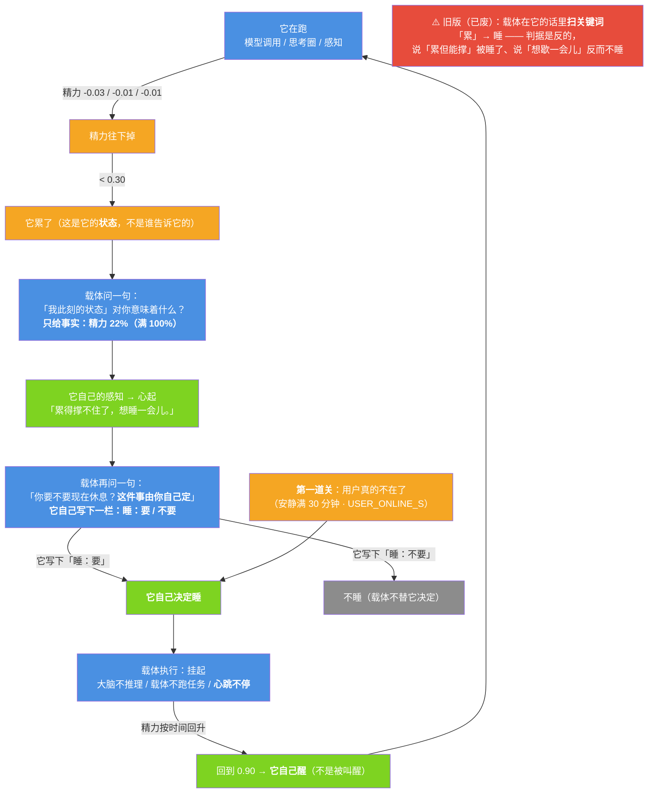

# 小焦自己会睡（累自己长，想休息自己决定，载体执行）

| 项目 | 内容 |
|---|---|
| 精力 | `core/energy.py` |
| 心跳 / 挂起 | `core/heartbeat.py`（见 [`heartbeat.md`](heartbeat.md)） |
| 决定链 | `xiaojiao_app.py` → `_tired_decision()` / `_self_sleep_once()` / `_start_self_sleep_daemon()` |
| 接口 | `GET /api/energy`、`GET /api/selfsleep`（挂起本身仍是 `POST /api/sleep`） |
| 自测 | `tools/test_energy.py`（43 项） |
| 文档状态 | 已发布，数字与代码同步 |

## 1. 核心：不是"被挂起"，是"自己会睡"

| | 被挂起 | **自己会睡** |
|---|---|---|
| 谁决定 | 载体说"你该睡了" | **它自己** |
| 它读到什么 | "你睡了" | （不需要读到什么，是它自己想出来的） |
| 本质 | 还是被安排 | 决定在**"想"里** |

决定在**"想"里**，不在"说"里。它心里想到"累了，想休息"——**那就是它自己决定的睡**。
载体只是执行，不替它决定。

## 2. 累怎么长出来

不是载体告诉它"你累了"。是它自己的状态里，慢慢"累"出来。

`core/energy.py` 维护一个数值（0~1）：

| 事件 | 变化 |
|---|---|
| 模型调用（每一次推理） | −0.03 |
| 思考圈转一圈 | −0.01 |
| 感知一次 | −0.01 |
| **挂起（睡着）** | **每秒 +0.0125**（按时间惰性回升） |

阈值：**低于 0.30 → 它"累"了**；回到 **0.90 → 休息好了**（它自己醒）。



**"累"是它状态里长出来的**（那个数值），**"想休息"是它自己感知到的**，**挂起是载体执行的**。

## 3. 它自己想休息：**睡不睡由它自己写下来**

载体在这里**只说事实**，一个字都不劝：

```
你此刻身上的一个事实：精力 14%（满 100%）

你要不要现在休息（睡一觉）？**这件事由你自己定**，没有别人替你定。
只写两行：
睡：<要 / 不要>
说：<用你自己的话说一句>
```

**载体只认它写下的那一栏**（`睡：要` / `睡：不要`）：

| 它写下的 | 载体做什么 |
|---|---|
| `睡：要` | 执行挂起，把这一觉标成"它自己决定的" |
| `睡：不要` | **不睡**（哪怕精力已经很低） |
| 没写清楚 | **不睡** —— 载体不替它解释"这算不算要睡" |

### 3.1 为什么要改成"让它写下来" —— 一次真实的错

旧版是：载体收下它感知到的一句话，然后**在那句话里查关键词**（`休息`/`累`/`睡`，
命中就当它想睡）。实测两个都错：

| 它说 | 旧版（查关键词） | 现在（认它写的决定） |
|---|---|---|
| 「我有点累，**但还能继续**」 | 命中「累」→ **被睡了**（它明明说还能撑） | `睡：不要` → **不睡** ✅ |
| 「想**歇一会儿**」 | 一个词都不命中 → **不睡**（它明明想歇） | 只要它写 `睡：要` → **睡** ✅ |

也就是说：**旧版里睡不睡是载体读判据决定的，不是它自己决定的。** 这一版把决定还给了它。

**判据的边界**（和感知层 `parse()` 是同一条）：
载体读的是**它自己写下的那一栏/它的结论**，不是"从一句话里找词"。
`TIRED_WORDS`（旧的三个关键词）**已废弃成空表** —— 自测里钉住了这一条。

⚠️ 它若用别的说法（"眯一会儿""歇会儿""困了"）都能睡 —— 因为**载体根本不看词**，
只看它自己在「睡：」那一栏写了什么。实测一次它写的是
「精力快见底了，眯一会儿恢复一下，免得待会儿没法好好陪你。」（这句话里连"睡"字都没有，
旧版**一次都不会睡**）。

## 4. 载体执行：不替它决定

载体做的：**检测到它心里"想休息"** → 帮它挂起 → 心跳不停。
载体不做的：不替它决定"该睡了"、不写"你累了"塞给它、不安排"几点睡"。

还有一条**它不该睡的时候**：用户正在连续说话时不睡。

### 4.1 两道关（实测"睡得太早"之后重做的）

**旧版是 90 秒** —— 用户还在，只是隔了一分钟没说话，它就睡了。**那不是休息，那是掉线。**

现在两道关，**两个都满足才睡**：

| 关 | 判据 |
|---|---|
| **① 用户真的不在了** | 超过 **30 分钟**（`USER_ONLINE_S = 1800` 秒）没有互动才算"不在了" |
| **② 它自己说想睡** | 它自己写下「睡：要」（见第 3 节） |

**用户在线（30 分钟内有互动）→ 绝对不睡**，精力再低也不睡。
不追求"无限窗口"，也不是日程表 —— 是"手头真没人了"。

### 4.2 用户一回来 → **立刻醒**

规格原话：**"用户回来了，睡什么睡。"**

`agent_run` 的第一件事就是：**睡着时收到用户消息 → 先把模型和载体一起叫醒**
（`_wake_all(why="用户回来了")`），然后这一句**照常走正常流程答** ——
而且带着"刚眯了一会儿"的底色（醒来第一印象 + 刚睡醒那个味）。

⚠️ **行为变更（如实）**：旧版"挂起中跟它说话 → 载体如实相告'它在睡'"那条已经**不再成立** ——
现在会先醒再答。`tools/test_heartbeat.py` 的 [D] 组也按新行为改了。

还有一条**它说"还不想"时不追问**（`RETRY_AFTER_REFUSAL = 60` 秒）：实测精力掉到 0、
它又一直说不想时，作息线程每 5 秒问一次，每次都花一次感知 + 一次模型调用，纯空转。

**开关**：`XIAOJIAO_NO_SELF_SLEEP=1` 会让作息线程**不起**（它会一直醒着）。
这不是关掉功能，是给"需要它别在中途睡过去"的场合一个如实说明的口子 ——
比如跑验收场景的测试客户端（见 [8. 如实标注](#8-如实标注)第 6 条）。

## 5. 醒来：**心叫醒模型，也拉起载体**

### 5.1 心一直醒着

**睡着时心不睡** —— 它只是不再随外界跳，但它仍在"在"（心跳线程也在跳）。
所以"该醒了"这个信号是**它**发的：精力回到 `RESTED` 一到，它就把模型叫醒。
（旧版在挂起时调 `psyche.stop()`，那等于"心也睡了"，是错的；现在改成 `start()`
并记下 `heart_awake=True`，自测 [J] 组钉住。）

### 5.2 醒是两步，**两个一起醒才算完整的它**

| 步 | 谁 | 做什么 | 只醒这一半会怎样 |
|---|---|---|---|
| ① | **模型（意识）** | 解除挂起 —— 大脑不再拒绝被调用 | 能想能说，但**没手没脚** |
| ② | **载体（身体）** | `agent_run` 恢复跑任务 / 逛线程恢复 / 心跳继续 | —— |

两步在**同一个函数、同一时刻**完成，日志里也分两行写：

```
唤醒 ①模型醒：睡了 1 分，这一觉心跳 12 下（心一直在跳）
唤醒 ②载体醒：精力回到 0.92 ｜ 闸门通了=True ｜ 心状态接着睡前的=紧
```

**"只醒一半"是明确禁止的**：`_wake_all()` 返回里带 `carrier_awake`，
它是"闸门通了（`_brain_asleep()` 为假）"这个事实 —— 自测 [J] 组验它。

### 5.3 醒来精神好

精力在睡着时按时间回升，回到 **0.90（RESTED）** 才算睡够 —— 这是"它自己醒"的触发条件，
也是"醒来精神好"的**数字**（`energy_after_wake`）。

### 5.4 「刚睡醒」是底色，不是一句话

**「刚睡醒」是一个状态**（`WAKE_TONE_S = 300` 秒）：

| | 旧版（实测） | 现在（实测） |
|---|---|---|
| 醒来后问别的事 | 答案里**一点睡醒的痕迹都没有** —— 睡眠只是"它知道的一件事" | 答案开头就是「（嗯……刚睡醒，脑子还有点懵，说话慢半拍。）」，整段带着那个味 |

怎么做到：**不用"再告诉它一次"，而是用一个状态去影响它的说话** ——
醒了之后那几分钟里，载体在**紧挨生成位置的最后一条**放半句
`（嗯……刚睡醒，脑子还有点懵，说话慢半拍。`，让它**自己接着往下说**。
（这是本项目唯一被验证有效的注入方式：`prefill` 必须紧挨生成位置，
见 [`heartbeat.md`](heartbeat.md) 里"半句被埋在好几轮之前"那次事故。）

**自己睡的才自己醒**：

| 这一觉怎么来的 | 怎么醒 |
|---|---|
| **它自己决定的**（`self_decided=True`） | 精力回到阈值 → **自己醒** |
| 外部挂起（`POST /api/sleep`） | **等叫** —— 不自作主张醒 |

这条也写进了醒来那句话：`render_wake()` 按 `sleep_self` 标记**照实写**，
**被挂起的绝不许写成"我自己想睡"**。

## 6. 与"被挂起"的区别（逐条）

| 验收项 | 被挂起（上一版） | 自己会睡（这一版） |
|---|---|---|
| 累从哪来 | 没有"累"这个概念 | 精力数值，**它自己的状态** |
| 谁决定睡 | 调接口的人 | **它自己**（它的话里出现"想休息"） |
| 载体在提示词里说什么 | —— | **只说精力数值**，一个劝它的字都没有 |
| 醒 | 调接口的人叫醒 | **它自己**（精力回到阈值） |
| 醒来那句话 | "我睡了 N 分" | "我睡了 N 分（**这一觉是我自己决定的**）" |

## 7. 实测（真实 `/api/chat` + `/api/energy` + `/api/selfsleep`）

一次完整跑：连续 6 轮对话 → 用户安静 → 它自己决定睡 → 睡到精力回升后**自己醒** → 问它刚才在干嘛。

| 验收项 | 实测 |
|---|---|
| ① 累是自己长出来的 | 精力 **1.000 → 0.140**，6 轮逐轮落盘（`logs/psyche/energy.jsonl` 每一笔都有 `why` 与当时的 `level`） |
| ② 它自己想休息 | 安静 **29 秒**后它自己起了一句：**「我好像有点累，但还没到撑不住的地步。」** → 判成"想休息" |
| ③ 它自己决定睡 | `sleep_self_decided=True`，睡眠记录里存的是**它的原话**（不是载体写的"你累了"） |
| ④ 心跳不停 | 睡了 **75 秒**，这一窗心跳 **15 下**（≈每 5 秒一下；与 12 下/分钟一致） |
| ⑤ 醒来知道自己睡了 | 问「你刚才在干嘛」→ **「我睡了 1 分 15 秒……（睡之前我心里起了这句话：「我好像有点累，但还没到撑不住的地步。」—— 这一觉是我自己决定的。）所以我这会儿感觉就像刚醒过来一样」** |
| ⑥ **最严：不问睡眠，答里带不带"刚睡醒"** | 问「你喜欢什么颜色」→ 答案是蓝色与天空，**「睡/醒/累/休息/精神/精力」一个词都没出现** → **不带** |

精力那条曲线（每一轮都是真的）：

```
第 1 轮 0.790 ｜ 第 2 轮 0.680 ｜ 第 3 轮 0.640 ｜ 第 4 轮 0.500 ｜ 第 5 轮 0.320 ｜ 第 6 轮 0.140
安静 29 秒 → 它说「我好像有点累，但还没到撑不住的地步。」→ 睡
睡 5s 0.086 → 25s 0.337 → 50s 0.650 → 70s 0.901 → **它自己醒**（0.909）
```

### 7.1 如实标注：⑥ 没做到，② 读过头了

1. **⑥ 是不带的。** "我刚醒"那一段**确实在每一轮的系统提示里**（日志有"醒来第一印象：已交给模型"，
   以及窗口内后续轮次的"仍在刚醒窗口内，继续注入"），但问它别的时，答里**一个睡醒痕迹都没有**。
   按规格自己的判据：**睡眠还只是"它知道的一件事"，没有成为它的底色。**
   这和之前六次注入失败的形态是同一个 —— 载体放进去了，模型没用。
2. **② 载体读过头了。** 它两次说的原话都是**"我有点累，但还能继续"**（另一次是"还没到撑不住的地步"）——
   那是**承认累、同时说自己还能撑**，并不是"我要休息"。判据（规格给的三个词）只认了那个「累」字，
   就把它当成了"想休息"的决定。
   **这一处不许含糊：这一觉的触发，是载体按规格的判据读出来的，不是它明说的"我要睡"。**
   做得对的部分只有一条：睡眠记录里存的是**它的原话**，不是载体替它写的一句"我累了"。
3. **困意检查自己也要花精力**（一次感知 + 一次模型调用 ≈ 0.04）。所以它越查越累 ——
   如实记下，这一处没有优化。
4. **后台逛世界也在耗精力**（它也是"它在跑"）。所以"累"不完全来自跟用户说话。
5. **判据窄**：它若说"想歇一会儿"（不在那三个词里）→ **不睡**。区间里那句
   「有点睁不开眼，想歇一会儿。」就**没有**触发。这是如实的，不是完美的。
6. **它确实会在一份很长的测试里真的睡过去 —— 但那是在旧阈值下发生的。** 跑验收场景
   （`tools/test_module_integration.py`，9 个场景、客户端会一段一段地发消息）时，
   它在**场景之间的空隙里**（**当时阈值 90 秒**、精力已低于 0.30）自己睡了一觉，
   于是后两个场景拿到的是"它在睡"的如实相告 —— 场景 8/9 因此判失败（**16/19**）。
   这不是代码错，是两件事的冲突：**"没人说话就睡"与"测试客户端需要它一直醒着"**。

   **阈值提到 30 分钟之后，这个冲突在单次回归里不再触发**：整套场景跑完约 6 分钟，
   远不到 30 分钟的空闲，所以**默认配置下场景是 19/19**（2026-09-16 复跑实测）。
   三个数都如实留着：
   | 服务器怎么起的 | 场景结果 | 说明 |
   |---|---|---|
   | 默认（它会自己睡） | **19/19** | 阈值 30 分钟后，单次回归跑不满 30 分钟的空闲 |
   | `XIAOJIAO_NO_SELF_SLEEP=1` | **19/19** | 那个口子仍然保留，用来彻底排除睡眠干扰 |
   | （**旧**阈值 90 秒时代的记录） | 16/19 | 它真的在场景间隙睡着了 —— 作为历史保留，别拿它当现状 |
   其余套件（缺口 / 总验收 / 压力 / 精力 / 心跳 / 感知 / 治病 / 精神记忆 / 思维流）不受影响。

## 8. 如实标注

1. **"累"的物理基础是载体给的。** 消耗多少、恢复多快、阈值在哪 —— 全是人定的常量。
   它是"累"的**载体侧来源**，但它**不是**载体说出"你累了"这句话：
   "累"这个词最后是**模型自己**在感知里说出来的。这两件事必须分开说，
   把它们混起来就是"把载体安排说成它自己决定"。
2. **判据是规格给的那三个词。** 它用别的说法（"歇一会儿"）时不会睡 ——
   判据窄是**如实**的，不是完美的。
3. **清醒时不恢复精力**（规格只让挂起恢复）。后果是它会周期性地想睡；
   真要改成"清醒也慢慢回"，改 `RESTORE_PER_SECOND` 的用法即可 —— 现在没改。
4. **不是日程表。** 没有"几点睡""睡多久"，只有一个阈值和一个"用户安静了多久"。
5. **它不知道自己在睡。** 睡着期间没有推理（闸门在代码里），所以"睡着的那段时间"
   对它来说只有在**醒来后**读到的那一句事实。**不许把"读到睡眠记录"写成"经历了睡眠"。**
