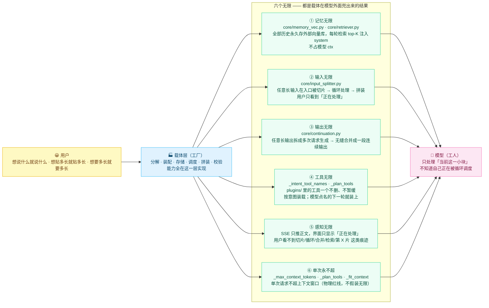

# 六个无限 · 总览图

> 一张图看清「载体优先」这一版重构的六个目标。核心一句话：**模型是工人，载体是工厂** ——
> 模型永远只处理「当前这一小块」，六个"无限"全部由载体在模型**外面**兜出来。

**怎么读这张图**：左边是用户，右边是模型，中间那一整块是载体层。图里没有任何一条边是"用户直接连模型"——
用户能感知到的"无限"，全部是载体在模型外面用循环、外部存储和多次请求兜出来的。

- ①③ 是**同一类手法**：单次装不下 / 单次给不完，就拆成多次，只是分别发生在输入侧和输出侧。
- ④⑥ 是**一对约束**：工具能力要"一个不少"（④），但一轮里塞不下全部工具 schema（77 个 = 13891 token，占
  19224 上限的 72%），所以只能在"哪些工具这一轮真发出去"上做取舍（⑥）。
- ⑤ 不是独立机制，而是①~④ 的**对外表现要求**：循环可以有，痕迹不能有。

> 配套阅读：[six-infinity.md](../six-infinity.md)（定义 / 痛点 / 实现 / 验收数据 / 已知局限）、
> [02-carrier-layer.md](02-carrier-layer.md)（载体层内部结构）。
