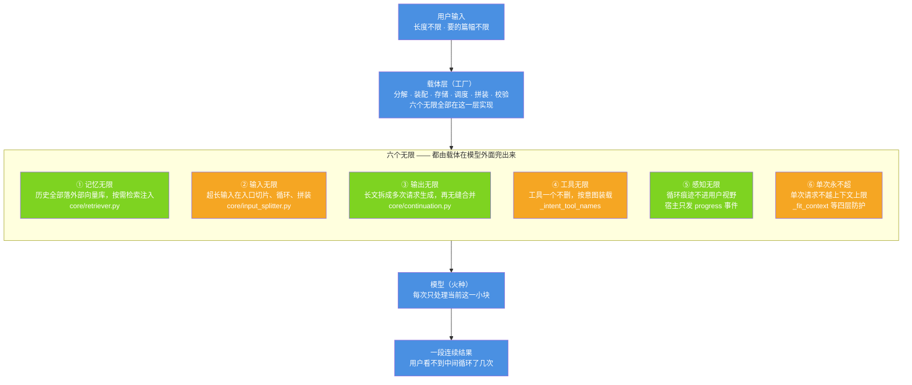

# 图 1 · 六个无限总览：载体在模型外面兜出六个无限

| 项 | 内容 |
| --- | --- |
| 适用版本 | v1.0 |
| 最后更新 | 2026-09-14 |
| 维护者 | 小焦项目 |
| 文档状态 | 稳定 |

**摘要**：这张图标出"载体优先"重构的六个目标，以及它们与模型的分工边界——模型只处理当前这一小块，
六个"无限"全部由载体在模型外面用循环、外部存储和多次请求实现。

配套定义与验收数据见 [six-infinity.md](../six-infinity.md)。

## 1. 图册约定

本目录 7 篇文档共用同一套术语与配色，术语与主文档 [six-infinity.md](../six-infinity.md) 一致。

### 1.1 配色

| 颜色 | 含义 |
| --- | --- |
| `#4A90E2` | 主链路节点（入口、载体、模型、出口） |
| `#7ED321` | 已落地且构成不变量 |
| `#F5A623` | 已落地但依赖参数或启发式判据 |
| `#E74C3C` | 未落地（设计）或红线（越界即返回错误） |

### 1.2 术语

| 术语 | 含义 |
| --- | --- |
| 载体 | `xiaojiao_app.py` 与 `core/` 组成的编排层，负责全部"该不该做 / 做几步 / 算不算数"的判断 |
| 模型（火种） | 可替换的语言模型，只接收一段 prompt 并输出一段文本 |
| 切片 | 把超长输入按段落/句子边界切成每片 ≤ 5000 token 的单元 |
| 段 | 续写时单次请求产出的正文片段，段号从 1 开始 |
| 接缝 | 相邻两段拼接的位置，用最长重叠裁剪与整句去重处理 |

### 1.3 七张图

| 图 | 文件 | 讲什么 |
| --- | --- | --- |
| 图 1 | 本文 | 六个无限总览与分工边界 |
| 图 2 | [02-carrier-layer.md](02-carrier-layer.md) | 载体层内部结构（八个职责） |
| 图 3 | [03-data-flow.md](03-data-flow.md) | 一次 `agent_run` 的五个阶段 |
| 图 4 | [04-output-continuation.md](04-output-continuation.md) | 输出无限：多次请求 + 无缝合并 |
| 图 5 | [05-input-splitter.md](05-input-splitter.md) | 输入无限：入口切片 + 循环 + 拼装 |
| 图 6 | [06-memory-retrieval.md](06-memory-retrieval.md) | 记忆无限：写入路径与读取路径 |
| 图 7 | [07-tool-on-demand.md](07-tool-on-demand.md) | 工具无限：按意图装载 + 点名即下轮装载 |

## 2. 图 1 · 六个无限总览

**一句话说明**：用户与模型之间不存在直连的边，用户感知到的"无限"全部由载体的循环、外部存储和多次请求兜出来。

## 3. 代码位置索引

| 节点 | 代码位置 |
| --- | --- |
| 载体层入口 | `xiaojiao_app.py` → `agent_run`（第 6725 行）；HTTP 入口 `/api/chat/stream` |
| ① 记忆无限 | `core/embedder.py`、`core/memory_vec.py`、`core/retriever.py`；宿主侧 `_remember_turn`（第 2012 行）、`_retrieve_memory`（第 1946 行） |
| ② 输入无限 | `core/input_splitter.py` → `split_task` / `split_input` / `process_long_input`；宿主侧 `_needs_input_split`（第 2215 行）、`_process_long_input`（第 2223 行） |
| ③ 输出无限 | `core/continuation.py` → `generate_unlimited`（第 756 行）；宿主侧 `_needs_continuation`（第 2061 行）、`_generate_long`（第 2074 行） |
| ④ 工具无限 | `xiaojiao_app.py` → `_detect_intent`（第 5895 行）、`_intent_tool_names`（第 5847 行）、`_tool_index`（第 5998 行）、`_plan_tools`（第 6066 行）、`_build_tools`（第 1159 行） |
| ⑤ 感知无限 | `xiaojiao_app.py` → `_on_progress`（第 8686 行）、`_on_chunk`（第 8674 行）；`core/input_splitter.py` → `process_long_input` 的 `on_progress` 参数 |
| ⑥ 单次永不超 | `xiaojiao_app.py` → `_estimate_tokens`（第 6105 行）、`_max_context_tokens`（第 6122 行）、`_fit_context`（第 6154 行）、`_plan_tools`；实测脚本 `tools/check_prompt_size.py` |

## 4. 六个无限怎么分类

图中的颜色不是装饰，它标的是落实程度：

| 类别 | 图 1 中对应 | 落实程度 |
| --- | --- | --- |
| 不变量 | ① ③ ⑤ | 已有确定性单测或代码层强制，见主文档「验收标准与实测数据」 |
| 依赖参数/启发式 | ② ④ ⑥ | 机制已落地，但判据是启发式的（切片阈值、意图识别、token 估算），边界见各篇「边界与限制」 |

两组之间的关系：

- **② 与 ③ 是同一类手法**：单次装不下、单次给不完，就拆成多次，分别发生在输入侧与输出侧。
- **④ 与 ⑥ 是一对约束**：能力要一个不少（④），但一轮里装不下全部工具 schema——
  实测全部 77 个工具的 schema 占 13891 token，是可用上限 19224 的 72%——所以只能在"这一轮真发哪几个"上取舍（⑥）。
- **⑤ 不是独立机制**，而是 ②③ 的对外表现要求：循环可以有，痕迹不能有。两条路各自的落法不同——
  输出侧的段号写在提示词里、正文一侧只给任务与上下文，并由提示词明令不要重抄与另起标题；
  输入侧的 `on_progress(done, total)` 带片号，但宿主 `_on_progress` 把它丢掉、只推 `{"type":"progress"}`。
  详见 [04-output-continuation.md](04-output-continuation.md) 与 [05-input-splitter.md](05-input-splitter.md) 的边界一节。

## 5. 边界与限制

| 边界 | 说明 |
| --- | --- |
| 模型不参与调度 | 模型不知道自己被循环调度，因此换模型不改这套逻辑；代价是"要不要继续"只能由载体的规则判断 |
| 单次上限是物理约束 | 可用上限由 `_max_context_tokens()` 算出：`brain.llama.ctx`（本地 20224）减 `context_safety_margin`（默认 1000）= 19224；它不是可优化的软指标 |
| ⑤ 的边界 | 前端确实看不到"第 X/Y 片"（宿主只推 `{"type":"progress"}`），但切片提示词里会写明"全文共 N 段"，模型仍有极小概率在正文里复述段号 |
| 数字口径 | 本文引用的 token 数字来自 `python tools/check_prompt_size.py`，会在每次复测中变动；以复测输出为准 |

## 6. 相关阅读

- [six-infinity.md](../six-infinity.md)：六个无限的定义、实现与验收数据
- [02-carrier-layer.md](02-carrier-layer.md)：载体层内部结构
- [03-data-flow.md](03-data-flow.md)：一次请求的完整数据流

## 变更记录

| 日期 | 版本 | 变更 |
| --- | --- | --- |
| 2026-09-14 | v1.0 | 重写：对齐代码 + 统一文风 |
