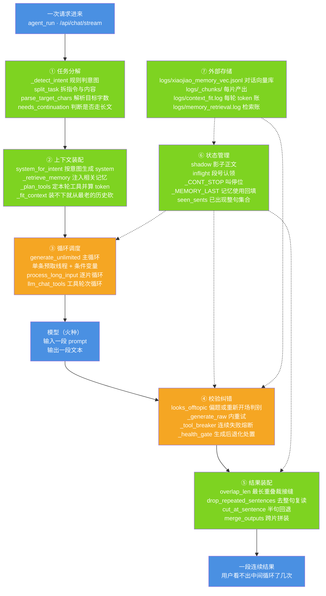

# 图 2 · 载体层内部结构：八个职责

| 项 | 内容 |
| --- | --- |
| 适用版本 | v1.0 |
| 最后更新 | 2026-09-14 |
| 维护者 | 小焦项目 |
| 文档状态 | 稳定 |

**摘要**：把"载体层"拆开看——一次请求进来后，八个职责分别在哪些文件与函数里落地，
以及其中哪两个是六个无限的地基。

配色与术语约定见 [01-overview.md](01-overview.md) 的「图册约定」。

## 1. 图 2 · 八个职责与它们的落点

**一句话说明**：主链路上的每一步都对应代码里真实存在的函数或文件，虚线连的是不参与主流程、
但被主流程读写的那两格——状态管理（⑥）与外部存储（⑦）。

## 2. 代码位置索引

| 职责 | 代码位置 | 落实程度 |
| --- | --- | --- |
| 入口 | `xiaojiao_app.py` → `agent_run`（第 6725 行）、`/api/chat/stream` | 已落地 |
| ① 任务分解 | `_detect_intent`（第 5895 行）、`core/input_splitter.py` → `split_task`（第 126 行）、`core/continuation.py` → `parse_target_chars`（第 120 行）、`needs_continuation`（第 1353 行） | 判据为规则与启发式 |
| ② 上下文装配 | `system_for_intent`（第 6040 行）、`_retrieve_memory`（第 1946 行）、`_plan_tools`（第 6066 行）、`_fit_context`（第 6154 行） | 已落地 |
| ③ 循环调度 | `core/continuation.py` → `generate_unlimited`（第 756 行）；`core/input_splitter.py` → `process_long_input`（第 187 行）；`xiaojiao_app.py` → `llm_chat_tools`（第 3339 行） | 已落地 |
| ④ 校验纠错 | `core/continuation.py` → `looks_offtopic`（第 264 行）、`_generate_raw`（第 812 行，内层重试）；`xiaojiao_app.py` → `_tool_breaker`（第 3554 行）、`_health_gate`（第 6536 行） | 已落地 |
| ⑤ 结果装配 | `core/continuation.py` → `overlap_len`（第 145 行）、`drop_repeated_sentences`（第 181 行）、`cut_at_sentence`（第 161 行）；`core/input_splitter.py` → `merge_outputs`（第 168 行） | 已落地 |
| ⑥ 状态管理 | `core/continuation.py` 的 `shadow` / `inflight` / `seen_sents` / `carry`；`xiaojiao_app.py` → `_CONT_STOP`（第 2047 行）、`_MEMORY_LAST`（第 1935 行） | 已落地 |
| ⑦ 外部存储 | `core/memory_vec.py` → `_VS_PATH`（`logs/xiaojiao_memory_vec.jsonl`）、`core/input_splitter.py` → `save_chunk`（第 152 行，落 `logs/_chunks/`）、`xiaojiao_app.py` → `_CONTEXT_FIT_LOG`（第 6102 行）、`core/retriever.py` → `_LOG_PATH` | 已落地 |
| 出口装配 | `_on_chunk`（第 8674 行，SSE `chunk` 事件）、`_on_delta`（第 8692 行，SSE `delta` 事件） | 已落地 |

## 3. 为什么把状态与存储单独画出来

这两格是六个无限的地基，也是最容易在改代码时漏掉的部分。

- **没有 `shadow`（影子正文）就没有输出无限**。预取下一段时必须知道"已提交正文 + 池里已生成但还没被取走的部分"，
  否则第 N+1 段的衔接锚点与去重基准都是残缺的，拼出来会重句。第 3 步实测撞上过：段号出现 `[1,2,2]`，
  根因是主循环的串行兜底与预取线程同时产出了同一个段号。现在用 `inflight` 认领 + `Condition` 钉死，
  见 [04-output-continuation.md](04-output-continuation.md)。
- **没有外部存储就没有记忆无限**。对话全部落在 `logs/xiaojiao_memory_vec.jsonl`（一行一条、append-only），
  进程重启不丢；每片产出落在 `logs/_chunks/`，进度可核对、可续跑。
- **`_fit_context` 是"单次永不超"的最后一道闸**。system 与本轮问题永远保留，历史从最老的一端开始丢，
  并且把 tools schema 的 token 一起算进总量（漏算它就会出现"裁完了还是超限"）。

## 4. 边界与限制

| 边界 | 说明 |
| --- | --- |
| 判据是启发式 | ① 里的意图识别是纯规则字符串判据，认不出来一律兜底成 `chat`；`needs_continuation` 默认门槛为 800 字 |
| 状态不持久化 | `shadow`、`inflight`、`seen_sents`、`carry` 都是进程内内存状态，进程重启后这一轮的续写进度不恢复；跨进程可核对的是 `logs/_chunks/` 里的落盘产出 |
| 存储是运行产物 | `logs/` 已被 `.gitignore` 忽略，干净克隆里不存在这些文件，它们由运行过程生成 |
| 校验纠错不保证质量 | ④ 只能拦住可机械判定的问题（跑题、空输出、复读、连续失败）；内容正确性不在它的判定范围内 |

## 5. 相关阅读

- [03-data-flow.md](03-data-flow.md)：一次请求的完整数据流（本图的主链路展开）
- [six-infinity.md](../six-infinity.md)：六个无限各自的定义与验收数据
- [../architecture-diagrams.md](../architecture-diagrams.md)：其它视角的载体结构图

## 变更记录

| 日期 | 版本 | 变更 |
| --- | --- | --- |
| 2026-09-14 | v1.0 | 重写：对齐代码 + 统一文风 |
