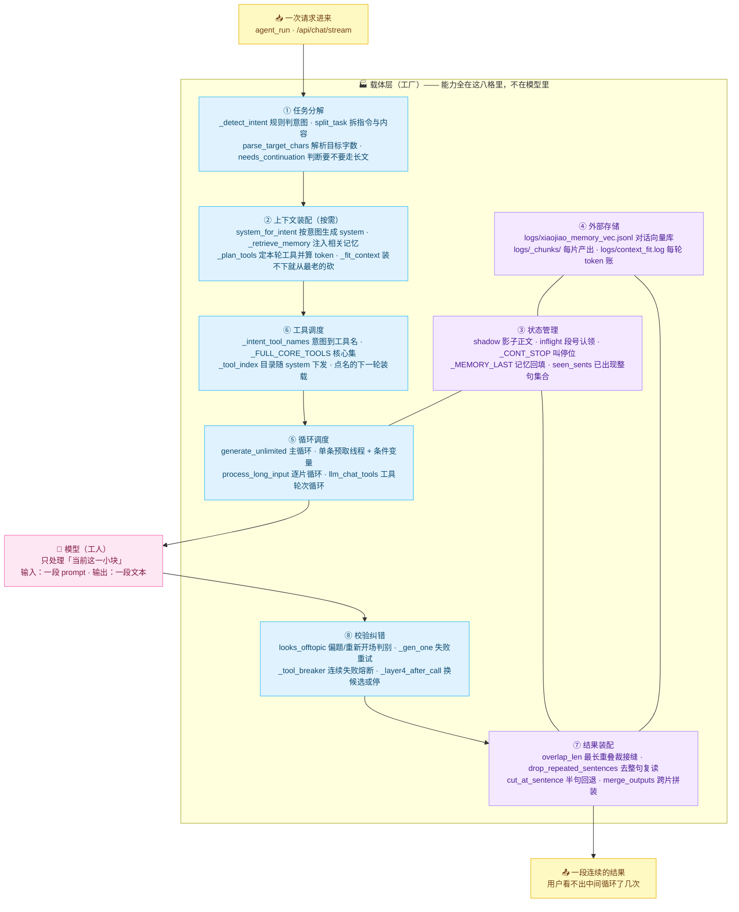

# 载体层内部结构图

> 「工厂」里到底有哪几个车间。八个职责全部落在 `xiaojiao_app.py` 与 `core/` 里，图上每个框都标了
> **真实存在的函数名或文件路径** —— 没有一个是规划中的概念。

**为什么把"状态"和"存储"单独画出来**：这两个车间是六个无限真正的地基，也是最容易漏掉的部分。

- **没有 `shadow`（影子正文）就没有输出无限**：预取下一段时必须知道"已提交正文 + 池里已生成但还没被取走的部分"
  是什么，否则第 N+1 段的衔接锚点和去重基准都是残缺的，拼出来会重句。第 3 步实测撞上过——
  chunk 编号出现 `[1,2,2]`，根因就是主循环的串行兜底和预取线程同时产出了同一个段号。
- **没有外部存储就没有记忆无限**：对话全部落在 `logs/xiaojiao_memory_vec.jsonl`（一行一条、append-only），
  进程重启不丢；每片的产出落在 `logs/_chunks/`，进度可核对、可续跑。
- **`_fit_context` 是"单次永不超"的最后一道闸**：system 与本轮问题永远保留，历史从最老的一端开始丢，
  并且把 tools schema 的 token 一起算进去（漏算它就会出现"裁完了还是超限"）。

> 配套阅读：[03-data-flow.md](03-data-flow.md)（一次请求的完整数据流）、
> [six-infinity.md](../six-infinity.md)（六个无限各自的验收数据）。
