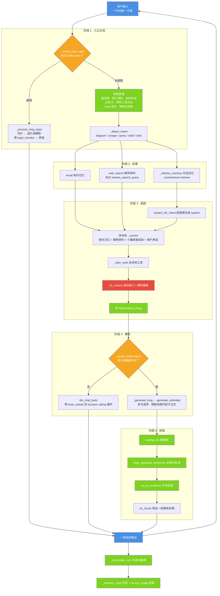

# 图 3 · 一次请求的数据流：入口 → 检索 → 装配 → 模型 → 拼装 → 输出

| 项 | 内容 |
| --- | --- |
| 适用版本 | v1.0 |
| 最后更新 | 2026-09-14 |
| 维护者 | 小焦项目 |
| 文档状态 | 稳定 |

**摘要**：一次 `agent_run` 从进到出的完整路径，以及五个阶段各自对应的函数与判据。

配色与术语约定见 [01-overview.md](01-overview.md) 的「图册约定」。

## 1. 图 3 · 五个阶段

**一句话说明**：入口的两次分流（超长输入、用户要长文）决定这一轮走哪条路，中间的装配阶段是
所有路都必须经过的咽喉，红色那一格是物理上限——它不可优化，只能靠取舍服从。

## 2. 代码位置索引

| 节点 | 代码位置 |
| --- | --- |
| 入口 | `xiaojiao_app.py` → `agent_run`（第 6725 行） |
| 阶段 1 分流 | `_needs_input_split`（第 2215 行）、`_process_long_input`（第 2223 行）、`_detect_intent`（第 5895 行） |
| 规则直通 | 漏洞表（`detect_vulnerability_query`）、资产测绘（`asset_intel_status`）、当前时间（`agent_run` 内置时间直答）、公网 IP（`_asks_own_ip` / `_asks_net_ip`）、零参工具点名（`_noarg_named_tool`，第 4380 行）、shell 原文（`_looks_like_shell_command`）、带网址抓取（`_scrape_direct`） |
| 阶段 2 检索 | `recall`（知识记忆）、`_retrieve_memory`（第 1946 行）、`resolve_search_query` + `web_search` |
| 阶段 3 装配 | `system_for_intent`（第 6040 行）、`_plan_tools`（第 6066 行）、`_fit_context`（第 6154 行）、`_CONTEXT_FIT_LOG`（第 6102 行） |
| 阶段 4 模型 | `_needs_continuation`（第 2061 行）、`_generate_long`（第 2074 行）、`llm_chat_tools`（第 3339 行） |
| 阶段 5 拼装 | `core/continuation.py` → `overlap_len`（第 145 行）、`drop_repeated_sentences`（第 181 行）、`cut_at_sentence`（第 161 行）；SSE 出口 `_on_chunk`（第 8674 行） |
| 出口回写 | `_remember_turn`（第 2012 行）、`_memory_used`（第 1990 行）、`core/retriever.py` → `record_usage`（第 303 行） |

## 3. 阶段 3 的实测开销

数据来自 `python tools/check_prompt_size.py`（可用上限 `_max_context_tokens()` = 19224）：

| 意图 | system | tools | 本轮 | 合计 | 占上限 | 本轮装载工具 |
| --- | --- | --- | --- | --- | --- | --- |
| chat | 284 | 381 | 4 | 693 | 4% | 3 个 |
| scrape | 2041 | 2576 | 9 | 4650 | 24% | 10 个 |
| diagram | 2632 | 2850 | 8 | 5514 | 29% | 18 个 |
| query | 1789 | 884 | 5 | 2702 | 14% | 5 个 |
| shell | 1727 | 581 | 4 | 2336 | 12% | 3 个 |
| full | 5678 | 2069 | 7 | 7778 | 40% | 10 个 |

全部 77 个工具的 schema 合计 13891 token，占上限的 72%——这是阶段 3 必须在"这一轮发哪几个"上取舍的原因，
展开见 [07-tool-on-demand.md](07-tool-on-demand.md)。

上表的「合计」是固定开销（system + tools + 本轮 + 消息外壳），不含历史与检索到的记忆；
真实一轮的数字由 `_fit_context` 写进 `logs/context_fit.log`。

## 4. 四个容易看漏的点

1. **入口分流是防错，不是优化**。实测过的缺陷：问"我的公网 IP"若交给模型答，它会说"我通过 net_ip 查了"，
   内容却是模板占位符；换个问法它会直接编一个 IP 出来。"查出来的东西"不由模型转述，所以规则能判的一律直通。
2. **记忆注入点放在 system 拼好之后、`_plan_tools` 之前**。这样注入的记忆会被算进 token 预算，
   不会出现"注入完了才发现超限"的老毛病：先裁剪、后拼注入内容时，裁剪报告写"合计 18926 / 上限 19000"，
   实际请求却是 19898，照样超限。
3. **输出侧两条路共用同一套 system**。`_generate_long` 拿到的就是阶段 3 装好的那份 system
   （含按意图装载的工具目录），所以长文续写与普通对话的规则、记忆、工具完全一致。
4. **落库发生在最后**。只有答案出来了才知道检索到的记忆有没有被用上，所以"是否使用"的回填放在这一轮结束时
   （写 `logs/memory_retrieval.log`）——这是"使用率"指标的唯一依据，不能由生成侧自评。

## 5. 边界与限制

| 边界 | 说明 |
| --- | --- |
| 阶段 1 只分两路 | 判据是"输入是否超过 5000 token"（`CAP.input_split_threshold` 可覆盖）；超长输入一旦进入后面的链，无论怎么裁都装不下，所以必须在入口分流 |
| 直通路径不经过模型 | 直通结果由载体直接返回，`online` 标记为 True；代价是这些路径的输出格式固定，不走模型的润色 |
| 阶段 3 的取舍顺序是死的 | system 与本轮问题永远保留，只能从最老的历史开始丢；`_fit_context` 的默认滑动窗口是最近 10 轮（`CAP.history_window_rounds` 可覆盖） |
| token 是估算值 | `_estimate_tokens` 用"中文 ×1.5 + 其他 ÷3"近似，宁可高估也不低估；实测校准记录见该函数注释 |

## 6. 相关阅读

- [02-carrier-layer.md](02-carrier-layer.md)：本图主链路各步的职责划分
- [04-output-continuation.md](04-output-continuation.md)：阶段 4 → 5 的细节
- [05-input-splitter.md](05-input-splitter.md)：阶段 1 的切片细节
- [06-memory-retrieval.md](06-memory-retrieval.md)：阶段 2 与出口回写的细节

## 变更记录

| 日期 | 版本 | 变更 |
| --- | --- | --- |
| 2026-09-14 | v1.0 | 重写：对齐代码 + 统一文风 |
