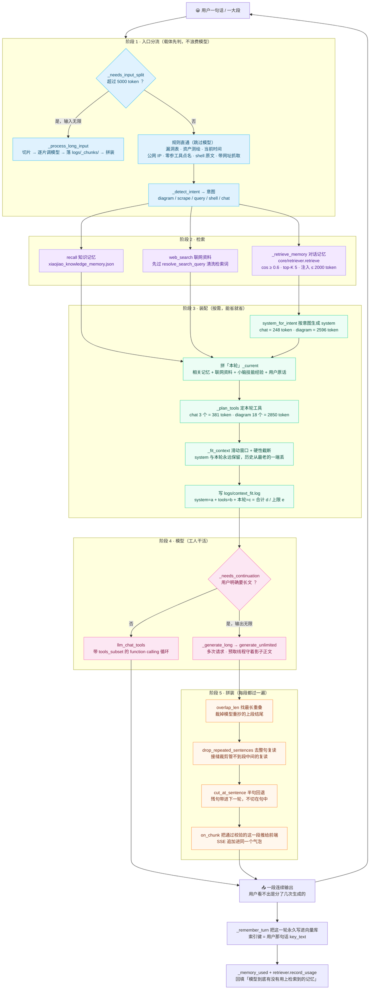

# 数据流向图：请求 → 检索 → 装配 → 模型 → 拼装 → 输出

> 一次 `agent_run` 从进到出的完整路径。左侧标了阶段，每个框里是**真实函数名**；
> 带数字的框是实测得出的固定开销（数据来自 `python tools/check_prompt_size.py`）。

**几个容易看漏的点**：

- **阶段 1 的"直通"不是优化，是防错**。实测过的真实缺陷：问"我的公网 IP"交给模型答，它嘴上说"我通过 net_ip
  查了"，内容却是模板占位符；换个问法它**编了一个 IP** 出来。"查出来的东西"最不该由模型转述，所以规则能判的一律直通。
- **记忆注入点放在 system 拼好之后、`_plan_tools` 之前**。这样注入的记忆会被算进 token 预算，
  不会再出现"注入完了才发现超限"的老毛病——第 1 步实测踩过：先裁剪、后拼注入内容，裁剪报告写
  "合计 18926 / 上限 19000"，实际请求却是 19898，照样超限。
- **输出侧的两条路共用同一套 system**。`_generate_long` 拿到的就是阶段 3 装好的那份 system
  （含按意图装载的工具目录），所以长文续写和普通对话的规则、记忆、工具完全一致。
- **落库发生在最后**。只有答案出来了才知道检索到的记忆有没有被用上，所以"是否使用"的回填放在这一轮结束时
  （`logs/memory_retrieval.log`）——这是"使用率"指标唯一的依据，不能自己给自己打高分。

> 配套阅读：[04-output-continuation.md](04-output-continuation.md)（阶段 4→5 的细节）、
> [05-input-splitter.md](05-input-splitter.md)（阶段 1 的切片细节）。
