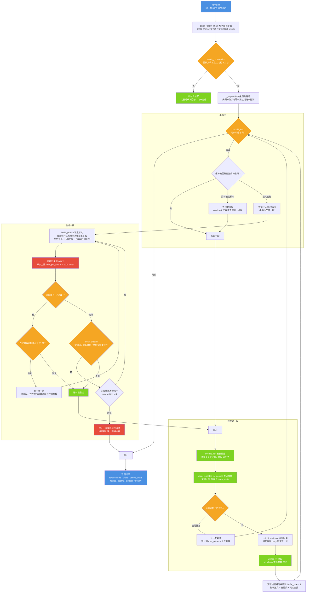

# 图 4 · 输出无限：多次请求 + 无缝合并

| 项 | 内容 |
| --- | --- |
| 适用版本 | v1.0 |
| 最后更新 | 2026-09-14 |
| 维护者 | 小焦项目 |
| 文档状态 | 稳定 |

**摘要**：载体把一份长文拆成多次请求，再把每次的产出无缝接成一段连续输出；
这张图给出整条控制流、停止条件的全集，以及三道合并工序。

配色与术语约定见 [01-overview.md](01-overview.md) 的「图册约定」。

## 1. 图 4 · 续写与合并的控制流

**一句话说明**：一份长文由"取段 → 生成 → 校验 → 合并 → 提交"这个循环反复产出一段，
生成侧只有一条线程（预取线程），主循环只做合并与提交——用户看到的是一段连续文本。

## 2. 代码位置索引

全部实现位于 `core/continuation.py`，宿主侧只有一层薄封装：

| 节点 | 代码位置 |
| --- | --- |
| 入口与控制流 | `generate_unlimited`（`core/continuation.py` 第 756 行） |
| 是否走续写 | `needs_continuation`（第 1353 行）；宿主 `_needs_continuation`（`xiaojiao_app.py` 第 2061 行）、`_generate_long`（第 2074 行） |
| 目标字数 | `parse_target_chars`（第 120 行） |
| 主题关键词 | `_keywords`（第 236 行） |
| 装上下文 | `build_prompt`（第 697 行）；段号标记 `_mark`（第 709 行）；衔接锚点 `_TAIL_CTX = 200`（第 73 行） |
| 生成与校验 | `_generate_raw`（第 812 行）、`looks_offtopic`（第 264 行）、`_gen_one`（第 988 行） |
| 停止条件 | 用户叫停：`should_stop`；模型声明完成：`DONE_MARK`（第 72 行）+ `_DONE_MIN_RATIO = 0.85`（第 81 行）；段数上限：第 1229 行（2000 段）；参考篇幅保护：`looks_concluded`（第 691 行）、0.8 倍自然结束与 1.05 倍收口（第 1220、1226 行） |
| 预取 | `_prefetch`（第 1005 行）；影子正文 `shadow`（第 806 行）、`inflight`（第 808 行） |
| 合并 | `_merge`（第 1042 行）、`overlap_len`（第 145 行，`_OVERLAP_WIN = 800` / `_MIN_OVERLAP = 8`）、`drop_repeated_sentences`（第 181 行）、`drop_repeated_paragraphs`（第 202 行）、`cut_at_sentence`（第 161 行） |
| 推流 | `on_chunk` 回调（第 1191 行）；宿主 `_on_chunk`（`xiaojiao_app.py` 第 8674 行） |
| 收尾与定稿 | 补结尾 `CLOSING_ASK`（第 670 行）、`clean_ending`（第 652 行）、`strip_meta_ending`（第 426 行）、`balance_quotes`（第 386 行）、`unify_names`（第 564 行）、`renumber_units`（第 332 行） |
| 返回值 | 第 1343 行的 dict：`text` / `chunks` / `chars` / `stopped` / `elapsed_s` / `dedup_chars` / `retries` / `trimmed` / `renumbered` / `quality` / `done_ignored` / `target_chars` / `seams` / `degeneration` / `ends_clean` |

## 3. 停止条件的全集

停止不是"目标字数一到就砍"，而是多路并联，任何时候命中一路就停，且停止原因如实写进 `stopped`：

| 停止原因 | 判据位置 | 触发条件 |
| --- | --- | --- |
| 用户叫停 | 主循环开头 | `should_stop()` 返回 True（`/api/chat/stop` 置位 `_CONT_STOP`） |
| 模型声明完成 | 生成段内 | 输出含 `【完成】`，且已写字数 ≥ 目标 × 0.85 |
| 达到参考篇幅 | 主循环末尾 | 已写 + 残句 ≥ 目标 × 1.05 |
| 内容自然结束 | 主循环末尾 | `looks_concluded` 为真且已写 ≥ 目标 × 0.8 |
| 达到单段数上限 | 主循环末尾 | 段号 ≥ 2000 |
| 连续校验不通过 | 生成段内 | 同一段重试 `max_retries` = 3 次仍无可用内容 |
| 合并持续为空 | 合并分支 | 累计重试到 `max_retries` × 3 次 |
| 连续复读收口 | 主循环 | 连续 3 段出现过复读（`_DEGEN_STREAK_MAX`） |
| 连续跳过收口 | 主循环 | 连续 12 段都没有可用内容（`_SKIP_MAX`，防空转） |
| 预取失败 | 预取线程 | 预取线程拿不到内容并把原因写进 `stop_reason` |

模型说【完成】但篇幅不到目标 0.85 倍时，载体不认这个完成，继续让它写；只有当连续 4 次忽略之间
几乎没长字（增量 < 目标的 5%）才认输，并在结果里标 `gave_up` 与"只写到目标篇幅的 N%"。

## 4. 三道合并工序，与它们各自挡住的失败

| 工序 | 挡住的失败 | 只做前一道会怎样 |
| --- | --- | --- |
| `overlap_len` 接缝裁剪 | 模型"接着写"时把上段末尾重抄一遍 | 只裁得掉接缝那一句，正文里的重复句仍在 |
| `drop_repeated_sentences` 整句去重 | 第二、三句又把同一句抄一遍 | 用户一眼看出是拼的 |
| `drop_repeated_paragraphs` 整段去重 | 段落带轻微差异（多一个空格/少一个标点）时逐句比不相等 | 成稿里残留几乎一样的整段 |

配合 `cut_at_sentence` 与 `carry`，正文永远不停在半个句子上——用户实测反馈过的原话是
"写到第八章突然就断了，像断网一样"。

## 5. 为什么只允许一条生成线程

预取第 N+1 段必须知道第 N 段写了什么：既要拿它当衔接锚点，也要拿它当去重基准。
若让预取线程与主循环同时产出，后到的那一段锚点是过期的，接缝错位且白烧一次模型调用。

做法是：只有一条生成线程（预取线程），它自己维护一份影子正文
（`shadow` = 已提交正文 + 池里已生成但还没被取走的部分），一直把池子填到 `buffer_size = 3`；
主循环只从池子里取、只做合并，从不并发生成，并用 `inflight` 认领 + `Condition` 防止两边生成同一个段号。
第 3 步实测撞到的缺陷就是段号出现 `[1,2,2]`，修复后段号严格递增。

`【完成】` 必须在偏题校验之前处理：模型说完结就是完结，不能让风格校验把它的收尾句当成跑题丢掉。

## 6. 实测记录

| 判据 | 实测 |
| --- | --- |
| 真实模型端到端 | 3 段 / 3507 字 / 去重裁掉 22 / 重试 0 / 停止=达到目标长度 / 耗时 46.5s |
| 段号 | `[1,2,3]` 严格递增 |
| 离线单测 | 通过 27 / 失败 0 |

单次请求的输出上限 `max_per_chunk` 默认 2000 token，由 `CAP.continuation_chunk_size` 覆盖；
`max_retries` 默认 3，由 `CAP.continuation_max_retries` 覆盖。

## 7. 边界与限制

| 边界 | 说明 |
| --- | --- |
| 单次输出上限是物理的 | 每段最多 2000 token，篇幅靠段数累加，不靠单次生成 |
| 段号写在提示词里 | 为使续写请求可定位，`build_prompt` 在提示词开头写明"【本次要写的是第 n 段】"，正文一侧只给任务、已写梗概与上段末 200 字，并明确要求不要重抄、不要另起标题；模型仍有极小概率把段号写进正文 |
| 【完成】不是硬判据 | 篇幅不足时会被忽略，直到"一直在长字"或"连续空转"二者之一成立 |
| 复读无法根除 | 载体能做的是检测、截断、跳过与收口（`_DEGEN_STREAK_MAX = 3`、`_SKIP_MAX = 12`），不能保证模型不复读 |
| 篇幅不足会如实报告 | 结果里的 `quality.gave_up` 与 `stopped` 会写明"只写到目标篇幅的 N%"，不把残篇当完稿 |
| 段数与耗时 | 篇幅越大段数越多、耗时线性增长；段号上限 2000 是防死循环的保险 |

## 8. 相关阅读

- [03-data-flow.md](03-data-flow.md)：续写在整条数据流里的位置
- [05-input-splitter.md](05-input-splitter.md)：输入侧复用同一套接缝处理
- [six-infinity.md](../six-infinity.md)：验收判据与已知局限

## 变更记录

| 日期 | 版本 | 变更 |
| --- | --- | --- |
| 2026-09-14 | v1.0 | 重写：对齐代码 + 统一文风 |
