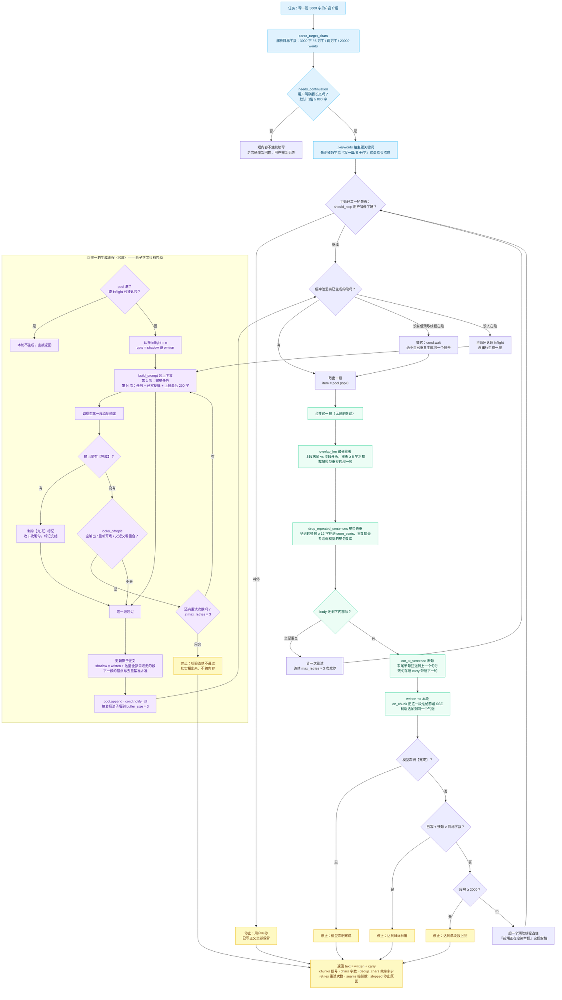

# 输出续写合并流程图

> 「输出无限」的全部机关都在这一张图里：载体把一份长文拆成多次请求，再把每次的产出**无缝**接起来。
> 对应实现：`core/continuation.py` 的 `generate_unlimited`。

**三条"不这么做就会翻车"的设计**：

1. **只允许一条生成线程**。预取第 N+1 段必须知道第 N 段写了什么（要当衔接锚点，还要当去重基准）。
   如果让预取线程和主循环同时产出，后到的那段锚点是过期的 → 接缝错位、还白烧一次模型调用。
   第 3 步实测撞上过：段号出现 `[1,2,2]`。现在用 `inflight` 认领 + 条件变量把这件事钉死。
2. **接缝裁剪不够，还得整句去重**。`overlap_len` 只裁得掉**接缝那一句**；4B 模型"接着写"时常见的
   是第二、三句又把同一句话抄一遍，只裁接缝正文里照样留重复句，用户一眼就看出是拼的。
3. **`【完成】` 必须在偏题校验之前处理**。模型说完成了就是完成了，不能让"风格校验"把它的收尾句
   当成跑题丢掉——第 3 步单测抓到的第二只虫子。

**停止条件是五路并联**，任何时候只要命中一路就停，且**停止原因如实返回**（`stopped`）：
用户叫停 / 模型声明【完成】/ 达到目标字数 / 单段数上限 2000 / 整体校验连续不通过。

> 实测（`logs/_step3_run.log`）：`长文续写：3 段 / 3507 字 / 去重裁掉 22 / 重试 0 /
> 停止=达到目标长度（3000 字） / 耗时 46.5s`。
>
> 配套阅读：[03-data-flow.md](03-data-flow.md)（它在整条链里的位置）、
> [six-infinity.md](../six-infinity.md)（验收判据与已知局限）。
