# 图 5 · 输入无限：入口切片 + 循环 + 拼装

| 项 | 内容 |
| --- | --- |
| 适用版本 | v1.0 |
| 最后更新 | 2026-09-14 |
| 维护者 | 小焦项目 |
| 文档状态 | 稳定 |

**摘要**：用户能贴任意长度的内容，而模型单次只装得下 2 万 token 左右；
载体在入口就把输入切片、逐片处理、落盘、拼装，模型每次只处理"当前这一片"。

配色与术语约定见 [01-overview.md](01-overview.md) 的「图册约定」。

## 1. 图 5 · 从超长输入到一份完整结果

```mermaid
flowchart TB
    %%{init: {"themeVariables": {"fontSize": "14px"}, "flowchart": {"htmlLabels": true, "wrappingWidth": 320, "nodeSpacing": 46, "rankSpacing": 64, "useMaxWidth": true}}}%%
    U["用户贴进来一大段<br/>可能还带一句要求"]
    ENTRY{"_needs_input_split<br/>_estimate_tokens 超过 5000 吗？"}
    NORMAL["普通输入<br/>照常走单次回答"]

    subgraph TASKG["先把要求与内容分开"]
        direction TB
        TASK["split_task<br/>第一段 ≤ 200 字且总段数 ≥ 3 判为要求<br/>或第一段 ≤ 60 字且总段数 ≥ 2"]
        TASK2["找不到明显要求时<br/>用一句通用要求兜底"]
    end

    subgraph SLICEG["切分单元：按段落，必要时退到句边界"]
        direction TB
        SPLIT{"split_input<br/>整篇 token ≤ max_chunk 吗？"}
        ONE["单片直接返回<br/>短输入不切片，用户无感"]
        PARA["split_paragraphs 按空行或换行切段<br/>一段完整的话比刚好凑满上限重要"]
        EACH{"这一段自己就超限吗？"}
        UNIT["作为一个切分单元"]
        OVERSIZE["_split_oversize 先退到句边界<br/>_SENT_SPLIT 按 。！？!?；;… 切<br/>单句还超长才硬切"]
        HARD["_hard_split 按字符比例硬切<br/>留 0.85 安全余量"]
    end

    subgraph ACCG["装片：把单元按顺序累加"]
        direction TB
        ACC["累加装片<br/>粘合开销也算：每多粘一段多一个换行分隔"]
        FULL{"当前片 + 分隔 + 本段 > max_chunk？"}
        SEAL["封片，开新片"]
        KEEP["并进当前片"]
        SAFETY["逐片复验<br/>任何一片仍超限就硬切"]
    end

    subgraph LOOPG["逐片循环处理"]
        direction TB
        LOOP["逐片处理<br/>system 用完整版"]
        PROMPT["每片的 prompt<br/>用户的要求 + 这是一份长材料的一段（全文共 N 段）<br/>只处理这一段，不要重复上一段结论"]
        LLM["调模型处理这一片"]
        SAVE["save_chunk 落 logs/_chunks/"]
        PROG["on_progress 回调<br/>宿主只推 progress 事件"]
        MORE{"还有下一片吗？"}
    end

    MERGE["merge_outputs 拼装<br/>跨片整句去重后再用换行分隔接起来"]
    OUT["一份完整结果"]
    FE["前端<br/>只显示正在处理，不显示第 X/Y 片"]

    U --> ENTRY
    ENTRY -->|没超| NORMAL
    ENTRY -->|超了| TASK
    TASK --> TASK2 --> SPLIT
    SPLIT -->|是| ONE
    SPLIT -->|否| PARA
    PARA --> EACH
    EACH -->|没超| UNIT
    EACH -->|超了| OVERSIZE
    OVERSIZE --> HARD --> UNIT
    UNIT --> ACC --> FULL
    FULL -->|是| SEAL
    FULL -->|否| KEEP
    SEAL --> SAFETY
    KEEP --> SAFETY
    SAFETY --> LOOP
    LOOP --> PROMPT --> LLM --> SAVE --> PROG --> MORE
    MORE -->|有| PROMPT
    MORE -->|没有| MERGE
    MERGE --> OUT
    PROG --> FE
    ONE --> OUT

    style U fill:#4A90E2,color:#fff
    style OUT fill:#4A90E2,color:#fff
    style ENTRY fill:#F5A623,color:#fff
    style SPLIT fill:#F5A623,color:#fff
    style EACH fill:#F5A623,color:#fff
    style FULL fill:#F5A623,color:#fff
    style MORE fill:#F5A623,color:#fff
    style HARD fill:#F5A623,color:#fff
    style NORMAL fill:#7ED321,color:#fff
    style ONE fill:#7ED321,color:#fff
    style SAFETY fill:#7ED321,color:#fff
    style SAVE fill:#7ED321,color:#fff
    style MERGE fill:#7ED321,color:#fff
```

**一句话说明**：切片在入口一次性完成并按"不变量"收口校验，之后逐片处理只是重复同一个 prompt 模板，
最后跨片去重拼成一份结果——用户看到的是完整总结，不是"第 3/5 片"。

## 2. 代码位置索引

核心实现位于 `core/input_splitter.py`，宿主侧只做分流与回调适配：

| 节点 | 代码位置 |
| --- | --- |
| 入口分流 | `xiaojiao_app.py` → `agent_run`（第 6725 行）中的 `_needs_input_split`（第 2215 行）、`_process_long_input`（第 2223 行） |
| 要求与内容分离 | `core/input_splitter.py` → `split_task`（第 126 行） |
| 切分单元 | `split_input`（第 76 行）、`split_paragraphs`（第 44 行）、`_split_oversize`（第 63 行）、`_hard_split`（第 50 行）、`_SENT_SPLIT`（第 21 行） |
| 装片与复验 | `split_input` 内的累加循环与末尾复验（第 101–123 行） |
| 逐片处理 | `process_long_input`（第 187 行）；prompt 模板见第 203–206 行 |
| 落盘 | `save_chunk`（第 152 行），落 `logs/_chunks/` |
| 进度回调 | `on_progress(done, total)`（第 217–221 行）；宿主 `_on_progress`（`xiaojiao_app.py` 第 8686 行，只推 `{"type":"progress"}`） |
| 拼装 | `merge_outputs`（第 168 行），内部调用 `core/continuation.py` → `drop_repeated_sentences`（第 181 行） |
| 上限参数 | `DEFAULT_MAX_CHUNK = 5000`（第 25 行）；宿主可用 `CAP.input_split_threshold` 与 `CAP.input_split_chunk` 覆盖 |
| 返回值 | 第 222 行的 dict：`answer` / `slices` / `tokens_in` / `elapsed_s` / `chunk_files` |

## 3. 四条硬要求，以及各自的实测理由

| 硬要求 | 实现 | 不这么做会怎样 |
| --- | --- | --- |
| 按段落边界切，绝不切在句中 | `split_paragraphs` 优先，超长段落才退到句边界 | 半句单独喂给模型，它会当成残缺输入去猜，输出跟着残 |
| 超长单段退到句边界，单句仍超长才硬切 | `_split_oversize` → `_hard_split` | 直接硬切会把一句话劈成两半，两片各自得到残缺意思 |
| 硬切留 0.85 字符余量 | `_hard_split` 的 `per` 计算 | 字符数到 token 是线性估计，不留余量时切出 `5010 > 5000` |
| 粘合开销算进累加 | `sep_tok = _estimate("\n\n")` | 只累加各段自己的 token 时 `sum=4988` 拼出来实际是 `5003` |

最后一道保险是逐片复验：任何一片仍超限就硬切，这样"每片 ≤ max_chunk"是**不变量**而不是"通常成立"。

## 4. 实测记录

切片正确性与整条流水线由 `python tools/test_input_infinity.py` 覆盖（27 项全通过）：

| 判据 | 实测 |
| --- | --- |
| 10 万字级文档 | 27 片，原文 98840 字 / 拼回 98840 字，观测最大片 4922 token |
| 50 万字级文档 | 133 片，原文 493080 字 / 拼回 493080 字，观测最大片 4922 token |
| 无片切在句中 | 片尾全部落在句末标点或段落结束 |
| 没有空行的超长单段 | 也能切开，切开后不丢字 |
| 拼装去重 | 相邻片复述同一结论时只留一份，不同内容都保留 |
| 进度回调 | 只传数字，不携带技术文案 |
| 切片耗时 | 50 万字切片 0.13s（要求 < 5s） |

真实模型端到端的历史验收记录：一份 17326 字 / 22778 token 的文档切成 5 片，
5 片 token 为 `[4888, 4895, 4909, 4909, 3156]`，最大 4909 ≤ 5000，输出 923 字摘要，耗时 16.4s。

## 5. 边界与限制

| 边界 | 说明 |
| --- | --- |
| 要求识别是启发式 | `split_task` 用"首段很短 + 段数够多"判定，判错时首段会被当成内容一起切片；找不到明显要求则用通用要求兜底 |
| 片数上限没有硬性上限 | 50 万字会切成 133 片，意味着 133 次模型调用；处理时间随输入线性增长 |
| 进度回调参数会泄漏片数 | `on_progress(done, total)` 本身带着片号与总片数，是**宿主**在 `_on_progress` 里丢弃它们、只推 `{"type":"progress"}`；换宿主时必须同样处理 |
| 提示词里写了总段数 | 每片 prompt 含"全文共 N 段"，并明确要求不要写"以下是第几段"；模型仍有极小概率把段号带进正文 |
| 落盘是运行产物 | `logs/_chunks/` 随 `logs/` 一起被 `.gitignore` 忽略，仅供本机核对与续跑 |
| 逐片处理是有损的摘要链路 | 每片只看到自己那一片，跨片的关联结论依赖 `merge_outputs` 的去重与拼接，载体不做全局重排 |

## 6. 相关阅读

- [03-data-flow.md](03-data-flow.md)：本图在整条数据流里的位置（阶段 1）
- [04-output-continuation.md](04-output-continuation.md)：输出侧复用同一套接缝处理
- [six-infinity.md](../six-infinity.md)：输入无限的验收判据与已知局限

## 变更记录

| 日期 | 版本 | 变更 |
| --- | --- | --- |
| 2026-09-14 | v1.0 | 重写：对齐代码 + 统一文风 |
