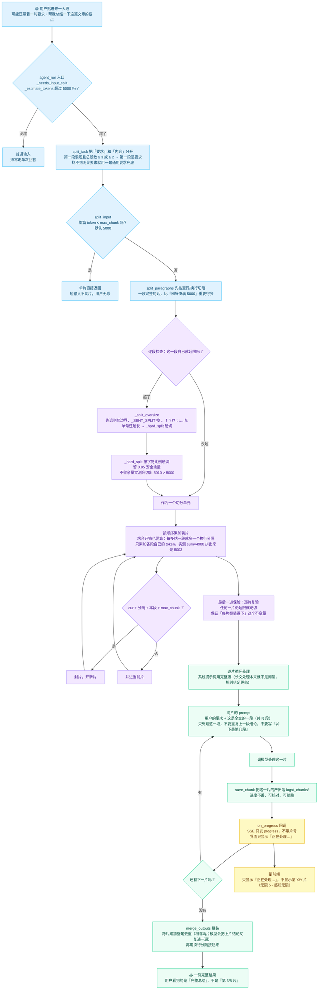

# 输入切片流程图

> 「输入无限」——用户能贴任意长度（10 万字文章、50 万字报告），模型单次只装得下 2 万 token。
> 载体的解法是：**在入口就切片、循环、落盘、拼装**；模型每次只处理"当前这一片"。
> 对应实现：`core/input_splitter.py` 的 `split_task` / `split_input` / `process_long_input`。

**切片的硬要求（以及为什么）**：

- **按段落边界切，绝不切在句中**。半句单独喂给模型，它会当成"残缺输入"去猜，输出就跟着残。
- **段落本身超长 → 退到句边界；单句还超长 → 才硬切**，而且要留 `0.85` 的字符余量：
  字符数到 token 是线性估计，边界上会差几个 token。第 4 步单测实测——不留余量时切出来 `5010 > 5000`，
  差一点点也是超。
- **粘合开销必须算进累加**。每多粘一段就多一个 `\n\n`。第 4 步单测实测：只累加各段自己的 token，
  `sum=4988` 拼出来实际是 `5003` —— 照样超。
- **最后一道保险不能省**。累加逻辑再对，也可能有边界情况；收尾逐片复验一次，
  "每片 ≤ max_chunk" 才是**不变量**而不是"通常成立"。
- **`on_progress(done, total)` 故意不暴露片数**。这是无限 5 的要求：界面只显示"正在处理"，
  用户看不到"第 X/Y 片"这种技术痕迹。

> 实测（`logs/xiaojiao.log`）：`长输入切片：22778 token → 拆成 5 片处理 / 输出 923 字 / 耗时 16.4s`
> —— 那份输入是 17326 字，切出的 5 片 token 分别是 `[4888, 4895, 4909, 4909, 3156]`，最大 4909 ≤ 5000。
>
> 切片正确性单测（`python logs/_step4_unit.py`，本文编写时复跑：通过 15 / 失败 0）：
> 20006 字 / 25934 token → 6 片；66907 字 / 86485 token → 18 片；
> 两种规模**每片 ≤ 5000 token（观测最大都是 4930）**、半句收尾 0 片；
> 极长单段也能切（9 片，最大 4843）；拼回去长度一致（64907 vs 64907）。
>
> 配套阅读：[03-data-flow.md](03-data-flow.md)、[six-infinity.md](../six-infinity.md)。
