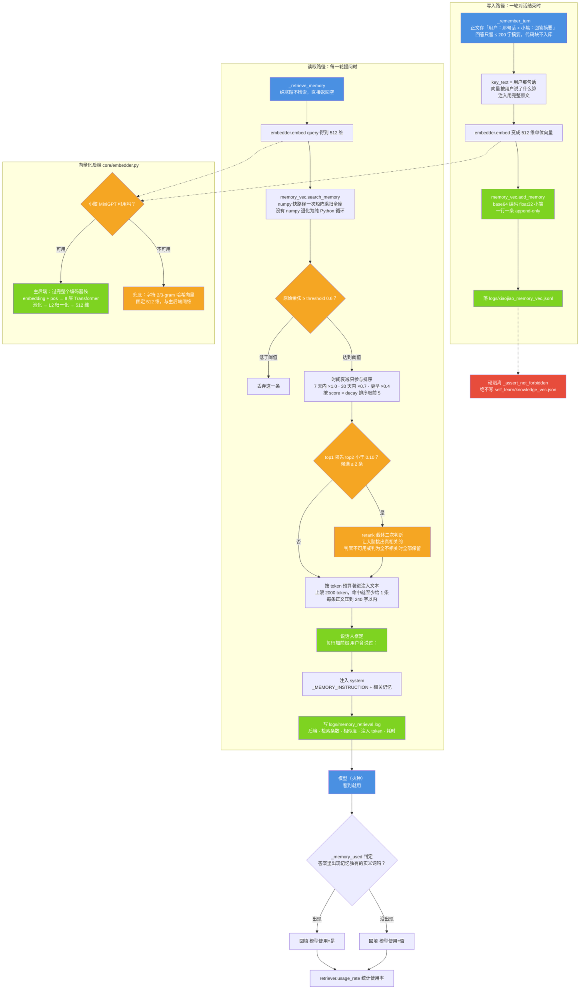

# 图 6 · 记忆无限：写入与读取两条路径

| 项 | 内容 |
| --- | --- |
| 适用版本 | v1.0 |
| 最后更新 | 2026-09-14 |
| 维护者 | 小焦项目 |
| 文档状态 | 稳定 |

**摘要**：记忆无限由两条路径组成——写入路径把每一轮对话永久存进外部向量库，
读取路径每轮按查询检索 top-K 并注入 system；两条路径都在载体层完成，模型只负责"看到就用"。

配色与术语约定见 [01-overview.md](01-overview.md) 的「图册约定」。

## 1. 图 6 · 写入路径、读取路径与向量化后端

**一句话说明**：写入路径把每一轮压缩成一条 append-only 记录，读取路径用"原始余弦判阈值、
时间衰减管排序"两把尺子选出要注入的记忆，中间可选一次载体二次判断来剔除反义与无关项。

## 2. 代码位置索引

| 节点 | 代码位置 |
| --- | --- |
| 写入入口 | `xiaojiao_app.py` → `_remember_turn`（第 2012 行），在 `agent_run` 出口调用 |
| 写入索引键 | `core/memory_vec.py` → `add_memory(..., key_text=...)`（第 121 行） |
| 追加落盘 | `core/memory_vec.py` → `_VS_PATH`（第 33 行）、`_pack`（第 42 行，base64 + float32 小端）、`reload`（第 87 行） |
| 硬隔离 | `core/memory_vec.py` → `_assert_not_forbidden`（第 55 行），目标为 `self_learn/knowledge_vec.json` |
| 向量后端 | `core/embedder.py` → `DIM = 512`（第 92 行）、`_resolve_backend`（第 269 行）、`_embed_minigpt`（第 212 行）、`_embed_hash`（第 253 行）、`_MAX_CHARS = 1024`（第 94 行）、`_CALIB_ALPHA = 0.15`（第 97 行） |
| 读取入口 | `xiaojiao_app.py` → `_retrieve_memory`（第 1946 行）；参数由 `_memory_cfg`（第 1938 行）从 `CAP` 读取 |
| 检索与阈值 | `core/retriever.py` → `retrieve`（第 110 行）、`TOP_K = 5` / `THRESHOLD = 0.6` / `MAX_TOKENS = 2000`（第 37–39 行） |
| 时间衰减 | `core/retriever.py` → `decay`（第 80 行）、`DECAY_7D / DECAY_30D / DECAY_OLD`（第 40–42 行） |
| 余弦扫描 | `core/memory_vec.py` → `search_memory`（第 225 行） |
| 载体二次判断 | `core/retriever.py` → `rerank`（第 242 行）、`RERANK_GAP = 0.10`（第 67 行）、`RERANK_MIN_HITS = 2`（第 57 行）、`RERANK_MAX = 5`（第 58 行）、`_ask_brain`（第 214 行） |
| 注入文本装配 | `core/retriever.py` → `retrieve` 的装片循环（第 184–200 行）；`xiaojiao_app.py` → `_MEMORY_INSTRUCTION`（第 1931 行）、`sys_text` 拼接（第 7131–7133 行） |
| 检索日志 | `core/retriever.py` → `log_retrieval`（第 284 行）、`_LOG_PATH`（第 33 行，`logs/memory_retrieval.log`） |
| 使用回填 | `xiaojiao_app.py` → `_memory_used`（第 1990 行）、`_MEMORY_LAST`（第 1935 行）；`core/retriever.py` → `record_usage`（第 303 行）、`usage_rate`（第 316 行） |

## 3. 关键设计取舍：阈值判原始余弦，衰减只参与排序

若把衰减乘进阈值判定：一条 0.85 分的老记忆衰减 0.4 之后只剩 0.34 < 0.6，会被丢掉，
"三年前说的那件事"就再也检索不到——正好打死无限 ① 的招牌场景。所以拆开用：

- **阈值只判原始余弦**（这条到底相不相关），判据在 `memory_vec.search_memory` 的 `threshold` 参数上；
- **时间衰减只参与排序**（同样相关时优先想起最近的），排序键是 `score × decay`。

相关的两个实现细节：

- `search_memory` 传给 `retrieve` 的候选数是 `max(top_k × 3, top_k)`，即先取 15 条候选，
  再由 `retrieve` 排序截到 5 条；
- 载体二次判断（`rerank`）只在"候选 ≥ 2 条且 top1 与 top2 的分差 < 0.10"时才触发。
  这个闸门按"精排能不能改变结果"开门：分差小正是反义/无关混进来的典型形状
  （实测"我喜欢蓝色"0.90 与"我讨厌蓝色"0.88 只差 0.02）。判官不可用、解析不出来、
  或判为"全部不相关"时，一律放行全部候选——保守保留，不因为判官挂了就丢记忆。

## 4. 三个真实踩坑

1. **注入的记忆没有说话人框定** → 模型把「我叫张三」当成在说它自己，回答"你叫小焦"。
   修法：`_MEMORY_INSTRUCTION` 写明"记忆里的「我」= 用户，不是指你小焦"，注入行加前缀「用户曾说过：」，
   正文本身已是「用户：…／小焦：…」格式时不再叠前缀。
2. **`detect_tool_intent` 用光杆动词"写"判"要新建"** → 问句「我平时最喜欢用什么语言写代码」
   被判成 `write_file`，再被转成 `run_command whoami`，把用户名总结成"已创建 jiao 文件夹"。
   答非所问还谎报执行。修法：新建类判据只认带宾语的动作短语。
3. **写入路径存了整段回答** → 均值池化按长度加权，用户那句短话被几百字寒暄淹掉，
   余弦掉到阈值以下、注入 0 条。修法：`add_memory(..., key_text=用户那句话)`，
   回答只存 ≤ 200 字摘要。

## 5. 实测记录

检索侧由 `python tools/test_memory_recall.py --no-model` 覆盖（用临时库、不碰真实记忆、不调模型）。
本文编写时连跑两次，两次的结论一致、数字有波动，如实记录：

| 指标 | 要求 | 第 1 次复测 | 第 2 次复测 |
| --- | --- | --- | --- |
| 后端 / 维度 | — | `minigpt` / 512 | `minigpt` / 512 |
| 命中率 | ≥ 80% | 5/5 = 100% | 5/5 = 100% |
| 最相似那条的原始余弦 | — | 0.700 / 0.772 / 0.671 / 0.862 / 0.650 | 同左 |
| 纯向量检索延迟 | < 100ms | 平均 6.2ms / 最大 11.1ms | 平均 7.9ms / 最大 13.6ms |
| 含载体二次判断的总延迟 | < 800ms | 平均 356.5ms / 最大 1752.8ms（3/5 次触发精排） | 平均 2124.4ms / 最大 10581.7ms（5/5 次触发精排） |

两处与旧记录不同，按现状如实记录：

- 旧记录只有"检索延迟 2.8~3.3ms"一个数，那是**纯向量**那一段；加了载体二次判断之后，
  该脚本已把延迟拆成"向量层守 100ms、含精排总计守 800ms"两条判据。
- 两次复测的含精排总延迟都超过了脚本自带的 800ms 判据（脚本整体因此判为未通过），
  且两次差异很大。精排要调一次大脑，受"本轮是否触发精排"与大脑响应速度影响，
  不是向量层的问题；命中率与向量层延迟两项在两次复测里都达标。

embedding 后端对比（同样 20 条记忆）的既有记录：

| 抽取方式 | rank-1 命中 | 最相似那条的分数 | 无关项最高分 |
| --- | --- | --- | --- |
| 只用 `nn.Embedding` 那一层 | 4/5 | 0.49~0.66 | 0.52 |
| 过完整个编码器栈 | 5/5 | 0.72~0.85 | ≤ 0.72 |

两者都是 512 维，载体选更能干活的那个。`_MAX_CHARS = 1024` 的作用是保证"前 500 字相同、
结尾不同"的两条文本不会被截成同一串（截 512 时那两条余弦恒为 1.0000）。

## 6. 边界与限制

| 边界 | 说明 |
| --- | --- |
| 库的硬隔离 | 对话记忆只能写 `logs/xiaojiao_memory_vec.jsonl`；指向 `self_learn/knowledge_vec.json` 会直接抛 `RuntimeError` |
| 寒暄不检索 | `_retrieve_memory` 对纯寒暄直接返回空串（省预填充），有实义的问题照常检索 |
| 字级表示的边界 | 主后端是字符级小脑模型，反义对（喜欢/讨厌 0.904）的余弦比近义对还高，0.6 的阈值挡不住这类情况，这是载体二次判断存在的原因 |
| 二次判断是"加分项" | 它要调一次大脑（实测给检索加了数百毫秒），失败一律放行全部候选；`RERANK_GAP` 让它只在排名含糊时才触发 |
| 降级不中断 | 小脑不可用时自动退化到字符哈希向量（同 512 维）；检索、写库、回填任何一步失败都不影响这一轮对话 |
| 冷启动 | 首次加载索引或小脑模型时单次检索会出现百毫秒到秒级的冷启动（旧记录里出现过 416.7ms / 538.0ms，本次复测里出现过单次 10.6s 的精排），之后同一进程内的检索是毫秒级；把"冷启动单次"与"稳态延迟"混在一起看会误判 |

## 7. 相关阅读

- [03-data-flow.md](03-data-flow.md)：检索在整条数据流里的位置（阶段 2）与出口回写
- [07-tool-on-demand.md](07-tool-on-demand.md)：记忆检索与工具装载同属"按需装配"
- [six-infinity.md](../six-infinity.md)：记忆无限的验收判据与已知局限

## 变更记录

| 日期 | 版本 | 变更 |
| --- | --- | --- |
| 2026-09-14 | v1.0 | 重写：对齐代码 + 统一文风 |
