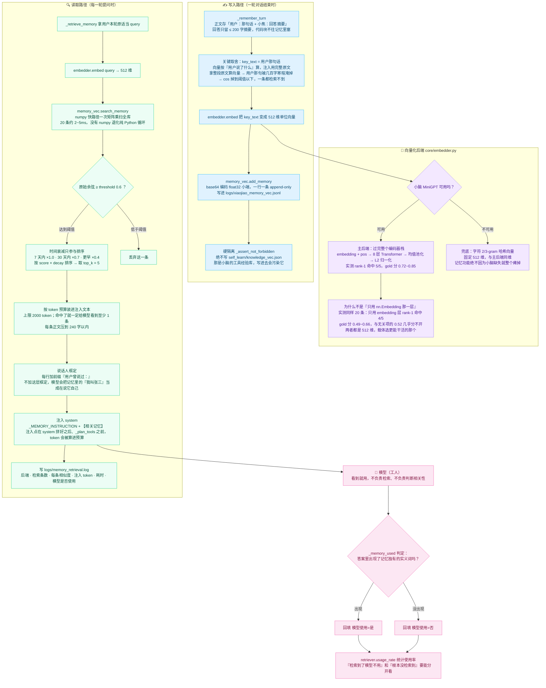

# 记忆检索流程图

> 「记忆无限」有两条路：**写入**（把每一轮对话永久存进外部向量库）和**读取**（每轮按需检索 top-K 注入）。
> 两条路都完全在载体层完成，模型只负责"看到就用"。对应实现：
> `core/embedder.py` + `core/memory_vec.py` + `core/retriever.py` + `xiaojiao_app.py` 的
> `_remember_turn` / `_retrieve_memory`。

**一条最关键的设计取舍：阈值判在"原始余弦"上，时间衰减只参与排序。**

Spec 的原话是"余弦相似度 + 时间衰减，阈值 0.6"。如果**把衰减乘进阈值判定**，会出事：
一条 0.85 分的老记忆，衰减 0.4 之后只剩 0.34 < 0.6 → 被丢掉。
那"三年前说的那个事"就**永远检索不到**了 —— 正好打死无限 1 的招牌场景。

所以这里拆开用：

- **阈值只判原始余弦**（判"这条到底相不相关"）——相关就是相关，跟多久以前无关；
- **时间衰减只参与排序**（同样相关时，优先想起最近的）——这才是我们真正想要的人类式记忆：
  老的能想起来，但新的更靠前。

**另外三个真实踩坑（都在这一步撞出来的）**：

1. **注入的记忆没有"说话人框定"** → 模型把「我叫张三」当成在说它自己，回答"你叫小焦"。
   修法：`_MEMORY_INSTRUCTION` 写明"记忆里的「我」= 用户，不是指你小焦"，注入行加前缀「用户曾说过：」。
2. **`detect_tool_intent` 用光杆动词"写"判"要新建"** → 问句「我平时最喜欢用什么语言**写**代码」
   被判成 `write_file`，让模型转成 `run_command whoami`，把用户名 "jiao" 总结成"已创建 jiao 文件夹"。
   **答非所问还谎报执行**。修法：新建类判据只认带宾语的动作短语，不认光杆"写"。
3. **写入路径存了整段回答** → 均值池化按长度加权，用户那句短话被几百字寒暄淹掉，cos 掉到阈值以下、注入 0 条。
   修法：`add_memory(..., key_text=用户那句话)`。

> 实测（`python tools/test_memory_recall.py`）：命中率 5/5 = 100%、使用率 5/5 = 100%、平均检索延迟 4.5ms
> （要求 < 100ms）。本文编写时复跑检索侧（`--no-model`，临时库、不调模型，退出码 0）：
> 后端 `minigpt` / 512 维，命中率 **5/5 = 100%**，gold 原始余弦 0.663~0.852，
> 延迟**平均 2.8~3.3ms / 最大 5.0ms**。
>
> 实测（`logs/_step2_live.py`）：20 轮无关对话冲淡后，问「我叫什么」仍检索命中「张三」
> 3 条 / 739 token，回答"你叫 **张三**"，延迟 5.1ms。
>
> 配套阅读：[six-infinity.md](../six-infinity.md) 的"已知局限"一节 —— 检索日志里也出现过
> 416.7ms / 538.0ms 的冷启动单次，以及无关问题拿到 0.6 以上相似度的情况，都如实记录了。
